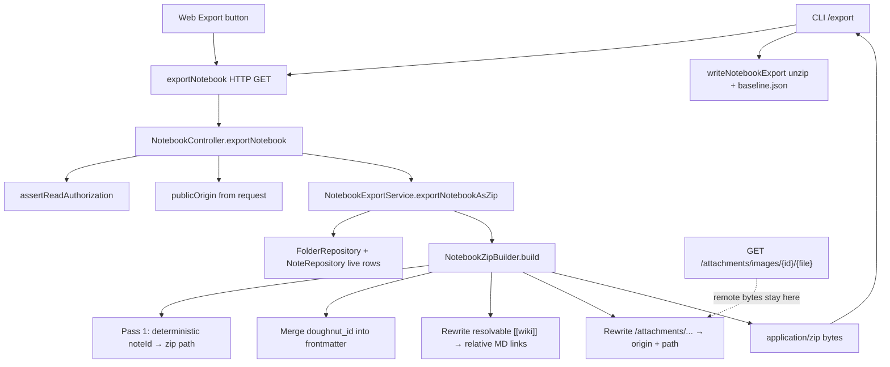

# Phase 8: Resolve pull/export (story 1) - Research

**Researched:** 2026-08-03
**Domain:** Backend notebook Markdown zip export (identity frontmatter, wiki→relative links, remote attachment URLs) + CLI `/export` E2E proof
**Confidence:** HIGH (in-repo export pipeline and gaps); MEDIUM (exact attachment origin extraction / alias-resolution depth)

<user_constraints>
## User Constraints (from CONTEXT.md)

### Locked Decisions
- **D-01:** Restore stable identity as frontmatter key `doughnut_id` with value = note numeric id (string form matching prior export plan). Every exported note file must include it. — **Reversibility:** costly — push, lint, and sync preview/pull will treat this key as the portable identity contract; renaming later forces multi-surface rework.
- **D-02:** Merge identity into existing author-authored property frontmatter when present; if a note has no frontmatter, emit a minimal `doughnut_id`-only YAML block. Do not strip participant-intended author properties solely to inject id. — **Reversibility:** reversible — merge policy can be tightened later without breaking the `doughnut_id` contract.
- **D-03:** Phase 8 closes **all three** TRIAGE Story 1 gaps in this phase: (1) stable identity, (2) internal refs → ordinary Markdown links, (3) attachment refs remain usable while attachments stay remote. Partial “identity-only” is not enough for EXP-01. — **Reversibility:** costly — shipping identity without link/attachment proofs leaves EXP-01 incomplete and invites a second Story 1 phase.
- **D-04:** Wiki/internal note references in exported bodies are rewritten to ordinary relative Markdown links targeting the deterministic exported paths. Unresolvable targets get a documented, consistent fallback (researcher/planner pick exact algorithm; must be E2E-observable).
- **D-05:** Attachments are not copied into the zip; attachment references in note bodies are rewritten (or already emitted) so they remain usable as remote URLs after export. Prove with E2E under `cli_export.feature` (or equivalent capability E2E).
- **D-06:** Primary strengthen lands in backend zip construction (`NotebookZipBuilder` / export pipeline) so HTTP export and CLI `/export` share one zip shape. CLI proves end-to-end via `/export` + `cli_export.feature` + existing unit coverage; do not duplicate identity/link rewrite in the CLI unzip path. — **Reversibility:** costly — splitting rewrite across backend and CLI creates dual sources of truth for Stories 2–3 zip consumers.
- **D-07:** Do not change `applyPull` / preview-before-pull behavior in this phase. Touch shared modules (`exportNotebook`, `unzip`, baseline seed, registry) only when required to keep `/export` green or to honor the identity contract already seeded at export. Story 2–3 dossier actions stay deferred. — **Reversibility:** reversible — later phases still own those shared strengthen rows.
- **D-08:** Strengthening may reverse in-scope participant choices that removed identity (e.g. Eric Yeh “no id of its own”) because HYG-02 only protects Terry Yin / Tan Yeong Sheng — not LIA participant commits. Do not rewrite Terry/YS-owned hunks.

### Claude's Discretion
- Exact wiki-link resolution / path-mapping algorithm and attachment URL shape (as long as D-04/D-05 hold and E2E proves them)
- Unit vs E2E split for zip-builder edge cases; how many plans under **standard** granularity
- Whether title `# heading` + frontmatter merge ordering needs a tiny helper extract (keep cohesion with `NoteLeadingFrontmatter`)

### Deferred Ideas (OUT OF SCOPE)
- Story 2 preview reserved/duplicate/invalid-mapping reporting — Phase 9
- Story 3 incremental `applyPull` create/rename/move + metadata — Phase 10
- Stories 7–10 (create/rename/move/reconcile) — out of milestone
- SEED-001 spelling follow-ons — parked
</user_constraints>

<phase_requirements>
## Phase Requirements

| ID | Description | Research Support |
|----|-------------|------------------|
| EXP-01 | Kept or strengthened pull/export behavior matches story 1 acceptance (hierarchy, identity frontmatter, indexes, links, no secrets, failed pull not presented as success) — or the incomplete/incorrect path is removed cleanly | Strengthen path only (TRIAGE verdict). Close three gaps in `NotebookZipBuilder` (+ thin service/controller plumbing): `doughnut_id` merge, wiki→relative MD links, absolute remote attachment URLs. Prove via `NotebookZipBuilderTest` + `cli_export.feature`. Leave already-matching bullets (hierarchy, `index.md`, sync-state separation, failed export error) intact. |
| HYG-02 | Standing: do not touch Terry Yin / Tan Yeong Sheng changes | Edit participant-owned export surfaces (`NotebookZipBuilder`, tests, `cli_export.feature`). Prefer new helpers under `notebookExport/`. Do not rewrite `Frontmatter.java` (Terry-authored). Do not change `applyPull` / Story 2–3 modules except if `/export` green requires it (D-07). |
</phase_requirements>

## Summary

Phase 8 applies TRIAGE Story 1 **strengthen**: the CLI `/export` path already delivers hierarchy, `index.md`, `.doughnut-sync` separation, and failure reporting, but the shared zip from `NotebookZipBuilder` currently emits author frontmatter **without** `doughnut_id`, passes wiki links through unchanged, and leaves root-relative `/attachments/images/...` paths that are not usable as remote URLs outside the Doughnut origin.

Primary work is backend zip construction so HTTP export and CLI `/export` share one shape (D-06). Restore `doughnut_id` by **merging** into verbatim author frontmatter (D-01/D-02) — reversing Eric Yeh’s id removal without reintroducing the earlier “strip all properties” behavior. Add a two-pass path map + wiki rewrite to relative Markdown links, and rewrite attachment paths to absolute remote URLs using the request’s public origin. Prove all three gaps with backend unit tests and new `cli_export.feature` scenarios; do not duplicate rewrite logic in the CLI unzip path.

**Primary recommendation:** Extend `NotebookZipBuilder.build` (and thin `NotebookExportService` / controller callers) with notebook name + public origin; implement identity merge + link/attachment rewrite inside the zip pipeline; cover edges in `NotebookZipBuilderTest`; add three focused E2E scenarios under `cli_export.feature`. Plan as **two** standard-granularity plans (backend zip strengthen → CLI E2E proofs).

## Architectural Responsibility Map

| Capability | Primary Tier | Secondary Tier | Rationale |
|------------|-------------|----------------|-----------|
| Stable `doughnut_id` in exported note files | API / Backend (`NotebookZipBuilder`) | — | Zip is the portable contract; CLI only unzips bytes (D-06). |
| Wiki/internal → relative Markdown links | API / Backend (`NotebookZipBuilder`) | Algorithms (`WikiLinkMarkdown`, `WikiLinkTargetReference`) | Must target deterministic zip paths; shared by HTTP + CLI. |
| Attachment refs as usable remote URLs | API / Backend (zip + request origin) | CDN/Static serving (`AttachmentController` at `/attachments`) | Blobs stay on server; export rewrites refs only (D-05). |
| CLI `/export` write + baseline seed | Browser/Client N/A — CLI | Backend zip | Unzip/write only; no second rewrite (D-06/D-07). |
| Hierarchy / `index.md` / failure reporting | Already healthy | — | Keep; do not regress (TRIAGE matches). |
| Sync preview / `applyPull` | Deferred (Phases 9–10) | — | D-07: do not change this phase. |

## Project Constraints (from .cursor/rules/)

| Directive | Source | Implication for Phase 8 |
|-----------|--------|-------------------------|
| Behavior vs Structure; one observable behavior per phase; stop-safe | `planning.mdc` | Phase already scoped as one Behavior (EXP-01 strengthen). Do not smuggle Story 2–3 work. |
| ~5 min slice fuzzy; >10 min finer-decompose | `planning.mdc` | Split identity / links / attachments into testable units inside plans; keep commits small. |
| After phase: Jidoka → post-change-refactor → update plan → commit+push | `gsd-coexistence.mdc` / execute-plan | Planner must leave wrap-up tasks. |
| Run tooling via `CURSOR_DEV=true nix develop -c …`; assume `pnpm sut` running | `general.mdc` / agent-map | Backend + Cypress commands use Nix prefix. |
| Backend tests: prefer behavior; pure algorithms may unit-test; `makeMe` for DB | `backend-testing.mdc` | `NotebookZipBuilder` is pure — extend `NotebookZipBuilderTest`. Prefer `pnpm backend:test_only` when no migration. |
| Backend: import statements; cohesion; no speculative layers | `backend-code.mdc` | Prefer helpers beside zip builder; avoid Spring in pure zip algorithm. |
| E2E: capability-named features; targeted `--spec`; `@wip` until green; no `@focus`/`@only` commit | `e2e-authoring.mdc` / `planning.mdc` | Extend `cli_export.feature`; run only that spec locally. |
| CLI: thin steps; observable behavior; no duplicate domain rewrite in CLI for zip shape | `cli.mdc` + D-06 | Keep rewrite in backend zip. |
| ADRs: load Accepted ADRs; no silent conflict | `architecture-decisions.mdc` | No Accepted ADR constrains export zip shape beyond general ADR process. |
| HYG-02 standing | REQUIREMENTS / CONTEXT | Do not rewrite Terry/YS-owned files (notably avoid editing `Frontmatter.java`). |

## Standard Stack

### Core

| Library / component | Version / location | Purpose | Why Standard |
|---------------------|--------------------|---------|--------------|
| `NotebookZipBuilder` | in-repo | Pure zip assembly | Already the shared portable shape [VERIFIED: `NotebookZipBuilder.java:14-47`] |
| `NoteLeadingFrontmatter.splitVerbatim` | in-repo | Preserve author YAML fences | Current export path [VERIFIED: `NotebookZipBuilder.java:94-99`] `NoteLeadingFrontmatter.splitVerbatim(rawContent)` |
| `NotebookExportFilenames` | in-repo | Sanitize + collision-safe names | Deterministic paths [VERIFIED: `NotebookExportFilenames.java:14-34`] |
| `WikiLinkMarkdown.INNER_LINK_PATTERN` / `splitInner` | in-repo | Parse `[[…]]` | Product wiki syntax [VERIFIED: `WikiLinkMarkdown.java:15-44`] `Pattern.compile("\\[\\[([^\\]]+)]]")` |
| `WikiLinkTargetReference.forToken` | in-repo | Qualified / unqualified target parse | Same token rules as resolver [VERIFIED: `WikiLinkTargetReference.java:12-25`] |
| `AttachmentController` `/attachments/images/{image}/{fileName}` | in-repo | Remote attachment bytes | Canonical remote path [VERIFIED: `AttachmentController.java:9-18`] `@RequestMapping("/attachments")` + `@GetMapping("/images/{image}/{fileName}")` |
| JUnit 5 + Hamcrest | backend test stack | Zip content assertions | Existing `NotebookZipBuilderTest` |
| Cypress + Cucumber CLI E2E | `e2e_test/features/cli/cli_export.feature` | End-to-end `/export` proof | Green capability E2E already present |

### Supporting

| Library / component | Purpose | When to Use |
|---------------------|---------|-------------|
| `java.nio.file.Path` relativize | Relative MD link targets | Wiki rewrite between source/target zip paths |
| `HttpServletRequest` / `ServletUriComponentsBuilder` (or equivalent) | Public origin for absolute attachment URLs | Controller → `NotebookExportService.exportNotebookAsZip` |
| `NoteContentMarkdown.attachmentImageIdFromPath` | Recognize `/attachments/images/{id}/…` | Attachment rewrite detection [VERIFIED: `NoteContentMarkdown.java:25-26`] `Pattern.compile("^/attachments/images/(\\d+)/")` |

### Alternatives Considered

| Instead of | Could Use | Tradeoff |
|------------|-----------|----------|
| Textual `doughnut_id` inject into verbatim YAML | `Frontmatter.parse` + `set` + `fenced` | Dump rewrites quoting/order/comments (Eric Yeh’s rationale for `splitVerbatim`); also touches Terry-owned `Frontmatter` surface — **reject for merge path** |
| Title-only resolve inside zip builder | Full `WikiLinkResolver` (aliases, auth) | Aliases more correct but couples pure zip to Spring/DB; recommend title+qualified-same-notebook in zip; leave unresolved (incl. alias-only) as fallback |
| Absolute attachment URLs | Leave `/attachments/...` root-relative | Breaks Obsidian/local MD tools; fails D-05 “usable remote” |
| CLI-side rewrite after unzip | Backend-only rewrite | Violates D-06 dual-source risk |

**Installation:** none — no new packages.

**Version verification:** N/A (no registry packages). In-repo APIs verified by reading sources this session.

## Package Legitimacy Audit

> No external packages are installed in this phase.

| Package | Registry | Age | Downloads | Source Repo | Verdict | Disposition |
|---------|----------|-----|-----------|-------------|---------|-------------|
| — | — | — | — | — | — | N/A — reuse in-repo stack only |

**Packages removed due to [SLOP] verdict:** none
**Packages flagged as suspicious [SUS]:** none

## Architecture Patterns

### System Architecture Diagram



### Recommended Project Structure

```
backend/src/main/java/com/odde/doughnut/services/notebookExport/
├── NotebookZipBuilder.java          # strengthen: identity + links + attachments
├── NotebookExportFilenames.java     # keep
├── ExportNoteRow.java / ExportFolderRow.java
└── ExportNoteMarkdown.java          # NEW (discretion): assemble note file + rewrites

backend/src/test/java/.../notebookExport/
└── NotebookZipBuilderTest.java      # extend for three gaps

e2e_test/features/cli/cli_export.feature  # add identity / link / attachment scenarios
```

### Pattern 1: Verbatim frontmatter + identity merge
**What:** Keep author YAML via `splitVerbatim`; inject/replace `doughnut_id: <note.id>` inside the fenced block; if no fence, emit minimal identity-only block; then `# {title}` heading + body.
**When to use:** Every exported note (D-01/D-02).
**Example (target shape):**
```markdown
---
wikidata_id: Q123
doughnut_id: 3
---

# My Note

Actual body text
```
Prior id-only contract (historical, before Eric Yeh removal) was: [VERIFIED: commit `5f49bf9cea` via `git show`] `return "---\ndoughnut_id: " + note.id() + "\n---\n\n# " + note.title() + "\n\n" + body;`

### Pattern 2: Two-pass zip path map + wiki rewrite
**What:** Before writing note entries, compute the same `uniqueFileNames` tree walk into `Map<Integer,String> noteId→zipRelativePath`. Build title→id index for this notebook (lowest id wins on duplicate titles, matching `OrderByIdAsc` first match). For each `[[inner]]` in note body (and frontmatter text after merge): parse with `WikiLinkMarkdown.splitInner` + `WikiLinkTargetReference.forToken(token, notebookName)`; if notebook matches export notebook and title resolves, emit `[display](percent-encoded relative path)`; else **fallback: leave original `[[inner]]` unchanged**.
**When to use:** Closing D-04.
**Relative path:** `Path.of(sourceParent).relativize(Path.of(targetPath))` from the source note’s directory; include `.md`; percent-encode spaces (`%20`) per Obsidian Markdown link guidance [CITED: help.obsidian.md Internal links — URL-encode destinations].

### Pattern 3: Absolute remote attachment URLs
**What:** Do not add attachment blobs to the zip. Rewrite root-relative paths matching `/attachments/images/{id}/…` (frontmatter `image:` and body markdown destinations) to `{publicOrigin}/attachments/images/{id}/{filename}` with no trailing slash on origin.
**When to use:** Closing D-05.
**Origin source:** Extract from the export HTTP request in `NotebookController` and pass into the service/builder. Unit tests pass an explicit origin string (e.g. `http://localhost:9081`).

### Anti-Patterns to Avoid
- **Strip author frontmatter again:** Reverts Eric’s property-preservation fix while only restoring id — violates D-02.
- **`Frontmatter.fenced` dump for merge:** Normalizes YAML; avoid for author property round-trip.
- **Rewrite in CLI `writeNotebookExport`:** Dual source of truth (D-06).
- **Changing `applyPull` / dry-run:** Out of scope (D-07).
- **Editing Terry-owned `Frontmatter.java`:** HYG-02 / D-08.
- **Copying attachments into the zip:** Contradicts D-05 “remain remote”.

## Don't Hand-Roll

| Problem | Don't Build | Use Instead | Why |
|---------|-------------|-------------|-----|
| Wiki token parse | New regex for `[[…]]` | `WikiLinkMarkdown` + `WikiLinkTargetReference` | Already matches product / cache / health rules |
| Filename sanitize / collisions | Ad-hoc sanitize | `NotebookExportFilenames` | Determinism contract with sync team |
| Fence scan | Second fence parser | `NoteLeadingFrontmatter.splitVerbatim` | Shared scan with `split()` |
| Attachment path detect | Ad-hoc string startsWith | Canonical `/attachments/images/{id}/` pattern (`NoteContentMarkdown.ATTACHMENT_IMAGE_PATH_PREFIX`) | Same id extraction as image cleanup |
| Relative paths | Manual `../` counting | `java.nio.file.Path.relativize` | Edge cases (nested depth) |

**Key insight:** The zip builder is already the right seam; strengthen it with existing wiki/frontmatter/filename algorithms rather than inventing a parallel export dialect.

## Common Pitfalls

### Pitfall 1: Identity restore strips properties
**What goes wrong:** Reverting to pre-`b03ac76f8a` code that used `bodyWithoutLeadingFrontmatter` + id-only block.
**Why it happens:** Historical plan/docs still show that shape.
**How to avoid:** Implement D-02 merge on top of current `splitVerbatim` path; assert author keys survive in unit tests.
**Warning signs:** Tests expect only `doughnut_id` and drop `wikidata_id` / custom props.

### Pitfall 2: Title→path without id map
**What goes wrong:** Linking by sanitized title string ignores `uniqueFileNames` collision suffix ` (id)`.
**Why it happens:** Filenames are not always `{title}.md`.
**How to avoid:** Always resolve wiki → note id → path map entry.
**Warning signs:** Links to duplicate-titled notes point at wrong sibling file.

### Pitfall 3: Root-absolute Markdown links
**What goes wrong:** Emitting `/Folder/note.md` breaks portable tools.
**Why it happens:** Confusing zip-root paths with relative links.
**How to avoid:** Always relativize from the **source file’s directory**.
**Warning signs:** Links start with `/` but are not attachment URLs.

### Pitfall 4: Missing public origin → unusable attachments
**What goes wrong:** Leaving `/attachments/images/...` in exported files.
**Why it happens:** Zip builder has no request context today.
**How to avoid:** Thread `publicOrigin` from controller; fail tests if origin blank when attachment refs present (or document empty-origin leaves path unchanged — prefer requiring origin in production path).
**Warning signs:** E2E file content still starts with `/attachments/` only.

### Pitfall 5: Touching Story 2–3 / Terry surfaces
**What goes wrong:** “Helpful” edits to `applyPull`, `previewPull`, or `Frontmatter.java`.
**Why it happens:** Shared zip consumers and frontmatter APIs look adjacent.
**How to avoid:** File allowlist from TRIAGE Story 1 strengthen set; D-07/D-08 checklist in plan.
**Warning signs:** Diff includes `cli/src/sync/applyPull.ts` or `algorithms/Frontmatter.java`.

### Pitfall 6: Existing exported workspaces lack `doughnut_id`
**What goes wrong:** Sync diffs every note after strengthen until re-export.
**Why it happens:** Eric Yeh commit already noted workspaces become differences.
**How to avoid:** Accept re-export; do not add migration of on-disk workspaces in this phase.
**Warning signs:** Trying to patch CLI unzip to inject ids locally (violates D-06).

## Code Examples

### Current note assembly (gap: no identity / no rewrites)
```java
// Source: backend/.../NotebookZipBuilder.java:94-99 [VERIFIED]
private static String noteFileContent(ExportNoteRow note) {
  String rawContent = note.content() == null ? "" : note.content();
  String heading = "# " + note.title() + "\n\n";
  return NoteLeadingFrontmatter.splitVerbatim(rawContent)
      .map(split -> split.frontmatterBlock() + "\n\n" + heading + split.body().stripLeading())
      .orElseGet(() -> heading + rawContent.stripLeading());
}
```

### Recommended identity merge (discretion — textual inject)
```java
// Recommended — do not treat as already in tree
static String mergeDoughnutId(String frontmatterBlockOrNull, int noteId) {
  String line = "doughnut_id: " + noteId;
  if (frontmatterBlockOrNull == null) {
    return "---\n" + line + "\n---";
  }
  // Replace existing doughnut_id line (case-insensitive) or insert before closing ---
  // Preserve all other YAML lines verbatim — do not SnakeYAML dump.
}
```

### Recommended wiki rewrite sketch
```java
// Recommended algorithm (discretion)
// 1) noteIdToPath from same tree walk as zip entries
// 2) titleToId: first id for each exact title in this notebook
WikiLinkMarkdown.WikiInnerSplit parts = WikiLinkMarkdown.splitInner(inner);
Optional<WikiLinkTargetReference> ref =
    WikiLinkTargetReference.forToken(inner, exportedNotebookName);
// if ref.notebookName equals exported notebook && titleToId contains ref.noteTitle:
//   relative = relativize(sourceDir, noteIdToPath.get(id)); encode; emit [display](relative)
// else: append matcher.group(0) unchanged  // fallback
```

### Attachment remote URL
```java
// Stored shape today [VERIFIED: NoteService.java:333 via grep session — confirm on implement]
// "/attachments/images/" + image.getId() + "/" + image.getName()
// Exported usable shape:
// publicOrigin + "/attachments/images/" + id + "/" + fileName
// Served by AttachmentController [VERIFIED: AttachmentController.java:9-18]
```

## State of the Art (this repo)

| Old Approach | Current Approach | When Changed | Impact |
|--------------|------------------|--------------|--------|
| Id-only frontmatter; strip author props | Verbatim author frontmatter; **no** `doughnut_id` | Eric Yeh `b03ac76f8a` | Gap vs oracle identity bullet |
| `README.md` indexes | `index.md` | Ben Huang `5f49bf9cea` | Already matches oracle |
| Wiki links left literal (v1 plan) | Still literal | Export plan explicitly deferred wiki rewrite | Phase 8 must close D-04 |

**Deprecated/outdated:**
- Historical export plan claim that wiki rewrite is out of scope — superseded by Phase 8 CONTEXT D-03/D-04.
- Id-only export that drops author properties — do not restore that shape.

## Discretion Recommendations (for planner)

| Topic | Recommendation | Rationale |
|-------|----------------|-----------|
| Wiki algorithm | Title + same-notebook qualified resolve via path map; fallback keep `[[inner]]` | Pure zip; E2E-observable; matches D-04 without Spring coupling |
| Alias resolution | Defer (unresolved stay wiki) | Avoids `WikiLinkResolver` in pure builder; document in plan Open Questions if product insists |
| Attachment URL | `{requestOrigin}/attachments/images/{id}/{file}` | Usable remote; no zip blobs |
| Helper extract | Yes — small `ExportNoteMarkdown` (or similar) beside zip builder for merge + rewrites; keep `NoteLeadingFrontmatter` scan API stable | Cohesion; avoids bloating `noteFileContent` |
| Plan count (standard) | **2 plans** | (1) Backend zip: identity+links+attachments + unit tests (2) E2E `cli_export.feature` scenarios for all three gaps |
| Unit vs E2E | Units for merge edges, collision paths, nested relativize, attachment rewrite; E2E for `/export` filesystem proof of identity line, one rewritten link, one absolute attachment URL | Matches existing feature’s “unit vs E2E” split comments |

## Assumptions Log

| # | Claim | Section | Risk if Wrong |
|---|-------|---------|---------------|
| A1 | Alias-only wiki targets may remain unresolved (`[[…]]`) this phase | Discretion / wiki algorithm | Some “internal refs” stay wiki; may need Phase 8 follow-up if product requires alias parity |
| A2 | Public origin from export HTTP request Host/scheme is sufficient for CLI E2E usability | Attachments | Wrong Host behind LB could rewrite to unusable URLs — verify against local LB / `DOUGHNUT_API_BASE_URL` origin in E2E |
| A3 | Title match for export resolve can use exact title strings as stored (DB collation), not a new case-fold index | Wiki algorithm | Case-variant wiki links may fall back to unresolved |
| A4 | Rewriting wiki links in note **body** is mandatory; rewriting wiki links inside frontmatter property values is included if cheap via whole-content scan after merge | D-04 scope | Frontmatter `[[…]]` properties might stay wiki if planner scopes body-only |

**If A2 is wrong:** Planner should pass an explicit configured public base URL property instead of request Host.

## Open Questions (RESOLVED)

1. **Alias resolution depth** — **RESOLVED:** Title/qualified-only for Phase 8; unresolved wiki keeps `[[…]]` fallback. Alias-index parity deferred unless product review demands it (not required for EXP-01).

2. **Public origin behind reverse proxy** — **RESOLVED:** Derive origin from `HttpServletRequest` (scheme + Host) and prove absolute attachment URLs in `cli_export.feature`. If Host flakes behind local LB, fix origin plumbing on the backend export path (still D-06) before inventing CLI rewrite.

3. **Frontmatter wiki values** — **RESOLVED:** Whole-file wiki rewrite after note assembly so FM scalars containing `[[Note]]` are covered without a separate FM pass (plans implement this).

## Environment Availability

| Dependency | Required By | Available | Version | Fallback |
|------------|------------|-----------|---------|----------|
| JDK / Gradle backend tests | Unit strengthen | ✓ | OpenJDK 24.0.2 (probed) | — |
| Node / Cypress | CLI E2E | ✓ | Node v24.5.0 (probed) | — |
| `pnpm sut` services | E2E | Assume running per agent-map | — | `pnpm sut:healthcheck` |
| Nix shell | All repo commands | ✓ (project standard) | — | Cloud VM skill if no Nix |
| New npm/Maven packages | — | N/A | — | — |

**Missing dependencies with no fallback:** none identified
**Step 2.6:** External tools are the existing backend/E2E toolchain only.

## Validation Architecture

### Test Framework

| Property | Value |
|----------|-------|
| Framework | JUnit 5 (backend) + Vitest (CLI units, unchanged) + Cypress/Cucumber (E2E) |
| Config file | `backend/build.gradle` / `e2e_test/config/ci.ts` |
| Quick run command | `CURSOR_DEV=true nix develop -c pnpm backend:test_only` |
| Full suite command (targeted) | Backend tests above + `CURSOR_DEV=true nix develop -c pnpm cypress run --spec e2e_test/features/cli/cli_export.feature` |

### Phase Requirements → Test Map

| Req ID | Behavior | Test Type | Automated Command | File Exists? |
|--------|----------|-----------|-------------------|-------------|
| EXP-01 | Exported note includes `doughnut_id` merged with author props | unit | `pnpm backend:test_only` (NotebookZipBuilderTest) | ✅ extend existing |
| EXP-01 | Resolvable wiki → relative MD link; unresolved keeps `[[…]]` | unit | `pnpm backend:test_only` | ❌ Wave 0 — add cases |
| EXP-01 | `/attachments/images/...` → `{origin}/attachments/images/...`; no attachment zip entries | unit | `pnpm backend:test_only` | ❌ Wave 0 — add cases |
| EXP-01 | `/export` writes identity + link + attachment proofs on disk | e2e | `pnpm cypress run --spec e2e_test/features/cli/cli_export.feature` | ✅ feature exists; ❌ scenarios for 3 gaps |
| EXP-01 | Hierarchy / index / failure unchanged | e2e | same spec (existing scenarios) | ✅ |
| HYG-02 | Diff excludes Terry/YS-owned hunks | review gate | `git log` / diff review at Jidoka | manual checklist |

### Sampling Rate
- **Per task commit:** `CURSOR_DEV=true nix develop -c pnpm backend:test_only` (or focused CLI vitest if CLI glue touched)
- **Per wave merge:** backend tests + `cli_export.feature` Cypress spec
- **Phase gate:** Those green; no full E2E suite unless CI/user requires

### Wave 0 Gaps
- [ ] Extend `NotebookZipBuilderTest` — identity merge (with and without author FM)
- [ ] Extend `NotebookZipBuilderTest` — wiki relative link + unresolved fallback + nested relativize
- [ ] Extend `NotebookZipBuilderTest` — attachment absolute URL; zip has no attachment entries
- [ ] Extend `cli_export.feature` — scenarios asserting `doughnut_id`, ordinary MD link, absolute attachment URL (tag `@wip` until green)
- [ ] Possibly extend `NotebookExportService` / controller tests if origin plumbing is observable at HTTP boundary

## Security Domain

### Applicable ASVS Categories

| ASVS Category | Applies | Standard Control |
|---------------|---------|-----------------|
| V2 Authentication | no (reuse existing session/token on export) | Existing auth on `/api/notebooks/{id}/export` |
| V3 Session Management | no | — |
| V4 Access Control | yes | `authorizationService.assertReadAuthorization(notebook)` before zip [VERIFIED: `NotebookController.java:441-445`] |
| V5 Input Validation | yes | Sanitize filenames via `NotebookExportFilenames`; reject unsafe zip paths already in CLI unzip (unchanged); percent-encode link targets; do not embed credentials in zip |
| V6 Cryptography | no | — |

### Known Threat Patterns for export / portable workspace

| Pattern | STRIDE | Standard Mitigation |
|---------|--------|---------------------|
| Zip slip / path traversal on unzip | Tampering | Existing CLI unsafe-entry reject (keep; don’t weaken) |
| Secrets in exported workspace | Information disclosure | Do not write tokens; sync state only under `.doughnut-sync/` (already matched) |
| Leaking unreadable notebook notes via wiki resolve | Information disclosure | Resolve only within exported notebook’s note set (not cross-notebook readable graph) |
| Open redirect-like crafted attachment URLs | Tampering | Only rewrite paths matching canonical `/attachments/images/{digits}/` prefix |

## Sources

### Primary (HIGH confidence)
- `.planning/phases/08-resolve-pull-export-story-1/08-CONTEXT.md` — locked D-01..D-08
- `.planning/phases/07-publish-triage-decisions/TRIAGE.md` — Story 1 strengthen dossier
- `backend/.../NotebookZipBuilder.java` — current assembly
- `backend/.../NoteLeadingFrontmatter.java`, `WikiLinkMarkdown.java`, `WikiLinkTargetReference.java`, `AttachmentController.java`
- `e2e_test/features/cli/cli_export.feature` — existing E2E
- git history `5f49bf9cea` / `b03ac76f8a` — identity introduced then removed

### Secondary (MEDIUM confidence)
- `docs/plans/2026-07-28-export-notebook-markdown-zip.md` — historical contract (partially superseded)
- `docs/refinement/2026-07-27/QUESTIONS-for-export-team.md` — sync-team identity/determinism asks
- Obsidian help / export converter patterns for relative MD links [CITED: websearch → Obsidian Internal links URL-encoding]

### Tertiary (LOW confidence)
- Ecosystem “keep remote image URLs on export” patterns [ASSUMED/LOW via websearch] — used only to reinforce absolute remote URL recommendation already required by D-05

## Metadata

**Confidence breakdown:**
- Standard stack: HIGH — all core pieces read in-repo; no new packages
- Architecture: HIGH — D-06 zip-centric path confirmed by code + TRIAGE
- Pitfalls: HIGH — Eric Yeh commit message + current tests encode the identity/property tension
- Attachment origin plumbing: MEDIUM — request Host vs LB needs E2E confirmation
- Alias parity: LOW/ASSUMED deferred — see Assumptions Log

**Research date:** 2026-08-03
**Valid until:** 2026-09-02 (stable in-repo domain; re-check if export pipeline refactored)
