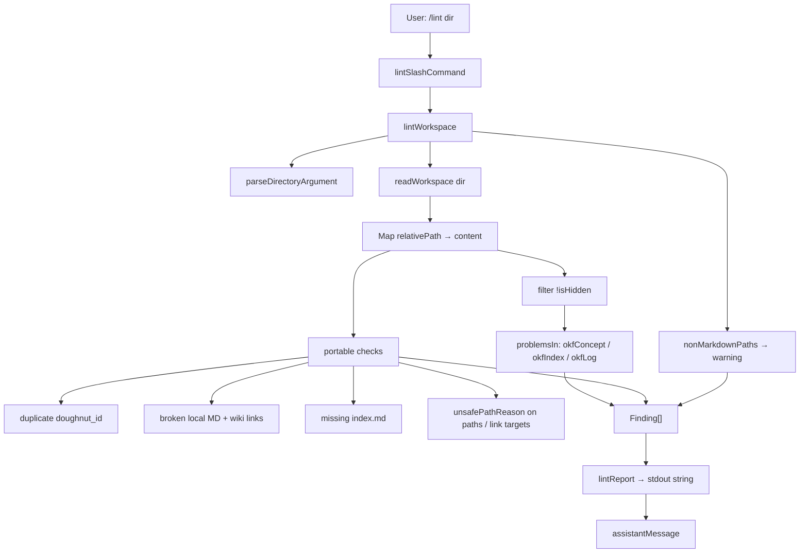

# Phase 11: Resolve workspace lint (story 4) - Research

**Researched:** 2026-08-03
**Domain:** CLI `/lint` — OKF base + portable knowledge-contract checks (TypeScript, Vitest, Cypress CLI E2E)
**Confidence:** HIGH (in-repo contracts, gaps, HYG-02 authorship); MEDIUM (exact finding wording / wiki title-vs-path resolution left to discretion)

<user_constraints>
## User Constraints (from CONTEXT.md)

### Locked Decisions

#### Gap coverage (LINT-01)
- **D-01:** Phase 11 closes **all four** TRIAGE Story 4 gaps: (1) **duplicate identities**, (2) **broken local links**, (3) **missing indexes**, and (4) **unsupported path mappings**. Keep already-green OKF behavior: malformed frontmatter, unknown keys accepted/preserved (read-only), actionable `path[:line] severity message` lines, and a clear success result when findings are empty of errors. Partial “one-gap-only” is not enough for LINT-01. — **Reversibility:** costly — shipping a subset leaves LINT-01 incomplete and invites a second Story 4 phase.

#### Portable contract on top of OKF
- **D-02:** Keep the existing OKF rule modules (`okfConcept` / `okfIndex` / `okfLog` / report shape) as the base. Add portable-contract checks as additional findings orchestrated from `lintWorkspace` (new helpers OK). Do **not** fork a second CLI command. — **Reversibility:** costly — dual `/lint` surfaces would confuse class labs and E2E.
- **D-03:** Invert the intentional OKF “must not reject” unit proofs that conflict with the portable oracle: **broken local link** (`a link to a concept that is not in the bundle`) and **missing `index.md`** (`one concept … and no index.md`) become **error** findings. Keep “unrecognised `type`” and “keys OKF says nothing about” as non-rejecting. Update E2E `A conformant bundle reports nothing` so its sample workspace is truly portable-valid (today it links `./banana.md` without that file). — **Reversibility:** one-way — published unit/E2E contracts flip from “OKF must not reject X” to “portable lint reports X”.
- **D-04:** Keep the success string **`Workspace follows the OKF format.`** when there are no errors (warnings-only may still show the success line + warning summary, matching current behavior). Capability narrative/E2E feature title may mention the portable knowledge contract, but do not introduce a second success slogan in this phase. — **Reversibility:** reversible — copy can retitle later if product wants “portable” wording.

#### Duplicate identities
- **D-05:** Identity key is Phase 8’s **`doughnut_id`**. Duplicate = two or more concept `.md` files (not reserved `index.md` / `log.md`) whose non-empty `doughnut_id` values collide. Report each colliding path with an actionable message. Missing `doughnut_id` is **not** a lint error (local-authored notes may lack it until export/push). — **Reversibility:** costly — push/preview already treat `doughnut_id` as stable identity; lint must stay aligned.

#### Broken local links
- **D-06:** Flag **local** Markdown links and `[[wiki]]` targets that do not resolve to an existing workspace `.md` (or otherwise existing local file path the link clearly intends). Do **not** flag absolute `http(s):` URLs or remote `/attachments/…` URLs (Phase 8 keeps attachments remote). Hidden / dot-dir paths stay unscanned as sources (existing `isHidden` behavior). — **Reversibility:** reversible — resolver edge cases can tighten later if semantics hold.

#### Missing indexes
- **D-07:** Report missing `index.md` when a directory that contains concept `.md` files (or nested concept-bearing folders that need a listing) lacks an `index.md` at that directory — at least: any non-empty concept-bearing directory without `index.md`, including the workspace root when it has concept files. Empty directories are out of scope for this gap. — **Reversibility:** costly — class acceptance treats missing indexes as a first-class portable-contract finding.

#### Unsupported path mappings
- **D-08:** Align with Phase 9 reserved/invalid vocabulary (D-04 there): report unsafe / out-of-tree / empty-segment / non-portable path shapes among workspace `.md` paths, and treat reserved role filenames (`index.md`, `log.md`) / `.doughnut-sync/` consistently (not ordinary concept paths). Reuse or mirror preview reject wording where practical so lint and `/sync --dry-run` stay coherent. — **Reversibility:** costly — drift between lint and preview confuse the portable contract.

#### Non-mutation / surface
- **D-09:** `/lint` remains **read-only** — no writes to workspace, `.doughnut-sync/`, or Doughnut. Primary strengthen lands in `cli/src/lint/*` + `lintWorkspace` orchestration; touch `lintSlashCommand` only for doc/help if needed. Do not change Stories 5–6 push modules. Prefer not changing shared `readWorkspace` / `directoryArgument` unless a lint proof is blocked. — **Reversibility:** reversible for help text; costly if shared readers regress sync/export.

#### Proof strategy
- **D-10:** Prove via `cli_lint_workspace.feature` (duplicate id, broken local link, missing index, unsupported path, existing malformed-frontmatter / success / warning scenarios stay green or are updated per D-03/D-04) plus `cli/tests/lintWorkspace.test.ts` (and focused helper units) for edge cases. Capability-named tests only — no phase numbers in product/test names.

#### Plan / commit sizing (user request)
- **D-11:** Config granularity stays **coarse**. Phase 11 plans/commits must be **slightly larger than Phase 10**: prefer **1 plan** with **1–2 larger tasks** that each land a coherent observable chunk (e.g. all four portable rules + units together; E2E proofs in the same plan). Avoid a separate tiny “E2E-only” plan and avoid per-rule micro-commits. Prefer fewer commits that group related unit+E2E for the same behavior. — **Reversibility:** reversible — planning preference only.

### Claude's Discretion
- Exact finding message wording / severity for portable rules (errors preferred for oracle gaps; warnings only if clearly advisory)
- Link/wiki resolution algorithm details (as long as D-06 holds and E2E proves them)
- Whether index-required applies only to directories that directly contain concepts vs also intermediate path segments
- Exact path-mapping checks beyond Phase 9 alignment (smallest set that closes the TRIAGE gap)
- Whether new helpers live as `okf*.ts` siblings or `portable*.ts` modules under `cli/src/lint/`

### Deferred Ideas (OUT OF SCOPE)
- Stories 5–6 push dry-run / safe push — Phases 12–13
- Retitling success copy from “OKF format” to “portable knowledge contract” as a product copy change — deferred unless E2E forces it (D-04 keeps current string)
- SEED-001 spelling follow-ons — parked
- Remote-driven deletes / Stories 7–10 portable create-rename-move — out of milestone
</user_constraints>

<phase_requirements>
## Phase Requirements

| ID | Description | Research Support |
|----|-------------|------------------|
| LINT-01 | Kept or strengthened `/lint` (or equivalent) matches story 4 acceptance (malformed frontmatter, duplicate identities, broken links, missing indexes, actionable findings; valid workspace succeeds) — or removed cleanly | TRIAGE Story 4 verdict is **strengthen** (not remove). Close all four gaps (D-01). Keep OKF modules; add portable checks in `lintWorkspace` (D-02). Invert broken-link + missing-index must-not-reject units; fix conformant E2E fixture (D-03). Keep success string `Workspace follows the OKF format.` (D-04). Identity = `doughnut_id` (D-05). Prove with `cli_lint_workspace.feature` + `lintWorkspace.test.ts` (D-10). HYG-02: Eric Yeh lint surface is editable; Terry-authored `previewPullActions.ts` is **import-only**. |
</phase_requirements>

## Summary

Phase 11 applies Phase 7’s Story 4 **strengthen** verdict so `/lint` matches the portable knowledge-contract oracle: malformed frontmatter (already green), plus **duplicate `doughnut_id`s**, **broken local links / wiki targets**, **missing `index.md` in concept-bearing directories**, and **unsupported / unsafe path shapes**, with actionable `path[:line] severity message` findings and the existing success string when there are no errors.

Today `lintWorkspace` only runs per-file OKF rules (`okfConcept` / `okfIndex` / `okfLog`) plus non-`.md` warnings. Unit block `what OKF says a bundle must not be rejected over` explicitly accepts broken links and missing `index.md`. E2E `A conformant bundle reports nothing` links `./banana.md` without creating that file — it will fail once broken-link checks land unless the fixture is fixed. Phase 9 already ships `extractDoughnutId` and `unsafePathReason` in Terry-authored `previewPullActions.ts` — lint must **import** those (HYG-02), not edit that file.

**Primary recommendation:** One coarse plan (D-11) with 1–2 large tasks: add `portable*.ts` helpers orchestrated from `lintWorkspace`, invert conflicting unit proofs, cascade `index.md` into every success fixture, extend `cli_lint_workspace.feature` for the four gaps, keep OKF/report/success string unchanged, import-only reuse of Terry path/id helpers.

## Architectural Responsibility Map

| Capability | Primary Tier | Secondary Tier | Rationale |
|------------|-------------|----------------|-----------|
| `/lint` orchestration + OKF rules | CLI (`cli/src/lint/*`) | — | D-02/D-09; Eric Yeh surface |
| Portable duplicate-id / links / indexes / paths | CLI (`portable*.ts` + `lintWorkspace`) | Import `extractDoughnutId` / `unsafePathReason` from sync | D-05/D-08; HYG-02 import-only on Terry file |
| Finding formatting / success slogan | CLI (`lintReport`) | — | D-04 — keep `Workspace follows the OKF format.` |
| Workspace scan inputs | CLI (`readWorkspace`, `directoryArgument`) | Shared Stories 1–3 | Prefer no edits (D-09) |
| Identity semantics (`doughnut_id`) | Backend export (Phase 8) | CLI reader | Lint only reads; must stay aligned |
| Story 4 acceptance proof | CLI units + E2E | — | `lintWorkspace.test.ts` + `cli_lint_workspace.feature` |
| Push / dry-run push | Deferred Phases 12–13 | — | D-09 / deferred |

## Standard Stack

### Core

| Library | Version | Purpose | Why Standard |
|---------|---------|---------|--------------|
| TypeScript CLI (`cli/`) | in-repo | `/lint` surface | TRIAGE entrypoint; no new runtime |
| Vitest | `4.1.10` `[VERIFIED: cli/package.json:50]` `"vitest": "4.1.10"` | Unit tests | Project CLI test runner |
| `yaml` (eemeli) | `>=2.9.0` `[VERIFIED: cli/package.json:36]` | OKF frontmatter (existing) | Already used by `okfConcept`; do not replace |
| Cypress + cucumber | in-repo E2E | Capability E2E | Existing `cli_lint_workspace.feature` |
| Node `fs` / `path.posix` | Node runtime | Read-only scan + link path resolve | Already used by lint/sync |

### Supporting

| Library | Version | Purpose | When to Use |
|---------|---------|---------|-------------|
| `extractDoughnutId` | in-repo Phase 9 (`previewPullActions.ts`) | Identity extraction | Always for D-05 — import only |
| `unsafePathReason` | in-repo Phase 9 (`previewPullActions.ts`) | Unsafe path vocabulary | Always for D-08 — import only |
| `isHidden` / `nonMarkdownPaths` | in-repo `bundleFiles.ts` | Skip dot paths; warn non-md | Keep |
| `lintReport` / `Finding` | in-repo | Report shape + CONFORMS string | Keep unchanged (D-04) |

### Alternatives Considered

| Instead of | Could Use | Tradeoff |
|------------|-----------|----------|
| Import `extractDoughnutId` / `unsafePathReason` | Duplicate regex / path rules in lint | Drift vs preview; worse for D-05/D-08 |
| `portable*.ts` modules | Stuff rules into `okfConcept.ts` | Mixes OKF vs portable; D-02 wants additive checks |
| New markdown parser npm package | Small regex extractors | Unnecessary dep; oracle needs only local link + wiki targets |
| Second `/portable-lint` command | Strengthen `/lint` | Forbidden by D-02 |

**Installation:** none — no new packages.

**Version verification:** Vitest `4.1.10` and `yaml` `>=2.9.0` confirmed in `cli/package.json`. No registry installs required.

## Package Legitimacy Audit

> No external packages are installed in this phase.

| Package | Registry | Age | Downloads | Source Repo | Verdict | Disposition |
|---------|----------|-----|-----------|-------------|---------|-------------|
| — | — | — | — | — | N/A | No installs |

**Packages removed due to [SLOP] verdict:** none  
**Packages flagged as suspicious [SUS]:** none

*Note: `gsd-tools package-legitimacy` flagged already-installed `vitest` as SUS/too-new — irrelevant; this phase does not install it.*

## Architecture Patterns

### System Architecture Diagram



### Recommended Project Structure

```
cli/src/lint/
├── lintWorkspace.ts      # orchestrate OKF + portable (strengthen)
├── lintReport.ts         # keep — CONFORMS string
├── okfConcept.ts         # keep
├── okfIndex.ts           # keep
├── okfLog.ts             # keep
├── okfProblem.ts         # keep
├── bundleFiles.ts        # keep
└── portable*.ts          # NEW — duplicate / links / indexes / paths (discretion name)

cli/tests/
└── lintWorkspace.test.ts # invert + add portable proofs (+ optional helper units)

e2e_test/features/cli/
└── cli_lint_workspace.feature  # fix conformant + add four gap scenarios
```

### Pattern 1: Additive portable findings (not OKF fork)
**What:** Keep `problemsIn` OKF dispatch; after collecting OKF findings, append portable workspace-level findings from the full note map.  
**When to use:** All four LINT-01 gaps.  
**Example:**
```typescript
// Source: in-repo lintWorkspace.ts pattern + D-02
const notes = [...readWorkspace(bundle)].filter(([path]) => !isHidden(path))
const okfFindings = notes.flatMap(([path, content]) =>
  problemsIn(path, content).map((problem) => ({ ...problem, path }))
)
const portableFindings = portableContractFindings(notes) // new
return lintReport([...okfFindings, ...portableFindings, ...nonMarkdownPaths(bundle).map(notAConcept)])
```

### Pattern 2: Import-only Phase 9 helpers (HYG-02)
**What:** Reuse Terry-authored `extractDoughnutId` and `unsafePathReason` without editing `previewPullActions.ts`.  
**When to use:** D-05 duplicate identities; D-08 path mappings; link targets that look unsafe.  
**Verified exports** `[VERIFIED: cli/src/sync/previewPullActions.ts:20-74]`:
```typescript
export function extractDoughnutId(content: string): string | undefined {
  // ...
}
export function unsafePathReason(path: string): string | undefined {
  if (
    path.startsWith('/') ||
    path.includes('\\') ||
    path.split('/').includes('..') ||
    path.split('/').includes('')
  ) {
    return 'unsafe path — not a portable pull target'
  }
  return
}
```

### Pattern 3: Invert must-not-reject → must-report
**What:** Same fixtures that today expect CONFORMS become error expectations for broken links and missing indexes (D-03).  
**When to use:** The two conflicting tests under `what OKF says a bundle must not be rejected over`; keep unrecognised `type` and unknown keys green.

### Anti-Patterns to Avoid
- **Editing `previewPullActions.ts`:** Terry Yin authorship — HYG-02 violation (Phase 10 precedent: import-only).
- **Second lint command or second success slogan:** Forbidden by D-02/D-04.
- **Requiring `doughnut_id` on every note:** Missing id is explicitly not an error (D-05).
- **Flagging `http(s):` or remote `/attachments/…`:** Forbidden by D-06.
- **Per-gap micro-plans/commits:** Violates D-11 coarse sizing.
- **Writing the workspace from lint:** Violates D-09 read-only.
- **Leaving success fixtures without `index.md`:** After D-07, nearly every “CONFORMS” unit/E2E fixture without an index will fail (fixture cascade — see Pitfall 1).

## Don't Hand-Roll

| Problem | Don't Build | Use Instead | Why |
|---------|-------------|-------------|-----|
| `doughnut_id` parse | Second frontmatter YAML walk for id | `extractDoughnutId` | Same contract as preview/apply; HYG-02-safe import |
| Unsafe path vocabulary | New ad-hoc reject phrases | `unsafePathReason` (+ mirror wording) | D-08 coherence with `/sync --dry-run` |
| Full Markdown AST parse | New `markdown-it` / remark dep | Small regex for `[…](url)` + `[[…]]` | Oracle needs local targets only; no new packages |
| Frontmatter OKF rules | Rewrite `okfConcept` | Keep modules | Already green; D-02 additive |
| Report layout | Custom formatter | `lintReport` | Already matches oracle “actionable findings” |

**Key insight:** The gap is orchestration + portable workspace rules, not a new lint product. Reuse Phase 8/9 identity and path vocabulary; only invent the link/index scanners.

## Common Pitfalls

### Pitfall 1: Missing-index fixture cascade
**What goes wrong:** After D-07, every success-path unit that writes concepts without `index.md` fails (≈13 `Workspace follows the OKF format.` expectations in `lintWorkspace.test.ts`).  
**Why it happens:** Current OKF intentionally does not require indexes.  
**How to avoid:** In the same task that enables missing-index errors, add minimal `index.md` (and nested `fruit/index.md` where needed) to all CONFORMS fixtures and the E2E conformant scenario.  
**Warning signs:** Mass unit failures only on success cases after portable indexes land.

### Pitfall 2: Conformant E2E is already non-portable
**What goes wrong:** `A conformant bundle reports nothing` links `./banana.md` with no such file `[VERIFIED: e2e_test/features/cli/cli_lint_workspace.feature:41-57]`.  
**Why it happens:** Pre-D-03 OKF did not follow links.  
**How to avoid:** Add `banana.md` (valid concept + frontmatter) **and** root `index.md` (and any other required indexes) in the same E2E edit that enables broken-link checks (D-03).

### Pitfall 3: HYG-02 on Terry classify helpers
**What goes wrong:** Editing `previewPullActions.ts` to “share” lint helpers.  
**Why it happens:** Natural place for path/id utilities.  
**How to avoid:** Import `extractDoughnutId` / `unsafePathReason` only; put lint-specific orchestration under `cli/src/lint/`. Authorship check: lint tree = Eric Yeh only; `previewPullActions.ts` = Terry Yin.

### Pitfall 4: Workspace walk rarely yields unsafe path keys
**What goes wrong:** E2E cannot create a real `../evil.md` workspace entry via normal `writeFile` under the workspace root.  
**Why it happens:** `readWorkspace` builds relative paths from `readdir`; `..` / absolute / empty segments do not appear as keys.  
**How to avoid:** Unit-test `unsafePathReason` / portable path helper with **synthetic** path strings; for E2E “unsupported path”, prefer a **local link target** containing `..` or an absolute-shaped local target (also satisfies broken/unsafe), or assert reserved-role consistency (index/log not treated as ordinary concepts — already OKF). Do not invent filesystem hacks.

### Pitfall 5: Wiki title vs path ambiguity
**What goes wrong:** Overbuilt title→note resolution stalls the slice.  
**Why it happens:** Backend export resolves wiki by notebook title map; local workspace may only have paths.  
**How to avoid (discretion recommendation):** Path-oriented wiki resolution for this phase: split `[[target|display]]` on first `|`; resolve `target` as workspace-relative path (`target`, or `target.md` if no suffix), relative to the source file’s directory or workspace root. Prove with E2E/unit using path-like wikis / missing targets. Defer fancy title matching unless a proof is blocked.

### Pitfall 6: Root-absolute MD links like `/pear`
**What goes wrong:** Treating `/pear` as filesystem-absolute (always “exists” or always unsafe) incorrectly.  
**Why it happens:** Existing must-not-reject fixture uses `[go](/pear)` `[VERIFIED: cli/tests/lintWorkspace.test.ts:261-264]`.  
**How to avoid:** Treat leading-`/` Markdown destinations that are **not** `http(s):` and **not** remote `/attachments/…` as **workspace-root-relative** local links (strip leading `/`, resolve under workspace). Flag when missing. Separately, `unsafePathReason` still applies to true unsafe shapes (`..`, `\`, empty segments).

### Pitfall 7: Reserved files in duplicate-id set
**What goes wrong:** Counting `index.md` / `log.md` toward duplicate `doughnut_id`.  
**How to avoid:** Exclude reserved basenames from the identity map (D-05).

### Pitfall 8: Oversized slice vs time budget
**What goes wrong:** Four rules + fixture cascade + E2E exceeds ~10 min without decomposition.  
**How to avoid:** D-11 allows 1–2 large tasks in **one** plan — still keep each task a coherent chunk (e.g. Task 1: portable helpers + unit invert + fixture cascade; Task 2: E2E scenarios). Self-enforce planning.mdc time budget; finer-decompose only if thrashing.

## Code Examples

### Success / report contract (keep)
```typescript
// Source: [VERIFIED: cli/src/lint/lintReport.ts:3-39]
const CONFORMS = 'Workspace follows the OKF format.'
// empty findings → CONFORMS
// warnings-only → `${CONFORMS} ${counts}` when errors === 0
```

### Invert broken link + missing index (unit intent)
```typescript
// Source: today [VERIFIED: cli/tests/lintWorkspace.test.ts:261-271] — AFTER Phase 11 these must report errors
test('a link to a concept that is not in the bundle', () => {
  write('apple.md', `${concept('type: concept', 'apple')}\n\n[go](/pear)`)
  write('index.md', '# Fruit\n') // required once D-07 lands
  expect(lintWorkspace(root)).toMatch(/error/i)
  expect(lintWorkspace(root)).toMatch(/pear|link|missing|broken/i)
})

test('one concept carrying only a `type`, and no index.md', () => {
  write('apple.md', concept('type: concept', 'apple'))
  expect(lintWorkspace(root)).toMatch(/index\.md/i)
  expect(lintWorkspace(root)).not.toBe('Workspace follows the OKF format.')
})
```

### Wiki pattern aligned with backend
```java
// Source: [VERIFIED: backend/.../WikiLinkMarkdown.java:15]
public static final Pattern INNER_LINK_PATTERN = Pattern.compile("\\[\\[([^\\]]+)]]");
```
CLI may mirror: `/\[\[([^\]]+)\]\]/g`, then split on first `|` for target.

### Link skip list (D-06)
```typescript
// Recommended — discretion wording
function isRemoteOrIgnoredHref(href: string): boolean {
  const t = href.trim()
  if (/^https?:\/\//i.test(t)) return true
  if (/^\/attachments\//i.test(t)) return true // Phase 8 remote attachments
  return false
}
```

### Index rule (discretion recommendation)
```typescript
// Directories that directly contain ≥1 concept .md (basename ∉ {index.md, log.md})
// require a sibling index.md in that directory. Empty dirs ignored (D-07).
```

## State of the Art

| Old Approach | Current Approach | When Changed | Impact |
|--------------|------------------|--------------|--------|
| OKF-only `/lint` | OKF + portable contract checks | Phase 11 (this) | Closes LINT-01 |
| Must not reject broken links / missing index | Must report as errors | D-03 | Unit/E2E contract flip |
| No `doughnut_id` uniqueness | Duplicate `doughnut_id` errors | D-05 + Phase 8 identity | Aligns lint with export/sync |
| Preview-only unsafe path reasons | Lint imports same helper | D-08 | Coherent portable vocabulary |

**Deprecated/outdated:**
- OKF “must not reject broken link / missing index” proofs — invert, do not delete the describe block wholesale without replacing coverage for unrecognised `type` / unknown keys.

## Assumptions Log

| # | Claim | Section | Risk if Wrong |
|---|-------|---------|---------------|
| A1 | Wiki resolution for this phase is path-oriented (`target` / `target.md`), not title→heading matching | Pitfall 5 / Discretion | E2E using title-only `[[Note Title]]` may need algorithm expansion |
| A2 | Workspace-root-relative interpretation of Markdown `/foo` links is correct for D-06 | Pitfall 6 | Alternate semantics (always unsafe vs always FS-absolute) would change fixture expectations |
| A3 | Index requirement = directories that **directly** contain concept files (not every ancestor of a nested concept) | Discretion / D-07 | Stricter “every ancestor” rule needs more `index.md` fixtures |
| A4 | E2E “unsupported path” can be proven via unsafe **link target** and/or synthetic unit paths | Pitfall 4 | If product insists on on-disk unsafe keys only, E2E proof strategy needs human decision |
| A5 | No new npm packages required | Standard Stack | If regex extraction proves insufficient mid-phase, stop for package decision (unlikely) |

## Open Questions

1. **Wiki title matching depth**
   - What we know: D-06 requires wiki targets; backend resolves by title at export time.
   - What's unclear: Whether local lint must resolve Obsidian-style titles without `.md`.
   - Recommendation: Ship path-oriented resolution (A1); expand only if a locked E2E needs titles.

2. **E2E unsupported-path fixture shape**
   - What we know: Normal workspace writes cannot create `../` keys under the root.
   - What's unclear: Exact Gherkin scenario the class wants for gap (4).
   - Recommendation: Scenario with local link to `../outside.md` (broken + unsafe) plus unit synthetic `unsafePathReason` coverage; reserved `index.md`/`log.md` remain non-concept.

3. **Finding message copy**
   - What we know: Errors preferred; actionable; mirror preview phrases where practical (`unsafe path — not a portable pull target`).
   - What's unclear: Exact duplicate-id / missing-index / broken-link sentences.
   - Recommendation: Discretion — stable substrings for E2E (`doughnut_id`, `index.md`, `link`/`missing`, `unsafe`).

## Environment Availability

| Dependency | Required By | Available | Version | Fallback |
|------------|------------|-----------|---------|----------|
| Nix + `CURSOR_DEV=true nix develop -c` | All tooling | ✓ | local flake | Cloud VM skill if no Nix |
| Node (via Nix) | Vitest / CLI | ✓ | engines `>=26.5` in package.json; host also has node | Use Nix wrapper |
| pnpm | `cli` tests | ✓ | present | — |
| Vitest | Unit proofs | ✓ | 4.1.10 | — |
| Cypress E2E + `pnpm sut` | `cli_lint_workspace.feature` | Assume sut running | agent-map | Start sut if healthcheck fails |
| MySQL (sut) | E2E stack | ✓ | mysql dir present | — |
| New npm packages | — | N/A | — | Do not install |

**Missing dependencies with no fallback:** none identified for this phase.

**Missing dependencies with fallback:** none blocking.

Step 2.6 note: Phase is code/config + existing test runners; no new external services.

## Validation Architecture

> `workflow.nyquist_validation` is enabled in `.planning/config.json`.

### Test Framework

| Property | Value |
|----------|-------|
| Framework | Vitest `4.1.10` (CLI units); Cypress + cucumber (CLI E2E) |
| Config file | `cli/vitest.config.ts`; `e2e_test/config/ci.ts` |
| Quick run command | `CURSOR_DEV=true nix develop -c bash -c 'cd cli && pnpm exec vitest run tests/lintWorkspace.test.ts'` |
| Full suite command (targeted, not whole repo) | Units above + `CURSOR_DEV=true nix develop -c pnpm cypress run --spec e2e_test/features/cli/cli_lint_workspace.feature` |

### Phase Requirements → Test Map

| Req ID | Behavior | Test Type | Automated Command | File Exists? |
|--------|----------|-----------|-------------------|-------------|
| LINT-01 | Malformed frontmatter still errors | unit + E2E | vitest `lintWorkspace`; cypress `cli_lint_workspace.feature` | ✅ |
| LINT-01 | Unknown keys still accepted | unit | vitest must-not-reject keys/type | ✅ (keep) |
| LINT-01 | Duplicate `doughnut_id` errors on each colliding path | unit + E2E | vitest + new E2E scenario | ❌ Wave 0 — add |
| LINT-01 | Broken local MD / wiki link errors | unit + E2E | invert unit; new E2E; fix conformant | ⚠️ exists but wrong expectation |
| LINT-01 | Missing `index.md` in concept-bearing dir | unit + E2E | invert unit; new E2E; fixture cascade | ⚠️ exists but wrong expectation |
| LINT-01 | Unsupported/unsafe path mapping | unit (+ E2E via link target) | synthetic unit + E2E scenario | ❌ Wave 0 — add |
| LINT-01 | Valid portable workspace → CONFORMS | unit + E2E | update fixtures with indexes + resolvable links | ⚠️ needs fixture fix |
| LINT-01 | Read-only (no workspace mutation) | implicit / unit | no write APIs in lint path | ✅ by design |
| HYG-02 | No Terry/YS rewrites | plan gate | `git diff` excludes `previewPullActions.ts` and Terry/YS files | planner prohibition |

### Sampling Rate
- **Per task commit:** focused `vitest run tests/lintWorkspace.test.ts` (and any new helper test file)
- **Per wave merge:** same units + targeted `cli_lint_workspace.feature`
- **Phase gate:** targeted CLI lint E2E green; do **not** run full E2E suite unless explicitly required

### Wave 0 Gaps
- [ ] Invert unit: broken local link → error (D-03)
- [ ] Invert unit: missing `index.md` → error (D-03)
- [ ] Add units: duplicate `doughnut_id`; unsafe path helper; wiki broken target
- [ ] Cascade `index.md` into all CONFORMS fixtures
- [ ] Fix E2E conformant workspace (`banana.md` + indexes)
- [ ] Add E2E scenarios: duplicate id, broken link, missing index, unsupported/unsafe path
- [ ] Optional: `cli/tests/portable*.test.ts` if helpers are non-trivial — prefer testing via `lintWorkspace` when cohesion allows (`cli.mdc` export discipline)

## Security Domain

> `security_enforcement` enabled; ASVS level 1.

### Applicable ASVS Categories

| ASVS Category | Applies | Standard Control |
|---------------|---------|-----------------|
| V2 Authentication | no | Lint is local filesystem, no auth |
| V3 Session Management | no | — |
| V4 Access Control | no | User-supplied directory already scoped by existing parse |
| V5 Input Validation | yes | `parseDirectoryArgument`; path safety via `unsafePathReason`; no writes |
| V6 Cryptography | no | — |

### Known Threat Patterns for CLI workspace lint

| Pattern | STRIDE | Standard Mitigation |
|---------|--------|---------------------|
| Path traversal via link/`..` | Tampering / Info disclosure | Resolve then flag; do not follow writes; `unsafePathReason` |
| Lint mutates workspace / sync metadata | Tampering | D-09 read-only — no `writeFile` in lint path |
| Zip/path confusion copied from export | Tampering | Lint does not unzip; only reads workspace |
| Secret scanning | Information disclosure | Out of scope — oracle already matched “no secrets in export”; lint does not add secret writes |

## Project Constraints (from .cursor/rules/)

Actionable directives relevant to this phase:

| Source | Directive |
|--------|-----------|
| `general.mdc` | Tooling via `CURSOR_DEV=true nix develop -c …`; git without Nix; high cohesion; no speculative defensive layers |
| `planning.mdc` | Behavior vs Structure; one observable behavior; stop-safe; ~5 min fuzzy / >10 min finer-decompose; capability-named tests; `@wip` only while E2E fails; targeted E2E not full suite; Jidoka + post-change-refactor + plan update + commit+push after phase |
| `gsd-coexistence.mdc` | Local overlays win: Behavior/Structure, time budget, Jidoka, refactor, commit+push, history cleanup when done |
| `cli.mdc` | Small public exports; Vitest observable behavior; no fixed-time sleeps; focused `pnpm`/`vitest` under `cli/`; CLI E2E under `e2e_test/features/cli/` |
| `e2e-authoring.mdc` | Assume `pnpm sut`; run `--spec` for touched feature; capability names not phase numbers; no committed `@focus`/`@only` |
| `architecture-decisions.mdc` | Load Accepted ADRs for architecture-shaped work — this phase is CLI strengthen within existing `/lint`; no new ADR expected |

## Sources

### Primary (HIGH confidence)
- `.planning/phases/11-resolve-workspace-lint-story-4/11-CONTEXT.md` — D-01..D-11
- `.planning/phases/07-publish-triage-decisions/TRIAGE.md` Story 4 — strengthen, gaps, keep/strengthen set
- `.planning/notes/2026-07-24-portable-notebook-workspace.md` Story 4 acceptance bullets
- `cli/src/lint/*`, `cli/tests/lintWorkspace.test.ts`, `e2e_test/features/cli/cli_lint_workspace.feature` — current behavior
- `cli/src/sync/previewPullActions.ts` — `extractDoughnutId`, `unsafePathReason` (Terry; import-only)
- `cli/package.json` — vitest/yaml versions
- Git authorship: lint surface Eric Yeh; `previewPullActions.ts` Terry Yin

### Secondary (MEDIUM confidence)
- Context7 `/eemeli/yaml` — `parseDocument` / errors before `toJS` (existing OKF pattern)
- Context7 `/nodejs/node` — `path.resolve` / `path.posix` normalization behavior
- Phase 8/9 CONTEXT — `doughnut_id` and reserved/invalid vocabulary
- Phase 10 RESEARCH/PLAN — coarse plan + HYG-02 import-only precedent

### Tertiary (LOW confidence)
- WebSearch path-root containment guidance — use prefix-check / `unsafePathReason` rather than trusting `resolve` alone `[ASSUMED` details beyond Node docs`]

## Metadata

**Confidence breakdown:**
- Standard stack: HIGH — no new packages; in-repo Vitest/yaml/Cypress
- Architecture: HIGH — clear orchestration + import-only helpers; fixture cascade understood
- Pitfalls: HIGH for fixture/E2E/HYG-02; MEDIUM for wiki title depth and unsupported-path E2E shape

**Research date:** 2026-08-03  
**Valid until:** 2026-09-02 (stable in-repo contracts; re-check if Phase 9 path helpers change)

## Recommended plan shape (for gsd-planner)

**1 plan (`11-01-PLAN.md`), 1–2 tasks (D-11):**

1. **Portable rules + units** — Add `portable*.ts`, wire `lintWorkspace`, invert D-03 units, cascade `index.md` on CONFORMS fixtures, unit-cover duplicate id / links / indexes / unsafe paths (import Terry helpers).
2. **E2E proofs (same plan)** — Fix conformant scenario; add scenarios for four gaps; run targeted cypress spec; keep success string; no push-module edits.

**Prohibitions to copy into PLAN:**
- Do not edit `cli/src/sync/previewPullActions.ts` (HYG-02)
- Do not install new npm packages
- Do not change Stories 5–6 push modules
- Do not change CONFORMS success string (D-04)
- Do not encode phase numbers in product/test names
