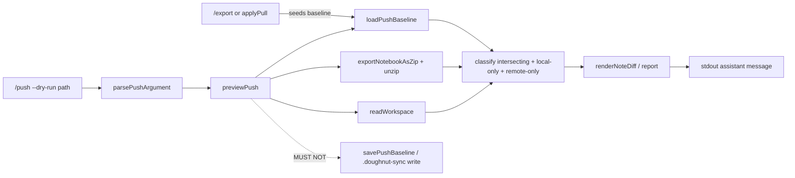

# Phase 12: Resolve push dry-run (story 5) - Research

**Researched:** 2026-08-03
**Domain:** CLI `/push --dry-run` — conflict-aware preview strengthen (create/update taxonomy + non-mutating sync metadata)
**Confidence:** HIGH (in-repo gaps, write sites, E2E/unit flip set); MEDIUM (exact create/update heading wording left to discretion)

<user_constraints>
## User Constraints (from CONTEXT.md)

### Locked Decisions

#### Gap coverage (PUSH-01)
- **D-01:** Phase 12 closes **both** TRIAGE Story 5 gaps: (1) report exact **create** and **update** actions (including non-intersecting paths the oracle expects), and (2) make dry-run **non-mutating for sync metadata** (stop writing `.doughnut-sync/baseline.json` from `previewPush`). Keep already-green conflict labeling (`(push)` / `(pull)` / `(CONFLICT)`) and non-mutation of Doughnut / workspace `.md`. Partial “taxonomy-only” or “baseline-only” is not enough for PUSH-01. — **Reversibility:** costly — shipping one gap leaves PUSH-01 incomplete and invites a second Story 5 phase.

#### Sync metadata (oracle no-mutation)
- **D-02:** Remove `savePushBaseline` from the dry-run path. `previewPush` may **load** an existing baseline (from `/export` seed or Phase 10 successful pull) to classify push/pull/conflict, but must **not write** `.doughnut-sync/` or any other sync metadata. — **Reversibility:** one-way — published E2E currently asserts “preview’s only addition is its own baseline file”; that contract flips to “preview adds nothing.”
- **D-03:** Re-prime directional E2E via **export** (existing Rule: *Exporting primes the baseline…*) or a successful pull — not via a prior dry-run. Flip/replace units that assert dry-run seeds or advances baseline (`seeds the baseline only with…`, `advances the baseline…`, `keeps the baseline…`, etc.). Keep `pushBaseline` helpers intact for export / pull / future Story 6 consumers. — **Reversibility:** one-way — dry-run no longer owns baseline bookkeeping.

#### Create / update action taxonomy
- **D-04:** Keep directional status labels `(push)` / `(pull)` / `(CONFLICT)` for notes with a merge-base. Add explicit **create** vs **update** action reporting the oracle asks for:
  - **Update (push):** path exists on both sides; only workspace changed vs baseline (or unlabeled difference that is a content change on an existing remote note).
  - **Create (push):** local-only `.md` (no remote counterpart) that would be a new Doughnut note on a real push.
  - **Update/create (pull):** remote-only or remote-changed notes labeled `(pull)` with create vs update against local absence/presence.
  - **Conflict:** both sides diverged — never reported as update. — **Reversibility:** costly — CLI/E2E wording becomes the Story 5 proof surface.
- **D-05:** Expand beyond intersecting exported∩local only: include **local-only** and **remote-only** Markdown paths in the report so creates are visible. Unchanged intersecting notes stay omitted / contribute to `No changes to push.` when nothing else reports. Reserved `index.md` / `log.md` and `.doughnut-sync/` stay out of ordinary create/update rows (align with Phase 9/10 reserved vocabulary). — **Reversibility:** costly — omitting non-intersecting creates leaves the TRIAGE create/update gap open.

#### Surface / Story 6 boundary
- **D-06:** Primary strengthen lands in `previewPush` (+ small helpers / report rendering as needed). Touch `pushSlashCommand` only for help/doc if required. Do **not** implement mutating `/push`, do **not** relax `parsePushArgument`’s `--dry-run` requirement, and do **not** delete `cli_push.feature` (Phase 13). Prefer not changing shared `readWorkspace` / `exportNotebook` / `pushBaseline` APIs unless a dry-run proof is blocked. — **Reversibility:** reversible for help text; costly if shared readers regress export/pull.

#### Proof strategy
- **D-07:** Prove via `cli_push_dry_run.feature` (create + update actions, conflict preserved, **zero** sync-metadata / `.md` / Doughnut mutation, export-primed directional labels) plus `cli/tests/previewPush.test.ts` (and focused helpers) for taxonomy/baseline-load edge cases. Capability-named tests only — no phase numbers in product/test names.

#### Plan / commit sizing (user request)
- **D-08:** Config granularity stays **coarse** (already max). Phase 12 plans/commits must be **slightly larger than Phase 11**: prefer **1 plan** with **1 (at most 2) larger task(s)** that land **both** gaps + units + E2E together. Prefer **one implementation commit** (or one commit for code+units and one for E2E only if stop-safe forces it) — avoid Phase 11’s separate units / E2E / refactor micro-commits. — **Reversibility:** reversible — planning/execution preference only.

### Claude's Discretion
- Exact create/update label wording and whether it appears beside `(push)`/`(pull)` or replaces the path header line
- Whether remote-only create uses the same `renderNoteDiff` shape or a create-only line without a useless empty-side diff
- How to phrase the flipped non-mutation E2E (inventory with no baseline file vs assert baseline mtime/content unchanged when already present)
- Small report-helper extractions from `diffReport` vs inline in `previewPush`

### Deferred Ideas (OUT OF SCOPE)
- Story 6 safe push / remove `@ignore` `cli_push.feature` — Phase 13
- Mutating `/push` implementation — out of this milestone’s Story 6 remove verdict
- SEED-001 spelling follow-ons — parked
- Stories 7–10 portable create-rename-move — out of milestone
</user_constraints>

<phase_requirements>
## Phase Requirements

| ID | Description | Research Support |
|----|-------------|------------------|
| PUSH-01 | Kept or strengthened push dry-run / conflict preview matches story 5 (unchanged / local / remote / divergent; no mutation) — or removed cleanly | TRIAGE Story 5 verdict is **strengthen** (not remove). Close **both** gaps (D-01): (1) create/update + local-only/remote-only reporting (D-04/D-05); (2) remove `savePushBaseline` from `previewPush` (D-02). Re-prime directional proofs via export/pull (D-03). Prove with `cli_push_dry_run.feature` + `previewPush.test.ts` (D-07). Keep Story 6 mutate/`cli_push.feature` untouched (D-06). HYG-02 standing: do not rewrite Terry Yin / Tan Yeong Sheng work — import-only for Terry-owned classify helpers; careful extend of shared `diffReport`. |
</phase_requirements>

## Summary

Phase 12 applies Phase 7’s Story 5 **strengthen** verdict so `/push --dry-run` / `previewPush` matches the portable-workspace oracle: distinguish unchanged / local / remote / divergent; report exact **create** and **update** actions (including non-intersecting paths); keep conflicts (not LWW); mutate **neither** Doughnut, workspace `.md`, **nor sync metadata**.

Today `previewPush` already classifies intersecting notes vs a loaded baseline into unlabeled difference / `(push)` / `(pull)` / `(CONFLICT)`, but (1) it **always** `savePushBaseline(nextBaseline(...))`, and (2) it only iterates exported Markdown that also exists locally — remote-only and local-only creates are invisible, and there is no create/update action taxonomy. E2E Feature blurb and Scenario *The preview's only addition is its own baseline file* intentionally allow metadata mutation; Rule *A later preview…* Background primes direction via a prior dry-run. Units `seeds the baseline…` / `advances the baseline…` / `keeps the baseline…` and `leaves a note missing from the workspace out of the report` encode the pre-strengthen contracts that must flip.

**Primary recommendation:** One coarse plan (D-08) with **1 task** (at most 2): remove dry-run baseline write + expand report to local/remote-only creates and create/update actions in `previewPush`; flip/reseed units via `savePushBaseline` / `writeNotebookExport`; re-prime directional E2E via `/export`; invert non-mutation E2E; keep `pushBaseline` APIs and Story 6 surfaces untouched.

## Architectural Responsibility Map

| Capability | Primary Tier | Secondary Tier | Rationale |
|------------|-------------|----------------|-----------|
| Push dry-run preview orchestration | CLI (`previewPush`) | — | D-06 primary strengthen |
| Directional classify vs merge-base | CLI (`classify` in `previewPush`) | Baseline from export/pull | Load-only (D-02); keep `(push)`/`(pull)`/`(CONFLICT)` |
| Create/update + non-intersecting paths | CLI (`previewPush` + small helpers) | Import `classifyCreateOrUpdate` if useful | D-04/D-05; do not fork pull reject engine |
| Report rendering | CLI (`diffReport`) | Prefer push-local heading compose | Extend carefully; don’t regress Story 2 `(create)`/`(update)` |
| Sync merge-base persistence | CLI export + `applyPull` only | `pushBaseline` helpers kept | Dry-run must stop writing (D-02/D-03) |
| `/push` CLI entry / argv | CLI (`pushSlashCommand`, `pushArgument`) | — | Keep dry-run-only; no mutate (D-06) |
| Story 5 acceptance proof | CLI units + E2E | — | `previewPush.test.ts` + `cli_push_dry_run.feature` |
| Mutating push / `cli_push.feature` | Deferred Phase 13 | — | D-06 / deferred |

## Standard Stack

### Core

| Library | Version | Purpose | Why Standard |
|---------|---------|---------|--------------|
| TypeScript CLI (`cli/`) | in-repo | `/push --dry-run` surface | TRIAGE entrypoint; no new runtime |
| Vitest | `4.1.10` `[VERIFIED: cli/package.json:50]` `"vitest": "4.1.10"` | Unit tests | Project CLI test runner |
| Cypress + cucumber | in-repo E2E | Capability E2E | Existing `cli_push_dry_run.feature` |
| Node `fs` / `path` | Node runtime | Load baseline only; read workspace | Already used by sync modules |

### Supporting

| Library | Version | Purpose | When to Use |
|---------|---------|---------|-------------|
| `loadPushBaseline` | in-repo `pushBaseline.ts` | Read merge-base | Always for directional labels — **load only** from dry-run |
| `savePushBaseline` | in-repo `pushBaseline.ts` | Persist merge-base | Export + `applyPull` only — **not** `previewPush` |
| `classifyCreateOrUpdate` | in-repo Phase 9 (`previewPullActions.ts`) | Path-keyed create/update/unchanged | Import-only for taxonomy (HYG-02) |
| `renderNoteDiff` / `renderDiffReport` | in-repo `diffReport.ts` | Unified diff + summary | Keep; compose create/update headings carefully |
| `writeNotebookExport` | in-repo | Export + baseline seed | Preferred E2E/unit priming (D-03) |
| `readWorkspace` / `unzipToEntries` / `exportNotebookAsZip` | in-repo | Compare inputs | Prefer no API changes (D-06) |

### Alternatives Considered

| Instead of | Could Use | Tradeoff |
|------------|-----------|----------|
| Import `classifyCreateOrUpdate` | Duplicate create/update ternary in `previewPush` | Duplication drifts from Phase 9; import-only is preferred |
| Extend `renderNoteDiff` paren for status+action | Compose heading only in `previewPush` | Shared helper change risks Story 2; push-local compose is safer for HYG-02 |
| Seed baseline inside `workspaceMatchingNotebook` E2E helper | Re-prime via `/export` scenarios | Helper change is broader than D-03; existing Export Rule already primes |

**Installation:** none — no new packages.

**Version verification:** Vitest `4.1.10` confirmed in `cli/package.json`. No registry installs for this phase.

## Package Legitimacy Audit

> No external packages are installed in this phase.

| Package | Registry | Age | Downloads | Source Repo | Verdict | Disposition |
|---------|----------|-----|-----------|-------------|---------|-------------|
| — | — | — | — | — | N/A | No new packages |

**Packages removed due to [SLOP] verdict:** none  
**Packages flagged as suspicious [SUS]:** none

## Architecture Patterns

### System Architecture Diagram



### Recommended Project Structure

```
cli/src/sync/
├── previewPush.ts       # PRIMARY strengthen — load-only baseline; create/update paths
├── pushBaseline.ts      # keep load/save APIs; dry-run stops calling save
├── diffReport.ts        # extend carefully or leave; don’t regress pull
├── previewPullActions.ts # import-only (Terry) — classifyCreateOrUpdate / reserved vocab
├── writeNotebookExport.ts # baseline seed (priming)
└── applyPull.ts         # baseline writer for pull — do not regress
cli/tests/
└── previewPush.test.ts  # flip baseline-write units; add create/update
e2e_test/features/cli/
└── cli_push_dry_run.feature  # flip priming + non-mutation; add create/update
```

### Pattern 1: Load-only baseline in dry-run

**What:** Call `loadPushBaseline`; never `savePushBaseline` / never compute+persist `nextBaseline` on the dry-run path.  
**When to use:** Always in Phase 12 `previewPush`.  
**Example:** Current write site to remove `[VERIFIED: cli/src/sync/previewPush.ts:118-122]`:

```typescript
savePushBaseline(
  workspacePath,
  notebookId,
  nextBaseline(baseline, workspace, markdownExported)
)
```

After strengthen: delete this call (and the now-unused local `nextBaseline` helper). Keep `savePushBaseline` exported for export/pull.

### Pattern 2: Expand beyond intersecting paths

**What:** Today remote-only is skipped `[VERIFIED: cli/src/sync/previewPush.ts:109-116]`:

```typescript
const reported = markdownExported.flatMap(([path, remote]) => {
  const local = workspace.get(path)
  if (local === undefined) return []
  // ...
})
```

**When to use:** Replace with union of exported Markdown paths ∪ workspace Markdown paths (minus reserved/` .doughnut-sync`). Local-only → create+(push); remote-only → create+(pull); both → classify as today + update (unless conflict).

### Pattern 3: Re-prime directional proofs via export

**What:** `workspaceMatchingNotebook` / `createCliWorkspaceFromZip` writes zip entries only — **no** baseline `[VERIFIED: e2e_test/config/cliE2ePluginWorkspaceTasks.ts:85-94]`:

```typescript
createCliWorkspaceFromZip({ zipBase64 }: { zipBase64: string }) {
  const workspace = mkdtempSync(join(tmpdir(), 'cypress-cli-workspace-'))
  for (const [relativePath, content] of unzipExportedWorkspace(
    Buffer.from(zipBase64, 'base64')
  )) {
    // writeFileSync only — no savePushBaseline
```

**When to use:** Directional E2E Background must switch to `/export` + `exportedNotebookAsWorkspace` (existing Rule already proves this), or a successful mutating `/sync` pull — never a priming dry-run (D-03).

### Pattern 4: Create reporting shape (from pull)

**What:** Pull create uses empty workspace side + `(create)` heading `[VERIFIED: cli/tests/previewPull.test.ts:143-157]` pattern `scrum.md (create)` with `---`/`+++` and `+` lines only.  
**When to use:** Remote-only push-preview create should mirror this; local-only create should orient like `(push)` diffs (Doughnut→workspace) with empty remote content.

### Anti-Patterns to Avoid

- **Priming dry-run after D-02:** Directional labels will silently degrade to unlabeled differences.
- **Editing Terry `previewPullActions.ts`:** HYG-02 — import `classifyCreateOrUpdate` / mirror reserved basename checks locally if needed.
- **Implementing mutate push / deleting `cli_push.feature`:** Phase 13 only (D-06).
- **Rewriting `pushBaseline` JSON shape:** Breaks export/pull/future Story 6 consumers.
- **Encoding phase numbers in test names:** Capability names only (D-07 / planning.mdc).

## Don't Hand-Roll

| Problem | Don't Build | Use Instead | Why |
|---------|-------------|-------------|-----|
| Merge-base file I/O | Ad-hoc JSON write in preview | `loadPushBaseline` / `savePushBaseline` | Shared shape with export/pull |
| Create vs update ternary | New taxonomy type forked from pull | `classifyCreateOrUpdate` (import) | Phase 9 already: `'create' \| 'update' \| 'unchanged'` `[VERIFIED: cli/src/sync/previewPullActions.ts:51-58]` |
| Unified diff formatting | Custom diff printer | `renderNoteDiff` + `renderDiffReport` | Shared with `/sync --dry-run` |
| Reserved path vocabulary | Invent new reserved names | `index.md` / `log.md` / `.doughnut-sync` (Phase 9/10) | D-05 alignment |
| Directional E2E priming | New cy.task to write baseline | `/export` / existing export workspace steps | D-03 |

**Key insight:** Story 5 strengthen is **stop writing metadata + report the paths classify already knew how to name once you include them** — not a new sync engine.

## Common Pitfalls

### Pitfall 1: Leaving `savePushBaseline` on the dry-run path
**What goes wrong:** Oracle “does not mutate … sync metadata” stays failed; VCS noise after every preview.  
**Why it happens:** Current code always writes `[VERIFIED: cli/src/sync/previewPush.ts:118-122]` (quoted in Pattern 1).  
**How to avoid:** Delete call + `nextBaseline`; update docstring that still claims “the only write is the updated baseline” `[VERIFIED: cli/src/sync/previewPush.ts:90-91]`.  
**Warning signs:** Unit still reads `.doughnut-sync/baseline.json` after `previewPush`; E2E inventory still lists baseline after dry-run on zip-seeded workspace.

### Pitfall 2: Flipping E2E priming incompletely
**What goes wrong:** `(push)`/`(pull)`/`(CONFLICT)` scenarios fail or become unlabeled.  
**Why it happens:** Rule Background still runs priming `/push --dry-run`; zip-seeded workspace has no baseline.  
**How to avoid:** Replace Background priming with export path used by *Exporting primes the baseline…*; keep first-preview unlabeled scenarios on zip-seeded workspaces.

### Pitfall 3: Only fixing intersecting create/update labels
**What goes wrong:** TRIAGE gap “exact create and update actions” stays open for local-only/remote-only.  
**Why it happens:** Loop still `if (local === undefined) return []` and never walks workspace-only paths.  
**How to avoid:** Explicit union walk (D-05); flip unit `leaves a note missing from the workspace out of the report`.

### Pitfall 4: Treating CONFLICT as update
**What goes wrong:** Oracle “divergent edits are conflicts, not last-write-wins updates.”  
**Why it happens:** Naive create/update overlay on every differing path.  
**How to avoid:** If outcome is `conflict`, label `(CONFLICT)` only — never `(update)` (D-04).

### Pitfall 5: Reporting reserved / sync-metadata paths as ordinary creates
**What goes wrong:** Noise and drift from Phase 9/10 portable vocabulary.  
**Why it happens:** Workspace walk includes `index.md` / paths under `.doughnut-sync`.  
**How to avoid:** Exclude reserved basenames and `.doughnut-sync` segments from ordinary rows (D-05). Prefer not editing Terry file — local filter OK.

### Pitfall 6: Regressing Story 2 pull report via shared `diffReport`
**What goes wrong:** `cli_sync_dry_run.feature` `(update)` / `(create)` headings break.  
**Why it happens:** Changing `renderNoteDiff` paren XOR between `action` and `status`.  
**How to avoid:** Prefer composing push headings in `previewPush` (discretion); if extending `diffReport`, add regression unit on pull create/update unchanged.

### Pitfall 7: HYG-02 / Story 6 boundary creep
**What goes wrong:** Accidental mutate push, `parsePushArgument` relaxation, or `cli_push.feature` deletion.  
**Why it happens:** Shared `/push` surface.  
**How to avoid:** D-06 prohibitions; verify `git diff --name-only` excludes `cli_push.feature` and does not remove `--dry-run` requirement.

### Pitfall 8: Oversizing vs D-08
**What goes wrong:** Phase 11-style micro-commits / multi-plan churn.  
**Why it happens:** Separating units, E2E, refactor.  
**How to avoid:** 1 plan / 1–2 tasks; one implementation commit preferred (D-08).

## Code Examples

### Current status union (keep)

`[VERIFIED: cli/src/sync/diffReport.ts:5]`

```typescript
export type NoteDiffStatus = 'pull' | 'push' | 'conflict'
```

### Pull action union (reuse create/update semantics; do not widen push status)

`[VERIFIED: cli/src/sync/previewPullActions.ts:7]`

```typescript
export type PreviewPullAction = 'create' | 'update' | 'move' | 'reject'
```

### Path-keyed create/update helper (import-only)

`[VERIFIED: cli/src/sync/previewPullActions.ts:51-58]`

```typescript
export function classifyCreateOrUpdate(
  workspaceContent: string | undefined,
  exportContent: string
): 'create' | 'update' | 'unchanged' {
  if (workspaceContent === undefined) return 'create'
  if (workspaceContent === exportContent) return 'unchanged'
  return 'update'
}
```

### Baseline path constant

`[VERIFIED: cli/src/sync/pushBaseline.ts:4]`

```typescript
const BASELINE_RELATIVE_PATH = join('.doughnut-sync', 'baseline.json')
```

### Empty-report constant

`[VERIFIED: cli/src/sync/previewPush.ts:11]`

```typescript
const NOTHING_TO_PUSH = 'No changes to push.'
```

### Discretion recommendation — heading composition (not locked)

Prefer preserving existing directional E2E substrings `less.md (push)` / `less.md (pull)` / `less.md (CONFLICT)` for intersecting notes. For **creates**, follow pull precedent `path (create)`. When both direction and create apply, prefer `path (create)` with diff orientation carrying direction (push create = notebook-to-workspace empty remote; pull create = workspace-to-notebook empty local), **or** `path (push) (create)` / `path (pull) (create)` if a single paren feels ambiguous — choose the smallest change that keeps directional scenarios green and makes create/update oracle-visible. Conflicts never get `(update)`.

### Unit priming after D-02 (pattern)

```typescript
import { savePushBaseline } from '../src/sync/pushBaseline.js'
// instead of: await preview({ 'less.md': 'Hello' }) to seed
savePushBaseline(workspace, 1, new Map([['less.md', 'Hello']]))
```

Or reuse existing export-primed unit `labels a note (push) on the very first preview when /export primed the workspace`.

## State of the Art

| Old Approach | Current Approach (Phase 12 target) | When Changed | Impact |
|--------------|------------------------------------|--------------|--------|
| Dry-run writes baseline every run | Dry-run load-only; export/pull write | Phase 12 / D-02 | Oracle no-metadata-mutation |
| Intersecting paths only | Union + create/update actions | Phase 12 / D-04–D-05 | Closes TRIAGE create/update gap |
| Directional E2E primed by dry-run | Primed by export (or mutate pull) | Phase 12 / D-03 | Matches post-strengthen bookkeeping |
| Pull dry-run already non-mutating | Push dry-run must match that bar | Phase 9 vs 12 | Consistency across previews |

**Deprecated/outdated:**
- Feature blurb: “Its only mutation is its own `.doughnut-sync/baseline.json` bookkeeping file” `[VERIFIED: e2e_test/features/cli/cli_push_dry_run.feature:10-12]` — must invert.
- Scenario *The preview's only addition is its own baseline file* — must invert to “adds nothing” / inventory without baseline on zip-seeded workspace (discretion: or assert baseline unchanged when pre-seeded via export).

## Assumptions Log

| # | Claim | Section | Risk if Wrong |
|---|-------|---------|---------------|
| A1 | Combined heading default: keep `(push)`/`(pull)`/`(CONFLICT)` for intersecting updates; use `(create)` for non-intersecting creates | Discretion / Code Examples | E2E substring churn if product wants `(push) (update)` everywhere |
| A2 | Local filter for `index.md`/`log.md`/`.doughnut-sync` without exporting new symbols from Terry `previewPullActions.ts` is sufficient | Pitfall 5 | Slight vocabulary drift if pull reject reasons change |
| A3 | One coarse plan with a single large task (units+E2E together) is stop-safe for D-08 | Plan shape | If E2E flake forces split, second task/commit allowed by D-08 |
| A4 | No `diffReport` API change required if headings composed in `previewPush` | Architecture | May need tiny `diffReport` tweak if empty-side diffs look wrong |

## Open Questions

1. **Exact create+direction heading string**
   - What we know: D-04 requires both taxonomies; existing E2E asserts `less.md (push)` exactly.
   - What's unclear: whether update must appear as the literal word `update` on intersecting push rows.
   - Recommendation: Keep directional strings for intersecting; add literal `(create)` for non-intersecting; treat intersecting `(push)`/`(pull)` as the update signal unless discuss locked otherwise (A1). Planner should pin the chosen strings in PLAN must_haves.

2. **Non-mutation E2E phrasing when baseline already present**
   - What we know: Zip-seeded workspace has no baseline; export-primed has one.
   - What's unclear: Whether to assert “no `.doughnut-sync` created” only, or also “pre-existing baseline bytes unchanged.”
   - Recommendation: Primary flip = zip-seeded inventory without baseline (invert current scenario). Optionally add export-primed “baseline content unchanged after dry-run” if cheap.

## Environment Availability

| Dependency | Required By | Available | Version | Fallback |
|------------|------------|-----------|---------|----------|
| Node | CLI Vitest | ✓ | v24.5.0 (host) | Nix `CURSOR_DEV=true nix develop -c …` |
| pnpm | scripts | ✓ | 11.19.0 | — |
| Vitest config | unit tests | ✓ | `cli/vitest.config.ts` | — |
| Cypress CLI E2E | `cli_push_dry_run.feature` | ✓ (assume `pnpm sut`) | in-repo | — |
| New npm packages | — | N/A | — | Do not install |

**Missing dependencies with no fallback:** none  
**Step 2.6:** No new external tools beyond existing CLI/E2E toolchain.

## Validation Architecture

### Test Framework

| Property | Value |
|----------|-------|
| Framework | Vitest `4.1.10` + Cypress cucumber E2E |
| Config file | `cli/vitest.config.ts` |
| Quick run command | `CURSOR_DEV=true nix develop -c bash -c 'cd cli && pnpm exec vitest run tests/previewPush.test.ts'` |
| Full suite command (targeted) | units above + `CURSOR_DEV=true nix develop -c pnpm cypress run --spec e2e_test/features/cli/cli_push_dry_run.feature` |

### Phase Requirements → Test Map

| Req ID | Behavior | Test Type | Automated Command | File Exists? |
|--------|----------|-----------|-------------------|-------------|
| PUSH-01 | No sync-metadata write on dry-run | unit | vitest `previewPush.test.ts` (flip seed/advance/keep) | ✅ flip |
| PUSH-01 | No baseline file added (zip-seeded) | e2e | cypress `cli_push_dry_run.feature` | ✅ flip scenario |
| PUSH-01 | Directional labels after export prime | e2e + unit | existing export-primed paths; re-prime Rule Background | ✅ adjust |
| PUSH-01 | Conflict stays `(CONFLICT)`, not update | unit + e2e | existing conflict scenarios stay | ✅ keep |
| PUSH-01 | Local-only create reported | unit (+ e2e) | new capability-named tests | ❌ Wave 0 |
| PUSH-01 | Remote-only create reported | unit (+ e2e) | flip “missing from workspace” + new E2E | ❌ Wave 0 / flip |
| PUSH-01 | Intersecting update still directional | unit + e2e | existing push/pull scenarios | ✅ keep/adjust priming |
| PUSH-01 | `.md` / Doughnut untouched | e2e | existing Rule scenarios | ✅ keep |

### Sampling Rate

- **Per task commit:** focused `previewPush.test.ts`
- **Per wave merge:** units + targeted `cli_push_dry_run.feature`
- **Phase gate:** both green before verify-work; do **not** run full E2E suite unless required

### Wave 0 Gaps

- [ ] Flip/remove units that assert dry-run writes baseline: `seeds the baseline only with…`, `advances the baseline…`, `keeps the baseline…`
- [ ] Reseed directional units that currently call matching `preview(...)` as priming — use `savePushBaseline` or `writeNotebookExport`
- [ ] Flip unit `leaves a note missing from the workspace out of the report` → remote-only **create**
- [ ] Add units: local-only create; create vs update; conflict ≠ update; dry-run does not create/alter `.doughnut-sync`
- [ ] E2E: invert Feature blurb + *The preview's only addition is its own baseline file*
- [ ] E2E: Rule *A later preview…* Background — export (or pull) prime instead of dry-run
- [ ] E2E: add create (local-only and/or remote-only) scenarios; keep conflict + `.md`/Doughnut non-mutation

## Security Domain

> `security_enforcement` enabled (ASVS level 1 per `.planning/config.json`).

### Applicable ASVS Categories

| ASVS Category | Applies | Standard Control |
|---------------|---------|------------------|
| V2 Authentication | no (uses existing CLI session / notebook export auth) | unchanged slash-command auth |
| V3 Session Management | no | — |
| V4 Access Control | partial | Export uses caller’s notebook access; no new endpoints |
| V5 Input Validation | yes | `parsePushArgument` requires `--dry-run` + path; `readWorkspace` rejects missing dir; exclude reserved/sync paths from ordinary rows |
| V6 Cryptography | no | — |

### Known Threat Patterns for CLI sync preview

| Pattern | STRIDE | Standard Mitigation |
|---------|--------|---------------------|
| Workspace path traversal / unexpected writes | Tampering | Dry-run must not `writeFile` / `savePushBaseline`; only read workspace + export |
| Sync metadata poisoning via preview | Tampering | Remove baseline write from dry-run (D-02) |
| Treating `.doughnut-sync/**` as notes | Spoofing | Exclude sync-metadata segment from ordinary create/update (D-05) |
| Accidental mutate push | Elevation | Keep `parsePushArgument` `--dry-run` mandatory (D-06) |

## Project Constraints (from .cursor/rules/)

| Source | Directive |
|--------|-----------|
| `general.mdc` | Tooling via `CURSOR_DEV=true nix develop -c …`; git without Nix; high cohesion; no speculative defensive layers |
| `planning.mdc` | Behavior phase = one observable behavior; stop-safe; ~5 min fuzzy / >10 min finer-decompose; capability-named tests; targeted E2E not full suite; `@wip` until green; phase wrap-up Jidoka → refactor → plan update → commit → push |
| `gsd-coexistence.mdc` | Local Behavior/Structure + wrap-up overlays win over plain GSD defaults |
| `cli.mdc` | Small public exports; Vitest observable behavior; no fixed-time waits; CLI E2E under `e2e_test/features/cli/`; run `pnpm cli:test` / focused vitest from `cli/` |
| `e2e-authoring.mdc` | Assume `pnpm sut`; `pnpm cypress run --spec <feature>`; no `@focus`/`@only` commits; capability-named features; thin steps → page objects |
| `architecture-decisions.mdc` | Load Accepted ADRs for architecture-shaped work; no silent conflicts |

## Recommended plan shape (D-08)

**Plans:** exactly **1** (`12-01-PLAN.md`).

**Tasks (prefer 1, max 2):**

1. **Task A (preferred single task) — Strengthen previewPush end-to-end:** Remove `savePushBaseline`/`nextBaseline` from dry-run; expand path union + create/update reporting; flip/reseed `previewPush.test.ts`; invert/re-prime `cli_push_dry_run.feature` (blurb, baseline scenario, directional Background, create scenarios); keep conflict + `.md`/Doughnut proofs; no Story 6 / `cli_push.feature` / `pushArgument` relax.
2. **Task B (only if stop-safe forces split) — E2E-only follow-through:** If units land but Cypress needs a separate commit, fold Feature flips here — still same plan; avoid a third refactor micro-commit.

**Commits:** Prefer **one** implementation commit covering code + units + E2E. Allow second commit only for E2E if hooks/stop-safe require it (D-08).

**Prohibitions for PLAN:**
- Do not install packages
- Do not edit `cli/src/sync/previewPullActions.ts` (import-only; HYG-02)
- Do not delete `e2e_test/features/cli/cli_push.feature` or implement mutate push
- Do not change `savePushBaseline` / `loadPushBaseline` signatures
- Do not encode phase numbers in product/test names

## Sources

### Primary (HIGH confidence)

- `.planning/phases/12-resolve-push-dry-run-story-5/12-CONTEXT.md` — locked D-01..D-08
- `.planning/phases/07-publish-triage-decisions/TRIAGE.md` — Story 5 strengthen + gaps
- `.planning/notes/2026-07-24-portable-notebook-workspace.md` — Story 5 acceptance bullets
- `cli/src/sync/previewPush.ts`, `pushBaseline.ts`, `diffReport.ts`, `previewPullActions.ts`, `applyPull.ts`, `writeNotebookExport.ts` — Read this session
- `cli/tests/previewPush.test.ts`, `e2e_test/features/cli/cli_push_dry_run.feature` — Read this session
- `e2e_test/config/cliE2ePluginWorkspaceTasks.ts` — zip workspace has no baseline seed
- `.planning/phases/10-*/10-CONTEXT.md`, `11-*/11-CONTEXT.md` — baseline-on-pull + coarse sizing precedent
- `cli/package.json` — Vitest version

### Secondary (MEDIUM confidence)

- Phase 11 RESEARCH plan-shape precedent (1 plan / 1–2 tasks)
- Discretion recommendations for heading strings (A1)

### Tertiary (LOW confidence)

- None material; external library docs not required (no new packages)

## Metadata

**Confidence breakdown:**
- Standard stack: HIGH — in-repo only; versions verified in `cli/package.json`
- Architecture: HIGH — write sites, path-union gap, priming paths verified by Read
- Pitfalls: HIGH — TRIAGE gaps + failing-by-design E2E/unit contracts enumerated

**Research date:** 2026-08-03  
**Valid until:** 2026-09-02 (stable in-repo contracts; re-check if `previewPush` / E2E change before plan execute)
