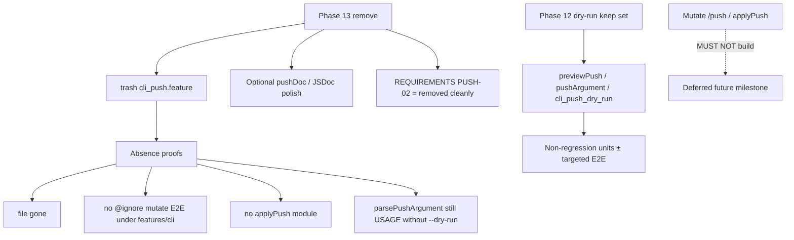

# Phase 13: Resolve safe push (story 6) - Research

**Researched:** 2026-08-03
**Domain:** CLI Story 6 WIP remove — delete `@ignore` mutate-push E2E; preserve Phase 12 dry-run `/push --dry-run`
**Confidence:** HIGH (TRIAGE delete/keep set, file existence, orphan scan, proof commands); MEDIUM (exact durable help wording left to discretion)

<user_constraints>
## User Constraints (from CONTEXT.md)

### Locked Decisions

#### Verdict application (PUSH-02)
- **D-01:** Phase 13 applies TRIAGE Story 6 **remove**. Do **not** strengthen or build mutating `/push`, version-safe update, conflict-refuse-on-mutate, or post-push baseline refresh. Those acceptance bullets remain unmet by design until a future milestone; this phase only clears WIP debris. — **Reversibility:** one-way — deleting the `@ignore` feature removes the unfinished Story 6 E2E scaffold (rebuild later if product wants mutate push).

#### Delete set
- **D-02:** Delete `e2e_test/features/cli/cli_push.feature` (TRIAGE sole Story-6-only delete target). Before close, quickly scan for other Story-6-only WIP that exists solely for that feature (orphaned glue, spent training plans that describe only mutate push). Do **not** delete shared dry-run modules, `cli_push_dry_run.feature`, or `docs/plans/2026-07-30-cli-push-dry-run-known-issues.md` (Story 5 / dry-run surface — Phase 14 hygiene if still spent). — **Reversibility:** one-way for the feature file; shared keep set is reversible polish only.

#### Shared dry-run surface (leave Phase 12)
- **D-03:** Keep TRIAGE shared keep set untouched for behavior: `pushSlashCommand`, `previewPush`, `pushArgument` (still requires `--dry-run`), `pushBaseline`, `diffReport`, export/read/unzip helpers, and their units / `cli_push_dry_run.feature`. Phase 12 already closed PUSH-01; Phase 13 must not regress dry-run. — **Reversibility:** costly if shared readers/preview regress export/pull/dry-run.
- **D-04:** Optional light help/doc polish only: if `pushDoc` still says “Only --dry-run is supported so far.” (WIP tone implying mutate is coming), rephrase to durable dry-run-only product copy with no promise of a future mutate push in this command. Do **not** relax `parsePushArgument`’s `--dry-run` requirement. — **Reversibility:** reversible — copy only.

#### Proof strategy
- **D-05:** Prove remove via: (1) `cli_push.feature` absent from the tree; (2) no Story-6 `@ignore` mutate-push E2E left under `e2e_test/features/cli/`; (3) `parsePushArgument` still rejects non–dry-run; (4) no `applyPush` (or equivalent) module appears; (5) targeted `cli_push_dry_run` E2E (or existing green dry-run units) still pass so shared surface is intact; (6) mark **PUSH-02** complete in REQUIREMENTS/ROADMAP as **removed cleanly**. Capability-named artifacts only — no phase numbers in product/test names. — **Reversibility:** reversible for planning checkboxes; proofs are the contract for Phase 14 hygiene.

#### Plan / commit sizing (user request)
- **D-06:** Config granularity stays **coarse** (already max). Phase 13 plans/commits must be **slightly larger than Phase 12**: prefer **1 plan** with **1 task** that deletes WIP + optional help polish + REQUIREMENTS/ROADMAP/STATE closure together. Prefer **one implementation commit** (or one code commit + one docs commit only if hooks force it) — avoid separate micro-commits for “delete file” vs “help tweak” vs “mark PUSH-02 done”. — **Reversibility:** reversible — planning/execution preference only.

### Claude's Discretion
- Exact durable wording for dry-run-only `/push` help (as long as D-04 holds and no mutate promise)
- Whether a tiny unit asserting `--dry-run` mandatory remains untouched or gets a one-line comment cleanup
- Whether spent Story-6-only training notes under `docs/plans/` or `.planning/` are left for Phase 14 vs deleted here if unambiguously mutate-push-only debris

### Deferred Ideas (OUT OF SCOPE)
- Implementing Story 6 mutate push (body/frontmatter update, version guard, conflict refuse, metadata refresh, idempotent re-push) — future milestone, not Phase 13
- Broader spent training-doc cleanup (`docs/plans/*`, phase diaries) — Phase 14 HYG-01
- SEED-001 spelling follow-ons — parked
- Stories 7–10 portable create-rename-move — out of milestone
</user_constraints>

<phase_requirements>
## Phase Requirements

| ID | Description | Research Support |
|----|-------------|------------------|
| PUSH-02 | Kept or strengthened push of existing notes matches story 6 (body + supported frontmatter; version-safe; conflicts not silent overwrite; successful push refreshes sync metadata) — or **removed cleanly** | TRIAGE Story 6 verdict is **remove** (D-01). Do **not** implement mutate push. Delete sole Story-6-only WIP `e2e_test/features/cli/cli_push.feature` (D-02). Keep Phase 12 dry-run surface intact (D-03). Optional D-04 help polish only. Prove via absence + dry-run non-regression + REQUIREMENTS/ROADMAP checkbox as **removed cleanly** (D-05). Coarse 1 plan / 1 task / prefer one commit (D-06). HYG-02: do not rewrite Terry Yin / Tan Yeong Sheng work — delete target authored by Eric Yeh; optional polish on Ben Huang `pushSlashCommand`. |
</phase_requirements>

## Summary

Phase 13 applies Phase 7’s Story 6 **remove** verdict so mutating `/push` WIP is cleanly gone without building Story 6. Oracle Story 6 acceptance (body/frontmatter update, version guard, conflict refuse-on-mutate, metadata refresh, idempotent re-push) is cited only as the **gap justification for remove** — not as Phase 13 implement targets. The sole Story-6-only participant artifact is `@ignore` `e2e_test/features/cli/cli_push.feature` (Eric Yeh). Shared dry-run modules (`pushSlashCommand`, `previewPush`, `pushArgument`, baselines, `cli_push_dry_run.feature`) stay as the Phase 12 PUSH-01 surface. There is **no** `applyPush` (or equivalent) under `cli/src/sync/` today, and `parsePushArgument` already rejects non–dry-run with `Usage: /push --dry-run <workspace path>`.

Orphan scan this session found **no** Story-6-only step-definition glue, **no** `applyPush` module, and **no** mutate-only plan under `docs/plans/` (the only push plan file is dry-run known-issues — keep for Phase 14). After delete, `e2e_test/features/cli/` has **zero** `@ignore` features. PUSH-02 closes by checking the existing “or removed cleanly” requirement wording — same checkbox pattern as PUSH-01/LINT-01, with STATE noting remove (not strengthen).

**Primary recommendation:** One coarse plan (D-06) with **1 task**: `trash` `cli_push.feature` + optional durable `pushDoc` (and discretionary `pushArgument` JSDoc) polish + absence/dry-run proofs + mark PUSH-02/ROADMAP/STATE complete in **one** implementation commit preferred (bundle planning closure with the delete — slightly larger than Phase 12’s feat+docs split).

## Architectural Responsibility Map

| Capability | Primary Tier | Secondary Tier | Rationale |
|------------|-------------|----------------|-----------|
| Delete Story-6 `@ignore` mutate E2E | E2E filesystem (`cli_push.feature`) | — | D-02 sole delete target |
| Keep dry-run `/push` behavior | CLI (`previewPush`, `pushArgument`, `pushSlashCommand`) | — | D-03; Phase 12 already green |
| Optional dry-run-only help copy | CLI (`pushDoc` in `pushSlashCommand.tsx`) | — | D-04 copy-only |
| Prove no mutate path | CLI units + tree absence | — | D-05; no new mutate module |
| Mark PUSH-02 removed cleanly | Planning (REQUIREMENTS/ROADMAP/STATE) | — | D-05/D-06 bundled close |
| Future mutate push | Deferred | — | D-01 / deferred — not this phase |

## Standard Stack

### Core

| Library | Version | Purpose | Why Standard |
|---------|---------|---------|--------------|
| TypeScript CLI (`cli/`) | in-repo | Dry-run `/push` keep surface | No new runtime; remove-only phase |
| Vitest | `4.1.10` `[VERIFIED: cli/package.json]` | Unit non-regression | Project CLI test runner |
| Cypress + cucumber | in-repo E2E | Dry-run E2E non-regression | Existing `cli_push_dry_run.feature` |
| `trash` | `/usr/bin/trash` (host) | Delete WIP feature | Repo rule: prefer `trash` over `rm -f` |

### Supporting

| Library | Version | Purpose | When to Use |
|---------|---------|---------|-------------|
| `parsePushArgument` | in-repo `pushArgument.ts` | Mandate `--dry-run` | Keep; do not relax (D-03/D-04) |
| `previewPush` | in-repo | Conflict-aware dry-run | Keep; Phase 12 surface |
| `pushBaseline` / export helpers | in-repo | Shared Stories 1/3/5 | Keep; no Story-6-only ownership |
| Cypress tag filter | `e2e_test/config/ci.ts` | Skips `@ignore` | After delete, no Story-6 `@ignore` left under CLI features |

### Alternatives Considered

| Instead of | Could Use | Tradeoff |
|------------|-----------|----------|
| Delete `@ignore` feature (remove) | Implement mutate push to make scenarios green | Forbidden by D-01 / TRIAGE remove |
| Delete feature only | Also delete shared dry-run modules | Forbidden by D-02/D-03 — would regress PUSH-01 |
| Leave “so far” help text | Durable dry-run-only copy (D-04) | Leaving WIP tone implies mutate is coming |
| Separate micro-commits | One bundled commit (D-06) | Micro-splits contradict coarse + “slightly larger than Phase 12” |

**Installation:** none — no new packages.

**Version verification:** Vitest `4.1.10` in `cli/package.json`. Host: Node `v24.5.0`, pnpm `11.19.0`, `trash` at `/usr/bin/trash`. No registry installs.

## Package Legitimacy Audit

> No external packages are installed in this phase.

| Package | Registry | Age | Downloads | Source Repo | Verdict | Disposition |
|---------|----------|-----|-----------|-------------|---------|-------------|
| — | — | — | — | — | N/A | No new packages |

**Packages removed due to [SLOP] verdict:** none  
**Packages flagged as suspicious [SUS]:** none

## Architecture Patterns

### System Architecture Diagram



### Recommended Project Structure (touch set)

```
e2e_test/features/cli/
├── cli_push.feature          # DELETE (Story-6-only @ignore WIP)
└── cli_push_dry_run.feature  # KEEP — non-regression

cli/src/commands/notebook/
└── pushSlashCommand.tsx      # KEEP; optional D-04 pushDoc polish only

cli/src/sync/
├── pushArgument.ts           # KEEP; do not relax --dry-run; optional JSDoc polish
├── previewPush.ts            # KEEP untouched for behavior
├── pushBaseline.ts           # KEEP
└── (no applyPush.ts)         # must remain absent

cli/tests/
├── pushArgument.test.ts      # KEEP — non-regression for mandatory --dry-run
├── previewPush*.test.ts      # KEEP — dry-run units
└── pushBaseline.test.ts      # KEEP

.planning/
├── REQUIREMENTS.md           # [x] PUSH-02 (removed cleanly)
├── ROADMAP.md / STATE.md     # Phase 13 complete
└── docs/plans/2026-07-30-cli-push-dry-run-known-issues.md  # KEEP → Phase 14
```

### Pattern 1: WIP remove-by-default (no invent)

**What:** When TRIAGE verdict is **remove**, delete the unfinished participant path; do not strengthen empty surfaces into new product capabilities in the same phase.  
**When to use:** `@ignore` / half-wired E2E with no keepable mutate module (Story 6).  
**Example proof (absence, not green mutate scenarios):**

```bash
# Source: D-05 / TRIAGE Story 6 finish sketch
test ! -f e2e_test/features/cli/cli_push.feature
! ls cli/src/sync/applyPush* 2>/dev/null
rg -n '^@ignore' e2e_test/features/cli/   # expect no matches after delete
```

### Pattern 2: Shared keep set isolation

**What:** Story 5/6 share `/push` dry-run modules; Story 6 remove must not touch shared behavior.  
**When to use:** Any remove that overlaps a prior strengthen phase.  
**Verified keep list (TRIAGE Story 6 delete/keep table):** `pushSlashCommand.tsx`, `previewPush.ts`, `pushArgument.ts`, `pushBaseline.ts`, `diffReport.ts`, `readWorkspace.ts`, `exportNotebook.ts`, `unzip.ts`, `writeNotebookExport.ts`, `notebookStageSlashCommands.ts`, `cli_push_dry_run.feature`, `previewPush.test.ts` (+ Phase 12 splits), `pushArgument.test.ts`, `pushBaseline.test.ts`.

### Pattern 3: REQUIREMENTS “removed cleanly” close

**What:** Flip checkbox `[x]` on the existing requirement line that already ends with “— or removed cleanly”; set Traceability Status to `Complete`; do **not** rewrite the requirement into a mutate-push success claim.  
**When to use:** Remove verdicts (PUSH-02).  
**Precedent:** Phase 12 docs commit `ea566e90df` flipped PUSH-01 `[x]` + Traceability `Complete` without changing the requirement sentence shape `[VERIFIED: git show ea566e90df -- .planning/REQUIREMENTS.md]`.

### Anti-Patterns to Avoid

- **Implementing mutate push / `applyPush`:** Violates D-01; invents out-of-milestone product work.
- **Deleting `cli_push_dry_run.feature` or dry-run modules:** Regresses PUSH-01; violates D-02/D-03.
- **Relaxing `parsePushArgument`:** Turns `/push` without `--dry-run` into a false mutate entry.
- **Leaving “so far” / “not implemented yet” copy:** WIP tone that promises mutate (D-04).
- **Encoding phase numbers in product/test names:** Local planning rule.
- **Touching Terry / Yeong Sheng modules:** HYG-02; this phase’s delete/polish targets are Eric Yeh / Ben Huang.

## Don't Hand-Roll

| Problem | Don't Build | Use Instead | Why |
|---------|-------------|-------------|-----|
| Story 6 acceptance | Mutating `/push`, version guard, conflict refuse, baseline refresh | Delete WIP + leave dry-run | TRIAGE remove; gaps justify remove, not build |
| Prove remove | New green mutate E2E scenarios | Absence + dry-run non-regression (D-05) | Inventing mutate E2E fights the verdict |
| Delete file | `rm -f` / `rm -rf` | `trash` | `general.mdc` |
| Orphan glue hunt | Broad refactor of sync pull steps | Scan then leave shared steps | `1 note updated.` is shared with `cli_sync_pull.feature` |

**Key insight:** Story 6 has no mutate implementation surface to strengthen — only `@ignore` aspirational E2E. Remove is file deletion + tone cleanup + planning close, not a sync engine feature.

## Runtime State Inventory

> Delete / remove phase — runtime leftovers after git tree update.

| Category | Items Found | Action Required |
|----------|-------------|------------------|
| Stored data | None — feature file is not a DB key / Redis key / collection name | None — verified by nature of artifact (Gherkin under `e2e_test/`) |
| Live service config | None — Cypress discovers features from filesystem; no external UI config for this feature name | None |
| OS-registered state | None — not a launchd/systemd/pm2 unit | None |
| Secrets/env vars | None — no env var named for `cli_push` | None |
| Build artifacts | Cypress may have prior run caches under local Cypress folders; CLI bundle does not embed `.feature` files | No code rename; optional local Cypress cache irrelevant to CI; no reinstall required |

**Nothing found in category:** Explicitly none for all five — verified by orphan scan + `applyPush` absence + feature-only delete target.

## Exact delete surface (research findings)

### Must delete

| Path | Evidence | Author (sample) |
|------|----------|-----------------|
| `e2e_test/features/cli/cli_push.feature` | TRIAGE Story 6 delete set; line 1 `@ignore`; scenarios call `/push ./BenNotebook` without `--dry-run` and expect `1 note updated.` | Eric Yeh `[VERIFIED: git log --follow]` |

Feature content (mutate aspirational; not executable in CI):

```1:4:e2e_test/features/cli/cli_push.feature
@ignore
@withCliConfig
@interactiveCLI
@disableOpenAiService
```

```26:36:e2e_test/features/cli/cli_push.feature
  Scenario: A body edited locally reaches Doughnut
    Given the workspace "./BenNotebook" holds the same content as "Ben Notebook"
    When the file "less.md" in the workspace "./BenNotebook" is:
      """
      # less

      Hello from Obsidian
      """
    And I enter the slash command "/push ./BenNotebook" in the interactive CLI
    Then I should see "1 note updated." in past CLI assistant messages
```

### Must keep (do not delete)

| Path | Why |
|------|-----|
| `e2e_test/features/cli/cli_push_dry_run.feature` | Phase 12 PUSH-01 proof |
| `cli/src/commands/notebook/pushSlashCommand.tsx` | Dry-run entry; optional polish only |
| `cli/src/sync/{pushArgument,previewPush,pushBaseline,diffReport,readWorkspace,exportNotebook,unzip,writeNotebookExport}.ts` | Shared keep set |
| `cli/src/commands/notebook/notebookStageSlashCommands.ts` | Registers dry-run `/push` |
| `cli/tests/pushArgument.test.ts`, `previewPush*.test.ts`, `pushBaseline.test.ts` | Non-regression |
| `docs/plans/2026-07-30-cli-push-dry-run-known-issues.md` | Story 5 dry-run known issues — Phase 14 hygiene if spent (D-02) |

### Orphan scan results (this session)

| Candidate | Result |
|-----------|--------|
| `cli/src/sync/applyPush*` | **Absent** — `no applyPush` |
| Story-6-only step definitions | **None** — scenarios reuse shared interactive CLI steps; `note updated.` also used by `cli_sync_pull.feature` / `syncPull.ts` — **do not delete** those |
| `@ignore` under `e2e_test/features/cli/` | **Only** `cli_push.feature` — after delete, zero `@ignore` CLI features |
| `docs/plans/*` mutate-only | **None** — only dry-run known-issues plan exists |
| Product refs to `cli_push.feature` | **None outside `.planning/`** — delete does not break code imports |

**Discretion recommendation on spent notes:** Leave `.planning/` Story 6 dossier history and `docs/plans/2026-07-30-cli-push-dry-run-known-issues.md` for Phase 14 HYG-01. No unambiguous mutate-push-only training plan file found to delete in Phase 13.

## Help-text polish options (D-04)

Current WIP tone `[VERIFIED: cli/src/commands/notebook/pushSlashCommand.tsx:16-20]`:

```16:20:cli/src/commands/notebook/pushSlashCommand.tsx
const pushDoc: CommandDoc = {
  name: '/push',
  usage: '/push --dry-run <workspace path>',
  description:
    'Preview what pushing the workspace would change in Doughnut. Only --dry-run is supported so far.',
}
```

Related comment tone `[VERIFIED: cli/src/sync/pushArgument.ts:11-15]`:

```11:15:cli/src/sync/pushArgument.ts
/**
 * Read `--dry-run <workspace path>`. The flag is mandatory, unlike `/sync`'s:
 * a real, mutating push is not implemented yet, so any call without it is a
 * usage error rather than a second mode.
 */
```

**Recommended durable options (planner may pick one):**

| Surface | Suggested copy | Avoid |
|---------|----------------|-------|
| `pushDoc.description` | `Preview what pushing the workspace would change in Doughnut. Requires --dry-run.` | “so far”, “coming soon”, “not yet” |
| Alt | `Preview push changes without applying them. Only --dry-run is supported.` | Any mutate promise |
| `pushArgument` JSDoc (discretion) | Flag mandatory because `/push` is dry-run-only (usage error without it), unlike `/sync` | “not implemented yet” |

**Do not** change `usage`, `USAGE` string, or `parsePushArgument` acceptance rules.

## Common Pitfalls

### Pitfall 1: Building mutate push “while we’re here”
**What goes wrong:** Executor treats Story 6 oracle bullets as implement targets.  
**Why it happens:** REQUIREMENTS text lists strengthen *or* remove; ROADMAP success criteria still mention keep/strengthen branch.  
**How to avoid:** CONTEXT D-01 + TRIAGE verdict **remove** are authoritative; oracle bullets are gap citations only.  
**Warning signs:** New `applyPush.ts`, relaxing `--dry-run`, green scenarios for `/push ./path` without flag.

### Pitfall 2: Deleting shared dry-run or sync-pull glue
**What goes wrong:** Removing `cli_push_dry_run.feature`, `previewPush`, or shared “note updated” helpers.  
**Why it happens:** Over-broad “push cleanup” reading of orphans.  
**How to avoid:** TRIAGE keep set + orphan scan results above; shared steps stay.  
**Warning signs:** PUSH-01 E2E/unit failures; `cli_sync_pull` regressions.

### Pitfall 3: Proving remove by inventing mutate E2E
**What goes wrong:** New capability E2E for body/property push.  
**Why it happens:** Habit from strengthen phases.  
**How to avoid:** D-05 absence contract only.  
**Warning signs:** New `cli_*.feature` for mutate push; `@wip` mutate scenarios.

### Pitfall 4: Micro-commit / micro-plan split
**What goes wrong:** Separate commits for trash vs help vs REQUIREMENTS.  
**Why it happens:** Phase 12 precedent was feat then docs.  
**How to avoid:** D-06 — prefer **one** commit bundling delete + optional polish + planning close; second docs-only only if hooks force.  
**Warning signs:** Three tiny commits for one Behavior phase.

### Pitfall 5: Marking PUSH-02 as “implemented”
**What goes wrong:** SUMMARY claims mutate push delivered.  
**Why it happens:** Checkbox semantics confused with strengthen.  
**How to avoid:** Explicit “removed cleanly” in SUMMARY/STATE decisions; leave requirement sentence’s “or removed cleanly” clause as the meaning of `[x]`.  
**Warning signs:** STATE saying “PUSH-02 strengthen landed”.

### Pitfall 6: Using `rm -f` instead of `trash`
**What goes wrong:** Violates repo delete preference.  
**How to avoid:** `trash e2e_test/features/cli/cli_push.feature` via Nix shell if needed.

## Code Examples

### Delete (preferred)

```bash
# Prefer trash (general.mdc); run via Nix when using repo tooling norms
CURSOR_DEV=true nix develop -c trash e2e_test/features/cli/cli_push.feature
# or host trash if already on PATH:
trash e2e_test/features/cli/cli_push.feature
```

### Absence proofs (D-05)

```bash
test ! -e e2e_test/features/cli/cli_push.feature
rg -n '^@ignore' e2e_test/features/cli/ || true   # expect no matches
test ! -e cli/src/sync/applyPush.ts
# optional: ensure no applyPush* filename
ls cli/src/sync/applyPush* 2>/dev/null && exit 1 || true
```

### Non-regression — units (preferred fast gate)

```bash
CURSOR_DEV=true nix develop -c bash -c 'cd cli && pnpm exec vitest run tests/pushArgument.test.ts tests/previewPush.test.ts tests/previewPush.create.test.ts tests/previewPush.conflict.test.ts tests/previewPush.directional.test.ts'
```

Key existing unit (keep; proves mandatory dry-run) `[VERIFIED: cli/tests/pushArgument.test.ts:29-34]`:

```29:34:cli/tests/pushArgument.test.ts
  test('rejects a workspace path with no dry run flag', () => {
    expect(parsePushArgument('./BenNotebook')).toEqual({
      error: 'Usage: /push --dry-run <workspace path>',
    })
  })
```

### Non-regression — targeted E2E (phase gate if time allows / D-05)

```bash
# Assume pnpm sut already running
CURSOR_DEV=true nix develop -c pnpm cypress run --spec e2e_test/features/cli/cli_push_dry_run.feature
```

CI already excludes `@ignore` `[VERIFIED: e2e_test/config/ci.ts:7]`:

```7:7:e2e_test/config/ci.ts
    tags: process.env.CI ? 'not @ignore and not @wip' : 'not @ignore',
```

Deleting the file is stronger than relying on `@ignore` forever.

### REQUIREMENTS / ROADMAP close pattern

```markdown
# REQUIREMENTS.md — flip checkbox only (wording already includes “or removed cleanly”)
- [x] **PUSH-02**: … — or removed cleanly

# Traceability
| PUSH-02 | Phase 13 | Complete |

# ROADMAP — mark Phase 13 done; plan checkbox; Progress table Complete
# STATE — note: PUSH-02 closed as **removed cleanly** (deleted cli_push.feature; dry-run kept)
```

## State of the Art

| Old Approach | Current Approach | When Changed | Impact |
|--------------|------------------|--------------|--------|
| `@ignore` mutate-push E2E scaffold | Delete WIP; dry-run-only `/push` remains | Phase 13 (this) | Class mainline without false mutate promise |
| Dry-run wrote baseline | Load-only dry-run | Phase 12 | PUSH-01 closed; keep intact |
| WIP help “so far” | Durable dry-run-only copy | Phase 13 optional | Matches product truth |

**Deprecated/outdated:**
- Treating Story 6 oracle as Phase 13 build list — superseded by TRIAGE **remove**.
- Keeping `@ignore` mutate feature “for later” on mainline — WIP remove-by-default (PROJECT.md).

## Assumptions Log

| # | Claim | Section | Risk if Wrong |
|---|-------|---------|---------------|
| A1 | Durable help: `Requires --dry-run.` (or equivalent) without “so far” is enough for D-04 | Help-text polish | Product may prefer different marketing wording — still reversible |
| A2 | No Story-6-only training plan file needs deletion in Phase 13 (defer to Phase 14) | Orphan scan / Discretion | If a mutate-only plan appears later, Phase 14 HYG-01 still catches it |
| A3 | Bundling REQUIREMENTS/ROADMAP/STATE into the same commit as the delete is preferred and usually hook-safe | Plan shape / D-06 | If hooks force split, one code + one docs commit still satisfies D-06 |
| A4 | Unit non-regression of `pushArgument` + `previewPush*` is sufficient when E2E time-budget is tight; still run targeted `cli_push_dry_run` at phase gate when `pnpm sut` is healthy | Validation | Flaky/missing E2E could miss a shared-surface regression — prefer running E2E at gate |

**If empty table:** N/A — discretion items logged above.

## Open Questions

1. **Bundle planning docs into the implementation commit?**
   - What we know: Phase 12 used feat then `docs(12-01): complete…`. D-06 asks for slightly larger / prefer one commit.
   - What's unclear: Whether pre-commit hooks ever reject mixing `.planning/` with product deletes.
   - Recommendation: Try **one** commit with feature delete + optional help polish + REQUIREMENTS/ROADMAP/STATE/SUMMARY; fall back to code+docs only if hooks force (D-06).

2. **How loudly to document “removed cleanly” in REQUIREMENTS?**
   - What we know: Prior closes only flip `[x]` without annotating strengthen vs remove on the checkbox line.
   - What's unclear: Whether maintainers want an explicit Notes bullet under Traceability.
   - Recommendation: Keep checkbox pattern; put “removed cleanly (deleted `cli_push.feature`)” in STATE decisions + SUMMARY — enough for Phase 14.

## Environment Availability

| Dependency | Required By | Available | Version | Fallback |
|------------|------------|-----------|---------|----------|
| Node | Vitest | ✓ | v24.5.0 | Nix shell |
| pnpm | scripts | ✓ | 11.19.0 | — |
| Vitest | unit non-regression | ✓ | 4.1.10 | — |
| `trash` | delete WIP feature | ✓ | `/usr/bin/trash` | Nix `trash` if host missing |
| Cypress + `pnpm sut` | targeted dry-run E2E | ✓ (assume sut) | in-repo | Units-only interim; run E2E at phase gate |
| New npm packages | — | N/A | — | Do not install |

**Missing dependencies with no fallback:** none  
**Step 2.6:** No new external tools beyond existing CLI/E2E + `trash`.

## Validation Architecture

### Test Framework

| Property | Value |
|----------|-------|
| Framework | Vitest `4.1.10` + Cypress cucumber E2E |
| Config file | `cli/vitest.config.ts`; Cypress `e2e_test/config/ci.ts` |
| Quick run command | `CURSOR_DEV=true nix develop -c bash -c 'cd cli && pnpm exec vitest run tests/pushArgument.test.ts'` |
| Full suite command (targeted) | pushArgument + previewPush\* units + `CURSOR_DEV=true nix develop -c pnpm cypress run --spec e2e_test/features/cli/cli_push_dry_run.feature` |

### Phase Requirements → Test Map

| Req ID | Behavior | Test Type | Automated Command | File Exists? |
|--------|----------|-----------|-------------------|-------------|
| PUSH-02 | `cli_push.feature` absent | filesystem | `test ! -e e2e_test/features/cli/cli_push.feature` | ✅ file exists now → must go |
| PUSH-02 | No Story-6 `@ignore` under `features/cli/` | filesystem/rg | `rg '^@ignore' e2e_test/features/cli/` empty | ✅ only this file today |
| PUSH-02 | Non–dry-run still USAGE | unit | vitest `pushArgument.test.ts` | ✅ |
| PUSH-02 | No `applyPush` module | filesystem | `test ! -e cli/src/sync/applyPush.ts` | ✅ already absent |
| PUSH-02 | Dry-run surface intact | unit (± e2e) | vitest `previewPush*.test.ts`; cypress `cli_push_dry_run.feature` | ✅ |
| PUSH-02 | Marked removed cleanly | planning | REQUIREMENTS `[x]` + Traceability Complete | ❌ Wave 0 (flip at close) |

### Sampling Rate

- **Per task commit:** `pushArgument.test.ts` + absence checks (+ previewPush units if help polish touches nothing behavioral)
- **Per wave merge / phase gate:** units above + targeted `cli_push_dry_run.feature` when sut healthy
- **Phase gate:** Do **not** run full E2E suite unless required

### Wave 0 Gaps

- [ ] Delete `e2e_test/features/cli/cli_push.feature` (creates absence proofs)
- [ ] Optional: rephrase `pushDoc` (+ discretionary `pushArgument` JSDoc) — no new test file required if units already cover USAGE
- [ ] Flip REQUIREMENTS/ROADMAP/STATE for PUSH-02 **removed cleanly**
- [ ] None for mutate-push tests — **do not add** Wave 0 mutate scenarios

*(No new test framework install. Existing infrastructure covers non-regression; absence proofs are shell checks.)*

## Security Domain

> `security_enforcement` enabled (ASVS level 1 per `.planning/config.json`).

### Applicable ASVS Categories

| ASVS Category | Applies | Standard Control |
|---------------|---------|------------------|
| V2 Authentication | no | Existing CLI session unchanged |
| V3 Session Management | no | — |
| V4 Access Control | no new surface | Dry-run export access unchanged; no mutate API added |
| V5 Input Validation | yes | Keep `parsePushArgument` `--dry-run` mandatory |
| V6 Cryptography | no | — |

### Known Threat Patterns for this remove phase

| Pattern | STRIDE | Standard Mitigation |
|---------|--------|---------------------|
| Accidental mutate push lands during “cleanup” | Tampering / Elevation | D-01 prohibition; absence of `applyPush`; keep USAGE without `--dry-run` |
| Deleting dry-run defenses while removing WIP | Tampering | D-03 keep set; non-regression units/E2E |
| Leaving `@ignore` aspirational mutate E2E on mainline | Spoofing (false capability) | Delete `cli_push.feature` (D-02) |

## Project Constraints (from .cursor/rules/)

| Source | Directive |
|--------|-----------|
| `general.mdc` | Tooling via `CURSOR_DEV=true nix develop -c …`; git without Nix; prefer `trash` over `rm -f`; high cohesion; no speculative layers; capability naming in product artifacts |
| `planning.mdc` | Behavior phase = one observable behavior (here: Story 6 WIP gone / PUSH-02 removed cleanly); stop-safe; ~5 min fuzzy / >10 min finer-decompose; capability-named tests; targeted E2E not full suite; wrap-up Jidoka → refactor → plan update → commit → push |
| `gsd-coexistence.mdc` | Local Behavior/Structure + wrap-up overlays win; `granularity: coarse` honored via D-06 |
| `cli.mdc` | Small public exports; Vitest from `cli/`; CLI E2E under `e2e_test/features/cli/` |
| `e2e-authoring.mdc` | Assume `pnpm sut`; `pnpm cypress run --spec <feature>`; no `@focus`/`@only` commits; capability-named features |
| `architecture-decisions.mdc` | No architecture-shaped mutate design in this phase — skip inventing ADR work |

## Recommended plan shape (D-06)

**Plans:** exactly **1** (`13-01-PLAN.md`).

**Tasks:** exactly **1**:

1. **Task A — Remove Story 6 WIP and close PUSH-02:**  
   - `trash` `e2e_test/features/cli/cli_push.feature`  
   - Quick orphan re-scan (confirm no new Story-6-only glue)  
   - Optional D-04 `pushDoc` polish (+ discretionary `pushArgument` JSDoc)  
   - Run absence proofs + `pushArgument` / `previewPush*` units; prefer targeted `cli_push_dry_run` E2E at gate  
   - Mark REQUIREMENTS PUSH-02 `[x]`, Traceability Complete, ROADMAP Phase 13 complete, STATE “removed cleanly”  
   - Do **not** implement mutate push / `applyPush` / relax `--dry-run`

**Commits:** Prefer **one** implementation commit bundling product delete + optional polish + planning closure. Allow second docs-only commit only if hooks force (D-06 — slightly larger than Phase 12 by avoiding micro-splits and preferring single commit).

**Prohibitions for PLAN:**
- Do not install packages
- Do not create `applyPush` or mutate `/push`
- Do not relax `parsePushArgument`
- Do not delete `cli_push_dry_run.feature`, dry-run modules, or `docs/plans/2026-07-30-cli-push-dry-run-known-issues.md`
- Do not edit Terry Yin / Tan Yeong Sheng–owned modules (HYG-02)
- Do not encode phase numbers in product/test names
- Do not add mutate-push E2E “for later”

## Story 6 acceptance (oracle — gaps only, not implement targets)

From `.planning/notes/2026-07-24-portable-notebook-workspace.md` §6 `[VERIFIED: lines 74-78]`:

- The body and supported frontmatter fields of an identified note can be updated.
- The update succeeds only when the Doughnut note still matches the version last synchronized.
- A concurrent remote edit produces a conflict and neither version is silently overwritten.
- A successful push refreshes the local representation and sync metadata.
- Repeating the push without further changes has no effect.

All five remain **gaps by design** after Phase 13; future milestone may implement. Phase 13 success = debris gone + dry-run healthy + PUSH-02 marked **removed cleanly**.

## Sources

### Primary (HIGH confidence)

- `.planning/phases/13-resolve-safe-push-story-6/13-CONTEXT.md` — D-01..D-06 locked
- `.planning/phases/07-publish-triage-decisions/TRIAGE.md` — Story 6 verdict remove; delete/keep set; finish sketch
- `.planning/phases/12-resolve-push-dry-run-story-5/12-CONTEXT.md` — D-06 Story 6 boundary; dry-run keep
- `.planning/notes/2026-07-24-portable-notebook-workspace.md` — Story 6 acceptance (gaps)
- `.planning/REQUIREMENTS.md` — PUSH-02 pending; “or removed cleanly”
- `e2e_test/features/cli/cli_push.feature` — Read this session (`@ignore` mutate scenarios)
- `cli/src/commands/notebook/pushSlashCommand.tsx`, `cli/src/sync/pushArgument.ts` — Read this session
- `cli/tests/pushArgument.test.ts` — Read this session
- `e2e_test/config/ci.ts` — `@ignore` tag filter
- Orphan scan: no `applyPush`; no Story-6-only step glue; only one `@ignore` CLI feature
- Git precedent `ea566e90df` — REQUIREMENTS/ROADMAP close pattern for Phase 12

### Secondary (MEDIUM confidence)

- Discretion help-copy recommendations (A1)
- Commit bundling vs Phase 12 feat/docs split (A3)

### Tertiary (LOW confidence)

- None material — no external library research required (remove-only, no new packages)

## Metadata

**Confidence breakdown:**
- Standard stack: HIGH — in-repo only; versions verified
- Architecture: HIGH — TRIAGE delete/keep + orphan scan verified by Read/rg/ls
- Pitfalls: HIGH — remove-vs-build confusion and shared-keep regressions are the main risks

**Research date:** 2026-08-03  
**Valid until:** 2026-09-02 (stable remove contract; re-check if someone lands mutate push before execute)

---

## RESEARCH COMPLETE
