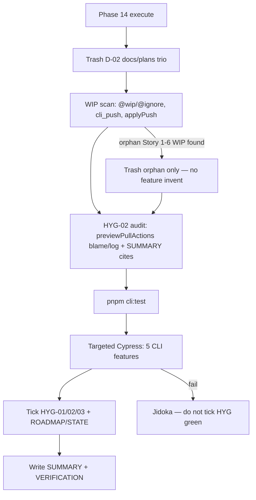

# Phase 14: Class-ready hygiene verify - Research

**Researched:** 2026-08-03
**Domain:** Milestone hygiene verify — spent-doc trash, HYG-02 author audit, targeted CLI green proof
**Confidence:** HIGH

<user_constraints>
## User Constraints (from CONTEXT.md)

### Locked Decisions
### HYG-01 — spent debris cleanup
- **D-01:** Treat HYG-01 as a **product-tree** sweep: remove leftover Stories 1–6 training WIP and spent docs that no longer describe the tree; do **not** re-open keep/strengthen/remove verdicts from TRIAGE or re-implement closed EXP/LINT/PUSH gaps. — **Reversibility:** reversible for planning checkboxes; one-way for deleted spent docs.
- **D-02:** **Delete set (spent training docs under `docs/plans/`):** trash these three plans that are WIP-toned, outdated vs Phase 12/13, or spent agent-execution diaries for portable workspace:
  - `docs/plans/2026-07-30-cli-push-dry-run-known-issues.md` (claims unfixed issues Phase 12 already closed; stale checkout narrative)
  - `docs/plans/2026-07-28-cli-export-notebook.md` (Status: In progress — spent training plan)
  - `docs/plans/2026-07-28-export-notebook-markdown-zip.md` (spent agent plan artifact under `docs/plans/`; product behavior lives in code + E2E)
  Prefer `trash` over `rm`. — **Reversibility:** one-way — files leave the tree (recoverable from git history).
- **D-03:** **Keep / do not delete:** living oracle `.planning/notes/2026-07-24-portable-notebook-workspace.md`; retained capability code/tests/E2E from Phases 8–12 (`cli_export`, `cli_sync_*`, `cli_lint_workspace`, `cli_push_dry_run`, dry-run `/push`); TRIAGE.md and phase CONTEXT/SUMMARY under `.planning/phases/` for this milestone. Bulk archive of `.planning/phases/07–13` diaries is **out of this phase** — defer to `/gsd-complete-milestone` / `/gsd-cleanup` after HYG closes. — **Reversibility:** costly if oracle or green capability surfaces are deleted by mistake.
- **D-04:** **WIP scan proof:** confirm no `@wip` / `@ignore` under `e2e_test/features/cli/` for stories 1–6; `cli_push.feature` remains absent; no `applyPush` (or equivalent mutate-push) module. If any new Story 1–6-only orphaned WIP appears during the scan, trash it under the same remove-by-default bar — do not invent product features to “finish” it. — **Reversibility:** one-way for deletes; scan itself is reversible.

### HYG-02 — Terry / Yeong Sheng untouched (final verify)
- **D-05:** Prove HYG-02 with a **bounded author/file audit**, not a full history rewrite. Method: (1) list protected surfaces called out in TRIAGE / prior CONTEXT (notably Terry-authored `cli/src/sync/previewPullActions.ts` and any Tan Yeong Sheng–attributed paths named in TRIAGE); (2) confirm Phases 8–13 treated them as **import-only / do-not-rewrite** (spot-check `git log` / blame / milestone diffs — no content rewrites of those files beyond allowed participant-owned neighbors); (3) record evidence in the phase SUMMARY/VERIFICATION. Do **not** “clean,” reformat, or refactor Terry/YS files as part of verify. — **Reversibility:** reversible — audit/docs only; rewriting Terry/YS would violate HYG-02 itself.

### HYG-03 — retained capability green proof
- **D-06:** Prove green with the **retained CLI capability matrix** (targeted, not full E2E suite):
  - Units: `CURSOR_DEV=true nix develop -c pnpm cli:test` (or equivalent focused suite covering export/sync/lint/push dry-run helpers)
  - Targeted E2E (assume `pnpm sut` already running): `cli_export.feature`, `cli_sync_dry_run.feature`, `cli_sync_pull.feature`, `cli_lint_workspace.feature`, `cli_push_dry_run.feature`
  Do **not** require full Cypress suite or unrelated CLI features (`cli_gmail`, `cli_recall`, etc.) for HYG-03. — **Reversibility:** reversible — proof set can widen later; narrowing below this matrix leaves HYG-03 incomplete.

### Close-out
- **D-07:** On green proofs + debris gone + HYG-02 audit recorded: mark **HYG-01 / HYG-02 / HYG-03** complete in REQUIREMENTS.md and ROADMAP Phase 14 success criteria; update STATE for milestone-ready handoff. Capability-named artifacts only — no phase numbers in product/test names. — **Reversibility:** reversible for planning checkboxes.

### Plan / commit sizing (user request)
- **D-08:** Config granularity stays **coarse** (already max — `config.json` `granularity: coarse`). Phase 14 plans/commits must be **slightly larger than Phase 13**: prefer **1 plan** with **1 task** that lands debris trash + HYG-02 audit notes + full HYG-03 green matrix + REQUIREMENTS/ROADMAP/STATE close **together**. Prefer **one implementation commit** bundling cleanup + verify evidence + planning close (or one product/docs commit + one planning commit only if hooks force a split) — avoid separate micro-commits for “trash docs” vs “run tests” vs “tick HYG boxes”. — **Reversibility:** reversible — planning/execution preference only.

### Claude's Discretion
- Exact SUMMARY/VERIFICATION wording for the HYG-02 audit table
- Whether to run the five E2E specs in one Cypress invocation or sequential `--spec` calls
- Tiny non-product formatting of REQUIREMENTS/ROADMAP close-out text
- Whether any additional spent note under `docs/` (outside the D-02 trio) turns up in the scan and clearly matches HYG-01 — trash only if unambiguously Stories 1–6 training debris that misrepresents the tree

### Deferred Ideas (OUT OF SCOPE)
- Bulk archive/prune of `.planning/phases/07–13` diaries — `/gsd-complete-milestone` / `/gsd-cleanup` after HYG closes
- Implementing Story 6 mutate push — future milestone (PUSH-02 already removed cleanly)
- Stories 7–10 portable create/rename/move — out of milestone
- SEED-001 spelling follow-ons — parked
- Full Cypress suite as a release gate — not required for HYG-03
</user_constraints>

<phase_requirements>
## Phase Requirements

| ID | Description | Research Support |
|----|-------------|------------------|
| HYG-01 | WIP, incorrect, or non-valuable participant code for stories 1–6 is gone (including orphaned tests, `@wip` scenarios that will not be finished, and spent training plans/docs that no longer describe the tree) | Trash D-02 trio under `docs/plans/`; reconfirm WIP scan (`cli_push.feature` absent, no `@wip`/`@ignore` under `e2e_test/features/cli/`, no `applyPush`); do not re-triage Phases 8–13 |
| HYG-02 | Terry Yin and Tan Yeong Sheng changes remain untouched by this milestone’s removals/rewrites | Bounded audit of Terry `previewPullActions.ts` (import-only in Phases 10–13); TRIAGE names no YS-specific delete/rewrite paths; record evidence only — do not rewrite instructors |
| HYG-03 | After triage actions, targeted CLI/unit and relevant CLI E2E for retained capabilities pass; the tree has no leftover training WIP for stories 1–6 | Run `pnpm cli:test` + five retained CLI E2E features; close HYG checkboxes on green |
</phase_requirements>

## Summary

Phase 14 is a **verify + light cleanup** close for milestone v1.2 — not a new product capability and not a re-open of TRIAGE keep/strengthen/remove. Scout this session shows the hard product WIP already cleared by Phase 13: `cli_push.feature` is absent, there are **no** `@wip`/`@ignore` tags under `e2e_test/features/cli/`, and `cli/src/sync/applyPush.ts` does not exist. HYG-01 work remaining is primarily **trashing the three spent `docs/plans/` files** (the entire contents of `docs/plans/` today) plus a confirmation WIP scan. HYG-02 is an **audit-only** gate on Terry-authored `cli/src/sync/previewPullActions.ts` (Phases 10–13 already documented import-only; `git log` shows no post–Phase-9 edits). HYG-03 re-proves the retained portable-workspace CLI matrix with `pnpm cli:test` and five targeted Cucumber features while `pnpm sut` is healthy.

**Primary recommendation:** One coarse plan / one task / one implementation commit: `trash` the D-02 trio → record HYG-02 audit table → run `cli:test` + five E2E specs → tick HYG-01/02/03 in REQUIREMENTS/ROADMAP/STATE → write SUMMARY/VERIFICATION. Do not edit `previewPullActions.ts`, do not mass-delete `.planning/phases/`, do not implement mutate push.

## Architectural Responsibility Map

| Capability | Primary Tier | Secondary Tier | Rationale |
|------------|-------------|----------------|-----------|
| Spent training-doc removal (HYG-01) | CDN / Static (repo docs tree) | — | Files under `docs/plans/` are documentation artifacts, not runtime services |
| WIP scan (`@wip`/`@ignore`, `cli_push`, `applyPush`) | Browser / Client (repo filesystem + E2E features) | API / Backend — | Proof is absence in `e2e_test/features/cli/` and `cli/src/sync/` |
| Instructor untouched audit (HYG-02) | API / Backend (git history / blame) | — | Evidence from `git log`/`blame` + prior SUMMARY claims; no code rewrite |
| Retained CLI unit green (HYG-03) | API / Backend (CLI Vitest) | — | `pnpm cli:test` exercises `cli/tests/**` |
| Retained CLI E2E green (HYG-03) | Browser / Client (Cypress + SUT) | API / Backend | Interactive CLI features against running SUT |
| Planning checkbox close (D-07) | CDN / Static (`.planning/`) | — | REQUIREMENTS/ROADMAP/STATE only |

## Standard Stack

### Core
| Library / Tool | Version | Purpose | Why Standard |
|----------------|---------|---------|--------------|
| Vitest (CLI) | `4.1.10` `[VERIFIED: cli/package.json:50]` | CLI unit suite via `pnpm cli:test` | Repo CLI test runner `[VERIFIED: .planning/codebase/TESTING.md:10-11]` |
| Cypress | `15.19.0` `[VERIFIED: package.json:99]` | Targeted CLI E2E | Repo E2E runner `[VERIFIED: .planning/codebase/TESTING.md:12]` |
| `@badeball/cypress-cucumber-preprocessor` | `^26.0.0` `[VERIFIED: package.json:86]` | Gherkin `.feature` execution | Existing E2E stack |
| trash-cli (Nix) | `0.24.5.26` `[VERIFIED: nix env trash --version]` | Recoverable deletes for D-02 | Repo rule prefers `trash` over `rm` `[VERIFIED: .cursor/rules/general.mdc]` |

### Supporting
| Library / Tool | Version | Purpose | When to Use |
|----------------|---------|---------|-------------|
| pnpm | `11.19.0` (Nix) `[VERIFIED: nix develop]` | Script runner | All `pnpm cli:test` / `cypress run` invocations |
| Node | `v26.5.0` (Nix) `[VERIFIED: nix develop]` | CLI/E2E runtime | Inside Nix shell |
| Host `trash` | `/usr/bin/trash` (macOS) | Fallback delete | OK if Nix `trash` unavailable; prefer Nix for consistency |

### Alternatives Considered
| Instead of | Could Use | Tradeoff |
|------------|-----------|----------|
| One Cypress `--spec` with five comma-separated paths | Five sequential `--spec` runs | One invocation is faster/fewer process starts; sequential isolates failures — **discretion** |
| `trash` | `git rm` / `rm` | `git rm` also works for tracked files; `rm` violates repo preference; `trash` matches Phase 13 pattern |
| Full `pnpm cy:run` | Targeted five features | Forbidden for HYG-03 completeness bar (D-06 / deferred) |

**Installation:** None — no new packages for this phase.

**Version verification:** Cypress `15.19.0`, Vitest `4.1.10`, cypress-cucumber-preprocessor `^26.0.0` read from lockfile-backed `package.json` / `cli/package.json` this session. No registry install planned.

## Package Legitimacy Audit

> No external packages are installed in this phase.

| Package | Registry | Age | Downloads | Source Repo | Verdict | Disposition |
|---------|----------|-----|-----------|-------------|---------|-------------|
| — | — | — | — | — | N/A | No installs |

**Packages removed due to [SLOP] verdict:** none  
**Packages flagged as suspicious [SUS]:** none

## Architecture Patterns

### System Architecture Diagram



### Recommended Project Structure

No new product modules. Touch set:

```
docs/plans/                                      # empty after trash (or remove dir if empty)
e2e_test/features/cli/                           # scan only; keep five retained features
cli/src/sync/previewPullActions.ts               # HYG-02 protected — do not edit
cli/src/sync/applyPush.ts                        # must remain absent
.planning/REQUIREMENTS.md                        # tick HYG-01..03
.planning/ROADMAP.md                             # Phase 14 complete
.planning/STATE.md                               # milestone-ready handoff
.planning/phases/14-class-ready-hygiene-verify/  # SUMMARY + VERIFICATION
```

### Pattern 1: One coarse tracer (D-08)
**What:** Single plan, single task, single commit bundling trash + audit notes + green matrix + planning close — same shape as Phase 13, slightly larger by covering all three HYG IDs.
**When to use:** Always for Phase 14 (locked).
**Example:** Follow Phase 13 `13-01` bundling: delete + polish + REQUIREMENTS/ROADMAP/STATE in one commit `[VERIFIED: .planning/phases/13-resolve-safe-push-story-6/13-01-SUMMARY.md:115-117]`.

### Pattern 2: trash over rm
**What:** `CURSOR_DEV=true nix develop -c trash <path>` (or host `trash` on PATH).
**When to use:** D-02 deletes and any discretionary orphan WIP.
**Example:** Phase 13 used trash for `cli_push.feature` `[VERIFIED: .planning/phases/13-resolve-safe-push-story-6/13-01-SUMMARY.md:107]`.

### Pattern 3: Import-only instructor surfaces (HYG-02)
**What:** Consumers import from `previewPullActions.ts`; strengthen phases never edit that file.
**When to use:** Any future touch near pull/lint/push classify helpers — Phase 14 only verifies.
**Example consumers** `[VERIFIED: rg this session]`: `applyPull.ts`, `previewPull.ts`, `previewPush.ts`, `diffReport.ts`, `portableContract.ts`.

### Anti-Patterns to Avoid
- **Re-triaging Stories 1–6:** TRIAGE verdicts are closed; Phase 14 does not strengthen gaps again (D-01).
- **Rewriting Terry/YS “for hygiene”:** Violates HYG-02 / D-05.
- **Mass-deleting `.planning/phases/07–13`:** Deferred to complete-milestone (D-03 / deferred).
- **Full Cypress suite as HYG-03 gate:** Explicitly out of scope (D-06).
- **`cypress run -- --spec`:** Empty `--` drops `--spec` `[VERIFIED: .cursor/rules/e2e-authoring.mdc:30]`.
- **Inventing mutate push to “finish” orphans:** Remove-by-default only (D-04).

## Don't Hand-Roll

| Problem | Don't Build | Use Instead | Why |
|---------|-------------|-------------|-----|
| Recoverable file delete | Custom backup scripts | `trash` (Nix trash-cli) | Repo standard; git history also recovers tracked deletes |
| Multi-feature E2E proof | New meta-test harness | `pnpm cypress run --spec "a,b,c…"` or sequential `--spec` | Official Cypress multi-spec CLI `[CITED: docs.cypress.io/app/references/command-line]` |
| HYG-02 proof | Full history rewrite / blame rewrite | Bounded table: path, authors, last commits, Phase 10–13 SUMMARY cites | D-05 locked method |
| Class-ready bar | Full product regression suite | D-06 retained matrix only | Stop-safe; deferred full suite |

**Key insight:** Phase 14 value is **absence + green retained matrix + recorded audit**, not new code.

## Runtime State Inventory

> Cleanup/delete phase — inventory of non-git runtime state for D-02 paths and WIP absence.

| Category | Items Found | Action Required |
|----------|-------------|------------------|
| Stored data | None — D-02 targets are markdown under `docs/plans/` only; no DB keys/collections for these paths `[VERIFIED: ls docs/plans/]` | Code/docs edit only (`trash` + commit) |
| Live service config | None — no n8n/Datadog/Cloudflare config embeds these plan filenames | none |
| OS-registered state | `trash` moves files to user Trash (recoverable OS-side); no launchd/systemd units | none beyond trash |
| Secrets/env vars | None tied to these filenames | none |
| Build artifacts | None — `.md` plans are not compiled into bundles | none |

**Nothing found in category:** Stored data / live service / secrets / build artifacts — verified by path listing and phase scope (docs-only deletes + verify).

## Common Pitfalls

### Pitfall 1: Trashing keep-set by mistake
**What goes wrong:** Oracle note, TRIAGE, or retained E2E/features deleted.
**Why it happens:** Over-broad `docs/` or `.planning/` cleanup.
**How to avoid:** Delete **only** the three D-02 paths unless an extra file unambiguously matches HYG-01 (discretion). Keep `.planning/notes/2026-07-24-portable-notebook-workspace.md` `[VERIFIED: exists]`.
**Warning signs:** Diff removes `cli_*` features or `.planning/notes/`.

### Pitfall 2: Editing `previewPullActions.ts` during “verify”
**What goes wrong:** HYG-02 failure by the phase meant to prove it.
**Why it happens:** Lint/format drive-by or “tiny cleanup.”
**How to avoid:** Audit-only; `git diff` must exclude that file.
**Warning signs:** File appears in implementation commit diff.

### Pitfall 3: Claiming HYG-03 green without all five E2E features
**What goes wrong:** Incomplete matrix (e.g. only dry-run).
**Why it happens:** Time pressure; Phase 13 only needed `cli_push_dry_run`.
**How to avoid:** Explicit checklist of five feature paths (D-06).
**Warning signs:** SUMMARY lists fewer than five E2E refs.

### Pitfall 4: Re-opening PUSH-02 / mutate push
**What goes wrong:** Scope creep into Story 6 implementation.
**Why it happens:** Spent known-issues doc describes “unfixed” issues.
**How to avoid:** Trash the known-issues doc; keep dry-run; no `applyPush` (D-01/D-04).
**Warning signs:** New `cli_push.feature` or `applyPush.ts`.

### Pitfall 5: `docs/plans/` empty-dir leftover confusion
**What goes wrong:** Empty directory remains or gets re-filled.
**Why it happens:** Only files trashed, directory left.
**How to avoid:** After trio trash, if `docs/plans/` is empty, leave empty dir or remove dir only if git tracks it — prefer leaving empty or deleting the directory in the same commit if git shows it; do not recreate plans.
**Warning signs:** New files under `docs/plans/` after close.

### Pitfall 6: Stale e2e-authoring claim vs tree
**What goes wrong:** Agent skips CLI E2E thinking “CLI features are `@ignore` in CI.”
**Why it happens:** `.cursor/rules/e2e-authoring.mdc` still says other CLI features are `@ignore` in CI, but retained features use `@withCliConfig` / `@interactiveCLI` and have **no** `@ignore` `[VERIFIED: feature headers this session]`.
**How to avoid:** Trust D-06 matrix + tag scan, not the stale sentence alone.
**Warning signs:** Skipping HYG-03 E2E.

## Code Examples

### Trash D-02 trio
```bash
# Source: Phase 13 pattern + general.mdc trash preference
CURSOR_DEV=true nix develop -c trash \
  docs/plans/2026-07-30-cli-push-dry-run-known-issues.md \
  docs/plans/2026-07-28-cli-export-notebook.md \
  docs/plans/2026-07-28-export-notebook-markdown-zip.md
```

### WIP scan proofs (D-04)
```bash
# Source: Phase 13 SUMMARY coverage D1/D2 pattern
test ! -e e2e_test/features/cli/cli_push.feature
! rg -n '@wip|@ignore' e2e_test/features/cli/
test ! -e cli/src/sync/applyPush.ts
! rg -n 'applyPush' cli/src/ --glob '*.ts*'
```

### HYG-02 audit commands (D-05)
```bash
git log --format='%h %an %s' -- cli/src/sync/previewPullActions.ts
git blame --line-porcelain cli/src/sync/previewPullActions.ts | rg '^author ' | sort | uniq -c
# Expect: authors = Terry Yin only; commits = Phase 09 feat(09-01) trio only
# Confirm Phases 10–13 SUMMARYs cite import-only / not in diff
```

### HYG-03 green matrix (D-06)
```bash
# Units
CURSOR_DEV=true nix develop -c pnpm cli:test

# E2E — recommend one invocation (discretion); quote comma-separated specs
# Source: https://docs.cypress.io/app/references/command-line (--spec multiple files)
CURSOR_DEV=true nix develop -c pnpm cypress run --spec \
  "e2e_test/features/cli/cli_export.feature,e2e_test/features/cli/cli_sync_dry_run.feature,e2e_test/features/cli/cli_sync_pull.feature,e2e_test/features/cli/cli_lint_workspace.feature,e2e_test/features/cli/cli_push_dry_run.feature"
```

Scenario counts for planning time budget `[VERIFIED: rg Scenario this session]`: export 8, sync_dry_run 6, sync_pull 5, lint 8, push_dry_run 11 (~38 scenarios). Prior single-feature runs were ~19–40s each; full matrix may exceed the ~5–10 min slice fuzzy budget — still one Behavior phase / one task per D-08; executor should expect multi-minute E2E, not finer-decompose.

### Suggested HYG-02 audit table (SUMMARY/VERIFICATION — discretion wording)
| Protected surface | Author evidence | Post–Phase-9 edits? | Phase 10–13 treatment | Verdict |
|-------------------|-----------------|---------------------|------------------------|---------|
| `cli/src/sync/previewPullActions.ts` | `git blame`: Terry Yin only (197 lines); `git log`: 3× Terry Yin `feat(09-01):…` | None after Phase 9 tip `b17f517e42` | Import-only (10/11/12 SUMMARY) | Untouched by removals/rewrites |
| Tan Yeong Sheng paths named in TRIAGE | TRIAGE author filter only — **no YS path in delete/keep sets** | N/A | N/A | No TRIAGE-named YS rewrite target |

## State of the Art

| Old Approach | Current Approach | When Changed | Impact |
|--------------|------------------|--------------|--------|
| Story 6 `@ignore` `cli_push.feature` | Feature deleted; dry-run kept | Phase 13 (2026-08-03) | HYG-01 code WIP largely done; Phase 14 = docs + verify |
| Push dry-run “known issues” plan as living backlog | Trash as spent/outdated vs Phase 12 | Phase 14 D-02 | Avoids false “unfixed” narrative on mainline |
| Coarse plans growing 12→13 | Phase 14 one plan covering HYG-01+02+03 | D-08 | Fewer micro-commits |

**Deprecated/outdated:**
- Treating `docs/plans/2026-07-30-cli-push-dry-run-known-issues.md` as open work — Phase 12 closed PUSH-01 gaps; Phase 13 left the doc for HYG-01 `[VERIFIED: 13-01-SUMMARY.md:134]`.
- e2e-authoring blanket “CLI features are `@ignore` in CI” vs current retained features without `@ignore` — trust tag scan.

## Scout Snapshot (pre-execute baselines)

Verified this research session:

| Check | Result |
|-------|--------|
| D-02 trio exists | All three `EXISTS` under `docs/plans/` (only files in that dir) |
| `cli_push.feature` | **ABSENT** |
| `@wip` / `@ignore` under `e2e_test/features/cli/` | **NONE** |
| `applyPush` module / refs in `cli/src` | **ABSENT / NONE** |
| Retained five E2E features | All **EXISTS** |
| Oracle note | **EXISTS** `.planning/notes/2026-07-24-portable-notebook-workspace.md` |
| `previewPullActions.ts` | **EXISTS**; Terry Yin sole author; only Phase 09 commits |
| SUT | `pnpm sut:healthcheck` **OK** |
| Discretionary `docs/refinement/2026-07-27/*` | Historical/spec notes — **not** in D-02; recommend **keep** unless executor finds unambiguous misrepresentation |

## Assumptions Log

| # | Claim | Section | Risk if Wrong |
|---|-------|---------|---------------|
| A1 | Empty `docs/plans/` directory after trash needs no special product follow-up | Pitfalls | Minor: empty dir left in tree |
| A2 | One comma-separated Cypress `--spec` works with this repo’s `specPattern` the same as five sequential runs | Code Examples / Discretion | Executor falls back to sequential `--spec` if multi-spec fails to discover features |
| A3 | No Tan Yeong Sheng–attributed path requires HYG-02 file-level audit beyond TRIAGE’s author-filter statement | HYG-02 table | If a YS path was rewritten in Phases 8–13 unnoticed, audit table understates risk — mitigate by noting TRIAGE named none |

**If this table is empty:** N/A — three low-risk assumptions above.

## Open Questions (RESOLVED)

1. **Discretionary extra docs under `docs/refinement/`?**
   - What we know: Not in D-02; QUESTIONS is labeled historical; SPEC-sync-pull cites oracle Story 3 narrow slice.
   - What's unclear: Whether maintainer wants them trashed as spent training notes.
   - **RESOLVED:** Keep by default (D-03 spirit / discretion bar: trash only if unambiguously Stories 1–6 debris that misrepresents the tree).

2. **E2E wall-clock vs 10-minute slice rule**
   - What we know: ~38 scenarios across five features; prior single specs ~minutes.
   - What's unclear: Exact full-matrix duration on this machine.
   - **RESOLVED:** Still one D-08 task; treat multi-minute E2E as stated good reason to continue (planning.mdc exception for targeted test runtime).

## Environment Availability

| Dependency | Required By | Available | Version | Fallback |
|------------|------------|-----------|---------|----------|
| Nix + `CURSOR_DEV=true nix develop` | All tooling | ✓ | shell OK | Cloud VM skill if no Nix |
| `trash` (Nix trash-cli) | D-02 deletes | ✓ | 0.24.5.26 | Host `/usr/bin/trash` |
| `pnpm` (Nix) | cli:test / cypress | ✓ | 11.19.0 | — |
| Node (Nix) | CLI/E2E | ✓ | v26.5.0 | — |
| SUT (`pnpm sut`) | HYG-03 E2E | ✓ | healthcheck OK | Start sut; do not nag restart after code-only |
| Cypress 15.19.0 | HYG-03 E2E | ✓ | package.json | — |
| Graphify knowledge graph | Optional context | ✗ | disabled | Skip — not required |

**Missing dependencies with no fallback:** none  

**Missing dependencies with fallback:** graphify disabled (not needed for this phase)

Step 2.6: External deps present; SUT green.

## Validation Architecture

> `workflow.nyquist_validation` is `true` in `.planning/config.json`.

### Test Framework
| Property | Value |
|----------|-------|
| Framework | Vitest `4.1.10` (CLI) + Cypress `15.19.0` + cucumber preprocessor |
| Config file | `cli/vitest.config.ts`; `e2e_test/config/ci.ts` |
| Quick run command | `CURSOR_DEV=true nix develop -c pnpm cli:test` |
| Full suite command | Same five E2E features + `cli:test` (not full Cypress) |

### Phase Requirements → Test Map
| Req ID | Behavior | Test Type | Automated Command | File Exists? |
|--------|----------|-----------|-------------------|-------------|
| HYG-01 | Spent docs gone; no Story 1–6 WIP tags/features/modules | other (filesystem + rg) | `test ! -e docs/plans/2026-07-30-…` + WIP scan cmds above | ✅ scan cmds; docs exist pre-trash |
| HYG-02 | Terry/YS surfaces not rewritten by this phase | other (git log/blame + SUMMARY) | audit commands above | ✅ `previewPullActions.ts` |
| HYG-03 | Retained units green | unit | `CURSOR_DEV=true nix develop -c pnpm cli:test` | ✅ `cli/tests/**` |
| HYG-03 | Retained E2E green | e2e | `pnpm cypress run --spec` five features | ✅ five `.feature` files |

### Sampling Rate
- **Per task commit:** `pnpm cli:test` + five-feature E2E (single task)
- **Per wave merge:** same (one wave)
- **Phase gate:** HYG matrix green + WIP scan + audit recorded before `/gsd-verify-work`

### Wave 0 Gaps
None — existing CLI unit + E2E infrastructure covers HYG-03; HYG-01/02 are scan/audit proofs (no new test files required). Optional: record audit table in `14-VERIFICATION.md` rather than inventing a Vitest for git blame.

## Security Domain

> `security_enforcement: true` (ASVS level 1).

### Applicable ASVS Categories

| ASVS Category | Applies | Standard Control |
|---------------|---------|-----------------|
| V2 Authentication | no | — (no auth changes) |
| V3 Session Management | no | — |
| V4 Access Control | no | — |
| V5 Input Validation | no | — (docs delete + verify only) |
| V6 Cryptography | no | — |

### Known Threat Patterns for hygiene-verify

| Pattern | STRIDE | Standard Mitigation |
|---------|--------|---------------------|
| Leaving aspirational `@ignore` mutate-push E2E on mainline | Spoofing / elevation of unfinished surface | Confirm absence (`cli_push`, `@ignore`); trash orphans (T-13-03 held) |
| Accidental instructor rewrite framed as cleanup | Tampering | D-05 audit-only; exclude `previewPullActions.ts` from commit |
| Docs that claim unfixed security-adjacent path bugs after fixed | Information disclosure / confusion | Trash stale known-issues plan (D-02) |

## Project Constraints (from .cursor/rules/)

| Directive | Source | Phase 14 implication |
|-----------|--------|----------------------|
| Prefer `trash` over `rm -f` / `rm -rf` | `general.mdc` | D-02 deletes via trash |
| Run tooling via `CURSOR_DEV=true nix develop -c …`; git without Nix | `general.mdc` / `agent-map.md` | All test/trash commands |
| Assume `pnpm sut` running; healthcheck if unsure; no restart nag | `agent-map.md` | HYG-03 E2E |
| Targeted E2E `--spec`, not full suite | `planning.mdc` / `e2e-authoring.mdc` / TESTING.md | D-06 matrix |
| Behavior vs Structure; one observable behavior; stop-safe | `planning.mdc` | Phase is Behavior: class-ready tree |
| After phase: Jidoka → post-change-refactor → update plan → commit → push | `gsd-coexistence.mdc` / execute-plan | Wrap-up after HYG close |
| Active history cleanup when plan/milestone done — but bulk phase-dir archive deferred | `planning.mdc` + CONTEXT D-03 | Do not mass-delete `.planning/phases/07–13` here |
| Capability names in product/tests — no phase numbers | `planning.mdc` | Close-out text only under `.planning/` |
| CLI: small exports; observable Vitest; no fixed sleeps | `cli.mdc` | No CLI code changes expected |
| Do not use `cypress run -- --spec` | `e2e-authoring.mdc` | Spec invocation shape |
| ADRs via adr-awareness when architecture-shaped | `architecture-decisions.mdc` | N/A — hygiene verify, no ADR conflict expected |

## Sources

### Primary (HIGH confidence)
- In-repo Read/Shell this session: `14-CONTEXT.md`, `REQUIREMENTS.md`, `STATE.md`, `ROADMAP.md`, `TRIAGE.md`, `13-CONTEXT.md`, `13-01-SUMMARY.md`, `TESTING.md`, D-02 plan file headers, `previewPullActions.ts`, feature headers, `package.json` / `cli/package.json`, `e2e_test/config/ci.ts`
- Filesystem/WIP/SUT scout commands (trash targets, `@wip`/`@ignore`, `applyPush`, healthcheck)

### Secondary (MEDIUM confidence)
- [Cypress command-line `--spec` multiple files](https://docs.cypress.io/app/references/command-line) via Context7 `/cypress-io/cypress-documentation` + WebSearch cross-check
- Phase 10–12 SUMMARY HYG-02 import-only cites

### Tertiary (LOW confidence)
- classify-confidence seam rates raw `codebase` provider LOW when unverified; claims above re-tagged HIGH only where Read/Shell confirmed this session

## Metadata

**Confidence breakdown:**
- Standard stack: HIGH — versions from repo package.json; no new installs
- Architecture: HIGH — locked CONTEXT + Phase 13 patterns; scout confirms baselines
- Pitfalls: HIGH — HYG-02 rewrite and keep-set delete are the main failure modes

**Research date:** 2026-08-03  
**Valid until:** 2026-09-02 (30 days — stable hygiene procedure; re-scout WIP tags if tree drifts)
