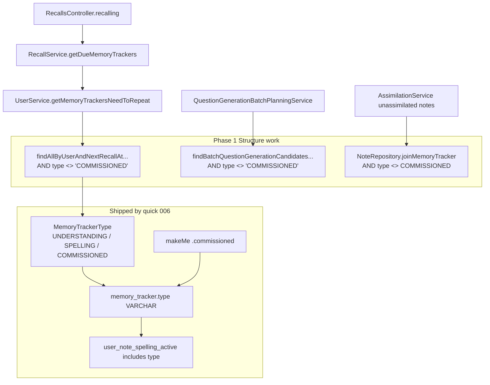

# Phase 1: Commissioned tracker model - Research

**Researched:** 2026-08-07
**Domain:** Backend MemoryTracker type=COMMISSIONED filtering (due-recall, assimilation join, batch candidates)
**Confidence:** HIGH

<user_constraints>
## User Constraints (from CONTEXT.md)

### Locked Decisions
(Mapped from CONTEXT.md “Agreed design decisions” + MVP scope — discuss-phase did not use separate `## Decisions` headings.)

| Question | Decision |
|----------|----------|
| Opt-in surface | Per-note. A caret next to the existing **Assimilate** button opens a dropdown for creating a commissioned tracker. Not offered for properties (UI availability only, not a domain constraint) |
| Coexistence | A commissioned tracker coexists with the note's ordinary trackers |
| Score → schedule | 0–5 rubric. Growth ladder for demonstrated mastery: 5 = +20% growth, 4 = standard, 3 = −20% growth. Setbacks: 2 = −20% accumulated strength, 1 = −50%, 0 = reset to initial (floored at the first positive spacing). Recorded in ADR 0003 |
| Session identity in the protocol | None needed. The learner opens the Learning Session and loads the report into it |
| Report rejection | Accept the Session Items that match; reject unknown ones and report them back to the learner |
| Re-recording | A later report amends the Learning Session. Recorded sessions are visibly marked in the open-sessions list |
| UI surface | A dialog opened from a button on the recall page's top progress bar |
| Session lifecycle | A potential learning session is derived in the frontend from due commissioned trackers. A Learning Session exists only once commissioned. Old sessions, and Session Items left without Feedback, are abandoned (deleted) |

MVP: full offline loop; glossary ADR 0001 §3; protocol ADR 0005; score policy ADR 0003 (both Proposed — guide naming/work, agents do not approve).

### Critical foundation (quick 006 — supersedes boolean plans)

Quick plan **006 memory-tracker type** is **done**. Phase 1 must use `MemoryTrackerType.COMMISSIONED`, **not** a boolean `commissioned` column and **not** another unique-key rebuild.

Already shipped:

- Enum `UNDERSTANDING | SPELLING | COMMISSIONED`
- Column `memory_tracker.type` (VARCHAR STRING enum)
- Unique key `user_note_spelling_active` includes `type` (not `spelling`)
- DB column `spelling` **dropped**; wire `spelling` derived from `type == SPELLING`
- `MemoryTrackerBuilder.commissioned()` / `.spelling()`
- Migrations tip: `V300000239`

### Claude's Discretion
(No separate `## Claude's Discretion` section in CONTEXT.md.) Structure-phase implementation choices are at planner/executor discretion within locked coexistence and Structure constraints: **which** selection queries exclude `COMMISSIONED`, whether to add a shared JPQL/SQL fragment constant, how narrowly Phase 1 prepares Phase 2 assimilation join without speculative Phase 3–7 work, and whether ERD regen is needed with no schema change.

### Deferred Ideas (OUT OF SCOPE)
From CONTEXT.md MVP / Out of MVP and REQUIREMENTS Out of Scope (Phase 1 must not implement):

- Descriptive feedback and recommendations driving tracker updates
- Smart / AI-assisted request generation
- In-app agentic Tutor
- Commissioned assimilation (first intake via Tutor) — only recall is commissioned (TRK-05 deferred)
- UI: assimilate caret, recall progress-bar potential sessions, Learning Session dialog
- Learning Session / Session Item / Feedback persistence (Phases 4–7)
- Score→schedule application (Phase 6; ADR 0003 commissioned section)
- Amend recomputation — deferred to `/gsd-plan-phase 7`
- Notebook-level opt-in; replacing ordinary trackers; session identity codes in protocol
- Boolean `commissioned` column / unique-key rebuild (obsolete — do not plan)
</user_constraints>

<phase_requirements>
## Phase Requirements

Phase 1 is **Structure** — no user-facing requirement IDs. It unlocks TRK-* for later phases.

| ID | Description | Research Support |
|----|-------------|------------------|
| *(none)* | Persist commissioned MemoryTracker variant; exclude from ordinary due-recall; no user-visible path change | Variant **already persists** via `type=COMMISSIONED` (006). Phase 1 work is **filters + proofs**: due SQL, assimilation join, batch candidates |
| TRK-02 (unlocked) | Coexistence with ordinary trackers | Unique key already includes `type` `[VERIFIED: V300000239]`; coexistence unit test already exists |
| TRK-03 (unlocked later) | Due commissioned do not appear as ordinary recall | Gate at `MemoryTrackerRepository.findAllByUserAndNextRecallAtLessThanEqualOrderByNextRecallAt` — **does not yet exclude COMMISSIONED** |
</phase_requirements>

## Summary

Phase 1 is a **Structure** phase: make the commissioned tracker variant usable for later phases by keeping it out of ordinary due-recall (and ordinary assimilation detection), without any user-visible create path. Quick **006** already delivered the durable representation (`MemoryTrackerType.COMMISSIONED`, `type` column, unique key on `type`, makeMe `.commissioned()`). Prior Phase 1 research/plans that add a boolean `commissioned` column or rebuild uniqueness are **obsolete** and must not be followed.

What remains unverified in production selection seams: due-recall SQL still returns any active due tracker including `COMMISSIONED`; batch question-gen candidates exclude `SPELLING` but not `COMMISSIONED`; `NoteRepository.joinMemoryTracker` treats any note-level tracker (including commissioned-only) as “already assimilated,” which would block Phase 2 ordinary assimilate of a commissioned-only note. Coexistence is already proven in `AssimilationControllerTests.understandingAndCommissionedTrackersCanCoexistOnSameNote`.

**Primary recommendation:** No new Flyway migration. Add `AND rp.type <> 'COMMISSIONED'` to `byUserIdFrom` (due list + `countByUserNotRemoved`), add the same exclusion to `findBatchQuestionGenerationCandidatesByUser`, and extend `NoteRepository.joinMemoryTracker` with JPQL `rp.type <> MemoryTrackerType.COMMISSIONED` so commissioned-only notes stay ordinarily assimilable. Prove SC3 via `RecallsControllerTests` using `.commissioned()`; prove assimilation-queue + batch exclusion with focused unit tests. Do not change assimilate API/UI or `MemoryTrackerAssimilation` create logic (Phase 2).

## Architectural Responsibility Map

| Capability | Primary Tier | Secondary Tier | Rationale |
|------------|-------------|----------------|-----------|
| Persist commissioned variant | Database / Storage | API / Backend | **Already done** in 006 (`type` + unique key) |
| Domain / makeMe fixtures | API / Backend | — | Entity enum + `.commissioned()` already exist |
| Exclude from ordinary due-recall | API / Backend | Database / Storage | Native SQL in `MemoryTrackerRepository` |
| Exclude from question-gen due candidates | API / Backend | Database / Storage | Parallel due-style native query |
| Unassimilated-note detection ignores commissioned | API / Backend | Database / Storage | JPQL join in `NoteRepository` — Phase 2-ready |
| Assimilate-as-commissioned create path / UI | Browser / Client | API / Backend | **Phase 2** — out of Phase 1 |
| Potential learning sessions UI | Browser / Client | API / Backend | **Phase 3** |
| Learning Session / Request / Report | API / Backend | Browser / Client | **Phases 4–7** |

## Standard Stack

### Core
| Library | Version | Purpose | Why Standard |
|---------|---------|---------|--------------|
| Spring Data JPA + native `@Query` | project backend stack | Due selection / batch candidates | Existing repository pattern `[VERIFIED: MemoryTrackerRepository.java:11-126]` |
| JPA `@Enumerated(EnumType.STRING)` | project entity | `MemoryTracker.type` VARCHAR | Already on entity `[VERIFIED: MemoryTracker.java:85-88]` |
| JUnit + MakeMe | project test stack | Structure proofs | Controller-boundary “small tests” (`backend-testing.mdc` / `unit-testing.mdc`) |
| Flyway | project migrations | Schema | Tip `V300000239` — **no new migration for Phase 1** |

### Supporting
| Library | Version | Purpose | When to Use |
|---------|---------|---------|-------------|
| OpenAPI / generated TS client | already includes `type?: 'UNDERSTANDING' \| 'SPELLING' \| 'COMMISSIONED'` | Wire shape | **No regen required** for Phase 1 if no controller/DTO signature change `[VERIFIED: packages/generated/doughnut-backend-api/types.gen.ts:604-613]` |
| `database-erd` skill | repo script | ERD refresh | Only if planner wants ERD to surface `type`; **no schema change** this phase |

### Alternatives Considered
| Instead of | Could Use | Tradeoff |
|------------|-----------|----------|
| Filter on `type <> 'COMMISSIONED'` | New boolean `commissioned` | **Obsolete** — conflicts with 006; unique key already uses `type` |
| Post-load filter in `RecallService` only | SQL exclusion | Counts/streams would disagree; loads then drops rows |
| Separate commissioned table | Shared `memory_tracker` row | Breaks shared schedule columns; glossary treats it as a MemoryTracker variant (ADR 0001 Proposed) |

**Installation:** none — no new packages.

**Version verification:** N/A (in-repo stack only). Migration tip: `V300000239__memory_tracker_unique_on_type_drop_spelling.sql`.

## Package Legitimacy Audit

> No external packages are installed in this phase.

| Package | Registry | Age | Downloads | Source Repo | Verdict | Disposition |
|---------|----------|-----|-----------|-------------|---------|-------------|
| — | — | — | — | — | — | N/A |

**Packages removed due to [SLOP] verdict:** none
**Packages flagged as suspicious [SUS]:** none

## Architecture Patterns

### System Architecture Diagram



### Recommended Project Structure

```
backend/src/main/java/com/odde/doughnut/
├── entities/
│   ├── MemoryTracker.java          # type field + optional JPQL fragment for ordinary trackers
│   └── MemoryTrackerType.java      # UNDERSTANDING | SPELLING | COMMISSIONED (done)
├── entities/repositories/
│   ├── MemoryTrackerRepository.java  # byUserIdFrom + batch candidates filters
│   └── NoteRepository.java           # joinMemoryTracker ordinary-only
└── services/
    ├── RecallService.java            # consumes due query (no new create path)
    └── MemoryTrackerAssimilation.java # DO NOT change create logic in Phase 1

backend/src/test/java/com/odde/doughnut/
├── controllers/RecallsControllerTests.java
├── controllers/AssimilationControllerTests.java  # coexistence already present
└── services/QuestionGenerationBatchCandidateMemoryTrackersTest.java
```

### Pattern 1: Native SQL type filter (mirror SPELLING)
**What:** Compare VARCHAR enum column to a **code literal** enum name in native SQL.
**When to use:** Due-recall and batch-candidate native queries.
**Example:** Existing SPELLING exclusion already in repo:

```java
// Source: backend/src/main/java/com/odde/doughnut/entities/repositories/MemoryTrackerRepository.java:98-105
"  AND mt.type <> 'SPELLING' "
```

Add parallel:

```java
"  AND mt.type <> 'COMMISSIONED' "
```

### Pattern 2: JPQL enum constant filter (mirror property unassimilated join)
**What:** Exclude enum values in JPQL with fully-qualified enum constants.
**When to use:** `NoteRepository.joinMemoryTracker` (and optionally property target-note gate).
**Example:** Existing SPELLING exclusion:

```java
// Source: backend/src/main/java/com/odde/doughnut/entities/repositories/NotePropertyIndexRepository.java:13-17
" LEFT JOIN n.memoryTrackers mt ON mt.user.id = :userId"
    + " AND mt.deletedAt IS NULL"
    + " AND mt.type <> com.odde.doughnut.entities.MemoryTrackerType.SPELLING"
    + " AND mt.propertyKey = i.propertyKey";
```

For note-level ordinary assimilation detection, add to `joinMemoryTracker`:

```java
+ " AND rp.type <> com.odde.doughnut.entities.MemoryTrackerType.COMMISSIONED"
```

Prefer a shared constant on `MemoryTracker` next to `JPA_WHERE_NOTE_LEVEL_TRACKER` if the planner wants one representation.

### Pattern 3: makeMe `.commissioned()` for Structure proofs
**What:** Persist commissioned fixtures without a product create path.
**When to use:** All Phase 1 unit proofs (SC2/SC3, assimilation queue, batch).
**Example:**

```java
// Source: MemoryTrackerBuilder.java:58-60 + AssimilationControllerTests.java:126-133
makeMe.aMemoryTrackerFor(note).commissioned().please();
```

### Anti-Patterns to Avoid
- **Boolean `commissioned` column / unique-key rebuild:** Obsolete vs 006; wastes a Structure phase and risks dual representations.
- **Filtering only in Java after load:** Breaks `countByUserNotRemoved` / `totalAssimilatedCount` consistency.
- **Changing `MemoryTrackerAssimilation.assimilate` in Phase 1:** That is Phase 2 Behavior (create commissioned / ignore commissioned when ordinarily assimilating). Join filter alone makes the note appear in the queue; create path is separate.
- **Hand-editing `docs/database-erd.md` or generated OpenAPI/TS:** Use skills/scripts only; skip if no schema/DTO change.
- **Encoding phase numbers in product test names:** Capability-named tests only (`planning.mdc`).

## Don't Hand-Roll

| Problem | Don't Build | Use Instead | Why |
|---------|-------------|-------------|-----|
| Persist commissioned variant | New boolean column + migration | Existing `MemoryTrackerType.COMMISSIONED` | Unique key and API already use `type` |
| Coexistence uniqueness | App-only checks | Existing `user_note_spelling_active` on `type` | DB constraint; let failures surface (`error-handling.mdc`) |
| Due exclusion | Custom RecallService stream filter | Native SQL `type <> 'COMMISSIONED'` | Aligns with SPELLING pattern; consistent counts |
| Test fixtures | Manual `setType` soup | `.commissioned()` | Builder already shipped |
| SQLi-safe filters | Concatenate user strings into type clause | Literal `'COMMISSIONED'` + `@Param` for userId/dueBy | ASVS L1 parameterized queries |

**Key insight:** Phase 1 is **selection-seam Structure**, not schema invention. 006 already made coexistence representable; Phase 1 makes ordinary paths ignore COMMISSIONED.

## Common Pitfalls

### Pitfall 1: Following stale boolean PLANs
**What goes wrong:** Planner/executor adds `V300000238__commissioned` / unique-key work that conflicts with 006.
**Why it happens:** `01-01-PLAN.md` / `01-02-PLAN.md` / old RESEARCH still describe boolean column.
**How to avoid:** Treat those plans as **stale**; replan from this RESEARCH. Tip migration remains `V300000239`.
**Warning signs:** Any task mentioning `commissioned IS FALSE` column or `01-UNIQUE-KEY-DECISION.md`.

### Pitfall 2: Due SQL still returns COMMISSIONED
**What goes wrong:** SC3 fails; Phase 3 “ordinary recall empty” is harder.
**Why it happens:** `findAllByUserAndNextRecallAtLessThanEqualOrderByNextRecallAt` uses `byUserIdFrom` with no type filter today `[VERIFIED: MemoryTrackerRepository.java:26-33,63-67]`.
**How to avoid:** Add `AND rp.type <> 'COMMISSIONED'` to `byUserIdFrom` (covers due list + `countByUserNotRemoved` / `totalAssimilatedCount`). Keep `ORDER BY … (rp.type = 'SPELLING') DESC` as-is.
**Warning signs:** `RecallsController.recalling` returns a lite for a `.commissioned()` due tracker.

### Pitfall 3: Assimilation join blocks Phase 2
**What goes wrong:** Note with only a commissioned tracker never appears in ordinary assimilation queue.
**Why it happens:** `joinMemoryTracker` joins all note-level trackers; `WHERE rp IS NULL` fails when COMMISSIONED exists `[VERIFIED: NoteRepository.java:148-158]`.
**How to avoid:** Exclude COMMISSIONED on the join (Pattern 2). Prove with AssimilationController / AssimilationService queue assertion.
**Warning signs:** `getUnassimilatedNotes` / assimilate status omits commissioned-only note.

### Pitfall 4: Batch candidates pull commissioned IDs
**What goes wrong:** AI question prep treats commissioned trackers as ordinary due work.
**Why it happens:** `findBatchQuestionGenerationCandidatesByUser` excludes SPELLING only `[VERIFIED: MemoryTrackerRepository.java:104]`.
**How to avoid:** Add `AND mt.type <> 'COMMISSIONED'` beside SPELLING filter; assert in `QuestionGenerationBatchCandidateMemoryTrackersTest`.
**Warning signs:** Planned batch requests include a commissioned tracker id.

### Pitfall 5: Over-scoping assimilate create logic
**What goes wrong:** Phase 1 edits `MemoryTrackerAssimilation` to create COMMISSIONED or to ignore COMMISSIONED on create — Behavior work / Phase 2.
**Why it happens:** Join fix alone does not make `assimilate()` create ordinary trackers when COMMISSIONED already exists (`existingNoteLevelTrackers` includes commissioned) `[VERIFIED: MemoryTrackerAssimilation.java:50-66]`.
**How to avoid:** Document for Phase 2; Phase 1 only proves **queue** visibility via join. Structure stop-safe: filters + tests only.
**Warning signs:** AssimilationRequestDTO / caret UI / create COMMISSIONED in Phase 1 tasks.

### Pitfall 6: Filtering recent lists accidentally
**What goes wrong:** Settings / recent tracker lists hide commissioned trackers needed later for Feedback visibility.
**Why it happens:** Putting filter on `byUserIdWhere` as well as `byUserIdFrom`.
**How to avoid:** Filter **`byUserIdFrom` only** (due + total count). Leave `findByUserAndNote`, `findLast100ByUser` / `byUserIdWhere` unfiltered in Phase 1.
**Warning signs:** `findLast100ByUser` tests fail for commissioned fixtures.

## Code Examples

### Due exclusion via `byUserIdFrom`

```java
// Target shape — append to existing fragment
// Source pattern: MemoryTrackerRepository.java:63-67
String byUserIdFrom =
    " FROM memory_tracker rp "
        + " WHERE rp.user_id = :userId "
        + "   AND rp.removed_from_tracking IS FALSE "
        + "   AND rp.deleted_at IS NULL "
        + "   AND rp.type <> 'COMMISSIONED' ";
```

### SC3 controller-boundary proof

```java
// Source style: RecallsControllerTests.java Repeat nested + makeMe .commissioned()
Note note = makeMe.aNote().notebookOwnedBy(currentUser.getUser()).please();
Timestamp now = makeMe.aTimestamp().of(0, 0).please();
testabilitySettings.timeTravelTo(now);
makeMe.aMemoryTrackerFor(note).nextRecallAt(now).please();
makeMe.aMemoryTrackerFor(note).commissioned().nextRecallAt(now).please();

DueMemoryTrackers due = controller.recalling("Asia/Shanghai", 0);
assertThat(due.getToRepeat(), hasSize(1)); // only ordinary
```

### Coexistence (already present — keep green)

```java
// Source: AssimilationControllerTests.java:126-133
makeMe.aMemoryTrackerFor(note).please();
makeMe.aMemoryTrackerFor(note).commissioned().please();
assertThat(
    memoryTrackerRepository.findByUserAndNote(currentUser.getUser().getId(), note.getId()),
    hasSize(2));
```

### Enum definition (do not re-add)

```java
// Source: MemoryTrackerType.java:3-7
public enum MemoryTrackerType {
  UNDERSTANDING,
  SPELLING,
  COMMISSIONED
}
```

## State of the Art

| Old Approach (stale Phase 1 plans) | Current Approach (post-006) | When Changed | Impact |
|------------------------------------|----------------------------|--------------|--------|
| Boolean `commissioned` + unique rebuild | `type` enum includes COMMISSIONED; UK on `type` | 2026-08-07 quick 006 | Phase 1 = filters only |
| `spelling` tinyint column | Wire `spelling` derived from `type == SPELLING` | 006 V300000238–239 | ORDER BY uses `(rp.type = 'SPELLING')` |
| Unique on `(…, spelling, …)` | Unique on `(…, type, …)` | V300000239 | Coexistence UNDERSTANDING + COMMISSIONED works |

**Deprecated/outdated:**
- `01-01-PLAN.md` / `01-02-PLAN.md` / `01-VALIDATION.md` / `01-PATTERNS.md` boolean/`commissioned IS FALSE` content — **stale**; planner must rewrite
- `01-UNIQUE-KEY-DECISION.md` checkpoint — **not needed** (006 decided)

## Assumptions Log

| # | Claim | Section | Risk if Wrong |
|---|-------|---------|---------------|
| A1 | Excluding COMMISSIONED from `byUserIdFrom` (thus `totalAssimilatedCount`) is desired ordinary-only semantics for Structure | Pitfall 2 / Primary recommendation | If product wants commissioned counted in totalAssimilatedCount before Phase 3, filter only the due SELECT instead of shared fragment |
| A2 | Property-target wiki-link gate (`NotePropertyIndexRepository` target join) should also ignore COMMISSIONED in Phase 1 | Open Questions | If deferred, a commissioned-only target may incorrectly satisfy “target assimilated” until Phase 2 |

**If empty rows were preferred:** A1/A2 are the only planner-facing confirmation items; core filter locations are verified in-repo.

## Open Questions (RESOLVED)

1. **Property target-note gate** — RESOLVED: Include in Phase 1 Wave 2 (`01-02`) alongside `NoteRepository.joinMemoryTracker` (same JPQL pattern; A2). Planned in `01-02-PLAN.md` T1.

2. **`totalAssimilatedCount` semantics** — RESOLVED: Exclude COMMISSIONED via shared `byUserIdFrom` (A1), so `countByUserNotRemoved` / recalling totals stay ordinary-only. Planned in `01-01-PLAN.md` T1. Phase 3 may refine potential-session counts separately.

## Environment Availability

| Dependency | Required By | Available | Version | Fallback |
|------------|------------|-----------|---------|----------|
| Nix + `pnpm backend:test_only` / `backend:verify` | SC1–SC3 verification | ✓ (repo contract) | — | Cloud VM skill if no Nix |
| Local MySQL (via `pnpm sut`) | `@SpringBootTest` DB | assume running per agent-map | — | `sut:healthcheck` |
| Java | Backend compile/tests | ✓ | openjdk 24.0.2 (probe) | — |
| New npm/pip packages | — | N/A | — | — |

**Missing dependencies with no fallback:** none identified for code/filter work.

**Missing dependencies with fallback:** none.

Step 2.6: tooling is in-repo + Nix; no new external services.

## Validation Architecture

> `workflow.nyquist_validation` is **true** in `.planning/config.json`.

### Test Framework
| Property | Value |
|----------|-------|
| Framework | JUnit 5 + Spring Boot `@SpringBootTest` / `@Transactional` |
| Config file | Spring `test` profile (existing controller tests) |
| Quick run command | `CURSOR_DEV=true nix develop -c pnpm backend:test_only` |
| Full suite command | `CURSOR_DEV=true nix develop -c pnpm backend:verify` |

### Phase Requirements → Test Map
| Req ID | Behavior | Test Type | Automated Command | File Exists? |
|--------|----------|-----------|-------------------|-------------|
| SC2 | Ordinary + commissioned coexist on same note | unit | `pnpm backend:test_only` | ✅ `AssimilationControllerTests.understandingAndCommissionedTrackersCanCoexistOnSameNote` |
| SC3 | Due-recall never returns commissioned | unit (controller) | `pnpm backend:test_only` | ❌ Wave 0 — extend `RecallsControllerTests` |
| SC1 | Existing assimilation/recall suites green | unit (full backend) | `pnpm backend:verify` | ✅ existing suites |
| Phase2-ready | Commissioned-only note still in ordinary assimilation queue | unit | `pnpm backend:test_only` | ❌ Wave 0 — AssimilationControllerTests / AssimilationService test |
| Phase2-ready | Batch planning excludes due commissioned | unit | `pnpm backend:test_only` | ❌ Wave 0 — `QuestionGenerationBatchCandidateMemoryTrackersTest` |
| — | E2E | — | N/A for Structure unless product path touched | — |

### Sampling Rate
- **Per task commit:** `CURSOR_DEV=true nix develop -c pnpm backend:test_only`
- **Per wave merge:** `backend:test_only` (no migration → verify optional; still OK as phase gate)
- **Phase gate:** `pnpm backend:verify` green before `/gsd-verify-work`; no new `@wip` E2E

### Wave 0 Gaps
- [ ] `RecallsControllerTests` — due ordinary + due commissioned → `toRepeat` size 1 (SC3)
- [ ] Assimilation queue assertion — commissioned-only note still unassimilated for ordinary path
- [ ] `QuestionGenerationBatchCandidateMemoryTrackersTest` — commissioned due tracker not in planned batch
- [x] `MemoryTrackerBuilder.commissioned()` — already exists
- [x] Coexistence persist test — already exists
- [x] Framework / Flyway tip — no new migration; tip `V300000239`
- [ ] Rewrite stale `01-VALIDATION.md` task rows (remove unique-key decision / boolean migration)

## Security Domain

> `security_enforcement` enabled; ASVS level 1 per config.

### Applicable ASVS Categories

| ASVS Category | Applies | Standard Control |
|---------------|---------|-----------------|
| V2 Authentication | no | No new auth surface |
| V3 Session Management | no | Unchanged |
| V4 Access Control | yes (unchanged) | Existing `AuthorizationService` on Recalls/Assimilation; no new create endpoint |
| V5 Input Validation | yes | Native filters use **literal** enum names; user-bound values stay `@Param` |
| V6 Cryptography | no | — |

### Known Threat Patterns for this stack

| Pattern | STRIDE | Standard Mitigation |
|---------|--------|---------------------|
| SQL injection via type filter | Tampering | Literal `<> 'COMMISSIONED'` / JPQL enum constant; never concatenate user input into type clause `[CITED: OWASP ASVS 1.2.4 / Query Parameterization Cheat Sheet]` |
| IDOR on recall/assimilate | Elevation of privilege | Reuse existing authz; Phase 1 adds no create path (T-01-01 accept) |
| Unique-key race on dual trackers | Tampering | Existing UK on `type` (006); do not weaken; surface constraint failures |
| Information disclosure of `type` on wire | Information disclosure | `type` already on OpenAPI MemoryTracker; no UI copy in Phase 1 (accept) |
| Mass commissioned rows DoS | Denial of service | No public create in Phase 1 |

### Threat model notes for planner (SQL filters)

| ID | Threat | Severity | Disposition |
|----|--------|----------|-------------|
| T-01-01 | IDOR via new endpoints | medium | accept — no new endpoints |
| T-01-02 | SQLi in due/batch native SQL | high | mitigate — literal type filter + `@Param` userId/dueBy only |
| T-01-03 | Unique-key race | medium | accept — already secured by 006 UK on `type` |
| T-01-SC | Package supply chain | high | accept — no package installs |

## Project Constraints (from .cursor/rules/)

| Rule | Directive for this phase |
|------|--------------------------|
| `planning.mdc` | Phase is **Structure**; one Structure goal; stop-safe; no speculative prep beyond immediate next Behavior (Phase 2 assimilate-as-commissioned); capability names in product/tests; ~5 min slice / >10 min finer-decompose |
| `gsd-coexistence.mdc` | Local Behavior/Structure + Jidoka + post-change-refactor + commit/push wrap-up apply when executing |
| `unit-testing.mdc` / `backend-testing.mdc` | Drive `RecallsController` / assimilation boundary; data via `makeMe`; one behavior per test; `pnpm backend:test_only` / `backend:verify` |
| `db-migration.mdc` | New migrations only if schema changes; **do not edit** committed V300000238/239; tip must stay >300000230 — Phase 1 likely **zero** new files |
| `error-handling.mdc` | Do not swallow unique-constraint failures; no empty catch |
| `architecture-decisions.mdc` / adr-awareness | Cite ADR 0001 glossary for naming; ADR 0003/0005 Proposed guide only — **do not approve**; only Accepted ADR today is 0000 meta |
| `backend-code.mdc` | Prefer entity return shapes; regenerate ERD only after real schema change |
| `general.mdc` | Nix prefix for tooling; no phase numbers in product artifacts; high cohesion (one `type` representation) |

## Sources

### Primary (HIGH confidence)
- `backend/src/main/java/com/odde/doughnut/entities/MemoryTrackerType.java` — enum values
- `backend/src/main/java/com/odde/doughnut/entities/MemoryTracker.java` — `type` field, derived spelling
- `backend/src/main/java/com/odde/doughnut/entities/repositories/MemoryTrackerRepository.java` — due + batch SQL
- `backend/src/main/java/com/odde/doughnut/entities/repositories/NoteRepository.java` — assimilation join
- `backend/src/main/java/com/odde/doughnut/entities/repositories/NotePropertyIndexRepository.java` — SPELLING JPQL pattern + target gate
- `backend/src/main/resources/db/migration/V300000238__add_memory_tracker_type.sql`
- `backend/src/main/resources/db/migration/V300000239__memory_tracker_unique_on_type_drop_spelling.sql`
- `backend/src/test/java/com/odde/doughnut/testability/builders/MemoryTrackerBuilder.java` — `.commissioned()`
- `backend/src/test/java/com/odde/doughnut/controllers/AssimilationControllerTests.java` — coexistence test
- `.planning/quick/006-memory-tracker-type/PLAN.md` — foundation status done
- Context7 `/spring-projects/spring-data-jpa` — `@Param` / native `@Query` patterns

### Secondary (MEDIUM confidence)
- OWASP ASVS 1.2.4 / Query Parameterization Cheat Sheet — parameterized SQL for T-01-02
- ADR 0001 Proposed §3 commissioned learning terms — naming only
- Generated `types.gen.ts` MemoryTracker.type union — client already knows COMMISSIONED

### Tertiary (LOW confidence)
- A1/A2 assumptions on count semantics and property target gate scope

## Metadata

**Confidence breakdown:**
- Standard stack: HIGH — in-repo patterns verified by Read this session
- Architecture: HIGH — due/batch/join seams located; 006 foundation verified
- Pitfalls: HIGH — stale boolean plans + missing filters confirmed by Read

**Research date:** 2026-08-07
**Valid until:** 30 days (stable domain; invalidate if further memory_tracker schema migrations land)

### Planner checklist (from this research)

1. **Replan** 01-01 / 01-02 — remove migration/boolean/UK decision tasks.
2. Wave 1: `byUserIdFrom` COMMISSIONED exclusion + `RecallsControllerTests` SC3 (SC2 already green).
3. Wave 2: `NoteRepository.joinMemoryTracker` (+ optional property target gate) + batch candidate exclusion + queue/batch unit proofs + `backend:verify`.
4. Do **not** touch assimilate create UI/DTO/`MemoryTrackerAssimilation` create path.
5. No OpenAPI regen / ERD regen required unless you change schema or DTO signatures.
