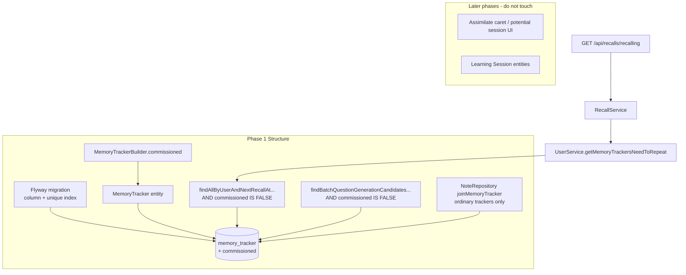

# Phase 1: Commissioned tracker model - Research

**Researched:** 2026-08-07
**Domain:** Backend domain model / Flyway / due-recall selection (MemoryTracker)
**Confidence:** HIGH

<user_constraints>
## User Constraints (from CONTEXT.md)

### Locked Decisions
(Mapped from CONTEXT.md “Agreed design decisions” + MVP scope — discuss-phase did not use separate `## Decisions` headings.)

| Question | Decision |
|----------|----------|
| Opt-in surface | Per-note. A caret next to the existing **Assimilate** button opens a dropdown for creating a commissioned tracker. Not offered for properties (UI availability only, not a domain constraint) |
| Coexistence | A commissioned tracker coexists with the note's ordinary trackers |
| Score → schedule | 0–5 rubric. Growth ladder for demonstrated mastery: 5 = +20% growth, 4 = standard, 3 = −20% growth. Setbacks: 2 = −20% accumulated strength, 1 = −50%, 0 = reset to initial (floored at the first positive spacing). Recorded in ADR 0003 |
| Session identity in the protocol | None needed. The learner opens the Learning Session and loads the report into it |
| Report rejection | Accept the Session Items that match; reject unknown ones and report them back to the learner |
| Re-recording | A later report amends the Learning Session. Recorded sessions are visibly marked in the open-sessions list |
| UI surface | A dialog opened from a button on the recall page's top progress bar |
| Session lifecycle | A potential learning session is derived in the frontend from due commissioned trackers. A Learning Session exists only once commissioned. Old sessions, and Session Items left without Feedback, are abandoned (deleted) |

MVP: full offline loop; glossary ADR 0001 §3; protocol ADR 0005; score policy ADR 0003 (both Proposed — guide work, agents do not approve).

### Claude's Discretion
(No separate `## Claude's Discretion` section in CONTEXT.md.) Structure-phase implementation choices are at planner/executor discretion within locked coexistence and Structure constraints: column representation, which selection queries exclude commissioned trackers, makeMe API shape, and how narrowly Phase 1 prepares Phase 2 without speculative Phase 3–7 work.

### Deferred Ideas (OUT OF SCOPE)
From CONTEXT.md MVP / Out of MVP and REQUIREMENTS Out of Scope (Phase 1 must not implement):

- Descriptive feedback and recommendations driving tracker updates
- Smart / AI-assisted request generation
- In-app agentic Tutor
- Commissioned assimilation (first intake via Tutor) — only recall is commissioned (TRK-05 deferred)
- UI: assimilate caret, recall progress-bar potential sessions, Learning Session dialog
- Learning Session / Session Item / Feedback persistence (Phases 4–7)
- Score→schedule application (Phase 6; ADR 0003 commissioned section)
- Amend recomputation — deferred to `/gsd-plan-phase 7`
- Notebook-level opt-in; replacing ordinary trackers; session identity codes in protocol
</user_constraints>

<phase_requirements>
## Phase Requirements

Phase 1 is **Structure** — no user-facing requirement IDs. It unlocks TRK-* for later phases.

| ID | Description | Research Support |
|----|-------------|------------------|
| *(none)* | Persist commissioned MemoryTracker variant; exclude from ordinary due-recall; no user-visible path change | Boolean `commissioned` column + unique-key rebuild; filter in due-selection native query; prove via RecallsController + makeMe; leave assimilate API / UI for Phase 2 |
| TRK-02 (unlocked) | Coexistence with ordinary trackers | Unique key today blocks a second note-level active tracker with same `(user, note, spelling, property_key)`; must include `commissioned` in uniqueness |
| TRK-03 (unlocked later) | Due commissioned do not appear as ordinary recall | Gate at `MemoryTrackerRepository.findAllByUserAndNextRecallAtLessThanEqualOrderByNextRecallAt` used by `UserService.getMemoryTrackersNeedToRepeat` → `RecallService` |
</phase_requirements>

## Summary

Phase 1 must add a durable **commissioned memory tracker** variant on the existing `memory_tracker` table and ensure ordinary due-recall selection never returns those rows, without changing assimilation UI or Learning Session entities. Today a note can already hold multiple trackers (note-level, spelling, and property-keyed), but active uniqueness is enforced by `user_note_spelling_active` on `(user_id, note_id, spelling, property_key, soft-delete expression)`. Without extending that key, a commissioned note-level tracker **cannot** coexist with an ordinary note-level tracker — the core locked decision of this milestone.

Due recall flows through `RecallsController.recalling` → `RecallService.getDueMemoryTrackers` → `UserService.getMemoryTrackersNeedToRepeat` → `MemoryTrackerRepository.findAllByUserAndNextRecallAtLessThanEqualOrderByNextRecallAt`. That native query (and the shared `byUserIdFrom` fragment used by counts/lists) is the primary exclusion seam. Question-generation candidate selection has a parallel due-style query that should also exclude commissioned trackers so AI prep does not treat them as ordinary recall work.

**Primary recommendation:** Add `commissioned` `tinyint(1) NOT NULL DEFAULT 0` (mirror `spelling`), rebuild the unique index to include `commissioned`, default entity/`buildMemoryTracker*` to false, extend `MemoryTrackerBuilder` with `.commissioned()`, filter `AND rp.commissioned IS FALSE` (or equivalent) in due-selection (and batch-candidate) SQL, and prove Structure success with controller-boundary unit tests — do **not** change assimilate request/UI or Learning Session tables in this phase.

## Architectural Responsibility Map

| Capability | Primary Tier | Secondary Tier | Rationale |
|------------|-------------|----------------|-----------|
| Persist commissioned flag on MemoryTracker | Database / Storage | API / Backend | Flyway column + JPA entity field; uniqueness is a DB constraint |
| Domain representation / builders | API / Backend | — | Entity + makeMe; no browser involvement in Structure phase |
| Exclude from ordinary due-recall | API / Backend | Database / Storage | Selection query ownership; RecallService is the HTTP-facing aggregator |
| Exclude from question-gen due candidates | API / Backend | Database / Storage | Same due-work concept; prevents accidental ordinary-path work |
| Unassimilated-note detection treats only ordinary trackers | API / Backend | Database / Storage | Needed so a commissioned-only note can still be ordinarily assimilable in Phase 2 |
| Assimilate-as-commissioned UI / DTO | Browser / Client | API / Backend | **Phase 2** — out of Phase 1 |
| Potential learning sessions UI | Browser / Client | API / Backend | **Phase 3** |
| Learning Session / Request / Report | API / Backend | Browser / Client | **Phases 4–7** |

## Standard Stack

### Core
| Library | Version | Purpose | Why Standard |
|---------|---------|---------|--------------|
| Spring Data JPA + native `@Query` | project backend stack | MemoryTracker persistence and due selection | Existing repository pattern for due lists `[VERIFIED: backend/src/main/java/com/odde/doughnut/entities/repositories/MemoryTrackerRepository.java:11-33]` |
| Flyway SQL migrations | project backend stack | Schema change | `db-migration.mdc`; next version **> `300000237`** `[VERIFIED: backend/src/main/resources/db/migration/ — highest V300000237]` |
| JUnit + MakeMe | project test stack | Structure proofs | Controller-boundary “small tests” per `backend-testing.mdc` / `unit-testing.mdc` |
| MySQL 8 functional unique key | existing DDL | Soft-delete-aware uniqueness | Already used on `memory_tracker` `[VERIFIED: V100000000__baseline.sql:369]` |

### Supporting
| Library | Version | Purpose | When to Use |
|---------|---------|---------|-------------|
| OpenAPI / `pnpm generateTypeScript` | repo script | Regenerate TS client if `MemoryTracker` schema gains `commissioned` | After entity field is exposed on API responses (Springdoc) — Phase 1 may trigger regen if assimilated/show payloads include the new field |

### Alternatives Considered
| Instead of | Could Use | Tradeoff |
|------------|-----------|----------|
| Boolean `commissioned` | String/enum `tracker_kind` | Enum is more extensible but heavier than existing `spelling` / `removed_from_tracking` boolean flags; Phase 1 only needs one variant |
| Separate `commissioned_memory_tracker` table | Flag on `memory_tracker` | Duplicate scheduling columns and break shared schedule paths; ADR vocabulary treats it as a MemoryTracker variant |
| Encode commissioned via reserved `property_key` | Dedicated column | Conflicts with property trackers and glossary; uniqueness semantics become opaque |

**Installation:** none — no new packages.

**Version verification:** N/A (in-repo stack only). Highest migration tip: `V300000237__add_memory_tracker_next_recall_at_index.sql`. Boolean column precedent: `V300000232__add_health_remove_empty_folders_default.sql` uses `tinyint(1) NOT NULL DEFAULT 0`.

## Package Legitimacy Audit

> No external packages are installed in this phase.

| Package | Registry | Age | Downloads | Source Repo | Verdict | Disposition |
|---------|----------|-----|-----------|-------------|---------|-------------|
| — | — | — | — | — | — | N/A |

**Packages removed due to [SLOP] verdict:** none
**Packages flagged as suspicious [SUS]:** none

## Architecture Patterns

### System Architecture Diagram



### Recommended Project Structure

```
backend/src/main/resources/db/migration/
  V300000238__add_memory_tracker_commissioned.sql   # or next free version > 237
backend/src/main/java/com/odde/doughnut/entities/
  MemoryTracker.java                                 # commissioned field + defaults
backend/src/main/java/.../repositories/
  MemoryTrackerRepository.java                       # due + batch SQL filters
  NoteRepository.java                                # unassimilated join ignores commissioned
backend/src/test/java/.../testability/builders/
  MemoryTrackerBuilder.java                          # .commissioned()
backend/src/test/java/.../controllers/
  RecallsControllerTests.java                        # exclusion + coexistence proofs
```

### Pattern 1: Boolean discriminator like `spelling`
**What:** Persist a `tinyint(1)` flag on `memory_tracker`, map to `Boolean` on the entity, default `false` in Java and SQL.
**When to use:** Binary product variants that share the same scheduling columns.
**Example (existing spelling field):**
```java
// Source: backend/src/main/java/com/odde/doughnut/entities/MemoryTracker.java:83-86
@Column(name = "spelling")
@Getter
@Setter
private Boolean spelling = false;
```

### Pattern 2: Soft-delete-aware uniqueness
**What:** Keep functional key part `(if((deleted_at is null),1,NULL))` and add `commissioned` into the unique column list.
**When to use:** Coexistence of ordinary + commissioned active rows for the same note/user/spelling/property_key.
**Existing DDL (must be rebuilt, not left as-is):**
```sql
-- Source: backend/src/main/resources/db/migration/V100000000__baseline.sql:369
UNIQUE KEY `user_note_spelling_active` (`user_id`,`note_id`,`spelling`,`property_key`,(if((`deleted_at` is null),1,NULL))),
```

### Pattern 3: Due selection via shared SQL fragment
**What:** Ordinary due work uses `byUserIdFrom` + `next_recall_at <= :nextRecallAt`.
**When to use:** Any change that must keep recall lists and counts consistent.
```java
// Source: MemoryTrackerRepository.java:63-67
String byUserIdFrom =
    " FROM memory_tracker rp "
        + " WHERE rp.user_id = :userId "
        + "   AND rp.removed_from_tracking IS FALSE "
        + "   AND rp.deleted_at IS NULL ";
```

### Anti-Patterns to Avoid
- **Speculative Learning Session schema in Phase 1:** Violates Structure “only for immediate next behavior” (Phase 2 is assimilate-as-commissioned).
- **Hiding commissioned via `removed_from_tracking`:** That flag means “skip memory tracking” / user opted out — wrong semantics and would break assimilation settings UX later.
- **Encoding type in `property_key`:** Collides with property memory trackers and ADR glossary.
- **Changing assimilate HTTP contract now:** Phase 2 owns `AssimilationRequestDTO` / caret; Phase 1 proves via makeMe + selection.
- **Editing committed migrations / baseline in place:** Always add a new Flyway file (`db-migration.mdc`).

## Don't Hand-Roll

| Problem | Don't Build | Use Instead | Why |
|---------|-------------|-------------|-----|
| Soft-delete uniqueness | App-level uniqueness checks only | MySQL functional UNIQUE like existing key | Race-safe; matches current spelling/property coexistence |
| Due-list filtering in Java streams | Post-load filter in RecallService only | SQL `AND commissioned IS FALSE` on repository query | Keeps counts/streams consistent; avoids loading then dropping |
| New microservice / table for commissioned | Separate aggregate | Flag on `memory_tracker` | Shared schedule fields; ADR calls it a MemoryTracker variant |
| Custom migration runner | Ad-hoc SQL scripts | Flyway `V{n}__*.sql` | Repo standard; auto-runs on startup / tests |

**Key insight:** The hard problem is **uniqueness + selection**, not scheduling math. Reuse the `spelling` flag pattern end-to-end.

## Runtime State Inventory

> Schema migration / model extension phase — inventory of runtime state for the new discriminator.

| Category | Items Found | Action Required |
|----------|-------------|------------------|
| Stored data | All existing `memory_tracker` rows lack `commissioned`; must default to ordinary (`0`) | Migration `DEFAULT 0` — no backfill rewrite of strength/dates |
| Live service config | None for tracker type | none |
| OS-registered state | None | none — verified by scope (DB/app only) |
| Secrets/env vars | None referencing tracker kind | none |
| Build artifacts | Generated OpenAPI/TS client may gain `commissioned?: boolean` on `MemoryTracker` after regen | Run `pnpm generateTypeScript` if Springdoc schema changes; do not hand-edit generated files |

**Nothing found in category:** Live service config / OS state / secrets — none for this discriminator (verified by codebase scope: only `memory_tracker` DDL + JPA + selection queries).

## Common Pitfalls

### Pitfall 1: Unique key blocks coexistence
**What goes wrong:** Inserting a commissioned note-level tracker fails with duplicate-key when an ordinary note-level tracker exists.
**Why it happens:** Unique key is `(user_id, note_id, spelling, property_key, soft-delete expr)` without `commissioned` `[VERIFIED: V100000000__baseline.sql:369]`.
**How to avoid:** Same migration: `DROP INDEX user_note_spelling_active` then `ADD UNIQUE` including `commissioned`.
**Warning signs:** Integration/unit persist of two trackers on one note throws; Phase 2 assimilate cannot coexist.

### Pitfall 2: Filtering only RecallService, not SQL
**What goes wrong:** Due list empty in one path but menu/`totalAssimilatedCount` / batch gen still treat commissioned as ordinary.
**Why it happens:** Multiple consumers of repository queries (`countByUserNotRemoved`, `findBatchQuestionGenerationCandidatesByUser`, recent lists).
**How to avoid:** Put exclusion in shared `byUserIdFrom` / due query and explicitly decide per-query whether commissioned belongs (due: no; recent assimilations list: maybe yes for settings later — Phase 2).
**Warning signs:** Tests pass for `toRepeat` but question-gen picks commissioned IDs.

### Pitfall 3: Unassimilated join treats commissioned as “already assimilated”
**What goes wrong:** Note with only a commissioned tracker disappears from ordinary assimilation queue.
**Why it happens:** `NoteRepository.joinMemoryTracker` joins any non-deleted note-level tracker `[VERIFIED: NoteRepository.java:154-158]`.
**How to avoid:** Restrict join to non-commissioned (ordinary) trackers in Phase 1 so Phase 2 stop-safe coexistence works.
**Warning signs:** After makeMe commissioned-only fixture, assimilation due count drops unexpectedly.

### Pitfall 4: `assimilate()` short-circuits on any note-level tracker
**What goes wrong:** Phase 2 cannot add commissioned when ordinary exists (returns empty list).
**Why it happens:** `MemoryTrackerService.assimilate` treats `existingNoteLevelTrackers` without distinguishing commissioned `[VERIFIED: MemoryTrackerService.java:81-97]`.
**How to avoid:** **Do not “fix” assimilate in Phase 1** unless needed for Structure tests; document as **Phase 2** required change. Phase 1 proves coexistence via makeMe + DB unique key.
**Warning signs:** Planner schedules assimilate DTO work in Phase 1.

### Pitfall 5: Observability creep / API surface
**What goes wrong:** Regenerating OpenAPI / frontend fixtures without need, or leaking incomplete UI.
**Why it happens:** Entity `MemoryTracker` is the assimilate/show response body; new field serializes by default.
**How to avoid:** Accept wire field default `false` as non-behavioral for Structure; regenerate client if CI/OpenAPI checks require it; no UI copy yet.
**Warning signs:** Frontend PRs in Phase 1 beyond fixture type updates.

### Pitfall 6: Using Proposed ADRs as Accepted
**What goes wrong:** Agents “approve” or invent conflicting names.
**Why it happens:** ADR 0001 / 0003 / 0005 are **Proposed** `[VERIFIED: docs/adrs/0001-ubiquitous-language.md:3]` / `[VERIFIED: docs/adrs/0003-spaced-repetition-scheduling-policy.md:3]`.
**How to avoid:** Use glossary names (`commissioned memory tracker`) for new identifiers; do not implement score→schedule or session protocol in Phase 1; humans approve ADRs.

## Code Examples

### Due-recall exclusion (recommended SQL delta)
```sql
-- Extend existing due query fragment (conceptual)
AND rp.removed_from_tracking IS FALSE
AND rp.deleted_at IS NULL
AND rp.commissioned IS FALSE
```
Source pattern: `[VERIFIED: MemoryTrackerRepository.java:63-67]` `byUserIdFrom`.

### makeMe coexistence fixture (Phase 1 test)
```java
Note note = makeMe.aNote().notebookOwnedBy(currentUser.getUser()).please();
Timestamp now = makeMe.aTimestamp().of(0, 0).please();
makeMe.aMemoryTrackerFor(note).nextRecallAt(now).please(); // ordinary
makeMe.aMemoryTrackerFor(note).commissioned().nextRecallAt(now).please();

DueMemoryTrackers due = controller.recalling("Asia/Shanghai", 0);
assertThat(due.getToRepeat(), hasSize(1)); // only ordinary
```
Drive via `RecallsController` per `backend-testing.mdc` stable boundary.

### Flyway migration skeleton
```sql
ALTER TABLE `memory_tracker`
  ADD COLUMN `commissioned` tinyint(1) NOT NULL DEFAULT 0;

ALTER TABLE `memory_tracker`
  DROP INDEX `user_note_spelling_active`,
  ADD UNIQUE KEY `user_note_spelling_active`
    (`user_id`,`note_id`,`spelling`,`property_key`,`commissioned`,(if((`deleted_at` is null),1,NULL)));
```
Boolean ADD precedent: `[VERIFIED: V300000232__add_health_remove_empty_folders_default.sql:3]`  
Unique key base: `[VERIFIED: V100000000__baseline.sql:369]`

### Entity field (mirror spelling)
```java
@Column(name = "commissioned")
@Getter
@Setter
private Boolean commissioned = false;
```

## State of the Art

| Old Approach | Current Approach | When Changed | Impact |
|--------------|------------------|--------------|--------|
| Single note-level tracker per user/note (plus spelling/property axes) | Same axes **plus** commissioned discriminator for coexistence | Phase 1 (this work) | Enables Tutor-path trackers without replacing ordinary recall |
| Due list = all active trackers by `next_recall_at` | Due list = active **non-commissioned** trackers | Phase 1 | Ordinary recall UX unchanged when commissioned rows exist |

**Deprecated/outdated:**
- Treating “skip / remove from tracking” as a stand-in for commissioned — wrong product meaning.

## Assumptions Log

| # | Claim | Section | Risk if Wrong |
|---|-------|---------|---------------|
| A1 | Phase 1 should also exclude commissioned from `findBatchQuestionGenerationCandidatesByUser` even though success criteria only name due-recall | Architecture / Pitfalls | LOW — if wrong, Phase 3+ may need a small follow-up; including it is low-cost Structure hygiene |
| A2 | Unassimilated `joinMemoryTracker` should ignore commissioned trackers in Phase 1 (needed for Phase 2) | Pitfall 3 | MEDIUM — if deferred, Phase 2 must include it or commissioned-only notes break ordinary assimilation queue |
| A3 | MVP commissioned trackers are note-level (`property_key` empty) and non-spelling; unique key still includes spelling/property for future TRK-04 | Summary | LOW — domain allows properties later; UI deferred |
| A4 | Exposing `commissioned` on JSON `MemoryTracker` without UI is acceptable Structure (not a user-visible path) | Pitfall 5 | LOW — if team wants strict wire freeze, `@JsonIgnore` until Phase 2 settings UI |
| A5 | `countByUserNotRemoved` / `totalAssimilatedCount` should exclude commissioned so menu recall status stays ordinary-only | Pitfalls | MEDIUM — if included, counts rise when only makeMe/tests create commissioned; product meaning of “assimilated count” for commissioned is undecided until Phase 3 |

**Recommendation on A4/A5:** Prefer exclude from due + `byUserIdFrom`-backed ordinary counts; keep `findByUserAndNote` returning both (settings/Phase 2). Prefer serialize `commissioned` (A4) so Phase 2 settings can show it without another schema pass.

## Open Questions (RESOLVED)

1. **Should recent-assimilations / recently-recalled lists include commissioned trackers?**
   - What we know: Those use `byUserIdWhere` / similar filters; assimilation settings will need to show commissioned (Phase 2 E2E).
   - What's unclear: Whether Phase 1 must change list endpoints or only due selection.
   - Recommendation: Phase 1 **must** exclude from due (+ batch candidates + ordinary assimilated counts). Leave “recent” lists including commissioned if the flag is false by default (no behavior change until fixtures exist). When tests create commissioned, assert settings/show can load them in Phase 2.
   - **RESOLVED:** Leave `byUserIdWhere` (recent/list queries) **unfiltered** for commissioned in Phase 1. Exclusion applies only to due selection (`byUserIdFrom`), batch candidates, and ordinary assimilation join — not recent lists.

2. **Index rename vs keep `user_note_spelling_active` name after adding `commissioned`?**
   - Recommendation: Keep the existing index name to minimize churn unless a rename migration is desired for clarity (`user_note_spelling_commissioned_active`) — optional.
   - **RESOLVED:** Keep index name `user_note_spelling_active` (no rename). Rebuild UNIQUE to include `commissioned`; do not introduce `user_note_spelling_commissioned_active`.

## Environment Availability

| Dependency | Required By | Available | Version | Fallback |
|------------|------------|-----------|---------|----------|
| SUT (backend/MySQL via process-compose) | Flyway + unit tests | ✓ | healthcheck PASS (2026-08-07) | — |
| Nix + `pnpm backend:test_only` / `backend:verify` | Run tests / migrations in tests | ✓ | repo standard | Cloud VM skill if no Nix |
| mysql CLI | Ad-hoc SQL | ✗ | — | Use app/Flyway/tests; ERD skill uses Python against local MySQL |
| New npm/Maven packages | — | N/A | — | — |

**Missing dependencies with no fallback:** none for Phase 1 execution (SUT healthy).

**Missing dependencies with fallback:** mysql CLI missing — use Flyway via backend tests.

Step 2.6 note: Phase depends on MySQL through the running SUT, not on standalone mysql CLI.

## Validation Architecture

### Test Framework
| Property | Value |
|----------|-------|
| Framework | JUnit 5 + Spring Boot `@SpringBootTest` / `@Transactional` (backend) |
| Config file | Spring `test` profile (see existing controller tests) |
| Quick run command | `CURSOR_DEV=true nix develop -c pnpm backend:test_only` |
| Full suite command (migration involved) | `CURSOR_DEV=true nix develop -c pnpm backend:verify` |
| Structure E2E | Do **not** add Phase 1 E2E; existing assimilation/recall E2E must remain green (targeted if touched — prefer none) |

### Phase Requirements → Test Map

| Req / Success criterion | Behavior | Test Type | Automated Command | File Exists? |
|-------------------------|----------|-----------|-------------------|-------------|
| SC1 Existing suites green | No user-visible regression | unit (full backend); E2E N/A for Structure unless product path touched | `pnpm backend:verify` | ✅ existing suites |
| SC2 Domain can represent commissioned coexisting with ordinary | Persist two trackers same note; both readable via `findByUserAndNote` / show | unit (controller or service boundary with makeMe) | `pnpm backend:test_only` | ❌ Wave 0 — add focused test |
| SC3 Due-recall never returns commissioned | Due commissioned + due ordinary → `toRepeat` only ordinary | unit via `RecallsController.recalling` | `pnpm backend:test_only` | ❌ Wave 0 — extend `RecallsControllerTests` |
| Unique key coexistence | Second insert does not violate unique constraint | unit (persist both) | same | ❌ covered by SC2 |
| Batch gen exclusion (required) | Commissioned due tracker not in candidates | unit via `planLocalBatchForUser` in `QuestionGenerationBatchLocalPlanningTest` | same | ❌ Wave 0 — required |
| Unassimilated join (recommended A2) | Commissioned-only note still unassimilated for ordinary | unit AssimilationController / NoteRepository path | same | ❌ optional but recommended |

### Sampling Rate
- **Per task commit:** `CURSOR_DEV=true nix develop -c pnpm backend:test_only` (use `backend:verify` when migration added until green once)
- **Per wave merge:** same backend verify/test_only
- **Phase gate:** Backend green; no new `@wip` E2E; no Learning Session / UI files changed

### Wave 0 Gaps
- [ ] Extend `RecallsControllerTests` (or nested class) — commissioned excluded from `toRepeat` while ordinary remains
- [ ] Coexistence persist test — ordinary + commissioned same note via `makeMe.aMemoryTrackerFor(note).commissioned()`
- [ ] `MemoryTrackerBuilder.commissioned()` helper
- [ ] Flyway migration file version `> 300000237`
- [ ] (Recommended) Assert unassimilated / assimilation queue still sees note when only commissioned tracker exists
- [ ] Framework install: none

**Structure-phase proof summary for Nyquist VALIDATION.md:**
1. **No behavior change for users:** existing assimilation + recall unit suites green; no new E2E scenarios required.
2. **Represent:** makeMe can create `commissioned=true` alongside ordinary; DB unique allows both.
3. **Exclude:** `GET /api/recalls/recalling` (`RecallsController`) returns only ordinary due trackers when commissioned due trackers exist.

## Security Domain

### Applicable ASVS Categories

| ASVS Category | Applies | Standard Control |
|---------------|---------|-----------------|
| V2 Authentication | no | Phase does not change auth |
| V3 Session Management | no | — |
| V4 Access Control | yes (unchanged paths) | Existing `AuthorizationService` on recalls/memory-tracker endpoints; no new public create path in Phase 1 |
| V5 Input Validation | yes (Phase 2+) | Phase 1: boolean column defaulted; no new user input. Later assimilate flag must be boolean/DTO-validated |
| V6 Cryptography | no | — |

### Known Threat Patterns for MemoryTracker / recall selection

| Pattern | STRIDE | Standard Mitigation |
|---------|--------|---------------------|
| IDOR on memory tracker show/update | Elevation of privilege | Existing authorization checks on controller (unchanged) |
| Inflating due work / DoS via mass commissioned rows | Denial of service | Phase 1 has no create API; Phase 2 authz same as assimilate |
| SQL injection in native due queries | Tampering | Parameterized `@Param` queries only — keep that pattern when editing SQL strings |
| Unique-key race creating duplicate ordinary trackers | Tampering | DB unique constraint (extended), not app-only checks |

`security_enforcement`: enabled in `.planning/config.json`.

## Project Constraints (from .cursor/rules/)

| Directive | Implication for Phase 1 |
|-----------|-------------------------|
| Structure phase: no external behavior change; existing tests pass (`planning.mdc`) | No assimilate caret, no Learning Session UI/API, no E2E scenario graduation |
| One Structure slice enables **immediate next** Behavior only | Prepare Phase 2 assimilate-as-commissioned — not Phases 3–7 entities |
| Capability naming — no phase numbers in product artifacts | Name column/API `commissioned`, tests by capability |
| Flyway: new file only; version > tip placeholder/rule (`db-migration.mdc`) | New `V{>300000237}__…sql`; never edit baseline for this change |
| After schema change regenerate ERD (`database-erd` skill / `backend-code.mdc`) | Plan task: `pnpm export:database-erd` |
| Unit tests: stable boundary, makeMe, data over mocks (`unit-testing.mdc`, `backend-testing.mdc`) | Prove via `RecallsController` + makeMe, not mocked repository |
| Never silently swallow failures (`error-handling.mdc`) | Let unique constraint failures surface; no empty catch |
| Tooling via Nix (`general.mdc`) | `CURSOR_DEV=true nix develop -c …` |
| ADRs: consume Accepted; Proposed guide naming only (`architecture-decisions.mdc`, adr-awareness) | Use ADR 0001 §3 terms; do not approve 0001/0003/0005 |
| Commit+push wrap-up is execute-plan / phase close — not research | Researcher writes RESEARCH.md only |
| Prefer `trash` over `rm -rf` in Nix env | N/A unless deleting files |

## Sources

### Primary (HIGH confidence)
- `[VERIFIED: backend/.../MemoryTracker.java:18-170]` — entity fields, builders, note-level helper
- `[VERIFIED: backend/.../MemoryTrackerRepository.java:11-127]` — due query, `byUserIdFrom`, batch candidates
- `[VERIFIED: backend/.../RecallService.java:39-76]` / `UserService.java:65-69` — due-recall call chain
- `[VERIFIED: backend/.../MemoryTrackerService.java:62-144]` — assimilate coexistence short-circuit
- `[VERIFIED: backend/.../NoteRepository.java:148-158]` — unassimilated join
- `[VERIFIED: V100000000__baseline.sql:355-369]` — table + unique key
- `[VERIFIED: MemoryTrackerBuilder.java]` / `MakeMe.java:92-98` — fixture patterns
- `[VERIFIED: docs/adrs/0001-ubiquitous-language.md:112-125]` — commissioned glossary
- `[VERIFIED: docs/adrs/0003-spaced-repetition-scheduling-policy.md:120-159]` — commissioned score policy (later phases)
- `.cursor/rules/db-migration.mdc`, `planning.mdc`, `backend-testing.mdc`, `unit-testing.mdc`

### Secondary (MEDIUM confidence)
- MySQL functional unique / soft-delete patterns (WebSearch) — confirms approach already used in baseline DDL
- OpenAPI `MemoryTracker` shape `[VERIFIED: packages/generated/.../types.gen.ts:604-616]` — regen impact

### Tertiary (LOW confidence)
- A1–A5 assumptions on secondary query exclusions and JSON exposure — see Assumptions Log

## Metadata

**Confidence breakdown:**
- Standard stack: HIGH — reuse in-repo Flyway/JPA/MakeMe; no new deps
- Architecture: HIGH — call chain and unique key verified in source
- Pitfalls: HIGH — coexistence unique key and assimilate short-circuit verified; secondary query scope partially assumed (A1/A5)

**Research date:** 2026-08-07
**Valid until:** 2026-09-06 (stable domain; re-check if `memory_tracker` migrations land elsewhere)
