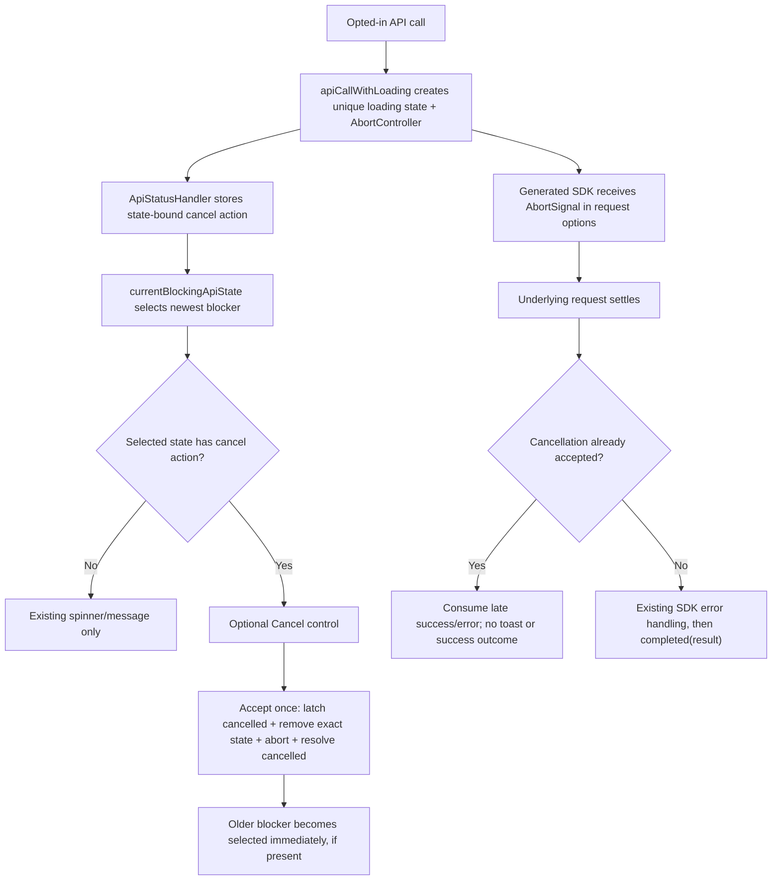

# Phase 1: Shared Cancellation Contract - Research

**Researched:** 2026-07-21
**Domain:** Vue/TypeScript shared request cancellation, loading-state ownership, and deterministic promise races
**Confidence:** HIGH

<user_constraints>
## User Constraints (from CONTEXT.md)

### Phase Boundary

Introduce the shared frontend contract for opt-in request abortion, per-operation loading cleanup, an explicit normal cancelled outcome, and conditional global-modal control. This is a stop-safe Structure phase: existing callers retain their current behavior and expose no Cancel control, and the new structure prepares only Phase 2's initial note-refinement layout-generation behavior. It does not adopt cancellation at a product call site or claim that browser abort stops server work.

### Locked Decisions

#### Cancellation outcome
- **D-01:** An opted-in call returns an explicit two-way discriminated result: `{ status: "completed", result }` or `{ status: "cancelled" }`. Ordinary API failures continue through the existing SDK-shaped error handling instead of becoming a third outcome.
- **D-02:** The cancelled variant carries status only. It does not expose a reason, browser `AbortError`, signal details, or partial result.
- **D-03:** The TypeScript contract must require callers to branch on the status before completed data is accessible, preventing accidental success handling after cancellation.

#### Cancellation timing and cleanup
- **D-04:** Activating Cancel immediately aborts and removes exactly that operation's loading state from every shared indicator. Other loading states remain untouched.
- **D-05:** Once the shared layer accepts a cancel action, cancellation wins over a nearly simultaneous completion. Late browser results are consumed safely and cannot revive success handling.
- **D-06:** The outer call resolves promptly with `{ status: "cancelled" }` without waiting for server work or the underlying request to settle.

#### Overlapping blockers
- **D-07:** The visible Cancel control targets only the currently displayed blocking state, which follows the existing most-recent-blocker selection.
- **D-08:** After the displayed blocker is cancelled, any older active blocker is revealed immediately with its own message and its own cancelability. There is no close-and-reopen transition.
- **D-09:** A noncancelable displayed blocker never exposes Cancel for a hidden cancelable blocker.
- **D-10:** Cancellation is idempotent and bound to the displayed loading state's identity. A repeated or stale action must not retarget a replacement blocker.

#### Cancellation feedback
- **D-11:** Shared cancellation is silent: no generic toast, banner, or `Cancelling`/`Cancelled` interstitial. Immediate disappearance or revelation of the next blocker is the acknowledgement.
- **D-12:** Callers own only required domain-local post-cancel state, such as preserving inputs or exposing retry. The shared layer does not accept or emit caller-specific cancellation messages.
- **D-13:** Routine user cancellation does not produce console logging or telemetry in this phase. The typed outcome and focused tests are the diagnostic contract.

### the agent's Discretion
- Exact type, function, and property names, provided they enforce D-01 through D-03 without changing existing callers.
- Internal abort-race coordination and promise plumbing, provided D-04 through D-06 are deterministic and do not leak unhandled rejections.
- Test decomposition and helper placement, provided nested and concurrent behavior is covered through existing high-level frontend testing patterns.

### Deferred Ideas (OUT OF SCOPE)

None — discussion stayed within the Phase 1 boundary. Server-side cooperative cancellation, mutation-safe cancellation, and product call-site adoption remain in their already assigned later requirements/phases.
</user_constraints>

<phase_requirements>
## Phase Requirements

| ID | Description | Research Support |
|----|-------------|------------------|
| COHE-01 | Frontend cancellation call sites use one shared abort, loading-cleanup, and cancelled-outcome contract while defining only their domain-specific post-cancel behavior | Put `AbortController` ownership, the accepted-cancellation latch, exact state removal, abort-error suppression, and the discriminated outcome in `frontend/src/managedApi/`; expose only an `AbortSignal` to opted-in calls and the result union to callers. `[VERIFIED: codebase + .planning/REQUIREMENTS.md]` |
</phase_requirements>

## Summary

The implementation seam already exists: `apiCallWithLoading` starts a unique loading state synchronously, invokes an SDK-shaped promise, centralizes error toasts, and removes that exact state in `finally`; `currentBlockingApiState` walks the state list newest-first; `DoughnutApp.vue` maps that state to the one global `LoadingModal`. `[VERIFIED: frontend/src/managedApi/clientSetup.ts, frontend/src/managedApi/ApiStatusHandler.ts, frontend/src/DoughnutApp.vue]` The phase should extend this seam with a compile-time opt-in overload and state-bound cancel action rather than add a second cancellation service or component-local controller.

The generated `@hey-api/openapi-ts` client already supports the needed transport path. Its generated request `Options` inherit `RequestOptions`, `RequestOptions` inherits `Config`, `Config` extends standard `RequestInit`, SDK methods spread their options into the fetch client, and `client.gen.ts` spreads resolved options into `new Request(...)`. `[VERIFIED: packages/generated/doughnut-backend-api/client/types.gen.ts, packages/generated/doughnut-backend-api/sdk.gen.ts, packages/generated/doughnut-backend-api/client/client.gen.ts]` Therefore a future opted-in caller can pass `{ signal }` to a generated controller call without changing or regenerating generated code.

The central race must classify cancellation from an internal "accepted" latch, not from an `AbortError`. With the configured `throwOnError: false`, the generated client catches fetch rejection and returns it in the SDK-shaped `error` field, which the current wrapper would otherwise toast. `[VERIFIED: frontend/src/managedApi/clientSetup.ts, packages/generated/doughnut-backend-api/client/client.gen.ts]` The cancellation path must set the latch first, remove the exact state, abort, promptly resolve the cancelled outcome, and keep fulfillment/rejection handlers attached to the underlying request so late settlement is consumed. `[CITED: https://developer.mozilla.org/en-US/docs/Web/API/AbortSignal]` `[CITED: https://developer.mozilla.org/en-US/docs/Web/JavaScript/Reference/Global_Objects/Promise/race]`

**Primary recommendation:** Add an opt-in overload to `apiCallWithLoading` whose callback receives an operation-owned `AbortSignal` and whose return type is the two-way discriminated union; carry an idempotent cancel action on the same `ApiLoadingState`, and plumb only the currently selected state's identity/action to an optional Cancel control.

## Architectural Responsibility Map

| Capability | Primary Tier | Secondary Tier | Rationale |
|------------|-------------|----------------|-----------|
| AbortController lifecycle | Browser / Client (`managedApi`) | Generated fetch client | The shared wrapper must create one controller per opted-in operation; generated request options already forward its signal to `fetch`. `[VERIFIED: generated client source]` |
| Cancellation linearization and outcome | Browser / Client (`managedApi`) | — | The accepted-action latch, prompt cancelled resolution, late-settlement consumption, and discriminated union are all client orchestration concerns. `[VERIFIED: phase decisions D-01–D-06]` |
| Exact loading cleanup | Browser / Client (`ApiStatusHandler`) | Global app shell | Loading states already have unique numeric identities and are removed by identity; the app shell only derives the visible one. `[VERIFIED: frontend/src/managedApi/ApiStatusHandler.ts]` |
| Visible blocker selection | Browser / Client (`DoughnutApp.vue`) | `LoadingModal.vue` | The current selector already chooses the newest blocking state; the modal should render only the selected state's optional action. `[VERIFIED: frontend/src/DoughnutApp.vue, frontend/src/managedApi/ApiStatusHandler.ts]` |
| Domain-specific post-cancel behavior | Future product caller (Phase 2) | Shared result type | This phase exposes the result contract but must not change `NoteRefinement.vue` or any other caller. `[VERIFIED: .planning/ROADMAP.md]` |
| Server work termination | API / Backend | — | No cooperative server cancellation contract exists in this milestone slice; abort only terminates the browser-side request/response work. `[VERIFIED: .planning/PROJECT.md]` |

## Project Constraints (from AGENTS.md)

- Start navigation from `.cursor/agent-map.md`; use the exact generated signatures only when needed and never hand-edit generated API files. `[VERIFIED: AGENTS.md, .cursor/agent-map.md]`
- Run repository tooling with `CURSOR_DEV=true nix develop -c …`; run Git directly. `[VERIFIED: AGENTS.md]`
- Apply `.cursor/rules/frontend-api.mdc`, `frontend-component.mdc`, `frontend-testing.mdc`, `planning.mdc`, and `gsd-coexistence.mdc` to implementation and verification. `[VERIFIED: AGENTS.md]`
- Keep this a stop-safe Structure phase that preserves external behavior and prepares only immediate Phase 2. `[VERIFIED: .cursor/rules/planning.mdc, .planning/ROADMAP.md]`
- Use the global blocker; do not add component-local `LoadingModal` refs. `[VERIFIED: .cursor/rules/frontend-api.mdc]`
- Use Vue 3/TypeScript, DaisyUI-prefixed component classes, browser-mode Vitest, Testing Library text/label/DOM queries rather than role queries, and `data-testid` when a stable selector is needed. `[VERIFIED: .cursor/rules/frontend-component.mdc, .cursor/rules/frontend-testing.mdc]`
- Prefer targeted frontend verification for the touched behavior; do not run the full E2E suite for this structure-only phase. `[VERIFIED: .cursor/rules/planning.mdc, .cursor/agent-map.md]`
- Before phase completion, run the repo's Jidoka/refactor/plan-update/commit/push wrap-up; preserve the user's existing dirty `.planning/config.json` change. `[VERIFIED: AGENTS.md, git status on 2026-07-21]`

## Standard Stack

### Core

| Library / API | Version | Published | Purpose | Why Standard Here |
|---------------|---------|-----------|---------|-------------------|
| Browser `AbortController` / `AbortSignal` | Web platform | Baseline, broadly available since 2019 | Abort the operation-specific fetch request | It is already part of `RequestInit`, requires no dependency, and aborts fetch plus response-body consumption. `[CITED: https://developer.mozilla.org/en-US/docs/Web/API/AbortController/abort]` |
| Vue | 3.5.40 | 2026-07-16 | Reactive selection and conditional global modal control | This is the repository's pinned frontend framework; computed `blockingApiState` already drives the modal. `[VERIFIED: npm registry + frontend/package.json]` |
| TypeScript | 6.0.3 | 2026-04-16 | Overload and discriminated-union enforcement | The frontend tsconfig includes source and tests, so the cancelled variant can be proven not to expose `result` until narrowed. `[VERIFIED: npm registry + frontend/package.json + frontend/tsconfig.json]` |
| Generated Hey API fetch client | `@hey-api/openapi-ts` 0.99.0 | 2026-06-22 | Forward the signal through controller request options | The checked-in generated client already inherits and forwards `RequestInit.signal`; regeneration is unnecessary. `[VERIFIED: npm registry + generated client source]` |

### Supporting

| Library | Version | Published | Purpose | When to Use |
|---------|---------|-----------|---------|-------------|
| Vitest browser mode | 4.1.10 | 2026-07-06 | Deterministic contract, race, and component tests in Chromium | Extend the current focused loading and modal specs. `[VERIFIED: npm registry + frontend/vitest.config.ts]` |
| `vitest-fetch-mock` | 0.4.5 | 2025-03-03 | Exercise actual generated SDK request construction without a backend | Use for the signal-forwarding/abort test and existing SDK-shaped error behavior. `[VERIFIED: npm registry + frontend/tests/managedApi/clientSetup.loading.spec.ts]` |

### Alternatives Considered

| Instead of | Could Use | Tradeoff |
|------------|-----------|----------|
| Operation-owned `AbortController` | A global controller or cancellation registry | A global controller makes exact concurrent cleanup and stale-action safety harder and duplicates the identity already owned by `ApiLoadingState`; do not use it. `[VERIFIED: current per-state architecture + D-04/D-10]` |
| An overload on the existing shared wrapper | A separate product-specific cancellation composable | A second path would split abort/error/loading ownership and undermine COHE-01; keep one wrapper contract. `[VERIFIED: COHE-01 + frontend-api rule]` |
| Internal accepted-cancellation latch | Inspecting `AbortError` after settlement | The generated client converts fetch rejection to an SDK `error` result when `throwOnError` is false, and D-06 requires resolving before that request settles. `[VERIFIED: generated client source + D-06]` |

**Installation:** None. Use the browser API and packages already pinned in the workspace. `[VERIFIED: package.json, frontend/package.json]`

## Package Legitimacy Audit

Not applicable: Phase 1 installs no external packages. Registry checks above only verified the versions already pinned by the repository. `[VERIFIED: package manifests + npm registry]`

## Architecture Patterns

### System Architecture Diagram



`LoadingThinBar` needs no special cancellation branch because it already derives visibility from `apiStatus.states.length`; removing only the cancelled state updates both the bar and modal while preserving every other state. `[VERIFIED: frontend/src/DoughnutApp.vue, frontend/src/managedApi/ApiStatusHandler.ts]`

### Recommended Project Structure

```text
frontend/src/
├── managedApi/
│   ├── ApiStatusHandler.ts       # Add optional state-bound cancel action/identity-safe removal
│   └── clientSetup.ts            # Add overload, AbortController ownership, latch, race, outcome
├── DoughnutApp.vue               # Pass selected state's optional cancel action + identity
└── components/commons/
    └── LoadingModal.vue          # Render optional keyed Cancel control; keep overlay mounted
frontend/tests/
├── helpers/GlobalApiLoadingModal.ts            # Mirror production modal plumbing
├── managedApi/clientSetup.loading.spec.ts      # Cleanup, overlap, prompt result, races, stale action
├── managedApi/clientSetup.spec.ts              # Cancellation is silent; ordinary errors still toast
└── components/commons/LoadingModal.spec.ts     # Default hidden control and conditional activation
packages/generated/doughnut-backend-api/        # Read-only evidence; do not edit/regenerate
```

All listed source and test files already exist; no new production module is required. `[VERIFIED: codebase file inventory]` `frontend/src/components/recall/NoteRefinement.vue` is the Phase 2 caller and must remain unchanged in Phase 1. `[VERIFIED: .planning/ROADMAP.md]`

### Pattern 1: Opt-in overload with a discriminated result

**What:** Preserve the existing call signature/return type for default options and add a required opt-in branch whose callback receives an `AbortSignal` and whose promise returns only `completed(result)` or `cancelled`. The cancelable options should require `blockUi: true` so a contract cannot silently advertise UI cancellation without a global blocker. This compile-time coupling is a recommendation within the agent's naming/type discretion.

**When to use:** Only safe blocking operations whose caller can define a coherent local cancelled outcome; Phase 1 adds the contract but adopts no caller.

```typescript
// Source: recommended shape grounded in D-01 through D-03 and existing SdkResult generic
type CancelableApiResult<T> =
  | { status: "completed"; result: T }
  | { status: "cancelled" }

type CancelableLoadingOptions = {
  blockUi: true
  message?: string
  cancelable: true
}

function apiCallWithLoading<T extends SdkResult>(
  apiCall: () => Promise<T>,
  options?: NonCancelableLoadingOptions
): Promise<T>

function apiCallWithLoading<T extends SdkResult>(
  apiCall: (signal: AbortSignal) => Promise<T>,
  options: CancelableLoadingOptions
): Promise<CancelableApiResult<T>>
```

The implementation signature must not widen the public result to `T | CancelableApiResult<T>` for every caller; overloads preserve all existing destructuring while forcing opted-in callers to narrow `status`. `[VERIFIED: current call-site inventory + D-03]`

### Pattern 2: Accepted-action latch plus an observed losing promise

**What:** Define one linearization point: cancellation is accepted only while that exact state is active. Set the latch before aborting; resolve a dedicated cancellation promise immediately; attach both fulfillment and rejection handlers to the operation promise; check the latch before toasts or completed classification; remove the same state in an idempotent finalizer. `Promise.race` alone is insufficient to encode D-05 because it reports settlement order but does not define the product's accepted-action precedence. `[CITED: https://developer.mozilla.org/en-US/docs/Web/JavaScript/Reference/Global_Objects/Promise/race]`

**When to use:** Only inside the shared cancelable branch.

```typescript
// Source: recommended coordination pattern; AbortSignal behavior is documented by MDN.
const cancelled = { status: "cancelled" } as const
let cancellationAccepted = false

const acceptCancel = () => {
  if (cancellationAccepted || !statusHandler.finishLoading(loadingState)) return
  cancellationAccepted = true
  controller.abort()
  resolveCancellation(cancelled)
}

const observedOperation = Promise.resolve()
  .then(() => apiCall(controller.signal))
  .then(
    (result) => {
      if (cancellationAccepted) return cancelled
      if (result.error) handleSdkError(result)
      return { status: "completed", result } as const
    },
    (error) => {
      if (cancellationAccepted) return cancelled
      throw error
    }
  )
  .finally(() => statusHandler.finishLoading(loadingState))

return await Promise.race([observedOperation, cancellationPromise])
```

The exact implementation may avoid `Promise.resolve().then(...)` if it preserves synchronous API invocation, but it must attach rejection handling before returning and must gate error handling on the accepted latch. This is an implementation recommendation derived from D-05/D-06 and the generated client's SDK error conversion.

### Pattern 3: State-bound conditional modal action

**What:** Add an optional cancel action to `ApiLoadingState`, pass only the selected state's action and identity through `DoughnutApp.vue`, and key the cancel-control subtree by state id. Keep the overlay itself continuously mounted while another blocker remains. This preserves newest-first selection, prevents a hidden state's capability from leaking into the visible state, and lets stale references call only their original idempotent closure. `[VERIFIED: existing selector + D-07–D-10]`

**When to use:** At the single global modal wiring and its test helper; existing noncancelable states omit the action and remain visually unchanged.

### Anti-Patterns to Avoid

- **Detect cancellation by checking `error.name === "AbortError"`:** the generated client catches fetch errors into an SDK result, external transport errors could look similar, and the outer result must resolve before transport settlement. Use the private accepted-action latch. `[VERIFIED: generated client source + D-05/D-06]`
- **Look up `currentBlockingApiState` when handling a stale event:** that can retarget the blocker revealed after the original was cancelled. Bind the action to the state's identity and test repeated invocation of the old action. `[VERIFIED: D-10]`
- **Clear `apiStatus.states` wholesale:** this breaks concurrent/nested cleanup and both shared indicators. Remove only by the unique id. `[VERIFIED: existing concurrency tests + D-04]`
- **Expose the controller, abort reason, or partial response:** callers need only the signal during invocation and the two-way result afterward. `[VERIFIED: D-01–D-03]`
- **Put Cancel into `runWithBlockingApiLoading` in this phase:** that composite helper currently exposes no single request signal and returns raw `T`; expanding it prepares beyond Phase 2 and risks implying multi-request cancellation. Leave it noncancelable. `[VERIFIED: frontend/src/managedApi/clientSetup.ts + Phase 1 boundary]`
- **Modify `NoteRefinement.vue`, generated SDK files, backend endpoints, or `LoadingThinBar`:** these are respectively Phase 2 adoption, generated artifacts, deferred server cooperation, and already-correct derived UI. `[VERIFIED: ROADMAP + generated API rule + current app wiring]`

## Don't Hand-Roll

| Problem | Don't Build | Use Instead | Why |
|---------|-------------|-------------|-----|
| Browser request abortion | Custom tokens, polling flags, or an event bus | One native `AbortController` per opted-in operation | The generated client already accepts `RequestInit.signal`, and the platform aborts fetch/body consumption. `[CITED: https://developer.mozilla.org/en-US/docs/Web/API/AbortController/abort]` |
| Global cancellation registry | A second map keyed by request URL or message | Existing unique `ApiLoadingState.id` plus a state-bound action | URLs/messages are not unique; state identity already supports exact concurrent cleanup. `[VERIFIED: ApiStatusHandler.ts]` |
| Cancellation error normalization | Parsing DOMException names into public results | Accepted-action latch and fixed `{ status: "cancelled" }` | The public contract intentionally hides reasons and transport details. `[VERIFIED: D-02]` |
| Component-local blocker | A new modal/ref/controller in the eventual caller | Existing `DoughnutApp` global modal path | The repository requires a single whole-UI blocker. `[VERIFIED: frontend-api rule]` |
| New async/cancellation package | Third-party promise cancellation abstraction | Native Promise + AbortController | All required primitives and request wiring already exist; another dependency would add two sources of lifecycle truth. `[VERIFIED: codebase + MDN]` |

**Key insight:** The difficult part is not sending abort; it is choosing and testing the shared linearization point that decides whether completion or an accepted user action owns the terminal outcome.

## Runtime State Inventory

This is a structural refactor of transient frontend orchestration, so all five runtime-state categories were checked even though no rename or persistent migration is expected.

| Category | Items Found | Action Required |
|----------|-------------|-----------------|
| Stored data | None — loading states are in-memory Vue state created in `DoughnutApp.vue`; no database/local-storage representation was found. `[VERIFIED: codebase inspection]` | No migration |
| Live service config | None — no external service configuration participates in frontend loading/cancellation. `[VERIFIED: phase boundary and codebase inspection]` | None |
| OS-registered state | None — no launch/service/task registration is involved. `[VERIFIED: phase boundary]` | None |
| Secrets/env vars | None — the controller/signal and state action require no configuration or secret. `[VERIFIED: codebase inspection]` | None |
| Build artifacts / installed packages | Generated API artifacts already contain signal support; they must not be edited or regenerated. Existing node modules provide the pinned test stack. `[VERIFIED: generated source + package manifests]` | Source/test edits only; no install or regeneration |

## Common Pitfalls

### Pitfall 1: Abort is toasted as an API failure

**What goes wrong:** The cancel click disappears, but `handleSdkError` later emits the generic "API Error" toast.

**Why it happens:** `throwOnError: false` makes the generated client return fetch rejection in `result.error`; the current wrapper toasts any truthy error without knowing whether shared cancellation was accepted. `[VERIFIED: clientSetup.ts + generated client.gen.ts]`

**How to avoid:** Check the accepted-cancellation latch before `handleSdkError`, and keep the abort controller private so the shared action is the only routine cancellation source.

**Warning signs:** A cancellation test observes `mockToast.error`, or the cancel result waits until fetch returns its error object.

### Pitfall 2: `Promise.race` lets a near-simultaneous completion win

**What goes wrong:** A test resolves the underlying promise and invokes Cancel in the same synchronous turn, then receives `completed`.

**Why it happens:** `Promise.race` follows the first settlement reaction; product precedence requires a separate accepted-action latch. `[CITED: https://developer.mozilla.org/en-US/docs/Web/JavaScript/Reference/Global_Objects/Promise/race]`

**How to avoid:** Set the latch synchronously when the exact state accepts cancellation and check it in both operation fulfillment and rejection branches.

**Warning signs:** Race tests pass only with timers, or behavior changes when `resolveCall()` and `cancel()` order within one turn is reversed.

### Pitfall 3: Prompt outer resolution leaves an unhandled late rejection

**What goes wrong:** The caller receives `cancelled`, but Vitest/browser later reports an unhandled rejection from the aborted or deliberately rejected operation.

**Why it happens:** Returning only the cancellation promise stops awaiting the request without attaching a rejection observer.

**How to avoid:** Build an observed operation promise with both success and error handlers before racing; let it finish in the background and no-op when the latch is set.

**Warning signs:** The focused test passes its assertion but the test file fails after completion or logs a browser unhandled-rejection error.

### Pitfall 4: Stale action cancels the blocker revealed underneath

**What goes wrong:** A repeated callback or delayed event cancels an older operation that became visible after the first cancellation.

**Why it happens:** The UI handler re-reads "current" state rather than invoking the action bound to the rendered state identity.

**How to avoid:** Keep each closure bound to one `ApiLoadingState.id`, make acceptance idempotent, and key the optional cancel-control subtree by that id while keeping the overlay mounted.

**Warning signs:** Calling a captured cancel action twice changes two states, or a test's second invocation removes the older blocker.

### Pitfall 5: The hidden state leaks its cancelability

**What goes wrong:** Cancel appears because some state is cancelable even though the newest displayed blocker is not.

**Why it happens:** The UI derives cancelability with `states.some(...)` separately from `currentBlockingApiState`.

**How to avoid:** Derive message, identity, and optional action from the same selected state object.

**Warning signs:** A noncancelable newest blocker displays Cancel when an older cancelable blocker exists.

### Pitfall 6: Overloads silently change every existing caller

**What goes wrong:** Existing destructuring sites receive a union or must pass a callback parameter, expanding Phase 1 across dozens of files.

**Why it happens:** The implementation signature is exported instead of narrow overloads, or `cancelable` is typed as a general boolean in the default options.

**How to avoid:** Keep a `cancelable?: false` default overload returning `Promise<T>` and a required literal `cancelable: true` overload returning `Promise<CancelableApiResult<T>>`.

**Warning signs:** Type errors appear outside the six likely source/helper/test files, or existing `const { data, error } = await apiCallWithLoading(...)` stops compiling.

## Code Examples

### Future generated-controller signal handoff (compile evidence only; do not adopt in Phase 1)

```typescript
// Source: generated Options -> RequestInit inheritance verified in checked-in client source.
const outcome = await apiCallWithLoading(
  (signal) =>
    AiController.generateRefinementSuggestions({
      path: { note: noteId },
      signal,
    }),
  { blockUi: true, message: "AI is generating layout...", cancelable: true }
)

if (outcome.status === "cancelled") return
const { data, error } = outcome.result
```

This belongs to Phase 2, not Phase 1; it demonstrates that no generated file change is necessary and that `result` is available only after narrowing. `[VERIFIED: generated SDK signature + phase roadmap]`

### Required type-narrowing test shape

```typescript
// Source: TypeScript discriminated-union contract required by D-03.
expectTypeOf(outcome).toEqualTypeOf<
  | { status: "completed"; result: typeof okApiResult }
  | { status: "cancelled" }
>()

if (outcome.status === "completed") {
  expect(outcome.result).toEqual(okApiResult)
}

if (outcome.status === "cancelled") {
  // @ts-expect-error cancelled outcomes intentionally expose no result
  outcome.result
}
```

### Deterministic same-turn cancellation-win test shape

```typescript
// Source: D-05; no timers needed.
const call = apiCallWithLoading(
  () => pendingOperation,
  { blockUi: true, cancelable: true }
)
const cancel = apiStatus.states[0]?.cancel

resolveOperation(okApiResult)
cancel?.()

await expect(call).resolves.toEqual({ status: "cancelled" })
```

## State of the Art

| Old Approach | Current Approach | When Changed | Impact |
|--------------|------------------|--------------|--------|
| Custom cancel tokens in client libraries | Standard `AbortSignal` passed in `RequestInit` | Broad browser availability since 2019 | Use the native API already accepted by the generated Fetch client; no cancellation dependency is needed. `[CITED: https://developer.mozilla.org/en-US/docs/Web/API/AbortController/abort]` |
| Treat abort as a transport exception | Treat an accepted user action as a typed normal domain outcome while privately consuming transport settlement | Locked for this phase on 2026-07-21 | Prevents error toasts and accidental success/navigation after cancellation. `[VERIFIED: D-01–D-06]` |
| One global loading boolean | Unique state objects with newest-blocker selection | Already implemented before Phase 1 | Enables exact cancellation and immediate revelation of older concurrent blockers. `[VERIFIED: ApiStatusHandler.ts + existing tests]` |

**Deprecated/outdated for this phase:** Error-name matching as the public cancellation contract and clearing all global loading state are both incompatible with the locked outcome and concurrency decisions. `[VERIFIED: D-01/D-04]`

## Assumptions Log

| # | Claim | Section | Risk if Wrong |
|---|-------|---------|---------------|
| — | None. All implementation facts are grounded in checked-in code/config or cited platform documentation; discretionary items are explicitly recommendations. | — | — |

## Open Questions

None blocking planning. Exact exported names and whether the cancel action is stored as a function or a tiny identity/action object remain within the agent's discretion; the plan should preserve the overload, identity, and race invariants rather than lock incidental naming.

## Environment Availability

| Dependency | Required By | Available | Version | Fallback |
|------------|-------------|-----------|---------|----------|
| Nix | Required repo-tool wrapper | ✓ | 2.30.2 | — |
| Node.js in Nix shell | Typecheck/build/test | ✓ | 26.4.0 | — |
| pnpm in Nix shell | Workspace scripts | ✓ | 11.15.1 | — |
| Playwright Chromium tooling | Vitest browser mode | ✓ | 1.61.1 | `frontend` pretest installs Chromium if absent |

All probes succeeded on 2026-07-21. `[VERIFIED: local command execution]`

**Missing dependencies with no fallback:** None.

**Missing dependencies with fallback:** None.

## Validation Architecture

### Test Framework

| Property | Value |
|----------|-------|
| Framework | Vitest 4.1.10 in Playwright Chromium browser mode `[VERIFIED: frontend/vitest.config.ts]` |
| Config file | `frontend/vitest.config.ts` |
| Quick run command | `CURSOR_DEV=true nix develop -c pnpm frontend:test tests/managedApi/clientSetup.loading.spec.ts tests/managedApi/clientSetup.spec.ts tests/components/commons/LoadingModal.spec.ts` |
| Full suite command | `CURSOR_DEV=true nix develop -c pnpm frontend:verify` |

The current two-file baseline (`clientSetup.loading.spec.ts` plus `LoadingModal.spec.ts`) passed 13/13 tests in 4.9 seconds on 2026-07-21. `[VERIFIED: local test run]`

### Phase Requirements → Test Map

| Req ID | Behavior | Test Type | Automated Command | File Exists? |
|--------|----------|-----------|-------------------|-------------|
| COHE-01 | Existing noncancelable callers keep raw SDK return behavior and no cancel action | Browser-mode unit/contract | `CURSOR_DEV=true nix develop -c pnpm frontend:test tests/managedApi/clientSetup.loading.spec.ts` | ✅ extend existing |
| COHE-01 | Opted-in callback receives one signal; accepted cancel aborts, removes exactly its state, and resolves promptly with `cancelled` | Browser-mode unit/contract | `CURSOR_DEV=true nix develop -c pnpm frontend:test tests/managedApi/clientSetup.loading.spec.ts` | ✅ extend existing |
| COHE-01 | Same-turn resolve-then-cancel returns cancelled; late resolve/reject is consumed; stale action is idempotent | Deterministic race unit | `CURSOR_DEV=true nix develop -c pnpm frontend:test tests/managedApi/clientSetup.loading.spec.ts` | ✅ extend existing |
| COHE-01 | Cancelled result is silent while ordinary SDK errors retain existing toast behavior | Browser-mode unit | `CURSOR_DEV=true nix develop -c pnpm frontend:test tests/managedApi/clientSetup.spec.ts` | ✅ extend existing |
| COHE-01 | Optional Cancel renders only for the selected cancelable state and invokes the bound action; default modal remains unchanged | Component + shared-selector integration | `CURSOR_DEV=true nix develop -c pnpm frontend:test tests/components/commons/LoadingModal.spec.ts tests/managedApi/clientSetup.loading.spec.ts` | ✅ extend existing |
| COHE-01 | TypeScript requires narrowing before `result` access and existing callers still typecheck | Static typecheck | `CURSOR_DEV=true nix develop -c pnpm frontend:build` | ✅ add type assertion to existing spec |

### Required Deterministic Cases

- Default call: identical raw SDK result; no cancel property/control. `[VERIFIED: Phase 1 success criterion 1]`
- Cancel while request remains pending: outer result settles before the request; signal is aborted; exact state disappears. `[VERIFIED: D-04/D-06]`
- Resolve underlying promise then cancel in the same turn: cancelled wins. `[VERIFIED: D-05]`
- Cancel then resolve and cancel then reject: late settlement is consumed, produces no toast/unhandled rejection, and cannot change the result. `[VERIFIED: D-05/D-11]`
- Two blockers: cancel newest reveals older immediately; cancel closure called twice removes only its original state. `[VERIFIED: D-07/D-08/D-10]`
- Older cancelable + newest noncancelable: visible modal has no Cancel. `[VERIFIED: D-09]`
- Nested/default calls retain current independent cleanup. `[VERIFIED: Phase 1 success criterion 2]`

### Sampling Rate

- **Per task commit:** Run the focused quick command above.
- **Per wave merge:** `CURSOR_DEV=true nix develop -c pnpm frontend:verify`
- **Phase gate:** Focused cancellation/modal specs green, `frontend:verify` green, and formatting via `CURSOR_DEV=true nix develop -c pnpm frontend:format`; no full E2E run is required because Phase 1 intentionally changes no product call site. `[VERIFIED: planning and frontend-testing rules]`

### Wave 0 Gaps

- [ ] Extend `frontend/tests/managedApi/clientSetup.loading.spec.ts` with the prompt cancellation, race, concurrency, late-settlement, stale-action, and type-narrowing cases before implementation.
- [ ] Extend `frontend/tests/managedApi/clientSetup.spec.ts` with the no-toast-on-accepted-cancel case while retaining ordinary error-toast coverage.
- [ ] Extend `frontend/tests/components/commons/LoadingModal.spec.ts` with conditional Cancel rendering/activation and unchanged-default assertions.
- [ ] Update `frontend/tests/helpers/GlobalApiLoadingModal.ts` alongside production plumbing so later high-level tests exercise the real selected-state contract.
- Framework install/config gaps: None. `[VERIFIED: baseline test run]`

## Security Domain

### Applicable ASVS Categories

| ASVS Category | Applies | Standard Control |
|---------------|---------|-----------------|
| V2 Authentication | No new surface | Existing credentialed generated client configuration remains unchanged. `[VERIFIED: clientSetup.ts]` |
| V3 Session Management | No new surface | Abort does not alter cookies, sessions, or 401 interceptor behavior. `[VERIFIED: clientSetup.ts + phase boundary]` |
| V4 Access Control | No new surface | Cancellation does not grant a new API operation or change backend authorization. `[VERIFIED: phase boundary]` |
| V5 Input Validation | Internal UI action only | Accept cancellation only for the exact active state identity; do not accept caller-controlled URLs, reasons, or messages as authority. `[VERIFIED: D-02/D-10]` |
| V6 Cryptography | No | No cryptographic material or algorithm is introduced. `[VERIFIED: phase boundary]` |

### Known Threat Patterns for the Vue/Fetch stack

| Pattern | STRIDE | Standard Mitigation |
|---------|--------|---------------------|
| Stale or repeated UI action aborts a different in-flight operation | Denial of Service | Identity-bound idempotent action; never re-resolve the current state from a stale callback. `[VERIFIED: D-10]` |
| Cross-operation state clearing hides unrelated work | Denial of Service / Tampering | Remove one unique loading-state id only; concurrency tests cover survivors. `[VERIFIED: D-04]` |
| Late response mutates client state after accepted cancellation | Tampering (client state integrity) | Shared terminal latch returns only cancelled and prevents late completed outcome/success handling. `[VERIFIED: D-05]` |
| UI implies server work was stopped | Repudiation / integrity ambiguity | Keep copy limited to "Cancel" and document client-side semantics; do not claim backend termination. `[VERIFIED: PROJECT safety constraint]` |

The phase introduces no new network endpoint, credentials, persisted input, HTML rendering, or authorization decision. `[VERIFIED: phase boundary and likely file set]`

## Sources

### Primary (HIGH confidence)

- `frontend/src/managedApi/clientSetup.ts` — current loading lifecycle, SDK result handling, toast timing, client config, and composite helper.
- `frontend/src/managedApi/ApiStatusHandler.ts` — unique state identity, exact cleanup, and newest-blocker selection.
- `frontend/src/DoughnutApp.vue`, `frontend/src/components/commons/LoadingModal.vue`, `frontend/tests/helpers/GlobalApiLoadingModal.ts` — production and test modal wiring.
- `packages/generated/doughnut-backend-api/client/types.gen.ts`, `client/client.gen.ts`, and `sdk.gen.ts` — exact `RequestInit.signal` type and forwarding path.
- `frontend/tests/managedApi/clientSetup.loading.spec.ts`, `clientSetup.spec.ts`, and `frontend/tests/components/commons/LoadingModal.spec.ts` — current regression seams and conventions.
- `.planning/PROJECT.md`, `REQUIREMENTS.md`, `ROADMAP.md`, `STATE.md`, and Phase 1 `CONTEXT.md` — scope, requirement ownership, and locked decisions.
- `package.json`, `frontend/package.json`, `frontend/tsconfig.json`, and `frontend/vitest.config.ts` — pinned stack and validation configuration.
- npm registry checks on 2026-07-21 — existing Vue, TypeScript, Vitest, Hey API, and fetch-mock versions and publish dates.

### Secondary (MEDIUM confidence)

- [MDN AbortController.abort](https://developer.mozilla.org/en-US/docs/Web/API/AbortController/abort) — browser abort semantics and baseline availability; page last modified 2025-09-17.
- [MDN AbortSignal](https://developer.mozilla.org/en-US/docs/Web/API/AbortSignal) — signal handoff, single-use behavior, and fetch `AbortError`; crawled during research on 2026-07-21.
- [MDN Promise.race](https://developer.mozilla.org/en-US/docs/Web/JavaScript/Reference/Global_Objects/Promise/race) — first-settlement and always-asynchronous semantics; crawled during research on 2026-07-21.
- [Hey API official site](https://heyapi.dev/) — confirms the project generates native Fetch API clients; exact signal support was verified from this repository's generated 0.99.0 source.

### Tertiary (LOW confidence)

- None.

## Metadata

**Confidence breakdown:**
- Standard stack: HIGH — versions are pinned locally and verified against npm; AbortController is an official browser primitive.
- Architecture: HIGH — all proposed seams and exclusions are grounded in direct source/test inspection and locked decisions.
- Pitfalls: HIGH — each critical race/error pitfall follows from the checked-in generated client behavior, current wrapper order, and deterministic promise semantics.

**Research date:** 2026-07-21
**Valid until:** 2026-08-20 (30 days; implementation is pinned and codebase-specific)
