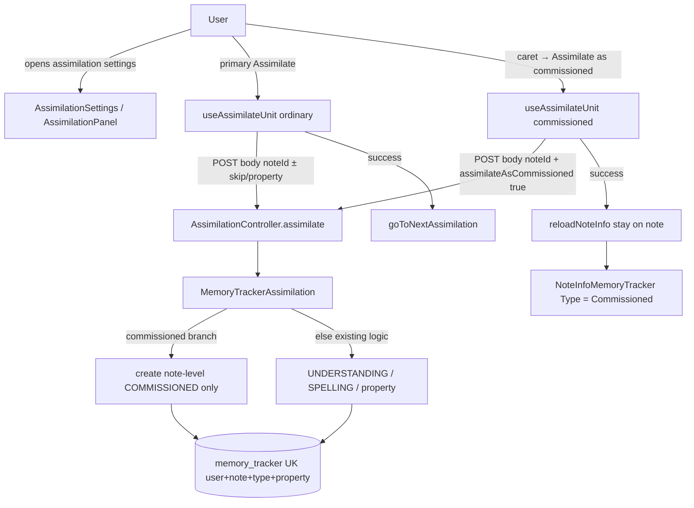

# Phase 02: assimilate-as-commissioned - Research

**Researched:** 2026-08-08
**Domain:** Assimilation UI + MemoryTracker create path (Vue / Spring Boot / Cypress E2E)
**Confidence:** HIGH

## Summary

Phase 2 is a thin Behavior slice on top of Phase 1’s `MemoryTrackerType.COMMISSIONED` model. The create path does not exist yet: `AssimilationRequestDTO` has only `noteId`, `skipMemoryTracking`, and `propertyKey`; `MemoryTrackerAssimilation` never creates `COMMISSIONED`. Frontend `AssimilationButtons` is a flat Assimilate / Skip / Revive row with no caret. Assimilation settings already list trackers via `NoteInfoMemoryTracker`, but labels are only `normal` / `spelling` / `property: …`, so a COMMISSIONED row would currently render as **normal** — that breaks D-07 / E2E unless the Type cell is updated.

**Primary recommendation:** Extend `POST /api/assimilation` with optional `Boolean assimilateAsCommissioned` (same Boolean-wrapper style as `skipMemoryTracking`), early-branch in `MemoryTrackerAssimilation` to create a single note-level COMMISSIONED tracker (idempotent empty list if one exists), add a note-level-only DaisyUI `daisy-join` split (primary Assimilate + caret dropdown), skip queue advance and ordinary count increments on that path, and label the tracker **Commissioned** in `NoteInfoMemoryTracker`. Graduate the one Phase 2 E2E scenario under `e2e_test/features/learning_session/` tagged `@wip` until green. No new npm/Java packages; no Flyway.

<user_constraints>
## User Constraints (from CONTEXT.md)

### Locked Decisions
- **D-01:** "Assimilate as commissioned" creates **only** a note-level `MemoryTrackerType.COMMISSIONED` tracker. It does **not** also create UNDERSTANDING/SPELLING in the same action. Ordinary assimilate remains a separate click. — **Reversibility:** reversible — create path flag only; no schema change beyond existing type column
- **D-02:** The menu item is available whenever the note has **no** note-level COMMISSIONED tracker yet — whether or not UNDERSTANDING/SPELLING already exist (coexistence entry from either order)
- **D-03:** After only COMMISSIONED exists, the primary **Assimilate** button must still be enabled for ordinary intake (frontend disable logic must ignore COMMISSIONED the same way Phase 1 backend create already does)
- **D-04:** Note-level control is a **split affordance**: unchanged primary **Assimilate** (and Skip recall / Revive as today) plus a **caret** that opens a dropdown with a single item — **Assimilate as commissioned** (ADR 0001 wording). Not offered on property rows
- **D-05:** When a note-level COMMISSIONED tracker already exists, hide or disable the commissioned menu item (idempotent — no second COMMISSIONED)
- **D-06:** After successful commissioned assimilate: **stay on the current note**, reload assimilation settings / note recall info, and **do not** advance the assimilation queue. (Note may still need ordinary assimilation; advancing would skip that opportunity)
- **D-07:** Assimilation settings (note recall info / tracker presentation) must make the **commissioned memory tracker** visibly distinct so E2E can assert “I should see a commissioned memory tracker for {title}”. Prefer an explicit type label using glossary term **Commissioned** (not Tutor / Learning Session — those belong to later phases)
- **D-08:** Graduate only the Phase 2 scenario from `.planning/phases/01-commissioned-tracker-model/commissioned_learning_session.feature` (“Assimilating a note with a tutor creates a commissioned memory tracker”) into `e2e_test/features/learning_session/`, tag `@wip` until green. Do not graduate later-phase scenarios in this phase

### Claude's Discretion
- Exact DaisyUI / split-button markup and `data-test` ids (keep page-object friendly)
- Whether API is an extended `AssimilationRequestDTO` field vs a dedicated create path — prefer the smallest extension of the existing assimilate endpoint if it keeps OpenAPI/clients coherent
- Exact placement of the type badge in NoteInfoBar vs a dedicated tracker row — whatever matches existing spelling/property tracker presentation with minimal UI churn

### Deferred Ideas (OUT OF SCOPE)
- Potential learning sessions on recall progress bar — Phase 3 (POT-*, TRK-03)
- Learning Session / Request builder — Phase 4–5
- Commissioned trackers for properties in UI — TRK-04 (v2)
- Commissioned assimilation as first intake via Tutor (not only recall) — TRK-05 (v2)
- Feedback score display on tracker — REC-03 (Phase 6)

None — discussion stayed within phase scope for actionable deferred items beyond roadmap.
</user_constraints>

<phase_requirements>
## Phase Requirements

| ID | Description | Research Support |
|----|-------------|------------------|
| TRK-01 | User can assimilate a note as a commissioned memory tracker via a caret dropdown next to Assimilate (not offered for properties in the UI) | Split affordance on note-level `AssimilationButtons` only; `assimilateAsCommissioned` on existing assimilate endpoint; E2E graduate + page objects |
| TRK-02 | A commissioned memory tracker coexists with ordinary trackers for the same note | UK already includes `type`; backend early-branch create COMMISSIONED without touching UNDERSTANDING/SPELLING; label both rows; controller + UI tests for ordinary-then-commissioned |
</phase_requirements>

## Architectural Responsibility Map

| Capability | Primary Tier | Secondary Tier | Rationale |
|------------|-------------|----------------|-----------|
| Create COMMISSIONED tracker | API / Backend | Database / Storage | Persistence + UK + assimilate semantics live in `MemoryTrackerAssimilation` / `memory_tracker` |
| Opt-in caret / menu UX | Browser / Client | — | Assimilation settings footer; property rows must not get caret |
| Disable primary Assimilate correctly (ignore COMMISSIONED) | Browser / Client | API / Backend | Frontend mirrors Phase 1 backend existence filter (D-03) |
| Stay on note / no queue advance | Browser / Client | — | `useAssimilateUnit` today always calls `goToNextAssimilation` |
| Visible “Commissioned” type | Browser / Client | API / Backend | `MemoryTracker.type` already on OpenAPI; label in `NoteInfoMemoryTracker` |
| E2E observable assimilation-as-commissioned | Browser / Client | — | Cypress feature + page objects under `learning_session/` |

## Project Constraints (from .cursor/rules/)

| Directive | Implication for this phase |
|-----------|----------------------------|
| Nix tooling: `CURSOR_DEV=true nix develop -c …` (git without Nix) | All test/generate commands use Nix prefix |
| Behavior vs Structure; one observable behavior; stop-safe | Single Behavior phase: assimilate as commissioned only |
| Time budget ~5 min/slice; >10 min finer-decompose | Prefer thin vertical slices (DTO+backend test → UI → E2E) |
| Capability naming — no phase numbers in product artifacts | Feature under `learning_session/`, not `phase-02-*` |
| E2E-led; `@wip` until green; CI skips `@wip`; cap 5 | Graduate one scenario `@wip`; current WIP count is 0 |
| Targeted E2E only (`cypress run --spec`), not full suite | Spec the new feature file |
| Unit tests: stable boundary, makeMe, data over mocks | Backend: `AssimilationControllerTests`; frontend: mount AssimilationPanel/Settings |
| Never silently swallow failures | Empty list for idempotent duplicate is OK (existing assimilate pattern); do not catch-and-ignore create failures |
| After DTO/controller change: `pnpm generateTypeScript` | Never hand-edit `packages/generated/doughnut-backend-api/**` |
| ADRs: Accepted binding; Proposed guide new naming | ADR 0001 §3 glossary for copy; 0005/0003 not implemented here |
| Phase wrap-up: Jidoka → post-change-refactor → plan update → commit → push | Planner must include local execute-plan wrap-up |

## Standard Stack

### Core

| Library / Layer | Version | Purpose | Why Standard |
|-----------------|---------|---------|--------------|
| Spring Boot controllers + DTO | in-repo | `POST /api/assimilation` | Existing assimilate path; extend DTO |
| JPA `MemoryTracker` / `MemoryTrackerType` | in-repo | Persist COMMISSIONED | Phase 1 + UK `V300000239` already support coexistence |
| Vue 3 + DaisyUI | daisyui **5.7.16** `[VERIFIED: frontend/package.json]` | Split Assimilate + caret | Existing `daisy-join` / `AutoCollapseDropdown` / `DropdownMenu*` |
| Generated OpenAPI client | `packages/generated/doughnut-backend-api` | Frontend assimilate call | regenerate via `generate-api-client` skill |
| Cypress + Cucumber | in-repo e2e | Graduate Phase 2 scenario | `e2e-authoring.mdc`; CI tags `not @wip` |

### Supporting

| Library | Version | Purpose | When to Use |
|---------|---------|---------|-------------|
| `makeMe` (Java + TS) | in-repo | Fixtures | Backend `.commissioned()` exists; extend TS builder with `.commissioned()` / `type` |
| `apiCallWithLoading` | in-repo | Block UI on assimilate | Same as ordinary assimilate |
| `scripts/check_wip_tags.sh` | `MAX_WIP=5` | Cap WIP scenarios | After adding `@wip` |

### Alternatives Considered

| Instead of | Could Use | Tradeoff |
|------------|-----------|----------|
| Extend `AssimilationRequestDTO` | Dedicated `POST /api/assimilation/commissioned` | Extra OpenAPI surface; CONTEXT prefers smallest assimilate extension |
| New tracker settings row UI | Reuse `NoteInfoMemoryTracker` Type column | Minimal churn; matches spelling/property rows |
| Install new UI library | DaisyUI already present | No new packages |

**Installation:** none — no new packages.

**Version verification:** daisyui already locked at `5.7.16` in `frontend/package.json` `[VERIFIED: frontend/package.json]`. Phase installs nothing new.

## Package Legitimacy Audit

> No external packages are added in this phase.

| Package | Registry | Age | Downloads | Source Repo | Verdict | Disposition |
|---------|----------|-----|-----------|-------------|---------|-------------|
| *(none new)* | — | — | — | — | — | N/A |

**Packages removed due to [SLOP] verdict:** none  
**Packages flagged as suspicious [SUS]:** none for install (existing `daisyui` is already a project dependency; do not reinstall)

## Architecture Patterns

### System Architecture Diagram



### Recommended Project Structure (touch points)

```
backend/.../dto/AssimilationRequestDTO.java          # + assimilateAsCommissioned
backend/.../services/MemoryTrackerAssimilation.java  # early COMMISSIONED branch
backend/.../controllers/AssimilationControllerTests.java
frontend/.../recall/AssimilationButtons.vue          # note-level caret + join
frontend/.../recall/AssimilationSettings.vue         # pass showCommissionedOption
frontend/.../recall/AssimilationPanel.vue            # ignore COMMISSIONED in disable
frontend/.../composables/useAssimilateUnit.ts        # flag, skip navigate, skip count
frontend/.../notes/NoteInfoMemoryTracker.vue         # Type label Commissioned
packages/doughnut-test-fixtures/.../MemoryTrackerBuilder.ts  # .commissioned()
e2e_test/features/learning_session/*.feature         # graduate scenario @wip
e2e_test/start/pageObjects/assimilationPage/         # caret / menu helpers
e2e_test/step_definitions/                           # assimilate as commissioned steps
```

### Pattern 1: Smallest assimilate-endpoint extension
**What:** Add `public Boolean assimilateAsCommissioned;` beside existing `skipMemoryTracking` on `AssimilationRequestDTO`.  
**When to use:** Always for this phase (locked preference).  
**Example:** Treat `Boolean.TRUE.equals(request.assimilateAsCommissioned)` as commissioned create; omit field or false = today’s behavior. `[VERIFIED: AssimilationRequestDTO.java:3-6]` fields today: `noteId`, `skipMemoryTracking`, `propertyKey`.

### Pattern 2: DaisyUI join + existing dropdown primitives
**What:** Wrap note-level primary Assimilate + caret in `daisy-join`; caret uses `AutoCollapseDropdown` + `DropdownMenu` / `DropdownMenuItem` + `dropdownMenuButtonClass` (same family as `NotebookCatalogGroupActions.vue`).  
**When to use:** Note-level footer buttons only (`showCommissionedOption`); property rows keep current `AssimilationButtons` without caret (D-04).  
**Source:** DaisyUI join docs `[CITED: https://daisyui.com/components/join]`; repo already uses `daisy-join` / `daisy-join-item` and `AutoCollapseDropdown`.

### Pattern 3: Tracker Type label (not a new badge surface)
**What:** Extend `trackerTypeLabel` in `NoteInfoMemoryTracker.vue` so COMMISSIONED is distinct before falling through to spelling/normal.  
**When to use:** D-07 / E2E assertion via existing Memory Trackers table (already under NoteInfoBar → NoteInfoComponent).  
**Current labels** `[VERIFIED: NoteInfoMemoryTracker.vue:38-44]`: `property: ${propertyKey}` | `spelling` | `normal`.

### Anti-Patterns to Avoid
- **Dedicated commissioned assimilate controller** without need — duplicates auth/OpenAPI.
- **Creating UNDERSTANDING in the same action** — violates D-01.
- **Offering caret on property rows** — violates D-04 / TRK-01.
- **Calling `goToNextAssimilation` after commissioned create** — violates D-06.
- **Counting COMMISSIONED into frontend ordinary assimilate counters** — Phase 1 backend counts exclude COMMISSIONED; local `+= newTrackerCount` would drift.
- **Labeling as Tutor / Learning Session** — deferred phases; use **Commissioned**.
- **Hand-editing generated API client** — regenerate only.
- **Encoding phase numbers in feature/file product names**.

## Don't Hand-Roll

| Problem | Don't Build | Use Instead | Why |
|---------|-------------|-------------|-----|
| Dropdown portal / click-outside | Custom menu | `AutoCollapseDropdown` + `DropdownMenu*` | Already handles collapse/portal |
| Split button CSS | Custom borders | DaisyUI `daisy-join` / `daisy-join-item` | Standard in repo |
| API client types | Manual TS interfaces | `pnpm generateTypeScript` | OpenAPI source of truth |
| COMMISSIONED fixtures (backend) | Raw entity sets | `makeMe.aMemoryTrackerFor(note).commissioned()` | Exists `[VERIFIED: MemoryTrackerBuilder.java:58-60]` |
| E2E busy waits | Arbitrary `cy.wait` | `waitUntilAppIsNotBusy` after assimilate | `frontend-api` / e2e pairing |

**Key insight:** Phase 1 already solved persistence, UK coexistence, and ordinary-path exclusion of COMMISSIONED. Phase 2 is wiring a create flag + UI/E2E — do not re-open scheduling or due-recall.

## Common Pitfalls

### Pitfall 1: Frontend disable treats COMMISSIONED as “already assimilated”
**What goes wrong:** Primary Assimilate stays disabled when only COMMISSIONED exists (D-03 fail).  
**Why it happens:** `hasNoteLevelMemoryTrackers` is `memoryTrackers?.some((mt) => !mt.propertyKey)` `[VERIFIED: AssimilationPanel.vue:80-83]`.  
**How to avoid:** Exclude `mt.type === 'COMMISSIONED'` (and keep spelling-only exception as today). Add Vitest covering commissioned-only → Assimilate enabled.  
**Warning signs:** AssimilationPanel.spec “disables assimilate when note has memory trackers” passes incorrectly for commissioned fixtures.

### Pitfall 2: COMMISSIONED row shows as “normal”
**What goes wrong:** E2E cannot find a commissioned tracker; SC2/D-07 fail.  
**Why it happens:** Label uses `spelling` boolean only; COMMISSIONED has `spelling: false` via `isSpelling()` `[VERIFIED: MemoryTracker.java:95-114]`. OpenAPI already exposes `type?: 'UNDERSTANDING' | 'SPELLING' | 'COMMISSIONED'` `[VERIFIED: types.gen.ts:604-616]`.  
**How to avoid:** Prefer `type === 'COMMISSIONED'` → `"Commissioned"` before spelling/normal branch.  
**Warning signs:** Table shows two “normal” rows after coexistence create.

### Pitfall 3: Queue advances after commissioned assimilate
**What goes wrong:** User loses chance to ordinary-assimilate the same note (D-06).  
**Why it happens:** `useAssimilateUnit` always `await goToNextAssimilation()` `[VERIFIED: useAssimilateUnit.ts:66-67]`.  
**How to avoid:** When request is commissioned, skip navigation; still `reloadNoteInfo` via existing panel path.  
**Warning signs:** URL/note title changes immediately after menu click.

### Pitfall 4: Ordinary assimilate count / daily progress inflation
**What goes wrong:** Menu badge / recall totals jump when creating COMMISSIONED.  
**Why it happens:** Frontend increments `totalAssimilatedCount` / `incrementAssimilatedCount` by created tracker count `[VERIFIED: useAssimilateUnit.ts:57-64]`; backend Phase 1 excludes COMMISSIONED from ordinary counts.  
**How to avoid:** On commissioned success, do not increment those counters (still may `requestDueRecallsRefresh` if desired; refresh should re-sync truth).  
**Warning signs:** Assimilated count +1 after commissioned-only create.

### Pitfall 5: Commissioned path triggers spelling verification popup
**What goes wrong:** Extra UX / wrong create type.  
**Why it happens:** `processAssimilate` opens spelling popup when `rememberSpelling && !propertyKey && !skip` `[VERIFIED: AssimilationPanel.vue:108-111]`.  
**How to avoid:** Commissioned menu emits a distinct path that never enters spelling verification; backend creates COMMISSIONED only.  
**Warning signs:** Opaque blocker appears after caret menu click.

### Pitfall 6: propertyKey + assimilateAsCommissioned combined
**What goes wrong:** Ambiguous create.  
**Why it happens:** Same DTO carries both fields.  
**How to avoid:** If commissioned flag is true, note-level only: ignore/refuse property path (recommend: if `propertyKey` non-empty, return empty list without create — same silent-empty style as duplicate property). UI never sends both.  
**Warning signs:** Accidental property COMMISSIONED rows (domain allowed later TRK-04, UI forbidden now).

### Pitfall 7: Second COMMISSIONED violates UK or duplicates
**What goes wrong:** DB unique key error or duplicate rows.  
**Why it happens:** UK `user_note_spelling_active` includes `type` `[VERIFIED: V300000239__memory_tracker_unique_on_type_drop_spelling.sql:3-8]`.  
**How to avoid:** Pre-check existing note-level COMMISSIONED → `List.of()`; hide/disable menu (D-05).  
**Warning signs:** 500 on second click.

### Pitfall 8: Graduating too many feature scenarios / WIP overflow
**What goes wrong:** CI `@wip` cap or accidental Phase 3+ scope.  
**Why it happens:** Draft feature has many scenarios.  
**How to avoid:** D-08 — only the first scenario; tag `@wip`; `MAX_WIP=5`, current count **0** `[VERIFIED: scripts/check_wip_tags.sh:10]`.  
**Warning signs:** New scenarios for potential sessions / reports in same PR.

## Code Examples

### AssimilationRequestDTO extension (recommended)
```java
// Align with existing Boolean skipMemoryTracking [VERIFIED: AssimilationRequestDTO.java:3-6]
public class AssimilationRequestDTO {
  public Integer noteId;
  public Boolean skipMemoryTracking;
  public String propertyKey;
  public Boolean assimilateAsCommissioned;
}
```

### MemoryTrackerAssimilation early branch (skeleton)
```java
// Values [VERIFIED: MemoryTrackerType.java:3-7]: UNDERSTANDING, SPELLING, COMMISSIONED
if (Boolean.TRUE.equals(request.assimilateAsCommissioned)) {
  if (request.propertyKey != null && !request.propertyKey.isEmpty()) {
    return List.of();
  }
  boolean commissionedExists =
      existingTrackers.stream()
          .filter(MemoryTracker::isNoteLevelTracker)
          .anyMatch(mt -> mt.getType() == MemoryTrackerType.COMMISSIONED);
  if (commissionedExists) {
    return List.of();
  }
  return List.of(
      createNoteLevelTracker(
          note, currentUser, currentTime, /* skip */ false, MemoryTrackerType.COMMISSIONED));
}
// … existing ordinary / property logic unchanged …
```

### Note-level disable helper
```typescript
// Mirror backend filter that ignores COMMISSIONED for ordinary existence
// [VERIFIED: MemoryTrackerAssimilation.java:50-54]
const isOrdinaryNoteLevel = (mt: MemoryTracker) =>
  !mt.propertyKey && mt.type !== "COMMISSIONED"
```

### Tracker label
```typescript
// Extend [VERIFIED: NoteInfoMemoryTracker.vue:38-44]
if (localMemoryTracker.value.type === "COMMISSIONED") return "Commissioned"
if (propertyKey) return `property: ${propertyKey}`
return spelling ? "spelling" : "normal"
```

### Discretionary test ids (recommended)
| Control | Selector | Notes |
|---------|----------|-------|
| Caret | `data-test="assimilate-as-commissioned-caret"` | Note-level only; page objects filter like `isNoteLevelAssimilationControl` |
| Menu item | `data-test="assimilate-as-commissioned"` | Copy: **Assimilate as commissioned** |
| Existing Assimilate | `data-test="assimilate"` | Unchanged `[VERIFIED: AssimilationButtons.vue:7]` |

Prefer `data-test` to match existing assimilate controls (E2E `shared.ts`), even though Vitest guidance often says `data-testid`.

### TS makeMe extension
```typescript
// packages/doughnut-test-fixtures MemoryTrackerBuilder — add beside spelling()
commissioned(): MemoryTrackerBuilder {
  this.data.type = "COMMISSIONED"
  this.data.spelling = false
  return this
}
```

## State of the Art

| Old Approach | Current Approach | When Changed | Impact |
|--------------|------------------|--------------|--------|
| No COMMISSIONED type | `MemoryTrackerType` + UK on type | quick 006 / Phase 1 | Coexistence possible |
| No create path | Phase 2 assimilate flag | this phase | User-visible opt-in |
| Due recall included all types | Exclude COMMISSIONED in queries | Phase 1 | Ordinary recall unchanged |
| DaisyUI `btn-group` | `join` / `daisy-join` | DaisyUI 4→5 migration in repo | Use join for split button |

**Deprecated/outdated:**
- Treating `spelling` boolean as the only type discriminator in UI — insufficient for COMMISSIONED; use `type`.

## Assumptions Log

| # | Claim | Section | Risk if Wrong |
|---|-------|---------|---------------|
| A1 | Field name `assimilateAsCommissioned` is the preferred OpenAPI name (vs `commissioned`) | Standard Stack / API | Naming churn on regenerate; pick one in plan and stick |
| A2 | Returning empty list for illegal property+commissioned is preferred over HTTP 400 | Pitfalls | Product may prefer 400; existing assimilate duplicates already return empty |
| A3 | Glossary display string is exactly `Commissioned` (capital C) for the Type cell | D-07 / Code Examples | E2E step text says “commissioned” lowercase in prose; page object should match UI string |
| A4 | No note-ownership assert beyond logged-in user + note id lookup is acceptable (same as today’s assimilate) | Security | Pre-existing assimilate authorization surface unchanged |

**If wrong:** Confirm A1/A3 quickly at plan Jidoka; A2/A4 inherit current assimilate posture.

## Open Questions (RESOLVED)

1. **Enhance graduated E2E for coexistence (SC3) without adding a second scenario?**
   - **RESOLVED:** Keep one graduated E2E scenario name (D-08). Cover ordinary-already-present via enriched Given/Then in that scenario and/or `AssimilationControllerTests` create-commissioned-when-understanding-exists (plan 02-02). Do not add a second E2E scenario.

2. **Hide vs disable commissioned menu when COMMISSIONED exists (D-05)?**
   - **RESOLVED:** **Hide** the caret entirely when COMMISSIONED exists (render caret only when the option is available).

## Environment Availability

| Dependency | Required By | Available | Version | Fallback |
|------------|------------|-----------|---------|----------|
| Node | frontend / e2e | ✓ | v24.5.0 | — |
| Java | backend tests | ✓ | OpenJDK 24.0.2 | — |
| Nix + `pnpm sut` | local verify | assume running per agent-map | — | `pnpm sut:healthcheck` |
| DaisyUI (existing) | split button | ✓ | 5.7.16 | — |
| `e2e_test/features/learning_session/` | graduate feature | ✗ (dir absent) | — | Create directory when graduating |

**Missing dependencies with no fallback:** none for code changes.  
**Missing dependencies with fallback:** `learning_session/` feature dir — create on graduate.

Step 2.6: external runtime deps are the normal doughnut stack only (no new services).

## Validation Architecture

### Test Framework

| Property | Value |
|----------|-------|
| Framework | JUnit (backend) + Vitest browser mode (frontend) + Cypress/Cucumber (E2E) |
| Config file | backend Gradle; `frontend` vitest; `e2e_test/config/ci.ts` (`not @wip` on CI) |
| Quick run command | `CURSOR_DEV=true nix develop -c pnpm backend:test_only` and targeted `pnpm frontend:test tests/components/recall/AssimilationPanel.spec.ts` |
| Full suite command | `CURSOR_DEV=true nix develop -c pnpm backend:verify`; targeted E2E spec (not full suite) |

### Phase Requirements → Test Map

| Req ID | Behavior | Test Type | Automated Command | File Exists? |
|--------|----------|-----------|-------------------|-------------|
| TRK-01 | Caret + assimilate as commissioned creates COMMISSIONED | backend unit | `pnpm backend:test_only` — extend `AssimilationControllerTests` | ✅ extend |
| TRK-01 | Menu only note-level; stay on note | frontend unit | `pnpm frontend:test tests/components/recall/AssimilationPanel.spec.ts` | ✅ extend |
| TRK-01 | E2E assimilate as commissioned → see Commissioned | e2e `@wip`→green | `pnpm cypress run --spec e2e_test/features/learning_session/*.feature` | ❌ Wave 0 |
| TRK-02 | Coexistence create / labels | backend + frontend unit | same suites | ✅ extend |
| D-03 | Assimilate enabled when only COMMISSIONED | frontend unit | AssimilationPanel.spec | ✅ extend |
| D-06 | No `goToNextAssimilation` on commissioned | frontend unit | AssimilationPanel / useAssimilateUnit | ✅ extend |

### Sampling Rate
- **Per task commit:** targeted backend:test_only and/or single frontend spec
- **Per wave merge:** both unit layers green + WIP E2E run locally with `--env tags='@wip'` (or unset CI filter) until green, then remove `@wip`
- **Phase gate:** unit green; E2E scenario green without `@wip`; `check_wip_tags.sh` OK

### Wave 0 Gaps
- [ ] `e2e_test/features/learning_session/` directory + graduated feature file (scenario `@wip`)
- [ ] Step defs: `I assimilate it as commissioned`; `I should see a commissioned memory tracker for {string}`
- [ ] Page object: note-level caret open + menu click; expect Type cell `Commissioned`
- [ ] TS `MemoryTrackerBuilder.commissioned()` for Vitest fixtures
- [ ] Frontend tests for disable-ignore-COMMISSIONED and no-navigate commissioned path

*(Existing AssimilationControllerTests + AssimilationPanel.spec provide the stable boundaries to extend.)*

## Security Domain

### Applicable ASVS Categories

| ASVS Category | Applies | Standard Control |
|---------------|---------|-----------------|
| V2 Authentication | yes | `authorizationService.assertLoggedIn()` on assimilate `[VERIFIED: AssimilationController.java:59-66]` |
| V3 Session Management | yes | Existing session-scoped controller |
| V4 Access Control | yes (unchanged posture) | Same assimilate endpoint; creates trackers for `currentUser` only |
| V5 Input Validation | yes | Boolean flag + noteId; refuse propertyKey+commissioned combo |
| V6 Cryptography | no | — |

### Known Threat Patterns for assimilate create

| Pattern | STRIDE | Standard Mitigation |
|---------|--------|---------------------|
| Unauthenticated create | Spoofing | `assertLoggedIn` |
| Create tracker for another user | Elevation | Tracker always `setUser(currentUser)` in initialize path |
| Duplicate COMMISSIONED spam | Tampering / DoS | Idempotent empty list + UK |
| UI-only hide of property commissioned | Bypass | Backend refuses propertyKey+commissioned |

`security_enforcement` is enabled in `.planning/config.json`.

## Sources

### Primary (HIGH confidence)
- Codebase reads: `AssimilationRequestDTO`, `MemoryTrackerAssimilation`, `AssimilationPanel`, `useAssimilateUnit`, `NoteInfoMemoryTracker`, `MemoryTrackerType`, `types.gen.ts`, Phase 1 VERIFICATION/REVIEW-FIX, CONTEXT, feature draft
- Context7 `/websites/daisyui` — join + dropdown patterns
- ADR 0001 §3 commissioned glossary terms `[VERIFIED: docs/adrs/0001-ubiquitous-language.md:112-125]`

### Secondary (MEDIUM confidence)
- WebSearch on Spring `Boolean` vs `boolean` for optional request JSON fields (aligns with existing DTO using `Boolean skipMemoryTracking`)

### Tertiary (LOW confidence)
- Exact OpenAPI property name bikeshed (`assimilateAsCommissioned` vs `commissioned`) — Assumptions A1

## Metadata

**Confidence breakdown:**
- Standard stack: HIGH — entirely in-repo extension; versions verified
- Architecture: HIGH — create path and UI touch points traced end-to-end
- Pitfalls: HIGH — D-03/D-06/label/count issues confirmed in source

**Research date:** 2026-08-08  
**Valid until:** 2026-09-07 (stable product surface; re-check if assimilate UI refactors)
