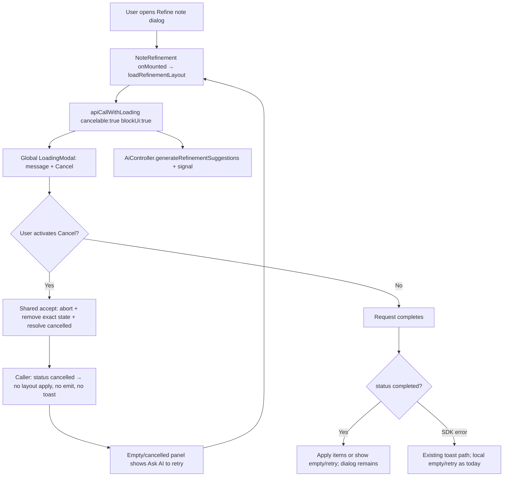

# Phase 2: Cancel Refinement Layout Generation - Research

**Researched:** 2026-07-21
**Domain:** Vue note-refinement caller adoption of the Phase 1 cancelable blocking contract
**Confidence:** HIGH

<user_constraints>
## User Constraints (inherited — Phase 2 CONTEXT.md absent; discuss skipped under `--auto`)

Do not invent new design preferences. Honor Phase 1 locked decisions, PROJECT.md, REQUIREMENTS.md, and ROADMAP Phase 2 success criteria.

### Locked Decisions (still binding)

From Phase 1 `01-CONTEXT.md` (caller-facing contract):

#### Cancellation outcome
- **D-01:** An opted-in call returns `{ status: "completed", result }` or `{ status: "cancelled" }`. Ordinary API failures continue through existing SDK-shaped error handling.
- **D-02:** The cancelled variant carries status only (no reason, AbortError, signal, or partial result).
- **D-03:** Callers must branch on `status` before accessing completed data.

#### Cancellation timing and cleanup
- **D-04:** Cancel aborts and removes exactly that operation's loading state; other loading states remain.
- **D-05:** Accepted cancellation wins over a nearly simultaneous completion; late results cannot revive success handling.
- **D-06:** Outer call resolves promptly with `{ status: "cancelled" }` without waiting for the server/request to settle.

#### Overlapping blockers
- **D-07–D-10:** Visible Cancel targets only the newest selected blocker; cancel is identity-bound and idempotent; hidden cancelability must not leak.

#### Cancellation feedback
- **D-11:** Silent — no toast, banner, or Cancelling/Cancelled interstitial.
- **D-12:** Callers own only domain-local post-cancel state (preserve inputs / expose retry). Shared layer accepts no caller-specific cancel messages.
- **D-13:** No console/telemetry for routine cancellation; typed outcome + tests are the diagnostic contract.

From PROJECT.md / REQUIREMENTS / ROADMAP Phase 2:

- Cancellation is client-side and opt-in; browser abort does not promise server work stopped.
- Only this phase's safe read-only AI layout generation opts in; do not cancel extract-preview (Phase 3) or extracted-note creation (Phase 4 / noncancelable).
- Success criteria: blocker + accessible Cancel while pending; cancel aborts only that request and clears only its loading state; no error toast / success handling / navigation / note-content change; refinement dialog stays open with a retry that starts a fresh request.

### Claude's Discretion (Phase 2 — no Phase 2 discuss)

- Exact empty/cancelled UI structure and retry control copy inside `NoteRefinement`, provided REFN-02 is met and Phase 1 Cancel modal contract is unchanged.
- Loading message string for the layout blocker (sibling messages already use `AI is …` phrasing).
- Test file decomposition and helpers under `frontend/tests/components/recall/`.
- Whether empty successful AI responses (zero items) also show the same retry affordance (recommended: yes, for a coherent empty dialog).

### Deferred Ideas (OUT OF SCOPE)

- **REFN-03 / REFN-04** — cancel extraction-preview generation (Phase 3).
- **REFN-05 / COHE-02** — noncancelable create-note boundary and full blocker audit (Phase 4).
- **SERV-01 / SERV-02** — cooperative server cancellation / mutation-safe cancel.
- Changing Cancel label, Escape/backdrop cancel, or redesigning `LoadingModal` / Overlay.
- Hand-editing or regenerating `@generated/doughnut-backend-api`.
- Expanding `runWithBlockingApiLoading` into a cancelable multi-request helper.
</user_constraints>

<phase_requirements>
## Phase Requirements

| ID | Description | Research Support |
|----|-------------|------------------|
| CANC-01 | Cancel control appears only when the active operation opts into cancellation | Opt `generateRefinementSuggestions` into `{ blockUi: true, cancelable: true }`; leave other refinement blockers unchanged. Global modal already projects Cancel only from the selected state's action. `[VERIFIED: clientSetup.ts + LoadingModal.vue + ROADMAP]` |
| CANC-02 | Cancel aborts that browser request and promptly removes its blocking state | Pass wrapper-owned `AbortSignal` into the generated call; shared latch already aborts + exact `finishLoading`. `[VERIFIED: Phase 1 implementation + MDN AbortController]` |
| CANC-03 | Cancellation is a normal outcome: no error toast, success handling, or navigation | Branch on `status === "cancelled"` before applying layout / emitting; do not treat cancel as error. Shared wrapper already suppresses toasts after accepted cancel. `[VERIFIED: clientSetup.ts + D-11]` |
| CANC-04 | Cancelling one blocker does not clear or abort other concurrent loading operations | Shared exact-id removal already proven in Phase 1; add one product-level concurrent assertion around layout cancel. `[VERIFIED: clientSetup.loading.spec.ts + D-04]` |
| REFN-01 | User sees global blocking spinner with Cancel while initial layout generates | Replace thin-bar-only `loadRefinementLayout` with cancelable `blockUi` call and a clear message. `[VERIFIED: NoteRefinement.vue current thin-bar call]` |
| REFN-02 | After cancel: dialog open, note content unchanged, retry available | Keep AssimilationSettings modal open; do not emit `contentUpdated` on cancel; add empty/cancelled retry UI because layout panel is currently `v-if` on items length. `[VERIFIED: NoteRefinement.vue + AssimilationSettings.vue]` |
</phase_requirements>

## Summary

Phase 1 already shipped the dormant shared contract: literal `{ blockUi: true, cancelable: true }` overload on `apiCallWithLoading`, operation-owned `AbortSignal`, identity-bound Cancel on `LoadingModal`, and silent `{ status: "cancelled" }` outcomes. `[VERIFIED: frontend/src/managedApi/clientSetup.ts, LoadingModal.vue, 01-*-SUMMARY.md]` No product caller opts in yet (`cancelable: true` appears only on the option type under `frontend/src`). `[VERIFIED: ripgrep 2026-07-21]`

Phase 2 is the first Behavior slice: adopt that contract solely for initial AI refinement-layout generation in `NoteRefinement.vue`. Today `loadRefinementLayout` uses thin-bar-only `apiCallWithLoading` without `blockUi` or `signal`, and the layout UI is gated on `refinementLayoutItems.length > 0`, so a cancelled empty result would leave the Refine-note dialog open but with no retry control. `[VERIFIED: NoteRefinement.vue, AssimilationSettings.vue]` The vertical MVP is therefore: cancelable blocking call + status narrowing + empty/cancelled retry surface + focused Vitest coverage through the existing `GlobalApiLoadingModal` harness.

**Primary recommendation:** Change only `loadRefinementLayout` (and the minimal empty/retry template it needs) to the Phase 1 cancelable overload; mirror the existing extraction-preview "Ask AI to retry" pattern for the cancelled/empty state; leave extract-preview and create-note paths untouched.

## Architectural Responsibility Map

| Capability | Primary Tier | Secondary Tier | Rationale |
|------------|-------------|----------------|-----------|
| Opt-in cancelable layout request | Browser / Client (`NoteRefinement.vue`) | Shared `managedApi` | Caller opts into contract and owns post-cancel retry; shared layer owns abort/cleanup/outcome. `[VERIFIED: D-12 + COHE-01]` |
| AbortSignal → generated fetch | Browser / Client (`managedApi` + Hey API client) | — | Signal already forwarded via `RequestInit`; no SDK regen. `[VERIFIED: Phase 1 research + sdk.gen.ts]` |
| Global Cancel UI | Browser / Client (`LoadingModal` / `DoughnutApp`) | — | Already implemented; Phase 2 must not redesign it. `[VERIFIED: 01-02-SUMMARY]` |
| Refine-note dialog shell | Browser / Client (`AssimilationSettings.vue`) | — | Modal open/close is parent-owned; cancel must not close it. `[VERIFIED: AssimilationSettings.vue]` |
| Note content mutation | — (must not happen on cancel) | API / Backend on success paths only | Layout generation is read-only; cancel must not emit `contentUpdated`. `[VERIFIED: NoteRefinement.vue emit usage]` |
| Server AI job stop | API / Backend (deferred) | — | Out of scope for this milestone slice. `[VERIFIED: PROJECT.md]` |

## Project Constraints (from .cursor/rules/)

- Run tooling with `CURSOR_DEV=true nix develop -c …`; Git without Nix. Assume `pnpm sut` running. `[VERIFIED: AGENTS.md / agent-map.md]`
- Behavior phase: one observable behavior (cancel initial layout generation); stop-safe; no speculative prep for Phase 3+. `[VERIFIED: planning.mdc]`
- Use global blocker; no component-local `LoadingModal`. Prefer `apiCallWithLoading` + generated SDK; never hand-edit generated API. `[VERIFIED: frontend-api.mdc]`
- Vue 3 + DaisyUI (`daisy-*`); Vitest browser mode; avoid role queries; use `data-test-id` / text / label queries; `mockSdkService` / `mockSdkServiceWithImplementation`. `[VERIFIED: frontend-component.mdc, frontend-testing.mdc]`
- Targeted frontend tests for touched behavior; full E2E only if explicitly required. Phase wrap-up: Jidoka → post-change-refactor → plan update → commit → push. `[VERIFIED: planning.mdc, gsd-coexistence.mdc]`
- `NoteRefinement.vue` is already ~437 lines (over the 250-line refactor preference). Prefer a minimal Behavior change; if post-change-refactor splits, extract only layout-load/retry cohesion—do not wire Phase 3 cancel. `[VERIFIED: wc -l + post-change-refactor skill]`

## Standard Stack

### Core

| Library / API | Version | Purpose | Why Standard Here |
|---------------|---------|---------|-------------------|
| Phase 1 `apiCallWithLoading` cancelable overload | in-repo | Abort, cleanup, cancelled outcome | Already the COHE-01 contract; do not add a parallel path. `[VERIFIED: clientSetup.ts]` |
| `AiController.generateRefinementSuggestions` | generated SDK | Initial layout AI request | Existing call site; accepts `Options` including `signal`. `[VERIFIED: sdk.gen.ts]` |
| Browser `AbortSignal` | Web platform | Request abortion | Native; forwarded by generated client. `[CITED: MDN AbortController.abort]` |
| Vue 3 + DaisyUI | pinned in `frontend/package.json` | Dialog + retry button UI | Existing Refine-note modal and button patterns. `[VERIFIED: AssimilationSettings.vue, NoteRefinement.vue]` |

### Supporting

| Library | Version | Purpose | When to Use |
|---------|---------|---------|-------------|
| Vitest browser mode | pinned | Component/integration proof | Layout cancel + retry + concurrent loading |
| `mockSdkServiceWithImplementation` + `createDeferredGate` | in-repo test helpers | Hold the layout request pending while asserting Cancel | Same pattern as extract/remove loading specs |
| `GlobalApiLoadingModal` test helper | in-repo | Mirror production selected-state Cancel plumbing | Already composed in `noteRefinementTestSupport.ts` |

### Alternatives Considered

| Instead of | Could Use | Tradeoff |
|------------|-----------|----------|
| Shared cancelable `apiCallWithLoading` | Local AbortController + local modal | Violates COHE-01 and frontend-api global-blocker rule; rejected. |
| Closing the Refine dialog on cancel | Keep dialog + retry | Violates REFN-02; rejected. |
| Canceling via `runWithBlockingApiLoading` | Direct cancelable `apiCallWithLoading` | Composite helper is noncancelable and multi-call; wrong for single layout request. `[VERIFIED: clientSetup.ts]` |

**Installation:** None. No new packages. `[VERIFIED: phase scope]`

## Package Legitimacy Audit

Not applicable — Phase 2 installs no external packages. Use the already-pinned frontend stack and the Phase 1 contract.

**Packages removed due to [SLOP] verdict:** none  
**Packages flagged as suspicious [SUS]:** none

## Architecture Patterns

### System Architecture Diagram



### Recommended Project Structure

```text
frontend/src/components/recall/
├── NoteRefinement.vue              # ONLY product opt-in: layout load + empty/retry
└── AssimilationSettings.vue        # Dialog shell — leave open/close ownership as-is
frontend/src/managedApi/            # Do not change contract unless a proven bug appears
frontend/tests/components/recall/
├── noteRefinementTestSupport.ts    # Add pending-layout mount / cancel / retry helpers
└── NoteRefinement.layoutGeneration.cancel.spec.ts  # New capability-named behavior specs
```

### Pattern 1: Cancelable layout load with status narrowing

**What:** Single opt-in call; return early on cancelled; only then unwrap SDK fields.

**When to use:** Initial layout generation and its retry path (same function).

```typescript
// Source: Phase 1 contract + generated SDK Options.signal support
const outcome = await apiCallWithLoading(
  (signal) =>
    AiController.generateRefinementSuggestions({
      path: { note: props.note.id },
      signal,
    }),
  {
    blockUi: true,
    message: "AI is generating layout...",
    cancelable: true,
  }
)

if (outcome.status === "cancelled") {
  // Domain post-cancel: keep dialog; leave items empty; ensure retry visible
  return
}

const { data, error } = outcome.result
refinementLayoutItems.value =
  !error && data?.items ? data.items : []
```

### Pattern 2: Empty / cancelled retry surface inside NoteRefinement

**What:** When there are no layout items after an attempt (cancel or empty/error completion), render a compact panel with a retry control that re-invokes `loadRefinementLayout`. Do not close `AssimilationSettings`' dialog.

**When to use:** Required for REFN-02 because the current template hides all refinement UI when `items.length === 0`.

**Recommended copy/control:** Reuse extraction-preview wording `Ask AI to retry` with a distinct `data-test-id` such as `retry-refinement-layout` so tests do not collide with `retry-extraction-preview`. `[VERIFIED: existing extract retry control in NoteRefinement.vue]`

### Pattern 3: Pending-request Vitest gate

**What:** Use `mockSdkServiceWithImplementation` + `createDeferredGate` so mount leaves the request pending; assert modal message + Cancel; click Cancel via `getByText("Cancel")`; assert mask gone, no layout panel items, retry visible, then resolve late mock safely.

**When to use:** All Phase 2 cancel timing tests (same as extract/remove loading specs).

### Anti-Patterns to Avoid

- **Destructuring `{ data, error }` directly from a cancelable call:** TypeScript and runtime both require `status` narrowing first. `[VERIFIED: D-03]`
- **Opting extract-preview / create-note into cancelable now:** Phase 3/4 boundaries; create-note must stay noncancelable. `[VERIFIED: ROADMAP]`
- **Closing the Refine dialog or navigating on cancel:** Violates REFN-02 / CANC-03.
- **Adding a second AbortController or toast-suppression in the caller:** Shared layer already owns these. `[VERIFIED: COHE-01]`
- **Classifying cancel by `AbortError` name in the caller:** Shared latch is authoritative; generated client may surface abort as SDK `error` if not latched. `[VERIFIED: Phase 1 research]`
- **Speculative empty-state redesign beyond retry:** Keep DaisyUI button styling consistent with existing refinement actions.

## Don't Hand-Roll

| Problem | Don't Build | Use Instead | Why |
|---------|-------------|-------------|-----|
| Request abort | Caller-owned controller map | Signal from cancelable `apiCallWithLoading` | Phase 1 already owns lifecycle and races. |
| Cancel button UI | Local modal / custom Cancel | Global `LoadingModal` Cancel | frontend-api + Phase 1 UI-SPEC. |
| Silent cancel | Caller toast filters | Shared accepted-cancellation latch | D-11 already enforced centrally. |
| Retry after cancel | Remount whole AssimilationSettings | In-component retry calling `loadRefinementLayout` | Dialog already open; remount would lose parent state unnecessarily. |

**Key insight:** Shared mechanics are done; Phase 2 risk is almost entirely the caller's empty-state/retry gap and correct status branching—not re-implementing abort.

## Common Pitfalls

### Pitfall 1: Cancel leaves a blank dialog with only Close

**What goes wrong:** Cancel clears the blocker but `v-if="refinementLayoutItems.length > 0"` hides all content; user has no retry.

**Why it happens:** Current empty UI is invisible by design.

**How to avoid:** Explicit cancelled/empty retry panel with an automated assertion that the retry control exists after Cancel.

**Warning signs:** Specs only assert `loadingModalMask()` is null.

### Pitfall 2: Treating cancelled as error or success

**What goes wrong:** Toast appears, layout cleared incorrectly after late success, or `contentUpdated` fires.

**Why it happens:** Caller forgets to narrow `status` or reuses the old try/catch that logs and clears.

**How to avoid:** Early `if (outcome.status === "cancelled") return` before any layout mutation; keep `contentUpdated` off this path.

**Warning signs:** `contentUpdated` spy called; toast mock called; late `resolve()` after cancel populates layout.

### Pitfall 3: Mount helpers always flush the layout request to completion

**What goes wrong:** Tests using `mountNoteRefinementReady` never observe Cancel because flush awaits the mock.

**Why it happens:** Ready helpers `await flushPromises()` after mount.

**How to avoid:** Add a pending-mount helper that installs a deferred gate **before** mount and does not flush until after Cancel assertions.

**Warning signs:** Cancel button never appears in the test.

### Pitfall 4: Accidental Phase 3/4 scope creep

**What goes wrong:** Same PR also makes extract-preview cancelable or changes create-note.

**Why it happens:** Adjacent `runWithBlockingApiLoading` call sites look similar.

**How to avoid:** Touch only `loadRefinementLayout` (+ empty/retry UI). Leave preview/create/remove loading messages and options unchanged.

**Warning signs:** Diff includes `extractNotePreview` / `createExtractedNote` option changes.

### Pitfall 5: Concurrent cleanup regressions

**What goes wrong:** Canceling layout clears an unrelated blocker started in the same session.

**Why it happens:** Caller or test clears all `apiStatus.states`.

**How to avoid:** Rely on shared exact-id removal; add one test that starts an older noncancelable/cancelable blocker alongside pending layout and asserts it survives.

**Warning signs:** Second message disappears when Cancel is clicked.

## Code Examples

### Product adoption (layout only)

```typescript
// Source: Phase 1 CancelableApiResult contract + NoteRefinement loadRefinementLayout
const loadRefinementLayout = async () => {
  const outcome = await apiCallWithLoading(
    (signal) =>
      AiController.generateRefinementSuggestions({
        path: { note: props.note.id },
        signal,
      }),
    {
      blockUi: true,
      message: "AI is generating layout...",
      cancelable: true,
    }
  )

  if (outcome.status === "cancelled") {
    refinementLayoutItems.value = []
    clearSelection()
    resetExtractionPreview()
    // ensure retry UI visible (empty-state branch)
    return
  }

  const { data, error } = outcome.result
  refinementLayoutItems.value =
    !error && data?.items ? data.items : []
  clearSelection()
  resetExtractionPreview()
}
```

### Focused cancel test shape

```typescript
// Source: noteRefinementTestSupport createDeferredGate + LoadingModal.spec Cancel click
const { gate, resolve } = createDeferredGate()
mockSdkServiceWithImplementation(
  AiController,
  "generateRefinementSuggestions",
  async () => {
    await gate
    return { items: refinementLayoutItems(["Should not appear"]) }
  }
)

const wrapper = renderer.withCleanStorage().withProps({ note }).mount()
await nextTick()

expect(loadingModalMask()).toBeTruthy()
expect(document.body.textContent).toContain("AI is generating layout...")
document.body.ownerDocument!.defaultView // ensure browser context
const { getByText } = // use Testing Library on document / helper
getByText("Cancel").click()
await flushPromises()

expect(loadingModalMask()).toBeNull()
expect(wrapper.find('[data-test-id="retry-refinement-layout"]').exists()).toBe(true)
expect(wrapper.find('[data-test-id="refinement-layout"]').exists()).toBe(false)
resolve() // late settlement must not populate layout
await flushPromises()
expect(wrapper.find('[data-test-id="refinement-layout"]').exists()).toBe(false)
```

## State of the Art

| Old Approach | Current Approach | When Changed | Impact |
|--------------|------------------|--------------|--------|
| Thin loading bar for layout generation | Global blocking spinner + opt-in Cancel | Phase 2 (this phase) | Matches preview/create visibility and enables REFN-01 |
| Dormant cancel contract | First product opt-in at layout generation | After Phase 1 (2026-07-21) | Proves COHE-01 end-to-end without unsafe mutations |
| Invisible empty layout UI | Explicit retry after cancel/empty | Phase 2 | Satisfies REFN-02 |

**Deprecated/outdated for this phase:** Thin-bar-only wait for initial layout generation; relying on dialog Close as the only recovery after cancel.

## Assumptions Log

| # | Claim | Section | Risk if Wrong |
|---|-------|---------|---------------|
| A1 | Retry control copy should reuse `Ask AI to retry` for cohesion with extract preview | Pattern 2 / Discretion | User may prefer different wording; easy copy change, low risk |
| A2 | Empty successful AI layouts (zero items) should share the same retry panel as cancel | Discretion | Slight UX expansion beyond strict cancel; still stop-safe and valuable |
| A3 | No Cypress E2E is required for Phase 2 if Vitest browser coverage is thorough | Validation Architecture | If UAT demands browser E2E later, add a single targeted feature then |

## Open Questions (RESOLVED)

1. **Should Phase 2 also update `.cursor/rules/frontend-api.mdc` to document `cancelable: true`?**
   - **RESOLVED** — Phase 2 Plan 03 Task 2 updates `.cursor/rules/frontend-api.mdc` with cancelable overload / status narrowing / silent cancel / identity-bound / client-only abort docs.

2. **UI-SPEC for empty/retry?**
   - **RESOLVED** — `02-UI-SPEC.md` already produced under `--auto`; empty/cancelled retry panel locked.

## Environment Availability

| Dependency | Required By | Available | Version | Fallback |
|------------|-------------|-----------|---------|----------|
| Nix | Tooling wrapper | ✓ | 2.30.2 | — |
| Node.js (Nix shell) | Frontend tests/build | ✓ | 26.4.0 | — |
| pnpm (Nix shell) | Workspace scripts | ✓ | 11.15.1 | — |
| Playwright Chromium (frontend pretest) | Vitest browser mode | ✓ (assumed via prior Phase 1 runs) | — | `frontend` pretest installs if missing |
| Running `pnpm sut` | Manual/UAT only | Assumed per agent-map | — | Not required for Vitest unit/browser specs |

**Missing dependencies with no fallback:** None for automated Phase 2 verification.

**Missing dependencies with fallback:** None.

## Validation Architecture

### Test Framework

| Property | Value |
|----------|-------|
| Framework | Vitest (browser mode / Playwright Chromium) `[VERIFIED: frontend/vitest.config.ts]` |
| Config file | `frontend/vitest.config.ts` |
| Quick run command | `CURSOR_DEV=true nix develop -c pnpm frontend:test tests/components/recall/NoteRefinement.layoutGeneration.cancel.spec.ts` |
| Full suite command | `CURSOR_DEV=true nix develop -c pnpm frontend:verify` |
| Shared regression (optional smoke) | `CURSOR_DEV=true nix develop -c pnpm frontend:test tests/managedApi/clientSetup.loading.spec.ts tests/components/commons/LoadingModal.spec.ts` |

### Phase Requirements → Test Map

| Req ID | Behavior | Test Type | Automated Command | File Exists? |
|--------|----------|-----------|-------------------|-------------|
| REFN-01 | Pending layout shows blocking modal message + Cancel | Browser component | quick run above | ❌ Wave 0 new spec |
| CANC-01 | Cancel visible only because layout call opts in (message/Cancel present; other refinement ops unchanged) | Browser component | quick run + existing extract/remove loading specs | ❌ new + ✅ existing |
| CANC-02 | Cancel removes layout blocker promptly; request signal aborted / call does not apply late data | Browser component | quick run | ❌ Wave 0 |
| CANC-03 | No error toast / no `contentUpdated` / no navigation; silent cancel | Browser component (+ toast mock if needed) | quick run | ❌ Wave 0 |
| CANC-04 | Concurrent older blocker survives layout cancel | Browser component / integration | quick run | ❌ Wave 0 |
| REFN-02 | After cancel: retry control available; retry starts a fresh `generateRefinementSuggestions`; dialog content path remains | Browser component | quick run | ❌ Wave 0 |

### Sampling Rate

- **Per task commit:** Focused cancel spec (+ any touched support helpers).
- **Per wave merge:** Focused cancel spec + existing NoteRefinement loading specs that prove preview/create/remove were not accidentally made cancelable.
- **Phase gate:** `frontend:verify` green; format/lint as required by wrap-up; no full Cypress suite unless explicitly requested.

### Wave 0 Gaps

- [ ] Create `frontend/tests/components/recall/NoteRefinement.layoutGeneration.cancel.spec.ts` covering REFN-01/02 and CANC-01–04 product outcomes.
- [ ] Extend `noteRefinementTestSupport.ts` with pending-layout mount, Cancel click, and retry-layout helpers (`createDeferredGate` / `loadingModalMask` already exist).
- [ ] Optionally mock `vue-toastification` in the cancel spec to assert CANC-03 silence at the product seam (Phase 1 already covers wrapper silence).
- [ ] Framework install: none — existing Vitest browser stack is sufficient.

*(Shared Phase 1 contract tests already exist and should remain green; do not re-implement shared race coverage in NoteRefinement.)*

## Security Domain

### Applicable ASVS Categories

| ASVS Category | Applies | Standard Control |
|---------------|---------|-----------------|
| V2 Authentication | No new surface | Existing credentialed client unchanged |
| V3 Session Management | No new surface | Abort does not alter session/cookies |
| V4 Access Control | No new surface | Same authorized AI endpoint; cancel does not escalate privilege |
| V5 Input Validation | Limited | Cancel targets identity-bound loading state only; retry reuses same note id from props |
| V6 Cryptography | No | None introduced |

### Known Threat Patterns for this Vue/Fetch adoption

| Pattern | STRIDE | Standard Mitigation |
|---------|--------|---------------------|
| UI implies server AI stopped | Integrity ambiguity | Keep Cancel copy fixed; document client-only abort (PROJECT constraint) |
| Late response applies layout after cancel | Tampering (client state) | Status latch + caller early return; assert late resolve does not populate items |
| Stale Cancel aborts a different operation | Denial of Service | Phase 1 identity-bound action; do not re-resolve current blocker in caller |
| Accidental cancelable mutation | Tampering | Do not opt create-note / remove into cancelable in this phase |

## Sources

### Primary (HIGH confidence)

- `frontend/src/components/recall/NoteRefinement.vue` — current thin-bar layout load; empty `v-if`; extract retry pattern; emit boundaries
- `frontend/src/components/recall/AssimilationSettings.vue` — Refine-note dialog ownership
- `frontend/src/managedApi/clientSetup.ts`, `ApiStatusHandler.ts`, `LoadingModal.vue` — Phase 1 contract
- `frontend/tests/components/recall/noteRefinementTestSupport.ts`, `NoteRefinement.extractNote.spec.ts`, `NoteRefinement.removeLayout.loading.spec.ts` — pending-gate and LoadingModal assertion patterns
- `.planning/PROJECT.md`, `REQUIREMENTS.md`, `ROADMAP.md`, Phase 1 CONTEXT/RESEARCH/SUMMARYs/UI-SPEC
- `packages/generated/doughnut-backend-api/sdk.gen.ts` — `generateRefinementSuggestions` options/`signal` path

### Secondary (MEDIUM confidence)

- [MDN AbortController.abort](https://developer.mozilla.org/en-US/docs/Web/API/AbortController/abort) — abort semantics; baseline availability
- Context7 `/mdn/content` AbortSignal/fetch abort examples — confirms pass-`signal`-to-fetch pattern (already used by Phase 1)

### Tertiary (LOW confidence)

- None material to planning

## Metadata

**Confidence breakdown:**
- Standard stack: HIGH — reuse Phase 1 contract and pinned frontend stack; no new packages
- Architecture: HIGH — exact call site, dialog shell, and empty-state gap verified in source
- Pitfalls: HIGH — derived from current `v-if` empty UI, Ready-mount flush helpers, and Phase 1 race lessons

**Research date:** 2026-07-21  
**Valid until:** 2026-08-20 (30 days; codebase-specific adoption on a stable contract)
