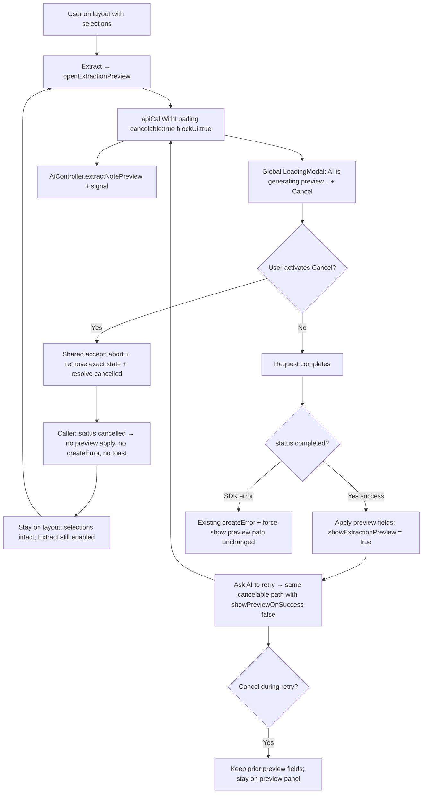

# Phase 3: Cancel Extraction Preview Generation - Research

**Researched:** 2026-07-21
**Domain:** Vue note-refinement caller adoption of cancelable blocking for AI extraction-preview generation
**Confidence:** HIGH

<user_constraints>
## User Constraints (from CONTEXT.md)

### Locked Decisions

#### Post-cancel landing surface
- **D-01:** Cancelling preview generation started from the layout **Extract** action never opens or shows the extraction-preview panel. The user remains on the layout selection view.
- **D-02:** All selected refinement-layout checkboxes / `selectedItemIds` stay unchanged. Do not clear selection, reload layout, emit `contentUpdated`, or mutate note content on cancel.
- **D-03:** Cancellation remains silent (Phase 1 D-11): no error toast, no `createError` banner, no success handling, no navigation, no Cancelling/Cancelled interstitial.

#### Retry affordance from preserved selection
- **D-04:** After cancel from Extract-from-layout, retry is the existing **Extract** button (still enabled because selection is preserved). Do not add a layout-panel empty-state or dedicated "Ask AI to retry" control for this path (unlike Phase 2 layout cancel, where items were empty).
- **D-05:** A cancelled outcome must not apply preview payload fields. Late/partial responses must not revive success handling (Phase 1 D-05).

#### Cancel during in-preview regenerate
- **D-06:** If the user cancels while regenerating via **Ask AI to retry** on an already-visible preview, remain on the extraction-preview panel with the **prior** preview content unchanged. Do not wipe fields, set `createError`, force Back to layout, or apply the cancelled response.
- **D-07:** Existing unsaved-edit confirm before retry stays as today; cancel does not add a new confirmation.

#### Blocker message and Cancel adoption
- **D-08:** Keep the existing blocker message `AI is generating preview...`. Do not rename it for symmetry with layout unless a later UI pass requires it.
- **D-09:** Adopt Phase 1 Cancel visuals and interaction unchanged (same adoption stance as Phase 2): accessible Cancel on the global blocker only; no Escape/backdrop cancel; no Cancel redesign.
- **D-10:** Opt in with the shared literal `{ blockUi: true, cancelable: true }` overload on the preview request path. Do not invent a cancelable `runWithBlockingApiLoading`. Leave create-note and other non-preview refinement blockers noncancelable in this phase.

#### Carried forward (do not re-open)
- Phase 1 D-01–D-13 remain binding for outcome shape, cleanup, overlapping blockers, and silent feedback.
- Phase 2 proved caller adoption for layout; Phase 3 reuses that pattern for preview only.
- Client-only abort; no server-cooperative stop claim.

### Claude's Discretion
- Exact refactor of `fetchExtractionPreview` / `runExtractionPreview` / `runWithBlockingApiLoading` into a single cancelable `apiCallWithLoading` call, provided D-01–D-10 and `.cursor/rules/frontend-api.mdc` hold.
- Test file placement and helpers under `frontend/tests/components/recall/`, mirroring Phase 2 cancel specs.
- Whether preview API-error paths that today force-show the preview panel stay unchanged (out of Phase 3 cancel scope) as long as cancel never uses that path.

### Deferred Ideas (OUT OF SCOPE)
- Cancel final extracted-note creation / keep it noncancelable — Phase 4 (`REFN-05`).
- Full blocker classification audit — Phase 4 (`COHE-02`).
- Server-cooperative AI cancellation — `SERV-01` / v2.
- Redesigning Cancel visuals, Escape/backdrop cancel, or spinner chrome.
</user_constraints>

<phase_requirements>
## Phase Requirements

| ID | Description | Research Support |
|----|-------------|------------------|
| REFN-03 | User sees the same global blocking spinner with Cancel while AI generates an extraction preview | Migrate preview path from noncancelable `runWithBlockingApiLoading` to `{ blockUi: true, cancelable: true, message: "AI is generating preview..." }` on `apiCallWithLoading`; global modal already projects Cancel from selected state. `[VERIFIED: NoteRefinement.vue + clientSetup.ts + LoadingModal Phase 1]` |
| REFN-04 | User who cancels extraction-preview generation keeps current layout selections, remains before the preview, and can retry | On `status === "cancelled"`: early return without opening preview (Extract path) or wiping prior preview (retry path); do not clear `selectedItemIds`; retry via existing Extract / Ask AI to retry. Assert late resolve does not apply payload. `[VERIFIED: 03-CONTEXT D-01–D-06 + Phase 1 latch]` |
</phase_requirements>

## Summary

Phase 1 shipped the dormant cancelable `apiCallWithLoading` overload; Phase 2 adopted it for initial layout generation. Extraction-preview generation still uses a **composite** noncancelable path: `runWithBlockingApiLoading(..., "AI is generating preview...")` wrapping an inner thin-bar `apiCallWithLoading` that calls `AiController.extractNotePreview` **without** `signal`. `[VERIFIED: NoteRefinement.vue lines 334–388]`

Phase 3 is the second Behavior adoption: opt only the preview request into the cancelable single-call overload (D-10 / frontend-api.mdc forbid a cancelable `runWithBlockingApiLoading`). Post-cancel domain state differs from Phase 2: selections stay, so **no new empty-state panel** is needed—retry is the existing Extract button (or Ask AI to retry when already in preview). `[VERIFIED: 03-CONTEXT D-01–D-06]`

**Primary recommendation:** Collapse `fetchExtractionPreview` + outer `runWithBlockingApiLoading` into one cancelable `apiCallWithLoading` with status narrowing; keep create-note / remove / layout paths untouched; prove with a focused Vitest cancel suite mirroring `NoteRefinement.layoutGeneration.cancel.spec.ts`.

## Architectural Responsibility Map

| Capability | Primary Tier | Secondary Tier | Rationale |
|------------|-------------|----------------|-----------|
| Opt-in cancelable preview request | Browser / Client (`NoteRefinement.vue`) | Shared `managedApi` | Caller opts in and owns post-cancel landing/retry; shared layer owns abort/cleanup/outcome. `[VERIFIED: D-12 + COHE-01]` |
| AbortSignal → generated fetch | Browser / Client (`managedApi` + Hey API client) | — | `Options` extends `RequestInit`; pass `signal` like layout. `[VERIFIED: sdk.gen.ts Options + layout call site]` |
| Global Cancel UI | Browser / Client (`LoadingModal` / `DoughnutApp`) | — | Already implemented; Phase 3 adopts only. `[VERIFIED: 01-UI-SPEC + D-09]` |
| Layout selection persistence | Browser / Client (`useRefinementLayoutSelection`) | — | Cancel must not call `clearSelection` / reload layout. `[VERIFIED: D-02]` |
| Preview panel visibility | Browser / Client (`showExtractionPreview`) | — | Extract-cancel never opens; retry-cancel keeps prior panel. `[VERIFIED: D-01, D-06]` |
| Create-note mutation blocker | Browser / Client (noncancelable) | API / Backend | Phase 4 / REFN-05; leave noncancelable. `[VERIFIED: ROADMAP + D-10]` |
| Server AI job stop | API / Backend (deferred) | — | Out of milestone scope. `[VERIFIED: PROJECT.md SERV-01]` |

## Project Constraints (from .cursor/rules/)

- Run tooling with `CURSOR_DEV=true nix develop -c …`; Git without Nix. Assume `pnpm sut` running. `[VERIFIED: AGENTS.md]`
- Behavior phase: **one** observable behavior (cancel extraction-preview generation); stop-safe; no speculative Phase 4 create-note cancel. `[VERIFIED: planning.mdc]`
- Prefer `apiCallWithLoading` + generated SDK; never hand-edit generated API; global blocker only; **forbid** cancelable mutations and cancelable `runWithBlockingApiLoading`. `[VERIFIED: frontend-api.mdc]`
- Vue 3 + DaisyUI (`daisy-*`); Vitest browser mode; avoid role queries; use `data-test-id` / text / label; `mockSdkService` / `mockSdkServiceWithImplementation`. `[VERIFIED: frontend-component.mdc, frontend-testing.mdc]`
- Targeted frontend tests for touched behavior; full E2E only if explicitly required. Phase wrap-up: Jidoka → post-change-refactor → plan update → commit → push. `[VERIFIED: planning.mdc, gsd-coexistence.mdc]`
- `NoteRefinement.vue` is ~465 lines (over 250-line refactor preference). Prefer a minimal Behavior change; if post-change-refactor extracts helpers, keep Phase 4 create-note noncancelable. `[VERIFIED: wc -l + post-change-refactor skill]`

## Standard Stack

### Core

| Library / API | Version | Purpose | Why Standard Here |
|---------------|---------|---------|-------------------|
| Phase 1 `apiCallWithLoading` cancelable overload | in-repo | Abort, cleanup, cancelled outcome | COHE-01 contract already proven by Phase 2 layout. `[VERIFIED: clientSetup.ts]` |
| `AiController.extractNotePreview` | generated SDK | Preview AI request | Existing call site; accepts `Options` including `signal` via `RequestInit`. `[VERIFIED: sdk.gen.ts]` |
| Browser `AbortSignal` | Web platform | Request abortion | Native; MDN abort semantics; wrapper owns controller. `[CITED: developer.mozilla.org/en-US/docs/Web/API/AbortController]` |
| Vue 3.5.40 + DaisyUI | pinned in `frontend/package.json` | Layout / preview UI | Existing Extract + Ask AI to retry controls. `[VERIFIED: package.json + NoteRefinement.vue]` |

### Supporting

| Library | Version | Purpose | When to Use |
|---------|---------|---------|-------------|
| Vitest 4.1.10 (browser / Playwright) | pinned | Component proof | Preview cancel + selection + late-apply |
| `@testing-library/vue` ^8.1.0 | pinned | `getByText("Cancel")` | Same as Phase 2 cancel specs |
| `createDeferredGate` / `loadingModalMask` / `clickLoadingModalCancel` | in-repo | Hold preview pending | Reuse from `noteRefinementLayoutLoadingTestSupport.ts` |
| Extraction helpers (`openExtractionPreview`, `expectPreviewFields`, …) | in-repo | Preview panel assertions | Extend with pending-preview mount helper |

### Alternatives Considered

| Instead of | Could Use | Tradeoff |
|------------|-----------|----------|
| Cancelable single `apiCallWithLoading` | Cancelable `runWithBlockingApiLoading` | Forbidden by frontend-api.mdc / D-10; rejected. |
| New empty-state / "Ask AI to retry" on layout after cancel | Existing Extract button | Selections preserved; empty panel would be wrong UX (D-04). |
| Local AbortController + local modal | Shared contract | Violates COHE-01; rejected. |
| Closing dialog or wiping selection on cancel | Keep dialog + selection | Violates REFN-04 / D-01–D-02. |

**Installation:** None. No new packages. `[VERIFIED: phase scope]`

**Version verification:** Stack versions read from `frontend/package.json` and in-repo managedApi; no npm installs required for this phase.

## Package Legitimacy Audit

Not applicable — Phase 3 installs no external packages. Use the already-pinned frontend stack and the Phase 1/2 contract.

**Packages removed due to [SLOP] verdict:** none  
**Packages flagged as suspicious [SUS]:** none

## Architecture Patterns

### System Architecture Diagram



### Recommended Project Structure

```text
frontend/src/components/recall/
├── NoteRefinement.vue                 # ONLY product change: preview cancelable call + status branch
└── AssimilationSettings.vue           # Dialog shell — leave open/close as-is
frontend/src/managedApi/               # Do not change contract unless proven bug
frontend/tests/components/recall/
├── noteRefinementExtractionTestSupport.ts   # Add pending-preview mount helpers
├── noteRefinementLayoutLoadingTestSupport.ts # Reuse createDeferredGate / Cancel click
└── NoteRefinement.extractionPreview.cancel.spec.ts  # New capability-named cancel specs
```

### Pattern 1: Cancelable preview load with status narrowing

**What:** Single opt-in call; return early on cancelled; only then unwrap SDK fields and mutate preview state.

**When to use:** Both Extract-from-layout and Ask-AI-to-retry (same function, different `showPreviewOnSuccess`).

```typescript
// Source: Phase 1 CancelableApiResult + frontend-api.mdc + layout adoption pattern
const runExtractionPreview = async (showPreviewOnSuccess: boolean) => {
  createError.value = ""

  const outcome = await apiCallWithLoading(
    (signal) =>
      AiController.extractNotePreview({
        path: { note: props.note.id },
        body: layoutSelectionBody(),
        signal,
      }),
    {
      blockUi: true,
      message: "AI is generating preview...",
      cancelable: true,
    }
  )

  if (outcome.status === "cancelled") {
    // D-01–D-03 / D-05–D-06: no apply, no createError, no showPreview toggle
    return
  }

  const { data, error } = outcome.result
  if (error || !data) {
    const openApiError = toOpenApiError(error)
    createError.value =
      openApiError.message ?? "Failed to generate extract preview"
    showExtractionPreview.value = true // existing error path — out of cancel scope
    return
  }

  extractionPreview.value = { ...data }
  lastAiExtractionResult.value = { ...data }
  createError.value = ""
  if (showPreviewOnSuccess) {
    showExtractionPreview.value = true
  }
}
```

**Recommended refactor (discretion):** Inline today's `fetchExtractionPreview` into `runExtractionPreview` so there is only one loading entry point. Keep `openExtractionPreview` / `retryExtractionPreview` as thin wrappers (retry keeps unsaved-edit confirm — D-07).

### Pattern 2: Pending-preview Vitest gate (mirror Phase 2)

**What:** Mount with layout ready + selection; install deferred `extractNotePreview` **before** clicking Extract; assert modal + Cancel; cancel; assert layout still visible with same selection; late `resolve()` must not open preview.

**When to use:** All Phase 3 cancel timing tests.

### Pattern 3: In-preview regenerate cancel

**What:** Complete first preview, start retry with deferred second call, Cancel, assert prior field values remain and `extraction-preview` stays visible.

**When to use:** REFN-04 / D-06 coverage distinct from Extract-from-layout cancel.

### Anti-Patterns to Avoid

- **Wrapping cancelable call inside `runWithBlockingApiLoading`:** Nested blockers + forbidden cancelable composite. Use single cancelable overload only. `[VERIFIED: frontend-api.mdc + D-10]`
- **Destructuring `{ data, error }` from cancelable call without `status` narrow:** Violates Phase 1 D-03.
- **Treating cancel like API failure:** Error path today sets `showExtractionPreview = true` and `createError` — cancel must early-return before that. `[VERIFIED: NoteRefinement.vue else branch]`
- **Clearing selection / calling `resetExtractionPreview` / emitting `contentUpdated` on cancel:** Violates D-02.
- **Adding layout empty-state after preview cancel:** Wrong for preserved selection (D-04); Phase 2 empty panel is for empty layout only.
- **Opting `createExtractedNote` into cancelable:** Phase 4 / REFN-05.
- **Caller AbortError-name matching or toast filters:** Shared latch already owns silence. `[VERIFIED: COHE-01]`

## Don't Hand-Roll

| Problem | Don't Build | Use Instead | Why |
|---------|-------------|-------------|-----|
| Request abort | Caller-owned AbortController map | Signal from cancelable `apiCallWithLoading` | Phase 1 owns lifecycle and races. |
| Cancel button UI | Local modal / custom Cancel | Global `LoadingModal` Cancel | frontend-api + Phase 1 UI-SPEC. |
| Silent cancel | Caller toast / createError filters | Shared accepted-cancellation latch | D-11 / D-03. |
| Retry after Extract cancel | New empty-state panel | Existing Extract button | Selection preserved (D-04). |
| Cancelable multi-call composite | Custom cancelable `runWithBlockingApiLoading` | Single cancelable `apiCallWithLoading` | Rule forbids inventing cancelable composite. |

**Key insight:** Shared mechanics and Cancel chrome are done. Phase 3 risk is correctly **not** sharing the API-error force-show-preview path, preserving selection/prior preview, and collapsing the composite blocker into the cancelable overload.

## Common Pitfalls

### Pitfall 1: Cancel opens the preview panel via the error branch

**What goes wrong:** Cancelled or aborted outcome is mishandled as failure; user sees empty/error preview instead of staying on layout.

**Why it happens:** Today's `runExtractionPreview` sets `showExtractionPreview = true` on any non-success from `fetchExtractionPreview`.

**How to avoid:** Early `if (outcome.status === "cancelled") return` **before** any `createError` / `showExtractionPreview` mutation. Spec: after Cancel from Extract, `extraction-preview` absent and layout checkboxes still checked.

**Warning signs:** Spec fails on `expectExtractionPreviewVisible(wrapper, false)` after Cancel.

### Pitfall 2: Clearing selection or resetting preview on cancel

**What goes wrong:** Extract becomes disabled; user cannot retry without re-selecting (violates REFN-04 / D-02 / D-04).

**Why it happens:** Copying Phase 2 layout cancel's `settleLayout([])` / `clearSelection` pattern.

**How to avoid:** Cancel branch is a pure no-op on domain state. Do not call `clearSelection`, `resetExtractionPreview`, or `loadRefinementLayout`.

**Warning signs:** After Cancel, Extract button is disabled or selected checkboxes are unchecked.

### Pitfall 3: In-preview retry cancel wipes fields or forces Back

**What goes wrong:** Prior preview content cleared or user dumped to layout.

**Why it happens:** Reusing Extract-path "never show preview" logic for retry, or resetting refs on cancel.

**How to avoid:** Cancel is always no-op on preview refs; `showPreviewOnSuccess` only affects **completed success**. Spec asserts prior `expectPreviewFields` after Cancel during retry.

**Warning signs:** Fields blank or `extraction-preview` missing after retry Cancel.

### Pitfall 4: Leaving composite `runWithBlockingApiLoading` + inner cancelable call

**What goes wrong:** Double loading states, wrong Cancel identity, or TypeScript overload confusion.

**Why it happens:** Minimal diff temptation: only add `cancelable` to the inner call while keeping the outer blocker.

**How to avoid:** Replace the pair with **one** cancelable `apiCallWithLoading` (D-10). Remove the outer `runWithBlockingApiLoading` from the preview path only.

**Warning signs:** Diff still shows `runWithBlockingApiLoading` around `extractNotePreview`.

### Pitfall 5: Late response applies after cancel

**What goes wrong:** Preview panel pops open or fields jump after Cancel.

**Why it happens:** Caller applies `data` without checking status, or tests flush late resolve without asserting.

**How to avoid:** Status latch + early return; assert after late `resolve()` that preview still hidden (Extract path) or fields unchanged (retry path).

**Warning signs:** Flaky appearance of preview text from deferred mock payload.

### Pitfall 6: Accidental create-note Cancel

**What goes wrong:** Unsafe mutation appears cancelable.

**Why it happens:** Adjacent `runWithBlockingApiLoading` for create looks similar.

**How to avoid:** Touch only preview generation. Keep create-note loading regression asserting message without Cancel (or asserting Cancel absent while create pending).

**Warning signs:** Diff changes `createExtractedNote` options.

## Code Examples

### Product adoption (preview only)

```typescript
// Source: NoteRefinement.vue current preview path → Phase 1 cancelable overload
// Replace fetchExtractionPreview + runWithBlockingApiLoading wrapper with:

const runExtractionPreview = async (showPreviewOnSuccess: boolean) => {
  createError.value = ""

  const outcome = await apiCallWithLoading(
    (signal) =>
      AiController.extractNotePreview({
        path: { note: props.note.id },
        body: layoutSelectionBody(),
        signal,
      }),
    {
      blockUi: true,
      message: "AI is generating preview...",
      cancelable: true,
    }
  )

  if (outcome.status === "cancelled") {
    return
  }

  const { data, error } = outcome.result
  if (error || !data) {
    const openApiError = toOpenApiError(error)
    createError.value =
      openApiError.message ?? "Failed to generate extract preview"
    showExtractionPreview.value = true
    return
  }

  extractionPreview.value = { ...data }
  lastAiExtractionResult.value = { ...data }
  createError.value = ""
  if (showPreviewOnSuccess) {
    showExtractionPreview.value = true
  }
}
```

### Focused cancel test shape (Extract-from-layout)

```typescript
// Source: Phase 2 layout cancel spec + extraction support helpers
const { gate, resolve } = createDeferredGate()
mockSdkServiceWithImplementation(
  AiController,
  "extractNotePreview",
  async () => {
    await gate
    return sampleExtractionPreview({ newNoteTitle: "Should not appear" })
  }
)

const wrapper = await mountNoteRefinementReady([...threePointLayoutTexts])
await selectRefinementLayoutItem(wrapper, "p2")
await clickExtractRefinementLayout(wrapper)
await nextTick()

expect(loadingModalMask()).toBeTruthy()
expect(document.body.textContent).toContain("AI is generating preview...")
expect(document.body.textContent).toContain("Cancel")

clickLoadingModalCancel()
await flushPromises()

expect(loadingModalMask()).toBeNull()
expectExtractionPreviewVisible(wrapper, false)
expect(
  wrapper.find('[data-test-id="refinement-layout-checkbox-p2"]').element
).toBeTruthy()
// checkbox still checked; Extract enabled
expect(mockToast.error).not.toHaveBeenCalled()
expect(wrapper.emitted("contentUpdated")).toBeUndefined()

resolve()
await flushPromises()
expectExtractionPreviewVisible(wrapper, false)
expect(document.body.textContent).not.toContain("Should not appear")
```

## State of the Art

| Old Approach | Current Approach | When Changed | Impact |
|--------------|------------------|--------------|--------|
| Noncancelable `runWithBlockingApiLoading` + inner thin-bar call for preview | Single cancelable `apiCallWithLoading` | Phase 3 (this phase) | REFN-03 Cancel; REFN-04 coherent landing |
| Phase 2 layout cancel with empty/retry panel | Preview cancel with preserved selection + existing Extract | After Phase 2 (2026-07-21) | Different domain post-cancel; do not copy empty panel |
| Dormant cancel for preview | Second product opt-in after layout | Phase 3 | Progressive adoption without unsafe mutations |

**Deprecated/outdated for this phase:** Noncancelable composite blocker around `extractNotePreview`; relying on dialog Close as recovery after abandoning preview wait.

## Assumptions Log

| # | Claim | Section | Risk if Wrong |
|---|-------|---------|---------------|
| A1 | Collapsing `fetchExtractionPreview` into `runExtractionPreview` is the preferred discretion refactor | Pattern 1 | Keeping both functions is fine if cancelable overload + status branch still hold |
| A2 | Existing API-error force-show preview path stays unchanged | Anti-patterns / Discretion | If product later wants cancel-like stay-on-layout for errors, that is a separate change |
| A3 | No Cypress E2E required if Vitest browser cancel coverage is thorough | Validation Architecture | UAT may later request one targeted E2E |

**If this table is empty:** N/A — three discretion/process assumptions logged above.

## Open Questions (RESOLVED)

1. **Should existing `NoteRefinement.extractNote.spec.ts` loading-modal cases assert Cancel presence? — RESOLVED**
   - **Decision:** Cancel / silent / late-apply / selection preservation live only in `NoteRefinement.extractionPreview.cancel.spec.ts`. Leave extractNote happy-path loading asserts as-is. Optional Cancel smoke in extractNote.spec is not required for the phase gate.

2. **UI-SPEC for Phase 3? — RESOLVED**
   - **Decision:** `03-UI-SPEC.md` exists (adopt Phase 1 Cancel; message `AI is generating preview...`; no new empty panel; Extract / Ask AI to retry as retry affordances).

## Environment Availability

| Dependency | Required By | Available | Version | Fallback |
|------------|-------------|-----------|---------|----------|
| Nix | Tooling wrapper | ✓ | 2.30.2 | — |
| Node.js | Frontend tests/build | ✓ | 24.5.0 (host; Nix shell may differ) | Use Nix shell for canonical runs |
| pnpm | Workspace scripts | ✓ (via Nix) | — | — |
| Playwright Chromium (frontend pretest) | Vitest browser mode | ✓ (assumed via Phase 1/2 runs) | — | `frontend` pretest installs if missing |
| Running `pnpm sut` | Manual/UAT only | Assumed per agent-map | — | Not required for Vitest |

**Missing dependencies with no fallback:** None for automated Phase 3 verification.

**Missing dependencies with fallback:** None.

Step 2.6 note: External tools are the existing Nix/frontend test stack only — no new services.

## Validation Architecture

### Test Framework

| Property | Value |
|----------|-------|
| Framework | Vitest 4.1.10 (browser mode / Playwright Chromium) `[VERIFIED: frontend/package.json + vitest.config.ts]` |
| Config file | `frontend/vitest.config.ts` |
| Quick run command | `CURSOR_DEV=true nix develop -c pnpm frontend:test tests/components/recall/NoteRefinement.extractionPreview.cancel.spec.ts` |
| Full suite command | `CURSOR_DEV=true nix develop -c pnpm frontend:verify` |
| Related regression | `CURSOR_DEV=true nix develop -c pnpm frontend:test tests/components/recall/NoteRefinement.extractNote.spec.ts tests/components/recall/NoteRefinement.layoutGeneration.cancel.spec.ts` |

### Phase Requirements → Test Map

| Req ID | Behavior | Test Type | Automated Command | File Exists? |
|--------|----------|-----------|-------------------|-------------|
| REFN-03 | Pending preview shows blocking modal message + Cancel | Browser component | quick run above | ❌ Wave 0 new cancel spec |
| REFN-04 | Cancel from Extract: layout visible, selections kept, preview hidden, Extract retryable, silent, late resolve ignored | Browser component | quick run | ❌ Wave 0 |
| REFN-04 | Cancel during Ask AI to retry: prior preview fields unchanged, stay on preview panel | Browser component | quick run | ❌ Wave 0 |
| Scope | Create-note pending still shows noncancelable blocker (no Cancel / message `AI is creating note...`) | Browser component | extractNote loading suite or cancel-spec boundary case | ✅ existing loading test; optionally reinforce |
| Regression | Layout cancel suite + extract happy paths still green | Browser component | related regression command | ✅ existing |

### Sampling Rate

- **Per task commit:** Focused extraction-preview cancel spec (+ any touched support helpers).
- **Per wave merge:** Cancel spec + `NoteRefinement.extractNote.spec.ts` (happy path / loading / retry confirm) + layout cancel suite (ensure layout path untouched).
- **Phase gate:** `frontend:verify` green; format/lint as required by wrap-up; no full Cypress suite unless explicitly requested.

### Wave 0 Gaps

- [ ] Create `frontend/tests/components/recall/NoteRefinement.extractionPreview.cancel.spec.ts` covering REFN-03/04 (Extract cancel + retry-path cancel + late apply + silent toast).
- [ ] Extend `noteRefinementExtractionTestSupport.ts` (or layout-loading support) with pending-preview helpers: layout ready → select → Extract with deferred `extractNotePreview` gate; reuse `clickLoadingModalCancel` / `loadingModalMask`.
- [ ] Mock `vue-toastification` in the cancel spec (mirror Phase 2) to assert silence at the product seam.
- [ ] Framework install: none — existing Vitest browser stack is sufficient.

*(Shared Phase 1 contract tests and Phase 2 layout cancel tests already exist and should remain green; do not re-implement shared race coverage in NoteRefinement.)*

## Security Domain

### Applicable ASVS Categories

| ASVS Category | Applies | Standard Control |
|---------------|---------|-----------------|
| V2 Authentication | No new surface | Existing credentialed client unchanged |
| V3 Session Management | No new surface | Abort does not alter session/cookies |
| V4 Access Control | No new surface | Same authorized AI endpoint; cancel does not escalate privilege |
| V5 Input Validation | Limited | Cancel targets identity-bound loading state only; retry reuses note id + current selection body |
| V6 Cryptography | No | None introduced |

### Known Threat Patterns for this Vue/Fetch adoption

| Pattern | STRIDE | Standard Mitigation |
|---------|--------|---------------------|
| UI implies server AI stopped | Integrity ambiguity | Keep Cancel copy fixed; client-only abort (PROJECT constraint) |
| Late response applies preview after cancel | Tampering (client state) | Status latch + caller early return; assert late resolve |
| Stale Cancel aborts a different operation | Denial of Service | Phase 1 identity-bound action; do not retarget in caller |
| Accidental cancelable mutation (create-note) | Tampering | Leave create-note noncancelable (D-10 / Phase 4) |
| Cancel path reused as error recovery incorrectly | Spoofing UX | Keep API-error force-show separate from cancelled early-return |

## Sources

### Primary (HIGH confidence)

- `frontend/src/components/recall/NoteRefinement.vue` — current `fetchExtractionPreview` / `runExtractionPreview` composite blocker; selection; preview panel; create-note noncancelable
- `frontend/src/managedApi/clientSetup.ts` — cancelable overload + noncancelable `runWithBlockingApiLoading`
- `.cursor/rules/frontend-api.mdc` — cancelable overload rules and forbids
- `frontend/tests/components/recall/NoteRefinement.layoutGeneration.cancel.spec.ts` — Phase 2 cancel/retry/concurrent pattern to mirror
- `frontend/tests/components/recall/NoteRefinement.extractNote.spec.ts` + `noteRefinementExtractionTestSupport.ts` — preview open/retry/error/loading helpers
- `.planning/phases/03-cancel-extraction-preview-generation/03-CONTEXT.md` — D-01–D-10 locked
- `.planning/phases/01-shared-cancellation-contract/01-CONTEXT.md`, `01-UI-SPEC.md` — shared contract + Cancel visuals
- `.planning/phases/02-cancel-refinement-layout-generation/02-RESEARCH.md`, `02-UI-SPEC.md` — prior adoption; preview explicitly out of Phase 2
- `packages/generated/doughnut-backend-api/sdk.gen.ts` + client `RequestInit` Options — `extractNotePreview` + `signal` path

### Secondary (MEDIUM confidence)

- [MDN AbortController](https://developer.mozilla.org/en-US/docs/Web/API/AbortController) — abort semantics
- Context7 `/mdn/content` — fetch + AbortSignal cancel examples (wrapper already latches AbortError)

### Tertiary (LOW confidence)

- WebSearch confirmation of AbortError naming — informational only; callers must not match AbortError by name

## Metadata

**Confidence breakdown:**
- Standard stack: HIGH — reuse Phase 1/2 contract and pinned frontend stack; no new packages
- Architecture: HIGH — exact call site, dual landing surfaces (layout vs in-preview), and composite-blocker gap verified in source
- Pitfalls: HIGH — derived from current error force-show path, Phase 2 empty-panel antipattern risk, and D-01–D-06 landing rules

**Research date:** 2026-07-21  
**Valid until:** 2026-08-20 (30 days; codebase-specific adoption on a stable contract)
