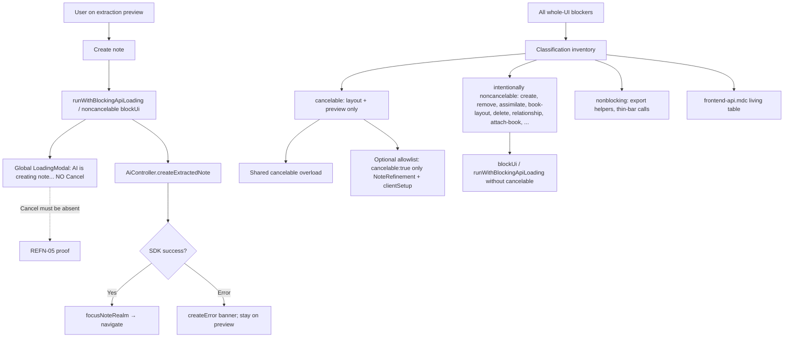

# Phase 4: Enforce Safe Blocking Boundaries - Research

**Researched:** 2026-07-21
**Domain:** Frontend whole-UI blocker cancellation classification + create-note noncancelable boundary (Vue / managedApi)
**Confidence:** HIGH

<user_constraints>
## User Constraints (from CONTEXT.md)

### Locked Decisions

#### Create-note noncancelable boundary (REFN-05)
- **D-01:** While final extracted-note creation is pending, the global blocker shows `AI is creating note...` and **must not** expose Cancel. This is intentional safety, not a missing opt-in.
- **D-02:** Keep the existing create success path unchanged: one successful completion still focuses/navigates via `focusNoteRealm` as today. Cancellation is not introduced; do not add retry-after-abort affordances for create.
- **D-03:** Preserve the Phase 3 regression stance: a pending create-note blocker must fail any assertion that Cancel is present. Strengthen or promote that coverage as the REFN-05 proof, not a product behavior change.
- **D-04:** Do not opt `createExtractedNote` into `{ cancelable: true }`. Do not invent a cancelable `runWithBlockingApiLoading`. Client-only abort remains unsafe for this transactional mutation (duplicate note / double original-note update risk).

#### Cohesion audit and adoption scope (COHE-02)
- **D-05:** Produce an explicit inventory of every current whole-UI blocker and every long-running note-refinement AI request, each labeled **cancelable**, **intentionally noncancelable**, or **nonblocking**.
- **D-06:** In-scope cancelable adopters for this milestone remain exactly the two note-refinement AI reads already shipped: layout generation (`AI is generating layout...`) and extraction-preview generation (`AI is generating preview...`). Both must continue using the shared `{ blockUi: true, cancelable: true }` overload.
- **D-07:** Classify all other whole-UI blockers as **intentionally noncancelable** for v1 (including create-note, remove-content, assimilation, book-layout mutations/apply, note delete, relationship finalize, and book-layout AI suggest). Do **not** migrate them to Cancel in this phase — broader adoption is `ADPT-01` / v2 after per-domain post-cancel outcomes are defined.
- **D-08:** Classify thin-bar / non-`blockUi` note-refinement helpers (e.g. export request fetches without whole-UI blocking) as **nonblocking** — they are out of Cancel UX scope.
- **D-09:** Audit must confirm no in-scope caller reimplements AbortController ownership, AbortError-name matching, loading-state pop-by-id, or cancellation toast suppression outside `frontend/src/managedApi/`. Remove any such duplication found; do not add parallel helpers.

#### Classification artifact and verification
- **D-10:** Persist the classification inventory in `.cursor/rules/frontend-api.mdc` (the living cancelable-contract home), not a planning-only diary. Include the cancelable allowlist and the intentional noncancelable examples that matter for agents.
- **D-11:** Verification is frontend Vitest / existing high-level entry points: create-note Cancel-absent; layout + preview remain cancelable; optionally a lightweight guard that production `cancelable: true` appears only at the allowed note-refinement call sites. No full E2E suite required unless a plan task explicitly needs a targeted Cypress spec.

#### Carried forward (do not re-open)
- Phase 1 D-01–D-13 remain binding for outcome shape, cleanup, overlapping blockers, and silent feedback.
- Phase 2 / Phase 3 caller adoption patterns for layout and preview remain binding.
- Project Key Decision: extracted-note creation stays noncancelable in v1; browser abort does not promise server stop.
- `.cursor/rules/frontend-api.mdc` already forbids cancelable mutations and cancelable `runWithBlockingApiLoading`.

### Claude's Discretion
- Whether to leave `createExtractedNote` on `runWithBlockingApiLoading(..., "AI is creating note...")` or flatten to a single noncancelable `apiCallWithLoading(..., { blockUi: true, message })` — either is fine if Cancel stays absent and success navigation is unchanged.
- Exact wording/layout of the frontend-api.mdc inventory table, provided D-05–D-10 are satisfied.
- Test file placement (extend Phase 3 create-note edge vs dedicated cohesion/create-boundary specs), provided REFN-05 and COHE-02 are observable.

### Deferred Ideas (OUT OF SCOPE)
- Cancel additional safe long-running operations outside note refinement — `ADPT-01` / v2.
- Server-cooperative AI cancellation — `SERV-01`.
- Mutation-safe / idempotent cancellation for transactional writes — `SERV-02`.
- Redesigning Cancel visuals, Escape/backdrop cancel, or spinner chrome.
</user_constraints>

<phase_requirements>
## Phase Requirements

| ID | Description | Research Support |
|----|-------------|------------------|
| REFN-05 | User sees the shared blocking spinner without Cancel while final extracted-note creation is pending | Product path already uses noncancelable `runWithBlockingApiLoading(..., "AI is creating note...")`; Cancel absent because no `cancelControl` is projected. Prove/strengthen via existing edge + success-nav regression; do **not** opt into `cancelable: true`. `[VERIFIED: NoteRefinement.vue createExtractedNote + edges.spec + frontend-api.mdc]` |
| COHE-02 | Every existing whole-UI blocker and long-running note-refinement AI request is classified as cancelable, intentionally noncancelable, or nonblocking, with safe in-scope operations using the shared solution | Complete call-site inventory below; persist in `frontend-api.mdc`; confirm only layout+preview use shared cancelable overload; audit no duplicated abort/cleanup outside `managedApi/`. `[VERIFIED: rg inventory across frontend/src]` |
</phase_requirements>

## Summary

Phase 4 is primarily an **enforcement + cohesion close-out**, not a new cancel UX. After Phases 1–3, create-note already blocks with `AI is creating note...` and **no Cancel**; layout and preview already use the shared `{ blockUi: true, cancelable: true }` overload. `[VERIFIED: NoteRefinement.vue + Phase 3 edges.spec]`

What remains for the planner: (1) treat the existing create-note Cancel-absent edge as the **REFN-05 proof** (strengthen/rename/promote as needed, keep success `focusNoteRealm` path unchanged); (2) write the full **classification inventory** into `.cursor/rules/frontend-api.mdc` (D-10); (3) confirm **no duplicated** AbortController / AbortError / loading pop / cancel-toast logic outside `managedApi/` (D-09 — audit already clean); (4) optionally add a lightweight **allowlist guard** so production `cancelable: true` stays only at NoteRefinement layout + preview (+ type literal in `clientSetup.ts`). `[VERIFIED: CONTEXT D-01–D-11 + codebase rg]`

**Primary recommendation:** Do not change create-note product behavior. Plan tasks as docs inventory + Vitest proof promotion + optional allowlist check; leave `runWithBlockingApiLoading` for create unless a tiny cohesion edit is cheaper than debating it — both are valid under Claude's Discretion.

## Architectural Responsibility Map

| Capability | Primary Tier | Secondary Tier | Rationale |
|------------|-------------|----------------|-----------|
| Create-note noncancelable blocker (REFN-05) | Browser / Client (`NoteRefinement.vue`) | API / Backend (mutation commits) | UI must not offer Cancel; server may still commit — client abort unsafe. `[VERIFIED: PROJECT.md + D-04]` |
| Success navigation after create | Browser / Client (`StoredApiCollection.focusNoteRealm`) | — | Unchanged replace-route focus. `[VERIFIED: NoteRefinement.vue + storedApi.spec]` |
| Cancelable layout + preview (keep) | Browser / Client (`NoteRefinement.vue`) | Shared `managedApi` | Only two allowed product opt-ins. `[VERIFIED: D-06]` |
| Shared abort / cleanup / silent cancel | Browser / Client (`managedApi/clientSetup.ts`) | — | COHE-01 ownership; no caller reimplementation. `[VERIFIED: D-09 + clientSetup.ts]` |
| Classification inventory (COHE-02) | Docs / agent rules (`frontend-api.mdc`) | Vitest allowlist optional | Living contract home for agents. `[VERIFIED: D-10]` |
| Broader Cancel adoption | Deferred (`ADPT-01`) | — | Intentionally noncancelable now. `[VERIFIED: D-07]` |
| Server-cooperative / mutation-safe cancel | API / Backend (deferred) | — | SERV-01/02 out of scope. `[VERIFIED: REQUIREMENTS.md]` |

## Project Constraints (from .cursor/rules/)

- Run tooling with `CURSOR_DEV=true nix develop -c …`; git without Nix; assume `pnpm sut` running. `[VERIFIED: AGENTS.md / agent-map.md]`
- Behavior phase: one observable behavior (create-note noncancelable shared blocker + milestone cohesion closure); stop-safe; no ADPT/SERV scope. `[VERIFIED: planning.mdc + ROADMAP Phase 4]`
- Prefer `apiCallWithLoading` + generated SDK; never hand-edit generated API; global blocker only; **forbid** cancelable mutations and cancelable `runWithBlockingApiLoading`. `[VERIFIED: frontend-api.mdc]`
- Persist cancel classification in `frontend-api.mdc`, not a disposable planning note. `[VERIFIED: 04-CONTEXT D-10]`
- Vitest browser mode; avoid role queries; `mockSdkService` / `mockSdkServiceWithImplementation`; targeted frontend tests — no full E2E unless plan requires. `[VERIFIED: frontend-testing.mdc + D-11 + planning.mdc]`
- Phase wrap-up: Jidoka → post-change-refactor → plan update → commit → push. `[VERIFIED: gsd-coexistence.mdc]`
- Capability-name artifacts in product/tests; phase numbers only under `.planning/`. `[VERIFIED: planning.mdc]`

## Standard Stack

### Core

| Library / API | Version | Purpose | Why Standard Here |
|---------------|---------|---------|-------------------|
| Phase 1–3 `apiCallWithLoading` cancelable overload | in-repo | Shared cancel contract | Already adopted by layout + preview. `[VERIFIED: clientSetup.ts]` |
| `runWithBlockingApiLoading` | in-repo | Noncancelable multi-step blocker | Create-note / remove / delete / relationship / attach-book. `[VERIFIED: clientSetup.ts]` |
| `AiController.createExtractedNote` | generated SDK | Final extraction mutation | Existing call site; must stay noncancelable. `[VERIFIED: NoteRefinement.vue]` |
| `LoadingModal` + `DoughnutApp` | in-repo | Global blocker / conditional Cancel | Cancel only when selected state has cancelControl. `[VERIFIED: LoadingModal.spec.ts]` |
| Vue 3.5.40 | pinned | Note refinement UI | Existing Create note button + preview panel. `[VERIFIED: frontend/package.json]` |

### Supporting

| Library | Version | Purpose | When to Use |
|---------|---------|---------|-------------|
| Vitest 4.1.10 (browser / Playwright) | pinned | REFN-05 / allowlist proofs | Extend or promote existing edges |
| `@testing-library/vue` | existing | Text / Cancel presence | Same as Phase 2/3 cancel specs |
| `createDeferredGate` / `loadingModalMask` / extraction helpers | in-repo | Hold create pending | Reuse from noteRefinement*TestSupport |
| `rg` / optional Vitest file scan | toolchain | Allowlist exclusivity | D-11 optional guard |

### Alternatives Considered

| Instead of | Could Use | Tradeoff |
|------------|-----------|----------|
| Keep `runWithBlockingApiLoading` for create | Flatten to single `{ blockUi: true }` `apiCallWithLoading` | Flatten works only if create stays one SDK call + post-success focus outside the blocker, or wraps both steps carefully; composite helper already covers API + `focusNoteRealm` under one spinner — **prefer leave as-is** unless refactor is free. `[VERIFIED: createExtractedNote body]` |
| Migrate book-layout AI suggest to Cancel | Leave intentionally noncancelable | Looks “safe” later but deferred to ADPT-01 (D-07). |
| Planning-only inventory markdown | `frontend-api.mdc` inventory | D-10 forbids diary-only home. |
| New packages for allowlist | `rg` in verify step or tiny Vitest | No new deps. |

**Installation:** None. No new packages. `[VERIFIED: phase scope]`

**Version verification:** `vue@3.5.40`, `vitest@4.1.10` from `frontend/package.json` (2026-07-21 read). No npm installs.

## Package Legitimacy Audit

Not applicable — Phase 4 installs no external packages. Use the already-pinned frontend stack and shared managedApi contract.

**Packages removed due to [SLOP] verdict:** none  
**Packages flagged as suspicious [SUS]:** none

## Architecture Patterns

### System Architecture Diagram



### Recommended Project Structure

```
.cursor/rules/frontend-api.mdc          # Extend with COHE-02 inventory table + allowlist
frontend/src/components/recall/NoteRefinement.vue   # Keep create noncancelable; layout+preview cancelable
frontend/src/managedApi/clientSetup.ts  # Sole AbortController / cancel latch owner
frontend/tests/components/recall/
  NoteRefinement.extractionPreview.cancel.edges.spec.ts  # Promote/strengthen create Cancel-absent
  NoteRefinement.extractNote.spec.ts                     # Success nav regression (existing)
  # optional: dedicated cohesion / allowlist spec under managedApi or recall/
```

### Pattern 1: Intentionally noncancelable create (keep)

**What:** Composite noncancelable blocker around mutation + focus navigation.  
**When to use:** Transactional writes where client abort is unsafe.  
**Example:**

```typescript
// Source: frontend/src/components/recall/NoteRefinement.vue (current)
await runWithBlockingApiLoading(async () => {
  const response = await apiCallWithLoading(() =>
    AiController.createExtractedNote({ path: { note: props.note.id }, body: { ... } })
  )
  if (response.error || !response.data) { /* createError */ return }
  await storageAccessor.value.storedApi().focusNoteRealm(router, response.data)
}, "AI is creating note...")
```

### Pattern 2: Cancelable allowlist (only two product sites)

**What:** Literal `{ blockUi: true, cancelable: true }` only on layout + preview.  
**When to use:** Safe read-only AI waits with defined post-cancel UX.  
**Example:** Existing `generateRefinementSuggestions` / `extractNotePreview` call sites in `NoteRefinement.vue`. `[VERIFIED: rg cancelable:true]`

### Pattern 3: Living inventory in frontend-api.mdc

**What:** Table of every whole-UI / refinement AI call with classification.  
**When to use:** Agent guidance + COHE-02 closure.  
**Recommended columns:** Operation | Message | Call site | Classification | Notes (e.g. ADPT-01 candidate).

### Anti-Patterns to Avoid

- **Adding Cancel to create-note “for consistency”:** Unsafe mutation; violates REFN-05 / D-04 / PROJECT out-of-scope.
- **Migrating other blockers to Cancel in this phase:** Speculative ADPT-01; violates D-07.
- **Inventing cancelable `runWithBlockingApiLoading`:** Forbidden by frontend-api.mdc.
- **Planning-only inventory instead of frontend-api.mdc:** Violates D-10.
- **Reimplementing AbortController / AbortError matching in callers:** Violates D-09 / COHE-01.
- **Hand-editing generated SDK:** Forbidden by agent-map / frontend-api.

## Don't Hand-Roll

| Problem | Don't Build | Use Instead | Why |
|---------|-------------|-------------|-----|
| Create Cancel UX | Local Abort + Cancel button | Noncancelable shared blocker | Mutation safety (D-04) |
| Classification diary | `.planning/`-only table | `frontend-api.mdc` inventory | D-10 living contract |
| Parallel cancel helper | New utility outside managedApi | Existing overload only | COHE-01 / D-09 |
| Broader Cancel migration | Opt-in every AI blocker | ADPT-01 later | Per-domain outcomes undefined |
| Allowlist framework | New lint plugin package | `rg` verify step or tiny Vitest | Zero deps; Phase 2/3 already used rg exclusivity |

**Key insight:** Product create-note behavior is already correct. Phase 4 value is making the **safety map explicit and test-gated** so the milestone cannot silently regress into unsafe Cancel or duplicated abort logic.

## Common Pitfalls

### Pitfall 1: Treating REFN-05 as a greenfield feature

**What goes wrong:** Planner schedules product Vue rewrites for create-note when behavior already matches D-01–D-04.  
**Why it happens:** Roadmap wording reads like new UX.  
**How to avoid:** Plan as proof + docs + audit; only touch `createExtractedNote` if Discretion flatten is chosen.  
**Warning signs:** Diff rewrites create success path or adds `cancelable: true`.

### Pitfall 2: Accidentally shipping Cancel on create during “cleanup”

**What goes wrong:** Refactor to cancelable overload “for consistency” with layout/preview.  
**Why it happens:** Copy-paste from Phase 2/3 patterns.  
**How to avoid:** Explicit forbid in frontend-api inventory; strengthen Cancel-absent assertion; allowlist fails if create gains cancelable.  
**Warning signs:** LoadingModal shows Cancel with `AI is creating note...`.

### Pitfall 3: Incomplete inventory (missing attach-book / relationship / next-note)

**What goes wrong:** COHE-02 claimed complete while blockers remain unclassified.  
**Why it happens:** PROJECT.md still says “six” blockers (stale); code has more.  
**How to avoid:** Use the verified inventory table in this research as the seed for frontend-api.mdc.  
**Warning signs:** `rg 'blockUi: true|runWithBlockingApiLoading'` finds sites not in the table.

### Pitfall 4: Classifying book-layout AI suggest as cancelable now

**What goes wrong:** Scope creep into ADPT-01 without post-cancel UX.  
**Why it happens:** It is a long-running AI read and “looks safe.”  
**How to avoid:** D-07 locks it intentionally noncancelable; note as ADPT-01 candidate in inventory.  
**Warning signs:** Diff adds `cancelable: true` outside NoteRefinement.

### Pitfall 5: Duplicating abort logic while “helping” allowlist tests

**What goes wrong:** Test helpers invent AbortError name checks that then get copied into product code.  
**Why it happens:** Convenience in specs.  
**How to avoid:** Keep abort ownership assertions at managedApi unit tests; product audit is `rg` for AbortController outside managedApi.  
**Warning signs:** New `AbortController` under `frontend/src/components` or `composables`.

### Pitfall 6: Breaking create success navigation while flattening blocker

**What goes wrong:** Moving `focusNoteRealm` outside the blocker or dropping it.  
**Why it happens:** Flatten Discretion edit without reading composite body.  
**How to avoid:** Keep success path identical; extractNote.spec already asserts `routerReplace(noteShowLocation(...))`.  
**Warning signs:** Create succeeds but no navigation / focus refresh.

## Code Examples

### REFN-05 pending proof (existing edge)

```typescript
// Source: frontend/tests/components/recall/NoteRefinement.extractionPreview.cancel.edges.spec.ts
it("create-note pending shows creating message without Cancel (D-10)", async () => {
  // deferred createExtractedNote gate → click Create note
  expect(loadingModalMask()).toBeTruthy()
  expect(document.body.textContent).toContain("AI is creating note...")
  expect(document.body.textContent).not.toContain("Cancel")
})
```

Promote/rename for REFN-05 clarity; keep assertions. `[VERIFIED: edges.spec.ts]`

### Allowlist exclusivity (verification pattern from Phases 2–3)

```bash
# Under frontend/src, cancelable: true only NoteRefinement.vue + clientSetup.ts
rg -n 'cancelable:\s*true' frontend/src --glob '*.{ts,vue}'
```

Expected hits (3): type/options in `clientSetup.ts` (1) + layout + preview in `NoteRefinement.vue` (2). `[VERIFIED: rg 2026-07-21]`

### Duplication audit (already clean)

```bash
rg -n 'AbortController|AbortError' frontend/src --glob '*.{ts,vue}'
# AbortController only in managedApi/clientSetup.ts
```

`[VERIFIED: rg 2026-07-21]`

## Verified Call-Site Inventory (seed for D-05 / D-10)

### Cancelable (in-scope adopters — D-06)

| Operation | Message | File | Mechanism |
|-----------|---------|------|-----------|
| Layout generation | `AI is generating layout...` | `NoteRefinement.vue` | `apiCallWithLoading` + `cancelable: true` |
| Extraction-preview generation | `AI is generating preview...` | `NoteRefinement.vue` | `apiCallWithLoading` + `cancelable: true` |

### Intentionally noncancelable (D-07 — no Cancel migration)

| Operation | Message | File | Mechanism |
|-----------|---------|------|-----------|
| Create extracted note | `AI is creating note...` | `NoteRefinement.vue` | `runWithBlockingApiLoading` |
| Remove refinement content | `AI is removing content...` | `NoteRefinement.vue` | `runWithBlockingApiLoading` |
| Assimilate unit | `Assimilating...` | `useAssimilateUnit.ts` | `{ blockUi: true }` |
| Load next assimilation note | `Loading next note...` | `useGoToNextAssimilation.ts` | `{ blockUi: true }` |
| Book layout mutations | `Updating book layout…` | `useBookLayoutMutations.ts` | `{ blockUi: true }` (2 call sites) |
| Book layout AI suggest | `Analyzing book layout…` | `useBookLayoutAiReorganize.ts` | `{ blockUi: true }` — ADPT-01 candidate |
| Book layout apply suggestion | `Applying layout changes…` | `useBookLayoutAiReorganize.ts` | `{ blockUi: true }` |
| Note delete / reduce | `Deleting note...` / `Reducing to source property...` | `useNoteDeleteFlow.ts` | `runWithBlockingApiLoading` |
| Relationship finalize | `Creating relationship note...` | `AddRelationshipFinalize.vue` | `runWithBlockingApiLoading` |
| Attach book upload | `Uploading book…` | `NotebookAttachedBookSection.vue` | `runWithBlockingApiLoading` |

### Nonblocking (D-08 — out of Cancel UX)

| Operation | File | Notes |
|-----------|------|-------|
| `exportExtractRequest` | `NoteRefinement.vue` `fetchExtractRequestExport` | Direct SDK; no `apiCallWithLoading` |
| `exportRefinementLayoutRequest` | `NoteRefinement.vue` `fetchBreakdownRequestExport` | Direct SDK; no whole-UI block |
| `getBook` load after attach | `NotebookAttachedBookSection.vue` `loadBook` | Thin-bar `apiCallWithLoading` without `blockUi` |

**Duplication audit result:** No AbortController, AbortError-name matching, or loading pop-by-id outside `frontend/src/managedApi/`. Toast usage outside managedApi is general UI (`main.ts`, `useToast.ts`), not cancellation suppression. `[VERIFIED: rg]`

## State of the Art

| Old Approach | Current Approach | When Changed | Impact |
|--------------|------------------|--------------|--------|
| Thin-bar layout; noncancelable preview composite | Cancelable layout + preview via shared overload | Phases 2–3 | Cancel UX for safe AI reads |
| Implied “create has no Cancel” | Explicit REFN-05 proof + inventory | Phase 4 | Milestone closes with map, not implication |
| PROJECT.md “six blockers” | ~12 whole-UI sites classified above | Phase 4 docs | Agents stop under-counting |

**Deprecated/outdated:**
- Assuming cancelable adoption still needed for create — **rejected** for v1.
- Treating book-layout AI suggest as in-scope Cancel — **deferred** ADPT-01.

## Assumptions Log

| # | Claim | Section | Risk if Wrong |
|---|-------|---------|---------------|
| — | *(empty)* | — | All inventory and product claims verified via codebase `rg` / file reads this session |

**If this table is empty:** All claims in this research were verified or cited — no user confirmation needed for stack facts. Discretion items remain planner/executor choices, not assumptions.

## Open Questions

1. **Promote vs split create-note Cancel-absent test**
   - What we know: Edge lives in `NoteRefinement.extractionPreview.cancel.edges.spec.ts` labeled Phase 3 D-10; success nav covered in `NoteRefinement.extractNote.spec.ts`.
   - What's unclear: Whether planner prefers rename-in-place, move to a dedicated create-boundary spec, or duplicate a thin REFN-05-named case.
   - Recommendation: Rename/strengthen in edges file (or dedicated recall cohesion spec) without deleting coverage; keep extractNote success-nav as regression. Claude's Discretion covers placement.

2. **Allowlist automation medium**
   - What we know: Phases 2–3 used manual `rg` in plan verification; D-11 makes Vitest allowlist optional.
   - What's unclear: Whether CI should encode the allowlist as a Vitest test that reads source files.
   - Recommendation: Prefer a small Vitest (or script invoked by frontend verify) so the gate cannot be skipped; `rg` alone is fine if plan verification step is explicit.

3. **Flatten createExtractedNote?**
   - What we know: Composite helper correctly covers mutation + `focusNoteRealm` under one message.
   - Recommendation: **Leave as-is** — zero product risk; Discretion flatten only if post-change-refactor finds a clear cohesion win without changing observables.

## Environment Availability

Step 2.6: Mostly SKIPPED for external services — Phase 4 is frontend code/docs/tests only.

| Dependency | Required By | Available | Version | Fallback |
|------------|------------|-----------|---------|----------|
| Nix + `CURSOR_DEV=true nix develop -c` | Test / lint commands | ✓ (repo contract) | — | Cloud VM skill if no Nix |
| Vitest browser / Chromium | REFN-05 / allowlist proofs | ✓ | 4.1.10 | — |
| `pnpm sut` (app running) | Not required for Vitest unit proofs | Assumed | — | Not needed for this phase’s Vitest |
| Backend / MySQL / Redis | Not required | — | — | N/A |
| New npm packages | None | — | — | N/A |

**Missing dependencies with no fallback:** none  
**Missing dependencies with fallback:** none

## Validation Architecture

### Test Framework

| Property | Value |
|----------|-------|
| Framework | Vitest 4.1.10 (browser mode / Playwright Chromium) `[VERIFIED: frontend/package.json + vitest.config.ts]` |
| Config file | `frontend/vitest.config.ts` |
| Quick run command | `CURSOR_DEV=true nix develop -c pnpm frontend:test tests/components/recall/NoteRefinement.extractionPreview.cancel.edges.spec.ts` |
| Full suite command | `CURSOR_DEV=true nix develop -c pnpm frontend:verify` |
| Related regression | `CURSOR_DEV=true nix develop -c pnpm frontend:test tests/components/recall/NoteRefinement.extractNote.spec.ts tests/components/recall/NoteRefinement.layoutGeneration.cancel.spec.ts tests/components/recall/NoteRefinement.extractionPreview.cancel.spec.ts` |
| Allowlist check | `rg -n 'cancelable:\s*true' frontend/src --glob '*.{ts,vue}'` (or Vitest equivalent) |

### Phase Requirements → Test Map

| Req ID | Behavior | Test Type | Automated Command | File Exists? |
|--------|----------|-----------|-------------------|-------------|
| REFN-05 | Pending create shows `AI is creating note...` without Cancel | Browser component | quick run (edges create-note case) | ✅ strengthen/promote — do not invent new product path |
| REFN-05 | Successful create navigates via existing focus path once | Browser component | extractNote create happy-path (`routerReplace` / note location) | ✅ `NoteRefinement.extractNote.spec.ts` |
| COHE-02 | Layout + preview remain cancelable (Cancel present + shared overload) | Browser component | layout + preview cancel suites | ✅ existing Phase 2/3 specs |
| COHE-02 | Inventory persisted in frontend-api.mdc with allowlist + noncancelable examples | Docs / review | Read `.cursor/rules/frontend-api.mdc` | ❌ Wave 0 — extend rule |
| COHE-02 | Production `cancelable: true` only at allowed sites | Static / Vitest | `rg` or allowlist spec | ⚠️ Phase 2/3 used manual rg; optional automated guard |
| COHE-02 | No duplicated abort/cleanup outside managedApi | Static audit | `rg AbortController\|AbortError` under `frontend/src` | ✅ already clean — re-verify at phase gate |

### Sampling Rate

- **Per task commit:** Touched create-boundary / cohesion / frontend-api docs + related Vitest file(s).
- **Per wave merge:** Create Cancel-absent + extractNote success + layout cancel + preview cancel + allowlist `rg`.
- **Phase gate:** `frontend:verify` green; frontend-api inventory present; no full Cypress suite unless a plan task explicitly adds one.

### Wave 0 Gaps

- [ ] Extend `.cursor/rules/frontend-api.mdc` with the full classification inventory table (cancelable allowlist + intentionally noncancelable examples + nonblocking note). Seed from this RESEARCH inventory.
- [ ] Promote/strengthen create-note Cancel-absent coverage as explicit REFN-05 proof (rename assertion comment / dedicated case as needed).
- [ ] Optional: add lightweight allowlist guard (Vitest or verify-step `rg`) so only `NoteRefinement.vue` + `clientSetup.ts` contain `cancelable: true` under `frontend/src`.
- [ ] Framework install: none — existing Vitest browser stack is sufficient.

*(Shared Phase 1 contract tests and Phase 2/3 cancel suites already exist and must remain green; do not re-implement shared race coverage.)*

## Security Domain

### Applicable ASVS Categories

| ASVS Category | Applies | Standard Control |
|---------------|---------|-----------------|
| V2 Authentication | No new surface | Existing credentialed client unchanged |
| V3 Session Management | No new surface | No session/cookie changes |
| V4 Access Control | No new surface | Same authorized endpoints; classification does not escalate privilege |
| V5 Input Validation | Limited | Cancel identity remains shared-layer; create stays non-abortable from UI |
| V6 Cryptography | No | None introduced |

### Known Threat Patterns for this boundary/close-out

| Pattern | STRIDE | Standard Mitigation |
|---------|--------|---------------------|
| Client Cancel on create after server commit | Tampering / Integrity | Keep create noncancelable (REFN-05 / D-04); docs forbid | 
| UI implies mutation reversible | Spoofing UX | Message `AI is creating note...` without Cancel |
| Accidental cancelable mutation elsewhere | Tampering | Allowlist + frontend-api inventory (D-07/D-11) |
| Caller-local abort race / silent error filtering | Elevation of privilege over shared contract | D-09 audit — mechanics only in managedApi |
| Premature ADPT of book-layout AI cancel without outcomes | Denial of coherent state | Defer to ADPT-01 |

## Sources

### Primary (HIGH confidence)

- `.planning/phases/04-enforce-safe-blocking-boundaries/04-CONTEXT.md` — D-01–D-11 locked
- `.planning/REQUIREMENTS.md` — REFN-05, COHE-02
- `.planning/ROADMAP.md` — Phase 4 success criteria
- `.planning/PROJECT.md` — create noncancelable key decision; out of scope
- `.cursor/rules/frontend-api.mdc` — cancelable overload + mutation forbid (extend target)
- `.cursor/rules/planning.mdc`, `gsd-coexistence.mdc`, `frontend-testing.mdc`
- `frontend/src/components/recall/NoteRefinement.vue` — layout/preview cancelable; create/remove noncancelable; export nonblocking
- `frontend/src/managedApi/clientSetup.ts` — sole AbortController / cancel latch
- Whole-UI call sites: `useAssimilateUnit.ts`, `useGoToNextAssimilation.ts`, `useBookLayoutMutations.ts`, `useBookLayoutAiReorganize.ts`, `useNoteDeleteFlow.ts`, `AddRelationshipFinalize.vue`, `NotebookAttachedBookSection.vue`
- `frontend/tests/components/recall/NoteRefinement.extractionPreview.cancel.edges.spec.ts` — create Cancel-absent edge
- `frontend/tests/components/recall/NoteRefinement.extractNote.spec.ts` — success navigation
- Phase 1 / Phase 3 CONTEXT + `03-03-SUMMARY.md` — carried locks + rg exclusivity pattern

### Secondary (MEDIUM confidence)

- [MDN AbortController](https://developer.mozilla.org/en-US/docs/Web/API/AbortController) — client abort semantics (no server stop) — `[CITED]`
- Phase 2/3 PLAN verification `rg exclusivity` precedent — `[VERIFIED: 02-03 / 03-03 SUMMARY]`

### Tertiary (LOW confidence)

- None material for planning.

## Metadata

**Confidence breakdown:**
- Standard stack: HIGH — no new packages; in-repo contract verified
- Architecture: HIGH — create path + full blocker inventory verified via `rg` / file reads
- Pitfalls: HIGH — grounded in D-locks + observed Phase 2/3 copy-paste risks

**Research date:** 2026-07-21  
**Valid until:** 30 days (stable brownfield close-out; re-verify inventory if new `blockUi` call sites land)

---

## RESEARCH COMPLETE

**Phase:** 4 - Enforce Safe Blocking Boundaries  
**Confidence:** HIGH

### Key Findings
- Create-note is already noncancelable with `AI is creating note...`; Phase 4 is proof + cohesion, not new Cancel UX.
- Only two production `cancelable: true` sites exist (layout + preview); all other whole-UI blockers are intentionally noncancelable.
- No AbortController / AbortError duplication outside `managedApi/` — D-09 audit is clean today.
- Persist the verified inventory in `frontend-api.mdc`; optionally automate the allowlist with Vitest/`rg`.
- Prefer leaving `runWithBlockingApiLoading` for create; Discretion flatten is optional and riskier for navigation cohesion.

### File Created
`.planning/phases/04-enforce-safe-blocking-boundaries/04-RESEARCH.md`

### Confidence Assessment
| Area | Level | Reason |
|------|-------|--------|
| Standard Stack | HIGH | In-repo managedApi + pinned Vitest/Vue; no installs |
| Architecture | HIGH | Full call-site map + create path verified |
| Pitfalls | HIGH | Locked decisions + known copy-paste Cancel risk |

### Open Questions
- Test placement (promote edges vs dedicated REFN-05 spec)
- Allowlist medium (`rg` vs Vitest)
- Optional flatten of create blocker (recommend leave as-is)

### Ready for Planning
Research complete. Planner can now create PLAN.md files.
