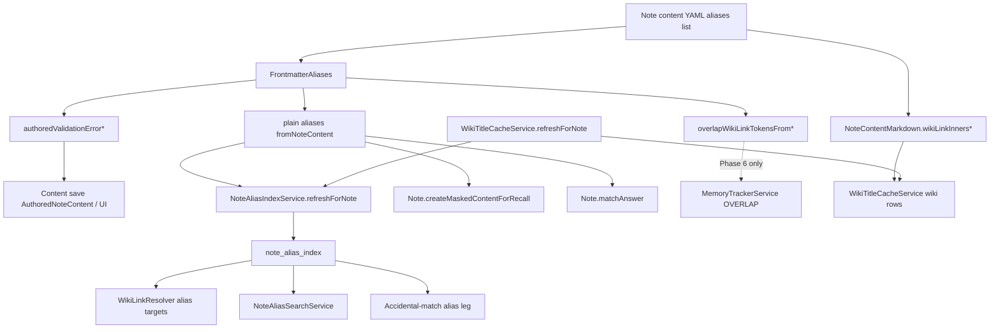

# Phase 5: Alias-as-wiki-link overlap declaration - Research

**Researched:** 2026-07-24
**Domain:** Frontmatter aliases parsing/validation, derived alias index, wiki-link grammar (brownfield Spring Boot + Vue)
**Confidence:** HIGH

<user_constraints>
## User Constraints (from CONTEXT.md)

### Locked Decisions

#### Wiki-link alias syntax
- **D-01:** Accept standard Doughnut wiki-link token forms already understood by `WikiLinkMarkdown` / `WikiLinkTargetReference`: `[[Title]]`, qualified `[[Notebook:Title]]`, and pipe-display `[[Title|display]]` / `[[Notebook:Title|display]]`. Overlap semantics use the **target** segment (`WikiLinkMarkdown.splitInner(…).target()`), not the display segment. — **Reversibility:** reversible — validation/parser rules; can narrow forms later.
  - Rationale: Reuses the product's existing wiki-link grammar instead of inventing a second alias-only dialect. Today `FrontmatterAliases.isValidAliasText` rejects any `[[`/`]]`; Phase 5 flips that for well-formed tokens only.

#### Consumer segregation (OVL-03)
- **D-02:** Segregate at parse time in `FrontmatterAliases` (and keep frontend helpers consistent if they validate aliases). **Only plain aliases** participate in: `NoteAliasIndex` / search, wiki-resolve alias targets, cloze masking (`hideAliases`), and `Note.matchAnswer`. **Wiki-link aliases are overlap declarations only** — never indexed as searchable alias text, never used as wiki-resolve alias targets, never cloze-masked as alias strings, never counted as a correct spelling answer. — **Reversibility:** costly — many call sites share `fromNoteContent` today; changing the default to "all items including wiki links" would reintroduce blast-radius bugs.
  - Rationale: ROADMAP success criteria 2–4 and PROJECT "alias blast radius" require plain-alias consumers unchanged. Indexing `[[Other]]` or its inner title as an alias would corrupt search/accidental-match.

#### Overlap extraction API (Phase 6-ready, unused for grading yet)
- **D-03:** Extend `FrontmatterAliases` with an explicit split API: plain-alias accessors keep today's `fromNoteContent` / `fromFrontmatter` / `matchesFromNoteContent` **plain-only** contract; add overlap accessors (e.g. `overlapWikiLinkTokensFromNoteContent` / equivalent) that return the raw wiki-link token strings (or a thin typed wrapper) for declared overlaps. Phase 5 does **not** wire `MemoryTrackerService` / `AnswerOutcome.OVERLAP` / `AnsweredQuestion.overlap`. — **Reversibility:** reversible — additive methods; grading stays Phase 6.
  - Rationale: Structure phase must leave a stable seam for Phase 6 without front-running OVL-01 behavior. Shared parse ownership prevents duplicated YAML/wiki rules.

#### Authored validation & dead targets
- **D-04:** Authored validation accepts well-formed wiki-link alias items (D-01) alongside existing plain alias rules. Malformed items (bare `[[`, non-wiki strings with `#`/`|`/path separators outside a valid wiki token, nested YAML, blanks) still fail `authoredValidationErrorForNoteContent` with an updated message that mentions both plain aliases and wiki-link overlap declarations. **Dead / unresolvable targets are valid declarations** — do not require the target note to exist at save time; resolution is Phase 6's job. Soft-parse paths that feed the index continue to **skip** invalid items (today's lenient `from*` behavior) while authored validation remains strict. — **Reversibility:** reversible — validation policy; existence checks can be added later if product wants them.
  - Rationale: Overlap is user-declared intent; notes and titles move. Blocking saves on resolve would fight wiki-link authoring elsewhere. Malformed tokens must still be rejected so `[[` does not become a loophole for unsafe plain-alias characters.

### Claude's Discretion
- Exact method names / return types for the overlap extraction API (token strings vs `WikiInnerSplit` / `WikiLinkTargetReference` with focus notebook).
- Whether `fromNoteContent` stays the plain-only name or is renamed with a thin deprecated/compat wrapper — prefer least churn for existing callers (`NoteAliasIndexService`, `Note.matchAnswer`, cloze, tests).
- How to detect "this list item is a wiki-link alias" (whole-string match on `WikiLinkMarkdown.INNER_LINK_PATTERN` vs strip-and-parse) — prefer whole-item token, not wiki links embedded in longer plain text.
- Frontend parity (`frontend/src/utils/frontmatterAliases.ts` and any authored-alias UI validation) — update only if a user-facing path would reject valid wiki-link aliases or accept unsafe ones.
- Test placement: prefer extending `FrontmatterAliasesTest`, `NoteAliasIndexServiceTest`, wiki-resolve / search / cloze tests with capability-named cases; treat this as the ROADMAP design spike (enumerate consumers before parser change).
- No Flyway / schema change expected unless research proves `NoteAliasIndex` needs a type column (prefer **not** indexing overlap rows at all per D-02).

### Deferred Ideas (OUT OF SCOPE)
- **Overlap "try again, no credit"** — Phase 6 (OVL-01): wire grading when `correct=true` AND reviewed note declares overlap via alias-as-wiki-link; set `outcome=OVERLAP` / `AnsweredQuestion.overlap`; no SRS credit; no note mutation.
- **Save-time existence check for overlap wiki-link targets** — deferred unless product later wants stricter authoring UX (D-04 keeps dead targets valid).
- **Separate `overlaps:` frontmatter key** — rejected for v1; PROJECT locks extending `aliases`.
- **MCQ accidental-match / fuzzy matching / qualified Notebook:Title typing in answers** — v2, out of scope.
</user_constraints>

<phase_requirements>
## Phase Requirements

| ID | Description | Research Support |
|----|-------------|------------------|
| OVL-02 | Overlap is declared by extending the `aliases` frontmatter to accept wiki-link values that point to another note. | Widen authored validation + soft classification in `FrontmatterAliases`; add `overlapWikiLinkTokensFrom*` accessors; mirror frontend `authoredAliasesValidation.ts`. |
| OVL-03 | Extending aliases to accept wiki links preserves existing wiki-resolve, search, and cloze-masking behavior (no regressions). | Keep `fromNoteContent` / `fromFrontmatter` / `matchesFromNoteContent` **plain-only**; `NoteAliasIndexService` stays on those accessors; regression gates per consumer inventory below. |
</phase_requirements>

## Summary

Phase 5 is a **Structure** phase: teach the `aliases` YAML list to accept whole-item wiki-link tokens as **overlap declarations**, while every existing plain-alias consumer keeps today's semantics. The blast-radius risk is real but localized: almost all production call sites go through `FrontmatterAliases.fromNoteContent` / `matchesFromNoteContent` or the derived `note_alias_index` table. If those stay plain-only, wiki-resolve alias targets, alias search, cloze masking, `matchAnswer`, and accidental-match alias lookups remain safe without touching `WikiLinkResolver` or `MemoryTrackerService`.

The primary change surface is `FrontmatterAliases.isValidAliasText` (today rejects any `[[`/`]]`) plus a **classification split** so authored validation accepts well-formed wiki tokens while soft-parse index/match paths still skip them. Frontend `authoredAliasesValidation.ts` duplicates the same reject-`[[` rule and **must** gain parity, or the property editor / content PATCH UI will block valid overlap declarations before the backend sees them. No Flyway: do not index overlap rows; `note_alias_index` needs no type column.

**Primary recommendation:** Keep method names `fromNoteContent` / `fromFrontmatter` / `matchesFromNoteContent` as the plain-only contract (zero call-site churn); add additive `overlapWikiLinkTokensFromNoteContent` / `FromFrontmatter` returning raw `[[…]]` token strings; detect wiki-link items with `WikiLinkMarkdown.INNER_LINK_PATTERN.matcher(trimmed).matches()` (whole item only); update frontend authored validation in the same wave; gate with capability-named regression tests per consumer.

## Architectural Responsibility Map

| Capability | Primary Tier | Secondary Tier | Rationale |
|------------|-------------|----------------|-----------|
| Alias list parse / classify (plain vs overlap) | API / Backend (`FrontmatterAliases`) | Browser (authored validation mirror) | Single domain owner for YAML list rules; UI must not reject what backend accepts. |
| Authored save validation | API / Backend (`AuthoredNoteContent`) | Browser (`authoredAliasesValidation`) | Strict gate on content write; client UX preflight. |
| Derived plain-alias index | API / Backend (`NoteAliasIndexService`) | Database (`note_alias_index`) | Rebuild-on-refresh; plain aliases only (D-02). |
| Wiki-resolve by alias + accidental-match alias leg | API / Backend (`WikiLinkResolver` → index) | — | Reads index lookup keys only; no direct frontmatter parse. |
| Alias search | API / Backend (`NoteAliasSearchService`) | Database | Queries index; inherits plain-only if refresh is correct. |
| Cloze masking / `matchAnswer` | API / Backend (`Note` → `FrontmatterAliases`) | — | Uses `fromNoteContent` / `matchesFromNoteContent` directly. |
| Overlap declaration API (Phase 6 seam) | API / Backend (`FrontmatterAliases` overlap accessors) | — | Additive; unused by grading until Phase 6. |
| Wiki-title cache from frontmatter `[[…]]` | API / Backend (`NoteContentMarkdown` → `WikiTitleCacheService`) | — | Already scans frontmatter list items; wiki-link aliases will appear as outgoing wiki links once authorable (side effect, not OVL-03 regression). |

## Standard Stack

### Core
| Library / Module | Version | Purpose | Why Standard |
|------------------|---------|---------|--------------|
| `FrontmatterAliases` | in-repo | Parse/validate/classify `aliases` list | Existing single owner `[VERIFIED: FrontmatterAliases.java]` |
| `WikiLinkMarkdown` | in-repo | `INNER_LINK_PATTERN`, `splitInner` | Product wiki-link grammar `[VERIFIED: WikiLinkMarkdown.java]` |
| `WikiLinkTargetReference` | in-repo | Qualified `Notebook:Title` parse | Phase 6 resolve helper; optional in Phase 5 `[VERIFIED: WikiLinkTargetReference.java]` |
| `NoteAliasIndexService` | in-repo | Rebuild plain alias index on refresh | Derived-index coherence seam `[VERIFIED: NoteAliasIndexService.java]` |
| `WikiTitleCacheService.refreshForNote` | in-repo | Orchestrates wiki + property + **alias** refresh | CONCERNS single refresh boundary `[VERIFIED: WikiTitleCacheService.java]` |
| Spring Boot / JPA / MySQL | project stack | Persist `note_alias_index` | Existing `[VERIFIED: STACK / baseline SQL]` |
| Vue + Vitest | project stack | Frontend authored-alias validation | Existing mirror of backend rules `[VERIFIED: authoredAliasesValidation.ts]` |

### Supporting
| Library / Module | Version | Purpose | When to Use |
|------------------|---------|---------|-------------|
| `AuthoredNoteContent` | in-repo | Maps alias validation → API binding error | Content write paths |
| `DisplayNamePathSeparators` | in-repo | Trim whitespace around alias items | Already used by `FrontmatterAliases` |
| JUnit 5 + MakeMe | project | Backend regression tests | Prefer controller/service boundaries + algorithm unit tests |
| Vitest | project | Frontend validation unit tests | `authoredAliasesValidation.spec.ts` |

### Alternatives Considered
| Instead of | Could Use | Tradeoff |
|------------|-----------|----------|
| Keep `fromNoteContent` plain-only | Rename to `plainAliasesFromNoteContent` + deprecate | More churn; D-03 discretion prefers least churn — **reject rename** |
| Return `List<String>` overlap tokens | Return `List<WikiInnerSplit>` / `WikiLinkTargetReference` | Tokens preserve authored form for Phase 6; resolve needs focus notebook later — **prefer raw tokens** |
| Index overlap rows with a type column | Skip indexing overlaps | Flyway + blast radius; D-02 / discretion — **do not index** |
| Separate `overlaps:` key | Extend `aliases` | Rejected by PROJECT / deferred |

**Installation:** none — no new packages.

**Version verification:** N/A (no external package installs). Package legitimacy audit: none required.

## Package Legitimacy Audit

> No external packages are introduced in this phase.

| Package | Registry | Age | Downloads | Source Repo | Verdict | Disposition |
|---------|----------|-----|-----------|-------------|---------|-------------|
| — | — | — | — | — | — | No installs |

**Packages removed due to [SLOP] verdict:** none
**Packages flagged as suspicious [SUS]:** none

## Consumer Inventory (alias blast radius)

Complete enumeration of production + primary test consumers. Planner must gate OVL-03 on each **plain-alias** row.

### Production — parse / validation

| Consumer | How it uses aliases | Phase 5 action |
|----------|---------------------|----------------|
| `FrontmatterAliases.fromNoteContent` / `fromFrontmatter` | Soft-parse valid list items | **Must stay plain-only** (exclude wiki-link items) |
| `FrontmatterAliases.matchesFromNoteContent` | Spelling answer vs aliases | Stays plain-only via `fromNoteContent` |
| `FrontmatterAliases.authoredValidationErrorForNoteContent` | Strict save validation | Accept plain **or** well-formed wiki-link item (D-04) |
| `FrontmatterAliases.normalizedLookupKey` | NFKC+lower key | Unchanged; used by index/search/resolve |
| `AuthoredNoteContent` | Calls authored validation → `"aliases"` API error | No logic change beyond message/behavior from `FrontmatterAliases` |
| `frontend/.../authoredAliasesValidation.ts` | Client mirror of `isValidAliasText` | **Required parity** — today rejects any `[[`/`]]` |
| `frontend/.../noteContentPropertyRows.ts` | Uses authoredAliasesValidation | Inherits frontend fix |
| `frontend/.../RichFrontmatterPropertyValueDialog.vue` | Popup validation | Inherits frontend fix |
| `frontend/.../frontmatterAliases.ts` | `mergeAliasIntoList` / `normalizedLookupKey` only | No validation; leave as-is unless wikidata merges wiki tokens (it does not) |
| `frontend/.../wikidataTitleActions.ts` | Merges plain Wikidata labels into `aliases` | No change |

### Production — derived index & refresh

| Consumer | How it uses aliases | Phase 5 action |
|----------|---------------------|----------------|
| `NoteAliasIndexService.refreshForNote` | `FrontmatterAliases.fromNoteContent` → rows | No service change if `fromNoteContent` stays plain-only; **add regression** that wiki-link items produce **zero** index rows |
| `WikiTitleCacheService.refreshForNote` | Calls `noteAliasIndexService.refreshForNote` after wiki/property rebuild | Keep single refresh seam; do not add parallel alias refresh |
| Write paths calling `wikiTitleCacheService.refreshForNote` | `TextContentController`, `NoteService`, `NoteConstructionService`, `WikiLinkRewriteService`, testability | No new call sites required |

### Production — index readers (indirect; safe if index is plain-only)

| Consumer | Path | Phase 5 action |
|----------|------|----------------|
| `WikiLinkResolver.aliasTargetCandidates` | `NoteAliasIndex` by notebook + lookup key | Regression: `[[Other]]` in aliases does **not** make note resolvable as alias target `Other` / `[[Other]]` |
| `WikiLinkResolver.aliasAccidentalCandidates` | `NoteAliasIndex` by lookup key (all notebooks) | Regression: typing target title does not accidental-match via overlap wiki-link item |
| `NoteAliasSearchService` | Exact/LIKE on `alias_lookup_key` | Regression: search does not surface note for wiki-link token or its inner title as alias |

### Production — direct frontmatter consumers (cloze / answer)

| Consumer | Path | Phase 5 action |
|----------|------|----------------|
| `Note.createMaskedContentForRecall` | `hideAliases(FrontmatterAliases.fromNoteContent(…))` | Regression: body text matching overlap **target title** is not cloze-masked solely because of wiki-link alias item; plain aliases still mask |
| `Note.matchAnswer` | title then `matchesFromNoteContent` | Regression: answering with overlap target title / raw `[[…]]` is **not** correct via alias; plain aliases still match |
| `MemoryTrackerService.answerSpelling` | uses `note.matchAnswer` | **Do not wire OVERLAP** (D-03 / Phase 6) |

### Side-channel (document; not an OVL-03 regression)

| Consumer | Behavior once wiki-link aliases are authorable | Recommendation |
|----------|-----------------------------------------------|----------------|
| `NoteContentMarkdown.wikiLinkInnersInOccurrenceOrder` | Already extracts `[[…]]` from **all** frontmatter list items, including `aliases` `[VERIFIED: NoteContentMarkdown.java:147-160]` | Accept: overlap declarations become normal outgoing wiki-title-cache edges when the target resolves. Do **not** exclude `aliases` from wiki extraction in Phase 5 unless product later wants invisible declarations. Dead targets → no cache row (same as body dead links). |
| `NoteContentMarkdown.removeWikiLinksFromLeadingFrontmatterProperties` | Can rewrite/remove wiki links inside aliases list items | Existing frontmatter wiki-link cleanup; no Phase 5 change |

### Primary tests to extend (capability-named)

| Suite | Covers |
|-------|--------|
| `FrontmatterAliasesTest` | Accept wiki tokens in authored validation; soft `from*` returns only plain; overlap accessor returns tokens; malformed still rejected |
| `frontend/tests/utils/authoredAliasesValidation.spec.ts` | Accept `[[Title]]`, qualified, pipe forms; reject bare `[[`, embedded `see [[X]]`, `bad\|alias` |
| `frontend/tests/utils/noteContentPropertyRows.spec.ts` | Property-row validation parity |
| `TextContentControllerTests` (aliases nested) | HTTP accept wiki-link alias list; still reject malformed |
| `NoteAliasIndexServiceTest` | Mixed plain + wiki-link → only plain rows; refresh replaces correctly |
| `WikiTitleCacheServiceTest` | Alias index still populated for plain; optional awareness: resolved wiki-link in aliases creates wiki cache row |
| `SearchControllerAliasTests` | Wiki-link alias not searchable as alias |
| `WikiLinkResolverYamlAndBodyIntegrationTest` | Wiki-resolve by plain alias unchanged; overlap wiki-link not an alias target |
| `RecallPromptControllerTests` | Cloze still masks plain aliases; `matchAnswer` via plain alias; overlap item does not become correct answer / cloze leak |
| Accidental-match alias fixtures in `RecallPromptControllerTests` | Alias leg ignores overlap wiki-link items |

## Recommended Approach

### 1. Classification helpers inside `FrontmatterAliases` (discretion defaults)

```java
// Whole-item wiki-link alias (D-01 / discretion)
private static boolean isWikiLinkAliasItem(String trimmed) {
  Matcher m = WikiLinkMarkdown.INNER_LINK_PATTERN.matcher(trimmed);
  if (!m.matches()) { // entire string — not find()
    return false;
  }
  String inner = m.group(1).trim();
  if (inner.isEmpty()) {
    return false;
  }
  return !WikiLinkMarkdown.splitInner(inner).target().trim().isEmpty();
}

private static boolean isValidPlainAliasText(String trimmed) {
  if (trimmed.contains("[[") || trimmed.contains("]]")) {
    return false;
  }
  return !INVALID_ALIAS_CHARACTERS.matcher(trimmed).find();
}

private static boolean isAcceptableAuthoredAliasItem(String trimmed) {
  return isWikiLinkAliasItem(trimmed) || isValidPlainAliasText(trimmed);
}
```

`Matcher.matches()` matches the **entire** region; `find()` matches a subsequence `[CITED: docs.oracle.com/.../Matcher.html]` — use `matches()` so `see [[Other]]` and `[[a]][[b]]` stay invalid.

### 2. Soft parse vs authored validation

| Path | Accepts |
|------|---------|
| Soft `fromFrontmatter` / `fromNoteContent` | Plain valid only → feeds index, cloze, matchAnswer |
| Soft overlap `overlapWikiLinkTokensFrom*` | Wiki-link items only (skip malformed; lenient like today) |
| Authored validation | Every item must be plain **or** wiki-link; else `AUTHORED_ALIASES_MESSAGE` |

Update message (D-04), e.g. mention wiki-link overlap declarations while remaining a single stable string constant (update frontend constant in lockstep).

### 3. Overlap API shape (discretion default)

```java
public static List<String> overlapWikiLinkTokensFromNoteContent(String content);
public static List<String> overlapWikiLinkTokensFromFrontmatter(Frontmatter frontmatter);
```

Return authored token strings including brackets (e.g. `"[[Other Note]]"`, `"[[Shared Notebook:Hue|display]]"`). Phase 6 calls `WikiLinkMarkdown.splitInner` / `WikiLinkTargetReference.forToken` with focus notebook. Dedupe overlap tokens by `normalizedLookupKey` of the full token (or of `splitInner(inner).target()` — prefer **full token** to preserve display variants as distinct declarations only if both appear; default: dedupe by normalized full token string, consistent with plain aliases).

**Do not** call these from `MemoryTrackerService` in Phase 5.

### 4. Frontend parity (required)

Update `frontend/src/utils/authoredAliasesValidation.ts` with the same whole-item wiki-link accept rule. `frontmatterAliases.ts` needs no change. Extend Vitest specs + optionally RichMarkdownEditor aliases property tests.

### 5. No Flyway

`note_alias_index` schema (`alias_display`, `alias_lookup_key`, unique per note+lookup) needs no type column if overlap rows are never written `[VERIFIED: V100000000__baseline.sql + NoteAliasIndex.java]`.

### 6. Local planning grammar

- Phase type: **Structure** (declaration model enabling Phase 6 OVL-01).
- Stop-safe: after Phase 5, users can author overlap declarations; grading still absent — proportional value, zero Phase 6 waste if stopped.
- Tests: capability-named (e.g. `indexes_only_plain_aliases_when_wiki_link_overlap_declared`), never `phase5_*`.
- Tooling: `CURSOR_DEV=true nix develop -c pnpm backend:test_only` / `frontend:test`; no full E2E required unless UI save path is exercised manually.

## Architecture Patterns

### System Architecture Diagram



### Recommended Project Structure

No new packages. Touch existing files:

```
backend/.../algorithms/FrontmatterAliases.java     # classify + overlap API
backend/.../algorithms/FrontmatterAliasesTest.java
frontend/src/utils/authoredAliasesValidation.ts
frontend/tests/utils/authoredAliasesValidation.spec.ts
(+ regression tests listed above)
```

### Pattern 1: Segregate at parse time (not at each consumer)
**What:** One classification in `FrontmatterAliases`; consumers keep calling existing methods.
**When to use:** Always for this phase (D-02).
**Anti-pattern:** Teaching `NoteAliasIndexService` to filter `[[` itself — duplicates rules and drifts from cloze/`matchAnswer`.

### Pattern 2: Whole-item wiki token
**What:** `INNER_LINK_PATTERN.matcher(trimmed).matches()`.
**When to use:** Detecting overlap alias items (CONTEXT discretion).
**Anti-pattern:** `contains("[[")` alone (accepts malformed) or `find()` (accepts embedded links).

### Anti-Patterns to Avoid
- **Indexing inner titles of wiki-link aliases** — corrupts search and accidental-match (OVL-03).
- **Wiring OVERLAP grading** — Phase 6 only (D-03).
- **Save-time existence checks** — deferred (D-04).
- **Skipping frontend validation update** — UI blocks OVL-02.
- **Adding Flyway "just in case"** — unused type column is speculative structure beyond next behavior.
- **Excluding aliases from wiki-title extraction without product need** — fights existing frontmatter wiki-link model; not required for OVL-03.

## Don't Hand-Roll

| Problem | Don't Build | Use Instead | Why |
|---------|-------------|-------------|-----|
| Wiki-link syntax | Custom alias-only dialect | `WikiLinkMarkdown.INNER_LINK_PATTERN` + `splitInner` | Product already defines grammar |
| Qualified notebook parse | Ad-hoc `split(":")` | `WikiLinkTargetReference.forToken` (Phase 6) | Handles focus notebook + qualified form |
| Alias indexing | New table / type column | Existing `NoteAliasIndexService` + plain-only `from*` | Rebuild-on-refresh already coherent |
| Frontend validation rules | Divergent regex | Mirror backend classification | Prevents client/server reject mismatch |
| Refresh orchestration | Extra alias-only refresh callers | `WikiTitleCacheService.refreshForNote` | CONCERNS derived-index coherence |

**Key insight:** Blast radius collapses if `fromNoteContent` remains the plain-only choke point; most "consumers" never see wiki-link items.

## Common Pitfalls

### Pitfall 1: Widening `isValidAliasText` without splitting soft parse
**What goes wrong:** Soft `fromNoteContent` starts returning `[[Other]]`; index stores it; search/resolve/cloze/matchAnswer regress.
**Why it happens:** Authored validation and soft parse share one predicate today.
**How to avoid:** Separate `isValidPlainAliasText` vs `isWikiLinkAliasItem` vs authored `isAcceptableAuthoredAliasItem`.
**Warning signs:** `NoteAliasIndex` row whose `alias_display` contains `[[`.

### Pitfall 2: Using `Matcher.find()` for detection
**What goes wrong:** `prefix [[Title]]` accepted as wiki-link alias.
**How to avoid:** `matches()` on the trimmed whole item `[CITED: Oracle Matcher.matches]`.

### Pitfall 3: Forgetting frontend `authoredAliasesValidation.ts`
**What goes wrong:** Backend accepts; property dialog / row validation still shows `AUTHORED_ALIASES_MESSAGE`.
**How to avoid:** Same-wave frontend change + Vitest.

### Pitfall 4: Treating wiki-title-cache population as an OVL-03 bug
**What goes wrong:** Unnecessary special-case to strip aliases from `wikiLinkInnersInOccurrenceOrder`.
**Why it happens:** Cache already scans frontmatter lists `[VERIFIED: NoteContentMarkdownWikiLinksTest]`.
**How to avoid:** Document as expected side effect; assert OVL-03 only on resolve-by-alias, search, cloze, matchAnswer.

### Pitfall 5: Missed refresh / stale index rows
**What goes wrong:** Old plain alias remains after content edit (pre-existing concern).
**How to avoid:** Continue using `WikiTitleCacheService.refreshForNote`; alias service already delete-all-then-rewrite under pessimistic lock `[VERIFIED: NoteAliasIndexService]`.

### Pitfall 6: Indexing display segment or inner title
**What goes wrong:** `[[Nb:Hue|display]]` indexed as `display` or `Hue` → false accidental matches.
**How to avoid:** Never index wiki-link items (D-02).

## Code Examples

### Soft parse stays plain-only when mixed list present
```java
// Source: recommended Phase 5 contract (extends FrontmatterAliases)
Frontmatter fm = Frontmatter.parse(
    """
    aliases:
      - color
      - "[[Other Note]]"
      - "[[Shared Notebook:Hue|display]]"
    """);
assertThat(FrontmatterAliases.fromFrontmatter(fm), equalTo(List.of("color")));
assertThat(
    FrontmatterAliases.overlapWikiLinkTokensFromFrontmatter(fm),
    equalTo(List.of("[[Other Note]]", "[[Shared Notebook:Hue|display]]")));
```

### Whole-item detection
```java
// Source: Oracle Matcher.matches + WikiLinkMarkdown.INNER_LINK_PATTERN
Matcher m = WikiLinkMarkdown.INNER_LINK_PATTERN.matcher(trimmed);
boolean wholeWikiLink = m.matches(); // not m.find()
```

### Refresh coherence (unchanged call shape)
```java
// Source: WikiTitleCacheService.java
public void refreshForNote(Note note, User viewer) {
  rebuildWikiTitleCache(note, viewer);
  notePropertyIndexService.refreshForNote(note);
  noteAliasIndexService.refreshForNote(note); // still fromNoteContent → plain only
}
```

## State of the Art

| Old Approach | Current Approach (Phase 5) | When Changed | Impact |
|--------------|----------------------------|--------------|--------|
| `aliases` = plain wiki-link-safe strings only | Plain strings **or** whole-item wiki-link overlap declarations | Phase 5 | Enables OVL-02; OVL-03 via segregation |
| Reject any `[[`/`]]` in alias items | Accept well-formed `[[…]]` tokens only | Phase 5 | Closes loophole for unsafe chars outside tokens |

**Deprecated/outdated:**
- Treating "aliases must be wiki-link text" message as forbidding wiki-link **tokens** — message predates overlap; update copy.

## Assumptions Log

| # | Claim | Section | Risk if Wrong |
|---|-------|---------|---------------|
| — | *(none material)* | — | All critical claims verified against in-repo sources or cited Oracle docs. Discretion defaults are recommendations, not assumptions about unknown APIs. |

**If this table is empty:** All claims in this research were verified or cited — no user confirmation needed for planning. Discretion defaults above should be taken as planner defaults unless discuss-phase revisits.

## Open Questions

None blocking. Defaults from CONTEXT / research:

1. **Overlap accessor return type** → raw token `List<String>` (recommended).
2. **Rename `fromNoteContent`?** → No; keep plain-only semantics on existing names.
3. **Wiki-title-cache side effect** → Accept; do not special-case exclude aliases.
4. **Frontend** → Required parity on `authoredAliasesValidation.ts` (not optional).

## Environment Availability

Step 2.6: **SKIPPED for new external tools** — phase is code/config only within existing Nix + Spring + Vue stack.

| Dependency | Required By | Available | Version | Fallback |
|------------|------------|-----------|---------|----------|
| Nix + `CURSOR_DEV=true nix develop -c …` | Backend/frontend tests | ✓ (project contract) | repo flake | Cloud VM skill if no Nix |
| MySQL (test profile) | `NoteAliasIndexServiceTest` etc. | ✓ via process-compose / sut | project | — |
| No new CLIs/packages | — | — | — | — |

**Missing dependencies with no fallback:** none

## Validation Architecture

### Test Framework
| Property | Value |
|----------|-------|
| Framework | JUnit 5 (backend) + Vitest (frontend) |
| Config file | Spring Boot test / `frontend` Vitest config |
| Quick run command | `CURSOR_DEV=true nix develop -c pnpm backend:test_only` and `CURSOR_DEV=true nix develop -c pnpm frontend:test` |
| Full suite command | `CURSOR_DEV=true nix develop -c pnpm backend:verify` (when needed); targeted E2E only if UI save path added |

### Phase Requirements → Test Map
| Req ID | Behavior | Test Type | Automated Command | File Exists? |
|--------|----------|-----------|-------------------|-------------|
| OVL-02 | Authored aliases may include well-formed `[[…]]` | unit + controller | backend:test_only / frontend:test | ❌ Wave 0 extend `FrontmatterAliasesTest`, `authoredAliasesValidation.spec.ts`, `TextContentControllerTests` |
| OVL-02 | Soft overlap accessor returns wiki-link tokens | unit | backend:test_only | ❌ Wave 0 `FrontmatterAliasesTest` |
| OVL-03 | Index only plain aliases | service | backend:test_only | ❌ extend `NoteAliasIndexServiceTest` |
| OVL-03 | Search ignores wiki-link alias items | controller | backend:test_only | ❌ extend `SearchControllerAliasTests` |
| OVL-03 | Wiki-resolve alias targets ignore wiki-link items | integration | backend:test_only | ❌ extend `WikiLinkResolverYamlAndBodyIntegrationTest` |
| OVL-03 | Cloze / matchAnswer ignore wiki-link items | controller | backend:test_only | ❌ extend `RecallPromptControllerTests` |
| OVL-03 | Accidental-match alias leg ignores wiki-link items | controller | backend:test_only | ❌ extend accidental-match alias fixtures |
| — | No OVERLAP grading wired | — | grep / existing recall tests green | ✅ do not touch `MemoryTrackerService` outcome wiring |

### Sampling Rate
- **Per task commit:** targeted class/spec under Nix prefix
- **Per wave merge:** `pnpm backend:test_only` + affected frontend specs
- **Phase gate:** backend unit green; frontend authored-alias specs green; no `@wip` E2E required for Structure declaration (optional smoke if planner adds UI accept case)

### Wave 0 Gaps
- [ ] Extend `FrontmatterAliasesTest` for wiki-link accept + plain segregation + overlap accessor
- [ ] Extend `authoredAliasesValidation.spec.ts` (+ property rows if needed)
- [ ] Extend `NoteAliasIndexServiceTest` mixed-list indexing
- [ ] Extend search / wiki-resolve / cloze / matchAnswer / accidental-match alias regressions
- [ ] Framework install: none

## Security Domain

### Applicable ASVS Categories

| ASVS Category | Applies | Standard Control |
|---------------|---------|-----------------|
| V2 Authentication | no | — |
| V3 Session Management | no | — |
| V4 Access Control | no (no new endpoints) | Existing notebook read checks on resolve/search unchanged |
| V5 Input Validation | yes | Authored aliases validation; reject malformed `[[` loopholes |
| V6 Cryptography | no | — |

### Known Threat Patterns for aliases frontmatter

| Pattern | STRIDE | Standard Mitigation |
|---------|--------|---------------------|
| Malformed `[[` used to smuggle `\|`/`#`/path chars into plain aliases | Tampering | Whole-item wiki match only; else keep `INVALID_ALIAS_CHARACTERS` |
| Index poisoning via wiki-link inner titles | Tampering / Elevation of search hits | Never index wiki-link alias items (D-02) |
| XSS via alias display in search | — | Existing encoding/UI; no new HTML surface in Phase 5 |

## Project Constraints (from .cursor/rules/)

| Directive | Implication for Phase 5 |
|-----------|-------------------------|
| Behavior vs Structure; one observable unit; stop-safe (`planning.mdc`) | Structure phase only; no OVL-01 grading; capability-named tests |
| Time budget ~5 min / >10 min finer-decompose | Split: (1) parser+unit tests (2) frontend validation (3) index/search regressions (4) cloze/matchAnswer/AM regressions |
| Nix prefix for tooling | `CURSOR_DEV=true nix develop -c …` |
| Backend testing: prefer boundary tests; algorithm tests for pure helpers (`backend-testing.mdc`) | `FrontmatterAliasesTest` for classify; controller/service for OVL-03 |
| Always run all backend unit tests when verifying | `pnpm backend:test_only` |
| No phase numbers in product/test names | Capability names only |
| Derived index coherence (`CONCERNS.md`) | Keep `WikiTitleCacheService.refreshForNote` as alias refresh boundary |
| Commit only when asked / execute-plan wrap-up | Research commit via gsd-tools if `commit_docs` |

## File Touch List (planner)

### Must change
- `backend/src/main/java/com/odde/doughnut/algorithms/FrontmatterAliases.java`
- `backend/src/test/java/com/odde/doughnut/algorithms/FrontmatterAliasesTest.java`
- `frontend/src/utils/authoredAliasesValidation.ts`
- `frontend/tests/utils/authoredAliasesValidation.spec.ts`

### Likely change (regressions / accept path)
- `backend/src/test/java/com/odde/doughnut/services/NoteAliasIndexServiceTest.java`
- `backend/src/test/java/com/odde/doughnut/controllers/TextContentControllerTests.java`
- `backend/src/test/java/com/odde/doughnut/controllers/SearchControllerAliasTests.java`
- `backend/src/test/java/com/odde/doughnut/services/WikiLinkResolverYamlAndBodyIntegrationTest.java`
- `backend/src/test/java/com/odde/doughnut/controllers/RecallPromptControllerTests.java`
- `backend/src/test/java/com/odde/doughnut/services/WikiTitleCacheServiceTest.java` (optional awareness)
- `frontend/tests/utils/noteContentPropertyRows.spec.ts`
- `frontend/tests/components/form/RichMarkdownEditor.aliasesProperty.spec.ts`

### Do not change (Phase 5)
- `MemoryTrackerService` OVERLAP / `AnswerOutcome` wiring
- Flyway migrations / `NoteAliasIndex` entity schema
- OpenAPI / generated client
- Accidental-match offer-link UI (Phases 2–4)

## Sources

### Primary (HIGH confidence)
- `backend/src/main/java/com/odde/doughnut/algorithms/FrontmatterAliases.java` — current reject-`[[` rules, soft vs authored paths
- `backend/src/main/java/com/odde/doughnut/algorithms/WikiLinkMarkdown.java` — `INNER_LINK_PATTERN`, `splitInner`
- `backend/src/main/java/com/odde/doughnut/algorithms/NoteContentMarkdown.java` — frontmatter wiki-link extraction
- `backend/src/main/java/com/odde/doughnut/services/NoteAliasIndexService.java` / `WikiTitleCacheService.java` — refresh seam
- `backend/src/main/java/com/odde/doughnut/services/WikiLinkResolver.java` — alias target + accidental-match alias leg
- `frontend/src/utils/authoredAliasesValidation.ts` — UI validation mirror
- `.planning/phases/05-…/05-CONTEXT.md`, `REQUIREMENTS.md` OVL-02/03, `ROADMAP.md` Phase 5, `CONCERNS.md`

### Secondary (MEDIUM confidence)
- Oracle Java 21 `Matcher.matches` / `find` — [CITED: docs.oracle.com/en/java/javase/21/docs/api/java.base/java/util/regex/Matcher.html] via Context7 `/websites/oracle_en_java_javase_21_api`

### Tertiary (LOW confidence)
- none material

## Metadata

**Confidence breakdown:**
- Standard stack: HIGH — entirely in-repo modules; no new dependencies
- Architecture: HIGH — full consumer inventory from codebase grep + source reads
- Pitfalls: HIGH — blast-radius failure modes confirmed against shared `fromNoteContent` choke point

**Research date:** 2026-07-24
**Valid until:** 2026-08-24 (stable brownfield domain; re-verify if `FrontmatterAliases` or wiki extraction changes)
