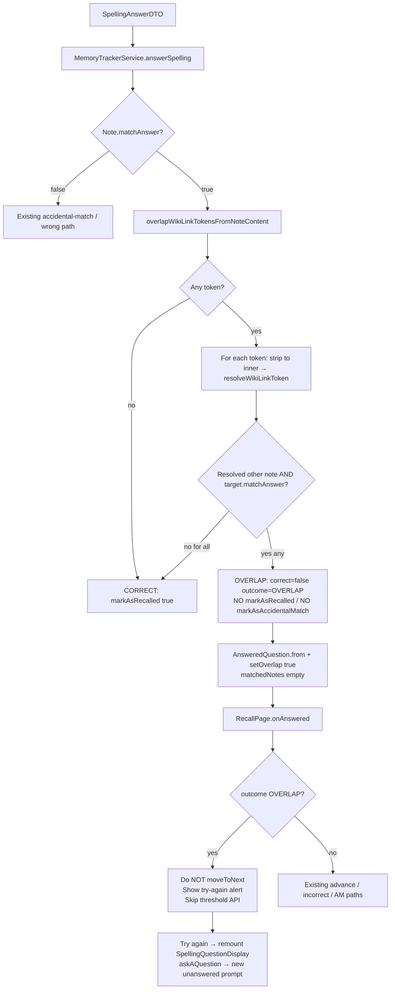

# Phase 6: Overlap "try again, no credit" - Research

**Researched:** 2026-07-24
**Domain:** Spelling recall grading (Spring Boot) + recall queue UX (Vue) — OVL-01
**Confidence:** HIGH

<user_constraints>
## User Constraints (from CONTEXT.md)

### Locked Decisions

#### Overlap trigger gate
- **D-01:** Fire **OVERLAP** only when all of the following hold: (1) `Note.matchAnswer` is **true** for the reviewed note; (2) the reviewed note has one or more overlap wiki-link tokens from `FrontmatterAliases.overlapWikiLinkTokensFromNoteContent`; (3) at least one of those tokens **resolves** to another note; (4) the **same spelling answer also matches** that resolved target note (title or **plain** alias — same exact case-insensitive semantics as `matchAnswer` / accidental-match). If declarations exist but none resolve, or none of the resolved targets also match the answer, grade as normal **CORRECT** with credit. — **Reversibility:** reversible — grading predicate; can widen to “any correct while any declaration exists” later, but that would permanently block credit unless a second success path is invented.
  - Rationale: OVL-01 asks for “another answer” — distinguishing plain aliases (Phase 5 example: `color` beside `[[Other Note]]`) must still be able to earn credit. Dual-match (reviewed + overlap target) is the non-distinguishing case. Dead targets stay authorable (Phase 5 D-04) but do not participate in grading until resolvable.
- **D-02:** Keep Phase 2 **D-06**: when `matchAnswer` is true, **skip** the accidental-match search. Overlap runs only on the correct path; accidental-match remains wrong-path only. Evaluation order: `matchAnswer` → if true, overlap check (D-01) → OVERLAP or CORRECT; if false → existing accidental-match / wrong path. — **Reversibility:** reversible.

#### SRS / Answer.correct / no mutation
- **D-03:** On OVERLAP: set `Answer.correct = false` (sole SRS-credit signal stays false — Phase 1/2 lock), `Answer.outcome = OVERLAP`, and `AnsweredQuestion.overlap = true`. Persist the Answer on the RecallPrompt (audit trail). **Do not** call `markAsRecalled` or `markAsAccidentalMatch` — **zero** SRS mutation (no `recallCount` bump, no forgetting-curve change, no `nextRecallAt` change, no note-content mutation). — **Reversibility:** reversible — scheduling branch; accidental-match already proved a third path can bypass `markAsRecalled(false)`.
  - Rationale: ROADMAP success criteria require no credit and no note-data mutation; applying wrong or partial-fail would punish a technically correct but non-distinguishing answer.
- **D-04:** OVERLAP does **not** count toward the wrong-answer re-assimilation threshold (`hasExceededWrongAnswerThreshold`). It is withheld credit, not a fail. — **Reversibility:** reversible.

#### Retry / queue UX
- **D-05:** After an OVERLAP response, the frontend **must not advance** the recall queue (`RecallPage.onAnswered` must not call `moveToNextMemoryTracker` for `outcome === 'OVERLAP'`). Show the try-again result, then let the user **retry the same memory tracker** (new spelling prompt for that tracker). Do not auto-advance to the next card. — **Reversibility:** reversible — UI/queue branch.
  - Rationale: ROADMAP: “the user simply retries the same review.” Today `onAnswered` always advances then shows incorrect results; OVERLAP needs an explicit stay-and-retry path. Exact “Try again” control vs auto-clear-back-to-input is Claude’s discretion if behavior matches D-05.

#### Result messaging & partner reveal
- **D-06:** Show a **distinct** alert (not success green, not the plain “incorrect” / accidental-match copy) whose substance matches ROADMAP: correct, but looking for another answer — try again. Prefer warning-style chrome so it reads as “almost, distinguish further,” not “you failed.” — **Reversibility:** reversible — copy/CSS only.
- **D-07:** Do **not** reuse the accidental-match **matched-notes section** or offer-link CTAs for OVERLAP. Do **not** require revealing overlap partner notes in this phase. Leave `AnsweredQuestion.matchedNotes` unset/empty for OVERLAP (avoid conflating with `ACCIDENTAL_MATCH` UI). `AnsweredQuestion.overlap = true` is the wire flag. — **Reversibility:** reversible — can add partner reveal later without changing the grading gate.

### Claude's Discretion
- Exact English alert string (must communicate “correct but try a more specific answer”) and DaisyUI alert class (`daisy-alert-warning` vs similar).
- How to resolve overlap wiki-link tokens to notes (reuse `WikiLinkResolver` / `WikiLinkTargetReference` with reviewed note’s notebook as focus; readability filter consistent with accidental-match).
- Exact multi-target rule when several overlap targets also match — any one match is enough to fire OVERLAP (D-01); no need to return them on the wire this phase (D-07).
- Frontend retry mechanic details: clear `currentAnsweredSpelling` and re-show `Quiz` for the same index vs an explicit “Try again” button — as long as the queue does not advance and a new prompt can be answered.
- Whether controller/DTO assembly sets `overlap` on `AnsweredQuestion` beside `from(recallPrompt)`, mirroring Phase 3 `matchedNotes` attachment.
- Test split: backend grading unit/integration + Vitest on `AnsweredSpellingQuestion` / `RecallPage` queue behavior + capability-named E2E (UI hint: yes). Prefer extending existing spelling/overlap fixtures, not phase-numbered names.
- No OpenAPI contract shape change expected (`OVERLAP` / `overlap` already exist from Phase 1); regen only if research finds a gap.

### Deferred Ideas (OUT OF SCOPE)
- Revealing overlap partner notes on the OVERLAP result surface (Phase 3-style) — out of OVL-01; D-07 keeps this phase message + retry only.
- Save-time existence validation for overlap wiki-link targets — Phase 5 D-04 deferred.
- Separate `overlaps:` frontmatter key — rejected for v1.
- MCQ / fuzzy / auto-detected overlap — out of scope / v2.

None of the above were folded into Phase 6; discussion stayed within OVL-01.
</user_constraints>

<phase_requirements>
## Phase Requirements

| ID | Description | Research Support |
|----|-------------|------------------|
| OVL-01 | When a spelling answer is correct for the reviewed note but the reviewed note declares overlap with another note, the system responds "correct, but we're looking for another answer — try again," with no credit. | Dual-match gate in `MemoryTrackerService.answerSpelling`; zero SRS mutation; `AnsweredQuestion.overlap`; warning try-again UI; queue stay-and-retry; durable threshold exclusion for D-04 |
</phase_requirements>

## Summary

Phase 6 wires the Phase 5 declaration seam into live spelling grading. The grading predicate is a **dual-match gate** (reviewed `matchAnswer` + at least one resolved overlap target that also `matchAnswer`s the same spelling). On hit: persist `correct=false` + `outcome=OVERLAP`, set `AnsweredQuestion.overlap=true`, skip both `markAsRecalled` and `markAsAccidentalMatch`, leave `matchedNotes` empty, and return a try-again UI that **does not advance** the recall queue.

The highest-risk seam is **D-04 vs persisted `correct=false`**: `countWrongAnswersSinceForMemoryTracker` counts `qa.correct = false`, while `Answer.outcome` is `@Transient` and never reaches MySQL. Five OVERLAP attempts would otherwise trip re-assimilation. Frontend retry also needs an explicit remount of `SpellingQuestionDisplay` because its `:key` is only `spelling-${memoryTrackerId}` and the prior prompt is already answered.

**Primary recommendation:** Implement overlap on the correct path in `MemoryTrackerService.answerSpelling` using `overlapWikiLinkTokensFromNoteContent` + `WikiLinkResolver.resolveWikiLinkToken` (inner token, focus = reviewed note, readability filter); persist outcome durably enough to exclude OVERLAP from the wrong-count query; special-case `RecallPage.onAnswered` + an explicit Try again remount; mirror accidental-match controller tests and add capability-named E2E.

## Architectural Responsibility Map

| Capability | Primary Tier | Secondary Tier | Rationale |
|------------|-------------|----------------|-----------|
| Dual-match overlap grading | API / Backend | Database / Storage | `MemoryTrackerService.answerSpelling` owns grade + SRS; Answer row is audit trail |
| Resolve declared overlap wiki-links | API / Backend | — | Reuse `WikiLinkResolver` with focus notebook + readability |
| Withhold SRS / threshold semantics | API / Backend | Database / Storage | Zero mark path; wrong-count query must not treat OVERLAP as fail |
| Try-again alert + no matched-notes UI | Browser / Client | — | `AnsweredSpellingQuestion.vue` branches on `outcome` / `overlap` |
| Stay on same memory tracker + new prompt | Browser / Client | API / Backend | `RecallPage` queue control; `getSpellingQuestion` creates new unanswered prompt |
| Auth / readability on resolve | API / Backend | — | Same `userMayReadNotebook` filter as accidental-match resolve |

## Standard Stack

### Core
| Library / Component | Version | Purpose | Why Standard |
|---------------------|---------|---------|--------------|
| Spring Boot + JPA (`MemoryTrackerService`) | repo stack | Spelling grade seam | Existing accidental-match third path pattern [VERIFIED: codebase] |
| `FrontmatterAliases.overlapWikiLinkTokensFrom*` | Phase 5 | Declaration extraction | Locked Phase 5 seam; do not re-parse YAML [VERIFIED: codebase] |
| `WikiLinkResolver.resolveWikiLinkToken` | existing | Resolve overlap targets | Focus notebook + readability already implemented [VERIFIED: codebase] |
| `Note.matchAnswer` | existing | Title/plain-alias match | Dual-match predicate for reviewed + target [VERIFIED: codebase] |
| Vue 3 + DaisyUI (`daisy-alert-warning`) | repo frontend | Try-again chrome | Already used in product alerts; safelisted in `daisyui.css` [VERIFIED: codebase] / [CITED: daisyui.com/llms.txt] |
| Cypress + Cucumber | e2e_test | Observable try-again path | Accidental-match feature is the template [VERIFIED: codebase] |

### Supporting
| Library / Component | Version | Purpose | When to Use |
|---------------------|---------|---------|-------------|
| Flyway (`V30000023x+`) | repo | Persist outcome for D-04 | If durable threshold exclusion chosen (preferred) [VERIFIED: codebase] |
| Vitest browser mode | frontend | Alert + queue behavior | `AnsweredSpellingQuestion.spec.ts`, `RecallPage.spec.ts` [VERIFIED: codebase] |
| Generated OpenAPI client | Phase 1 | `outcome: 'OVERLAP'`, `overlap?: boolean` | Already present — no regen expected [VERIFIED: codebase] |

### Alternatives Considered
| Instead of | Could Use | Tradeoff |
|------------|-----------|----------|
| Persist `outcome` column for D-04 | Soften D-03: persist `correct=true` + wire `outcome=OVERLAP` | Avoids Flyway but **contradicts locked D-03** — escalate / amend CONTEXT instead of implementing |
| Explicit Try again button | Auto-clear result on resume only | Resume-only fails remount unless key nonce added; button is clearer for E2E |
| New overlap search service | Reuse `WikiLinkResolver` | Custom search would duplicate resolve + readability |

**Installation:** None — no new packages.

**Version verification:** N/A (no new packages). Package legitimacy audit skipped.

## Package Legitimacy Audit

> No external packages are installed in this phase.

| Package | Registry | Age | Downloads | Source Repo | Verdict | Disposition |
|---------|----------|-----|-----------|-------------|---------|-------------|
| — | — | — | — | — | — | N/A |

**Packages removed due to [SLOP] verdict:** none
**Packages flagged as suspicious [SUS]:** none

## Architecture Patterns

### System Architecture Diagram



### Recommended Project Structure

```
backend/src/main/java/com/odde/doughnut/
├── services/MemoryTrackerService.java     # overlap branch in answerSpelling
├── services/WikiLinkResolver.java         # resolve reuse (no new search API required)
├── algorithms/FrontmatterAliases.java     # read-only consumer of overlapWikiLinkTokensFrom*
├── controllers/RecallPromptController.java
├── controllers/dto/AnsweredQuestion.java  # setOverlap when assembling
└── entities/Answer.java                   # outcome persistence if D-04 Flyway chosen

frontend/src/
├── pages/RecallPage.vue                   # onAnswered OVERLAP special-case + retry
└── components/recall/AnsweredSpellingQuestion.vue  # warning alert; no matched-notes

e2e_test/features/recall/
└── overlap_try_again.feature              # capability-named (not phase-numbered)
```

### Pattern 1: Correct-path third outcome (mirror accidental-match)
**What:** After `matchAnswer == true`, run overlap dual-match; on hit set outcome and **return early without** `markAsRecalled`. Accidental-match already returns early after `markAsAccidentalMatch`.
**When to use:** Exactly the OVERLAP branch.
**Example:**
```java
// Source: MemoryTrackerService.answerSpelling (accidental-match branch pattern)
Boolean matchesReviewed = note.matchAnswer(spellingAnswer);
Answer answer = new Answer();
answer.setSpellingAnswer(spellingAnswer);
answer.setThinkingTimeMs(answerSpellingDTO.getThinkingTimeMs());
// ... attach + save prompt ...

if (matchesReviewed) {
  if (isNonDistinguishingOverlap(note, spellingAnswer, user)) {
    answer.setCorrect(false);
    answer.setOutcome(AnswerOutcome.OVERLAP);
    // intentionally no markAsRecalled / markAsAccidentalMatch
    return new SpellingAnswerResult(recallPrompt, List.of());
  }
  answer.setCorrect(true);
  markAsRecalled(currentUTCTimestamp, true, memoryTracker, thinkingTimeMs);
  return new SpellingAnswerResult(recallPrompt, List.of());
}
// existing !correct accidental-match / wrong path
```

### Pattern 2: Resolve overlap tokens (inner form)
**What:** Phase 5 returns full tokens `[[Other Note]]`. Callers of `resolveWikiLinkToken` elsewhere pass **inner** titles from `WikiLinkMarkdown.innerTitlesInOccurrenceOrder` / group(1). Passing the bracketed string into `WikiLinkTargetReference.forToken` treats `[[Other Note]]` as a literal title and fails to resolve. [VERIFIED: codebase]
**When to use:** Every overlap resolve.
**Example:**
```java
for (String token : FrontmatterAliases.overlapWikiLinkTokensFromNoteContent(note.getContent())) {
  Matcher m = WikiLinkMarkdown.INNER_LINK_PATTERN.matcher(token);
  if (!m.matches()) continue;
  String inner = m.group(1).trim(); // "Other Note" or "Notebook:Title|display"
  Optional<Note> target = wikiLinkResolver.resolveWikiLinkToken(inner, note, user);
  if (target.isEmpty()) continue;
  Note other = target.get();
  if (other.getId().equals(note.getId())) continue; // another note only
  if (other.matchAnswer(spellingAnswer)) return true; // any one enough
}
return false;
```

### Pattern 3: DTO overlap flag (mirror matchedNotes)
**What:** `AnsweredQuestion.from(recallPrompt, matches)` already attaches `matchedNotes`. Extend assembly so OVERLAP sets `overlap=true` (and leaves matches empty). Prefer controller or a small overload so `from(recallPrompt)` alone stays null for history surfaces unless Answer carries enough signal. [VERIFIED: codebase]

### Anti-Patterns to Avoid
- **Auto-detect overlap from shared titles:** Violates PROJECT + Phase 2 D-06; dead for this phase.
- **Reuse matched-notes / offer-link UI for OVERLAP:** Violates D-07.
- **Call `markAsRecalled(false)` on OVERLAP:** Applies full wrong penalty + 12h — violates D-03.
- **Call `markAsAccidentalMatch` on OVERLAP:** Partial fail + threshold count — violates D-03/D-04.
- **Advance queue then show result (today's incorrect path):** Violates D-05; user lands on next tracker after resume.
- **Pass bracketed `[[Title]]` straight into `resolveWikiLinkToken`:** Silent resolve miss → false CORRECT with credit.
- **Rely on SpellingQuestionDisplay remounting via same `:key`:** Same tracker id → no remount → answers already-answered prompt (`IllegalArgumentException`).

## Don't Hand-Roll

| Problem | Don't Build | Use Instead | Why |
|---------|-------------|-------------|-----|
| Parse aliases YAML for overlap | Ad-hoc YAML | `FrontmatterAliases.overlapWikiLinkTokensFromNoteContent` | Phase 5 ownership; OVL-03 segregation |
| Cross-notebook readable resolve | New search service | `WikiLinkResolver.resolveWikiLinkToken` | Focus notebook + `userMayReadNotebook` already correct |
| Dual title/alias match semantics | Custom equals | `Note.matchAnswer` | Plain-alias-only; wiki-link aliases ignored |
| Accidental-match UI chrome | Copy AM section | Distinct OVERLAP alert only | D-07 |
| OpenAPI shape for OVERLAP | New DTO fields | Existing `outcome` / `overlap` | Phase 1 already regenerated |

**Key insight:** This phase is almost entirely **wiring** existing Phase 1/5 contracts into the Phase 2 grading third-path pattern — the novel work is dual-match resolve, zero-SRS branch, durable threshold exclusion, and queue stay-and-retry remount.

## Common Pitfalls

### Pitfall 1: D-04 threshold pollution (`correct=false` + `@Transient` outcome)
**What goes wrong:** OVERLAP persists `quiz_answer.correct = 0`. `countWrongAnswersSinceForMemoryTracker` counts those rows. Five try-agains trip re-assimilation; later real wrongs trip earlier. Frontend skipping `getThresholdExceeded` is necessary but not sufficient. [VERIFIED: codebase]
**Why it happens:** Phase 1 left `outcome` `@Transient` (no Flyway); D-03 requires `correct=false` + persist.
**How to avoid (preferred):** Promote `Answer.outcome` to a nullable persisted column (Flyway `V300000236+`), write `OVERLAP` on grade, and change the native count query to exclude `outcome = 'OVERLAP'` (treat NULL as today). Keep `matchedNoteId` `@Transient`.
**If schema is blocked (Jidoka):** Escalate — amend CONTEXT before changing D-03. Do **not** silently persist `correct=true` + `outcome=OVERLAP` while D-03 locks `correct=false`.
**Warning signs:** Test “N OVERLAPs do not exceed threshold” fails; re-assimilation dialog after only try-agains.

### Pitfall 2: Bracketed overlap tokens fail resolve
**What goes wrong:** `overlapWikiLinkTokensFrom*` returns `[[Other Note]]`; resolve looks up title `[[Other Note]]` → miss → CORRECT with credit. [VERIFIED: codebase]
**How to avoid:** Strip with `INNER_LINK_PATTERN` group(1) before `resolveWikiLinkToken`.
**Warning signs:** Fixture with live partner note still earns credit on shared title.

### Pitfall 3: Spelling prompt already answered on retry
**What goes wrong:** Stay on same index, clear result, but `SpellingQuestionDisplay` key unchanged → no remount → submits old `recallPromptId` → “already answered”. [VERIFIED: codebase]
**How to avoid:** Explicit **Try again** that clears pause cursor **and** bumps a remount nonce in the spelling `:key` (or force remount another way). `getSpellingQuestion` already creates a new prompt when the previous one is answered.
**Warning signs:** Cypress retry clicks Answer and gets API error / stuck UI.

### Pitfall 4: Accidental-match path regresses
**What goes wrong:** Overlap check runs on wrong path or AM search runs when `matchAnswer` true.
**How to avoid:** Strict order D-02: matchAnswer → overlap → else AM/wrong. Keep Phase 2 skip test green.
**Warning signs:** Shared-title correct answer without declaration becomes OVERLAP or AM.

### Pitfall 5: Progress / threshold side effects on frontend
**What goes wrong:** `onAnswered` always `moveToNextMemoryTracker()` then thresholds on `!correct`. OVERLAP would advance and possibly offer re-assimilation. [VERIFIED: codebase]
**How to avoid:** Branch first on `answer.outcome === 'OVERLAP'` (or `overlap === true`): no advance, show result, skip threshold API.

## Code Examples

### Backend grading order (canonical)
```java
// Evaluation order locked by D-02
Boolean matchesReviewed = note.matchAnswer(spellingAnswer);
if (Boolean.TRUE.equals(matchesReviewed)) {
  if (dualMatchOverlap(note, spellingAnswer, user)) {
    // D-03 OVERLAP — persist answer, zero SRS
  } else {
    // CORRECT — markAsRecalled(true)
  }
} else {
  // existing accidental-match / wrong
}
```

### Frontend alert branch
```vue
<!-- Prefer warning chrome; do not show matched-notes for OVERLAP -->
<div
  class="daisy-alert"
  :class="{
    'daisy-alert-success': answer.correct && answer.outcome !== 'OVERLAP',
    'daisy-alert-warning': answer.outcome === 'OVERLAP',
    'daisy-alert-error': !answer.correct && answer.outcome !== 'OVERLAP',
  }"
  :data-testid="answer.outcome === 'OVERLAP' ? 'overlap-try-again-alert' : ..."
>
```

**Recommended copy (discretion):** `Correct, but we're looking for another answer — try again.` (matches ROADMAP substance; backticks optional for the typed answer if consistency with incorrect/AM is desired).

### Frontend onAnswered sketch
```ts
const onAnswered = async (answerResult: AnsweredQuestion) => {
  const isOverlap =
    answerResult.answer?.outcome === "OVERLAP" || answerResult.overlap === true
  if (isOverlap) {
    previousAnsweredQuestions.value.push(answerResult)
    viewLastAnsweredQuestion(previousAnsweredQuestions.value.length - 1)
    // no moveToNextMemoryTracker; no getThresholdExceeded
    return
  }
  // existing path...
}
```

### Recommended Try again mechanic (discretion — preferred)
1. `AnsweredSpellingQuestion` shows warning alert + button `data-testid="overlap-try-again"` emitting `retry`.
2. `RecallPage` clears `previousAnsweredQuestionCursor`, increments `spellingRetryNonce`.
3. Quiz spelling key becomes `` `spelling-${id}-${spellingRetryNonce}` `` so `SpellingQuestionDisplay` remounts and `askAQuestion` allocates a fresh unanswered prompt.

## State of the Art

| Old Approach | Current Approach | When Changed | Impact |
|--------------|------------------|--------------|--------|
| Binary correct/wrong spelling | Third outcomes AM + OVERLAP | Phases 1–2 / this phase | OVERLAP is credit-withheld retry, not fail |
| Alias list plain-only | Plain + wiki-link overlap declarations | Phase 5 | Grading consumes `overlapWikiLinkTokensFrom*` only now |
| `onAnswered` always advances | OVERLAP stay-and-retry | Phase 6 | New queue branch |

**Deprecated/outdated:**
- Treating shared title while correct as accidental-match — explicitly skipped since Phase 2; remains skipped.

## Assumptions Log

| # | Claim | Section | Risk if Wrong |
|---|-------|---------|---------------|
| A1 | Flyway promote of `outcome` is acceptable inside this Behavior phase to honor D-04 durably | Pitfall 1 | Planner must Jidoka; fallback softens D-03 |

**If Flyway is approved, A1 becomes a locked implementation choice rather than an assumption.**

## Open Questions (RESOLVED)

1. **Durable D-04 vs Phase 1 `@Transient` outcome** — RESOLVED: Use Flyway nullable `outcome` VARCHAR + exclude OVERLAP from `countWrongAnswersSinceForMemoryTracker` (plan 06-02). Keep `matchedNoteId` `@Transient`. Honor locked D-03 `correct=false` + zero mark path. If schema is blocked at Jidoka, escalate to amend CONTEXT — do not silently soften D-03 to `correct=true`.

2. **Self-referential overlap wiki-link** — RESOLVED: Exclude resolved target when `id` equals reviewed note; treat as non-firing for that token (D-01 “another note”; plans 06-01 / 06-03).

## Environment Availability

| Dependency | Required By | Available | Version | Fallback |
|------------|------------|-----------|---------|----------|
| Java / backend tests | Grading tests | ✓ | OpenJDK 24.0.2 | — |
| Node / Vitest | Frontend tests | ✓ | v24.5.0 | — |
| Frontend Vite (5173) | E2E / manual | ✓ | HTTP 200 | Start `pnpm sut` |
| MySQL via sut | Integration / E2E | assume running | — | `pnpm sut:healthcheck` |
| Nix develop | Tooling prefix | ✓ (repo contract) | — | Cloud VM skill only if no Nix |

**Missing dependencies with no fallback:** none identified for planning.

**Step 2.6 note:** External runtime deps are the existing sut stack; no new CLIs.

## Validation Architecture

### Test Framework
| Property | Value |
|----------|-------|
| Framework | JUnit 5 (backend) + Vitest browser (frontend) + Cypress/Cucumber (E2E) |
| Config file | Spring Boot test / `frontend` Vitest / `e2e_test/config/ci.ts` |
| Quick run command | `CURSOR_DEV=true nix develop -c pnpm backend:test_only` and targeted Vitest file |
| Full suite command | `CURSOR_DEV=true nix develop -c pnpm backend:verify` + `pnpm frontend:test` (only when needed) |
| Targeted E2E | `CURSOR_DEV=true nix develop -c pnpm cypress run --spec e2e_test/features/recall/overlap_try_again.feature` |

### Phase Requirements → Test Map
| Req ID | Behavior | Test Type | Automated Command | File Exists? |
|--------|----------|-----------|-------------------|-------------|
| OVL-01 | Dual-match → OVERLAP; dead/unreadable/plain-alias → CORRECT | controller | `pnpm backend:test_only` (extend `RecallPromptControllerTests`) | ❌ Wave 0 — extend existing nested AM suite |
| OVL-01 | Zero SRS mutation (recallCount / curve / nextRecallAt unchanged) | controller | same | ❌ Wave 0 |
| OVL-01 | N OVERLAPs do not trip `isThresholdExceeded` | controller | same | ❌ Wave 0 — **requires D-04 durable fix** |
| OVL-01 | Skip AM when matchAnswer true (regression) | controller | existing test must stay green | ✅ |
| OVL-01 | Warning try-again alert; no matched-notes | Vitest | `pnpm frontend:test tests/components/recall/AnsweredSpellingQuestion.spec.ts` | ❌ Wave 0 — extend |
| OVL-01 | Queue does not advance; retry remounts spelling | Vitest | `pnpm frontend:test tests/pages/RecallPage.spec.ts` | ❌ Wave 0 — extend |
| OVL-01 | E2E: shared answer try-again; distinguishing alias credits | E2E | `pnpm cypress run --spec e2e_test/features/recall/overlap_try_again.feature` | ❌ Wave 0 |

### Sampling Rate
- **Per task commit:** targeted backend nested tests or single Vitest file
- **Per wave merge:** `backend:test_only` + touched Vitest files
- **Phase gate:** targeted E2E green; remove `@wip` when pass; no full E2E suite unless asked

### Wave 0 Gaps
- [ ] Controller tests for OVERLAP dual-match / dead target / plain distinguishing alias / zero SRS / threshold exclusion (extend `RecallPromptControllerTests` accidental-match nested class or sibling)
- [ ] Vitest: OVERLAP alert + no matched-notes section
- [ ] Vitest: `RecallPage` OVERLAP does not advance + Try again remount
- [ ] E2E feature + steps + page object (`overlap-try-again-alert`) — tag `@wip` until green
- [ ] If Flyway chosen: migration + repository count query test

## Security Domain

### Applicable ASVS Categories

| ASVS Category | Applies | Standard Control |
|---------------|---------|-----------------|
| V2 Authentication | no | Existing logged-in gate on answer-spelling |
| V3 Session Management | no | — |
| V4 Access Control | yes | `resolveWikiLinkToken` → `userMayReadNotebook`; never surface unreadable partners (D-07 anyway leaves matchedNotes empty) |
| V5 Input Validation | yes | Spelling string via existing DTO; overlap tokens already authored-validated in Phase 5 |
| V6 Cryptography | no | — |

### Known Threat Patterns for this stack

| Pattern | STRIDE | Standard Mitigation |
|---------|--------|---------------------|
| IDOR via overlap partner note ids | Information Disclosure | Do not return partner notes (D-07); resolve uses readability filter |
| Threshold gaming / false re-assimilation | Elevation / Tampering of learning state | Exclude OVERLAP from wrong-count (D-04) |
| Treating wiki-link alias as searchable match | Tampering of grade | Plain-only `matchAnswer` (Phase 5 OVL-03) |

## Project Constraints (from .cursor/rules/)

- Run tooling via `CURSOR_DEV=true nix develop -c …`; git needs no Nix prefix.
- Behavior vs Structure: this is a **Behavior** phase (one observable behavior: OVL-01 try-again no credit). Minimal structure (e.g. Flyway for D-04) only if required for that behavior.
- Capability-named tests/artifacts — no `phase-6` in product/test names.
- Prefer controller-level backend behavior tests with `makeMe`; avoid 1:1 service test mirroring.
- Frontend: DaisyUI `daisy-*` classes; Vitest browser mode; `data-testid` selectors; mock SDK via `mockSdkService`.
- E2E: targeted `--spec` only; `@wip` until green; pair busy UI with `waitUntilAppIsNotBusy`.
- Assume `pnpm sut` may be running; do not nag restart.
- After phase: Jidoka → post-change-refactor → update plan → commit+push (execute wrap-up).
- Flyway versions must exceed `300000230` (recent repairs already at `V300000235`).
- Do not hand-edit generated OpenAPI client; regen only if contract gap found (none expected).

## Discretion Recommendations (for planner)

| Discretion item | Preferred recommendation |
|-----------------|--------------------------|
| Alert string | `Correct, but we're looking for another answer — try again.` |
| Alert class | `daisy-alert daisy-alert-warning` + `data-testid="overlap-try-again-alert"` |
| Resolve strategy | Strip brackets → `resolveWikiLinkToken(inner, reviewedNote, user)`; exclude self; any dual-match fires |
| Multi-target | Short-circuit on first dual-match; do not populate `matchedNotes` |
| Retry UX | Explicit **Try again** button + remount nonce (not advance-on-resume alone) |
| `overlap` flag assembly | Set in controller/DTO path when `outcome == OVERLAP` (mirror `matchedNotes` overload) |
| Test split | Controller (grade/SRS/threshold) + Vitest (alert + queue) + E2E (happy path distinguishing alias) |
| OpenAPI | No regen unless gap discovered |
| D-04 durable | Flyway persist `outcome` + exclude from count (escalate if schema blocked — do not soften D-03) |

## Sources

### Primary (HIGH confidence)
- Codebase: `MemoryTrackerService.answerSpelling`, `FrontmatterAliases`, `WikiLinkResolver`, `RecallPage.onAnswered`, `AnsweredSpellingQuestion.vue`, `RecallPromptRepository.countWrongAnswersSinceForMemoryTracker`, Phase 1/2/5 CONTEXT + SUMMARY
- [CITED: daisyui.com/llms.txt] — alert status colors include warning

### Secondary (MEDIUM confidence)
- `.planning/PROJECT.md` / `ROADMAP.md` Phase 6 success criteria

### Tertiary (LOW confidence)
- None material

## Metadata

**Confidence breakdown:**
- Standard stack: HIGH — brownfield reuse only
- Architecture: HIGH — seams and evaluation order verified in source
- Pitfalls: HIGH — threshold pollution and remount landmines verified in source

**Research date:** 2026-07-24
**Valid until:** 2026-08-24 (stable brownfield; re-check if Answer persistence model changes)
