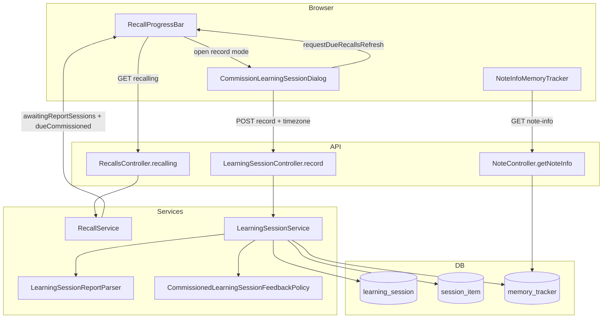

# Phase 6: Record report and schedule - Research

**Researched:** 2026-08-08
**Domain:** Learning Session Report recording — parse ADR 0005 markdown, persist Feedback on Session Items, reschedule commissioned trackers per ADR 0003, recall-progress-bar UI + assimilation feedback display
**Confidence:** HIGH

## Summary

Phase 6 delivers one **Behavior**: the learner pastes a **Learning Session Report** into an **awaiting-report** session; Doughnut records **Feedback** on matched Session Items, **reschedules** commissioned trackers per ADR 0003, and marks the session **RECORDED** (REC-01–REC-05).

**Backend today:** `LearningSessionService` and `LearningSessionController` expose **commission only** — `POST /api/learning-sessions/commission` creates an `AWAITING_REPORT` session and returns `{ learningSessionId, requestMarkdown, status }` `[VERIFIED: backend/src/main/java/com/odde/doughnut/services/LearningSessionService.java:36-60]`, `[VERIFIED: backend/src/main/java/com/odde/doughnut/controllers/LearningSessionController.java:47-64]`. `SessionItem` already persists `feedbackScore` and `feedbackRecordedAt` `[VERIFIED: backend/src/main/java/com/odde/doughnut/entities/SessionItem.java:29-33]`. `RecallService.getDueMemoryTrackers` excludes trackers in awaiting-report sessions from `dueCommissioned` but does **not** yet expose awaiting sessions for re-open `[VERIFIED: backend/src/main/java/com/odde/doughnut/services/RecallService.java:78-97]`. **No** report parser, **no** record endpoint, **no** commissioned-feedback scheduling path exists yet (`grep` for `recordCommissioned` / `LearningSessionReportParser` — empty).

**Frontend today:** `CommissionLearningSessionDialog.vue` handles commission + readonly Request + awaiting banner; no report textarea or record CTA `[VERIFIED: frontend/src/components/recall/CommissionLearningSessionDialog.vue:12-48]`. `RecallProgressBar.vue` has potential-session strip only — no awaiting-report strip `[VERIFIED: frontend/src/components/recall/RecallProgressBar.vue:60-92]`. `NoteInfoMemoryTracker.vue` shows commissioned type but **no** tutor feedback score `[VERIFIED: frontend/src/components/notes/NoteInfoMemoryTracker.vue:38-41]`.

**Primary recommendation:** Add `POST /api/learning-sessions/record` with notebook-scoped partial success; pure `LearningSessionReportParser` (unit-test primary for REC-05); `CommissionedLearningSessionFeedbackPolicy` in `algorithms/` + `MemoryTracker.recordCommissionedFeedback()` applying ADR 0003 shifted-band; extend `DueMemoryTrackers` with `awaitingReportSessions`; extend dialog in place + awaiting-report strip; add `latestTutorFeedbackScore` on `MemoryTracker` wire shape for assimilation settings; graduate one E2E scenario `@wip` until green.

<user_constraints>
## User Constraints (from CONTEXT.md)

### Locked Decisions

#### Report entry surface
- **D-01:** Extend **`CommissionLearningSessionDialog.vue`** in place — add a **post-commission / record** state with an editable **report textarea** and primary **Record report** CTA below the readonly Request. Same `Modal` + DaisyUI patterns as Phase 5; do not introduce a separate dialog component. — **Reversibility:** reversible — UI refactor only
- **D-02:** Report paste is **plain markdown text** in a `daisy-textarea` (`font-mono text-xs`, same family as Request display). No file upload, no rich editor, no `v-html`. — **Reversibility:** reversible

#### Awaiting-session discovery (re-open after commission)
- **D-03:** After Phase 5, due commissioned trackers in **AWAITING_REPORT** sessions are excluded from `dueCommissioned`, so the potential-session row disappears. Add a sibling **awaiting-report strip** on `RecallProgressBar` (same column as potential sessions): one row per notebook with an `AWAITING_REPORT` session, glossary copy `1 learning session awaiting the tutor's report for notebook "{name}"`, and a **`Record report`** `daisy-btn-primary` that opens the dialog in **record mode** for that notebook. — **Reversibility:** reversible — additive UI + API field
- **D-04:** Expose **`awaitingReportSessions`** on the existing recalling / `DueMemoryTrackers` load path (notebook id, name, `learningSessionId`, optional `requestMarkdown` for dialog prefill). One round-trip with ordinary recall data; no separate sessions list page. — **Reversibility:** reversible — additive DTO field

#### Record API contract
- **D-05:** Add **`POST /api/learning-sessions/record`** (name at planner discretion) accepting `{ notebookId, reportMarkdown }` + `timezone` query. Resolve the user's single **AWAITING_REPORT** session for that notebook; return structured result `{ status, recordedAt, recordedItems, rejectedEntries }`. Notebook-scoped, symmetric with commission — **Reversibility:** costly — published OpenAPI contract
- **D-06:** **Partial success** per ADR 0005: matched 0–5 integer scores are recorded and trackers rescheduled; unmatched titles and out-of-range scores are **rejected** and returned in `rejectedEntries` without rolling back matched items. Session moves to **RECORDED** when at least one item received Feedback; if zero matches, session stays **AWAITING_REPORT** (planner may refine edge copy). — **Reversibility:** one-way — persistence + schedule side effects

#### Report parsing (backend)
- **D-07:** Implement **`LearningSessionReportParser`** (or equivalent pure helper) following ADR 0005 Report shape: `# Learning Session Report` header optional; lines `Note title: score` (tolerate trailing prose after score per ADR). Match Session Items by **note title** within the session's notebook; duplicate titles in one notebook → reject as unmatched (never guess). — **Reversibility:** reversible — internal module
- **D-08:** **REC-05 / unit-test primary:** reject unknown titles, non-integer scores, scores outside 0–5, and duplicate-title ambiguity. Do **not** add E2E scenarios for parse edge cases (REQUIREMENTS out-of-scope; `@wip` cap).

#### Scheduling from score
- **D-09:** On each matched Session Item, apply ADR 0003 **commissioned learning session feedback** shifted-band mapping to the commissioned tracker's memory state: increment `recallCount`, set `lastRecalledAt`, schedule `nextRecallAt` via the normal interval path (no incorrect-recall relearning override). Score **5** must schedule **longer** than score **1** on the same starting state — E2E day-3 recommission lists only **Gracias**. — **Reversibility:** one-way — schedule mutations
- **D-10:** Persist Feedback on **`session_item`** (`feedbackScore`, `feedbackRecordedAt` — columns already exist). Set `learning_session.status = RECORDED` and `recordedAt` when recording succeeds with ≥1 match. — **Reversibility:** one-way

#### Feedback visibility (REC-03)
- **D-11:** Show the **latest tutor feedback score** on the **commissioned** memory tracker in **assimilation settings** (`NoteInfoMemoryTracker` or sibling row): copy pattern `tutor feedback score {n} from a learning session` with `data-test="tutor-feedback-score-{n}"` or equivalent page-object-friendly marker so E2E step `I should see tutor feedback score 5 from a learning session for the memory tracker of note "Hola"` passes. Expose score via **MemoryTracker API shape** (new field or embedded lite) populated from latest recorded Session Item for that tracker. — **Reversibility:** costly — API + UI contract

#### Recorded session marking (REC-04)
- **D-12:** After successful record, dialog shows informational banner `This learning session is recorded.` with `data-test="learning-session-recorded"`; hide awaiting banner. Awaiting-report strip row for that notebook disappears on `requestDueRecallsRefresh()`. No separate open-sessions list UI in MVP — **Reversibility:** reversible
- **D-13:** E2E assertion `the learning session for notebook "{title}" should be marked as recorded` checks dialog recorded banner and/or API status after record step (planner picks one stable observable). — **Reversibility:** reversible

#### E2E scope
- **D-14:** Graduate **only** scenario `"Recording the tutor's report schedules each tracker from its score"` from `.planning/phases/01-commissioned-tracker-model/commissioned_learning_session.feature` into `e2e_test/features/learning_session/commissioned_learning_session.feature` (`@wip` until green). **Do not** graduate amend scenario (Phase 7). — **Reversibility:** reversible
- **D-15:** Add step definitions + page-object methods for: Given commissioned session (testability API or UI commission), When paste report + record, Then recorded status, recall counts on commissioned trackers, tutor feedback score in assimilation settings, and day-3 recommission asserting **only Gracias** in Request. — **Reversibility:** reversible

### Claude's Discretion

- Exact parser regex / line-splitting and whether to strip markdown headings
- Service method names and response DTO field names (must regenerate OpenAPI)
- Whether `requestMarkdown` is re-fetched on record-mode dialog open vs carried from `awaitingReportSessions` payload
- Tracer vs expansion plan split (single tracer covering record API + dialog + one E2E is viable)
- Unit-test file placement for parser vs controller vs scheduling policy

### Deferred Ideas (OUT OF SCOPE)

- Amend recorded session (re-paste Report updates Feedback) — Phase 7 (AMD-01); amend recomputation policy still Jidoka in plan-phase 7
- Open-sessions list showing all recorded sessions across notebooks — out of MVP (REC-04 satisfied by dialog + status enum)
- Descriptive Feedback prose stored or displayed — v2 (PROT-01)
- GET learning session by id as a standalone product surface — only if record flow needs it; prefer notebook-scoped record POST + recalling payload

None beyond roadmap — discussion stayed within phase scope.
</user_constraints>

<phase_requirements>
## Phase Requirements

| ID | Description | Research Support |
|----|-------------|------------------|
| REC-01 | User can paste a Learning Session Report into a Learning Session and record it | Extend dialog with editable report textarea + `Record report` CTA; `POST /api/learning-sessions/record`; awaiting-report strip re-opens dialog in record mode |
| REC-02 | Recording applies Feedback score to each matched Session Item and reschedules commissioned tracker per ADR 0003 | `LearningSessionReportParser` + `CommissionedLearningSessionFeedbackPolicy` + `MemoryTracker.recordCommissionedFeedback()`; controller/service transaction |
| REC-03 | Recorded Feedback score is visible on the commissioned memory tracker | `latestTutorFeedbackScore` on `MemoryTracker` JSON (populated in `NoteController.getNoteInfo` path); `NoteInfoMemoryTracker` row with `data-test="tutor-feedback-score-{n}"` |
| REC-04 | A Learning Session that has recorded Feedback is visibly marked among sessions | Dialog `data-test="learning-session-recorded"` banner; awaiting strip removal after refresh |
| REC-05 | Matched entries recorded; unmatched/out-of-range rejected and reported (unit-test primary) | `LearningSessionReportParserTest` + `LearningSessionControllerTests.Record`; dialog `daisy-alert-warning` for rejections; **no** new E2E parse scenarios |
</phase_requirements>

## Architectural Responsibility Map

| Capability | Primary Tier | Secondary Tier | Rationale |
|------------|-------------|----------------|-----------|
| Parse Report markdown | API / Backend | — | Pure `LearningSessionReportParser`; no client-side parsing |
| Record mutation + partial success | API / Backend | — | `LearningSessionService.record` + `LearningSessionController` POST |
| ADR 0003 score → schedule | API / Backend | — | Policy in `algorithms/`; applied on `MemoryTracker` entity |
| Persist Feedback on Session Item | Database / Storage | API / Backend | Columns exist; service sets scores + timestamps |
| `awaitingReportSessions` feed | API / Backend | Browser / Client | `RecallService` → `DueMemoryTrackers` via `RecallsController.recalling` |
| Report textarea + record CTA | Browser / Client | API / Backend | Extend `CommissionLearningSessionDialog.vue` |
| Awaiting-report strip + re-open | Browser / Client | API / Backend | `RecallProgressBar.vue` sibling to potential-session strip |
| Tutor feedback score display | Browser / Client | API / Backend | `NoteInfoMemoryTracker.vue` reads `MemoryTracker` field from note-info API |
| OpenAPI / SDK regeneration | Build / tooling | — | `generate-api-client` skill after new endpoints + fields |

## Standard Stack

### Core

| Library / layer | Version | Purpose | Why Standard |
|-----------------|---------|---------|--------------|
| Spring Boot + JPA | repo backend | Record service, transactions, repositories | Same as `LearningSessionService.commission` |
| `LearningSessionController` | existing | Add `record` beside `commission` | Symmetric notebook-scoped POST pattern |
| `RecallService` / `RecallsController` | existing | Add `awaitingReportSessions` to `DueMemoryTrackers` | One round-trip with recall load `[VERIFIED: frontend/src/composables/useRecallPageLoading.ts:50-57]` |
| `CommissionLearningSessionDialog.vue` | existing | Commission + record modes in one Modal | Locked D-01 |
| `apiCallWithLoading` + `timezoneParam()` | repo frontend | Record mutation + blockUi | `frontend-api.mdc` |
| `@generated/doughnut-backend-api` | regenerated | `LearningSessionController.record`, updated `DueMemoryTrackers`, `MemoryTracker` | Never hand-edit SDK |
| JUnit + MakeMe | repo backend | Parser, policy, controller tests | `backend-testing.mdc` / `unit-testing.mdc` |
| Vitest browser mode | repo frontend | Dialog record flow | `CommissionLearningSessionDialog.spec.ts` pattern |
| Cypress + Cucumber | repo | One graduated recording scenario `@wip` | `e2e_test/features/learning_session/` |

### Supporting

| Asset | When to Use |
|-------|-------------|
| `LearningSessionRequestMarkdownBuilder` | Optional `requestMarkdown` in `awaitingReportSessions` payload |
| `SessionItemRepository.summarizeRecordedFeedbackByMemoryTrackerId` | Pattern for feedback history; add **latest score** query for REC-03 |
| `useRecallData.requestDueRecallsRefresh` | After successful record — reload strips |
| `waitUntilAppIsNotBusy()` | E2E after record click |
| `generate-api-client` skill | After OpenAPI changes |

### Alternatives Considered

| Instead of | Could Use | Tradeoff |
|------------|-----------|----------|
| Extend commission dialog | New `RecordLearningSessionReportDialog.vue` | Rejected in CONTEXT — duplicates Modal patterns |
| Record by `learningSessionId` | Notebook-scoped POST | Conflicts with ADR 0005 (no session id in protocol) |
| All-or-nothing record | Partial success per ADR 0005 | Rejected — breaks protocol |
| Client-side parse | Backend parser only | Security + single source of truth |
| Separate sessions page | Progress-bar strip | Out of MVP REC-04 |

**Installation:** None — no new npm/Maven packages.

**Version verification:** N/A (in-repo stack only).

## Package Legitimacy Audit

> No external packages are installed in this phase.

| Package | Registry | Verdict | Disposition |
|---------|----------|---------|-------------|
| — | — | — | N/A |

**Packages removed due to [SLOP] verdict:** none
**Packages flagged as suspicious [SUS]:** none

## Architecture Patterns

### System Architecture Diagram



### Recommended Project Structure

```
backend/src/main/java/com/odde/doughnut/
├── algorithms/
│   └── CommissionedLearningSessionFeedbackPolicy.java   # pure ADR 0003 score→index math
├── services/
│   ├── LearningSessionReportParser.java                 # pure parse (or algorithms/)
│   └── LearningSessionService.java                      # + record()
├── controllers/
│   ├── LearningSessionController.java                   # + POST /record
│   └── dto/
│       ├── RecordLearningSessionRequest.java
│       ├── RecordLearningSessionResponse.java
│       └── AwaitingReportLearningSessionLite.java
├── entities/
│   └── MemoryTracker.java                               # + recordCommissionedFeedback()
frontend/src/
├── components/recall/
│   ├── CommissionLearningSessionDialog.vue                # + record mode
│   └── RecallProgressBar.vue                            # + awaiting-report strip
├── components/notes/
│   └── NoteInfoMemoryTracker.vue                        # + tutor feedback row
├── composables/
│   ├── useRecallData.ts                                 # + awaitingReportSessions computed
│   └── useRecallPageLoading.ts                          # wire new DTO field
e2e_test/
├── features/learning_session/commissioned_learning_session.feature  # + recording scenario @wip
├── step_definitions/learning_session.ts                 # + record steps
└── start/pageObjects/recallPage.ts                      # + record page-object methods
```

### Pattern 1: Notebook-scoped record POST (symmetric with commission)

**What:** Mirror `commission` authorization and notebook lookup; resolve single `AWAITING_REPORT` session; parse report; apply matches; return partial result.

**When to use:** All record mutations.

**Example:**

```java
// Pattern source: LearningSessionController.commission + LearningSessionService.commission
@PostMapping("/record")
@Transactional
public RecordLearningSessionResponse record(
    @RequestBody RecordLearningSessionRequest body,
    @RequestParam(value = "timezone") String timezone)
    throws UnexpectedNoAccessRightException {
  authorizationService.assertLoggedIn();
  Notebook notebook = notebookRepository.findById(body.notebookId)
      .orElseThrow(() -> new ResponseStatusException(HttpStatus.NOT_FOUND, "Notebook not found."));
  authorizationService.assertAuthorization(notebook);
  return learningSessionService.record(
      authorizationService.getCurrentUser(), notebook, body.reportMarkdown,
      testabilitySettings.getCurrentUTCTimestamp(), TimezoneUtils.parseTimezone(timezone));
}
```

### Pattern 2: Pure report parser (REC-05 unit boundary)

**What:** Line-oriented parser; no Spring dependencies; returns structured parse result with `matched` and `rejected` lists.

**When to use:** All parse logic; test without DB.

**Example:**

```java
// ADR 0005 example lines:
// Hola: 5
// Gracias: 1  (trailing prose tolerated)
public record ParsedReportEntry(String noteTitle, int score) {}
public record RejectedReportEntry(String line, String reason) {}
public record ParseResult(List<ParsedReportEntry> entries, List<RejectedReportEntry> rejected) {}
```

**Matching rules (locked):**
- Skip blank lines and optional `# Learning Session Report` header
- Match `^(.+?):\s*(\d+)(?:\s+.*)?$` per line (discretion on exact regex)
- Map title → `SessionItem.noteTitle` for items in the target session
- If notebook has **duplicate note titles**, reject any line whose title is ambiguous
- Unknown title → `rejectedEntries`
- Score not in 0–5 or non-integer → `rejectedEntries`

### Pattern 3: Commissioned feedback scheduling (ADR 0003)

**What:** New policy class computes new `forgettingCurveIndex`; `MemoryTracker` applies it and sets schedule fields.

**When to use:** Each matched Session Item on record.

**Policy table** (from ADR 0003 — assert **schedule movement**, not internal index):

| Score | Effect on accumulated strength (index − 100) |
|-------|-----------------------------------------------|
| 5 | Successful recall, growth **+20%** above standard increment (10 → 12) |
| 4 | Standard growth (+10) |
| 3 | Growth **−20%** (+8) |
| 2 | No growth; accumulated strength **−20%** |
| 1 | No growth; accumulated strength **−50%** |
| 0 | Reset to initial level (index = 100) |

**Apply on tracker** (all scores):
1. `recallCount++`
2. `lastRecalledAt = now`
3. Update `forgettingCurveIndex` via policy
4. `nextRecallAt = calculateNextRecallAt()` using normal `SpacedRepetitionAlgorithm` path
5. **Never** call `recallFailed()` / relearning override
6. **Never** leave `nextRecallAt` at `now` — first positive interval only (ADR 0003 §5)

**Existing hooks** `[VERIFIED: backend/src/main/java/com/odde/doughnut/entities/MemoryTracker.java:153-185]`:

```java
public Timestamp calculateNextRecallAt() { ... }
public void markAsRecalled(Timestamp currentUTCTimestamp, boolean successful, Integer thinkingTimeMs) { ... }
```

Recommend **new** `recordCommissionedFeedback(Timestamp now, int score)` rather than overloading `markAsRecalled` — commissioned feedback is not boolean correct/incorrect.

### Pattern 4: Dialog dual mode (extend Phase 5)

**What:** Add props `mode: 'commission' | 'record'` and optional `initialRequestMarkdown`; after commission success, show report textarea in same view (user may record without closing).

**Record mode open paths:**
1. Post-commission inline (textarea below awaiting banner)
2. Awaiting-report strip → `Record report` button → dialog opens with Request prefilled from `awaitingReportSessions`

**API call:**

```typescript
await apiCallWithLoading(
  () => LearningSessionController.record({
    body: { notebookId: props.notebookId, reportMarkdown: reportMarkdown.value },
    query: { timezone: timezoneParam() },
  }),
  { blockUi: true, message: "Recording learning session report…" }
)
```

### Pattern 5: `awaitingReportSessions` on recalling payload

**What:** New DTO list on `DueMemoryTrackers`; `RecallService` queries `LearningSessionRepository.findByUser_IdAndStatus(AWAITING_REPORT)` grouped by notebook (at most one per notebook per commission abandon rules).

**Suggested shape:**

```java
public class AwaitingReportLearningSessionLite {
  private Integer notebookId;
  private String notebookName;
  private Integer learningSessionId;
  private String requestMarkdown; // optional prefill
}
```

**Frontend:** `useRecallData` computed `awaitingReportSessions`; `RecallProgressBar` strip with `data-test="awaiting-report-learning-session"` and `data-test="record-learning-session-report"` button.

### Anti-Patterns to Avoid

- **Parsing in the frontend:** REC-05 and security require server-side parse + validation.
- **Reusing `markAsRecalled(false)` for low scores:** ADR 0003 forbids incorrect-recall relearning override for commissioned feedback.
- **All-or-nothing `@Transactional` rollback on any reject:** Violates ADR 0005 partial acceptance.
- **New dialog component:** Locked D-01 forbids.
- **E2E for every parse edge case:** Locked D-08; burns `@wip` cap.

## Don't Hand-Roll

| Problem | Don't Build | Use Instead | Why |
|---------|-------------|-------------|-----|
| Markdown report parsing | Ad-hoc split in service | `LearningSessionReportParser` pure class | REC-05 test matrix; ADR edge cases |
| Score→interval math | Inline controller math | `CommissionedLearningSessionFeedbackPolicy` + `ForgettingCurve` / `SpacedRepetitionAlgorithm` | ADR 0003 policy tests; shares spacing with recall |
| HTTP client for record | `fetch` wrapper | Generated `LearningSessionController.record` + `apiCallWithLoading` | `frontend-api.mdc` |
| Clipboard / loading | Custom | Existing `CopyButton`, `apiCallWithLoading` | Phase 5 patterns |
| Latest feedback query | N+1 in UI | `SessionItemRepository` JPQL `MAX(feedbackRecordedAt)` per tracker | Single note-info load |

**Key insight:** Commission and record are a symmetric notebook-scoped pair; keep both on `LearningSessionService`/`LearningSessionController` and one dialog.

## Common Pitfalls

### Pitfall 1: Awaiting session unreachable after commission

**What goes wrong:** E2E Given `I have commissioned a learning session…` fails because potential-session row disappeared and no re-open path exists.

**Why it happens:** Phase 5 excludes awaiting trackers from `dueCommissioned` `[VERIFIED: RecallService.java:78-83]`.

**How to avoid:** Ship `awaitingReportSessions` strip + record-mode dialog open (D-03, D-04) **before** or **with** E2E graduation.

**Warning signs:** Cypress cannot find commission or record affordance after commission step.

### Pitfall 2: Zero-match record marks session RECORDED

**What goes wrong:** Session stuck or wrongly closed; learner loses awaiting state.

**Why it happens:** Misread D-06 — session stays `AWAITING_REPORT` when zero matches.

**How to avoid:** Controller test: all lines rejected → status unchanged, no `recordedAt`.

### Pitfall 3: Score 0 leaves tracker due immediately

**What goes wrong:** Violates ADR 0003 §5; breaks day-3 divergence test.

**Why it happens:** Reset index to 100 without enforcing first **positive** interval in user's spacing list.

**How to avoid:** Policy test: after score 0, `nextRecallAt > recordedAt`; compare intervals for scores 5 vs 1 from identical start state.

### Pitfall 4: Duplicate notebook titles silently match wrong note

**What goes wrong:** Wrong tracker gets feedback.

**Why it happens:** Title-only matching without ambiguity check.

**How to avoid:** Count notes with same title in notebook; reject line if count > 1 (D-07).

### Pitfall 5: Forgetting OpenAPI regeneration

**What goes wrong:** Frontend compile errors; E2E type drift.

**How to avoid:** Run `generate-api-client` skill after backend DTO + endpoint land.

### Pitfall 6: `@wip` cap on E2E

**What goes wrong:** CI skips new scenarios.

**How to avoid:** Graduate **one** recording scenario; keep parse edges in JUnit only (D-08, D-14).

## Code Examples

### Existing commission response (extend, do not fork)

```java
// [VERIFIED: LearningSessionService.java:89-96]
private LearningSessionCommissionResponse toCommissionResponse(
    LearningSession session, ZoneId zoneId) {
  LearningSessionCommissionResponse response = new LearningSessionCommissionResponse();
  response.setLearningSessionId(session.getId());
  response.setRequestMarkdown(learningSessionRequestMarkdownBuilder.build(session, zoneId));
  response.setStatus(session.getStatus());
  return response;
}
```

### LearningSessionStatus values

```java
// [VERIFIED: backend/src/main/java/com/odde/doughnut/entities/LearningSessionStatus.java:3-6]
public enum LearningSessionStatus {
  AWAITING_REPORT,
  RECORDED
}
```

### SessionItem feedback columns

```java
// [VERIFIED: backend/src/main/java/com/odde/doughnut/entities/SessionItem.java:29-33]
@Column(name = "feedback_score")
private Integer feedbackScore;

@Column(name = "feedback_recorded_at")
private Timestamp feedbackRecordedAt;
```

### E2E recording scenario (graduate verbatim)

```gherkin
# Source: .planning/phases/01-commissioned-tracker-model/commissioned_learning_session.feature:48-63
Scenario: Recording the tutor's report schedules each tracker from its score
  Given I have commissioned a learning session for notebook "Spanish conversation" on day 2 with session items for notes "Hola, Gracias"
  When I record the learning session report for the learning session of notebook "Spanish conversation":
    """
    # Learning Session Report

    Hola: 5
    Gracias: 1
    """
  Then the learning session for notebook "Spanish conversation" should be marked as recorded
  And the commissioned memory tracker for "Hola" should have recall count 1
  And the commissioned memory tracker for "Gracias" should have recall count 1
  And I should see tutor feedback score 5 from a learning session for the memory tracker of note "Hola"
  When It's day 3, 9 hour
  And I commission a learning session for notebook "Spanish conversation"
  Then the learning session request should list session items for notes "Gracias"
```

### NoteInfoMemoryTracker — commissioned row (extend)

```vue
<!-- [VERIFIED: frontend/src/components/notes/NoteInfoMemoryTracker.vue:38-41] -->
if (type === "COMMISSIONED") {
  return "Commissioned"
}
<!-- Add: tutor feedback score row when latestTutorFeedbackScore present -->
```

## State of the Art

| Old Approach | Current Approach | When Changed | Impact |
|--------------|------------------|--------------|--------|
| Commission only (Phase 4–5) | Commission + record loop | Phase 6 | Closes ADR 0005 feedback loop |
| `dueCommissioned` only | + `awaitingReportSessions` | Phase 6 | Re-open awaiting sessions |
| No feedback on tracker API | `latestTutorFeedbackScore` on MemoryTracker | Phase 6 | REC-03 |

**Deprecated/outdated:**
- Expecting record flow in a separate dialog — rejected in `06-DISCUSSION-LOG.md`

## Assumptions Log

| # | Claim | Section | Risk if Wrong |
|---|-------|---------|---------------|
| A1 | At most one `AWAITING_REPORT` session per user+notebook at record time (enforced by `abandonUnfinishedSessions` on recommission) | Record API | Wrong session resolved if invariant breaks |
| A2 | Note titles are unique within a notebook in practice (ADR 0005 prerequisite) | Parser | Duplicate-title reject path rarely hit in E2E |
| A3 | `requestMarkdown` in `awaitingReportSessions` is sufficient prefill (no mandatory GET session) | Dialog | Extra API round-trip if builder output must be fresh |

**If planner needs confirmation:** A3 — prefer carrying `requestMarkdown` from recalling payload (DISCUSSION-LOG recommended) unless builder is expensive.

## Open Questions

1. **E2E Given: commission via UI vs testability API**
   - What we know: Draft step `Given I have commissioned a learning session…` does not exist yet; UI commission + close dialog requires awaiting strip for re-open.
   - What's unclear: Whether to add backend testability endpoint for faster Given.
   - Recommendation: **UI commission in Given** (exercises real strip) OR commission and keep dialog open in same step — matches Behavior phase; avoid new testability surface unless E2E flakiness observed.

2. **`requestMarkdown` prefill source**
   - Recommendation: Include in `awaitingReportSessions` from `LearningSessionRequestMarkdownBuilder.build` — one recalling round-trip (D-04).

## Environment Availability

**Step 2.6: SKIPPED** — no new external dependencies; uses existing Nix/MySQL/Cypress stack (`pnpm sut` assumed per repo rules).

## Validation Architecture

### Test Framework

| Property | Value |
|----------|-------|
| Backend framework | JUnit 5 + Spring Boot Test |
| Backend quick run | `CURSOR_DEV=true nix develop -c pnpm backend:test_only` |
| Frontend framework | Vitest browser mode |
| Frontend quick run | `CURSOR_DEV=true nix develop -c pnpm frontend:test` |
| E2E framework | Cypress + Cucumber |
| E2E targeted run | `CURSOR_DEV=true nix develop -c pnpm cypress run --spec e2e_test/features/learning_session/commissioned_learning_session.feature` |

### Phase Requirements → Test Map

| Req ID | Behavior | Test Type | Automated Command | File Exists? |
|--------|----------|-----------|-------------------|-------------|
| REC-01 | Paste report + record | E2E + Vitest | Cypress spec above; `frontend/tests/components/recall/CommissionLearningSessionDialog.spec.ts` | E2E scenario ❌ Wave 0; Vitest ✅ extend |
| REC-02 | Score schedules tracker | JUnit policy + controller | `pnpm backend:test_only` (nested `LearningSessionControllerTests.Record`, `CommissionedLearningSessionFeedbackPolicyTest`) | ❌ Wave 0 |
| REC-03 | Feedback visible on tracker | E2E + Vitest | E2E assimilation settings step; `NoteInfoMemoryTracker.spec.ts` | E2E step ❌ Wave 0 |
| REC-04 | Session marked recorded | E2E + Vitest | `data-test="learning-session-recorded"` assertion | ❌ Wave 0 |
| REC-05 | Parse rejections | JUnit only | `LearningSessionReportParserTest` | ❌ Wave 0 |

### Sampling Rate

- **Per task commit:** `pnpm backend:test_only` and targeted Vitest file(s)
- **Per wave merge:** `pnpm backend:verify` + `pnpm frontend:test` + Cypress `--spec` for learning_session feature
- **Phase gate:** Recording E2E green (remove `@wip`); no full E2E suite unless CI requires

### Wave 0 Gaps

- [ ] `LearningSessionReportParser.java` + `LearningSessionReportParserTest.java`
- [ ] `CommissionedLearningSessionFeedbackPolicy.java` + policy tests (schedule movement assertions)
- [ ] `RecordLearningSessionRequest` / `RecordLearningSessionResponse` DTOs + OpenAPI
- [ ] `LearningSessionService.record` + `LearningSessionControllerTests.Record`
- [ ] `AwaitingReportLearningSessionLite` + `RecallService` + `RecallsControllerTests`
- [ ] `SessionItemRepository.findLatestFeedbackScoreByMemoryTrackerId` (or equivalent)
- [ ] `MemoryTracker.latestTutorFeedbackScore` JSON field + note-info population
- [ ] Dialog + strip + `useRecallData` wiring
- [ ] E2E steps + page-object methods for recording scenario
- [ ] `generate-api-client` after backend OpenAPI

## Security Domain

### Applicable ASVS Categories

| ASVS Category | Applies | Standard Control |
|---------------|---------|-----------------|
| V2 Authentication | yes | `authorizationService.assertLoggedIn()` on record endpoint (same as commission) |
| V3 Session Management | no | Uses existing app session |
| V4 Access Control | yes | `assertAuthorization(notebook)` before record; user-scoped session lookup |
| V5 Input Validation | yes | Parser rejects malformed scores/titles; no HTML rendering of report (`v-html` forbidden D-02) |
| V6 Cryptography | no | — |

### Known Threat Patterns

| Pattern | STRIDE | Standard Mitigation |
|---------|--------|---------------------|
| Record report for another user's notebook | Elevation of privilege | Notebook authorization + session `user_id` match |
| Report markdown injection in UI | Tampering / XSS | Plain textarea; no `v-html` (D-02) |
| Oversized report payload | DoS | Spring default body limits; parser line cap at discretion |
| Ambiguous title → wrong tracker | Tampering | Reject duplicate titles (D-07) |

## Project Constraints (from .cursor/rules/)

- Run tooling via `CURSOR_DEV=true nix develop -c …`; git commands without Nix prefix
- Behavior phase: one observable behavior; stop-safe; targeted E2E not full suite
- Small-test style: controller/parser/policy boundaries; `makeMe` fixtures; mock only external deps
- Never silently swallow failures (`error-handling.mdc`)
- Regenerate OpenAPI client after API changes (`generate-api-client` skill)
- `apiCallWithLoading` + `timezoneParam()` for frontend mutations (`frontend-api.mdc`)
- E2E: `waitUntilAppIsNotBusy()` after API mutations; `@wip` until green; max 5 `@wip`
- No phase numbers in product artifact names
- Commit only when user requests (planner/executor)

## Sources

### Primary (HIGH confidence)

- `backend/src/main/java/com/odde/doughnut/services/LearningSessionService.java` — commission-only service
- `backend/src/main/java/com/odde/doughnut/controllers/LearningSessionController.java` — commission endpoint
- `backend/src/main/java/com/odde/doughnut/entities/SessionItem.java` — feedback columns
- `backend/src/main/java/com/odde/doughnut/services/RecallService.java` — awaiting-report exclusion
- `backend/src/main/java/com/odde/doughnut/entities/MemoryTracker.java` — scheduling hooks
- `frontend/src/components/recall/CommissionLearningSessionDialog.vue` — dialog to extend
- `docs/adrs/0005-commissioned-learning-session-protocol.md` — report format, partial record
- `docs/adrs/0003-spaced-repetition-scheduling-policy.md` — commissioned feedback table
- `.planning/phases/06-record-report-and-schedule/06-CONTEXT.md` — locked decisions

### Secondary (MEDIUM confidence)

- `.planning/phases/05-commission-learning-session/05-RESEARCH.md` — dialog/API patterns
- `.planning/phases/01-commissioned-tracker-model/commissioned_learning_session.feature` — E2E draft

## Metadata

**Confidence breakdown:**
- Standard stack: **HIGH** — extends Phase 4–5 artifacts; no new libraries
- Architecture: **HIGH** — CONTEXT locks dialog, API shape, parser, strip
- Pitfalls: **HIGH** — awaiting re-open and ADR 0003 interval floor are documented failure modes
- Scheduling math: **HIGH** — ADR 0003 table is explicit; implementation maps to existing `ForgettingCurve` increment model

**Research date:** 2026-08-08
**Valid until:** 2026-09-08 (stable domain; ADRs Proposed but locked in CONTEXT)
