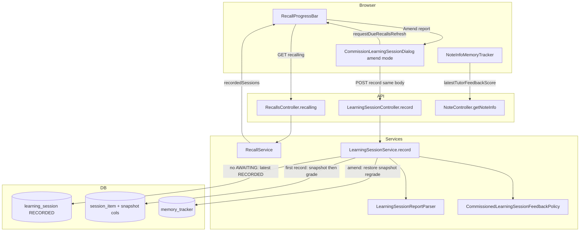

# Phase 7: amend-recorded-session - Research

**Researched:** 2026-08-08
**Domain:** Amend recorded Learning Session — snapshot re-grade, extend record API, recorded-session strip, Flyway snapshot columns, E2E graduation
**Confidence:** HIGH

## Summary

Phase 7 delivers one **Behavior**: the learner **pastes a later Learning Session Report** into an already **RECORDED** session; Doughnut **updates Feedback** on matched Session Items, **reschedules** commissioned trackers from amended scores using **pre-session snapshot re-grade** (not compound on post-record state), and keeps the session **visibly recorded** (AMD-01).

**Backend today:** `LearningSessionService.record` resolves only `AWAITING_REPORT` sessions and throws 404 when none exist `[VERIFIED: backend/src/main/java/com/odde/doughnut/services/LearningSessionService.java:77-84]`. First-record path calls `tracker.recordCommissionedFeedback(now, score)` which always increments `recallCount` `[VERIFIED: backend/src/main/java/com/odde/doughnut/entities/MemoryTracker.java:203-208]`. `SessionItem` has `feedbackScore` / `feedbackRecordedAt` but **no** pre-session snapshot columns `[VERIFIED: backend/src/main/java/com/odde/doughnut/entities/SessionItem.java:29-33]`. `LearningSessionRepository.findByUser_IdAndNotebook_IdAndStatus` returns a list (multiple `RECORDED` sessions per notebook are preserved on recommission) `[VERIFIED: backend/src/test/java/com/odde/doughnut/controllers/LearningSessionControllerTests.java:174-200]`.

**Frontend today:** `CommissionLearningSessionDialog.vue` supports `mode?: "commission" | "record"`; report textarea shows only when `status === 'AWAITING_REPORT'` `[VERIFIED: frontend/src/components/recall/CommissionLearningSessionDialog.vue:66-81]`. `RecallProgressBar.vue` has potential-session and awaiting-report strips; **no** recorded-session strip `[VERIFIED: frontend/src/components/recall/RecallProgressBar.vue:60-111]`. `DueMemoryTrackers` exposes `awaitingReportSessions` only `[VERIFIED: backend/src/main/java/com/odde/doughnut/controllers/dto/DueMemoryTrackers.java:14]`.

**Primary recommendation:** Flyway adds `pre_session_forgetting_curve_index` + `pre_session_recall_count` on `session_item`; first record snapshots tracker fields before `recordCommissionedFeedback`; extend `record` to fall through to **latest `RECORDED`** session per notebook when no awaiting session; amend path restores snapshot then **regrades** without double `recallCount`; add `recordedSessions` to `RecallService` / `DueMemoryTrackers`; extend dialog `mode="amend"` + recorded-session strip; graduate amend E2E `@wip`; unit-test primary for snapshot vs compound regression.

<user_constraints>
## User Constraints (from CONTEXT.md)

### Locked Decisions

#### Amend recomputation (Jidoka — ROADMAP)
- **D-01:** **Re-grade from pre-session snapshot**, not compound on the
  post-record tracker state. A later Report **replaces** the scheduling effect of
  the prior score for matched items; one commissioned Learning Session counts as
  **one** graded recall event (`recallCount` must not increment again on amend). —
  **Reversibility:** one-way — requires persisting or deriving pre-session tracker
  fields and amending `recordCommissionedFeedback` usage for amend paths
- **D-02:** On **first** record of a Session Item, persist a **pre-session snapshot**
  on `session_item` (at minimum `preSessionForgettingCurveIndex` and
  `preSessionRecallCount` before applying Feedback). On amend for a matched item:
  restore snapshot fields on the tracker, then apply `recordCommissionedFeedback`
  once with the new score. Items with no matching amend line keep their current
  tracker state. — **Reversibility:** one-way — Flyway columns on `session_item`
- **D-03:** `feedbackRecordedAt` on amended items updates to the amend instant;
  `learning_session.recordedAt` may update to the amend instant (planner picks one
  consistent rule; E2E does not assert timestamp). Status stays **RECORDED**. —
  **Reversibility:** reversible

#### Record API contract (extend Phase 6)
- **D-04:** Extend the existing **`POST /api/learning-sessions/record`** notebook-scoped
  endpoint: when no `AWAITING_REPORT` session exists, resolve the user's latest
  **`RECORDED`** session for that notebook and treat the paste as an **amend**.
  Return the same `RecordLearningSessionResponse` shape (`status`, `recordedAt`,
  `recordedItems`, `rejectedEntries`). — **Reversibility:** costly — published
  OpenAPI behavior change
- **D-05:** **Partial amend** uses the same rules as Phase 6 / ADR 0005: matched
  0–5 integer lines update Feedback and reschedule; unmatched titles and
  out-of-range scores are rejected without rolling back other matched amendments
  in the same request. Session stays **RECORDED** when ≥1 item amended
  successfully; zero matches leaves prior Feedback unchanged. — **Reversibility:**
  one-way — schedule side effects

#### Amend entry surface (UI)
- **D-06:** Mirror Phase 6 **awaiting-report strip** with a sibling **recorded-session
  strip** on `RecallProgressBar`: one row per notebook with a **RECORDED**
  session (glossary copy e.g. `1 recorded learning session for notebook "{name}"`),
  primary **`Amend report`** CTA opening `CommissionLearningSessionDialog` in
  **amend mode** (`mode` analogous to existing `record` mode). — **Reversibility:**
  reversible — additive UI
- **D-07:** Expose **`recordedSessions`** on the existing recalling /
  `DueMemoryTrackers` load path (notebook id, name, `learningSessionId`, optional
  `requestMarkdown` for dialog display). One round-trip with recall data; no new
  sessions page. — **Reversibility:** reversible — additive DTO field
- **D-08:** In amend mode, dialog shows readonly Request, **recorded** banner
  (`data-test="learning-session-recorded"`), editable report textarea, and
  **`Record report`** button (reuse `data-test="record-learning-session-report"`
  so existing page-object `recordLearningSessionReport` works). Hide textarea for
  commission-only flows. — **Reversibility:** reversible

#### Feedback visibility (REC-03 carry-over)
- **D-09:** After amend, **latest tutor feedback score** on the commissioned tracker
  reflects the **amended** score (existing `latestTutorFeedbackScore` / assimilation
  settings row and E2E step
  `I should see tutor feedback score {n} from a learning session for the memory
  tracker of note "{title}"`). — **Reversibility:** reversible

#### Potential-session membership (AMD-01 / success criterion 2)
- **D-10:** Amended scores drive **subsequent** `dueCommissioned` / potential-session
  membership the same way first-record scores do. E2E proof: after amending Gracias
  from 1 → 4 on day 2, day 3 shows **0** potential learning sessions for that
  notebook (both Hola and Gracias not due). — **Reversibility:** one-way — policy
  tests must lock snapshot re-grade math

#### E2E scope
- **D-11:** Graduate **only** scenario
  `"A later report amends the feedback of a recorded learning session"` from
  `.planning/phases/01-commissioned-tracker-model/commissioned_learning_session.feature`
  into `e2e_test/features/learning_session/commissioned_learning_session.feature`
  (`@wip` until green). — **Reversibility:** reversible
- **D-12:** Add Given step `I have recorded a learning session for notebook … on day
  {n} with scores:` (table) plus any amend-specific wiring; reuse When/Then steps
  from Phase 6 where possible. — **Reversibility:** reversible
- **D-13:** **Unit-test primary** for amend recomputation edge cases (snapshot
  restore, no double `recallCount`, compound-vs-snapshot regression). Do not grow
  E2E for parse edge cases. — **Reversibility:** reversible

### Claude's Discretion

- Exact snapshot column names and whether `preSessionLastRecalledAt` is needed
- Service method split (`record` vs `amend`) vs single method with status branch
- Whether `recordedAt` on session updates on amend
- Tracer vs expansion plan split (single tracer covering amend API + strip + E2E
  is viable)
- MakeMe builder helpers for pre-recorded sessions in Given steps

### Deferred Ideas (OUT OF SCOPE)

- Human ADR revision explicitly locking snapshot amend in ADR 0003 text — agents
  implement per CONTEXT; human approval of Proposed ADRs remains separate
- Open-sessions list across notebooks — out of MVP (REC-04 satisfied by dialog +
  strip)
- Descriptive Feedback prose stored or displayed — v2 (PROT-01)
- Compound amend semantics — rejected for this phase (see D-01)

None beyond roadmap — discussion stayed within phase scope.
</user_constraints>

<phase_requirements>
## Phase Requirements

| ID | Description | Research Support |
|----|-------------|------------------|
| AMD-01 | User can paste a later Learning Session Report that amends Feedback on a recorded session and reschedules accordingly | Extend `POST /api/learning-sessions/record` amend branch (D-04); snapshot columns + re-grade path (D-01, D-02); recorded-session strip + dialog amend mode (D-06–D-08); `recordedSessions` on recalling payload (D-07); E2E amend scenario (D-11); unit tests for snapshot math (D-13) |
</phase_requirements>

## Architectural Responsibility Map

| Capability | Primary Tier | Secondary Tier | Rationale |
|------------|-------------|----------------|-----------|
| Snapshot persist on first record | API / Backend | Database / Storage | Service sets `session_item` columns before scheduling |
| Amend resolve latest RECORDED session | API / Backend | — | `LearningSessionService.record` status branch |
| Snapshot restore + re-grade scheduling | API / Backend | — | `MemoryTracker` + `CommissionedLearningSessionFeedbackPolicy` |
| Partial amend parse/reject | API / Backend | — | Reuse `LearningSessionReportParser` unchanged |
| `recordedSessions` feed | API / Backend | Browser / Client | `RecallService` → `DueMemoryTrackers` |
| Recorded-session strip + amend dialog | Browser / Client | API / Backend | `RecallProgressBar` + `CommissionLearningSessionDialog` |
| Amended feedback visibility | Browser / Client | API / Backend | Existing `latestTutorFeedbackScore` via `findLatestFeedbackScoreByMemoryTrackerId` |
| Potential-session membership after amend | API / Backend | — | `dueCommissioned` driven by amended `nextRecallAt` |
| Flyway migration | Database / Storage | — | Nullable snapshot columns on `session_item` |

## Standard Stack

### Core

| Library / layer | Version | Purpose | Why Standard |
|-----------------|---------|---------|--------------|
| Spring Boot + JPA + Flyway | repo backend | Amend service, migration, transactions | Same as Phase 6 record |
| `LearningSessionService.record` | existing | Extend with RECORDED branch | Locked D-04 — same endpoint |
| `LearningSessionReportParser` | existing | Parse amend report | ADR 0005 rules unchanged |
| `CommissionedLearningSessionFeedbackPolicy` | existing | Score → index after snapshot restore | ADR 0003 table |
| `RecallService` / `RecallsController` | existing | Add `recordedSessions` | Mirrors `awaitingReportSessions` |
| `CommissionLearningSessionDialog.vue` | existing | Add `mode="amend"` | Locked D-06, D-08 |
| `RecallProgressBar.vue` | existing | Recorded-session strip | Clone awaiting-report pattern |
| `apiCallWithLoading` + generated SDK | repo frontend | Same `record` POST for amend | `frontend-api.mdc` |
| JUnit + MakeMe | repo backend | Amend controller + policy tests | `backend-testing.mdc` |
| Vitest browser mode | repo frontend | Dialog amend mode | `RecallProgressBar.spec.ts` pattern |
| Cypress + Cucumber | repo | One amend scenario `@wip` | Phase 6 graduation pattern |

### Supporting

| Asset | When to Use |
|-------|-------------|
| `LearningSessionRequestMarkdownBuilder` | `requestMarkdown` in `recordedSessions` payload |
| `SessionItemRepository.findLatestFeedbackScoreByMemoryTrackerId` | REC-03 after amend — picks max `feedbackRecordedAt` |
| `useRecallData.requestDueRecallsRefresh` | After amend success — reload strips |
| `generate-api-client` skill | After `RecordedLearningSessionLite` + `DueMemoryTrackers` change |
| `database-erd` skill | After Flyway migration |

### Alternatives Considered

| Instead of | Could Use | Tradeoff |
|------------|-----------|----------|
| Extend `record` POST | New `POST /amend` | Rejected in CONTEXT D-04 |
| Compound on current tracker state | Snapshot re-grade | Rejected D-01 — double `recallCount` / wrong schedule |
| Separate amend dialog | Extend commission dialog | Rejected — Phase 6 pattern |
| `recordCommissionedFeedback` on amend | Dedicated `regradeCommissionedFeedback` | **Recommended** — D-01 forbids second `recallCount` increment while D-02 text says "apply recordCommissionedFeedback once"; restore-then-record works only if restore includes pre-session `recallCount` **and** method does not increment again |

**Installation:** None — no new packages.

**Version verification:** N/A (in-repo stack only).

## Package Legitimacy Audit

> No external packages are installed in this phase.

| Package | Registry | Verdict | Disposition |
|---------|----------|---------|-------------|
| — | — | — | N/A |

**Packages removed due to [SLOP] verdict:** none
**Packages flagged as suspicious [SUS]:** none

## Architecture Patterns

### System Architecture Diagram



### Recommended Project Structure

```
backend/src/main/java/com/odde/doughnut/
├── algorithms/
│   └── CommissionedLearningSessionFeedbackPolicy.java      # unchanged pure math
├── entities/
│   ├── SessionItem.java                                    # + snapshot fields
│   └── MemoryTracker.java                                  # + regradeCommissionedFeedback (recommended)
├── entities/repositories/
│   └── LearningSessionRepository.java                      # optional ORDER BY recordedAt DESC
├── services/
│   ├── LearningSessionService.java                         # record(): awaiting OR amend branch
│   └── RecallService.java                                  # + recordedSessions
├── controllers/dto/
│   ├── DueMemoryTrackers.java                              # + recordedSessions
│   └── RecordedLearningSessionLite.java                    # mirror AwaitingReportLearningSessionLite
backend/src/main/resources/db/migration/
│   └── V300000241__session_item_pre_session_snapshot.sql
backend/src/test/java/com/odde/doughnut/
├── algorithms/CommissionedLearningSessionFeedbackPolicyTest.java  # + amend regression cases
├── controllers/LearningSessionControllerTests.java               # + Record.Amend nested tests
frontend/src/
├── components/recall/
│   ├── CommissionLearningSessionDialog.vue                 # mode amend + textarea when RECORDED
│   └── RecallProgressBar.vue                               # recorded-session strip
├── composables/useRecallData.ts                            # RecordedSession type + setter
e2e_test/
├── features/learning_session/commissioned_learning_session.feature  # + amend scenario @wip
├── step_definitions/learning_session.ts                    # Given recorded session
└── start/pageObjects/recallPage.ts                       # open amend strip before record
```

### Pattern 1: Record endpoint with amend fallback (D-04)

**What:** Single `record` method branches on session status — first `AWAITING_REPORT`, else latest `RECORDED` for notebook.

**When to use:** All report paste flows (first record and amend).

**Example:**

```java
// Extend LearningSessionService.record — pattern from Phase 6 first-record path
List<LearningSession> awaiting =
    learningSessionRepository.findByUser_IdAndNotebook_IdAndStatus(
        user.getId(), notebook.getId(), LearningSessionStatus.AWAITING_REPORT);

LearningSession session;
boolean amending;
if (!awaiting.isEmpty()) {
  session = awaiting.getFirst();
  amending = false;
} else {
  session = resolveLatestRecordedSession(user, notebook); // max recordedAt
  if (session == null) {
    throw new ResponseStatusException(NOT_FOUND, "No learning session awaiting report for this notebook.");
  }
  amending = true;
}
// ... parse, then per matched item:
if (amending) {
  restoreSnapshotAndRegrade(matched, now, entry.score());
} else {
  snapshotPreSession(matched);
  tracker.recordCommissionedFeedback(now, entry.score());
}
```

### Pattern 2: Snapshot on first record (D-02)

**What:** Before first `recordCommissionedFeedback`, copy tracker fields to `SessionItem`.

**Example:**

```java
// On first record only — columns added by V300000241
matched.setPreSessionForgettingCurveIndex(tracker.getForgettingCurveIndex());
matched.setPreSessionRecallCount(tracker.getRecallCount());
tracker.recordCommissionedFeedback(now, entry.score());
```

### Pattern 3: Re-grade without double recallCount (D-01)

**What:** Restore snapshot, apply policy + schedule, **do not** increment `recallCount` again.

**Recommended implementation** (planner discretion): add `MemoryTracker.regradeCommissionedFeedback(Timestamp now, int score)` that mirrors `recordCommissionedFeedback` but skips `setRecallCount(getRecallCount() + 1)`. CONTEXT D-02 says "apply recordCommissionedFeedback once" after restore — restoring `preSessionRecallCount` then calling current `recordCommissionedFeedback` yields `preSessionRecallCount + 1`, which equals post-first-record count when snapshot was taken at recallCount 0; **do not** use that shortcut on amend without restore to exact pre-session values.

```java
// Recommended amend path
tracker.setForgettingCurveIndex(matched.getPreSessionForgettingCurveIndex());
tracker.setRecallCount(matched.getPreSessionRecallCount());
tracker.regradeCommissionedFeedback(now, entry.score());
// regradeCommissionedFeedback: setLastRecalledAt, apply policy, setNextRecallAt — NO recallCount++
```

### Pattern 4: Recorded-session strip (clone Phase 6 awaiting strip)

**What:** `RecallProgressBar` sibling block with `data-test="recorded-learning-session"`, glossary copy, `Amend report` button opening dialog with `mode="amend"`.

**Reference:** `awaiting-report-learning-session` block `[VERIFIED: frontend/src/components/recall/RecallProgressBar.vue:86-110]`

### Pattern 5: `recordedSessions` on recalling payload (D-07)

**What:** Mirror `toAwaitingReportLite` — `RecordedLearningSessionLite` with `notebookId`, `notebookName`, `learningSessionId`, `requestMarkdown`.

**Reference:**

```java
// [VERIFIED: backend/src/main/java/com/odde/doughnut/services/RecallService.java:123-130]
private AwaitingReportLearningSessionLite toAwaitingReportLite(
    LearningSession session, ZoneId zoneId) {
  AwaitingReportLearningSessionLite lite = new AwaitingReportLearningSessionLite();
  lite.setNotebookId(session.getNotebook().getId());
  lite.setNotebookName(session.getNotebook().getName());
  lite.setLearningSessionId(session.getId());
  lite.setRequestMarkdown(learningSessionRequestMarkdownBuilder.build(session, zoneId));
  return lite;
}
```

**Recorded sessions query:** `findByUser_IdAndStatus(userId, RECORDED)`, group by `notebookId`, pick session with max `recordedAt` per notebook (one strip row per notebook per D-06).

### Anti-Patterns to Avoid

- **Compound amend:** Applying new score on post-record tracker state — rejected D-01; breaks day-3 zero-potential E2E when Gracias 1→4.
- **Second `recallCount` increment on amend:** Violates ADR 0003 "one graded event per recorded score" for one Tutor session.
- **New amend endpoint or dialog:** Locked decisions forbid.
- **Amend without snapshot columns:** Phase 6 recorded rows lack snapshots — first-record path in this phase must populate them; amend must require snapshots (Given/E2E goes through record after deploy).
- **All-or-nothing amend rollback:** Violates ADR 0005 partial acceptance (D-05).
- **Homonym `data-test` on strip vs dialog:** Scope dialog interactions to `[data-test="commission-learning-session-dialog"]` like Phase 6 `[VERIFIED: e2e_test/start/pageObjects/recallPage.ts:198-208]`.

## Don't Hand-Roll

| Problem | Don't Build | Use Instead | Why |
|---------|-------------|-------------|-----|
| Amend report parsing | New parser | `LearningSessionReportParser` | REC-05 / ADR 0005 unchanged |
| Score→schedule math | Inline amend math | `CommissionedLearningSessionFeedbackPolicy` | Policy tests lock AMD-01 membership |
| Latest feedback after amend | New query shape | `findLatestFeedbackScoreByMemoryTrackerId` | Already max `feedbackRecordedAt` |
| HTTP client | Custom fetch | `LearningSessionController.record` + SDK | Same POST for amend |
| Recorded session discovery | New page | `recordedSessions` on recalling | D-07 one round-trip |

**Key insight:** Amend is symmetric to record at the protocol layer (same POST, same response shape); only service branch and tracker re-grade differ.

## Common Pitfalls

### Pitfall 1: Double recallCount on amend

**What goes wrong:** E2E `recall count 1` fails after amend; violates D-01.

**Why it happens:** Calling `recordCommissionedFeedback` on tracker already at post-record state without restore, or restore + increment.

**How to avoid:** Unit test: record then amend → `recallCount` still 1; use `regradeCommissionedFeedback` or restore pre-session counts before grade.

### Pitfall 2: Compound vs snapshot schedule (AMD-01 SC2)

**What goes wrong:** Day 3 shows potential session for Gracias when amend 1→4 should schedule like first-record score 4 (both trackers not due).

**Why it happens:** Amending on post-score-1 tracker state instead of pre-session snapshot.

**How to avoid:** Policy/controller test: record Hola 4 / Gracias 1, amend Gracias to 4, assert `nextRecallAt` matches **hypothetical** first-record Gracias 4 from same pre-session state, not compound on score-1 state.

### Pitfall 3: Wrong RECORDED session when multiple exist

**What goes wrong:** Amend applies to older recorded session.

**Why it happens:** `findByUser_IdAndNotebook_IdAndStatus` returns unordered list.

**How to avoid:** Pick max `recordedAt` (repository `OrderByRecordedAtDesc` or stream max).

### Pitfall 4: E2E When step cannot find report textarea

**What goes wrong:** Given closes dialog; When `recordLearningSessionReport` targets closed dialog.

**Why it happens:** Amend scenario records in Given, then When re-pastes without opening strip.

**How to avoid:** Extend When step or page object to click recorded-session strip `Amend report` first; or Given leaves dialog open only for commission flow.

### Pitfall 5: Missing snapshots on legacy SessionItems

**What goes wrong:** Null snapshot columns → NPE on amend.

**Why it happens:** Phase 6 data recorded before migration.

**How to avoid:** Nullable columns; amend rejects items without snapshot with clear rejection OR fail fast in dev; E2E/Given uses post-Phase-7 record path.

### Pitfall 6: Zero-match amend changes session

**What goes wrong:** Session feedback/schedules drift when all lines rejected.

**Why it happens:** Misread D-05.

**How to avoid:** Controller test: all lines rejected → scores unchanged, status `RECORDED`, trackers unchanged.

### Pitfall 7: Forgetting OpenAPI regeneration

**How to avoid:** `generate-api-client` after `recordedSessions` DTO lands.

## Code Examples

### LearningSessionStatus values

```java
// [VERIFIED: backend/src/main/java/com/odde/doughnut/entities/LearningSessionStatus.java:3-6]
public enum LearningSessionStatus {
  AWAITING_REPORT,
  RECORDED
}
```

### recordCommissionedFeedback (first record — increments recallCount)

```java
// [VERIFIED: backend/src/main/java/com/odde/doughnut/entities/MemoryTracker.java:203-208]
public void recordCommissionedFeedback(Timestamp now, int score) {
  setRecallCount(getRecallCount() + 1);
  setLastRecalledAt(now);
  setForgettingCurveIndex(
      CommissionedLearningSessionFeedbackPolicy.applyScore(getForgettingCurveIndex(), score));
  setNextRecallAt(ensureNextRecallStrictlyAfterNow(now));
}
```

### SessionItem feedback columns (pre-migration)

```java
// [VERIFIED: backend/src/main/java/com/odde/doughnut/entities/SessionItem.java:29-33]
@Column(name = "feedback_score")
private Integer feedbackScore;

@Column(name = "feedback_recorded_at")
private Timestamp feedbackRecordedAt;
```

### Proposed Flyway migration

```sql
-- V300000241__session_item_pre_session_snapshot.sql (new file)
ALTER TABLE `session_item`
  ADD COLUMN `pre_session_forgetting_curve_index` float NULL DEFAULT NULL AFTER `feedback_recorded_at`,
  ADD COLUMN `pre_session_recall_count` int NULL DEFAULT NULL AFTER `pre_session_forgetting_curve_index`;
```

### Dialog mode extension (amend shows textarea when RECORDED)

```vue
<!-- Extend CommissionLearningSessionDialog.vue — D-08 -->
<template v-if="status === 'AWAITING_REPORT' || status === 'RECORDED'">
  <p class="text-sm mt-4">Learning session report</p>
  <textarea v-model="reportMarkdown" data-test="learning-session-report" ... />
  <button data-test="record-learning-session-report" @click="recordReport">Record report</button>
</template>
```

### E2E amend scenario (graduate verbatim)

```gherkin
# Source: .planning/phases/01-commissioned-tracker-model/commissioned_learning_session.feature:65-78
Scenario: A later report amends the feedback of a recorded learning session
  Given I have recorded a learning session for notebook "Spanish conversation" on day 2 with scores:
    | Note    | Score |
    | Hola    | 4     |
    | Gracias | 1     |
  When I record the learning session report for the learning session of notebook "Spanish conversation":
    """
    # Learning Session Report

    Gracias: 4
    """
  Then I should see tutor feedback score 4 from a learning session for the memory tracker of note "Gracias"
  When It's day 3, 9 hour
  Then I should see 0 potential learning session to commission for notebook "Spanish conversation"
```

## State of the Art

| Old Approach | Current Approach | When Changed | Impact |
|--------------|------------------|--------------|--------|
| Record only (Phase 6) | Record + amend same POST | Phase 7 | ADR 0005 §5 amend semantics |
| No snapshot columns | Pre-session snapshot on `session_item` | Phase 7 | Enables D-01 re-grade |
| `record` 404 without awaiting | Fall through to latest RECORDED | Phase 7 | D-04 |
| Awaiting strip only | + recorded-session strip | Phase 7 | D-06 amend entry |

**Deprecated/outdated:**
- Compound amend on post-record tracker — rejected in `07-DISCUSSION-LOG.md`

## Assumptions Log

| # | Claim | Section | Risk if Wrong |
|---|-------|---------|---------------|
| A1 | Amend targets **latest** `RECORDED` session per notebook when multiple exist | Record API | Wrong session amended |
| A2 | `preSessionLastRecalledAt` not required if `lastRecalledAt` set on regrade at amend instant | Snapshot columns | Planner may add column if restore needs it |
| A3 | E2E Given can use UI record or MakeMe/testability to establish recorded state with snapshots | E2E | Flaky Given if snapshots missing |
| A4 | `findLatestFeedbackScoreByMemoryTrackerId` picks amended score after `feedbackRecordedAt` update | REC-03 carry-over | Stale score display if timestamp not updated |

## Open Questions

1. **`recordedAt` on session on amend**
   - Recommendation: Update to amend instant for consistency with `feedbackRecordedAt` (D-03 discretion); E2E does not assert.

2. **Service split vs single `record` method**
   - Recommendation: Single `record` with `amending` flag — minimizes OpenAPI surface; private `restoreSnapshotAndRegrade` helper.

3. **Given step implementation**
   - Recommendation: UI path (commission + record on day N) exercises full snapshot path; optional MakeMe helper `aLearningSession().recordedWithScores(...)` for controller unit tests.

## Environment Availability

**Step 2.6: SKIPPED** — no new external dependencies; uses existing Nix/MySQL/Cypress stack (`pnpm sut` assumed per repo rules).

## Validation Architecture

### Test Framework

| Property | Value |
|----------|-------|
| Backend framework | JUnit 5 + Spring Boot Test |
| Backend quick run | `CURSOR_DEV=true nix develop -c pnpm backend:test_only` |
| Frontend framework | Vitest browser mode |
| Frontend quick run | `CURSOR_DEV=true nix develop -c pnpm frontend:test` |
| E2E framework | Cypress + Cucumber |
| E2E targeted run | `CURSOR_DEV=true nix develop -c pnpm cypress run --spec e2e_test/features/learning_session/commissioned_learning_session.feature` |

### Phase Requirements → Test Map

| Req ID | Behavior | Test Type | Automated Command | File Exists? |
|--------|----------|-----------|-------------------|-------------|
| AMD-01 | Amend report updates feedback + reschedules | E2E + JUnit | Cypress amend scenario; `LearningSessionControllerTests.Record` amend nested tests | E2E scenario ❌ Wave 0; controller tests ❌ Wave 0 |
| AMD-01 SC2 | Amended scores drive potential-session membership | E2E + JUnit | Day-3 zero potential sessions in E2E; policy snapshot-vs-compound test | ❌ Wave 0 |
| AMD-01 SC3 | Recorded marking remains visible | E2E + Vitest | `data-test="learning-session-recorded"` after amend | Vitest extend ❌ Wave 0 |
| D-13 edge cases | No double recallCount, partial amend, zero-match | JUnit only | `CommissionedLearningSessionFeedbackPolicyTest` + controller | ❌ Wave 0 |

### Sampling Rate

- **Per task commit:** `pnpm backend:test_only` (nested `LearningSessionControllerTests`, policy tests) + targeted Vitest files
- **Per wave merge:** `pnpm backend:verify` + `pnpm frontend:test` + Cypress `--spec` learning_session feature
- **Phase gate:** Amend E2E green (remove `@wip`); no full E2E suite unless CI requires

### Wave 0 Gaps

- [ ] `V300000241__session_item_pre_session_snapshot.sql`
- [ ] `SessionItem` snapshot fields + `SessionItemBuilder` helpers
- [ ] `MemoryTracker.regradeCommissionedFeedback` (or equivalent amend path)
- [ ] `LearningSessionService.record` amend branch + snapshot on first record
- [ ] `RecordedLearningSessionLite` + `DueMemoryTrackers.recordedSessions` + `RecallService`
- [ ] `LearningSessionRepository` latest-RECORDED query (optional)
- [ ] `CommissionLearningSessionDialog` amend mode + `RecallProgressBar` recorded strip
- [ ] `useRecallData` / `useRecallPageLoading` recorded sessions wiring
- [ ] `LearningSessionControllerTests.Record` amend nested class
- [ ] `CommissionedLearningSessionFeedbackPolicyTest` snapshot-vs-compound cases
- [ ] E2E Given `I have recorded a learning session…` + page-object amend strip open
- [ ] Graduate amend scenario into `commissioned_learning_session.feature` with `@wip`
- [ ] `generate-api-client` after OpenAPI change

## Security Domain

### Applicable ASVS Categories

| ASVS Category | Applies | Standard Control |
|---------------|---------|-----------------|
| V2 Authentication | yes | `assertLoggedIn()` on record endpoint (unchanged) |
| V3 Session Management | no | Existing app session |
| V4 Access Control | yes | `assertAuthorization(notebook)`; session `user_id` match |
| V5 Input Validation | yes | Parser rejects malformed scores/titles; plain textarea (no `v-html`) |
| V6 Cryptography | no | — |

### Known Threat Patterns

| Pattern | STRIDE | Standard Mitigation |
|---------|--------|---------------------|
| Amend another user's recorded session | Elevation of privilege | Notebook auth + user-scoped session lookup |
| Report markdown XSS | Tampering | Plain textarea; no `v-html` |
| Amend wrong session when multiple RECORDED | Tampering | Latest `recordedAt` per notebook |
| Oversized report payload | DoS | Spring body limits; parser line handling |

## Project Constraints (from .cursor/rules/)

- Run tooling via `CURSOR_DEV=true nix develop -c …`; git commands without Nix prefix
- Behavior phase: one observable behavior (amend); stop-safe; targeted E2E not full suite
- Small-test style: controller/parser/policy boundaries; `makeMe` fixtures
- Never silently swallow failures (`error-handling.mdc`)
- Regenerate OpenAPI client after API changes (`generate-api-client` skill)
- `apiCallWithLoading` + `timezoneParam()` for frontend mutations (`frontend-api.mdc`)
- E2E: `waitUntilAppIsNotBusy()` after record/amend; `@wip` until green; max 5 `@wip`
- Flyway migration discipline (`db-migration.mdc`); regenerate ERD after schema change
- No phase numbers in product artifact names
- Commit only when user requests

## Sources

### Primary (HIGH confidence)

- `backend/src/main/java/com/odde/doughnut/services/LearningSessionService.java` — record awaiting-only today
- `backend/src/main/java/com/odde/doughnut/entities/MemoryTracker.java` — `recordCommissionedFeedback`
- `backend/src/main/java/com/odde/doughnut/entities/SessionItem.java` — feedback columns
- `backend/src/main/java/com/odde/doughnut/services/RecallService.java` — `awaitingReportSessions` pattern
- `frontend/src/components/recall/CommissionLearningSessionDialog.vue` — record mode
- `frontend/src/components/recall/RecallProgressBar.vue` — strip pattern
- `docs/adrs/0005-commissioned-learning-session-protocol.md` — amend semantics §5–6
- `docs/adrs/0003-spaced-repetition-scheduling-policy.md` — commissioned feedback § one graded event
- `.planning/phases/07-amend-recorded-session/07-CONTEXT.md` — locked decisions
- `.planning/phases/06-record-report-and-schedule/06-RESEARCH.md` — Phase 6 patterns

### Secondary (MEDIUM confidence)

- `.planning/phases/01-commissioned-tracker-model/commissioned_learning_session.feature` — amend E2E draft
- `backend/src/test/java/com/odde/doughnut/controllers/LearningSessionControllerTests.java` — Record nested tests

## Metadata

**Confidence breakdown:**
- Standard stack: **HIGH** — extends Phase 6; no new libraries
- Architecture: **HIGH** — CONTEXT locks snapshot re-grade, API extend, strip, dialog
- Pitfalls: **HIGH** — double recallCount and compound-vs-snapshot are documented AMD-01 failure modes
- Scheduling math: **HIGH** — ADR 0003 + D-01 snapshot restore path specified

**Research date:** 2026-08-08
**Valid until:** 2026-09-08 (stable domain; snapshot amend locked in CONTEXT)
