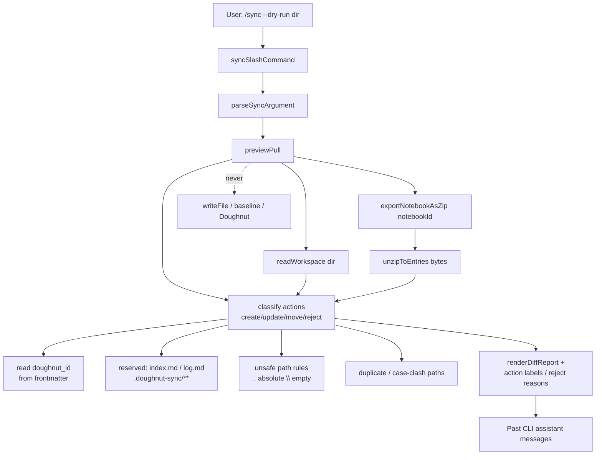

# Phase 9: Resolve preview-before-pull (story 2) - Research

**Researched:** 2026-08-03
**Domain:** CLI `/sync --dry-run` preview taxonomy + reserved/duplicate/invalid diagnostics (TypeScript, Vitest, Cypress CLI E2E)
**Confidence:** HIGH (in-repo behavior and contracts); MEDIUM (exact report wording / reserved edge cases left to discretion)

<user_constraints>
## User Constraints (from CONTEXT.md)

### Locked Decisions

#### Gap coverage (EXP-02)
- **D-01:** Phase 9 closes **both** TRIAGE Story 2 gaps: (1) reserved / duplicate / invalid-mapping diagnostics, and (2) action taxonomy beyond content-overwrite diffs (create / update / reject, plus move when identity proves a path change). Partial “diagnostics-only” is not enough for EXP-02. — **Reversibility:** costly — shipping only one gap leaves EXP-02 incomplete and invites a second Story 2 phase.

#### Preview action taxonomy
- **D-02:** Dry-run report labels each relevant path with an explicit action: **create** (remote `.md` with no workspace file), **update** (same path, content differs), **move** (same stable `doughnut_id` at a different path than the workspace file that holds that id), **reject** (reserved name / duplicate path / invalid mapping). Do not list every unchanged note individually; keep a concise summary (existing “N note(s) would change” style may expand to counts by action). — **Reversibility:** costly — CLI/E2E contract for preview wording becomes the Story 2 proof surface.
- **D-03:** **Move** is preview-only inference from `doughnut_id` path mismatch; do not invent moves without identity. Implementing filesystem create/rename/move on real `/sync` remains Phase 10 (`applyPull`). — **Reversibility:** reversible — Phase 10 can refine move application without changing the preview labels if they stay identity-based.

#### Reserved / duplicate / invalid mappings
- **D-04:** Align reserved-name reporting with existing portable/OKF notions already used by workspace lint: at least `index.md` and `log.md` as reserved role files (not ordinary note create/update targets in the preview sense), plus anything under `.doughnut-sync/` as sync metadata (never a pull target). Duplicate paths = two exported notes resolving to the same workspace-relative path (or case-clash if the platform would collide). Invalid mappings = unsafe/out-of-tree paths, empty segments, or other non-portable path shapes the export/unzip path already rejects or should reject before write. Each finding names the path and a short actionable reason. — **Reversibility:** costly — lint (Phase 11) and preview should stay consistent on reserved vocabulary.
- **D-05:** Reject findings are first-class preview output (clearly visible), not silent skips. A dry-run that only has rejects (no create/update/move) still reports those rejects and must not claim a clean no-op if rejects exist.

#### Non-mutation (already green — keep)
- **D-06:** Strengthen must preserve: preview only reads workspace + exports zip + compares in memory; no `writeFile`, no baseline/sync-metadata writes, no Doughnut mutations. Extend the existing E2E Rule `The preview leaves nothing behind` if new scenarios touch the filesystem.

#### Implementation surface
- **D-07:** Primary strengthen lands in `previewPull` and report helpers (`diffReport` / related). Reuse `readWorkspace`, `exportNotebook`, `unzip` as compare inputs. Do **not** change `applyPull` behavior in this phase. Touch `syncSlashCommand` / `syncArgument` only if needed to surface the new report shape for `/sync --dry-run`. — **Reversibility:** costly — splitting preview logic into applyPull creates Story 2/3 entanglement.
- **D-08:** Prefer identity-aware create/move detection using exported `doughnut_id` (Phase 8 contract). If a remote note lacks `doughnut_id`, treat path-keyed create/update only (no move inference).

#### Proof strategy
- **D-09:** Prove via `cli_sync_dry_run.feature` (integration: action labels, reserved/duplicate/invalid reporting, non-mutation) plus `cli/tests/previewPull.test.ts` (and small unit coverage for new helpers) for taxonomy edge cases. Capability-named tests only — no phase numbers in product/test names.

### Claude's Discretion
- Exact report wording / ordering / summary line format (as long as D-02–D-05 hold and E2E proves them)
- Whether reject vs update precedence when a path is both reserved and content-differing (prefer reject)
- Plan count under **coarse** granularity (prefer 1–2 plans: strengthen preview + E2E wrap-up, or a single combined plan if stop-safe)

### Deferred Ideas (OUT OF SCOPE)
- Story 3 `applyPull` create / rename / move + sync-metadata updates — Phase 10
- Story 4 `/lint` full portable contract — Phase 11 (may share reserved-name vocabulary)
- Stories 5–6 push preview/push — Phases 12–13
- SEED-001 spelling follow-ons — parked
</user_constraints>

<phase_requirements>
## Phase Requirements

| ID | Description | Research Support |
|----|-------------|------------------|
| EXP-02 | Kept or strengthened preview-before-pull matches story 2 (paths/actions reported; preview mutates nothing) — or removed cleanly | TRIAGE Story 2 verdict is **strengthen** (not remove). Close both gaps: (1) reserved/duplicate/invalid diagnostics, (2) create/update/move/reject taxonomy. Preserve non-mutation. Prove with `cli_sync_dry_run.feature` + `previewPull` units. HYG-02 standing: do not rewrite Terry Yin / Tan Yeong Sheng work. |
</phase_requirements>

## Summary

Phase 9 strengthens existing `/sync --dry-run` → `previewPull` so the dry-run report matches Story 2 acceptance: explicit **create / update / move / reject** actions with exact paths, plus clear reserved / duplicate / invalid-mapping findings, while remaining strictly non-mutating. TRIAGE already ruled **strengthen** (not remove); Phase 7’s decision is applied by closing both documented gaps in one Behavior phase.

Today `previewPull` only content-diffs exported `.md` paths against the workspace map and emits unlabeled path + unified hunks via `renderDiffReport` / `renderNoteDiff`. It already creates remote-only notes as “all added lines” but labels them as ordinary “would change,” not **create**. It has no reserved/duplicate/invalid reporting and no `doughnut_id`-based **move** inference — even though Phase 8 now emits `doughnut_id` in exported note frontmatter. `NoteDiffStatus` is currently push-oriented (`pull` \| `push` \| `conflict`); pull actions must not be jammed into that union in a way that breaks `/push --dry-run`.

**Primary recommendation:** Keep `applyPull` frozen. Add a preview-only classify + report path in `previewPull` (+ small helpers / careful `diffReport` extension): extract `doughnut_id`, classify create/update/move/reject, reuse `assertSafeEntryPath`-equivalent rules for invalid mappings, align reserved basenames with lint (`index.md`, `log.md`) and reject `.doughnut-sync/**`, detect duplicate/case-clash before Map collapse, and prove with extended `previewPull` units + `cli_sync_dry_run.feature`. Prefer **1–2 coarse plans**.

## Architectural Responsibility Map

| Capability | Primary Tier | Secondary Tier | Rationale |
|------------|-------------|----------------|-----------|
| Dry-run compare & action taxonomy | CLI (Node) | — | `previewPull` owns compare; no backend change for Story 2 |
| Report formatting (paths/actions/summary) | CLI | — | `diffReport` / related; TTY text is the product surface |
| `doughnut_id` identity source | Backend zip export | CLI reader | Phase 8 already writes identity in zip; CLI only reads it for move/create |
| Reserved vocabulary (`index.md`, `log.md`) | CLI (align with lint) | Phase 11 lint later | D-04: same reserved names as `lintWorkspace`; do not implement Story 4 |
| Invalid/unsafe path rules | CLI | Shared with export write | Mirror `writeNotebookExport.assertSafeEntryPath` semantics in preview rejects |
| Non-mutation proof | CLI E2E + units | — | Filesystem assertions in `cli_sync_dry_run.feature` |
| Real create/rename/move on disk | Deferred (Phase 10) | — | D-03 / D-07: `applyPull` frozen |

## Standard Stack

### Core

| Library | Version | Purpose | Why Standard |
|---------|---------|---------|--------------|
| TypeScript CLI (`cli/`) | in-repo | `/sync --dry-run` surface | TRIAGE entrypoint; no new runtime |
| Vitest | `4.1.10` in `cli/package.json` (`[VERIFIED: cli/package.json:50]`: `"vitest": "4.1.10"`) | Unit tests | Project CLI test runner |
| yaml (`eemeli/yaml`) | `>=2.9.0` dep; registry `2.9.0` | Optional frontmatter parse | Already used by `okfConcept`; **do not add a new parser package** |
| Cypress + cucumber preprocessor | repo root | CLI E2E | Existing `cli_sync_dry_run.feature` |
| Node.js | engines `>=26.5` in CLI package | Runtime | Repo CLI contract |

### Supporting

| Library | Version | Purpose | When to Use |
|---------|---------|---------|-------------|
| `cli/tests/zipFixture.ts` (`zipOfNotes` / `buildZip`) | in-repo | Build zip bytes in units | Duplicate-path / multi-entry fixtures that `Record` maps cannot express |
| Nix + `CURSOR_DEV=true nix develop -c …` | repo | Tooling prefix | All verification commands except raw `git` |

### Alternatives Considered

| Instead of | Could Use | Tradeoff |
|------------|-----------|----------|
| Extend `NoteDiffStatus` with create/update/move/reject | Separate `PreviewPullAction` type | **Use separate action type** — push statuses stay `pull`/`push`/`conflict`; avoids breaking `previewPush` |
| Full YAML parse for every note | Line regex for `doughnut_id:` | Prefer **lightweight extract** aligned with backend `DOUGHNUT_ID_LINE`; fall back to path-keyed when missing (D-08) |
| Change `unzipToEntries` to return duplicates | Preview-local zip scan / helper | Prefer **preview-local or new shared read helper** over changing `Map` semantics of `unzipToEntries` (shared with export/applyPull) |
| New npm packages | None | **Install nothing** — stack is already present |

**Installation:**

```bash
# No new packages. Verify existing stack only.
pnpm -C cli exec vitest --version
# Expected: vitest/4.1.10 …
```

**Version verification:** `npm view yaml version` → `2.9.0`; `npm view vitest version` → `4.1.10`; `pnpm -C cli exec vitest --version` → `vitest/4.1.10` `[VERIFIED: npm registry + local pnpm]`.

## Package Legitimacy Audit

> No new packages for this phase. Existing deps checked for awareness only.

| Package | Registry | Age | Downloads | Source Repo | Verdict | Disposition |
|---------|----------|-----|-----------|-------------|---------|-------------|
| yaml | npm | mature | ~184M/wk | github.com/eemeli/yaml | OK | Already in `cli/package.json` — do not reinstall |
| vitest | npm | current 4.1.10 | ~87M/wk | github.com/vitest-dev/vitest | SUS (seam: too-new) | Already pinned in repo — **no install task**; no human-verify gate needed for reuse |

**Packages removed due to [SLOP] verdict:** none  
**Packages flagged as suspicious [SUS]:** vitest flagged by legitimacy seam as too-new, but already project-standard — planner must **not** add an install checkpoint.

## Architecture Patterns

### System Architecture Diagram



### Recommended Project Structure

```
cli/src/sync/
├── previewPull.ts          # classify + orchestrate (primary)
├── diffReport.ts           # extend carefully for pull actions / rejects
├── unifiedDiff.ts          # keep for update/create content hunks
├── readWorkspace.ts        # reuse read-only
├── exportNotebook.ts       # reuse
├── unzip.ts                # reuse; do not silently lose duplicate detection
├── applyPull.ts            # FREEZE (D-07)
└── (optional helper)       # e.g. previewPullActions / doughnutId / safePath — only if cohesion needs it

cli/tests/
├── previewPull.test.ts     # taxonomy + diagnostics + non-write
└── (optional) *.test.ts    # small helper units if extracted

e2e_test/features/cli/
└── cli_sync_dry_run.feature  # action labels, rejects, non-mutation Rule
```

### Pattern 1: Preview-only classify, apply frozen
**What:** All Story 2 strengthen logic lives in the dry-run path; `applyPull` continues intersecting path-keyed updates only.
**When to use:** Always in Phase 9 (D-03, D-07).
**Example:**

```typescript
// Source: cli/src/sync/previewPull.ts:25-43 (current — to replace classify body)
// Today: content-inequality only
const changed = [...exported]
  .filter(([path]) => path.endsWith(MARKDOWN_SUFFIX))
  .filter(([path, content]) => workspace.get(path) !== content)
```

Target shape (illustrative — wording discretionary):

```typescript
// Recommended: preview-local actions; applyPull untouched
type PreviewPullAction = 'create' | 'update' | 'move' | 'reject'
// move only when both sides expose the same doughnut_id at different paths (D-03, D-08)
```

### Pattern 2: Separate pull actions from push `NoteDiffStatus`
**What:** Keep `NoteDiffStatus = 'pull' | 'push' | 'conflict'` for `previewPush`; add pull-specific labeling for Story 2.
**When to use:** Any change to `diffReport.ts`.
**Verified current union** `[VERIFIED: cli/src/sync/diffReport.ts:3-4]`:

```typescript
export type NoteDiffStatus = 'pull' | 'push' | 'conflict'
```

### Pattern 3: Identity extract without inventing moves
**What:** Read `doughnut_id` from leading YAML fence; if absent, path-keyed create/update only (D-08).
**Verified export contract** `[VERIFIED: backend/.../ExportNoteMarkdown.java:44-47]` emits:

```text
---
doughnut_id: {noteId}
---
```

Backend also matches lines with `(?i)^doughnut_id\\s*:.*` when merging `[VERIFIED: ExportNoteMarkdown.java:21]`.

### Anti-Patterns to Avoid
- **Mutating in dry-run:** any `writeFile`, baseline, or Doughnut write — violates D-06 / oracle.
- **Implementing applyPull create/move here:** Phase 10 only (D-03/D-07).
- **Silent skip of rejects:** violates D-05; rejects-only must not print `No changes to pull.` alone.
- **Widening `unzipToEntries` Map semantics without duplicate awareness:** duplicates collapse via `Map.set` today `[VERIFIED: cli/src/sync/unzip.ts:61-67]`.
- **Encoding phase numbers in test/feature names:** planning.mdc / D-09.
- **Touching Terry / Yeong Sheng–owned hunks for “cleanup”:** HYG-02.

## Don't Hand-Roll

| Problem | Don't Build | Use Instead | Why |
|---------|-------------|-------------|-----|
| Unified content diffs | New diff engine | `unifiedDiff.diffLines` + `renderNoteDiff` | Already proven in E2E/units |
| Zip parse | Custom inflate | `unzipToEntries` | Shared with export/pull |
| Workspace walk | Ad-hoc readdir | `readWorkspace` | LF normalization already handled |
| Unsafe path rules | New security model | Mirror `assertSafeEntryPath` in `writeNotebookExport.ts` | Same reject vocabulary as export |
| YAML ecosystem | New frontmatter library | Existing `yaml` or line extract | Already in CLI lint |
| E2E harness | New runner | Extend `cli_sync_dry_run.feature` | Capability already wired |

**Key insight:** Story 2 is a **report taxonomy** problem on top of a working non-mutating compare — not a new sync engine.

## Common Pitfalls

### Pitfall 1: Collapsing duplicate zip paths before detection
**What goes wrong:** Two entries with the same name become one `Map` value; duplicate diagnostic never fires.
**Why it happens:** `unzipToEntries` uses `entries.set(name, …)` `[VERIFIED: cli/src/sync/unzip.ts:61-67]`.
**How to avoid:** Detect duplicates while iterating central-directory names (preview helper or shared listEntries) **before** trusting a collapsed Map for taxonomy; use `buildZip` with two same-name entries in units (`zipFixture.ts`).
**Warning signs:** Unit that expects duplicate reject always gets create/update instead.

### Pitfall 2: Breaking push dry-run via shared `NoteDiffStatus`
**What goes wrong:** `/push --dry-run` labels break or typecheck fails.
**Why it happens:** `renderNoteDiff` / `renderDiffReport` are shared with `previewPush`.
**How to avoid:** Add pull actions as a parallel concept; keep push statuses unchanged; run `cli/tests/previewPush.test.ts` if `diffReport` changes.
**Warning signs:** Push E2E/unit failures mentioning `(push)` / `(CONFLICT)`.

### Pitfall 3: Treating healthy `index.md` as ordinary create/update — or over-rejecting without reason text
**What goes wrong:** Either Story 2 reserved gap remains, or every notebook with a readme shows noisy rejects without actionable reasons.
**Why it happens:** Export writes `index.md` from readme without `doughnut_id` `[VERIFIED: NotebookZipBuilder.java:114-115]`; lint reserves basename `index.md` / `log.md` `[VERIFIED: cli/src/lint/lintWorkspace.ts:15-21]`.
**How to avoid (discretion recommendation):** Basename `index.md` or `log.md` → **reject** (not create/update/move) with short reason “reserved role file”; paths under `.doughnut-sync/` → reject “sync metadata, never a pull target”; prefer reject over update when reserved and content differs (CONTEXT discretion). Do not claim `No changes to pull.` when only rejects exist (D-05).
**Warning signs:** E2E still asserts only “would change” for reserved paths; or rejects-only prints nothing-to-pull.

### Pitfall 4: Inventing moves without `doughnut_id`
**What goes wrong:** False moves from title/path heuristics.
**Why it happens:** Path renames look like delete+create without identity.
**How to avoid:** D-03/D-08 — move only when the same id appears at different paths; missing id → path-keyed create/update only.
**Warning signs:** Move reported for notes lacking `doughnut_id:` in fixtures.

### Pitfall 5: Changing `applyPull` “while we’re here”
**What goes wrong:** Story 2/3 entanglement; Phase 10 scope leaks.
**How to avoid:** D-07 freeze; leave remote-only create behavior in applyPull as today’s intentional non-create.
**Warning signs:** `applyPull.test.ts` or `cli_sync_pull.feature` diffs in the Phase 9 commit.

### Pitfall 6: HYG-02 accidental rewrite
**What goes wrong:** Instructor-authored hunks rewritten during “cleanup.”
**How to avoid:** Only strengthen participant Story 2 surface; do not revert/reformat unrelated Terry/YS code. Prefer additive changes in `previewPull` / report helpers / tests.
**Warning signs:** Broad drive-by edits outside TRIAGE keep set.

## Code Examples

### Current preview (gap baseline)

```typescript
// Source: cli/src/sync/previewPull.ts:35-43
const changed = [...exported]
  .filter(([path]) => path.endsWith(MARKDOWN_SUFFIX))
  .sort(([a], [b]) => (a < b ? -1 : a > b ? 1 : 0))
  .filter(([path, content]) => workspace.get(path) !== content)
  .map(([path, content]) => ({
    diff: renderNoteDiff(path, workspace.get(path) ?? '', content),
  }))
```

Nothing-changed sentinel `[VERIFIED: cli/src/sync/previewPull.ts:6]`:

```typescript
const NOTHING_TO_PULL = 'No changes to pull.'
```

### Unsafe path rules to mirror for invalid-mapping rejects

```typescript
// Source: cli/src/sync/writeNotebookExport.ts:24-31
function assertSafeEntryPath(path: string): void {
  if (
    path.startsWith('/') ||
    path.includes('\\') ||
    path.split('/').includes('..')
  ) {
    throw new Error(`The export contained an unsafe path: ${path}.`)
  }
}
```

For **preview**, prefer **report reject** (non-throwing) with the same criteria plus empty segments (`''` in split), so dry-run still returns a string report (D-04/D-05) rather than aborting the whole compare — unless the zip is unreadable (`NOT_A_ZIP`), which should still throw.

### Reserved vocabulary (lint reference only)

```typescript
// Source: cli/src/lint/lintWorkspace.ts:15-21
 * Which rules a file answers to. OKF reserves `index.md` and `log.md`, each with
 * a structure of its own rather than a concept's.
function problemsIn(path: string, content: string): OkfProblem[] {
  const name = basename(path)
  if (name === 'index.md') return indexProblems(content, path === name)
  if (name === 'log.md') return logProblems(content)
```

### Recommended classify sketch (discretion — not locked wording)

```typescript
// Illustrative only — exact labels are Claude's Discretion
// 1) Collect export .md entries with duplicate/case-clash detection
// 2) For each path: if unsafe or under .doughnut-sync/ or basename reserved → reject
// 3) Build id→path maps from doughnut_id on workspace + export
// 4) Same id, different path → move (preview only)
// 5) Else if workspace missing path → create; else if content differs → update
// 6) Omit unchanged; summary counts by action; rejects-only ≠ NOTHING_TO_PULL
```

### Vitest / E2E commands

```bash
# Units (Context7: vitest run <file>)
CURSOR_DEV=true nix develop -c pnpm -C cli exec vitest run tests/previewPull.test.ts

# If diffReport shared surface changes:
CURSOR_DEV=true nix develop -c pnpm -C cli exec vitest run tests/previewPush.test.ts

# Targeted CLI E2E
CURSOR_DEV=true nix develop -c pnpm cypress run --spec e2e_test/features/cli/cli_sync_dry_run.feature
```

## State of the Art

| Old Approach | Current Approach | When Changed | Impact |
|--------------|------------------|--------------|--------|
| Content-diff only preview | Action taxonomy + diagnostics (this phase) | Phase 9 | EXP-02 |
| No stable id in zip | `doughnut_id` in export frontmatter | Phase 8 | Enables move preview |
| Path-keyed applyPull only | Still path-keyed until Phase 10 | — | Do not change now |

**Deprecated/outdated:**
- Treating remote-only notes solely as unlabeled “would change” without **create** — incomplete vs Story 2 oracle.
- Assuming `unzipToEntries` preserves duplicate entry names — it does not.

## Assumptions Log

| # | Claim | Section | Risk if Wrong |
|---|-------|---------|---------------|
| A1 | Reserved basenames should be labeled **reject** (with reason), not create/update, including export-produced `index.md` when it appears in the compare set | Architecture / Pitfall 3 | Product may prefer omitting healthy indexes or a distinct “index” action — adjust report only (discretion) |
| A2 | Preview should **report** invalid paths as rejects rather than throw like `writeNotebookExport` | Pitfall / invalid mappings | Throwing may be acceptable if E2E prefers hard fail; confirm in plan if unclear |
| A3 | Case-clash detection via lowercased path keys is sufficient for “platform would collide” on macOS/Windows | D-04 | May need `fs` case-sensitivity probe; rare for unit fixtures |
| A4 | Coarse plan split of “units+preview first, then E2E” (or one combined plan) remains stop-safe | Discretion | If E2E wording churns heavily, combined plan may thrash >10 min — split |

**If empty:** N/A — assumptions listed above need planner/discretion confirmation only where noted; locked D-01..D-09 do not.

## Open Questions

1. **Reject wording for reserved `index.md` that export intentionally writes**
   - What we know: D-04 says not ordinary create/update; export writes `index.md` from readme.
   - What's unclear: Whether every differing `index.md` is a reject row or omitted/special-cased.
   - Recommendation: Prefer reject + actionable reason (A1); keep E2E scenarios focused on concept notes + explicit reserved fixtures so healthy notebooks without readme stay quiet.

2. **Destination path occupied by a different `doughnut_id` during move**
   - What we know: Move is id-based path mismatch (D-03).
   - What's unclear: Whether to emit move+update, move+reject, or single reject.
   - Recommendation: Prefer **reject** on the destination (“path holds a different doughnut_id”) plus **move** for the id if still informative — or single reject if report noise is high (discretion).

3. **Empty-segment / trailing-slash paths**
   - What we know: unsafe rules cover `/`, `\`, `..`.
   - What's unclear: Whether zip ever emits empty segments.
   - Recommendation: Treat empty segments as invalid-mapping rejects in the same helper.

## Environment Availability

| Dependency | Required By | Available | Version | Fallback |
|------------|------------|-----------|---------|----------|
| Node | CLI units | ✓ | v24.5.0 (host); engines ask ≥26.5 | Use Nix shell for CI-parity Node |
| pnpm | scripts | ✓ | 11.19.0 | — |
| Vitest | unit proof | ✓ | 4.1.10 | — |
| Cypress / SUT | E2E | assume `pnpm sut` running per repo contract | — | Start SUT before E2E |
| New npm packages | — | N/A | — | Do not install |

**Missing dependencies with no fallback:** none for code/unit work.  
**Missing dependencies with fallback:** host Node 24 vs engines 26 — prefer `CURSOR_DEV=true nix develop -c …` for verification.

Step 2.6: external services beyond local SUT/API for E2E — same as existing CLI sync E2E; no new services.

## Validation Architecture

> `workflow.nyquist_validation` is `true` in `.planning/config.json`.

### Test Framework

| Property | Value |
|----------|-------|
| Framework | Vitest `4.1.10` (CLI units); Cypress + cucumber (CLI E2E) |
| Config file | `cli/vitest.config.ts`; `e2e_test/config/ci.ts` |
| Quick run command | `CURSOR_DEV=true nix develop -c pnpm -C cli exec vitest run tests/previewPull.test.ts` |
| Full suite command (targeted phase gate) | Units above + `CURSOR_DEV=true nix develop -c pnpm cypress run --spec e2e_test/features/cli/cli_sync_dry_run.feature` (+ `previewPush` units if `diffReport` touched) |

### Phase Requirements → Test Map

| Req ID | Behavior | Test Type | Automated Command | File Exists? |
|--------|----------|-----------|-------------------|-------------|
| EXP-02 | Paths labeled create/update/move/reject | unit | `vitest run tests/previewPull.test.ts` | ✅ extend |
| EXP-02 | Reserved / duplicate / invalid reported | unit | `vitest run tests/previewPull.test.ts` | ✅ extend (Wave 0 gaps below) |
| EXP-02 | Rejects-only ≠ clean no-op | unit | `vitest run tests/previewPull.test.ts` | ❌ Wave 0 |
| EXP-02 | Move only with doughnut_id | unit | `vitest run tests/previewPull.test.ts` | ❌ Wave 0 |
| EXP-02 | Non-mutation | unit + e2e | existing “does not write” + Rule `The preview leaves nothing behind` | ✅ keep/extend |
| EXP-02 | Integration action labels + diagnostics | e2e | `cypress run --spec e2e_test/features/cli/cli_sync_dry_run.feature` | ✅ extend |
| HYG-02 | No Terry/YS rewrites | process | Review diff authorship / scope | manual gate |

### Sampling Rate
- **Per task commit:** `vitest run tests/previewPull.test.ts` (and helper file if added)
- **Per wave merge:** previewPull + previewPush (if shared) units
- **Phase gate:** targeted CLI E2E `cli_sync_dry_run.feature` green; no `@wip` left on new scenarios

### Wave 0 Gaps
- [ ] Unit cases for **create** / **update** / **move** / **reject** labels (extend `previewPull.test.ts`)
- [ ] Unit case: reserved basename (`log.md` / `index.md`) → reject reason visible
- [ ] Unit case: duplicate zip entry paths via `buildZip` (not `zipOfNotes` Record)
- [ ] Unit case: unsafe path → reject (or documented throw) without workspace write
- [ ] Unit case: rejects-only does **not** return only `No changes to pull.`
- [ ] Unit case: missing `doughnut_id` → no move inference
- [ ] E2E scenarios for at least one action label beyond content overwrite + one reserved/duplicate/invalid finding
- [ ] Extend non-mutation Rule if new scenarios write fixtures

*(Existing “changed note / local overwrite / no-diff / non-mutation” coverage remains — update assertions when headings gain action labels.)*

## Security Domain

> `security_enforcement` enabled; ASVS level 1 in config.

### Applicable ASVS Categories

| ASVS Category | Applies | Standard Control |
|---------------|---------|-----------------|
| V2 Authentication | no (uses existing CLI token session) | — |
| V3 Session Management | no | — |
| V4 Access Control | no new endpoints | notebook export auth unchanged |
| V5 Input Validation | **yes** | Reject unsafe zip paths (`..`, absolute, `\`, empty segments); never write on dry-run |
| V6 Cryptography | no | — |

### Known Threat Patterns for CLI sync preview

| Pattern | STRIDE | Standard Mitigation |
|---------|--------|---------------------|
| Zip path traversal | Tampering | Mirror `assertSafeEntryPath`; preview rejects / does not write |
| Sync metadata poisoning via dry-run | Tampering | D-06: no `.doughnut-sync` writes; reject `.doughnut-sync/**` as pull targets |
| Secret leakage into report | Information disclosure | Do not dump tokens; only note paths/content already in workspace/export |
| Accidental apply during dry-run | Elevation of privilege / Tampering | Freeze `applyPull`; dry-run branch only calls `previewPull` |

## Project Constraints (from .cursor/rules/)

| Source | Directive |
|--------|-----------|
| `planning.mdc` | Behavior phase; one observable behavior; stop-safe; ~5 min slices; >10 min finer-decompose; capability-named tests; targeted E2E not full suite; `@wip` until green; Jidoka; post-change-refactor; commit+push before next phase |
| `gsd-coexistence.mdc` | Local Behavior/Structure + wrap-up overrides plain GSD; Nix prefix for tooling; no phase numbers in product names |
| `cli.mdc` | Small public exports; Vitest observable behavior; `pnpm cli:test` / format / lint; CLI E2E under `e2e_test/features/cli/`; no fixed-time waits in units |
| `general.mdc` | Start from agent-map; Nix for tooling; git without Nix; trash not rm; high cohesion; no past-impl comments in product code |
| HYG-02 / PROJECT | Do not touch Terry Yin / Tan Yeong Sheng changes |

## Recommended plan shape (coarse)

1. **Plan A (Behavior):** Strengthen `previewPull` + report helpers — taxonomy + diagnostics + unit Wave 0 cases; keep existing scenarios green (update expected strings for action labels).
2. **Plan B (Behavior proof):** Extend `cli_sync_dry_run.feature` for action labels + reserved/duplicate/invalid + non-mutation; remove any `@wip`.

Alternatively **one combined plan** if the executor can finish units+E2E within stop-safe time; prefer split if E2E wording iteration risks >10 min thrash (A4).

## Sources

### Primary (HIGH confidence)
- `cli/src/sync/previewPull.ts`, `diffReport.ts`, `unzip.ts`, `writeNotebookExport.ts`, `applyPull.ts`, `readWorkspace.ts` — read this session
- `cli/src/lint/lintWorkspace.ts` — reserved vocabulary
- `backend/.../ExportNoteMarkdown.java`, `NotebookZipBuilder.java` — `doughnut_id` + `index.md` export
- `.planning/phases/07-publish-triage-decisions/TRIAGE.md` Story 2 — sole action source
- `.planning/phases/09-.../09-CONTEXT.md` — locked D-01..D-09
- `.planning/notes/2026-07-24-portable-notebook-workspace.md` Story 2 acceptance
- `e2e_test/features/cli/cli_sync_dry_run.feature`, `cli/tests/previewPull.test.ts`

### Secondary (MEDIUM confidence)
- Context7 `/eemeli/yaml` — `parseDocument` / errors before `toJS`
- Context7 `/vitest-dev/vitest` v4 — `vitest run <file>`
- npm registry versions for `yaml` / `vitest`

### Tertiary (LOW confidence)
- Case-sensitivity collision heuristic without runtime FS probe (A3)

## Metadata

**Confidence breakdown:**
- Standard stack: HIGH — reuse in-repo CLI/Vitest/yaml; no new packages
- Architecture: HIGH — clear module boundaries and freeze on `applyPull`
- Pitfalls: HIGH — duplicates, shared report types, reserved `index.md`, HYG-02 verified in code/TRIAGE
- Report wording: MEDIUM — discretionary by CONTEXT

**Research date:** 2026-08-03  
**Valid until:** 2026-09-02 (30 days; CLI surface stable unless Phase 10 changes apply semantics)
