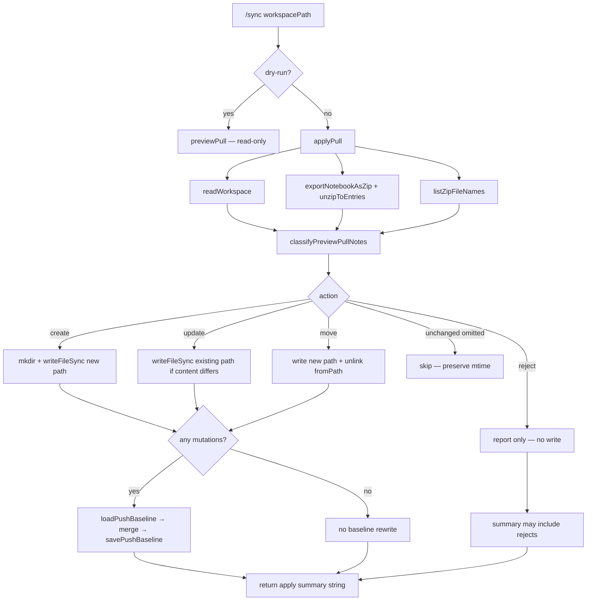

# Phase 10: Resolve incremental pull (story 3) - Research

**Researched:** 2026-08-03
**Domain:** CLI `/sync` mutating pull — create/update/move apply + sync baseline metadata (TypeScript, Vitest, Cypress CLI E2E)
**Confidence:** HIGH (in-repo contracts and gaps); MEDIUM (exact apply summary wording / baseline merge shape left to discretion)

<user_constraints>
## User Constraints (from CONTEXT.md)

### Locked Decisions

#### Gap coverage (EXP-03)
- **D-01:** Phase 10 closes **both** TRIAGE Story 3 gaps: (1) apply remote **create / rename / move** (not only intersecting-path overwrite), and (2) update `.doughnut-sync` sync metadata after a **successful mutating** pull. Partial “create-only” or “metadata-only” is not enough for EXP-03. — **Reversibility:** costly — shipping one gap leaves EXP-03 incomplete and invites a second Story 3 phase.

#### Apply action taxonomy
- **D-02:** Reuse Phase 9 pull classification semantics (`classifyPreviewPullNotes` / create · update · move · reject). `applyPull` must **apply** create (write new remote-only `.md`), update (overwrite differing intersecting path), and move (`doughnut_id` path change: rename/remove old path then write new path with remote content). Do **not** invent moves without identity — path-keyed create/update only when `doughnut_id` is missing (same as Phase 9 D-08). — **Reversibility:** costly — CLI/E2E contract for applied actions becomes the Story 3 proof surface; preview and apply must stay aligned.
- **D-03:** **Reject** paths (reserved names, duplicates, invalid mappings) are **not written**. Report rejects clearly in the apply result (do not silently skip). Safe create/update/move actions may still apply in the same run. Local-only files remain untouched. Unchanged intersecting files must not be rewritten (preserve mtime). Remote notes absent locally that are rejected must not be created. — **Reversibility:** reversible — report wording can refine later if semantics hold.
- **D-04:** Do **not** delete local-only Markdown when remote no longer has that path (oracle does not require remote-driven deletes). Leave local-only files alone. — **Reversibility:** reversible.

#### Sync metadata
- **D-05:** After a successful **mutating** pull (at least one create/update/move applied), update `.doughnut-sync/baseline.json` via existing `savePushBaseline` so pull and push share the same merge-base shape (`notebookId` + per-path agreed content). Include agreed content for notes touched by the pull (and keep consistency with how `/export` seeds baseline). — **Reversibility:** costly — push dry-run/push (Phases 12–13) depend on baseline meaning.
- **D-06:** A no-op pull (`No changes to pull.` — no creates/updates/moves applied) must **not** rewrite baseline or other sync metadata (oracle: no irrelevant VCS diffs). Rejects-only with zero applied mutations also must not rewrite baseline. — **Reversibility:** costly — false baseline churn breaks the no-change VCS acceptance bullet.

#### Implementation surface
- **D-07:** Primary strengthen lands in `applyPull` (and small helpers as needed). Prefer reusing `classifyPreviewPullNotes` from Phase 9 rather than duplicating create/move/reject rules. Touch `syncSlashCommand` only if needed to surface apply summaries. Do **not** weaken Phase 9 non-mutating dry-run. Prefer not changing backend zip in this phase unless a Story 3 proof is blocked (Phase 8 already supplies `doughnut_id`). — **Reversibility:** costly — splitting apply taxonomy away from preview reintroduces Story 2/3 drift.
- **D-08:** Flip/replace the intentional anti-create contract: unit `does not create a file for a remote-only note` and E2E `No new local file for a remote-only note` become create (and move) proofs. Keep green behaviors: intersecting update, local-only untouched, idempotent re-pull / no-op summary, `@perfSync` budget. — **Reversibility:** one-way — published E2E scenarios change from “never create” to “create/move when remote requires it”.

#### Proof strategy
- **D-09:** Prove via `cli_sync_pull.feature` (create, update, move when feasible, local-only untouched, idempotent re-pull, baseline updated only on mutate success / untouched on no-op) plus `cli/tests/applyPull.test.ts` (and focused helper units) for taxonomy edge cases. Capability-named tests only — no phase numbers in product/test names.

#### Plan / commit sizing (user request)
- **D-10:** Config granularity stays **coarse**. Phase 10 plans/commits must be **slightly larger** than Phases 8–9 micro-slices: prefer **1 plan** with **2–3 larger tasks** that each land a coherent observable chunk (e.g. apply create/move/update + units together; E2E + baseline proofs in the same plan when stop-safe). Avoid a separate tiny “E2E-only” plan unless a real wave dependency forces it. Prefer fewer commits that group related unit+E2E for the same behavior over per-test micro-commits. — **Reversibility:** reversible — planning preference only.

### Claude's Discretion
- Exact apply summary / reject wording and ordering (as long as D-02–D-06 hold and E2E proves them)
- Whether move is implemented as rename + write vs write-new + delete-old (must leave workspace correct and preserve local-only files)
- Exact baseline merge algorithm for paths not touched in this pull (keep prior agreed entries vs refresh from full remote export — choose the smallest change that keeps push baseline coherent)
- Whether rejects-only messaging reuses preview reject rendering helpers

### Deferred Ideas (OUT OF SCOPE)
- Story 4 `/lint` full portable contract — Phase 11
- Stories 5–6 push preview/push — Phases 12–13 (consume baseline semantics from D-05)
- Remote-driven **delete** of local notes when absent from export — out of oracle; not in this phase
- SEED-001 spelling follow-ons — parked
</user_constraints>

<phase_requirements>
## Phase Requirements

| ID | Description | Research Support |
|----|-------------|------------------|
| EXP-03 | Kept or strengthened incremental pull matches story 3 (unchanged files undisturbed; idempotent re-pull) — or removed cleanly | TRIAGE Story 3 verdict is **strengthen** (not remove). Close both gaps: (1) apply create/rename/move, (2) `savePushBaseline` after mutating success only. Flip anti-create proofs. Prove with `cli_sync_pull.feature` + `applyPull` units. HYG-02 standing: do not rewrite Terry Yin / Tan Yeong Sheng work. |
</phase_requirements>

## Summary

Phase 10 strengthens existing `/sync` (non-dry-run) → `applyPull` so mutating pull matches Story 3 acceptance: unchanged files keep content and mtime; new / changed / renamed / moved remote notes produce expected local filesystem changes; re-pull with no intervening edits is a filesystem no-op; `.doughnut-sync/baseline.json` updates only after a successful mutating operation; a no-change (or rejects-only) pull creates no irrelevant VCS diffs. TRIAGE already ruled **strengthen**; Phase 7’s decision is applied by closing both documented gaps in one Behavior phase.

Today `applyPull` iterates **workspace** paths only, overwrites when remote content differs, skips remote-only notes, never writes baseline, and returns `N note(s) updated.` / `No changes to pull.` Phase 9 already shipped `classifyPreviewPullNotes` with create · update · move · reject taxonomy — apply must **reuse** that classifier and execute safe actions on disk.

**Primary recommendation:** Rewrite `applyPull` to classify via `classifyPreviewPullNotes` (+ `listZipFileNames` for duplicates), apply create/update/move with Node `fs` writes, skip rejects while reporting them, call `savePushBaseline` only when ≥1 mutation applied, invert anti-create unit/E2E proofs, and ship as **1 coarse plan / 2–3 larger tasks**. Do not edit Terry-authored `previewPullActions.ts` (HYG-02) — import only.

## Architectural Responsibility Map

| Capability | Primary Tier | Secondary Tier | Rationale |
|------------|-------------|----------------|-----------|
| Mutating pull apply (create/update/move) | CLI (Node) | — | `applyPull` owns filesystem writes; D-07 |
| Action taxonomy / reject rules | CLI (shared classify) | — | Reuse `classifyPreviewPullNotes`; do not fork rules |
| Sync merge-base metadata | CLI | Push Phases 12–13 consumers | `savePushBaseline` / `.doughnut-sync/baseline.json` |
| `doughnut_id` identity for moves | Backend zip export | CLI reader | Phase 8 already emits identity; CLI only reads |
| Dry-run non-mutation | CLI (`previewPull`) | — | Must not regress; apply branch only |
| Story 3 acceptance proof | CLI units + E2E | — | `applyPull.test.ts` + `cli_sync_pull.feature` |
| Remote-driven local delete | Deferred (out of scope) | — | D-04 / oracle |

## Standard Stack

### Core

| Library | Version | Purpose | Why Standard |
|---------|---------|---------|--------------|
| TypeScript CLI (`cli/`) | in-repo | `/sync` mutating surface | TRIAGE entrypoint; no new runtime |
| Vitest | `4.1.10` `[VERIFIED: cli/package.json:50]` `"vitest": "4.1.10"` | Unit tests | Project CLI test runner |
| Node `fs` (`writeFileSync`, `mkdirSync`, `unlinkSync` / `renameSync`) | Node runtime | Apply create/update/move on disk | Already used by `applyPull` / export; no new deps `[CITED: nodejs/node fs.md via Context7]` |
| Cypress + cucumber | in-repo E2E | Capability E2E | Existing `cli_sync_pull.feature` |

### Supporting

| Library | Version | Purpose | When to Use |
|---------|---------|---------|-------------|
| `classifyPreviewPullNotes` | in-repo Phase 9 | Shared taxonomy | Always — D-02/D-07 |
| `savePushBaseline` / `loadPushBaseline` | in-repo | Sync metadata | After mutate success only — D-05/D-06 |
| `listZipFileNames` | in-repo | Duplicate detection input | Pass into classify (same as `previewPull`) |
| `renderRejectFinding` / `renderDiffReport` | in-repo | Optional reject report text | Discretion if apply summary needs reject lines |

### Alternatives Considered

| Instead of | Could Use | Tradeoff |
|------------|-----------|----------|
| Reuse `classifyPreviewPullNotes` | Duplicate classify in `applyPull` | Forbidden by D-07 — Story 2/3 drift |
| `savePushBaseline` | Ad-hoc JSON write | Breaks push merge-base shape (D-05) |
| New npm path library | Node `path` + `fs` | Unnecessary dependency |

**Installation:** none — no new packages.

**Version verification:** Vitest `4.1.10` confirmed in `cli/package.json`. No registry installs required.

## Package Legitimacy Audit

> No external packages are installed in this phase.

| Package | Registry | Age | Downloads | Source Repo | Verdict | Disposition |
|---------|----------|-----|-----------|-------------|---------|-------------|
| — | — | — | — | — | N/A | No installs |

**Packages removed due to [SLOP] verdict:** none  
**Packages flagged as suspicious [SUS]:** none

## Architecture Patterns

### System Architecture Diagram



### Recommended Project Structure

```
cli/src/sync/
├── applyPull.ts              # PRIMARY strengthen — classify + apply + baseline
├── previewPullActions.ts     # IMPORT ONLY (Terry Yin) — do not edit for HYG-02
├── pushBaseline.ts           # load/save — call from apply; prefer no API change
├── previewPull.ts            # read-only reference — do not regress
├── unzip.ts                  # listZipFileNames + unzipToEntries
└── readWorkspace.ts          # unchanged compare input
cli/tests/
├── applyPull.test.ts         # invert anti-create; add move/baseline/rejects
e2e_test/features/cli/
└── cli_sync_pull.feature     # invert anti-create; baseline / create scenarios
```

### Pattern 1: Classify then apply (aligned with dry-run)

**What:** One taxonomy function drives both preview labels and mutating writes.  
**When to use:** Always for Phase 10 apply.  
**Example:**

```typescript
// Source: pattern from cli/src/sync/previewPull.ts:64-75 + apply target
const workspace = readWorkspace(workspacePath)
const { bytes } = await exportNotebookAsZip(notebookId, signal)
const zipFileNames = listZipFileNames(bytes)
const exported = unzipToEntries(bytes)
const classified = classifyPreviewPullNotes(workspace, exported, zipFileNames)
// apply create|update|move; collect rejects; baseline iff mutations > 0
```

`PreviewPullAction` values `[VERIFIED: cli/src/sync/previewPullActions.ts:7]`:

```typescript
export type PreviewPullAction = 'create' | 'update' | 'move' | 'reject'
```

### Pattern 2: Baseline only after mutating success

**What:** Mirror export’s use of `savePushBaseline`, but gate on applied mutations.  
**When to use:** After ≥1 create/update/move write succeeds.  
**Example:**

```typescript
// Source: cli/src/sync/writeNotebookExport.ts:88-92 (export seeds full md map)
savePushBaseline(
  root,
  notebookId,
  new Map(entries.filter(([path]) => path.endsWith(MARKDOWN_SUFFIX)))
)
```

`savePushBaseline` signature `[VERIFIED: cli/src/sync/pushBaseline.ts:39-50]`:

```typescript
export function savePushBaseline(
  workspacePath: string,
  notebookId: number,
  notes: ReadonlyMap<string, string>
): void {
  const path = join(workspacePath, BASELINE_RELATIVE_PATH)
  mkdirSync(dirname(path), { recursive: true })
  const file: PushBaselineFile = {
    notebookId,
    notes: Object.fromEntries(notes),
  }
  writeFileSync(path, JSON.stringify(file), 'utf8')
}
```

**Discretion recommendation (baseline merge):** Start from `loadPushBaseline(workspace, notebookId)`. For each **applied** create/update: `set(path, exportContent)`. For each **applied** move: `delete(fromPath)` then `set(path, exportContent)`. Keep prior entries for untouched paths. Do **not** call `savePushBaseline` when zero mutations (including rejects-only). This is the smallest change that keeps push merge-base coherent without rewriting the whole notebook map on every pull.

### Pattern 3: Move on disk

**What:** Identity move = new path gets remote content; old path removed only when it was the workspace file holding that `doughnut_id`.  
**When to use:** Classified `action: 'move'` with `fromPath`.  
**Discretion recommendation:** Prefer **write-new + `unlinkSync(fromPath)`** (clearer when content also changed; works across dirs). Equivalent to rename only if content already matches and same FS — write+unlink is safer and still preserves local-only files (never unlink paths not in the move).

Node APIs `[CITED: Context7 /nodejs/node fs]`: `writeFileSync` replaces; `unlinkSync` deletes; `rename`/`renameSync` moves (overwrites destination if present).

### Anti-Patterns to Avoid

- **Duplicating classify rules in `applyPull`:** violates D-07; preview/apply drift.
- **Editing `previewPullActions.ts` for convenience:** Terry Yin authorship (Phase 9 commits) — HYG-02; import only.
- **Rewriting baseline on no-op / rejects-only:** violates D-06 / oracle VCS bullet.
- **Deleting local-only notes absent from export:** violates D-04.
- **Silent skip of rejects:** violates D-03.
- **Leaving anti-create E2E/unit green as “must not create”:** violates D-08.
- **Encoding phase numbers in test/scenario names:** planning.mdc / D-09.
- **Weakening `previewPull` or changing backend zip without need:** D-07.

## Don't Hand-Roll

| Problem | Don't Build | Use Instead | Why |
|---------|-------------|-------------|-----|
| Create/update/move/reject taxonomy | Second classifier | `classifyPreviewPullNotes` | Phase 9 already proven |
| Baseline JSON shape | Custom sync file | `savePushBaseline` / `loadPushBaseline` | Push stories share merge-base |
| Zip parse / duplicates | Custom inflate | `unzipToEntries` + `listZipFileNames` | Map collapse pitfall already known |
| Workspace walk | Ad-hoc readdir | `readWorkspace` | LF normalization handled |
| Reject reason strings | New vocabulary | Same reasons as preview classify | Story 2/3 alignment |
| E2E harness | New runner | Extend `cli_sync_pull.feature` | Already wired |

**Key insight:** Story 3 is **execute the Phase 9 taxonomy on disk + gate baseline writes** — not a new sync engine.

## Common Pitfalls

### Pitfall 1: Iterating workspace-only (current gap)
**What goes wrong:** Remote-only creates never land; anti-create stays “correct” by accident.  
**Why it happens:** Current loop `[VERIFIED: cli/src/sync/applyPull.ts:41-50]` walks `workspace`, not classified export actions.  
**How to avoid:** Drive writes from `classifyPreviewPullNotes` results.  
**Warning signs:** Anti-create test still passes after “strengthen.”

### Pitfall 2: Baseline churn on no-op
**What goes wrong:** `.doughnut-sync/baseline.json` mtime/content changes when nothing applied → fails oracle “no irrelevant VCS diffs.”  
**Why it happens:** Calling `savePushBaseline` unconditionally (like `previewPush` does today).  
**How to avoid:** D-06 — save only if mutation count ≥ 1; rejects-only → no save.  
**Warning signs:** No-op E2E creates or touches baseline when workspace was zip-seeded without one.

### Pitfall 3: Editing Terry-authored classify module
**What goes wrong:** HYG-02 violation.  
**Why it happens:** Temptation to tweak reject reasons or move edge cases in `previewPullActions.ts` (git log: Terry Yin Phase 9).  
**How to avoid:** Import `classifyPreviewPullNotes`; put apply/baseline/summary in `applyPull.ts` (Joy-kgo / XinxinKao surface).  
**Warning signs:** `git diff` lists `previewPullActions.ts`.

### Pitfall 4: Move deletes the wrong file / leaves stale path
**What goes wrong:** Local-only loss or duplicate note at old+new path.  
**Why it happens:** Path heuristics instead of `fromPath` from classify; or write without unlink.  
**How to avoid:** Only unlink classified `fromPath`; never delete local-only.  
**Warning signs:** Unit move leaves `less.md` after move to `scrum.md`.

### Pitfall 5: Summary still says only “updated” while creating
**What goes wrong:** E2E/unit assert create success but assistant text still looks like no-op or misleading.  
**Why it happens:** Current `summary(updated)` only counts intersecting overwrites `[VERIFIED: cli/src/sync/applyPull.ts:18-21]`.  
**How to avoid:** Count all applied mutations (create+update+move); discretion on exact wording; include reject lines when present (D-03).  
**Warning signs:** Create E2E sees file on disk but no clear assistant confirmation.

### Pitfall 6: Skipping `listZipFileNames`
**What goes wrong:** Duplicate rejects never fire; collapsed Map applies last duplicate.  
**Why it happens:** `unzipToEntries` collapses duplicates `[VERIFIED: cli/src/sync/unzip.ts:63-67]` (doc comment).  
**How to avoid:** Pass `listZipFileNames(bytes)` into classify like `previewPull`.  
**Warning signs:** Duplicate unit expects reject but creates a file.

### Pitfall 7: Regressing dry-run or `@perfSync`
**What goes wrong:** Phase 9 E2E fails or 1000-note pull exceeds 5s.  
**Why it happens:** Shared helper changes; O(n²) baseline rewrite; accidental preview mutation.  
**How to avoid:** Touch preview only if needed; keep perf unit/E2E; don’t rewrite entire baseline map unless necessary.  
**Warning signs:** `cli_sync_dry_run.feature` red; perf test >5s.

### Pitfall 8: E2E move blocked by missing title-rename step
**What goes wrong:** Plan assumes E2E move via “change note in Doughnut” but that step only changes **content**, not export path.  
**Why it happens:** `the note {string} is changed in Doughnut to {string}` → `setInjectedNoteContent` (content only).  
**How to avoid:** Prove **move in units** (zip fixtures with `doughnut_id`, same as `previewPullDiagnostics.test.ts`); E2E focus on create flip + update + baseline + no-op. Add E2E move only if a title/path-change step is already available or cheap.  
**Warning signs:** New E2E scenario tries content-change and expects filename change.

## Code Examples

### Current apply (gap baseline)

```typescript
// Source: cli/src/sync/applyPull.ts:40-52
  let updated = 0
  for (const [path, localContent] of workspace) {
    if (!path.endsWith(MARKDOWN_SUFFIX)) continue
    const remote = exported.get(path)
    if (remote === undefined || remote === localContent) continue

    const full = join(workspacePath, ...path.split(posix.sep))
    mkdirSync(dirname(full), { recursive: true })
    writeFileSync(full, remote, 'utf8')
    updated++
  }

  return summary(updated)
```

Sentinel `[VERIFIED: cli/src/sync/applyPull.ts:9]`:

```typescript
export const NOTHING_TO_PULL = 'No changes to pull.'
```

### Intentional anti-create proofs to invert (D-08)

Unit `[VERIFIED: cli/tests/applyPull.test.ts:54-61]`:

```typescript
  test('does not create a file for a remote-only note', async () => {
    write('less.md', 'Hello')

    await expect(
      pull({ 'less.md': 'Hello', 'scrum.md': 'Sprint' })
    ).resolves.toBe(NOTHING_TO_PULL)
    expect(() => readBack('scrum.md')).toThrow()
  })
```

E2E scenario title `[VERIFIED: e2e_test/features/cli/cli_sync_pull.feature:42]`:

```gherkin
  Scenario: No new local file for a remote-only note
```

Replace with create proofs (capability-named, no phase numbers).

### Move classify shape (reuse)

```typescript
// Source: cli/src/sync/previewPullActions.ts:116-121
  | {
      readonly action: 'move'
      readonly path: string
      readonly fromPath: string
      readonly workspaceContent: string
      readonly exportContent: string
    }
```

Unit move fixture pattern (from Phase 9 diagnostics — mirror in `applyPull.test.ts`):

```typescript
// Source: cli/tests/previewPullDiagnostics.test.ts:8-16
  test('reports a move when the same doughnut_id is at a different path', async () => {
    ws.write('less.md', '---\ndoughnut_id: 42\n---\n\n# less\n\nHello')

    const report = await ws.preview({
      'scrum.md': '---\ndoughnut_id: 42\n---\n\n# scrum\n\nHello',
    })

    expect(report).toContain('scrum.md (move)')
```

### Vitest / E2E commands

```bash
# Units — Context7: vitest run <file>
CURSOR_DEV=true nix develop -c pnpm -C cli exec vitest run tests/applyPull.test.ts

# If pushBaseline helpers change behavior callers care about:
CURSOR_DEV=true nix develop -c pnpm -C cli exec vitest run tests/pushBaseline.test.ts

# Do not regress dry-run if shared report helpers touched:
CURSOR_DEV=true nix develop -c pnpm -C cli exec vitest run tests/previewPull.test.ts tests/previewPullDiagnostics.test.ts

# Targeted CLI E2E
CURSOR_DEV=true nix develop -c pnpm cypress run --spec e2e_test/features/cli/cli_sync_pull.feature
```

## State of the Art

| Old Approach | Current Approach | When Changed | Impact |
|--------------|------------------|--------------|--------|
| Intersecting overwrite only | Apply create/update/move via shared classify | Phase 10 | EXP-03 |
| Intentional non-create | Create when remote-only and not rejected | Phase 10 / D-08 | Flip unit+E2E |
| No baseline on pull | `savePushBaseline` after mutate success | Phase 10 / D-05 | Push merge-base |
| Preview taxonomy only | Same taxonomy executed on disk | Phase 9 → 10 | Preview/apply alignment |

**Deprecated/outdated:**
- Docstring/help text claiming `/sync` “only updates files that already exist” (`syncSlashCommand` description) — update if user-visible (discretion).
- Anti-create as the Story 3 contract — superseded by strengthen.

## Assumptions Log

| # | Claim | Section | Risk if Wrong |
|---|-------|---------|---------------|
| A1 | Baseline merge = prior map + mutated paths (drop `fromPath` on move); not full export refresh every mutate | Pattern 2 / Discretion | Push dry-run may want fuller seeding after first pull-from-zip; may need “also seed all currently matching export∩workspace paths when prior empty” |
| A2 | Move on disk = write-new + unlink old (not renameSync) | Pattern 3 | Either works if tests pass; rename may fail across devices |
| A3 | E2E move is optional if units cover identity move; E2E prioritizes create flip + baseline | Pitfall 8 / D-09 | Oracle “renamed/moved” weaker without E2E — accept unit as “when feasible” |
| A4 | Apply summary may keep “N note(s) updated.” counting all mutations, plus reject lines | Discretion | E2E wording may prefer “created” / “moved” verbs — adjust in plan |
| A5 | `syncSlashCommand` help text update is optional polish, not EXP-03 blocker | Implementation surface | Users may still see stale “only existing files” help |

## Open Questions

1. **Baseline when zip-seeded workspace has no prior `.doughnut-sync`**
   - What we know: E2E `createCliWorkspaceFromZip` writes zip entries only — no `savePushBaseline` `[VERIFIED: e2e_test/config/cliE2ePluginWorkspaceTasks.ts:85-94]`. Export CLI seeds full baseline separately.
   - What's unclear: After first mutating pull, should baseline contain **only mutated paths** or **all currently matching export paths**?
   - Recommendation: A1 — mutate-path merge; if first pull leaves push stories weak, extend to seed all matching paths when prior empty (still one `savePushBaseline` call). Planner: lock in plan task acceptance.

2. **Rejects mixed with mutations — summary shape**
   - What we know: D-03 requires clear reject reporting; mutations may still apply.
   - Recommendation: Reuse `renderRejectFinding` lines + a short applied-count summary (discretion). Rejects-only must not be bare `No changes to pull.` alone (align Phase 9 rejects-only ≠ clean no-op).

3. **Destination path occupied during move**
   - What we know: Phase 9 plan preferred reject when destination holds a different `doughnut_id`.
   - Recommendation: Trust `classifyPreviewPullNotes` outcome; do not invent extra apply-only rules in this phase unless units expose a hole.

## Environment Availability

| Dependency | Required By | Available | Version | Fallback |
|------------|------------|-----------|---------|----------|
| Node | CLI units | ✓ | v24.5.0 (host); engines ≥26.5 | Prefer Nix shell |
| pnpm | scripts | ✓ | 11.19.0 | — |
| Vitest | unit proof | ✓ | 4.1.10 | — |
| Cypress / SUT | E2E | assume `pnpm sut` running | — | Start SUT before E2E |
| New npm packages | — | N/A | — | Do not install |

**Missing dependencies with no fallback:** none for code/unit work.  
**Missing dependencies with fallback:** host Node 24 vs engines 26 — use `CURSOR_DEV=true nix develop -c …`.

Step 2.6: no new external services beyond existing CLI sync E2E (local API export).

## Validation Architecture

> `workflow.nyquist_validation` is `true` in `.planning/config.json`.

### Test Framework

| Property | Value |
|----------|-------|
| Framework | Vitest `4.1.10` (CLI units); Cypress + cucumber (CLI E2E) |
| Config file | `cli/vitest.config.ts`; `e2e_test/config/ci.ts` |
| Quick run command | `CURSOR_DEV=true nix develop -c pnpm -C cli exec vitest run tests/applyPull.test.ts` |
| Full suite command (targeted phase gate) | Units above + `CURSOR_DEV=true nix develop -c pnpm cypress run --spec e2e_test/features/cli/cli_sync_pull.feature` |

### Phase Requirements → Test Map

| Req ID | Behavior | Test Type | Automated Command | File Exists? |
|--------|----------|-----------|-------------------|-------------|
| EXP-03 | Intersecting update preserves local-only | unit + e2e | `vitest run tests/applyPull.test.ts`; `cli_sync_pull.feature` | ✅ keep |
| EXP-03 | Create remote-only note | unit + e2e | same | ❌ invert anti-create (Wave 0) |
| EXP-03 | Move via `doughnut_id` | unit | `vitest run tests/applyPull.test.ts` | ❌ Wave 0 (E2E optional) |
| EXP-03 | Rejects not written; reported | unit | `vitest run tests/applyPull.test.ts` | ❌ Wave 0 |
| EXP-03 | Unchanged not rewritten / no-op | unit + e2e | existing no-op scenarios | ✅ keep |
| EXP-03 | Baseline after mutate only | unit (+ e2e if assertable) | `applyPull` + maybe `pushBaseline` | ❌ Wave 0 |
| EXP-03 | No baseline rewrite on no-op / rejects-only | unit | `applyPull.test.ts` | ❌ Wave 0 |
| EXP-03 | `@perfSync` budget | unit + e2e | existing perf scenarios | ✅ keep |
| HYG-02 | No Terry/YS rewrites | process | Diff must not edit Terry-owned hunks for cleanup; avoid `previewPullActions.ts` | manual gate |

### Sampling Rate
- **Per task commit:** `vitest run tests/applyPull.test.ts`
- **Per wave merge:** applyPull (+ pushBaseline if touched; previewPull* if shared helpers touched)
- **Phase gate:** targeted `cli_sync_pull.feature` green; no `@wip` left on new scenarios

### Wave 0 Gaps
- [ ] Invert unit anti-create → assert remote-only file created + non-`NOTHING_TO_PULL` summary
- [ ] Unit: identity **move** writes new path, removes `fromPath`, preserves local-only
- [ ] Unit: reserved/duplicate/unsafe **reject** not written; message contains reject
- [ ] Unit: rejects-only does **not** call baseline write / no `.doughnut-sync` created
- [ ] Unit: mutate success writes/updates `.doughnut-sync/baseline.json` with agreed content for touched paths
- [ ] Unit: no-op does not create/update baseline
- [ ] Invert E2E `No new local file for a remote-only note` → create proof
- [ ] E2E: baseline present/updated after mutating pull; absent/unchanged after no-op (may need thin cy.task assert)
- [ ] Keep update / local-only / no-op / `@perfSync` green

## Security Domain

> `security_enforcement` enabled; ASVS level 1 in config.

### Applicable ASVS Categories

| ASVS Category | Applies | Standard Control |
|---------------|---------|-----------------|
| V2 Authentication | no (existing CLI token session) | — |
| V3 Session Management | no | — |
| V4 Access Control | no new endpoints | notebook export auth unchanged |
| V5 Input Validation | **yes** | Reject unsafe zip paths; never write rejects; never write `.doughnut-sync/**` as note targets |
| V6 Cryptography | no | — |

### Known Threat Patterns for CLI sync apply

| Pattern | STRIDE | Standard Mitigation |
|---------|--------|---------------------|
| Zip path traversal on write | Tampering | Classify reject / mirror `assertSafeEntryPath`; do not write rejects |
| Sync metadata poisoning | Tampering | Only `savePushBaseline` after successful mutations; reject `.doughnut-sync/**` pull targets |
| Accidental remote delete of local notes | Tampering / DoS | D-04: no remote-driven deletes |
| Overwriting local-only via bad move | Tampering | Unlink only classified `fromPath` |
| Secret leakage | Information disclosure | Do not dump tokens; only workspace/export note content |

## Project Constraints (from .cursor/rules/)

| Source | Directive |
|--------|-----------|
| `planning.mdc` | Behavior phase; one observable behavior; stop-safe; ~5 min fuzzy / >10 min finer-decompose; capability-named tests; targeted E2E not full suite; `@wip` until green; Jidoka; post-change-refactor; commit+push before next phase |
| `gsd-coexistence.mdc` | Local Behavior/Structure + wrap-up overrides plain GSD; Nix prefix for tooling; no phase numbers in product names; `granularity: coarse` honored via D-10 |
| `cli.mdc` | Small public exports; Vitest observable behavior; `pnpm cli:test` / format / lint; CLI E2E under `e2e_test/features/cli/`; no fixed-time waits in units |
| `e2e-authoring.mdc` | Targeted `cypress run --spec`; capability-named features; thin step defs; no `@focus`/`@only` commits |
| `general.mdc` | Nix for tooling; git without Nix; trash not rm; high cohesion; no past-impl comments in product code |
| HYG-02 / PROJECT | Do not touch Terry Yin / Tan Yeong Sheng changes — **import** `previewPullActions.ts`, do not rewrite |

## Recommended plan shape (coarse — D-10)

Prefer **one** PLAN with **2–3 larger tasks** (not Phase 9’s two micro-plans):

1. **Task A — Apply taxonomy + units:** Rewrite `applyPull` to classify+apply create/update/move; report rejects; baseline gate; invert/extend `applyPull.test.ts` (create, move, reject, baseline, no-op). Keep update/local-only/perf units green.
2. **Task B — E2E + baseline acceptance:** Invert anti-create scenario; add/adjust no-op and mutate baseline assertions; keep update/local-only/`@perfSync`. Optionally update `/sync` help text.
3. **Task C (only if needed) — Wrap-up:** post-change-refactor, help-text polish, any E2E helper for baseline assert — fold into B if stop-safe.

Stop-safe: after Task A alone, units prove EXP-03 gaps closed at module level; Task B proves user-visible Story 3.

## Sources

### Primary (HIGH confidence)
- In-repo: `applyPull.ts`, `previewPullActions.ts`, `pushBaseline.ts`, `previewPull.ts`, `writeNotebookExport.ts`, `unzip.ts`, `applyPull.test.ts`, `cli_sync_pull.feature`, TRIAGE Story 3, oracle Story 3 bullets, Phase 9 CONTEXT
- Context7 Vitest CLI run-file patterns (stored research digest)
- Context7 Node `fs` write/unlink/rename (stored research digest)

### Secondary (MEDIUM confidence)
- Baseline merge algorithm recommendation (discretion A1)
- Exact apply summary wording (discretion)

### Tertiary (LOW confidence)
- None material — domain is in-repo

## Metadata

**Confidence breakdown:**
- Standard stack: HIGH — no new packages; Vitest/Node/`fs` confirmed
- Architecture: HIGH — classify→apply→baseline gate is forced by D-01..D-07 and existing modules
- Pitfalls: HIGH — current anti-create + missing baseline are documented TRIAGE gaps; HYG-02/Terry classify ownership verified via git log

**Research date:** 2026-08-03  
**Valid until:** 2026-09-02 (stable in-repo contracts; re-check if Phase 9 classify API changes)

**Graph context:** `.planning/graphs/graph.json` absent — skipped graphify queries.
