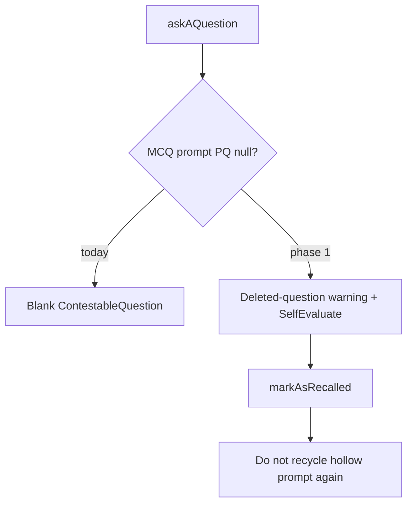

# Recall: deleted predefined question warning

**Status:** planned  
**Type layout:** Behavior → Structure (only as needed for next Behavior)  
**Depends on:** note question delete already SET NULL on `recall_prompt.predefined_question_id` (done)

## Goal

Learner opens recall and hits a due note whose unanswered MCQ `recall_prompt` lost its predefined question (deleted from Questions). They see a clear English warning and can finish that recall slot without a blank contest UI or NPE on answer/contest.

**Out of scope (later):** auto-regenerate a replacement AI question from the warning screen; Chinese copy; MemoryTracker history list polish.

## Locked decisions

| Topic | Choice | Why |
|-------|--------|-----|
| Copy | `This question was deleted and cannot be reviewed.` | Matches existing recall UI language (English) |
| Detection | Non-spelling tracker + `askAQuestion` returns a prompt with **no** `multipleChoicesQuestion` (MCQ row, PQ nulled) | No new API field required for phase 1; DTO already nulls MCQ when PQ missing |
| Continue action | Same as `JustReview`: note preview + **SelfEvaluateButtons** → `markAsRecalled` | Learner can leave the slot; avoids inventing a new schedule API |
| Hollow prompt after continue | **Remove** (or otherwise abandon) unanswered MCQ prompts with null PQ when learner self-evaluates from this screen, **or** stop recycling them on next `askAQuestion` | Otherwise the same hollow prompt returns forever (`findUnansweredByMemoryTracker` currently allows `pq.id IS NULL`) |
| Spelling | Unchanged | Spelling prompts are null-PQ by design; path is separate in `Quiz.vue` |

## Current anchors

- Delete → null FK: `PredefinedQuestionService.deleteQuestions`
- Recycle: `RecallPromptRepository.findUnansweredByMemoryTracker` — `pq.id IS NULL OR …` reuses orphaned MCQ
- UI: `Quiz.vue` → `ContestableQuestion` when any prompt exists → blank if no MCQ stem
- Self-eval pattern: `JustReview.vue` + `MemoryTrackerController.markAsRecalled`
- E2E recall setup: assimilate + day travel + `visitRecallPage` (see `e2e_test/features/recall/`)
- Delete E2E: `predefined_questions_management.feature` (list only today)



## Phase 1 — Behavior: show deleted-question warning in recall

**Status:** done

Delivered:
- E2E `recall_deleted_question.feature` green
- `Quiz.vue` warning + JustReview for hollow MCQ prompts
- `markAsRecalled` removes orphaned unanswered MCQ prompts
- Unit tests: Quiz, RecallQuestionService, MemoryTrackerService.OrphanedMcqCleanup
  
**Observable**

- **Pre:** Note assimilated; unanswered MCQ `recall_prompt` exists; trainer deleted that predefined question (FK null).
- **Trigger:** Learner opens recall and reaches that memory tracker.
- **Post:** Sees `This question was deleted and cannot be reviewed.`; does **not** see empty contestable MCQ; can self-evaluate and leave the slot; **reopening recall does not trap them on the same hollow prompt**.

### 1a. E2E first (`@wip`)

Capability-named feature (prefer extend recall suite, e.g. `e2e_test/features/recall/…` — not phase-numbered):

1. Create note + predefined question; assimilate; advance day so recall is due.
2. Ensure an unanswered MCQ prompt exists for that tracker (AI mock and/or testability inject — match existing recall quiz features).
3. Delete the question via Questions UI or testability.
4. Visit recall → assert warning text visible; assert no MCQ choices UI.
5. Self-evaluate → advance; assert not stuck on the same hollow prompt.

### 1b. Smallest production change

- **Frontend:** In `Quiz.vue` (non-spelling branch), if `currentRecallPrompt` exists and `multipleChoicesQuestion` is missing → render warning alert + `JustReview`-equivalent controls (reuse `JustReview` with a banner above, or thin wrapper component). Do **not** mount `ContestableQuestion`.
- **Backend (same phase, required for stop-safe):** Stop recycling unanswered **MCQ** prompts with null `predefined_question_id` (tighten `findUnansweredByMemoryTracker` / `generateAQuestion`, and/or delete those rows when asking or when marking recalled from this path). Spelling must remain correct.
- Controller/service tests for recycle / ask behavior with orphaned MCQ.
- Remove `@wip` when E2E green.

### Verify

```bash
CURSOR_DEV=true nix develop -c pnpm cypress run --spec e2e_test/features/recall/<chosen>.feature
CURSOR_DEV=true nix develop -c pnpm backend:test_only -- --tests <focused Recall* / Predefined* tests>
```

## Phase 2 — Behavior (optional follow-up): offer a new question

**Status:** planned (only if phase 1 feels incomplete in use)

**Observable:** From the deleted-question screen, learner can request a **new** AI question for the same note and continue quiz normally.

Defer until phase 1 is shipped and you decide self-eval alone is not enough.

## Stop-safe

After phase 1 only: trainers can delete questions; learners who hit those slots see why and can finish the day without a broken contest UI or infinite hollow recycle.

## Complete file change list (phase 1 estimate)

| Area | Likely files |
|------|----------------|
| E2E | New or extended `e2e_test/features/recall/*.feature`; steps / page objects under `e2e_test/start/` |
| Frontend | `frontend/src/components/recall/Quiz.vue`; possibly small banner component; `JustReview.vue` reuse |
| Backend | `RecallPromptRepository.java` and/or `RecallQuestionService.java`; focused tests |
| Not needed | Flyway (FK already nullable); OpenAPI regen unless DTO gains an explicit flag (phase 1 avoids that) |
