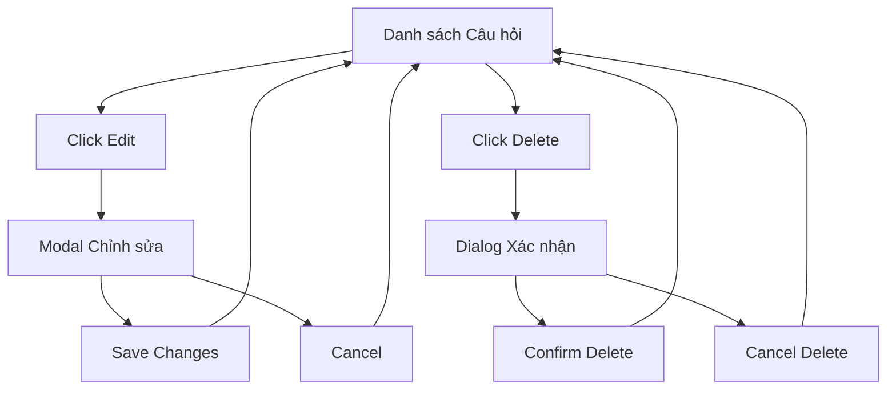

# Tài liệu Yêu cầu Sản phẩm: Chỉnh sửa và Xóa Câu hỏi

## 1. Tổng quan Sản phẩm

Tính năng cho phép người dùng chỉnh sửa nội dung câu hỏi (stem và các lựa chọn) và xóa câu hỏi hoàn toàn khỏi danh sách câu hỏi của một note. Hiện tại hệ thống chỉ hỗ trợ thêm câu hỏi và toggle trạng thái phê duyệt.

Tính năng này giúp người dùng quản lý câu hỏi hiệu quả hơn, cho phép cải thiện chất lượng câu hỏi và loại bỏ những câu hỏi không phù hợp.

## 2. Tính năng Cốt lõi

### 2.1 Vai trò Người dùng

| Vai trò | Phương thức Đăng ký | Quyền Cốt lõi |
|---------|---------------------|----------------|
| Chủ sở hữu Note | Đăng nhập hiện có | Có thể chỉnh sửa, xóa câu hỏi của note thuộc sở hữu |
| Người dùng có quyền | Được cấp quyền | Có thể chỉnh sửa, xóa câu hỏi của note được chia sẻ |

### 2.2 Module Tính năng

Các trang cần thiết cho yêu cầu quản lý câu hỏi:
1. **Trang Danh sách Câu hỏi**: hiển thị danh sách câu hỏi, nút chỉnh sửa và xóa
2. **Modal Chỉnh sửa Câu hỏi**: form chỉnh sửa nội dung câu hỏi
3. **Dialog Xác nhận Xóa**: xác nhận trước khi xóa câu hỏi

### 2.3 Chi tiết Trang

| Tên Trang | Tên Module | Mô tả Tính năng |
|-----------|------------|------------------|
| Danh sách Câu hỏi | Bảng câu hỏi | Hiển thị danh sách câu hỏi với nút Edit và Delete cho mỗi câu hỏi |
| Danh sách Câu hỏi | Nút hành động | Thêm nút "Edit" và "Delete" vào mỗi hàng câu hỏi |
| Modal Chỉnh sửa | Form chỉnh sửa | Cho phép chỉnh sửa stem, các lựa chọn A/B/C/D và đáp án đúng |
| Modal Chỉnh sửa | Nút lưu/hủy | Lưu thay đổi hoặc hủy bỏ chỉnh sửa |
| Dialog Xóa | Xác nhận xóa | Hiển thị thông báo xác nhận và nút "Xóa"/"Hủy" |

## 3. Quy trình Cốt lõi

**Quy trình Chỉnh sửa Câu hỏi:**
1. Người dùng xem danh sách câu hỏi của note
2. Click nút "Edit" trên câu hỏi muốn chỉnh sửa
3. Modal chỉnh sửa mở ra với dữ liệu câu hỏi hiện tại
4. Người dùng chỉnh sửa nội dung câu hỏi
5. Click "Save" để lưu thay đổi hoặc "Cancel" để hủy
6. Danh sách câu hỏi được cập nhật

**Quy trình Xóa Câu hỏi:**
1. Người dùng xem danh sách câu hỏi của note
2. Click nút "Delete" trên câu hỏi muốn xóa
3. Dialog xác nhận xuất hiện
4. Người dùng xác nhận xóa hoặc hủy bỏ
5. Nếu xác nhận, câu hỏi bị xóa khỏi danh sách

## 4. Thiết kế Giao diện Người dùng

### 4.1 Phong cách Thiết kế

- **Màu chính**: #4caf50 (xanh lá cho nút Save), #f44336 (đỏ cho nút Delete)
- **Màu phụ**: #2196f3 (xanh dương cho nút Edit)
- **Kiểu nút**: Rounded corners với shadow nhẹ
- **Font**: Sử dụng font hiện tại của hệ thống
- **Layout**: Card-based với spacing đều đặn
- **Icons**: Material Design icons cho Edit (✏️) và Delete (🗑️)

### 4.2 Tổng quan Thiết kế Trang

| Tên Trang | Tên Module | Các Phần tử UI |
|-----------|------------|----------------|
| Danh sách Câu hỏi | Bảng câu hỏi | Thêm cột "Actions" với nút Edit (màu xanh) và Delete (màu đỏ) |
| Modal Chỉnh sửa | Form | Background overlay, modal trắng với border radius 8px, form fields với label rõ ràng |
| Dialog Xóa | Confirmation | Modal nhỏ với icon warning, text xác nhận và 2 nút Cancel/Delete |

### 4.3 Responsive

Tính năng được thiết kế desktop-first với hỗ trợ mobile-adaptive. Trên mobile, các nút action sẽ được hiển thị dưới dạng dropdown menu để tiết kiệm không gian.