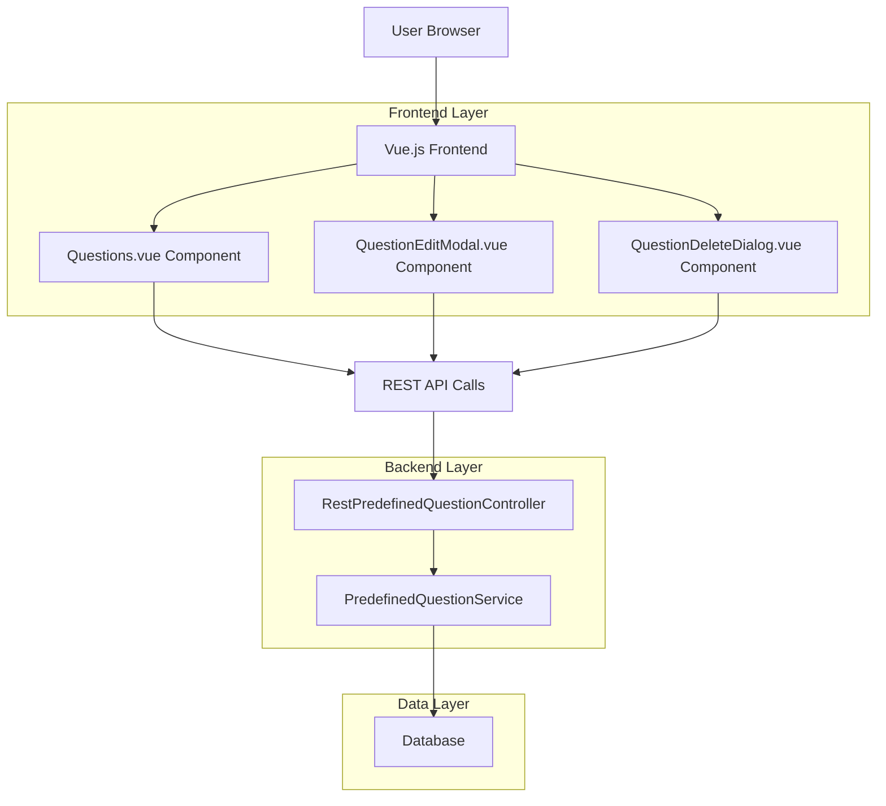
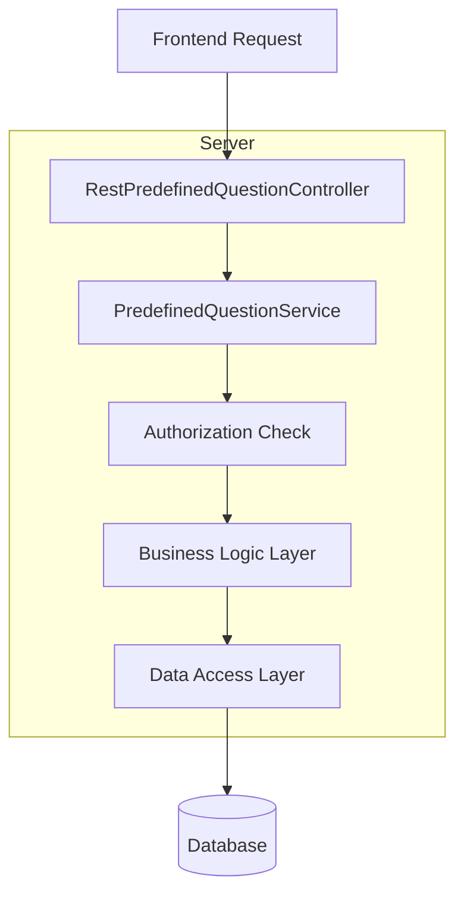
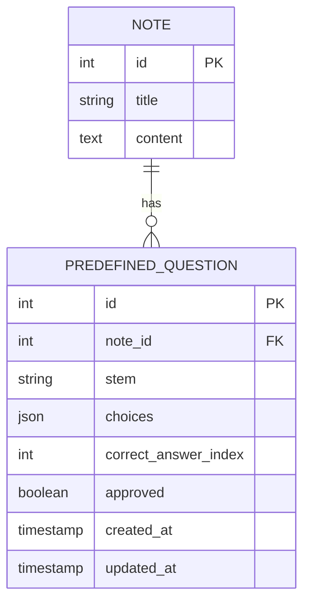

# Tài liệu Kiến trúc Kỹ thuật: Chỉnh sửa và Xóa Câu hỏi

## 1. Thiết kế Kiến trúc



## 2. Mô tả Công nghệ

- Frontend: Vue.js 3 + TypeScript + Vite
- Backend: Spring Boot + Java
- Database: Existing database với bảng PredefinedQuestion
- API Client: Generated OpenAPI TypeScript client

## 3. Định nghĩa Route

| Route | Mục đích |
|-------|----------|
| /notes/:id/questions | Trang quản lý câu hỏi của note (hiện có, cần cập nhật UI) |

## 4. Định nghĩa API

### 4.1 Core API

**Cập nhật câu hỏi**
```
PUT /api/predefined-questions/{questionId}
```

Request:
| Tên Param | Kiểu Param | Bắt buộc | Mô tả |
|-----------|------------|----------|-------|
| questionId | number | true | ID của câu hỏi cần cập nhật |
| stem | string | true | Nội dung câu hỏi |
| choices | string[] | true | Mảng các lựa chọn A, B, C, D |
| correctAnswerIndex | number | true | Index của đáp án đúng (0-3) |

Response:
| Tên Param | Kiểu Param | Mô tả |
|-----------|------------|-------|
| id | number | ID của câu hỏi |
| stem | string | Nội dung câu hỏi đã cập nhật |
| choices | string[] | Các lựa chọn đã cập nhật |
| correctAnswerIndex | number | Index đáp án đúng |

Example Request:
```json
{
  "stem": "What is the capital of France?",
  "choices": ["Paris", "London", "Berlin", "Madrid"],
  "correctAnswerIndex": 0
}
```

**Xóa câu hỏi**
```
DELETE /api/predefined-questions/{questionId}
```

Request:
| Tên Param | Kiểu Param | Bắt buộc | Mô tả |
|-----------|------------|----------|-------|
| questionId | number | true | ID của câu hỏi cần xóa |

Response:
| Tên Param | Kiểu Param | Mô tả |
|-----------|------------|-------|
| success | boolean | Trạng thái xóa thành công |
| message | string | Thông báo kết quả |

Example Response:
```json
{
  "success": true,
  "message": "Question deleted successfully"
}
```

## 5. Sơ đồ Kiến trúc Server



## 6. Mô hình Dữ liệu

### 6.1 Định nghĩa Mô hình Dữ liệu



### 6.2 Ngôn ngữ Định nghĩa Dữ liệu

**Bảng PredefinedQuestion (hiện có, không cần thay đổi cấu trúc)**
```sql
-- Bảng đã tồn tại, chỉ cần thêm index cho performance
CREATE INDEX IF NOT EXISTS idx_predefined_question_note_id 
ON predefined_question(note_id);

CREATE INDEX IF NOT EXISTS idx_predefined_question_updated_at 
ON predefined_question(updated_at DESC);
```

**Thêm constraint để đảm bảo data integrity**
```sql
-- Đảm bảo correct_answer_index nằm trong khoảng hợp lệ
ALTER TABLE predefined_question 
ADD CONSTRAINT chk_correct_answer_index 
CHECK (correct_answer_index >= 0 AND correct_answer_index <= 3);

-- Đảm bảo choices array có đúng 4 phần tử
ALTER TABLE predefined_question 
ADD CONSTRAINT chk_choices_length 
CHECK (JSON_LENGTH(choices) = 4);
```

## 7. Thay đổi Frontend Components

### 7.1 Cập nhật Questions.vue
- Thêm nút Edit và Delete cho mỗi câu hỏi
- Thêm event handlers cho edit và delete actions
- Import và sử dụng QuestionEditModal và QuestionDeleteDialog

### 7.2 Tạo QuestionEditModal.vue
- Form chỉnh sửa với fields: stem, choices[4], correctAnswerIndex
- Validation cho input
- API call để cập nhật câu hỏi

### 7.3 Tạo QuestionDeleteDialog.vue
- Dialog xác nhận xóa
- API call để xóa câu hỏi
- Emit event để cập nhật danh sách câu hỏi

### 7.4 Cập nhật QuestionManagement.vue
- Thêm các nút Edit và Delete
- Integrate với modal và dialog components

## 8. Backend Implementation

### 8.1 Thêm methods vào RestPredefinedQuestionController
```java
@PutMapping("/{questionId}")
@Transactional
public PredefinedQuestion updateQuestion(
    @PathVariable("questionId") PredefinedQuestion question,
    @Valid @RequestBody PredefinedQuestion updatedQuestion)
    throws UnexpectedNoAccessRightException

@DeleteMapping("/{questionId}")
@Transactional
public ResponseEntity<Map<String, Object>> deleteQuestion(
    @PathVariable("questionId") PredefinedQuestion question)
    throws UnexpectedNoAccessRightException
```

### 8.2 Thêm methods vào PredefinedQuestionService
```java
public PredefinedQuestion updateQuestion(PredefinedQuestion existing, PredefinedQuestion updated)
public boolean deleteQuestion(PredefinedQuestion question)
```