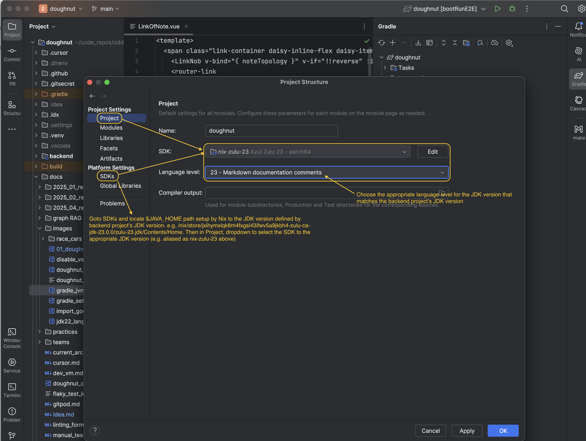

# IntelliJ IDEA (Community) IDE project setup

Launch your IntelliJ IDE from your host OS.

## Setup IntelliJ IDEA SDK with appropriate JDK version defined in `backend` project

- Locate your `nix develop` installed JDK path location from the header printout on entering `nix develop` ($JAVA_HOME is printed to stdout on entering `nix develop`).
  - e.g. On macOS this could look like `/nix/store/l4b6n5yhxcs3ys5s7kia7ch23dp8zyzq-zulu-ca-jdk-25.0.0/Library/Java/JavaVirtualMachines/zulu-25.jdk/Contents/Home`.
- **File -> Project Structure -> Platform Settings -> SDKs -> Add JDK...**
  - Enter the full path of above (e.g. `/nix/store/l4b6n5yhxcs3ys5s7kia7ch23dp8zyzq-zulu-ca-jdk-25.0.0/Library/Java/JavaVirtualMachines/zulu-25.jdk/Contents/Home`).
    
  - Ensure JDK level is set to appropriate JDK version defined in your backend project's `build.gradle` file.
    

## Run a single targetted JUnit5 test in IntelliJ IDEA

- Setup IntelliJ in Gradle perspective -> Gradle Settings (Wrench Icon) -> Run tests with -> IntelliJ IDEA
  - 
  - 
- Locate your test file in IDE (e.g. [`backend/src/test/java/com/odde/doughnut/controllers/RestNoteControllerTests.java`](../backend/src/test/java/com/odde/doughnut/controllers/RestNoteControllerTests.java)).
  - Locate specific test method to run and look out for green run arrow icon in line number gutter.
  - Click on the green run arrow icon to kick off incremental build and single test run.
