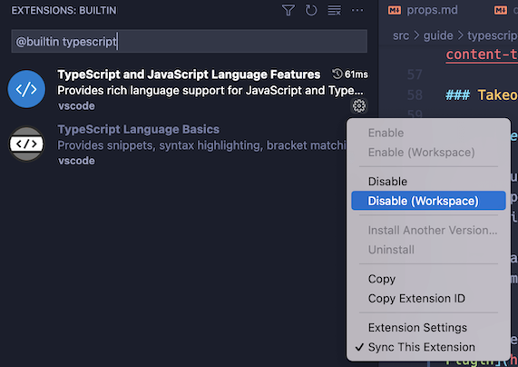

## [Style Guide](./docs/styleguide.md)

## Code linting and formating (cypress, frontend & backend code)

Details of dum/yarn task aliases described below is visible in `doughnut/package.json`
and `doughnut/frontend/package.json`.

### 1. VSCode IDE extension for Vue3 Typescript

##### 1.1. Install Volar VSCode Typescript extension for Vue3

[Volar](https://marketplace.visualstudio.com/items?itemName=Vue.volar) replaces Vetur, the previous
official VSCode extension for Vue 2.

If you have Vetur currently installed, make sure to disable it in Vue 3 projects.

##### 1.2. Turn on Volar Takeover mode

To enable Takeover Mode, you need to disable VSCode's built-in TS language service in your project's
workspace only by following these steps:

- In your project workspace, bring up the command palette with Ctrl + Shift + P (macOS: Cmd + Shift + P).
- Type built and select "Extensions: Show Built-in Extensions".
- Type typescript in the extension search box (do not remove @builtin prefix).
- Click the little gear icon of "TypeScript and JavaScript Language Features", and select "Disable (
  Workspace)".
- Reload the workspace. Takeover mode will be enabled when you open a Vue or TS file.
  

### 2. Formatting

From `doughnut` source root directory, run:

##### 2.1. Format All code

```bash
dum format:all
```

##### 2.2. Backend Java code formatting

```bash
dum backend:format
```

##### 2.3. Frontend Vue3/Typescript code formatting

```bash
dum frontend:format
```

##### 2.4. Cypress E2E Typescript code formatting

```bash
dum cy:format
```

### 3. Linting

Linting is mostly for the CI server to check for any leaked warnings or errors.
Developers should use format instead of lint.
From `doughnut` source root directory, run:

##### 3.1. Lint All code

```bash
dum lint:all
```

##### 3.2. Backend Java code linting

```bash
dum backend:lint
```

##### 3.3. Frontend Vue3/Typescript code linting

```bash
dum frontend:lint
```

##### 3.4. Cypress E2E Typescript code linting

```bash
dum cy:lint
```
