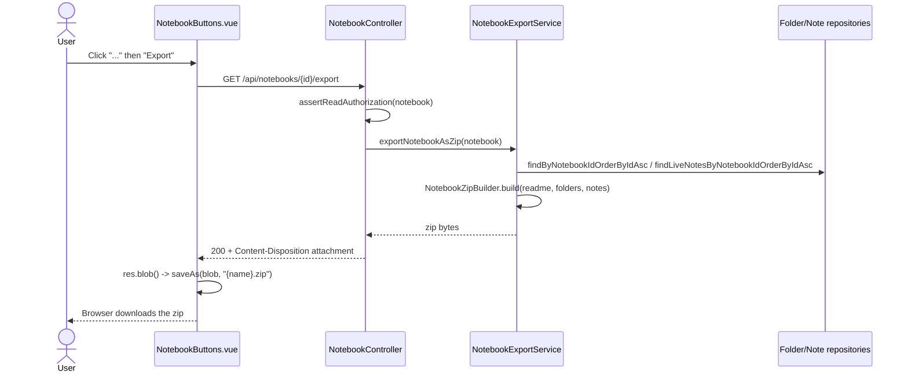

# Export Notebook to Markdown Zip Implementation Plan

> **For Agent:** Execute this plan task-by-task. Follow each step exactly, verify test results before proceeding, and commit after each task. **After each COMMIT step, stop and wait for the user's review before starting the next task.** Never `git push` — the user reviews each commit locally and pushes to the remote themselves (or tells you to).
> **TDD Rule:** No production code without a failing test first.

**Goal:** Let a user export one of their notebooks as a downloadable `.zip` containing the folder hierarchy as directories and every note/folder/notebook readme as a clean `.md` file.
**Architecture:** A framework-free `NotebookZipBuilder` (pure tree-to-zip algorithm, unit tested without Spring/DB) is wrapped by a thin `NotebookExportService` that loads the flat `Folder`/`Note` rows via existing repositories, which is exposed through a new `GET /api/notebooks/{notebook}/export` endpoint returning `ResponseEntity<byte[]>` with `Content-Disposition: attachment`, following the existing Books-download response pattern. Each exported note file strips Doughnut-internal leading YAML frontmatter (via the existing `NoteContentMarkdown.bodyWithoutLeadingFrontmatter`) and is prefixed with a `# {title}` heading, since title lives in a separate DB column from content. The frontend downloads the zip with a plain `fetch()` + `file-saver`, mirroring the existing `useBookReadingBootstrap.ts` raw-fetch pattern (not the generated SDK, which isn't built for binary bodies).
**Tech Stack:** Spring Boot (Java, JUnit 5, Hamcrest, `makeMe` fixtures), Vue 3 + Vitest + Testing Library, `file-saver` (already a dependency).
**Complexity Path:** `E2E path` — user-facing UI action, spans backend (entities → repositories → service → controller) and frontend (component → download), matching the plan skill's E2E-path criteria.
**Status:** In Progress

---

## Requirements

### User Stories
- As a notebook owner, I want to export a notebook from its "..." menu on the Notebooks page, so that I get a `.zip` of clean Markdown files I can use outside Doughnut.

### Acceptance Criteria
- Given a notebook with root notes, nested folders, and folder/notebook readme content, when the owner clicks "Export" in the notebook's overflow menu, then the browser downloads a `.zip` whose structure mirrors the notebook: each folder becomes a directory, each note becomes a `{title}.md` file, and each folder/notebook readme (when non-blank) becomes a `README.md` inside its directory.
- Given a note whose stored content starts with Doughnut-internal YAML frontmatter (`wikidata_id`, `image`, `image_mask`, relationship `type`/`source`/`target`, etc.), when exported, then that frontmatter is stripped — the `.md` file contains a `# {title}` heading followed by only the actual body text, with no internal metadata.
- Given two sibling notes with the same title in the same folder, when exported, then the first keeps the clean filename and the second gets its note id appended (e.g. `Recipe (2).md`) so no file is silently overwritten.
- Given a note title containing filesystem-invalid characters (`/ \ : * ? " < > |` or control characters), when exported, then those characters are replaced so the resulting filename is valid on typical filesystems.
- Given a user who does not own the notebook (only subscribes to it), when they view that notebook's row, then no Export action is offered (Export only appears on `NotebookButtons.vue`, not `SubscriptionNoteButtons.vue`).
- Given the export request fails at the network/server level, when the user clicks Export, then an error toast is shown instead of failing silently.

### Assumptions, Constraints, and Scope Boundaries
- "Clean markdown" is defined as: leading Doughnut-internal frontmatter (wikidata_id, image paths, etc.) stripped, **except** a minimal `doughnut_id: {note.id}` frontmatter block is kept as a stable identity (see "Cross-team alignment" below), plus a `# {title}` heading prepended (title lives in a separate DB column from content, so without this the file body would never show its own title). Wiki-links (`[[Title]]`) inside note bodies are left as literal text — still readable, just not exported as resolved external hyperlinks; treated as out of scope for v1.
- Zip generation is synchronous: built fully in memory per request and streamed back in one response (matches the existing Books file-download pattern; no background job infra exists or is being added).
- Only live (non-soft-deleted) notes are exported — reuses `NoteRepository.findLiveNotesByNotebookIdOrderByIdAsc`, same convention as other notebook-wide listings.
- No depth limit is enforced (none exists anywhere else in the Folder/Note model today).
- Backend authorization stays `assertReadAuthorization` (same as other read endpoints, so subscribers *can* still hit the endpoint directly) — restricting the button to owners only is a **frontend UI scope decision**, not a backend permission change.
- A Cypress/Cucumber E2E feature is added using the existing `cy.task('fileShouldExistSoon', ...)` download-verification pattern (already used by `e2e_test/step_definitions/audio.ts` for the "Save Audio Locally" download) — no new Cypress infra is needed. The E2E scenario only proves the full click-through path (Export button -> real backend -> real browser download landing in `e2e_test/downloads/`) plus a lightweight "is this actually a zip" magic-byte (`PK`) check; it deliberately does not re-verify zip *content* structure, since that's already exhaustively covered by `NotebookZipBuilderTest`/`NotebookExportServiceTest`.
- Regenerating `packages/generated/doughnut-backend-api/*` after the backend change is treated as a **generated-code exception** (user-approved): run `pnpm generateTypeScript`, verify the diff and that `pnpm test:api-summary` still passes — no fabricated TDD steps for that mechanical step.
- No new DB migration needed — `Notebook.readmeContent`, `Folder.readmeContent`/`name`/`parentFolder`, and `Note.title`/`content`/`folder` already carry everything required.
- **Cross-team alignment (superseded 2026-07-28, after Tasks 1-7 already shipped):** `.planning/notes/2026-07-24-portable-notebook-workspace.md` describes a bigger bidirectional Doughnut↔Obsidian sync epic (not yet promoted). Initially we deliberately did not align with it. Mid-execution we discovered `docs/refinement/2026-07-27/QUESTIONS-for-export-team.md` — a document from the team building `/sync --dry-run` in `cli/`, addressed directly to "the team building `/export`" (us), listing blocking questions about this exact export. Two of their contract questions directly conflicted with what we'd already shipped, so we reworked it (commit `d5c158e39c`):
  - Index files renamed `README.md` -> `index.md` (their assumed convention).
  - Note files keep a minimal `doughnut_id: {note.id}` frontmatter block (their "stable identity" requirement) — all other internal-only frontmatter (wikidata_id, image paths) still stripped.
  - Determinism (their requirement: identical notebook state -> byte-identical zip) was already satisfied incidentally, since nothing timestamp- or revision-based is written.
  - Not yet addressed: their blocking ask #1 (a directly callable `exportNotebook(notebook, targetDir)`-shaped function) — our `GET /api/notebooks/{notebook}/export` HTTP endpoint should satisfy this if they call it and unzip the response themselves, but this hasn't been confirmed with them. Performance at ~500 notes (their Q11) is also untested. Consider writing a response doc back to `docs/refinement/2026-07-27/` once this feature is fully merged.

## Architecture Review

**Reusable components:**
- `backend/.../controllers/NotebookBooksController.java` (`getBookFile`) + `BookFormat.streamFile` — the `ResponseEntity<byte[]>` + `Content-Disposition` streaming pattern this plan copies.
- `backend/.../entities/repositories/FolderRepository.findByNotebookIdOrderByIdAsc` and `NoteRepository.findLiveNotesByNotebookIdOrderByIdAsc` — flat, ordered rows this plan assembles into a tree.
- `backend/.../algorithms/NoteContentMarkdown.bodyWithoutLeadingFrontmatter` — existing helper that strips the leading YAML frontmatter block; reused as-is rather than reimplementing frontmatter parsing.
- `frontend/.../composables/useBookReadingBootstrap.ts` (`fetch(bookSourceFilePath(bookId), { credentials: "same-origin" })`) — the only existing binary-download precedent in the frontend; this plan reuses the same raw-`fetch` approach instead of routing through the generated SDK.
- `frontend/.../components/commons/JsonExportSection.vue` — establishes `saveAs` from `file-saver` as this repo's download mechanism.
- `frontend/.../components/notebook/NotebookButtons.vue` — existing per-notebook overflow dropdown ("Move to group…") that the new "Export" item slots into.

**Affected layers / data flow:**
```
NotebookButtons.vue (Export menu item)
  -> fetch(`/api/notebooks/{id}/export`, { credentials: "same-origin" })
    -> NotebookController.exportNotebook(notebook)   [new]
      -> authorizationService.assertReadAuthorization(notebook)
      -> NotebookExportService.exportNotebookAsZip(notebook)   [new]
        -> FolderRepository.findByNotebookIdOrderByIdAsc(id)
        -> NoteRepository.findLiveNotesByNotebookIdOrderByIdAsc(id)
        -> NotebookZipBuilder.build(readme, folders, notes)   [new, pure]
             (per note: NoteContentMarkdown.bodyWithoutLeadingFrontmatter + "# {title}" heading)
      <- byte[] zip
    <- ResponseEntity<byte[]> (Content-Disposition: attachment; filename="{name}.zip")
  <- res.blob() -> saveAs(blob, filename)
```

**Mermaid user journey:**


**Exact file paths that will change:**
- Create: `backend/src/main/java/com/odde/doughnut/services/notebookExport/ExportFolderRow.java`
- Create: `backend/src/main/java/com/odde/doughnut/services/notebookExport/ExportNoteRow.java`
- Create: `backend/src/main/java/com/odde/doughnut/services/notebookExport/NotebookExportFilenames.java`
- Create: `backend/src/main/java/com/odde/doughnut/services/notebookExport/NotebookZipBuilder.java`
- Create: `backend/src/main/java/com/odde/doughnut/services/NotebookExportService.java`
- Modify: `backend/src/main/java/com/odde/doughnut/controllers/NotebookController.java`
- Modify: `frontend/src/components/notebook/NotebookButtons.vue`
- Regenerate (generated-code exception): `packages/generated/doughnut-backend-api/api-summary.md`, `sdk.gen.ts`, `types.gen.ts`, `open_api_docs.yaml`
- Test: `backend/src/test/java/com/odde/doughnut/services/notebookExport/NotebookExportFilenamesTest.java`
- Test: `backend/src/test/java/com/odde/doughnut/services/notebookExport/NotebookZipBuilderTest.java`
- Test: `backend/src/test/java/com/odde/doughnut/services/NotebookExportServiceTest.java`
- Test: `backend/src/test/java/com/odde/doughnut/controllers/NotebookExportControllerTest.java`
- Test: `frontend/tests/pages/NotebooksPage.spec.ts`
- Create: `e2e_test/features/notebooks/notebook_export.feature`
- Modify: `e2e_test/step_definitions/notebook.ts`
- Modify: `e2e_test/start/pageObjects/notebookCard.ts`
- Modify: `e2e_test/start/pageObjects/NotebookList.ts`

## Implementation Steps

### Phase 1: Filename sanitization and collision-safe naming (pure utility, no Spring/DB)

#### Task 1: Sanitize a raw title/name into a filesystem-safe string

**Goal:** Prove invalid filename characters are stripped and blank-after-cleaning falls back to a safe default.

**Files:**
- Create: `backend/src/main/java/com/odde/doughnut/services/notebookExport/NotebookExportFilenames.java`
- Test: `backend/src/test/java/com/odde/doughnut/services/notebookExport/NotebookExportFilenamesTest.java`

**RED - Write Failing Test**
```java
package com.odde.doughnut.services.notebookExport;

import static org.hamcrest.MatcherAssert.assertThat;
import static org.hamcrest.Matchers.equalTo;

import org.junit.jupiter.api.Test;

class NotebookExportFilenamesTest {

  @Test
  void sanitizeReplacesFilesystemInvalidCharactersWithSpaces() {
    String result = NotebookExportFilenames.sanitize("Q&A: What/Why?");

    assertThat(result, equalTo("Q&A What Why"));
  }

  @Test
  void sanitizeFallsBackToUntitledWhenNameIsBlankAfterCleaning() {
    String result = NotebookExportFilenames.sanitize("   ///:::   ");

    assertThat(result, equalTo("Untitled"));
  }
}
```

**Requirements:**
- One behavior: turning a raw string into a safe display name.
- Real code, no mocks (pure static method).

**Verify RED - Watch It Fail**
Run: `CURSOR_DEV=true nix develop -c backend/gradlew -p backend test --tests "com.odde.doughnut.services.notebookExport.NotebookExportFilenamesTest" -Dspring.profiles.active=test --build-cache`

Confirm:
- Compilation fails (or test fails) because `NotebookExportFilenames` doesn't exist yet.
- Failure is about the missing class/method, not a typo in the test.

**Test passes?** You're testing existing behavior. Fix test.

**Test errors?** Fix error, re-run until it fails correctly.

**GREEN - Minimal Code**
```java
package com.odde.doughnut.services.notebookExport;

public final class NotebookExportFilenames {
  private static final String INVALID_CHARS_PATTERN = "[\\\\/:*?\"<>|\\x00-\\x1F]";

  private NotebookExportFilenames() {}

  public static String sanitize(String raw) {
    String base = raw == null ? "" : raw;
    String collapsed = base.replaceAll(INVALID_CHARS_PATTERN, " ").trim().replaceAll("\\s+", " ");
    return collapsed.isEmpty() ? "Untitled" : collapsed;
  }
}
```

Don't add features, refactor other code, or "improve" beyond the test.

**Verify GREEN - Watch It Pass**
Run: `CURSOR_DEV=true nix develop -c backend/gradlew -p backend test --tests "com.odde.doughnut.services.notebookExport.NotebookExportFilenamesTest" -Dspring.profiles.active=test --build-cache`

Confirm:
- Both tests pass.
- Output pristine (no errors, warnings).

**Test fails?** Fix code, not test.

**REFACTOR - Clean Up**
None needed yet — class is minimal. Keep tests green.

**Verify GREEN - Stay Green After Refactor**
Run: `CURSOR_DEV=true nix develop -c backend/gradlew -p backend test --tests "com.odde.doughnut.services.notebookExport.NotebookExportFilenamesTest" -Dspring.profiles.active=test --build-cache`

**COMMIT**
Run:
`git commit -m "feat(backend): ✨ add markdown-export filename sanitizer"`

---

#### Task 2: Collision-safe filenames within one directory listing

**Goal:** Prove that when two entries sanitize to the same base name, the first keeps the clean name and later ones get their id appended.

**Files:**
- Modify: `backend/src/main/java/com/odde/doughnut/services/notebookExport/NotebookExportFilenames.java`
- Test: `backend/src/test/java/com/odde/doughnut/services/notebookExport/NotebookExportFilenamesTest.java`

**RED - Write Failing Test**
```java
  @Test
  void uniqueFileNamesKeepsCleanNameForFirstOccurrenceAndSuffixesLaterDuplicates() {
    java.util.Map<Integer, String> result =
        NotebookExportFilenames.uniqueFileNames(
            java.util.List.of(
                java.util.Map.entry(1, "Recipe"),
                java.util.Map.entry(2, "Recipe"),
                java.util.Map.entry(3, "Other")),
            ".md");

    assertThat(result.get(1), equalTo("Recipe.md"));
    assertThat(result.get(2), equalTo("Recipe (2).md"));
    assertThat(result.get(3), equalTo("Other.md"));
  }
```
Add this test method inside the existing `NotebookExportFilenamesTest` class.

**Requirements:**
- One behavior: dedup within an ordered list of (id, rawName) pairs.
- Real code, no mocks.

**Verify RED - Watch It Fail**
Run: `CURSOR_DEV=true nix develop -c backend/gradlew -p backend test --tests "com.odde.doughnut.services.notebookExport.NotebookExportFilenamesTest" -Dspring.profiles.active=test --build-cache`

Confirm:
- Fails to compile / fails because `uniqueFileNames` doesn't exist yet.

**Test passes?** You're testing existing behavior. Fix test.

**Test errors?** Fix error, re-run until it fails correctly.

**GREEN - Minimal Code**
```java
package com.odde.doughnut.services.notebookExport;

import java.util.HashSet;
import java.util.LinkedHashMap;
import java.util.List;
import java.util.Map;
import java.util.Set;

public final class NotebookExportFilenames {
  private static final String INVALID_CHARS_PATTERN = "[\\\\/:*?\"<>|\\x00-\\x1F]";

  private NotebookExportFilenames() {}

  public static String sanitize(String raw) {
    String base = raw == null ? "" : raw;
    String collapsed = base.replaceAll(INVALID_CHARS_PATTERN, " ").trim().replaceAll("\\s+", " ");
    return collapsed.isEmpty() ? "Untitled" : collapsed;
  }

  public static Map<Integer, String> uniqueFileNames(
      List<Map.Entry<Integer, String>> idsAndRawNames, String extension) {
    Map<Integer, String> result = new LinkedHashMap<>();
    Set<String> used = new HashSet<>();
    for (Map.Entry<Integer, String> entry : idsAndRawNames) {
      String base = sanitize(entry.getValue());
      String candidate = base + extension;
      if (used.contains(candidate)) {
        candidate = base + " (" + entry.getKey() + ")" + extension;
      }
      used.add(candidate);
      result.put(entry.getKey(), candidate);
    }
    return result;
  }
}
```

**Verify GREEN - Watch It Pass**
Run: `CURSOR_DEV=true nix develop -c backend/gradlew -p backend test --tests "com.odde.doughnut.services.notebookExport.NotebookExportFilenamesTest" -Dspring.profiles.active=test --build-cache`

Confirm:
- All three tests pass, pristine output.

**Test fails?** Fix code, not test.

**Other tests fail?** Fix now.

**REFACTOR - Clean Up**
No duplication to remove; naming is already clear. Keep tests green.

**Verify GREEN - Stay Green After Refactor**
Run: `CURSOR_DEV=true nix develop -c backend/gradlew -p backend test --tests "com.odde.doughnut.services.notebookExport.NotebookExportFilenamesTest" -Dspring.profiles.active=test --build-cache`

**COMMIT**
Run:
`git commit -m "feat(backend): ✨ dedupe colliding export filenames by id suffix"`

---

### Phase 2: Zip tree builder (pure, no Spring/DB)

#### Task 3: Root-level notes and notebook readme

**Goal:** Prove a flat notebook (no folders) exports its readme as `README.md` and root notes as `{title}.md` files whose body is prefixed with a title heading.

**Files:**
- Create: `backend/src/main/java/com/odde/doughnut/services/notebookExport/ExportFolderRow.java`
- Create: `backend/src/main/java/com/odde/doughnut/services/notebookExport/ExportNoteRow.java`
- Create: `backend/src/main/java/com/odde/doughnut/services/notebookExport/NotebookZipBuilder.java`
- Test: `backend/src/test/java/com/odde/doughnut/services/notebookExport/NotebookZipBuilderTest.java`

**RED - Write Failing Test**
```java
package com.odde.doughnut.services.notebookExport;

import static org.hamcrest.MatcherAssert.assertThat;
import static org.hamcrest.Matchers.equalTo;

import java.io.ByteArrayInputStream;
import java.io.IOException;
import java.nio.charset.StandardCharsets;
import java.util.LinkedHashMap;
import java.util.List;
import java.util.Map;
import java.util.zip.ZipEntry;
import java.util.zip.ZipInputStream;
import org.junit.jupiter.api.Test;

class NotebookZipBuilderTest {

  private Map<String, String> readZipEntries(byte[] zipBytes) throws IOException {
    Map<String, String> entries = new LinkedHashMap<>();
    try (ZipInputStream zis = new ZipInputStream(new ByteArrayInputStream(zipBytes))) {
      ZipEntry entry;
      while ((entry = zis.getNextEntry()) != null) {
        entries.put(entry.getName(), new String(zis.readAllBytes(), StandardCharsets.UTF_8));
      }
    }
    return entries;
  }

  @Test
  void writesNotebookReadmeAndRootNotesAsMarkdownFilesWithTitleHeading() throws IOException {
    byte[] zipBytes =
        NotebookZipBuilder.build(
            "# Notebook readme",
            List.of(),
            List.of(new ExportNoteRow(1, null, "First note", "First body")));

    Map<String, String> entries = readZipEntries(zipBytes);

    assertThat(entries.get("README.md"), equalTo("# Notebook readme"));
    assertThat(entries.get("First note.md"), equalTo("# First note\n\nFirst body"));
  }
}
```

Also create the two records the test needs to compile:
```java
package com.odde.doughnut.services.notebookExport;

public record ExportFolderRow(Integer id, Integer parentFolderId, String name, String readmeContent) {}
```
```java
package com.odde.doughnut.services.notebookExport;

public record ExportNoteRow(Integer id, Integer folderId, String title, String content) {}
```

**Requirements:**
- One behavior: flat export (no folder recursion yet) with the title-heading convention.
- Real code, no mocks — actually inflates the zip bytes and reads them back.

**Verify RED - Watch It Fail**
Run: `CURSOR_DEV=true nix develop -c backend/gradlew -p backend test --tests "com.odde.doughnut.services.notebookExport.NotebookZipBuilderTest" -Dspring.profiles.active=test --build-cache`

Confirm:
- Fails because `NotebookZipBuilder` doesn't exist yet (compilation failure), not a typo.

**Test passes?** You're testing existing behavior. Fix test.

**Test errors?** Fix error, re-run until it fails correctly.

**GREEN - Minimal Code**
```java
package com.odde.doughnut.services.notebookExport;

import java.io.ByteArrayOutputStream;
import java.io.IOException;
import java.io.UncheckedIOException;
import java.nio.charset.StandardCharsets;
import java.util.List;
import java.util.Map;
import java.util.zip.ZipEntry;
import java.util.zip.ZipOutputStream;

public final class NotebookZipBuilder {
  private NotebookZipBuilder() {}

  public static byte[] build(
      String notebookReadmeContent, List<ExportFolderRow> folders, List<ExportNoteRow> notes) {
    try {
      ByteArrayOutputStream baos = new ByteArrayOutputStream();
      try (ZipOutputStream zos = new ZipOutputStream(baos)) {
        if (notebookReadmeContent != null && !notebookReadmeContent.isBlank()) {
          writeEntry(zos, "README.md", notebookReadmeContent);
        }
        Map<Integer, String> noteFileNames =
            NotebookExportFilenames.uniqueFileNames(
                notes.stream().map(n -> Map.entry(n.id(), n.title())).toList(), ".md");
        for (ExportNoteRow note : notes) {
          writeEntry(zos, noteFileNames.get(note.id()), noteFileContent(note));
        }
      }
      return baos.toByteArray();
    } catch (IOException e) {
      throw new UncheckedIOException(e);
    }
  }

  private static String noteFileContent(ExportNoteRow note) {
    return "# " + note.title() + "\n\n" + (note.content() == null ? "" : note.content());
  }

  private static void writeEntry(ZipOutputStream zos, String path, String content)
      throws IOException {
    zos.putNextEntry(new ZipEntry(path));
    zos.write(content.getBytes(StandardCharsets.UTF_8));
    zos.closeEntry();
  }
}
```

Don't add folder recursion yet (Task 4) or frontmatter stripping yet (Task 5) — this task only proves the flat case with the heading convention.

**Verify GREEN - Watch It Pass**
Run: `CURSOR_DEV=true nix develop -c backend/gradlew -p backend test --tests "com.odde.doughnut.services.notebookExport.NotebookZipBuilderTest" -Dspring.profiles.active=test --build-cache`

Confirm:
- Test passes, pristine output.

**Test fails?** Fix code, not test.

**REFACTOR - Clean Up**
None needed yet. Keep tests green.

**Verify GREEN - Stay Green After Refactor**
Run: `CURSOR_DEV=true nix develop -c backend/gradlew -p backend test --tests "com.odde.doughnut.services.notebookExport.NotebookZipBuilderTest" -Dspring.profiles.active=test --build-cache`

**COMMIT**
Run:
`git commit -m "feat(backend): ✨ build a flat notebook-readme+notes zip with title headings"`

---

#### Task 4: Nested folders with their own readme and notes

**Goal:** Prove folders recurse into nested zip directories, each with its own optional `README.md` and notes.

**Files:**
- Modify: `backend/src/main/java/com/odde/doughnut/services/notebookExport/NotebookZipBuilder.java`
- Test: `backend/src/test/java/com/odde/doughnut/services/notebookExport/NotebookZipBuilderTest.java`

**RED - Write Failing Test**
```java
  @Test
  void writesNestedFoldersWithTheirOwnReadmeAndNotes() throws IOException {
    ExportFolderRow parent = new ExportFolderRow(10, null, "Parent Folder", "Parent readme");
    ExportFolderRow child = new ExportFolderRow(11, 10, "Child Folder", null);
    ExportNoteRow noteInChild = new ExportNoteRow(2, 11, "Nested note", "Nested body");

    byte[] zipBytes = NotebookZipBuilder.build(null, List.of(parent, child), List.of(noteInChild));

    Map<String, String> entries = readZipEntries(zipBytes);

    assertThat(entries.get("Parent Folder/README.md"), equalTo("Parent readme"));
    assertThat(entries.containsKey("Child Folder/README.md"), equalTo(false));
    assertThat(
        entries.get("Parent Folder/Child Folder/Nested note.md"),
        equalTo("# Nested note\n\nNested body"));
  }
```
Add this test method inside the existing `NotebookZipBuilderTest` class.

**Requirements:**
- One behavior: recursive folder nesting.
- Real code, no mocks.

**Verify RED - Watch It Fail**
Run: `CURSOR_DEV=true nix develop -c backend/gradlew -p backend test --tests "com.odde.doughnut.services.notebookExport.NotebookZipBuilderTest" -Dspring.profiles.active=test --build-cache`

Confirm:
- Fails: the flat Task-3 implementation ignores the `folders` list entirely, so `"Parent Folder/README.md"` and the nested note path are missing (`null` where a string was expected).

**Test passes?** You're testing existing behavior. Fix test.

**Test errors?** Fix error, re-run until it fails correctly.

**GREEN - Minimal Code**
```java
package com.odde.doughnut.services.notebookExport;

import java.io.ByteArrayOutputStream;
import java.io.IOException;
import java.io.UncheckedIOException;
import java.nio.charset.StandardCharsets;
import java.util.List;
import java.util.Map;
import java.util.stream.Collectors;
import java.util.zip.ZipEntry;
import java.util.zip.ZipOutputStream;

public final class NotebookZipBuilder {
  // Notebook/Folder rows are database ids and are never 0, so 0 safely means "no parent / root".
  private static final int ROOT_KEY = 0;

  private NotebookZipBuilder() {}

  public static byte[] build(
      String notebookReadmeContent, List<ExportFolderRow> folders, List<ExportNoteRow> notes) {
    Map<Integer, List<ExportFolderRow>> childFoldersByParent =
        folders.stream()
            .collect(
                Collectors.groupingBy(
                    f -> f.parentFolderId() == null ? ROOT_KEY : f.parentFolderId()));
    Map<Integer, List<ExportNoteRow>> notesByFolder =
        notes.stream()
            .collect(
                Collectors.groupingBy(n -> n.folderId() == null ? ROOT_KEY : n.folderId()));

    try {
      ByteArrayOutputStream baos = new ByteArrayOutputStream();
      try (ZipOutputStream zos = new ZipOutputStream(baos)) {
        writeDirectory(
            zos,
            "",
            notebookReadmeContent,
            childFoldersByParent.getOrDefault(ROOT_KEY, List.of()),
            notesByFolder.getOrDefault(ROOT_KEY, List.of()),
            childFoldersByParent,
            notesByFolder);
      }
      return baos.toByteArray();
    } catch (IOException e) {
      throw new UncheckedIOException(e);
    }
  }

  private static void writeDirectory(
      ZipOutputStream zos,
      String pathPrefix,
      String readmeContentOrNull,
      List<ExportFolderRow> childFolders,
      List<ExportNoteRow> notesHere,
      Map<Integer, List<ExportFolderRow>> childFoldersByParent,
      Map<Integer, List<ExportNoteRow>> notesByFolder)
      throws IOException {
    if (readmeContentOrNull != null && !readmeContentOrNull.isBlank()) {
      writeEntry(zos, pathPrefix + "README.md", readmeContentOrNull);
    }

    Map<Integer, String> noteFileNames =
        NotebookExportFilenames.uniqueFileNames(
            notesHere.stream().map(n -> Map.entry(n.id(), n.title())).toList(), ".md");
    for (ExportNoteRow note : notesHere) {
      writeEntry(zos, pathPrefix + noteFileNames.get(note.id()), noteFileContent(note));
    }

    Map<Integer, String> folderDirNames =
        NotebookExportFilenames.uniqueFileNames(
            childFolders.stream().map(f -> Map.entry(f.id(), f.name())).toList(), "");
    for (ExportFolderRow folder : childFolders) {
      String subPath = pathPrefix + folderDirNames.get(folder.id()) + "/";
      writeDirectory(
          zos,
          subPath,
          folder.readmeContent(),
          childFoldersByParent.getOrDefault(folder.id(), List.of()),
          notesByFolder.getOrDefault(folder.id(), List.of()),
          childFoldersByParent,
          notesByFolder);
    }
  }

  private static String noteFileContent(ExportNoteRow note) {
    return "# " + note.title() + "\n\n" + (note.content() == null ? "" : note.content());
  }

  private static void writeEntry(ZipOutputStream zos, String path, String content)
      throws IOException {
    zos.putNextEntry(new ZipEntry(path));
    zos.write(content.getBytes(StandardCharsets.UTF_8));
    zos.closeEntry();
  }
}
```

**Verify GREEN - Watch It Pass**
Run: `CURSOR_DEV=true nix develop -c backend/gradlew -p backend test --tests "com.odde.doughnut.services.notebookExport.NotebookZipBuilderTest" -Dspring.profiles.active=test --build-cache`

Confirm:
- Both `NotebookZipBuilderTest` tests pass (Task 3's flat case still passes).
- Pristine output.

**Test fails?** Fix code, not test.

**Other tests fail?** Fix now.

**REFACTOR - Clean Up**
Re-read `writeDirectory` for duplication between the note-naming and folder-naming blocks; leave as-is if extracting a helper would only add indirection for two call sites. Keep tests green.

**Verify GREEN - Stay Green After Refactor**
Run: `CURSOR_DEV=true nix develop -c backend/gradlew -p backend test --tests "com.odde.doughnut.services.notebookExport.NotebookZipBuilderTest" -Dspring.profiles.active=test --build-cache`

**COMMIT**
Run:
`git commit -m "feat(backend): ✨ recurse nested folders into the export zip"`

---

#### Task 5: Strip internal frontmatter from exported note bodies

**Goal:** Prove that Doughnut-internal leading YAML frontmatter (e.g. `wikidata_id`) is stripped from the exported `.md` body, leaving only the title heading and the actual body text.

**Files:**
- Modify: `backend/src/main/java/com/odde/doughnut/services/notebookExport/NotebookZipBuilder.java`
- Test: `backend/src/test/java/com/odde/doughnut/services/notebookExport/NotebookZipBuilderTest.java`

**RED - Write Failing Test**
```java
  @Test
  void stripsLeadingInternalFrontmatterFromNoteBody() throws IOException {
    String contentWithFrontmatter = "---\nwikidata_id: Q123\n---\n\nActual body text";
    ExportNoteRow note = new ExportNoteRow(3, null, "My Note", contentWithFrontmatter);

    byte[] zipBytes = NotebookZipBuilder.build(null, List.of(), List.of(note));

    Map<String, String> entries = readZipEntries(zipBytes);
    assertThat(entries.get("My Note.md"), equalTo("# My Note\n\nActual body text"));
  }
```
Add this test method inside the existing `NotebookZipBuilderTest` class.

**Requirements:**
- One behavior: frontmatter stripping via the existing `NoteContentMarkdown` helper, composed with the title heading.
- Real code (real frontmatter-parsing helper), no mocks.

**Verify RED - Watch It Fail**
Run: `CURSOR_DEV=true nix develop -c backend/gradlew -p backend test --tests "com.odde.doughnut.services.notebookExport.NotebookZipBuilderTest" -Dspring.profiles.active=test --build-cache`

Confirm:
- Fails: `noteFileContent` currently concatenates the raw `note.content()` unchanged, so the actual result still contains the `---\nwikidata_id: Q123\n---` block instead of matching the expected stripped output.

**Test passes?** You're testing existing behavior. Fix test.

**Test errors?** Fix error, re-run until it fails correctly.

**GREEN - Minimal Code**
In `backend/src/main/java/com/odde/doughnut/services/notebookExport/NotebookZipBuilder.java`:

1. Add the import:
```java
import com.odde.doughnut.algorithms.NoteContentMarkdown;
```

2. Replace `noteFileContent` with:
```java
  private static String noteFileContent(ExportNoteRow note) {
    String rawContent = note.content() == null ? "" : note.content();
    String body = NoteContentMarkdown.bodyWithoutLeadingFrontmatter(rawContent).stripLeading();
    return "# " + note.title() + "\n\n" + body;
  }
```

**Verify GREEN - Watch It Pass**
Run: `CURSOR_DEV=true nix develop -c backend/gradlew -p backend test --tests "com.odde.doughnut.services.notebookExport.NotebookZipBuilderTest" -Dspring.profiles.active=test --build-cache`

Confirm:
- All `NotebookZipBuilderTest` tests pass (flat, nested, and frontmatter-stripping cases).
- Pristine output.

**Test fails?** Fix code, not test.

**Other tests fail?** Fix now.

**REFACTOR - Clean Up**
None needed — the helper composition is already minimal and readable. Keep tests green.

**Verify GREEN - Stay Green After Refactor**
Run: `CURSOR_DEV=true nix develop -c backend/gradlew -p backend test --tests "com.odde.doughnut.services.notebookExport.NotebookZipBuilderTest" -Dspring.profiles.active=test --build-cache`

**COMMIT**
Run:
`git commit -m "feat(backend): ✨ strip internal frontmatter from exported note bodies"`

---

### Phase 3: Backend service + controller wiring (integration, real DB via makeMe)

#### Task 6: NotebookExportService loads real Folder/Note rows into the zip

**Goal:** Prove the Spring-managed service correctly loads persisted folders/notes and produces the same zip shape, plus derives a sanitized `.zip` filename from the notebook name.

**Files:**
- Create: `backend/src/main/java/com/odde/doughnut/services/NotebookExportService.java`
- Test: `backend/src/test/java/com/odde/doughnut/services/NotebookExportServiceTest.java`

**RED - Write Failing Test**
```java
package com.odde.doughnut.services;

import static org.hamcrest.MatcherAssert.assertThat;
import static org.hamcrest.Matchers.equalTo;

import com.odde.doughnut.entities.Folder;
import com.odde.doughnut.entities.Notebook;
import com.odde.doughnut.entities.User;
import com.odde.doughnut.testability.MakeMe;
import java.io.ByteArrayInputStream;
import java.io.IOException;
import java.nio.charset.StandardCharsets;
import java.util.LinkedHashMap;
import java.util.Map;
import java.util.zip.ZipEntry;
import java.util.zip.ZipInputStream;
import org.junit.jupiter.api.Test;
import org.springframework.beans.factory.annotation.Autowired;
import org.springframework.boot.test.context.SpringBootTest;
import org.springframework.test.context.ActiveProfiles;
import org.springframework.transaction.annotation.Transactional;

@SpringBootTest
@ActiveProfiles("test")
@Transactional
class NotebookExportServiceTest {
  @Autowired NotebookExportService notebookExportService;
  @Autowired MakeMe makeMe;

  private Map<String, String> readZipEntries(byte[] zipBytes) throws IOException {
    Map<String, String> entries = new LinkedHashMap<>();
    try (ZipInputStream zis = new ZipInputStream(new ByteArrayInputStream(zipBytes))) {
      ZipEntry entry;
      while ((entry = zis.getNextEntry()) != null) {
        entries.put(entry.getName(), new String(zis.readAllBytes(), StandardCharsets.UTF_8));
      }
    }
    return entries;
  }

  @Test
  void exportsNotesInsideFoldersAsMarkdownFiles() throws IOException {
    User user = makeMe.aUser().please();
    Notebook notebook = makeMe.aNotebook().creatorAndOwner(user).please();
    Folder folder = makeMe.aFolder().notebook(notebook).name("Recipes").please();
    makeMe.aNote("Pasta").folder(folder).content("Boil water").please();
    makeMe.entityPersister.flush();

    byte[] zipBytes = notebookExportService.exportNotebookAsZip(notebook);

    Map<String, String> entries = readZipEntries(zipBytes);
    assertThat(entries.get("Recipes/Pasta.md"), equalTo("# Pasta\n\nBoil water"));
  }

  @Test
  void exportFileNameUsesSanitizedNotebookName() {
    User user = makeMe.aUser().please();
    Notebook notebook = makeMe.aNotebook().creatorAndOwner(user).name("Q&A: Notes").please();

    assertThat(notebookExportService.exportFileName(notebook), equalTo("Q&A Notes.zip"));
  }
}
```

**Requirements:**
- One behavior per test: real persisted hierarchy exports correctly; filename is sanitized.
- Real code, real DB via `makeMe`, no mocks.

**Verify RED - Watch It Fail**
Run: `CURSOR_DEV=true nix develop -c backend/gradlew -p backend test --tests "com.odde.doughnut.services.NotebookExportServiceTest" -Dspring.profiles.active=test --build-cache`

Confirm:
- Fails because `NotebookExportService` doesn't exist yet.

**Test passes?** You're testing existing behavior. Fix test.

**Test errors?** Fix error, re-run until it fails correctly.

**GREEN - Minimal Code**
```java
package com.odde.doughnut.services;

import com.odde.doughnut.entities.Notebook;
import com.odde.doughnut.entities.repositories.FolderRepository;
import com.odde.doughnut.entities.repositories.NoteRepository;
import com.odde.doughnut.services.notebookExport.ExportFolderRow;
import com.odde.doughnut.services.notebookExport.ExportNoteRow;
import com.odde.doughnut.services.notebookExport.NotebookExportFilenames;
import com.odde.doughnut.services.notebookExport.NotebookZipBuilder;
import java.util.List;
import org.springframework.stereotype.Service;

@Service
public class NotebookExportService {
  private final FolderRepository folderRepository;
  private final NoteRepository noteRepository;

  public NotebookExportService(FolderRepository folderRepository, NoteRepository noteRepository) {
    this.folderRepository = folderRepository;
    this.noteRepository = noteRepository;
  }

  public byte[] exportNotebookAsZip(Notebook notebook) {
    List<ExportFolderRow> folders =
        folderRepository.findByNotebookIdOrderByIdAsc(notebook.getId()).stream()
            .map(
                f ->
                    new ExportFolderRow(
                        f.getId(), f.getParentFolderId(), f.getName(), f.getReadmeContent()))
            .toList();
    List<ExportNoteRow> notes =
        noteRepository.findLiveNotesByNotebookIdOrderByIdAsc(notebook.getId()).stream()
            .map(
                n ->
                    new ExportNoteRow(
                        n.getId(),
                        n.getFolder() == null ? null : n.getFolder().getId(),
                        n.getTitle(),
                        n.getContent()))
            .toList();
    return NotebookZipBuilder.build(notebook.getReadmeContent(), folders, notes);
  }

  public String exportFileName(Notebook notebook) {
    return NotebookExportFilenames.sanitize(notebook.getName()) + ".zip";
  }
}
```

Note: `Note.getFolder()` is a lazy association; the controller endpoint added in Task 7 must keep the Hibernate session open (`@Transactional(readOnly = true)`) so this doesn't throw `LazyInitializationException`.

**Verify GREEN - Watch It Pass**
Run: `CURSOR_DEV=true nix develop -c backend/gradlew -p backend test --tests "com.odde.doughnut.services.NotebookExportServiceTest" -Dspring.profiles.active=test --build-cache`

Confirm:
- Both tests pass, pristine output.

**Test fails?** Fix code, not test.

**Other tests fail?** Fix now.

**REFACTOR - Clean Up**
None needed — mapping is already minimal. Keep tests green.

**Verify GREEN - Stay Green After Refactor**
Run: `CURSOR_DEV=true nix develop -c backend/gradlew -p backend test --tests "com.odde.doughnut.services.NotebookExportServiceTest" -Dspring.profiles.active=test --build-cache`

**COMMIT**
Run:
`git commit -m "feat(backend): ✨ add NotebookExportService wiring repositories to the zip builder"`

---

#### Task 7: Controller endpoint returns the zip as an attachment

**Goal:** Prove `GET /api/notebooks/{notebook}/export` returns `200`, `application/zip`, a `Content-Disposition: attachment` header, and the expected zip contents; also prove read-authorization is enforced.

**Files:**
- Modify: `backend/src/main/java/com/odde/doughnut/controllers/NotebookController.java`
- Test: `backend/src/test/java/com/odde/doughnut/controllers/NotebookExportControllerTest.java`

**RED - Write Failing Test**
```java
package com.odde.doughnut.controllers;

import static org.hamcrest.MatcherAssert.assertThat;
import static org.hamcrest.Matchers.*;
import static org.junit.jupiter.api.Assertions.assertThrows;

import com.odde.doughnut.entities.Notebook;
import com.odde.doughnut.exceptions.UnexpectedNoAccessRightException;
import java.io.ByteArrayInputStream;
import java.io.IOException;
import java.util.zip.ZipInputStream;
import org.junit.jupiter.api.Test;
import org.springframework.http.HttpHeaders;
import org.springframework.http.HttpStatus;
import org.springframework.http.MediaType;
import org.springframework.http.ResponseEntity;

class NotebookExportControllerTest extends NotebookControllerTestBase {

  @Test
  void exportsNotebookAsAttachmentZip() throws UnexpectedNoAccessRightException, IOException {
    Notebook nb = topNote.getNotebook();

    ResponseEntity<byte[]> response = controller.exportNotebook(nb);

    assertThat(response.getStatusCode(), equalTo(HttpStatus.OK));
    assertThat(
        response.getHeaders().getContentType(), equalTo(MediaType.valueOf("application/zip")));
    assertThat(
        response.getHeaders().getFirst(HttpHeaders.CONTENT_DISPOSITION),
        containsString("attachment;"));
    try (ZipInputStream zis = new ZipInputStream(new ByteArrayInputStream(response.getBody()))) {
      assertThat(zis.getNextEntry().getName(), equalTo(topNote.getTitle() + ".md"));
    }
  }

  @Test
  void deniesExportForNotebookTheCurrentUserCannotRead() {
    Notebook other = makeMe.aNotebook().please();
    assertThrows(UnexpectedNoAccessRightException.class, () -> controller.exportNotebook(other));
  }
}
```

**Requirements:**
- Two behaviors: success shape, and access-control enforcement.
- Real code: calls the controller method directly (matches the existing `NotebookBooksRetrievalControllerTest` convention), no mocks.

**Verify RED - Watch It Fail**
Run: `CURSOR_DEV=true nix develop -c backend/gradlew -p backend test --tests "com.odde.doughnut.controllers.NotebookExportControllerTest" -Dspring.profiles.active=test --build-cache`

Confirm:
- Fails to compile because `controller.exportNotebook(...)` doesn't exist yet.

**Test passes?** You're testing existing behavior. Fix test.

**Test errors?** Fix error, re-run until it fails correctly.

**GREEN - Minimal Code**
In `backend/src/main/java/com/odde/doughnut/controllers/NotebookController.java`:

1. Add imports (alongside the existing import block):
```java
import com.odde.doughnut.services.NotebookExportService;
import org.springframework.http.HttpHeaders;
import org.springframework.http.MediaType;
import org.springframework.http.ResponseEntity;
```

2. Add a field and constructor parameter for `NotebookExportService notebookExportService` (append to the existing field list and constructor parameter/assignment list, same style as the other injected services).

3. Add the endpoint method (e.g. placed after `resetNotebookIndex`):
```java
  @Operation(operationId = "exportNotebook", summary = "Export notebook as a Markdown zip")
  @GetMapping(value = "/{notebook}/export", produces = "application/zip")
  @Transactional(readOnly = true)
  public ResponseEntity<byte[]> exportNotebook(
      @PathVariable("notebook") @Schema(type = "integer") Notebook notebook)
      throws UnexpectedNoAccessRightException {
    authorizationService.assertReadAuthorization(notebook);
    byte[] zipBytes = notebookExportService.exportNotebookAsZip(notebook);
    String filename = notebookExportService.exportFileName(notebook);
    return ResponseEntity.ok()
        .header(HttpHeaders.CONTENT_DISPOSITION, "attachment; filename=\"" + filename + "\"")
        .contentType(MediaType.valueOf("application/zip"))
        .body(zipBytes);
  }
```

Don't add caching/etag handling — that's not required for a dynamically generated export (unlike the persisted book files).

**Verify GREEN - Watch It Pass**
Run: `CURSOR_DEV=true nix develop -c backend/gradlew -p backend test --tests "com.odde.doughnut.controllers.NotebookExportControllerTest" -Dspring.profiles.active=test --build-cache`

Confirm:
- Both tests pass, pristine output.

Then run the full backend suite once to catch regressions:
Run: `CURSOR_DEV=true nix develop -c pnpm backend:test_only`

**Test fails?** Fix code, not test.

**Other tests fail?** Fix now.

**REFACTOR - Clean Up**
Confirm the new field/constructor param follow the exact ordering/style already used for the other injected services in `NotebookController`. Keep tests green.

**Verify GREEN - Stay Green After Refactor**
Run: `CURSOR_DEV=true nix develop -c backend/gradlew -p backend test --tests "com.odde.doughnut.controllers.NotebookExportControllerTest" -Dspring.profiles.active=test --build-cache`

**COMMIT**
Run:
`git commit -m "feat(backend): ✨ expose GET /api/notebooks/{notebook}/export"`

---

### Phase 4: Frontend Export action

#### Task 8: "Export" menu item downloads the zip

**Goal:** Prove clicking "Export" in the notebook overflow menu fetches the export endpoint and saves the response as a file via `saveAs`.

**Files:**
- Modify: `frontend/src/components/notebook/NotebookButtons.vue`
- Test: `frontend/tests/pages/NotebooksPage.spec.ts`

**RED - Write Failing Test**
Add these imports near the top of `frontend/tests/pages/NotebooksPage.spec.ts` (alongside the existing imports):
```ts
import { saveAs } from "file-saver"
import createFetchMock from "vitest-fetch-mock"

vi.mock("file-saver", () => ({ saveAs: vi.fn() }))

const fetchMock = createFetchMock(vi)
fetchMock.enableMocks()
```

Add this test inside the existing `describe("catalog overflow menu", ...)` block (after the "offers move to group..." test):
```ts
    it("downloads a zip when Export is clicked", async () => {
      const nb = { ...makeMe.aNotebook.please(), name: "Owned Catalog" }
      mockSdkService(NotebookController, "myNotebooks", {
        notebooks: [{ notebook: nb }],
        catalogItems: makeMe.notebookCatalog.notebooks(nb).please(),
        subscriptions: [],
      })
      fetchMock.resetMocks()
      fetchMock.mockResponseOnce("zip-file-bytes")
      const wrapper = helper
        .component(NotebooksPage)
        .withCurrentUser(makeMe.aUser.please())
        .withRouter()
        .mount()
      await flushPromises()
      await fireEvent.click(
        wrapper.get('[data-cy="notebook-catalog-overflow"]').element
      )
      await flushPromises()
      await fireEvent.click(screen.getByTitle("Export"))
      await flushPromises()

      expect(fetchMock).toHaveBeenCalledWith(
        `/api/notebooks/${nb.id}/export`,
        expect.objectContaining({ credentials: "same-origin" })
      )
      expect(saveAs).toHaveBeenCalled()
      expect(vi.mocked(saveAs).mock.calls[0][1]).toBe("Owned Catalog.zip")
    })
```

**Requirements:**
- One behavior: click triggers the fetch + save.
- Mocks only at the true boundary (network `fetch` and the `file-saver` module) — everything else is real component behavior.

**Verify RED - Watch It Fail**
Run: `CURSOR_DEV=true nix develop -c pnpm frontend:test tests/pages/NotebooksPage.spec.ts`

Confirm:
- Fails: `screen.getByTitle("Export")` throws because no such button exists yet.

**Test passes?** You're testing existing behavior. Fix test.

**Test errors?** Fix error, re-run until it fails correctly.

**GREEN - Minimal Code**
In `frontend/src/components/notebook/NotebookButtons.vue`:

1. Add imports in the `<script setup>` block:
```ts
import { saveAs } from "file-saver"
import { useToast } from "vue-toastification"
```

2. Add the handler function (near `openMoveToGroup`):
```ts
const exportNotebook = async (closeDropdown: () => void) => {
  closeDropdown()
  const response = await fetch(`/api/notebooks/${props.notebook.id}/export`, {
    credentials: "same-origin",
  })
  if (!response.ok) {
    useToast().error("Failed to export notebook.")
    return
  }
  const blob = await response.blob()
  saveAs(blob, `${props.notebook.name}.zip`)
}
```

3. Add the menu item inside the existing `<DropdownMenu>` block, after the "Move to group…" item:
```html
        <DropdownMenuItem>
          <button
            type="button"
            :class="dropdownMenuButtonClass"
            title="Export"
            data-testid="notebook-catalog-export"
            @click="exportNotebook(closeDropdown)"
          >
            Export
          </button>
        </DropdownMenuItem>
```

Don't add this action to `SubscriptionNoteButtons.vue` — Export is owner-only per the earlier scope decision.

**Verify GREEN - Watch It Pass**
Run: `CURSOR_DEV=true nix develop -c pnpm frontend:test tests/pages/NotebooksPage.spec.ts`

Confirm:
- New test passes.
- The existing "offers move to group without edit notebook settings" test in the same file still passes (Export appearing shouldn't break its assertions).
- Pristine output (no console warnings/errors — this repo's Vitest setup fails tests on stray `console.warn`/`console.log`).

**Test fails?** Fix code, not test.

**Other tests fail?** Fix now.

**REFACTOR - Clean Up**
Confirm `exportNotebook` reads cleanly next to `openMoveToGroup`/`onReadBook`; no duplication to extract for a single call site. Keep tests green.

**Verify GREEN - Stay Green After Refactor**
Run: `CURSOR_DEV=true nix develop -c pnpm frontend:test tests/pages/NotebooksPage.spec.ts`

**COMMIT**
Run:
`git commit -m "feat(frontend): ✨ add Export action to the notebook overflow menu"`

---

### Phase 5: End-to-end verification (Cypress + Cucumber)

#### Task 9: E2E "Export notebook downloads a zip" scenario

**Goal:** Prove the full click-through path works against the real running app: clicking Export in the catalog overflow menu produces a real browser download that lands in `e2e_test/downloads/` and is a real zip (starts with the `PK` magic bytes).

**Files:**
- Create: `e2e_test/features/notebooks/notebook_export.feature`
- Modify: `e2e_test/step_definitions/notebook.ts`
- Modify: `e2e_test/start/pageObjects/notebookCard.ts`
- Modify: `e2e_test/start/pageObjects/NotebookList.ts`

**RED - Write Failing Test**

Create `e2e_test/features/notebooks/notebook_export.feature`:
```gherkin
Feature: Notebook export

  Background:
    Given I am logged in as an existing user
    And I have a notebook "E2E Export Notebook" with a note "Export Root Note"

  Scenario: Export notebook downloads a zip
    When I export notebook "E2E Export Notebook" from the catalog
    Then a zip file for notebook "E2E Export Notebook" should be downloaded
```

Add to `e2e_test/start/pageObjects/notebookCard.ts` (alongside `openMoveToGroupDialog`/`unsubscribe`):
```ts
  exportNotebook() {
    findNotebookCardButton(notebook, 'Export').click()
  },
```

Add to `e2e_test/step_definitions/notebook.ts`:
```ts
When('I export notebook {string} from the catalog', (notebookName: string) => {
  start.navigateToNotebooksPage().notebookCard(notebookName).exportNotebook()
})

Then(
  'a zip file for notebook {string} should be downloaded',
  (notebookName: string) => {
    const downloadsFolder = Cypress.config('downloadsFolder')
    const filePath = `${downloadsFolder}/${notebookName}.zip`
    cy.task('fileShouldExistSoon', filePath).should('equal', true)
    cy.readFile(filePath, 'binary').then((content: string) => {
      expect(content.startsWith('PK')).to.equal(true)
    })
  }
)
```

Do NOT yet add `'Export'` to `OVERFLOW_MENU_ACTION_NAMES` in `e2e_test/start/pageObjects/NotebookList.ts` — that's the GREEN step.

**Requirements:**
- One behavior: the real end-to-end download path, not a re-verification of zip content (already covered by `NotebookZipBuilderTest`/`NotebookExportServiceTest`).
- Real app, real browser, real backend — matches this repo's E2E philosophy (mock only genuinely external deps; here there are none to mock).

**Verify RED - Watch It Fail**
Confirm the SUT is up first: `CURSOR_DEV=true nix develop -c pnpm sut:healthcheck` (start with `pnpm sut` if not).

Run: `CURSOR_DEV=true nix develop -c pnpm cypress run --spec e2e_test/features/notebooks/notebook_export.feature`

Confirm:
- Fails: because `'Export'` isn't in `OVERFLOW_MENU_ACTION_NAMES`, `findNotebookCardButton` tries to find a top-level `button[title="Export"]` directly on the card instead of opening the overflow dropdown first, so Cypress times out unable to find the button.
- Failure is the expected "element not found because the dropdown was never opened", not a typo/syntax error.

**Test passes?** You're testing existing behavior. Fix test.

**Test errors?** Fix error, re-run until it fails correctly.

**GREEN - Minimal Code**
In `e2e_test/start/pageObjects/NotebookList.ts`, add `'Export'` to the overflow-menu action list:
```ts
const OVERFLOW_MENU_ACTION_NAMES = [
  'Edit subscription',
  'Move to group…',
  'Export',
] as const
```

**Verify GREEN - Watch It Pass**
Run: `CURSOR_DEV=true nix develop -c pnpm cypress run --spec e2e_test/features/notebooks/notebook_export.feature`

Confirm:
- Scenario passes: the zip lands in `e2e_test/downloads/E2E Export Notebook.zip` and starts with `PK`.
- Pristine output (no unrelated Cypress warnings/failures).

**Test fails?** Fix code, not test.

**REFACTOR - Clean Up**
None needed — the one-line list addition and step defs are already minimal. Keep the scenario green.

**Verify GREEN - Stay Green After Refactor**
Run: `CURSOR_DEV=true nix develop -c pnpm cypress run --spec e2e_test/features/notebooks/notebook_export.feature`

**COMMIT**
Run:
`git commit -m "test(e2e): ✅ verify notebook export downloads a real zip"`

---

### Phase 6: Generated API sync (approved generated-code exception)

#### Task 10: Regenerate OpenAPI docs and TypeScript SDK

**Exception Type:** Generated code
**User Approval:** User confirmed via AskUserQuestion: "Yes, treat as generated-code exception (Recommended)" for the `pnpm generateTypeScript` regeneration step.
**Files:**
- Modify (generated): `packages/generated/doughnut-backend-api/api-summary.md`, `packages/generated/doughnut-backend-api/sdk.gen.ts`, `packages/generated/doughnut-backend-api/types.gen.ts`, `open_api_docs.yaml`

**Implementation**
Run: `CURSOR_DEV=true nix develop -c pnpm generateTypeScript`

This regenerates the OpenAPI doc from the new `exportNotebook` controller method/`@Operation` annotation, then regenerates the TypeScript SDK and API summary from it.

**Verification**
Run:
```
git diff --stat packages/generated/doughnut-backend-api/ open_api_docs.yaml
CURSOR_DEV=true nix develop -c pnpm test:api-summary
```

Confirm:
- The diff only adds the new `exportNotebook` endpoint (no unrelated/unexpected changes).
- `pnpm test:api-summary` still passes.
- Output pristine (no errors, warnings).

**COMMIT**
Run:
`git commit -m "chore(api): 🔧 regenerate OpenAPI docs and SDK for notebook export"`

---

## Testing Strategy
- **Unit tests:** `NotebookExportFilenamesTest` (sanitization + collision suffixing), `NotebookZipBuilderTest` (flat + nested tree-to-zip + frontmatter stripping/title heading, no Spring context).
- **Integration tests:** `NotebookExportServiceTest` (real DB via `makeMe`, real repositories), `NotebookExportControllerTest` (real controller call, headers/status/access-control, mirrors `NotebookBooksRetrievalControllerTest`'s binary-response pattern).
- **Frontend component test:** `NotebooksPage.spec.ts` new case — mocks only `fetch` and `file-saver`, exercises the real dropdown click path.
- **E2E test:** `e2e_test/features/notebooks/notebook_export.feature` — real app, real backend, real browser download, verified via the existing `cy.task('fileShouldExistSoon', ...)` pattern plus a `PK` magic-byte check. Deliberately does not re-verify zip content structure (already covered by the unit/integration tests above).
- **Not included:** deep zip-content assertions at the E2E layer (folder nesting, frontmatter stripping, filename collisions) — those are unit/integration-test concerns (Phases 2–3) and would make the E2E scenario slow and redundant. Manual spot-check remains useful once the feature is deployed: open a notebook's "..." menu, click Export, unzip it, and eyeball that folders/notes/readmes look right.

## Risks & Mitigations
- **Risk:** `Note.getFolder()` is a lazy association; N+1 lazy loads (one query per note) could be slow for very large notebooks -> **Mitigation:** `@Transactional(readOnly = true)` on the endpoint keeps the Hibernate session open so it works correctly; if export becomes slow for large notebooks in practice, revisit with a fetch-joined query (`hydrateNonDeletedNotesWithNotebookAndFolderByIds`-style) then — not built preemptively (YAGNI).
- **Risk:** Sanitizing two different raw names to the same string (e.g. two folders that differ only by an invalid character) could theoretically still collide -> **Mitigation:** `uniqueFileNames` dedupes by appending the entity's id, applied independently to notes and to folders within each directory listing.
- **Risk:** Large notebooks could make the synchronous in-memory zip generation slow or memory-heavy -> **Mitigation:** explicitly out of scope per the locked-in decision (synchronous, matching the existing Books download pattern); revisit only if real usage shows it's a problem.
- **Risk:** Wiki-links (`[[Title]]`) and any legacy HTML-mixed-in-markdown content (per `HtmlOrMarkdown`) are exported as literal text, not resolved/converted -> **Mitigation:** explicitly called out as out of scope for v1 in Assumptions; still readable plain text, just not interactive/converted.

## Success Criteria
- [ ] `NotebookExportFilenamesTest`, `NotebookZipBuilderTest`, `NotebookExportServiceTest`, `NotebookExportControllerTest` all pass.
- [ ] `frontend/tests/pages/NotebooksPage.spec.ts` passes, including the new Export test and the pre-existing overflow-menu test.
- [ ] `e2e_test/features/notebooks/notebook_export.feature` passes via `pnpm cypress run --spec ...`.
- [ ] `CURSOR_DEV=true nix develop -c pnpm backend:test_only` passes in full.
- [ ] `CURSOR_DEV=true nix develop -c pnpm lint:all` passes (includes `test:api-summary`).
- [ ] Manual check: exporting a real notebook with nested folders and frontmatter-bearing notes through the running app produces a `.zip` whose structure matches the notebook and whose `.md` files are clean (title heading + body only, no internal frontmatter).
