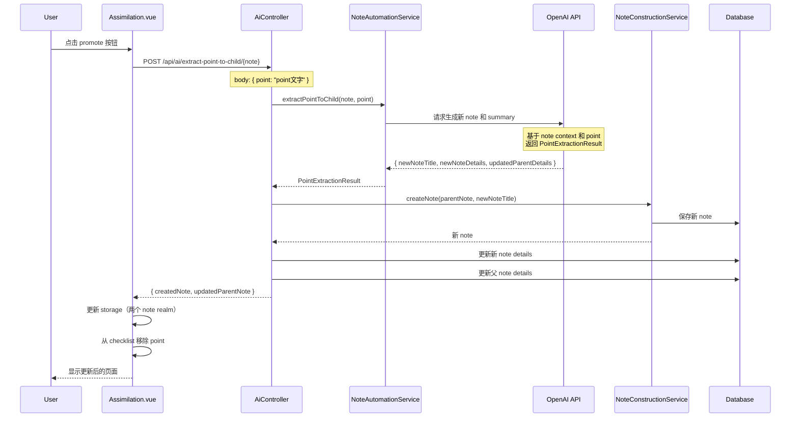

# AI Extract Point to Child Note

## 目标

升级现有的 "promote point to child note" 功能，从简单的创建空 note 改为 AI 驱动的智能提取：
- AI 基于 point 生成有意义的 title 和详细的 details
- AI 更新父 note 的 details，将提取的内容替换为简短 summary
- 保持 UI 不变（同一个按钮，功能升级）

## TDD 实施步骤（每步独立 commit，确保安全）

### 🔴 Phase 1: RED - 实现后端基础设施

**Step 1**: 创建 AI Tool Schema 类（不commit）

**文件**: `backend/src/main/java/com/odde/doughnut/services/ai/PointExtractionResult.java`

```java
package com.odde.doughnut.services.ai;

import com.fasterxml.jackson.annotation.JsonClassDescription;
import com.fasterxml.jackson.annotation.JsonProperty;
import com.fasterxml.jackson.annotation.JsonPropertyDescription;
import lombok.AllArgsConstructor;
import lombok.NoArgsConstructor;

@JsonClassDescription("""
    Extract a point from the parent note and generate content for a new child note.
    The point will be expanded into a complete note with title and details.
    The parent note's details will be updated with a brief summary replacing the extracted content.
    """)
@NoArgsConstructor
@AllArgsConstructor
public class PointExtractionResult {
  
  @JsonPropertyDescription("The title for the new child note")
  @JsonProperty(required = true)
  public String newNoteTitle;
  
  @JsonPropertyDescription("The details for the new child note in markdown format")
  @JsonProperty(required = true)
  public String newNoteDetails;
  
  @JsonPropertyDescription("The updated details for the parent note with the extracted content replaced by a brief summary")
  @JsonProperty(required = true)
  public String updatedParentDetails;
}
```

**Step 2**: 在 AiToolFactory 添加新工具方法（不commit）

**文件**: `backend/src/main/java/com/odde/doughnut/services/ai/tools/AiToolFactory.java`

在文件末尾添加：

```java
public static InstructionAndSchema extractPointToChildAiTool(String point) {
  String instruction = """
      You are helping extract a point from a note to create a new child note.
      
      Given point: "%s"
      
      Tasks:
      1. Generate a concise, meaningful title for the new child note based on this point
      2. Expand the point into detailed content (in markdown) for the new note
      3. Identify the related content in the parent note's details
      4. Replace that content with a brief summary (1-2 sentences) that references the key concept
      
      Guidelines:
      - The new note should be self-contained and comprehensive
      - The summary in parent note should maintain reading flow
      - Keep all unrelated parts of parent details unchanged
      """.formatted(point);
  
  return new InstructionAndSchema(instruction, PointExtractionResult.class);
}

public static Class<?> extractPointToChild() {
  return PointExtractionResult.class;
}
```

同时更新 `getAllAssistantTools()` 方法（如果需要）：

```java
public static List<Class<?>> getAllAssistantTools() {
  return List.of(
      completeNoteDetails(),
      suggestNoteTitle(),
      askSingleAnswerMultipleChoiceQuestion(),
      evaluateQuestion(),
      extractPointToChild());
}
```

**Step 3**: 添加 service 层方法（不commit）

**文件**: `backend/src/main/java/com/odde/doughnut/services/ai/ChatCompletionNoteAutomationService.java`

在文件末尾添加：

```java
public PointExtractionResult extractPointToChild(String point) throws JsonProcessingException {
  return executeWithTool(
      AiToolFactory.extractPointToChildAiTool(point),
      PointExtractionResult.class,
      result -> result,
      null);
}
```

**文件**: `backend/src/main/java/com/odde/doughnut/services/NoteAutomationService.java`

在文件末尾添加：

```java
public PointExtractionResult extractPointToChild(String point) throws JsonProcessingException {
  return chatCompletionNoteAutomationService.extractPointToChild(point);
}
```

**Step 4**: 创建 DTO 类（不commit）

**新文件**: `backend/src/main/java/com/odde/doughnut/controllers/dto/ExtractPointToChildRequestDTO.java`

```java
package com.odde.doughnut.controllers.dto;

import lombok.Getter;
import lombok.Setter;

@Setter
@Getter
public class ExtractPointToChildRequestDTO {
  private String point;
}
```

**新文件**: `backend/src/main/java/com/odde/doughnut/controllers/dto/ExtractPointToChildResponseDTO.java`

```java
package com.odde.doughnut.controllers.dto;

import lombok.Getter;

public class ExtractPointToChildResponseDTO {
  @Getter private final NoteRealm createdNote;
  @Getter private final NoteRealm updatedParentNote;
  
  public ExtractPointToChildResponseDTO(NoteRealm created, NoteRealm parent) {
    this.createdNote = created;
    this.updatedParentNote = parent;
  }
}
```

**Step 5**: 在 AiController 添加 endpoint → **Commit 1**

**文件**: `backend/src/main/java/com/odde/doughnut/controllers/AiController.java`

1. 添加 `NoteConstructionService` 依赖注入：

```java
private final NoteConstructionService noteConstructionService;

@Autowired
public AiController(
    NotebookAssistantForNoteServiceFactory notebookAssistantForNoteServiceFactory,
    OtherAiServices otherAiServices,
    AuthorizationService authorizationService,
    NoteConstructionService noteConstructionService) {
  this.notebookAssistantForNoteServiceFactory = notebookAssistantForNoteServiceFactory;
  this.otherAiServices = otherAiServices;
  this.authorizationService = authorizationService;
  this.noteConstructionService = noteConstructionService;
}
```

2. 在文件末尾添加新 endpoint：

```java
@PostMapping("/extract-point-to-child/{note}")
@Transactional
public ExtractPointToChildResponseDTO extractPointToChild(
    @PathVariable(value = "note") @Schema(type = "integer") Note note,
    @RequestBody ExtractPointToChildRequestDTO request)
    throws UnexpectedNoAccessRightException, JsonProcessingException {
  
  authorizationService.assertAuthorization(note);
  
  // 1. 调用 AI 生成结果
  PointExtractionResult result = 
      notebookAssistantForNoteServiceFactory
          .createNoteAutomationService(note)
          .extractPointToChild(request.getPoint());
  
  if (result == null) {
    throw new RuntimeException("AI failed to generate extraction result");
  }
  
  // 2. 创建新 note
  User user = authorizationService.getCurrentUser();
  Note newNote = noteConstructionService.createNote(note, result.newNoteTitle);
  newNote.setDetails(result.newNoteDetails);
  
  // 3. 更新原 note 的 details
  note.setDetails(result.updatedParentDetails);
  
  // 4. 返回结果
  return new ExtractPointToChildResponseDTO(
      newNote.toNoteRealm(user),
      note.toNoteRealm(user));
}
```

**验证**:
- 命令：`CURSOR_DEV=true nix develop -c ./backend/gradlew -p backend build -x test`
- 期望：编译成功 ✅

**Commit 1 内容**:
- `PointExtractionResult.java` (新)
- `ExtractPointToChildRequestDTO.java` (新)
- `ExtractPointToChildResponseDTO.java` (新)
- `AiToolFactory.java` (修改)
- `ChatCompletionNoteAutomationService.java` (修改)
- `NoteAutomationService.java` (修改)
- `AiController.java` (修改)

**Commit 消息**: `feat(backend): add AI extract point to child note endpoint`

**Step 6**: 验证后端编译和基本测试

**验证命令**:
```bash
# 编译
CURSOR_DEV=true nix develop -c ./backend/gradlew -p backend build -x test

# 运行后端测试（可选，确保没有破坏现有功能）
CURSOR_DEV=true nix develop -c pnpm backend:test_only
```

**期望**: 
- 编译通过 ✅
- 现有测试通过 ✅
- 功能未完成（前端未连接）

---

### 🟢 Phase 2: GREEN - 连接前端，让功能工作

**Step 7**: 生成前端 TypeScript API → **Commit 2**

**命令**:
```bash
CURSOR_DEV=true nix develop -c pnpm generateTypeScript
```

**期望**: 
- 生成的文件中包含 `AiController.extractPointToChild` 方法
- 检查文件：`frontend/src/generated/backend/sdk.gen.ts`

**验证**:
```bash
# 检查生成的 API
grep -A 10 "extractPointToChild" frontend/src/generated/backend/sdk.gen.ts
```

**Commit 2 内容**:
- `frontend/src/generated/backend/sdk.gen.ts` (自动生成)
- 相关的生成文件

**Commit 消息**: `chore(frontend): regenerate TypeScript API for AI extract endpoint`

**Step 8**: 修改 Assimilation.vue → **Commit 3**

**文件**: `frontend/src/components/recall/Assimilation.vue`

**查找现有的 `promotePointToChildNote` 方法** (约在 line 249)，完全替换实现：

**旧代码** (line 249-269):
```typescript
const promotePointToChildNote = async (point: string, index: number) => {
  try {
    const { data: nrwp, error } = await apiCallWithLoading(() =>
      NoteCreationController.createNoteUnderParent({
        path: { parentNote: note.id },
        body: { newTitle: point, wikidataId: "" },
      })
    )

    if (error || !nrwp) {
      await popups.alert("Failed to create child note")
      return
    }

    // Update storage manually (without navigation)
    if (storageAccessor.value) {
      storageAccessor.value.refreshNoteRealm(nrwp.created)
      storageAccessor.value.refreshNoteRealm(nrwp.parent)
    }

    // Remove the point from the list
    understandingPoints.value.splice(index, 1)
  } catch (err) {
    await popups.alert(`Error: ${err}`)
  }
}
```

**新代码**:
```typescript
const promotePointToChildNote = async (point: string, index: number) => {
  try {
    // 使用 AI endpoint 而非简单创建
    const { data: result, error } = await apiCallWithLoading(() =>
      AiController.extractPointToChild({
        path: { note: note.id },
        body: { point },
      })
    )

    if (error || !result) {
      await popups.alert("Failed to create child note with AI")
      return
    }

    // Update storage manually (包含父 note 的更新)
    if (storageAccessor.value) {
      storageAccessor.value.refreshNoteRealm(result.createdNote)
      storageAccessor.value.refreshNoteRealm(result.updatedParentNote)
    }

    // Remove the point from the list
    understandingPoints.value.splice(index, 1)
  } catch (err) {
    await popups.alert(`Error: ${err}`)
  }
}
```

**同时需要添加 import**（在文件顶部）:

查找现有的 imports，在 `NoteCreationController` 附近添加：
```typescript
import { AiController, NoteCreationController } from "@generated/backend/sdk.gen"
```

**验证**:
```bash
# 前端 lint
CURSOR_DEV=true nix develop -c pnpm lint:frontend

# 前端编译
CURSOR_DEV=true nix develop -c pnpm -C frontend build
```

**期望**: 
- Linting 通过 ✅
- 编译通过 ✅

**Commit 3 内容**:
- `frontend/src/components/recall/Assimilation.vue` (修改)

**Commit 消息**: `feat(frontend): upgrade promote button to use AI extraction`

**Step 9**: 手动测试功能

**启动服务**:
```bash
CURSOR_DEV=true nix develop -c pnpm sut
```

**测试步骤**:
1. 在浏览器打开 `http://localhost:5173`
2. 登录并创建一个 notebook
3. 创建一个有 details 的 note（例如："Machine learning is a subset of AI..."）
4. 进入 Assimilation 页面
5. 等待 AI 生成 Understanding Checklist
6. 点击某个 point 的 promote 按钮
7. **验证**:
   - ✅ 新 child note 被创建
   - ✅ 新 note 有 AI 生成的 title（不是原始 point 文字）
   - ✅ 新 note 有 AI 生成的 details
   - ✅ 父 note 的 details 被更新（包含 summary）
   - ✅ Point 从 checklist 移除
   - ✅ 保持在 Assimilation 页面

**如果测试失败**:
- 检查浏览器 console 是否有错误
- 检查 backend logs: `backend/logs/doughnut-development.log`
- 检查 OpenAI API 是否配置正确

---

### 🔵 Phase 3: REFACTOR - 添加 E2E 测试

**Step 10**: 创建 E2E feature 文件 → **Commit 4**

**新文件**: `e2e_test/features/assimilation/ai_extract_point_to_child.feature`

```gherkin
Feature: AI Extract Point to Child Note
  As a learner, when I see understanding points in the assimilation page,
  I want to use AI to promote a point into a comprehensive child note,
  So that the AI can generate meaningful content and update the parent note with a summary.

  Background:
    Given I am logged in as an existing user
    And I have a notebook with the head note "Machine Learning" and details "Machine learning is a subset of AI. It uses algorithms to learn from data. Key types include supervised learning, unsupervised learning, and reinforcement learning."

  @usingMockedOpenAiService
  Scenario: Promote point with AI generates child note and updates parent
    Given OpenAI generates understanding checklist with points:
      | Machine learning is a subset of AI |
      | It uses algorithms to learn from data |
      | Key types include supervised, unsupervised, and reinforcement learning |
    When I start assimilating "Machine Learning"
    Then I should see an understanding checklist with a maximum of 5 points
    When I promote the point "Key types include supervised, unsupervised, and reinforcement learning" to a child note
    Then a new child note should be created
    And I should remain on the assimilation page for "Machine Learning"
    And the point "Key types include supervised, unsupervised, and reinforcement learning" should be removed from the understanding checklist
```

**Commit 4 内容**:
- `e2e_test/features/assimilation/ai_extract_point_to_child.feature` (新)

**Commit 消息**: `test(e2e): add test for AI extract point to child feature`

**Step 11**: 添加/更新 step definitions（不commit）

**检查现有 steps**:

查看 `e2e_test/step_definitions/note.ts` line 588：
```typescript
When('I promote the point {string} to a child note', async (pointText: string) => {
  start.assumeAssimilationPage().promotePointToChildNote(pointText)
})
```

**结论**: 现有 step 已经足够，无需修改！因为我们只是升级了底层实现，step 定义保持不变。

**Step 12**: 配置 OpenAI mock 支持新 AI tool → **Commit 5**

**文件**: `e2e_test/start/mock_services/createOpenAiChatCompletionMock.ts`

需要添加对 `PointExtractionResult` 的 mock 支持。

**查找现有的 mock 模式**（参考 `UnderstandingChecklist` 的 mock）：

在文件中添加处理 `PointExtractionResult` 的逻辑（具体位置根据文件结构决定）：

```typescript
// 在适当位置添加
if (tool.function.name === 'extractPointToChild') {
  return {
    newNoteTitle: 'Learning Types in ML',
    newNoteDetails: 'Supervised learning uses labeled data. Unsupervised learning finds patterns. Reinforcement learning learns through rewards.',
    updatedParentDetails: 'Machine learning is a subset of AI. It uses algorithms to learn from data. [Summary: Key learning types]'
  }
}
```

**或者使用更灵活的配置方式** (如果系统支持):

在 `e2e_test/step_definitions/ai.ts` 中添加配置 step：

```typescript
Given('OpenAI will respond to extract point request with:', (dataTable: DataTable) => {
  const data = dataTable.rowsHash()
  // 配置 mock 返回
  cy.wrap({
    newNoteTitle: data.newNoteTitle,
    newNoteDetails: data.newNoteDetails,
    updatedParentDetails: data.updatedParentDetails
  }).as('pointExtractionMock')
})
```

**验证**:
```bash
CURSOR_DEV=true nix develop -c pnpm lint:all
```

**Commit 5 内容**:
- `e2e_test/start/mock_services/createOpenAiChatCompletionMock.ts` (修改)
- 或 `e2e_test/step_definitions/ai.ts` (修改，如果需要)

**Commit 消息**: `test(e2e): configure OpenAI mock for point extraction`

---

### ✅ Phase 4: FINAL - 全面验证

**Step 13**: 运行 E2E 测试

**命令**:
```bash
# 启动服务（如果尚未启动）
CURSOR_DEV=true nix develop -c pnpm sut &

# 等待服务就绪
sleep 10

# 运行新的 E2E 测试
CURSOR_DEV=true nix develop -c pnpm cypress run --spec e2e_test/features/assimilation/ai_extract_point_to_child.feature
```

**期望**: 
- 测试通过 ✅

**如果失败**:
- 检查 `backend/logs/doughnut-e2e.log`
- 检查 OpenAI mock 配置
- 使用 `pnpm cy:open` 打开 Cypress IDE 调试

**Step 14**: 运行所有测试确保没有破坏现有功能

**运行现有的相关测试**:
```bash
# 运行现有的 promote 测试
CURSOR_DEV=true nix develop -c pnpm cypress run --spec e2e_test/features/assimilation/promote_point_to_child.feature

# 运行所有 assimilation 相关测试
CURSOR_DEV=true nix develop -c pnpm cypress run --spec "e2e_test/features/assimilation/*.feature"
```

**运行前端测试**:
```bash
CURSOR_DEV=true nix develop -c pnpm frontend:test
```

**运行后端测试**:
```bash
CURSOR_DEV=true nix develop -c pnpm backend:verify
```

**Linting**:
```bash
CURSOR_DEV=true nix develop -c pnpm lint:all
```

**期望**: 
- 所有测试通过 ✅
- Linting 通过 ✅

---

## Commit 清单

最终应该有 **5 个 commits**:

1. ✅ `feat(backend): add AI extract point to child note endpoint`
2. ✅ `chore(frontend): regenerate TypeScript API for AI extract endpoint`
3. ✅ `feat(frontend): upgrade promote button to use AI extraction`
4. ✅ `test(e2e): add test for AI extract point to child feature`
5. ✅ `test(e2e): configure OpenAI mock for point extraction`

---

## 每次 Commit 前检查清单

- [ ] 代码编译通过
- [ ] 相关测试运行通过
- [ ] Linting 通过（如修改代码）
- [ ] Commit 消息清晰描述改动
- [ ] 改动是向后兼容的

---

## 回滚策略

每个 commit 都是独立的，可以安全回滚：

- Commit 1: 移除后端 endpoint 和相关类
- Commit 2: 重新生成 TypeScript API（回到 Commit 1 后的状态）
- Commit 3: 恢复 `Assimilation.vue` 的旧实现
- Commit 4-5: 删除测试文件和 mock 配置

---

## 架构流程



---

## AI Context 机制说明

### OpenAI 如何获得 note details？

`ChatCompletionNoteAutomationService` 在构造时接收 `note` 对象，并通过 `OpenAIChatRequestBuilder.chatAboutNoteRequestBuilder(modelName, note)` 将完整的 note 信息（包括 title, details, 层级关系等）作为 context 发送给 OpenAI。

因此，`extractPointToChildAiTool` 的 instruction 可以直接引用 "parent note's details"，因为 AI 已经能看到完整的 note 信息。

**关键代码** (`ChatCompletionNoteAutomationService.java`):
```java
private OpenAIChatRequestBuilder createChatRequestBuilder() {
  String modelName = globalSettingsService.globalSettingEvaluation().getValue();
  // ← 这里会把整个 note（包括 details）传给 OpenAI
  OpenAIChatRequestBuilder chatRequestBuilder =
      OpenAIChatRequestBuilder.chatAboutNoteRequestBuilder(modelName, note);
  
  String instructions = note.getNotebookAssistantInstructions();
  if (instructions != null && !instructions.trim().isEmpty()) {
    chatRequestBuilder.addToOverallSystemMessage(instructions);
  }
  
  return chatRequestBuilder;
}
```

---

## 升级对比

| 方面 | 旧版 Promote | 新版 Promote (AI 驱动) |
|------|-------------|---------------------|
| 触发按钮 | 现有 promote 按钮 | **相同按钮**，功能升级 |
| 新 note title | point 原文 | **AI 生成**有意义的 title |
| 新 note details | 空 | **AI 生成**详细内容 |
| 父 note details | 不变 | **AI 更新**为 summary |
| API 调用 | `NoteCreationController.createNoteUnderParent` | **`AiController.extractPointToChild`** |
| 响应时间 | 即时（<100ms） | 3-5 秒 (AI 处理) |
| 用户体验 | 需要手动填写 details | **自动生成完整内容** |
| OpenAI 调用 | 无 | 1 次（生成 title + details + summary） |

---

## 文件清单

### 需要创建的文件（7 个）

1. `backend/src/main/java/com/odde/doughnut/services/ai/PointExtractionResult.java`
2. `backend/src/main/java/com/odde/doughnut/controllers/dto/ExtractPointToChildRequestDTO.java`
3. `backend/src/main/java/com/odde/doughnut/controllers/dto/ExtractPointToChildResponseDTO.java`
4. `e2e_test/features/assimilation/ai_extract_point_to_child.feature`

### 需要修改的文件（7 个）

1. `backend/src/main/java/com/odde/doughnut/services/ai/tools/AiToolFactory.java`
2. `backend/src/main/java/com/odde/doughnut/services/ai/ChatCompletionNoteAutomationService.java`
3. `backend/src/main/java/com/odde/doughnut/services/NoteAutomationService.java`
4. `backend/src/main/java/com/odde/doughnut/controllers/AiController.java`
5. `frontend/src/components/recall/Assimilation.vue`
6. `frontend/src/generated/backend/sdk.gen.ts` (自动生成)
7. `e2e_test/start/mock_services/createOpenAiChatCompletionMock.ts` (或 `e2e_test/step_definitions/ai.ts`)

---

## 潜在风险和缓解方案

### 🔴 风险

1. **AI 响应质量不稳定**
   - 缓解：详细的 prompt engineering，在 instruction 中提供明确指导
   
2. **响应时间较长（3-5秒）**
   - 缓解：使用 `apiCallWithLoading` 显示加载状态，用户有心理预期
   
3. **OpenAI API 调用成本**
   - 缓解：添加用户提示，让他们意识到这是 AI 功能
   
4. **Note details 更新冲突**
   - 缓解：使用事务（`@Transactional`），确保原子性

### 🟢 优势

- ✅ 用户体验大幅提升（自动生成完整内容）
- ✅ 保持知识结构完整性（父 note 有 summary）
- ✅ UI 无感升级（用户无需学习新功能）
- ✅ 代码复用度高（复用现有 AI 基础设施）

---

## 注意事项

1. **AI Prompt Engineering**: `extractPointToChildAiTool` 的 instruction 需要精心设计，确保生成质量
2. **Error Handling**: 如果 AI 返回 null 或错误，需要友好的错误提示
3. **Loading State**: 使用 `apiCallWithLoading` 确保用户知道正在处理
4. **Storage Update**: 必须同时更新父 note 和子 note 的 realm
5. **E2E Mock**: OpenAI mock 配置需要返回合理的测试数据

---

## 测试覆盖

### Unit Tests（可选，已有集成测试）

- ✅ `AiToolFactory.extractPointToChildAiTool()` 返回正确的 instruction
- ✅ `ChatCompletionNoteAutomationService.extractPointToChild()` 调用正确的 AI tool
- ✅ `AiController.extractPointToChild()` 正确创建 note 和更新 details

### Integration Tests（后端）

- ✅ 完整的 API 调用流程（通过 E2E 测试覆盖）

### E2E Tests

- ✅ Scenario 1: 成功的 AI extract（新测试）
- ✅ Scenario 2: 现有的 promote 测试应该仍然通过（功能升级）
- ✅ Scenario 3: Assimilation 相关测试不受影响

---

## 完成标准

✅ 所有 commits 已创建
✅ 后端编译通过
✅ 前端编译通过
✅ 所有测试通过（前端 + 后端 + E2E）
✅ Linting 通过
✅ 手动测试验证功能正常
✅ 没有破坏现有功能
