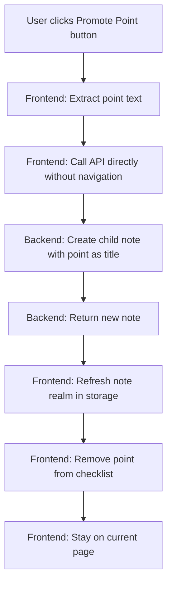

# Promote Point to Child Note Feature

## Scenarios / Use Cases

### Primary Scenario: Promote a Point to Child Note

1. 使用者在 Assimilation 頁面查看 note 的 Understanding Checklist
2. 使用者點擊某個 Point 旁的「提出成 child note」按鈕（或類似操作）
3. 系統立即建立一個新的 child note，title 為該 Point 的文字，details 為空
4. 該 Point 從 Understanding Checklist 中移除
5. **使用者保持在當前 Assimilation 頁面，不進行導航**

### Edge Cases

- 如果建立 note 失敗（例如權限問題），顯示錯誤訊息，Point 保留在 checklist 中
- 如果 Understanding Checklist 為空，不顯示任何操作按鈕
- 如果 note 沒有 details，不會產生 Understanding Checklist，因此也不會有此功能

## System Planning

### Architecture Overview



### Frontend Changes

#### 1. Modify `Assimilation.vue` Component

**File**: `frontend/src/components/recall/Assimilation.vue`

- 在每個 understanding point 的 `<li>` 元素旁添加「提出成 child note」按鈕或圖示
- 添加 `promotePointToChildNote(point: string, index: number)` 方法：
  - **直接呼叫 `NoteCreationController.createNoteUnderParent` API**（不使用 `createNote` 方法，因為它會導航）
  - 使用 point 文字作為 `newTitle`
  - 建立成功後，手動更新 storage：`storage.refreshNoteRealm(nrwp.created)` 和 `storage.refreshNoteRealm(nrwp.parent)`
  - 從 `understandingPoints` 陣列中移除該 point
  - **不進行任何導航操作**
  - 處理錯誤情況

**UI 設計考量**：

- 按鈕可以是一個小圖示（如 `SvgAdd` 或類似）或文字按鈕
- 按鈕應該清楚標示其功能
- 可以考慮 hover 效果顯示 tooltip

#### 2. Direct API Call (Avoid Navigation)

**File**: `frontend/src/components/recall/Assimilation.vue`

- **不**使用 `StoredApiCollection.createNote()` 方法，因為它會自動導航到新建立的 note
- 直接使用 `NoteCreationController.createNoteUnderParent` API（從 `@generated/backend/sdk.gen`）
- 手動處理 storage 更新，但不進行路由導航

### Backend Changes

**不需要修改後端**：

- 現有的 `NoteCreationController.createNoteUnderParent` API 已經足夠
- `NoteConstructionService.createNoteWithWikidataService` 可以處理建立邏輯
- 只需要傳入 `newTitle`（point 文字）和空的 `wikidataId`

### Data Flow

1. **User Action**: 使用者點擊 Point 旁的按鈕
2. **Frontend**: 

   - 提取 point 文字
   - 準備 `NoteCreationDto`：`{ newTitle: point, wikidataId: "" }`
   - **直接呼叫 `NoteCreationController.createNoteUnderParent` API**（使用 `apiCallWithLoading`）
   - **不傳入 router**，避免任何導航

3. **Backend**: 

   - `NoteCreationController.createNoteUnderParent` 接收請求
   - `NoteConstructionService.createNoteWithWikidataService` 建立新 note
   - 返回 `NoteCreationResult`（包含 `created` 和 `parent` note realms）

4. **Frontend**:

   - 手動更新 storage：`storage.refreshNoteRealm(nrwp.created)` 和 `storage.refreshNoteRealm(nrwp.parent)`
   - 從 `understandingPoints` 陣列中移除已使用的 point
   - **保持在當前 Assimilation 頁面，不進行任何導航**

### Implementation Details

#### Point Removal Logic

- 使用 `understandingPoints.value.splice(index, 1)` 或 `understandingPoints.value.filter((_, i) => i !== index)`
- 確保 UI 立即更新（Vue 的響應式系統會自動處理）

#### Error Handling

- 如果 API 呼叫失敗，顯示錯誤訊息（使用現有的 `usePopups`）
- Point 保留在 checklist 中
- **不進行任何導航**（無論成功或失敗都保持在當前頁面）

#### Navigation Avoidance

- **關鍵**：不使用 `StoredApiCollection.createNote()` 方法，因為它會呼叫 `routerReplaceFocus` 進行導航
- 直接使用 `NoteCreationController.createNoteUnderParent` API
- 手動更新 storage 以確保資料同步，但不觸發路由變更
- 使用 `storageAccessor.value.storage` 來存取 storage 實例

#### UI/UX Considerations

- 按鈕位置：可以放在每個 `<li>` 元素的右側，或作為 inline 元素
- 視覺設計：使用現有的 DaisyUI 樣式保持一致
- 載入狀態：在建立過程中可以顯示 loading indicator（`apiCallWithLoading` 已處理）

### Testing Considerations

#### E2E Tests

- 新增 scenario 到 `e2e_test/features/assimilation/` 
- 測試：點擊 Point 的按鈕 → 驗證新 note 被建立 → 驗證 Point 從 checklist 移除

**E2E Test Scenario (正向流程)**:

```gherkin
Feature: Promote Point to Child Note
  As a learner, when I see understanding points in the assimilation page,
  I want to promote a point to become a child note,
  So that I can expand on that point as a separate note.

  Background:
    Given I am logged in as an existing user
    And I have a notebook with the head note "Machine Learning" and details "Machine learning is a subset of artificial intelligence that enables systems to learn and improve from experience without being explicitly programmed. It uses algorithms to analyze data, identify patterns, and make decisions. Key types include supervised learning, unsupervised learning, and reinforcement learning. Applications range from recommendation systems to autonomous vehicles."

  @usingMockedOpenAiService
  Scenario: Promote a point from understanding checklist to child note
    Given OpenAI generates understanding checklist with points:
      | Machine learning is a subset of artificial intelligence |
      | It enables systems to learn from experience without explicit programming |
      | Key types include supervised, unsupervised, and reinforcement learning |
      | Applications range from recommendation systems to autonomous vehicles |
    When I start assimilating "Machine Learning"
    Then I should see an understanding checklist with a maximum of 5 points
    When I promote the point "Key types include supervised, unsupervised, and reinforcement learning" to a child note
    Then a new child note with title "Key types include supervised, unsupervised, and reinforcement learning" should be created under "Machine Learning"
    And I should remain on the assimilation page for "Machine Learning"
    And the point "Key types include supervised, unsupervised, and reinforcement learning" should be removed from the understanding checklist
    And the understanding checklist should still show the remaining points
```

#### Unit Tests

- 測試 `Assimilation.vue` 的 `promotePointToChildNote` 方法
- 測試錯誤處理邏輯

### Files to Modify

1. **`frontend/src/components/recall/Assimilation.vue`**

   - 添加按鈕到 understanding points 列表
   - 實現 `promotePointToChildNote` 方法
   - 處理 point 移除邏輯

### Files to Create (if needed)

- 可能需要一個新的圖示組件或重用現有的 `SvgAdd` 組件

### Dependencies

- **直接使用** `NoteCreationController.createNoteUnderParent` API（從 `@generated/backend/sdk.gen`）
- 使用現有的 `usePopups` composable 處理錯誤
- 使用現有的 `apiCallWithLoading` 處理 API 呼叫
- 使用 `storageAccessor.value.storage` 來手動更新 note realms
- **不使用** `StoredApiCollection.createNote` 方法（因為它會導航）

