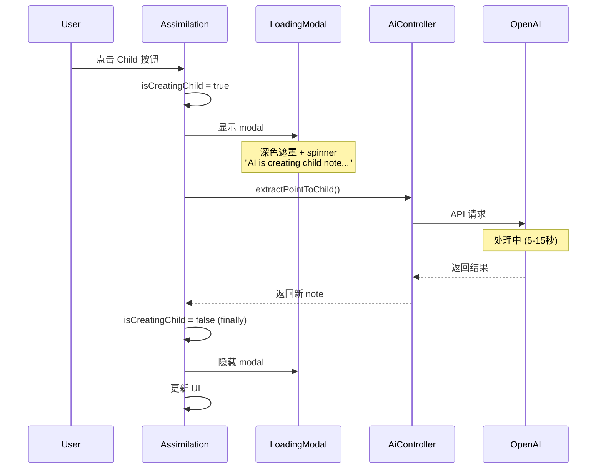

# 改善 Create New Child 的 Loading 体验

## 目标

改善 Assimilation 页面 "Create New Child" 按钮的用户体验：

- 点击后立即显示全屏 loading modal（深色遮罩 + spinner + 状态文字）
- 阻止用户进行其他操作，避免重复点击
- AI 处理完成后自动关闭 modal
- 提供清晰的视觉反馈，改善长时间等待的体感

## TDD 实施步骤（每步独立 commit，确保安全）

### 🔴 Phase 1: RED - 编写测试

**Step 1**: 编写 LoadingModal.vue 的单元测试（不commit）

**文件**: `frontend/tests/components/commons/LoadingModal.spec.ts`

```typescript
import { describe, it, expect } from 'vitest'
import { render } from '@testing-library/vue'
import LoadingModal from '@/components/commons/LoadingModal.vue'

describe('LoadingModal', () => {
  it('should not render when show is false', () => {
    const { container } = render(LoadingModal, {
      props: { show: false, message: 'Loading...' }
    })
    expect(container.querySelector('.loading-modal-mask')).toBeNull()
  })

  it('should render with spinner and message when show is true', () => {
    const { container, getByText } = render(LoadingModal, {
      props: { show: true, message: 'AI is creating child note...' }
    })
    
    expect(container.querySelector('.loading-modal-mask')).toBeTruthy()
    expect(container.querySelector('.daisy-loading-spinner')).toBeTruthy()
    expect(getByText('AI is creating child note...')).toBeTruthy()
  })

  it('should render with default message when message prop is not provided', () => {
    const { getByText } = render(LoadingModal, {
      props: { show: true }
    })
    
    expect(getByText('Processing...')).toBeTruthy()
  })

  it('should not have close button', () => {
    const { container } = render(LoadingModal, {
      props: { show: true, message: 'Loading...' }
    })
    
    expect(container.querySelector('.close-button')).toBeNull()
  })
})
```

**验证**:

```bash
# 运行测试（应该失败，因为组件还不存在）
CURSOR_DEV=true nix develop -c pnpm -C frontend test tests/components/commons/LoadingModal.spec.ts
```

**期望**: 测试失败 ❌（组件不存在）

---

### 🟢 Phase 2: GREEN - 实现 LoadingModal 组件

**Step 2**: 实现 LoadingModal.vue 组件让测试通过 → **Commit 1**

**新文件**: `frontend/src/components/commons/LoadingModal.vue`

```vue
<template>
  <Teleport v-if="show" to="body">
    <div class="loading-modal-mask">
      <div class="loading-modal-content">
        <div class="daisy-loading daisy-loading-spinner daisy-loading-lg"></div>
        <p class="loading-message">{{ message }}</p>
      </div>
    </div>
  </Teleport>
</template>

<script setup lang="ts">
interface Props {
  show: boolean
  message?: string
}

withDefaults(defineProps<Props>(), {
  message: 'Processing...'
})
</script>

<style scoped>
.loading-modal-mask {
  position: fixed;
  z-index: 10000;
  top: 0;
  left: 0;
  width: 100%;
  height: 100%;
  background-color: rgba(0, 0, 0, 0.7);
  display: flex;
  align-items: center;
  justify-content: center;
}

.loading-modal-content {
  display: flex;
  flex-direction: column;
  align-items: center;
  gap: 1rem;
}

.daisy-loading-spinner {
  color: white;
}

.loading-message {
  color: white;
  font-size: 1.125rem;
  font-weight: 500;
  margin: 0;
}
</style>
```

**验证**:

```bash
# 运行 LoadingModal 测试（应该通过）
CURSOR_DEV=true nix develop -c pnpm -C frontend test tests/components/commons/LoadingModal.spec.ts

# Lint 检查
CURSOR_DEV=true nix develop -c pnpm lint:frontend
```

**期望**: 

- 测试通过 ✅
- Linting 通过 ✅

**Commit 1 内容**:

- `frontend/src/components/commons/LoadingModal.vue` (新)
- `frontend/tests/components/commons/LoadingModal.spec.ts` (新)

**Commit 消息**: `feat(frontend): add LoadingModal component for long-running operations`

---

### 🔴 Phase 3: RED - 编写 Assimilation 集成测试

**Step 3**: 编写 Assimilation.vue 的 loading 状态测试（不commit）

**文件**: `frontend/tests/components/recall/Assimilation.spec.ts`

在现有测试文件中添加新的测试用例：

```typescript
// 在 describe('Assimilation', () => { ... }) 块中添加

it('should show LoadingModal while creating child note from point', async () => {
  // Setup: mock AI API to delay response
  let resolvePromise: (value: any) => void
  const delayedPromise = new Promise((resolve) => {
    resolvePromise = resolve
  })
  
  mockSdkService({
    AiController: {
      extractPointToChild: vi.fn(() => delayedPromise)
    }
  })

  // Render with understanding points
  const { getByText, getByTitle, queryByText } = render(Assimilation, {
    props: { note: mockNote }
  })

  // Set up understanding points
  await waitFor(() => {
    expect(getByText('Test understanding point')).toBeInTheDocument()
  })

  // Click "Child" button
  const childButton = getByTitle('Promote to child note')
  await userEvent.click(childButton)

  // Verify LoadingModal is shown
  await waitFor(() => {
    expect(getByText('AI is creating child note...')).toBeInTheDocument()
  })

  // Resolve the API call
  resolvePromise!({
    data: {
      createdNote: mockCreatedNote,
      updatedParentNote: mockUpdatedNote
    },
    error: null
  })

  // Verify LoadingModal is hidden after completion
  await waitFor(() => {
    expect(queryByText('AI is creating child note...')).not.toBeInTheDocument()
  })
})

it('should hide LoadingModal when API call fails', async () => {
  // Mock API to fail
  mockSdkService({
    AiController: {
      extractPointToChild: vi.fn(() => 
        Promise.resolve({ data: null, error: 'API Error' })
      )
    }
  })

  const { getByTitle, queryByText } = render(Assimilation, {
    props: { note: mockNote }
  })

  // Click "Child" button
  const childButton = getByTitle('Promote to child note')
  await userEvent.click(childButton)

  // Verify LoadingModal is eventually hidden
  await waitFor(() => {
    expect(queryByText('AI is creating child note...')).not.toBeInTheDocument()
  })
})
```

**验证**:

```bash
# 运行测试（应该失败，因为 Assimilation.vue 还没有集成 LoadingModal）
CURSOR_DEV=true nix develop -c pnpm -C frontend test tests/components/recall/Assimilation.spec.ts
```

**期望**: 测试失败 ❌（LoadingModal 未集成）

---

### 🟢 Phase 4: GREEN - 集成 LoadingModal 到 Assimilation

**Step 4**: 在 Assimilation.vue 中集成 LoadingModal → **Commit 2**

**文件**: `frontend/src/components/recall/Assimilation.vue`

**修改 1**: 在 `<script setup>` 中添加 import 和状态

```typescript
import LoadingModal from "../commons/LoadingModal.vue"

// ... 其他代码 ...

// 在现有 state 声明后添加
const isCreatingChild = ref(false)
```

**修改 2**: 更新 `promotePointToChildNote` 函数（约在 line 282）

**旧代码**:

```typescript
const promotePointToChildNote = async (point: string, index: number) => {
  try {
    // Call AI endpoint to extract point to child note
    const { data: result, error } = await apiCallWithLoading(() =>
      AiController.extractPointToChild({
        path: { note: note.id },
        body: { point },
      })
    )

    if (error || !result || !result.createdNote || !result.updatedParentNote) {
      await popups.alert("Failed to create child note with AI")
      return
    }

    // Extract non-null values for type safety
    const createdNote = result.createdNote
    const updatedParentNote = result.updatedParentNote

    // Update storage (including parent note which was updated by AI)
    if (storageAccessor.value) {
      storageAccessor.value.refreshNoteRealm(createdNote)
      storageAccessor.value.refreshNoteRealm(updatedParentNote)
    }

    // Remove the point from the list
    understandingPoints.value.splice(index, 1)
  } catch (err) {
    console.error("Failed to promote point to child note:", err)
    await popups.alert(`Error: ${err}`)
  }
}
```

**新代码**:

```typescript
const promotePointToChildNote = async (point: string, index: number) => {
  isCreatingChild.value = true
  
  try {
    // Call AI endpoint to extract point to child note
    const { data: result, error } = await apiCallWithLoading(() =>
      AiController.extractPointToChild({
        path: { note: note.id },
        body: { point },
      })
    )

    if (error || !result || !result.createdNote || !result.updatedParentNote) {
      await popups.alert("Failed to create child note with AI")
      return
    }

    // Extract non-null values for type safety
    const createdNote = result.createdNote
    const updatedParentNote = result.updatedParentNote

    // Update storage (including parent note which was updated by AI)
    if (storageAccessor.value) {
      storageAccessor.value.refreshNoteRealm(createdNote)
      storageAccessor.value.refreshNoteRealm(updatedParentNote)
    }

    // Remove the point from the list
    understandingPoints.value.splice(index, 1)
  } catch (err) {
    console.error("Failed to promote point to child note:", err)
    await popups.alert(`Error: ${err}`)
  } finally {
    isCreatingChild.value = false
  }
}
```

**修改 3**: 在 `<template>` 末尾添加 LoadingModal（在 `</template>` 之前）

```vue
<LoadingModal
  :show="isCreatingChild"
  message="AI is creating child note..."
/>
```

**验证**:

```bash
# 运行 Assimilation 测试（应该通过）
CURSOR_DEV=true nix develop -c pnpm -C frontend test tests/components/recall/Assimilation.spec.ts

# Lint 检查
CURSOR_DEV=true nix develop -c pnpm lint:frontend
```

**期望**: 

- 测试通过 ✅
- Linting 通过 ✅

**Commit 2 内容**:

- `frontend/src/components/recall/Assimilation.vue` (修改)
- `frontend/tests/components/recall/Assimilation.spec.ts` (修改)

**Commit 消息**: `feat(frontend): show LoadingModal when creating child note from point`

**Step 5**: 验证所有前端测试通过

**命令**:

```bash
# 运行所有前端测试
CURSOR_DEV=true nix develop -c pnpm frontend:test
```

**期望**: 所有测试通过 ✅

---

### ✅ Phase 5: FINAL - 全面验证

**Step 6**: 手动测试功能

**启动服务**:

```bash
CURSOR_DEV=true nix develop -c pnpm sut
```

**测试步骤**:

1. 在浏览器打开 `http://localhost:5173`
2. 登录并创建一个 notebook
3. 创建一个有 details 的 note（例如："Machine learning uses algorithms..."）
4. 进入 Assimilation 页面
5. 等待 AI 生成 Understanding Checklist
6. 点击某个 point 的 "Child" 按钮
7. **验证**:
  - ✅ 立即显示深色全屏遮罩
  - ✅ 居中显示大号白色 spinner
  - ✅ 显示 "AI is creating child note..." 文字
  - ✅ 无法点击其他元素（遮罩阻止）
  - ✅ 等待 3-10 秒后 modal 自动消失
  - ✅ 新 child note 创建成功
  - ✅ Point 从 checklist 移除

**测试错误场景**:

1. 如果 API 失败（例如 OpenAI 配置错误）
2. 验证 modal 仍然正确关闭
3. 验证显示错误提示

**Step 7**: 运行 E2E 测试确保没有破坏现有功能

**命令**:

```bash
# 运行所有 assimilation 相关的 E2E 测试
CURSOR_DEV=true nix develop -c pnpm cypress run --spec "e2e_test/features/assimilation/*.feature"
```

**期望**: 所有测试通过 ✅（LoadingModal 是纯 UI 改进，不影响功能逻辑）

---

## Commit 清单

最终应该有 **2 个 commits**:

1. ✅ `feat(frontend): add LoadingModal component for long-running operations`
2. ✅ `feat(frontend): show LoadingModal when creating child note from point`

---

## 每次 Commit 前检查清单

- 前端编译通过
- 相关测试运行通过
- Linting 通过
- Commit 消息清晰描述改动
- 改动不影响现有功能

---

## 问题分析

## 架构流程




## 文件清单

### 需要创建的文件（2 个）

1. `frontend/src/components/commons/LoadingModal.vue`
2. `frontend/tests/components/commons/LoadingModal.spec.ts`

### 需要修改的文件（2 个）

1. `frontend/src/components/recall/Assimilation.vue`
2. `frontend/tests/components/recall/Assimilation.spec.ts`

---

## 技术细节和设计决策

### LoadingModal 组件设计

**Props**:

- `show: boolean` - 控制显示/隐藏
- `message?: string` - 显示的状态文字（默认："Processing..."）

**样式要求**:

- 遮罩：`z-index: 10000`（确保在所有内容之上）
- 背景：`rgba(0, 0, 0, 0.7)`（深色半透明，强调阻塞操作）
- Spinner：大号白色（`daisy-loading-lg`）
- 文字：白色，`1.125rem`，居中
- 布局：flexbox 垂直居中

**为什么不使用现有 Modal 组件**:

- 现有 `Modal.vue` 是通用 modal，有 header/body slots 和关闭功能
- LoadingModal 需求更简单：只需 spinner + 文字，不可关闭
- 创建专门组件更清晰，代码更简洁

### Assimilation 集成方式

**状态管理**:

- 添加 `isCreatingChild` ref（boolean）
- 在 `promotePointToChildNote` 开始时设为 `true`
- 在 `finally` 块中设为 `false`（确保成功/失败都会关闭）

**为什么不只依赖 apiCallWithLoading**:

- `apiCallWithLoading` 仅显示顶部细线 loading bar（1px 高）
- 对于长时间操作（5-15 秒），需要更明显的视觉反馈
- Modal 遮罩可以阻止用户重复点击或进行其他操作

### 可扩展性

- 未来其他 AI 功能（如 generate checklist）也可复用此组件
- 只需传入不同的 message prop 即可
- 组件设计通用，不绑定特定业务逻辑

---

## 完成标准

✅ LoadingModal 组件测试通过
✅ Assimilation 集成测试通过
✅ 所有前端测试通过
✅ Linting 通过
✅ 手动测试验证 UX 改善
✅ E2E 测试没有破坏
✅ 创建 2 个清晰的 commits