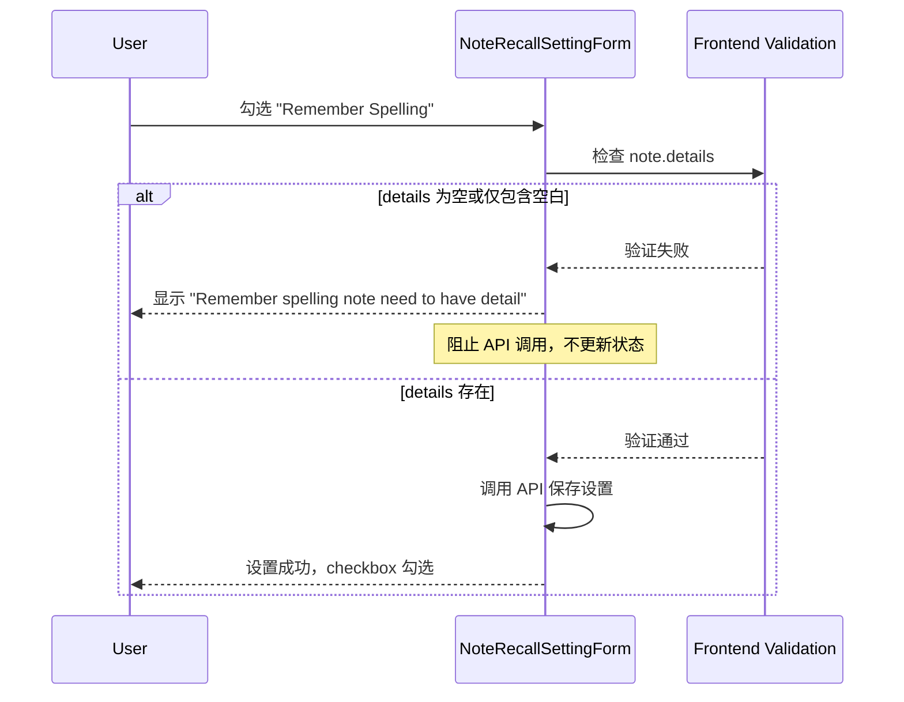

# Spelling Question Validation E2E Test Plan

## 目标

为 spelling question 验证创建 E2E 测试，确保当笔记没有 details 时勾选 "Remember Spelling" 选项会显示错误消息（使用前端验证，不需要改动后端）。

## TDD 实施步骤（每步独立 commit，确保安全）

### 🔴 Phase 1: RED - 先写失败的测试

**Step 1-2**: 创建 E2E 测试和 Step Definitions（不commit）

- 创建 feature 文件，定义最简单场景
- 实现必要的 step definitions
- 目的：定义期望行为，让测试可运行

**Step 3**: 运行测试确认失败 → **Commit 1**

- 命令：`CURSOR_DEV=true nix develop -c pnpm cypress run --spec e2e_test/features/assimilation/spelling_question_validation.feature`
- 期望：测试失败（验证未实现）
- Commit内容：feature文件 + step definitions
- Commit消息：`test: add E2E test for spelling question validation without details`
- 安全性：只添加测试，不影响production

---

### 🟢 Phase 2: GREEN - 让测试通过

**Step 4**: 添加 noteDetails prop → **Commit 2**

- 文件：`frontend/src/components/recall/NoteRecallSettingForm.vue`
- 改动：添加 `noteDetails: { type: String, required: false }`
- 验证：`CURSOR_DEV=true nix develop -c pnpm frontend:test`
- 期望：现有测试通过，新测试仍失败
- Commit消息：`refactor: add noteDetails prop to NoteRecallSettingForm`
- 安全性：optional prop，向后兼容

**Step 5**: 传入 noteDetails 数据 → **Commit 3**

- 文件：`frontend/src/components/notes/NoteInfoComponent.vue`
- 改动：传入 `noteDetails: noteInfo.note.details`
- 验证：`CURSOR_DEV=true nix develop -c pnpm frontend:test`
- 期望：现有测试通过
- Commit消息：`feat: pass noteDetails prop to NoteRecallSettingForm`
- 安全性：仅传递数据，无逻辑变更

**Step 6**: 实现验证逻辑 → **Commit 4**

- 文件：`NoteRecallSettingForm.vue` 的 `updateModelValue` 方法
- 改动：添加 details 检查和错误处理
- 验证：
  - `CURSOR_DEV=true nix develop -c pnpm frontend:test`
  - `CURSOR_DEV=true nix develop -c pnpm cypress run --spec e2e_test/features/assimilation/spelling_question_validation.feature`
  - `CURSOR_DEV=true nix develop -c pnpm cypress run --spec e2e_test/features/recall/recall_quiz_spelling_question.feature`
- 期望：所有测试通过 ✅
- Commit消息：`feat: validate note details before enabling spelling question`
- 安全性：前端验证，不影响API

**Step 7**: 确认测试通过

- 验证新功能和现有功能都正常

---

### 🔵 Phase 3: REFACTOR - 完善测试覆盖

**Step 8**: 添加更多场景 → **Commit 5**

- 改动：feature文件添加正向和边界测试
- 验证：运行新场景
- Commit消息：`test: add positive and edge case scenarios for spelling validation`
- 安全性：仅添加测试

---

### ✅ Phase 4: FINAL - 全面验证

**Step 9**: 运行完整测试套件

- 运行所有E2E测试（或核心测试）
- 运行前端测试
- 确保：linting通过 `CURSOR_DEV=true nix develop -c pnpm lint:all`
- 期望：全部通过 ✅

---

## 每次 Commit 前检查清单

- [ ] 运行相关测试（前端或E2E）
- [ ] 确认现有测试通过
- [ ] 确认linting通过（如修改代码）
- [ ] Commit消息清晰描述改动
- [ ] 改动是向后兼容的

## 回滚策略

每个commit都是独立的，可以安全回滚：

- Commit 1：删除测试文件
- Commit 2-3：移除prop相关代码
- Commit 4：移除验证逻辑
- Commit 5：移除额外测试场景

## 架构流程



## 测试文件结构

### 1. 创建新的 Feature 文件

**路径**: `e2e_test/features/assimilation/spelling_question_validation.feature`

根据现有测试模式，测试应包含以下场景：

**Scenario 1**: 在没有 details 的笔记上勾选 spelling question（应该失败）

- 创建一个只有 title 没有 details 的笔记
- 尝试勾选 "Remember Spelling"
- 验证显示错误消息："Remember spelling note need to have detail"

**Scenario 2**: 在有 details 的笔记上勾选 spelling question（应该成功）

- 创建一个有 title 和 details 的笔记
- 勾选 "Remember Spelling"
- 验证成功勾选（无错误消息）

**Scenario 3**: 先勾选 spelling question，然后删除 details（应该失败）

- 创建一个有 details 的笔记并勾选 "Remember Spelling"
- 清空 details
- 验证显示错误消息

### 2. 实现 Step Definitions

**可能需要的新 steps** (在 `e2e_test/step_definitions/` 中)：

基于现有的 step definitions 模式（参考 `e2e_test/step_definitions/note.ts` 和 `e2e_test/step_definitions/wikidata.ts`），需要：

- `When I check the "Remember Spelling" option for note {string}`
- `Then I should see an error {string} on Remember Spelling field`
- `When I uncheck the "Remember Spelling" option for note {string}`

**现有可复用的 steps**:

- `Given I have a notebook with the head note {string}` (已存在)
- `And there are some notes:` (已存在)
- `cy.expectFieldErrorMessage()` (已存在于 `e2e_test/support/commands.ts`)

### 3. Page Object 更新

可能需要在 `e2e_test/start/pageObjects/` 中添加操作：

**文件**: `e2e_test/start/pageObjects/noteInfoBar.ts` 或类似文件

- 添加方法：`toggleRememberSpelling()`
- 添加方法：`expectRememberSpellingError(message: string)`

参考现有的 `associateWikidataDialog.ts` 中的 `expectErrorOnWikidataId()` 实现模式。

## 前端验证实现

### 1. 更新 NoteRecallSettingForm.vue

在 [`frontend/src/components/recall/NoteRecallSettingForm.vue`](frontend/src/components/recall/NoteRecallSettingForm.vue) 中添加验证逻辑：

**需要的改动**:

1. 添加新的 prop: `noteDetails` (类型: `string | undefined`)
2. 在 `updateModelValue` 方法中添加验证：
   ```typescript
   const updateModelValue = async (newValue: Partial<NoteRecallSetting>) => {
     // 新增验证逻辑
     if (newValue.rememberSpelling === true) {
       if (!props.noteDetails || props.noteDetails.trim() === '') {
         errors.value.rememberSpelling = 'Remember spelling note need to have detail'
         // 恢复 checkbox 状态（取消勾选）
         formData.value.rememberSpelling = false
         return  // 阻止 API 调用
       }
     }
     
     // 清除之前的错误消息
     errors.value.rememberSpelling = undefined
     
     // 继续原有的 API 调用逻辑...
     formData.value = { ...formData.value, ...newValue }
     const { error } = await apiCallWithLoading(...)
   }
   ```


### 2. 更新 NoteInfoComponent.vue

在 [`frontend/src/components/notes/NoteInfoComponent.vue`](frontend/src/components/notes/NoteInfoComponent.vue) 中传入 note details：

**需要的改动**:

将第 14-17 行的：

```vue
<NoteRecallSettingForm
  v-bind="{ noteId: noteInfo.note.id, noteRecallSetting: recallSetting }"
  @level-changed="$emit('levelChanged', $event)"
/>
```

改为：

```vue
<NoteRecallSettingForm
  v-bind="{ 
    noteId: noteInfo.note.id, 
    noteRecallSetting: recallSetting,
    noteDetails: noteInfo.note.details 
  }"
  @level-changed="$emit('levelChanged', $event)"
/>
```

## 实现细节

### Feature 文件示例内容

```gherkin
Feature: Spelling Question Validation
  As a learner, I want to be prevented from enabling spelling questions
  for notes without details, so that the spelling quiz can work properly.

  Background:
    Given I am logged in as an existing user

  Scenario: Cannot enable spelling question for note without details
    Given I have a notebook with the head note "Learning"
    And there are some notes:
      | Title    | Details | Parent Title |
      | Word     |         | Learning     |
    When I view the note "Word"
    And I check the "Remember Spelling" option
    Then I should see an error "Remember spelling note need to have detail" on Remember Spelling field

  Scenario: Can enable spelling question for note with details
    Given I have a notebook with the head note "Learning"
    And there are some notes:
      | Title    | Details                  | Parent Title |
      | Word     | This is the definition   | Learning     |
    When I view the note "Word"
    And I check the "Remember Spelling" option
    Then the "Remember Spelling" option should be checked
    And I should not see any error message

  Scenario: Removing details should trigger validation error
    Given I have a notebook with the head note "Learning"
    And there are some notes:
      | Title    | Details                  | Parent Title |
      | Word     | This is the definition   | Learning     |
    When I view the note "Word"
    And I check the "Remember Spelling" option
    And I clear the note details
    Then I should see an error "Remember spelling note need to have detail" on Remember Spelling field
```

### Step Definition 参考

基于 `e2e_test/step_definitions/note.ts` 第 292-295 行的模式：

```typescript
When('I check the "Remember Spelling" option', () => {
  // 使用 page object 或直接操作
  cy.checkRememberSpelling()
})

Then('I should see an error {string} on Remember Spelling field', 
  (message: string) => {
    cy.expectFieldErrorMessage('Remember Spelling', message)
  }
)
```

使用现有的 `cy.expectFieldErrorMessage()` 命令（定义在 `e2e_test/support/commands.ts` 第 220-228 行）。

## 关键文件

**前端文件（需要修改）**:

- [`frontend/src/components/recall/NoteRecallSettingForm.vue`](frontend/src/components/recall/NoteRecallSettingForm.vue) - 添加 noteDetails prop 和前端验证逻辑
- [`frontend/src/components/notes/NoteInfoComponent.vue`](frontend/src/components/notes/NoteInfoComponent.vue) - 传入 noteDetails prop

**E2E 测试文件（需要创建）**:

- [`e2e_test/features/assimilation/spelling_question_validation.feature`](e2e_test/features/assimilation/spelling_question_validation.feature) - 新的测试场景

**E2E 测试文件（需要更新）**:

- [`e2e_test/step_definitions/note.ts`](e2e_test/step_definitions/note.ts) - 添加 spelling question 相关的 steps
- 可能需要创建或更新 page object 文件来封装 Remember Spelling 操作

**参考文件**:

- [`e2e_test/features/note_creation_and_update/note_creation.feature`](e2e_test/features/note_creation_and_update/note_creation.feature) - 验证错误的测试模式
- [`e2e_test/features/wikidata/note_create_with_wikidata_id.feature`](e2e_test/features/wikidata/note_create_with_wikidata_id.feature) - 字段错误消息的测试模式
- [`e2e_test/step_definitions/wikidata.ts`](e2e_test/step_definitions/wikidata.ts) - 错误消息验证的 step 实现模式
- [`e2e_test/support/commands.ts`](e2e_test/support/commands.ts) - 现有的 `expectFieldErrorMessage` 命令

## 注意事项

1. **验证时机**: 在用户勾选 "Remember Spelling" 时立即进行前端验证，无需等待后端响应
2. **错误消息显示**: 使用 DaisyUI 的 `.daisy-text-error` class（通过 CheckInput 组件的 :error-message prop）
3. **Checkbox 状态**: 验证失败时需要恢复 checkbox 状态（取消勾选），避免界面状态与实际状态不一致
4. **清除错误**: 当验证通过时，需要清除之前的错误消息
5. **命名一致性**: 确保 step definitions 的命名与现有测试风格一致
6. **Background 标签**: 使用 `@disableOpenAiService` 标签（参考其他 assimilation 测试）

## 优势

使用前端验证的优势：

- 更快的用户反馈（不需要等待网络请求）
- 减少不必要的 API 调用
- 实现更简单，只需修改前端代码
- 测试更容易通过（不依赖后端实现）
