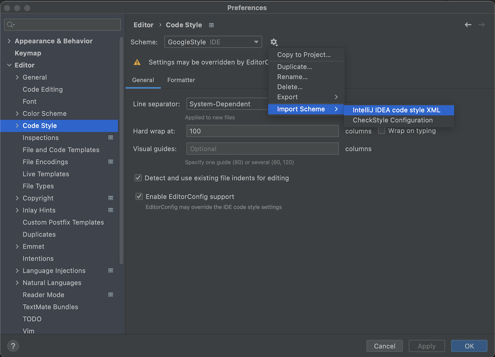

# Style Guide

- Use [EditorConfig](https://editorconfig.org/) for general coding styles.
  - Most Editors / IDEs support EditorConfig already.  
    [Download a plugin](https://editorconfig.org/#download) if your tool doesn't support it
    natively.
- Use [Spotless](https://github.com/diffplug/spotless)
  with [google-java-format](https://github.com/google/google-java-format) for Java.
  - Follow [Using the formatter](https://github.com/google/google-java-format#using-the-formatter)
    to set up formatter or plugin for your IDE.
    - :warning: For IntelliJ, download
      the [IntelliJ Java Google Style file](https://raw.githubusercontent.com/google/styleguide/gh-pages/intellij-java-google-style.xml)
      and import it into File→Settings→Editor→Code Style.  
      
