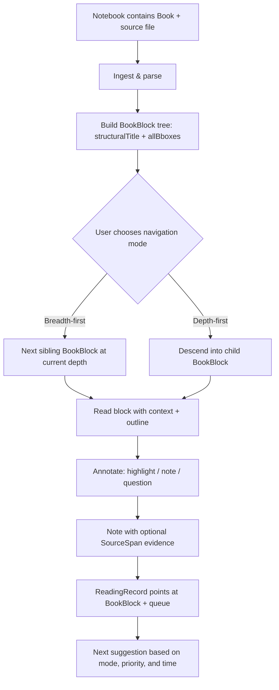

# Book-reading inside Doughnut: product landscape, feature blueprint, and implementation guidance

## Executive summary

A “book reading feature inside a PKM app” is already partially implemented across multiple categories of tools, but no single product fully matches Doughnut’s concept of **layout-aware structural decomposition + user-controlled navigation modes (breadth-first vs depth-first) + multi-level explanations + tight PKM graph integration + progress-aware guidance**. The closest overlaps come from: (a) *active reading + spatial workspaces* (e.g., MarginNote, LiquidText), (b) *reading inbox + capture/export pipelines* (e.g., Readwise Reader, BookFusion), and (c) *incremental reading + learning loops* (e.g., SuperMemo, Increader, RemNote’s “Learn PDF” mode). citeturn20search1turn6search8turn11search18turn10search0turn10search2turn7search0

Across these products, the most repeated “core loop” patterns are: **import → read/annotate → extract notes/highlights → organize → review/learn → export/sync**. Where they diverge is in (1) how much they understand the *structure* of the source (true TOC/sections vs “pages”), (2) how well they *export* into downstream PKM systems without breaking context, and (3) whether they support *non-linear / incremental* reading flows at scale. citeturn10search2turn12search4turn10search14turn6search7turn9search0turn21search0

The key engineering constraint is that **PDF is not reliably “structured text.”** Many PDFs have no usable outline/TOC, and extracted text often does **not** come out in natural reading order because the internal content stream order can differ from visual reading order; multi-column layouts and tables are especially problematic. citeturn15search0turn15search3turn15search6turn15search29  
This means “layout extraction” for Doughnut must be treated as a spectrum: from “use embedded structure when present” → “heuristics using fonts/geometry” → “OCR + layout models” when the document is scanned or poorly formed. citeturn7search1turn7search2turn15search0turn14search1turn3search0

From user feedback, the highest-impact and most frequently requested capabilities tend to be: **(a) reliable export and deep links back to source, (b) strong search/metadata, (c) performance and stability, (d) guided workflows to reduce overwhelm/learning curve, and (e) data portability/vendor risk mitigation**. citeturn6search4turn6search3turn6search24turn5search2turn5search1turn16search26  
Doughnut can differentiate by making **structure-first reading** the primary UX: treat each book as a navigable knowledge tree/graph, allow BFS/DFS traversal, store multi-level summaries per node, and keep every extracted note “anchored” with stable **citation locators** (e.g. future **`SourceSpan`** with page + region) and a clear place in the **`BookBlock`** tree (not just a page number). citeturn10search13turn9search0turn22search0turn12search4

For how those ideas are expressed in Doughnut’s own data shape—**where** in a book something is, **which region** is in play, **which user note** cites evidence, and **how progress** is tracked—see the companion document **`ongoing/doughnut-book-reading-architecture-roadmap.md`** (architecture directions, not a delivery plan).

## Overlapping products and tools

The landscape clusters into three overlapping “schools” that map cleanly to your concept: (1) **spatial/active reading**, (2) **reading inbox + export**, and (3) **incremental reading + learning systems**. The table below inventories representative tools and where they overlap.

### Product-feature matrix

Legend: ✓ = first-class built-in, ◐ = partial / indirect / add-on, — = not a focus

| Product | Import / formats | Structure & non-linear navigation | AI summaries / chat | Annotation & extraction | PKM integration / export | Learning loop (tracking + SRS) | Collaboration |
|---|---|---|---|---|---|---|---|
| entity["company","MarginNote","study annotation app"] | ✓ (PDF/EPUB + more) citeturn20search1 | ✓ (mind map / outliner / “study set”) citeturn20search1 | ◐ (AI content detection) citeturn20search1 | ✓ (highlights, OCR, cards) citeturn20search1 | ◐ (URL jumps/backlinks inside app) citeturn20search1 | ✓ (FSRS + review) citeturn20search1 | ◐ (encrypted sharing) citeturn20search1 |
| entity["company","LiquidText","active reading workspace app"] | ✓ (PDF/Word/PPT + OCR) citeturn6search8 | ✓ (workspace excerpts + links + compare) citeturn6search8 | — | ✓ (excerpts, ink links) citeturn6search8 | ◐ (export PDF/Word) citeturn6search8 | — | ✓ (realtime collaboration + privacy controls) citeturn20search14turn20search2 |
| entity["company","Readwise Reader","read-it-later reading app"] | ✓ (PDF/EPUB/articles/RSS etc.) citeturn11search18turn11search2 | ◐ (keyboard-centric “paragraph focus”) citeturn8search2 | ✓ (Ghostreader + document chat) citeturn11search16turn11search0 | ✓ (highlights/tags/notes; annotated PDF export) citeturn8search2turn11search14 | ✓ (official export plugins + templates) citeturn6search28turn6search7 | ◐ (ties to Readwise review system) citeturn11search12 | — |
| entity["company","RemNote","notes flashcards app"] | ✓ (PDF + notes content) citeturn10search13turn18search2 | ✓ (“Learn PDF” sections + mastery) citeturn10search0 | ✓ (AI tutor, summaries, citations) citeturn10search13turn10search0 | ✓ (PDF annotations + AI cards) citeturn10search13turn10search1 | ◐ (linked KB inside app) citeturn10search10 | ✓ (SRS; FSRS supported) citeturn1search19turn10search0 | — |
| entity["company","BookFusion","ebook reader sync app"] | ✓ (EPUB/PDF/CBZ/CBR/MOBI etc.) citeturn18search26turn10search17 | ◐ (reading app; roadmap for more) citeturn18search26turn6search27 | — (users request AI/search) citeturn6search24 | ✓ (highlights/notes export) citeturn6search31turn10search25 | ✓ (Obsidian/Notion integrations w/ templating) citeturn10search14turn6search35turn10search17 | ◐ (sync + “highlights-only sync” workflow) citeturn10search36turn10search33 | ◐ (sharing exists; not the primary brand) citeturn18search3 |
| entity["company","SuperMemo","spaced repetition software"] | ◐ (imports articles; workflows for excerpts) citeturn12search0 | ✓ (priority queue + incremental reading) citeturn12search4turn10search5 | — | ✓ (extract/cloze to cards) citeturn12search0 | — | ✓ (core SRS + IR scheduling) citeturn12search4turn10search5 | — |
| entity["company","Increader","incremental reading app"] | ◐ (documents/URLs) citeturn19search2 | ✓ (tab-fatigue / parallel reading framing) citeturn19search2 | — | ✓ (highlights → flashcards) citeturn7search0 | — | ✓ (spaced repetition positioning) citeturn7search0turn19search6 | — |
| entity["organization","Zotero","reference manager"] | ✓ (PDF reader + notes) citeturn9search0 | ◐ (outline/notes; academic-centric) citeturn9search0 | — | ✓ (notes from annotations w/ deep links + citations) citeturn9search0 | ◐ (exports/plugins into PKM) citeturn9search1turn9search20 | — | ◐ (sharing libraries; not in-scope here) citeturn9search0 |
| entity["organization","Polar Bookshelf","incremental reading app"] | ✓ (PDF/EPUB/web capture) citeturn6view1turn21search4 | ✓ (“pagemarks” inspired by IR) citeturn21search0turn21search1 | ◐ (AI flashcards mentioned in distribution) citeturn21search12 | ✓ (highlights + flashcards) citeturn21search7turn6view1 | ◐ (Anki planned / sync mentioned) citeturn21search0turn21search7 | ✓ (progress + revisit over months) citeturn21search0turn21search1 | — |
| entity["organization","Hypothesis","web annotation tool"] | ◐ (web/PDF via browser) citeturn22search1 | ◐ (fingerprint-based anchoring; groups) citeturn22search1turn22search5 | — | ✓ (shared annotations; local PDF supported) citeturn22search1 | ◐ (exports exist via APIs/ecosystem; not core) citeturn22search9 | — | ✓ (group annotation) citeturn22search5turn22search9 |
| entity["organization","Perusall","social annotation platform"] | ✓ (broad media incl. PDFs) citeturn22search23turn22search2 | ✓ (classroom workflows + analytics) citeturn22search2turn22search10 | ◐ (generative AI + ML grading) citeturn22search2 | ✓ (social annotation in margins) citeturn22search23 | ◐ (LMS integration; less PKM) citeturn22search2 | ◐ (engagement scoring/analytics) citeturn22search2turn22search10 | ✓ (core is collaborative learning) citeturn22search23turn22search33 |
| entity["organization","KOReader","open-source ereader"] | ✓ (many formats; e-ink focus) citeturn22search20turn22search24 | ✓ (book map + skim widget + alt TOC) citeturn22search0 | — | ✓ (notes/highlights + export formats) citeturn22search0turn22search28 | ◐ (sync to services like Readwise/Joplin) citeturn22search0 | ✓ (reading stats/progress tracking) citeturn22search0 | — |
| entity["organization","Omnivore","read-it-later app"] | ✓ (articles/PDFs etc.) citeturn16search23 | ◐ (inbox + tags + highlights) citeturn16search23 | — | ✓ (highlights/notes → export/import plugins) citeturn16search23turn16search0 | ◐ (Obsidian plugin ecosystem) citeturn16search23turn16search19 | — | — (and cloud shutdown risk) citeturn16search26 |

image_group{"layout":"carousel","aspect_ratio":"16:9","query":["MarginNote 4 mind map study set screenshot","LiquidText workspace ink links screenshot","Readwise Reader keyboard focus indicator screenshot","RemNote Learn PDF mode screenshot"],"num_per_query":1}

### What these overlaps imply for Doughnut

The “best-in-class” lessons are relatively consistent:

* **Spatial extraction + backreferences** are high value. Tools like LiquidText and Zotero demonstrate that users want extracted notes that can reliably jump back to source context (page/selection) and that exporting should preserve those anchors. citeturn6search8turn9search0turn9search28
* **Guided decomposition reduces overwhelm.** RemNote’s Learn PDF explicitly reframes PDFs as bite-sized sections with summary → practice → quiz → mastery, which is conceptually adjacent to Doughnut’s “choose depth” navigation. citeturn10search0turn10search13
* **Non-linear reading at scale needs a queue model.** SuperMemo’s incremental reading formalizes “parallel reading” using priority, extraction, and scheduling, which maps naturally to a BFS-style traversal across many nodes/books. citeturn12search4turn10search5turn12search5
* **Data portability is a product requirement, not a “nice-to-have.”** The Omnivore shutdown caused widespread “export your data quickly” urgency; this is a vivid reminder that users will discount systems that feel like a trap. citeturn16search26turn16search24

## Feature blueprint for Doughnut

Doughnut’s concept can be expressed as “a book becomes a navigable knowledge structure with stable anchors; the reader session is an interactive traversal with extraction.”

The flowchart below captures a minimally sufficient product loop that supports both breadth-first and depth-first navigation modes.

### Mapping research themes to Doughnut’s book-reading model

The landscape research above talks about “TOC,” “structure,” “highlights,” and “jump back to source.” In Doughnut those concerns are separated on purpose:

| Research theme | Domain role |
|----------------|-------------|
| Book file, format, import | **`Book`** in a **`Notebook`** (`format`, `sourceFileRef`) |
| Outline / chapter / section / navigable chunk | **`BookBlock`**: **`allBboxes`** (ordered **`PageBbox`** list), **`structuralTitle`**, optional child blocks for hierarchy |
| Exact point or span in the file (PDF coords, EPUB CFI, etc.) | **`allBboxes[0]`** and further entries for navigation and direct content (MinerU-normalized page + bbox); format-specific for non-PDF later |
| “This highlight is from here” / evidence for a PKM note | **`SourceSpan`**: start/end citation locators (**TBD** when implemented), optionally scoped **`within`** a `BookBlock`; a **`Note`** has at most one `SourceSpan` for now |
| “Where I left off” / completed a section | **`ReadingRecord`**: per **`User`**, refers to a **`BookBlock`** (meaningful chunk), not a tiny citation span |

This split matches the implementation pressure from the market: **navigation and progress** want coarse, stable regions (`BookBlock`); **citations and extraction** want precise endpoints (`SourceSpan` when shipped); **PKM notes** stay simple (`Note` + optional evidence).

### Functional areas and feature candidates

**Import and format support.** The baseline expectation is PDF and EPUB; “power users” increasingly expect broader format support (e.g., CBZ/CBR, MOBI, web article snapshots), and offline mode in at least part of the experience is frequently positioned as table stakes. citeturn18search26turn10search17turn22search0turn16search23  
Implementation approach typically splits into *rendering* vs *content extraction*: rendering must be fast and faithful, while extraction must map selections back to stable identifiers.

**Layout extraction and TOC parsing.**  
EPUB is structurally rich by design (packaged HTML/CSS with a navigation model in the EPUB 3 standard), so “true chapter/section navigation” is straightforward when books are well-formed. citeturn13search5turn4search8  
PDF is fundamentally less reliable: it may have an outline (bookmarks), but many PDFs don’t; when it exists, toolkits expose it as a tree. citeturn7search2turn7search1turn7search11turn7search31  
When outlines are missing or wrong, you must infer structure from geometry/font cues or model-based layout analysis (especially for scanned PDFs). citeturn15search0turn14search1turn14search0turn3search0

**Structural decomposition.** This is the “signature” capability in your concept: derive a hierarchy beyond TOC—e.g., Chapter → Key ideas → Subpoints → Examples → Definitions. RemNote already exposes “expand for more detail” summaries and “headers only” modes, demonstrating demand for multi-resolution reading. citeturn10search13turn10search0  
Doughnut could differentiate by making decomposition *bidirectional*: summaries at each node, but also a deterministic mapping back to exact source spans.

**Navigation modes.** “Breadth-first vs depth-first” can be productized as:

* **Breadth-first**: keep the user at a consistent level (e.g., section summaries across the entire chapter, then deeper) akin to “progressive disclosure” and similar in spirit to incremental reading’s parallelism. citeturn12search5turn12search4  
* **Depth-first**: allow a deep dive into one section down to paragraphs/figures. Systems like Readwise Reader show the value of a “focus indicator” and keyboard-first reading to reduce friction in long sessions. citeturn8search2turn8search6

**Multi-level AI summaries and explanations.** Ghostreader in Readwise is positioned as a set of prompts for summarization, concept expansion, translation, and more; RemNote uses summaries that can expand and cites sources via pins for AI-generated flashcards. citeturn11search16turn10search13turn10search1  
For Doughnut, the differentiator is not “having AI,” but **tying AI output to the structural graph** and letting users pick LoD (level of detail) deliberately.

**Annotation and note extraction.** Mature patterns include:

* “Extract to workspace” (LiquidText) citeturn6search8  
* “Create note from all annotations” (Zotero) citeturn9search0  
* “Highlight → exported markdown with templates” (BookFusion, Readwise) citeturn10search14turn6search7  
* “Highlight → flashcard” (RemNote, Increader) citeturn10search1turn7search0  

For Doughnut, the strongest UX is to keep extraction *atomic and anchored*: each extracted **`Note`** ties to a **`Book`** (via notebook containment and optional **`SourceSpan`**), with evidence as precise start/end locators (**TBD** encoding); the navigable hierarchy stays on **`BookBlock`** (`structuralTitle` plus **`allBboxes`**-bounded regions). Rendering fallbacks (e.g., screenshot for scanned PDFs) can attach to span kind or media later without collapsing “section” and “citation” into one type. This matches the direction of “jump back to source” practices across tools. citeturn9search0turn10search13turn20search1

**Linking into the PKM graph.** Exports and integrations are consistently treated as a key selling point: BookFusion ships an Obsidian plugin and a Notion integration; Readwise maintains official plugins and export templates; Zotero users regularly request stable markdown exports that preserve deep links. citeturn10search17turn6search35turn6search28turn9search6  
For Doughnut, linking should be native: every extracted “concept node” becomes a first-class PKM entity tied to its source anchor.

**Progress tracking and re-entry.** Incremental reading systems emphasize “resume later without losing place,” including over long gaps; Polar’s “pagemarks” is explicitly inspired by incremental reading and is framed as suspend/resume over weeks/months. citeturn21search0turn21search1turn12search5  
KOReader also ships reading statistics (progress/time/calendar views), reinforcing that quantitative re-entry tools matter. citeturn22search0  
Architecturally, attaching progress to **`ReadingRecord` → `BookBlock`** (not to `SourceSpan`) keeps “where I am in the book” aligned with navigable chunks rather than with every highlight-sized fragment.

**Spaced repetition and learning workflows.**  
If you want Doughnut to “guide users to read and remember,” you are implicitly entering SRS territory:

* Classic SM-2 is documented by SuperMemo and is foundational to other systems. citeturn1search0  
* FSRS is increasingly adopted in learning-focused apps (RemNote explicitly supports it). citeturn1search19  
* SuperMemo’s incremental reading integrates extraction + scheduling via priority queues and factors controlling re-review intervals. citeturn12search4turn10search5  

A Doughnut-native approach could keep SRS optional but deeply integrated: “convert highlight to question,” “schedule revisit by priority,” and “review extracted nodes” in a queue.

**Collaboration and sharing.** LiquidText positions realtime collaboration (shared vs private workspaces, near-instant edits, cursor indicators), while Hypothesis and Perusall show that group annotation and scoped visibility (“post to group” vs private) are proven collaboration patterns. citeturn20search14turn22search5turn22search33

## Implementation approaches, technologies, and complexity

This section maps the main functional areas above to typical engineering approaches and what tends to be “hard.”

### Parsing and rendering toolkits

For EPUB, the most common stack is the entity["organization","Readium","ebook toolkit project"] toolkits (iOS/Android/desktop/web variants), aligned to EPUB standards. citeturn8search1turn8search13turn13search5  
For web-based EPUB rendering, entity["organization","epub.js","javascript epub renderer"] is widely used as a browser rendering library. citeturn8search0

For PDFs, you typically choose between:

* browser JS rendering (e.g., PDF.js, created and maintained by entity["organization","Mozilla","open-source foundation"]) citeturn21search16  
* native toolkits (e.g., PDFium, MuPDF) citeturn7search11turn8search7

Complexity driver: annotation support and “round-tripping” (exporting an annotated PDF that other readers show correctly) is substantially harder than just rendering pages. This is visible in Readwise’s PDF export feature and user issues around “download with annotations.” citeturn11search14turn11search1

### Layout extraction and structural reconstruction

**Best case:** the PDF has a usable outline/bookmarks tree. Toolkits can expose it (e.g., PDFBox’s document outline; PyMuPDF `get_toc`; PDFium bookmarks). citeturn7search2turn7search1turn7search11  
**Common case:** no outline, or outline doesn’t map cleanly to the user’s reading goal—then you need heuristic segmentation and heading detection.  
**Hard case:** scanned PDFs (no text layer) or multi-column + tables where simple “extractText” creates scrambled order. PyMuPDF explicitly warns that text may not appear in reading order; PDF.js issues report similar DOM/text order mismatches. citeturn15search0turn15search6

Typical technologies:

* **OCR:** entity["organization","Tesseract OCR","open-source ocr engine"] for on-device OCR. citeturn0search40  
* **Layout models:** entity["organization","LayoutLM","document layout model"] to jointly model text + layout for document understanding, and entity["organization","LayoutParser","document layout toolkit"] as a toolkit for layout detection pipelines. citeturn14search0turn14search1  
* **Layout-aware extraction libraries:** entity["organization","GROBID","pdf structuring library"] (strong for scholarly PDFs into structured TEI/XML) and programmatic PDF geometry tools like pdfplumber. citeturn14search8turn17search3turn15search29  

Engineering complexity: high if you promise “reliable structure extraction” across arbitrary PDFs, because your pipeline must gracefully degrade and provide user correction tools (manual TOC editing, restructure, “this is a heading,” etc.). KOReader’s “create an alternative table of contents automatically or manually” is an existence proof that manual override is valuable. citeturn22search0

### Multi-level summaries, retrieval, and “grounded” explanations

A proven UX pattern is **expand/collapse summaries** with direct jump links back to where each point appears in the document, as RemNote does (page number jump; expandable detail; headers-only modes). citeturn10search13  
A complementary pattern is **document chat** while reading (Readwise Reader’s Chat feature). citeturn11search0

Typical implementation approach:

* Build a hierarchy of **`BookBlock`** nodes (and optional child blocks) per **`Book`**; attach summaries or retrieval keys per block as product needs dictate.
* Store embeddings per block or span for retrieval using vector search. Candidate tooling includes entity["organization","FAISS","vector similarity library"], entity["organization","pgvector","postgres vector extension"] on entity["organization","PostgreSQL","relational database"], or entity["organization","Milvus","vector database"] as a dedicated service. citeturn4search0turn4search3turn4search2turn4search1  
* Produce summaries per block and cache them; allow regeneration on demand.
* Ground AI output in **`SourceSpan`** (like RemNote pins citations for AI flashcards) when the user materializes or pins content into **`Note`** objects. citeturn10search13

Engineering complexity: medium-to-high. The “hard” parts are grounding (citations), incremental updates when the user modifies structure, and cost/latency control.

### Incremental reading and BFS/DFS traversal logic

SuperMemo formalizes incremental reading with extraction, conversion to questions, and a priority queue; it uses priority and factors to control intervals and what appears next. citeturn12search4turn10search5  
Polar’s “pagemarks” show a lighter-weight variant: resume later, even if you jump around. citeturn21search0turn21search1

For Doughnut, BFS/DFS can be implemented as a deterministic traversal of the structure graph plus a queue:

* BFS: select “next sibling node at the target depth,” optionally weighted by priority (user-set, difficulty, novelty).
* DFS: descend until the user stops, then resume with “continue deeper” suggestions.

Engineering complexity: medium. The bigger risk is UX confusion; queue mechanics need to be visible and editable, or users won’t trust them (SuperMemo explicitly discusses “priority bias” as a cognitive trap). citeturn12search4

### Licensing, DRM, and legal constraints

DRM is a first-order constraint if Doughnut tries to read “purchased ebooks” rather than user-owned files. entity["organization","EDRLab","digital reading lab"] manages entity["organization","Readium LCP","ebook drm standard"], described as a vendor-neutral DRM technology; integration is possible but adds complexity and compliance requirements. citeturn13search0turn13search1turn13search14  
Practically, a safe initial scope is *user-provided, non-DRM files*; if you later support LCP, it should be an explicit “protected content” import path.

Licensing of your internal toolchain also matters. For example, MuPDF and PyMuPDF are AGPL/commercial dual licensed, and AGPL obligations can be incompatible with proprietary distribution unless you buy commercial terms. citeturn8search7turn17search4turn17search5

## User feedback synthesis

User feedback across app store reviews and forums is remarkably consistent about where reading tools succeed and fail.

**Reliability and “paper cuts” matter more than flashy features.** A LiquidText App Store review highlights repeated UX friction (e.g., editing notes requiring extra steps instead of expected gestures), and community threads frequently describe bugs and pricing frustration as adoption blockers. citeturn6search4turn6search33turn6search16  
For Doughnut, the implication is that “structure-first reading” must not compromise baseline reader ergonomics (selection fidelity, latency, stable files).

**Export and downstream integration pain is a persistent sore spot.** Users report formatting issues when exporting highlights into markdown-based PKM workflows (Readwise → Obsidian formatting problems; template tweaks discussed on forums). citeturn6search3turn6search19turn6search7  
Similarly, Zotero users worry about losing deep links or getting messy markdown when moving annotations into PKM systems; the desire is “clean export + preserved links.” citeturn9search1turn9search27  
This supports Doughnut prioritizing **export templates + stable anchors + preview-before-sync**.

**Performance on real devices is a recurring adoption risk.** Readwise Reader users complain about slow performance and navigation on Android in community threads, while Readwise’s changelog notes ongoing work on EPUB and PDF loading issues. citeturn5search2turn5search22turn11search24  
Doughnut should assume that “AI + layout + reader” will hit latency and memory ceilings unless the system is designed to stream, cache, and degrade gracefully.

**Users actively ask for guided learning, better search, and AI that is actually useful.** A BookFusion review praises the overall reading/highlighting experience and Obsidian export integration but asks for advanced search and AI support. citeturn6search24  
RemNote’s Learn PDF mode positions mastery tracking, guided sections, summary + quiz loops, and source-aware explanations as a core differentiator—right in line with your “Doughnut guides the user to read” idea. citeturn10search0turn10search3

**Vendor risk and data portability are increasingly salient.** Omnivore’s shutdown (after acquisition) was widely communicated with a short export window, creating user anxiety about losing reading data and highlights. citeturn16search26turn16search24turn16search18  
This is direct support for Doughnut setting **portability and local storage** as defaults.

## Gaps, opportunities, and prioritized roadmap

Doughnut’s clearest “white space” is to merge **structure-aware reading** (not just “page-based annotation”) with **PKM graph primitives** and **non-linear navigation controls** that are explicit and user-steerable.

### Differentiation opportunities

**Structure as the product, not a side panel.** Many tools show TOC/outlines; few treat the book as a *first-class knowledge graph* whose nodes can be traversed BFS/DFS, summarized at multiple LoD, and linked into PKM entities with stable anchors. RemNote’s expandable summaries and “headers only” concept are strong evidence that multi-resolution reading is valuable. citeturn10search13turn10search0

**Anchors that survive export.** Zotero demonstrates the power of notes that include links back to the exact PDF page/spot; users repeatedly complain when those links break during export. citeturn9search0turn9search27  
Doughnut can win by standardizing a robust locator story (block tree position via `structuralTitle` / parent chain + precise **`PageBbox`**-style coordinates for PDF + citation **`SourceSpan`** when shipped + fallback screenshot) that never breaks.

**Queue-first reading for knowledge work.** Incremental reading’s primary insight is operational: people need to keep many documents “in flight” without losing them. That maps to BFS “reading across nodes” and to priority scheduling. citeturn12search4turn12search5turn21search0

### Recommended roadmap (product research; not a Doughnut delivery plan)

Sequencing of work in the repo is intentionally out of scope here; use **`ongoing/doughnut-book-reading-architecture-roadmap.md`** for stable architecture direction when a formal plan exists.

**Short term (foundation):**
Build the reliable reader + extraction spine first: PDF/EPUB import; TOC when present; fast page/section navigation; highlights/notes; deep links back to source; and robust markdown export into entity["company","Obsidian","markdown pkm app"] (with template control inspired by BookFusion/Readwise). citeturn10search14turn6search7turn9search0turn7search1turn11search14  
Also implement “portability by default”: full export of original file + extracted notes + anchors, motivated by Omnivore’s shutdown lesson. citeturn16search26turn11search20

**Medium term (differentiators):**
Add structure inference for PDFs without outlines (heuristics + user-correctable TOC), and introduce explicit navigation modes:
*Breadth-first* (across sibling nodes) and *depth-first* (dive and expand), with a transparent queue model that users can edit. citeturn15search0turn12search4turn22search0  
Layer in multi-level summaries with expand/collapse and “jump to source span,” similar in spirit to RemNote’s summary UI. citeturn10search13

**Long term (full vision):**
Integrate incremental reading + SRS deeply: “extract → question → schedule,” supporting modern algorithms (FSRS/SM-2) and optional export to external SRS tools. citeturn1search0turn1search19turn12search4  
Add collaboration modes (team reading rooms, shared annotations with scoped privacy) borrowing from LiquidText/Hypothesis/Perusall patterns. citeturn20search14turn22search5turn22search33  
If you want DRM support, consider Readium LCP as an explicit “protected content” track, with careful compliance and UX separation from “my files.” citeturn13search0turn13search14

## Success metrics and privacy/legal defaults

### Metrics to measure success and engagement

A good metric set should reflect the full loop: read → understand → extract → reuse.

Core behavioral metrics:
- **Activation:** % of users who import a book and create at least one anchored highlight/note within the first session.
- **Reading engagement:** time-in-reader, sessions/week, and re-entry rate (“came back to the same book within 7 days”).
- **Extraction efficiency:** notes/highlights per hour; % of highlights converted into PKM nodes; % of extracted nodes revisited later.
- **Navigation mode adoption:** BFS vs DFS usage, and “mode switching” frequency (proxy for flexibility).
- **Quality proxies:** “jump-back” rate (how often users go from a summary/note to the exact source span), and “anchor survival” rate after export/import round-trips (inspired by Zotero-style deep links). citeturn9search0turn10search13
- **Learning outcomes (if SRS exists):** review completion rate, retention proxy (ease/grade history), and long-term resurfacing usage similar to how Readwise positions daily review. citeturn11search12turn1search2

### Privacy and legal recommendations

**Default to local-first storage and portability.** User trust is weakened when systems feel like a lock-in risk; Omnivore’s shutdown compressing export urgency is a vivid reminder. citeturn16search26turn16search24

**Explicit AI boundaries and opt-in.** Many users will accept AI assistance if it is source-grounded and controllable; RemNote’s pin-based citation behavior and feedback requests about checking AI sources show that “trust” is part of UX. citeturn10search13turn10search32  
Recommended default: AI off for sensitive notebooks; allow on-device processing where feasible; provide a “never upload full document” toggle and an “only send selected span” mode.

**DRM: don’t promise what you can’t legally do.** Readium LCP is a formal DRM technology managed within the Readium/EDRLab ecosystem; supporting protected content is possible but must be deliberate. citeturn13search0turn13search1turn13search14  
Recommended default: support user-owned, non-DRM files first; treat DRM support as a separate, compliant import path.

**Library licensing and compliance by design.** PDF toolkits can have strong copyleft constraints (e.g., MuPDF/PyMuPDF AGPL dual-licensing). If Doughnut is proprietary, you must select toolkits and licenses accordingly. citeturn8search7turn17search4turn17search5