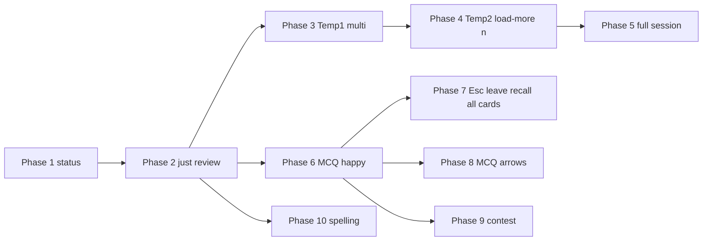

# CLI recall revival (plan only)

**Status:** Phase 1 complete (recall status). Phase 2.1 complete (Just Review E2E un-ignored + bold guidance assertion). Phase 2.2 complete (`/recall` just-review stage, PTY rows 48 for stable guidance replay). Phase 2.3 complete (just-review edge Vitest: invalid y/n commits, empty title/details + no notebook line). Phase 5.1 complete (full *Recall session* scenario un-ignored; `I answer … to prompt …` waits on Current guidance). Phase 5.3 complete (empty load-more after two recalls + `recallSessionSummaryLine` unit tests). Phase 6.4 complete (MCQ stem and choices through `renderMarkdownToTerminal`; `numberedMcqMarkdownLinesForTerminal`; Vitest in `recallMcqInteractive.test.tsx`). Phase 7.1–7.2 complete (**MCQ only** — Esc → leave confirm). Phase **7.3** complete (**just-review** — Esc → same leave confirm as MCQ; Vitest `recallJustReviewInteractive.test.tsx`). Phase **7.4** complete (**spelling** — Esc → same leave confirm as MCQ; Vitest `recallSpellingInteractive.test.tsx`). Phase **7.5** complete (shared `leaveRecallSessionCopy.ts` + `LeaveRecallConfirmPrompt.tsx`; `RecallSessionStage` uses `RECALL_SESSION_STOPPED_LINE`; recall interactive Vitests import copy constants). Phase **7.6** complete (load-more **Esc** = decline load more / session summary, not card-level leave confirm; Vitest `Escape on load more acts like no → Recalled 1 note` in `recallJustReviewInteractive.test.tsx`). Phase 7 remainder: **7.7** edges — see §Phase 7. Phase **10.1–10.3** complete (spelling recall E2E; spell-first `SpellingRecallStage`; mid-session **Correct!** in `RecallSessionStage` answered-lines strip above the active card; due-list tie-break `IFNULL(spelling,0) DESC`; spelling edges Vitest in `recallSpellingInteractive.test.tsx` + `spellingAnswerLine.test.ts`). **Next:** Phases 3–4 (Temp1 / Temp2) before Phase 5.2. Remaining: 5.2, 6.1–6.3, **7.7**, 8–9, as applicable; this file stays high-level planning, not a step-by-step implementation spec.  
**Goal:** Restore behaviors in `e2e_test/features/cli/cli_recall.feature` with **observable E2E coverage**, **minimal dead code**, and **architecture that does not repeat the pre-removal shape** (heavy global mutable recall state and recall orchestration embedded in `interactive.ts`).

**Guidance:** `.cursor/rules/planning.mdc`, `.cursor/rules/cli.mdc`, `ongoing/cli-architecture-roadmap.md` — prefer **Ink/React composition and stage-local state**, **thin Cucumber steps**, **centralized terminal assertions**, and **reuse of shared API client code** (`doughnut-api` / existing backend client helpers). Challenge big abstractions until repetition justifies them.

---

## Git history (inspiration only — do not resurrect architecture)

Recent removals (around **2026-03-28**) show what existed before strip-down; use only to remember **APIs, copy, and user-visible flows**, not file layout.

| Commit     | Summary |
|-----------|---------|
| `1307f7b5a` | Removed recall session handling from CLI page objects, step definitions, section parsing; marked recall scenarios ignored. |
| `5cbe3ad95` | Removed deprecated recall session handling / CLI input paths. |
| `6177a4481` | Removed `/recall-status` and related interactive wiring; trimmed tests and `interactiveFetchWait`. |
| `ef97ec629` (earlier) | Recall command updated to newer backend API client — useful reminder of **which controllers/DTOs** matter. |

**Prior shape (avoid repeating):** `interactive.ts` imported many recall helpers and owned **module-level mutable recall session state** (`pendingRecallAnswer`, `recallSessionMode`, load-more, stop confirmation, MCQ guidance lines, etc.). `cli/src/commands/recall.ts` was ~250 lines mixing HTTP, result typing, and some formatting. **Replace with** a bounded recall **stage** (or cohesive module + single parent component) so `interactive.ts` stays orchestration-light.

**Still in tree today:** `cli/src/commands/recall.ts` retains **`recallStatus` only** (plus HTTP error classification via `recallStatus` in `cli/tests/sdkHttpErrorClassification.test.ts`, and pluralization in `cli/tests/recallStatus.test.ts`). Backend `RecallsController` / recall domain remains; web E2E recall steps (`e2e_test/step_definitions/recall.ts`, etc.) are unrelated to CLI.

---

## Cross-cutting constraints (all phases)

1. **E2E gate:** Run the relevant `--spec e2e_test/features/cli/cli_recall.feature` (or single scenario via tags if the project supports it) after un-ignoring each scenario — see `.cursor/rules/e2e_test.mdc`.
2. **Assertions:** Extend **`e2e_test/start/pageObjects/cli/outputAssertions.ts`** (and friends) for recall-specific visible state; keep failures **diagnostic** (expected vs visible).
3. **Steps:** Keep **`e2e_test/step_definitions/cli.ts`** thin; restore or add **page-object fluents** under `e2e_test/start/pageObjects/cli/` (e.g. a `recallSession()`-style helper) rather than logic in steps.
4. **Terminology:** Match `.cursor/rules/cli.mdc` — past assistant vs current prompt vs current guidance; **y/n** for recall confirmations do not create past user message rows; MCQ choices in **current guidance**.
5. **OpenAI scenarios:** `@usingMockedOpenAiService` — ensure mock/stub ordering matches scenario tables (contest/regenerate needs **sequenced** mock responses).
6. **Deploy gate:** Per planning discipline, prefer **commit + CD deploy** between top-level phases when the team expects it.

---

## Phase 1 — Scenario: *Recall status shows count when notes are due* — **complete**

**User outcome:** `/recall-status` shows `1 note to recall today` (E2E); other counts covered by unit tests below.

- **1.1 / 1.2:** First scenario in `e2e_test/features/cli/cli_recall.feature` is active (no `@ignore`); `/recall-status` wired to `recallStatus`; copy appears in past CLI assistant messages; help lists the command where the project aggregates slash commands.
- **1.3:** `cli/tests/recallStatus.test.ts` — black-box `recallStatus` against a local HTTP stub returning `DueMemoryTrackers` JSON: `0` notes (missing and empty `toRepeat`), `1` note, `2` notes, `10` notes. No timezone/query unit tests (no client-side branching on that in `recallStatus`).

**Next:** Phase 2 (*Recall Just Review*).

---

## Phase 2 — Scenario: *Recall Just Review*

**User outcome:** `/recall` enters recall; **current guidance** shows note title, markdown-stripped details, styled emphasis, and “Yes, I remember?”; `y` → **past** assistant shows “Recalled successfully”.

### Phase 2.1 — E2E fails for the right reason — **complete**

- Un-ignored **Recall Just Review**; added missing step **`… styled in the Current guidance`** → `currentGuidance().expectContainsBold` (bold SGR + substring in replayed guidance).
- Failures surface as **missing expected text in Current guidance** (with replayed guidance + tail preview) or **bold styling** message, or **past assistant** missing `Recalled successfully` — not undefined steps or opaque PTY-only errors.

### Phase 2.2 — Pass E2E with minimum production change — **complete**

- Implement **next-due recall fetch** and **just-review** path using backend APIs (same conceptual operations as pre-removal `recallNext` / `markAsRecalled` — **re-derive names and structure**, do not paste old file).
- Render per `cli.mdc`: stage indicator if appropriate, notebook line in **current prompt**, body and y/n in **current prompt** vs guidance as per vocabulary table.
- Ensure **markdown rendering** matches expectations: “Put” bold, “sedation” emphasis, stripped markers from plain-text expectations in the feature.
- **Done:** `RecallsController.recalling` + `showMemoryTracker` + `getRecallPrompts` (reject pending MCQ / spelling with clear errors); `MemoryTrackerController.markAsRecalled`; `RecallJustReviewStage` + `/recall` registration; `y\r` PTY chunk handling; E2E PTY **48 rows** so `extractCurrentGuidanceFromReplayedPlaintext` sees recall content under the last `> ` line.

### Phase 2.3 — Edge cases (scenario scope only) — **complete**

- **Invalid key during y/n:** `cli/tests/recallJustReviewInteractive.test.tsx` drives `InteractiveCliApp` + stub API: empty Enter and `q`+Enter stay on prompt; `mark-as-recalled` fires once after `y`.
- **Empty details / missing notebook title:** Same file: whitespace-only title → `Note`, omitted `details` and `notebookTitle`, then `n` → `Marked as not recalled.`

**Next:** Phases 3–4 (*Temp1* / *Temp2*), then Phase 5 (*Recall session* full).

---

## Phase 3 — Scenario: *Temp1 — multiple notes in session*

**User outcome:** Two notes due today; one `/recall` session; **y** twice in response to **Yes, I remember?** (second prompt after the first recall). Feature: `Temp1 - multiple notes in session` in `cli_recall.feature`.

### Phase 3.1 — E2E fails for the right reason

- Un-ignore **Temp1**; failures should cite missing **second** just-review prompt, wrong ordering of notes, or stuck session — not undefined steps or unrelated guidance.

### Phase 3.2 — Pass E2E with minimum production change

- Extend recall stage so **multiple due just-review items** run in one session: after first **y**, fetch/show the next item (reuse Phase 2 per-item rendering). Session state stays **stage-local** (roadmap §4.2); no load-more requirement for this slice.

### Phase 3.3 — Edge cases (scenario scope only)

- Only what Temp1 implies (e.g. invalid key between items) if not already covered by Phase 2.3; avoid duplicating load-more or full-session scenarios.

---

## Phase 4 — Scenario: *Temp2 — ending session with n*

**User outcome:** One note due; **y** on **Yes, I remember?**; **n** on **Load more from next 3 days?**; **past** assistant shows **Recalled 1 note** (singular). Feature: `Temp2 - ending session with n` in `cli_recall.feature`.

### Phase 4.1 — E2E fails for the right reason

- Un-ignore **Temp2**; failures should cite missing load-more prompt, wrong summary line, or pluralization — not Temp1-only iteration bugs alone.

### Phase 4.2 — Pass E2E with minimum production change

- After the last due item for the current window, surface **Load more from next 3 days?**; **n** ends the session and commits the **session summary** to **past assistant messages** with correct singular copy.
- Use the **same** recall session abstraction as Phase 3 (stage-local state, one session model for Temp1 and Temp2). Order Phases 3 then 4 so multi-item iteration lands before load-more / summary edge cases are finalized.

### Phase 4.3 — Edge cases (scenario scope only)

- **n** when no further items:** Align with API empty response; thin unit coverage if needed.

---

## Phase 5 — Scenario: *Recall session — complete all due, summary, load more*

**User outcome:** Multiple just-review items in one `/recall` session; summary “Recalled 2 notes”; “Load more from next 3 days?” **n** then exit; new `/recall` + **y** on load more → continue; final “Recalled successfully”. Builds on Phases 3–4 (Temp1 / Temp2); remove or fold those scenarios once this phase is green if the team prefers a single long scenario only.

### Phase 5.1 — E2E fails for the right reason — **complete**

- Un-ignored **Recall session** scenario; added **`When I answer … in the interactive CLI to prompt …`** — waits until **Current guidance** contains the prompt (same diagnostics as guidance assertions), then sends the line — so timeouts point at missing **Yes, I remember?** (second item), **Load more from next 3 days?**, or later steps fail past assistant with missing **Recalled 2 notes**.

### Phase 5.2 — Pass E2E with minimum production change

- Complete the **full** session flow Phases 3–4 do not cover alone: plural summary **Recalled 2 notes**, second `/recall`, **y** on load more, and continued just-review through **Recalled successfully**.
- **Load more** with `dueindays` (or equivalent API parameter) and any remaining session teardown; reuse the same session abstractions as Temp1/Temp2.

### Phase 5.3 — Edge cases (scenario scope only) — **complete**

- **Load more when nothing left:** `recallJustReviewInteractive.test.tsx` — empty extended window after one recall (`Recalled 1 note`) and after two recalls (`Recalled 2 notes`); no MCQ/stop duplication.
- **Session summary wording:** `recallSessionSummary.test.ts` for `recallSessionSummaryLine` (0 / 1 / 2 / 10); formatter lives in `cli/src/commands/recall/recallSessionSummary.ts`.

---

## Phase 6 — Scenario: *Recall MCQ — choose correct answer and see success*

**User outcome:** OpenAI-mocked MCQ; stem and choices in **current guidance**; answer `1` → “Correct!” and “Recalled successfully” in **past** assistant messages.

### Phase 6.1 — E2E fails for the right reason

- Un-ignore; failure should reflect missing MCQ UI, wrong choice placement, or missing submit API — not mock misconfiguration only (if mock is wrong, fix steps/fixtures so the **reason** is still “feature missing”).

### Phase 6.2 — Pass E2E with minimum production change

- Integrate **MCQ recall prompt** from API; display stem + **numbered choices in current guidance** with ↑↓ selection per `cli.mdc`.
- Submit answer via existing recall/quiz endpoints (same domain as web recall).
- Ensure **current stage** / “Recalling” band behavior is consistent with roadmap §5 / vocabulary.

### Phase 6.3 — Edge cases (scenario scope only)

- **Wrong answer path:** Unit or Vitest for messaging if not covered by later scenarios.
- **Choice ordering / shuffling:** If API can shuffle, unit-test mapping from index to choice id — only if needed for MCQ correctness.

### Phase 6.4 — MCQ stem and choices: markdown on the TTY — **complete**

**User outcome:** MCQ **stem** and **choice strings** from the API are treated as **markdown** (same assumption as note details / web recall): render through the existing terminal markdown path (e.g. **`renderMarkdownToTerminal`** in `cli/src/markdown.ts`), with **bold / emphasis** and other supported styles visible in **Current guidance**; no raw `**` / `_` markers left for learners when the source is markdown.

- **Implementation:** Replace plain **`wrapPlainTextLinesForTerminal`** (and any plain-text-only choice rows) in **`RecallMcqStage`** with markdown rendering per **stem** and **each choice**, still respecting **`resolvedTerminalWidth()`** and `cli.mdc` column-width rules (grapheme / `string-width`, not UTF-16 `.length` for layout).
- **Selection UI:** Numbered list + ↑↓ highlight must stay correct: each choice remains one logical option after render (handle multi-line markdown output per choice without breaking index → `choiceIndex` mapping).
- **E2E / tests:** Add or extend a **scenario or Vitest** only if a **user-visible** styling or stripped-text assertion is needed (e.g. **`… styled in the Current guidance`** pattern from Phase 2); otherwise keep existing MCQ happy-path green.
- **Order:** Can ship **after** Phase 6.2 (and optionally after 6.3); does not unblock Phase 7–9.

**Done:** `cli/src/commands/recall/RecallMcqStage.tsx` — stem lines from `renderMarkdownToTerminal`; choices via `numberedMcqMarkdownLinesForTerminal` in `cli/src/commands/recall/numberedMcqMarkdownLines.ts` (per-choice wrap width from `stringWidth` of the `N. ` prefix). `cli/tests/recallMcqInteractive.test.tsx` — markdown in stem/choice, stripped output has no literal `**`, raw output includes CSI for styling.

---

## Phase 7 — Leave recall from **any** recall card: **Esc** + y/n confirm (**Vitest**, no `cli_recall.feature` scenario)

**User outcome:** While **`/recall`** is showing **any** active recall card (**just-review**, **MCQ**, and **spelling** — spelling via **`SpellingRecallStage`** / `spell-first` session branch), **Escape** means “leave recall” (end the recall **session**), not “answer the question.” The CLI shows the **same** **y/n confirmation** (shared copy intent: leave vs stay); **y** ends the recall session with a clear **assistant-visible** outcome (e.g. **`Recall session stopped.`** — same product intent as the old `the recall session was stopped` step, but **not** exercised via Cypress). **n** returns to the **same** question UI. **Do not** use **`/stop`** as the primary user action for this flow.

**Spelling note:** Phase **10** delivers the spelling **card** and submit path; **Esc → leave confirm** on that card is **still Phase 7.4** (not part of 10.x).

**Coverage:** **Unit-test driven** — extend or add **`cli/tests/*.test.tsx`** driving **`InteractiveCliApp`** with **`vi.spyOn`** on **`doughnut-api`** controllers (`cli.mdc` observable-behavior pattern). No new or restored Gherkin scenario in **`e2e_test/features/cli/cli_recall.feature`** for Phase 7 unless the team later chooses to add one.

**Card-level Esc:** MCQ, just-review, and spelling cards share **`LeaveRecallConfirmPrompt`** + copy in **`leaveRecallSessionCopy.ts`** (Phase **7.5**). Load-more **Esc** semantics: Phase **7.6** — see §Phase 7.6. Remaining Phase 7 topic: optional extra edge Vitest (**7.7**).

### Phase 7.1 — MCQ: Vitest fails for the right reason — **complete**

- **Esc** from MCQ shows **confirm** copy; **y** settles with expected assistant text and clears recall stage; **n** returns to MCQ UI; failures name **missing confirm / wrong branch / extra API call** (e.g. `answerQuiz` when user only aborted), not generic MCQ.

### Phase 7.2 — MCQ: pass with minimum production change — **complete**

- On **`RecallMcqStage`**, **Esc** → **y/n confirmation** (**`YesNoStagePrompt`**, stage-local state). **y** → **`onSettled`** with agreed copy + teardown; **n** → resume MCQ with no quiz submit.
- Confirm **due note not consumed** incorrectly on abort (no **`answerQuiz`** on abort-only path).
- MCQ **hint** documents Esc → confirm; **`outputAssertions`** PTY sniff string updated if the hint changes.

**Done:** `RecallMcqStage` — `showLeaveConfirm` + **`LeaveRecallConfirmPrompt`** (shared copy in **`leaveRecallSessionCopy`** — Phase **7.5**); **`Recall session stopped.`** on **y**; Esc on confirm dismisses like **n**; `recallMcqInteractive.test.tsx` — Esc / y / n + **`answerQuiz`** never called on abort.

### Phase 7.3 — Just-review: Esc → same leave confirm (Vitest) — **complete**

**User outcome:** On **Yes, I remember?**, **Esc** opens the **same** leave-recall confirmation as MCQ (shared prompt / settled line preferred), not an immediate **not-recalled** API call.

- **7.3.1 Vitest fails for the right reason** — From just-review card, **Esc** must show **`Leave recall?` (or shared constant)** + **`(y/n)`**; **`markAsRecalled` / `markJustReviewRecalled`** (whatever the code path uses) **not** called until the user commits **y** or **n** on the *question* itself. After **Esc** then **y**, transcript shows **`Recall session stopped.`** (or the shared stop line); spy counts prove no mistaken “not recalled” submit. Failures cite **wrong API call** or **missing confirm**, not generic recall.

- **7.3.2 Pass with minimum production change** — Refactor **`JustReviewRecallCard`** and/or **`RecallSessionStage`** so **Esc** does **not** call **`escapeJustReviewCard` → `submitJustReview(false)`** directly. Options (pick smallest that stays cohesive): a **leave-confirm substage** inside the just-review card (mirror MCQ), or **session-level** state in **`RecallSessionStage`** that wraps both variants. **y** → **`onSettled(sharedStopLine)`** and end session **without** treating as “not recalled”; **n** → back to the just-review prompt; **`onCancel`** on the nested **`YesNoStagePrompt`** for the *question* should mean “dismiss leave confirm,” not “submit not recalled.”

- **Product check:** **`n`** on **Yes, I remember?** remains **not recalled** (existing behavior); only **Esc** gains the leave-session path.

### Phase 7.4 — Spelling: same Esc contract (**Vitest**) — **complete**

**User outcome:** On the **spelling** recall card (**`SpellingRecallStage`**), **Esc** → same leave confirm as MCQ; **y** → shared stop line (`Recall session stopped.` or shared constant); **n** → back to spelling prompt (stem + **`Spell:`** + command buffer); **no** **`answerSpelling`** / premature submit on abort-only path.

**Prerequisite:** Phase **10** spelling card is **implemented** — this phase only adds **leave-session** UX, not spelling fetch/submit.

- **7.4.1 Vitest fails for the right reason** — **complete** — From spelling prompt (after question loaded), **Esc** shows **`Leave recall?`** + **`(y/n)`**; **`RecallPromptController.answerSpelling`** not called until the user commits Enter on a non-empty answer (or however submit is defined). After **Esc** then **y**, transcript shows shared stop line. Failures cite **wrong API call** or **missing confirm**, not generic recall.

- **7.4.2 Pass with minimum production change** — **complete** — Stage-local **`showLeaveConfirm`** + **`LeaveRecallConfirmPrompt`** in **`SpellingRecallStage`** (mirror **7.2**; shared wrapper from Phase **7.5**); **`SetStageKeyHandlerContext`** / **`useInput`** gated when confirm is shown. **n** on leave confirm → resume spelling UI with stable buffer.

- **Product check:** Wrong spelling / **`Incorrect.`** path (Phase **10.3**) is unchanged; leave confirm is only for **Esc** while the spelling card is active.

### Phase 7.5 — Cohesion — **complete**

Extracted shared **`LEAVE_RECALL_PROMPT`** and **`RECALL_SESSION_STOPPED_LINE`** in **`cli/src/commands/recall/leaveRecallSessionCopy.ts`**; thin **`LeaveRecallConfirmPrompt`** around **`YesNoStagePrompt`** in **`cli/src/commands/recall/LeaveRecallConfirmPrompt.tsx`**. **`RecallMcqStage`**, **`SpellingRecallStage`**, and **`JustReviewRecallCard`** use the wrapper; **`RecallSessionStage`** uses the stopped-line constant for just-review leave. Interactive Vitests import the copy module (`recallMcqInteractive`, `recallJustReviewInteractive`, `recallSpellingInteractive`).

### Phase 7.6 — Load-more and session chrome — **complete**

**Decision:** **Esc** on **Load more from next 3 days?** is **not** the card-level **Leave recall?** flow. It uses **`YesNoStagePrompt`**’s **`onCancel`** → **`escapeLoadMorePrompt`** in **`RecallSessionStage`**: abort an in-flight load-more fetch if **`submittingRef`** is set; otherwise **`submitLoadMore(false)`** → **`settleSessionSummary()`** (e.g. `Recalled 1 note` via **`recallSessionSummaryLine`**), same observable outcome as answering **n** on that prompt — **not** **`RECALL_SESSION_STOPPED_LINE`**.

**Rationale:** Load-more is session **chrome** for a bounded y/n; mapping **Esc** to **no** avoids a redundant second confirm and matches long-standing behavior.

**Coverage:** **`Escape on load more acts like no → Recalled 1 note`** in **`cli/tests/recallJustReviewInteractive.test.tsx`**.

### Phase 7.7 — Edge cases (Vitest scope)

- **MCQ:** **n** on leave confirm → back to MCQ with stable highlight/buffer (may already be covered by 7.1–7.2).
- **Just-review:** **n** on leave confirm → stable y/n prompt / no duplicate lines (covered when **7.3** ships).
- **Spelling:** **n** on leave confirm → stable spelling buffer / stem (covered when **7.4** ships).
- Invalid keys during leave confirm — only if not already covered by **`YesNoStagePrompt`** tests.

---

## Phase 8 — Scenario: *Recall MCQ — down arrow and Enter to select*

**Scope:** **MCQ recall only** — numbered choices in **current guidance** (`RecallMcqStage`). **Spelling** recall uses **typed text** on the command line (`SpellingRecallStage`); it does **not** use the MCQ ↑↓ list, so Phase **8** does **not** apply to spelling cards and needs **no** spelling-specific E2E or Vitest unless shared list primitives are refactored (unlikely).

**User outcome:** Down-arrow moves selection; Enter submits **incorrect** choice; still ends with “Incorrect” (or equivalent) and “Recalled successfully” per feature.

### Phase 8.1 — E2E fails for the right reason

- Un-ignore; ensure step `When I input down-arrow selection for "/recall"…` is implemented or replaced — failure should point at **selection index** or **Enter handling**, not Phase 6-only code.

### Phase 8.2 — Pass E2E with minimum production change

- Align **list selection** with existing `MainInteractivePrompt` patterns (e.g. `cycleListSelectionIndex`) so MCQ choice navigation does not fork a second keyboard model.
- Wire Enter to submit selected index.

### Phase 8.3 — Edge cases (scenario scope only)

- **Wrap-around** at ends of choice list: unit tests if quick.
- **Width wrapping** of long choices: unit tests for line breaking if not E2E-stable.

---

## Phase 9 — Scenario: *Recall MCQ — contest and regenerate before answering*

**Scope:** **MCQ recall only** — **`/contest`** in the feature file is tied to **OpenAI-mocked MCQ** stems and **`RecallMcqStage`**. **Spelling** flow in `cli_recall.feature` (Phase **10** rule block) has **no** contest step; contest-on-spelling is **out of scope** for Phase **9** unless product adds a scenario later.

**User outcome:** First question shown; `/contest` triggers legitimacy evaluation + regeneration; second stem appears; answer `1` → success messages.

### Phase 9.1 — E2E fails for the right reason

- Un-ignore; failures should cite **contest** command, mock sequence, or regeneration API — not generic MCQ.

### Phase 9.2 — Pass E2E with minimum production change

- Implement **`/contest`** in recall MCQ stage calling backend contest/regenerate flow (match **Gherkin table order** for OpenAI mocks).
- Preserve session/stage isolation: contest is a **subst**ep that returns to “show question” without leaking parent internals.

### Phase 9.3 — Edge cases (scenario scope only)

- **Contest when not allowed / API error:** User-visible error string — unit or Vitest if E2E too heavy.
- **Regenerate returns same stem:** Behavior defined by backend; CLI displays what it receives — unit test only if there is client-side logic.

---

## Phase 10 — Scenario: *Recall spelling — type correct spelling and see success* (second Rule block)

**User outcome:** Spelling tracker first when tied on `next_recall_at` → **Spell:** immediately (same as web); typed `sedition` → **Correct!** in transcript; then companion just-review + load-more **n** → **Recalled 2 notes**.

### Phase 10.1 — E2E fails for the right reason — **complete**

- Un-ignore; failure should indicate missing **SPELLING** path or wrong prompt sequence.

### Phase 10.2 — Pass E2E with minimum production change — **complete**

- Extend recall flow for **spelling** question type from API; free-text input on command line with validation/submit API calls.
- Reuse markdown/styling rules from Phase 2 where applicable for the review phase before spelling.
- **Done:** `spelling-session` when `mt.spelling`; `SpellingRecallStage` fetches spelling prompt on mount (spell first); `RecallSessionStage` keeps **answered recall lines** above the current card (e.g. **Correct!** before loading the next tracker); due queue tie-break `IFNULL(spelling,0) DESC`; slim spelling payload; just-review remains MCQ fallback only.

### Phase 10.3 — Edge cases (scenario scope only) — **complete**

- **Wrong spelling:** Message + whether note stays due — unit tests aligned with backend contract.
- **Case sensitivity / unicode:** Unit tests for normalization if client-side.

**Done:** `cli/tests/recallSpellingInteractive.test.tsx` — wrong answer → `Incorrect.`, single `answerSpelling`, no success lines (SRS after wrong answer: `RecallPromptControllerTests.WrongAnswer`); mixed-case and NBSP-trim pass-through to API body. `cli/src/commands/recall/spellingAnswerLine.ts` + `cli/tests/spellingAnswerLine.test.ts` — newline → space and trim (including NBSP).

---

## After all phases

- Remove any remaining `@ignore` on these scenarios; confirm **CI policy** for CLI E2E (today only install feature is active — decide whether recall feature joins CI or stays tag-gated; document in team process, not necessarily in this file).
- **Optional:** Update `ongoing/cli-architecture-roadmap.md` with one short **decision record** (where recall stage lives, how **Esc exit** and **`/contest`** relate to command registry) if it clarifies future work.
- Delete or shrink **this** plan when revival is complete.

---

## Suggested dependency graph (top-level)

Phases **8–9** depend on **MCQ** (Phase 6) and do **not** gate on spelling. **Phase 7** (Esc + y/n leave recall) is **Vitest-only** — no node in `cli_recall.feature`; **7.1–7.6** **complete** (MCQ, just-review, spelling, shared leave-confirm cohesion, load-more **Esc** semantics). Remaining within Phase 7: optional edges (**7.7**). **Phase 6.4** refines MCQ presentation (markdown stem/choices); it does not add a new top-level scenario node. Phase **10** is **complete** (10.1–10.3).
