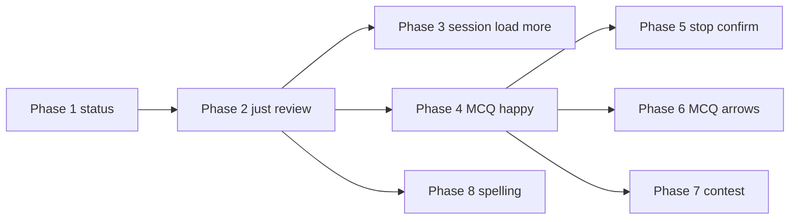

# CLI recall revival (plan only)

**Status:** Phase 1 complete (recall status). Phase 2.1 complete (Just Review E2E un-ignored + bold guidance assertion). Phases 2.2–8 still ahead; this file stays high-level planning, not a step-by-step implementation spec.  
**Goal:** Restore behaviors in `e2e_test/features/cli/cli_recall.feature` with **observable E2E coverage**, **minimal dead code**, and **architecture that does not repeat the pre-removal shape** (heavy global mutable recall state and recall orchestration embedded in `interactive.ts`).

**Guidance:** `.cursor/rules/planning.mdc`, `.cursor/rules/cli.mdc`, `ongoing/cli-architecture-roadmap.md` — prefer **Ink/React composition and stage-local state**, **thin Cucumber steps**, **centralized terminal assertions**, and **reuse of shared API client code** (`doughnut-api` / existing backend client helpers). Challenge big abstractions until repetition justifies them.

---

## Git history (inspiration only — do not resurrect architecture)

Recent removals (around **2026-03-28**) show what existed before strip-down; use only to remember **APIs, copy, and user-visible flows**, not file layout.

| Commit     | Summary |
|-----------|---------|
| `1307f7b5a` | Removed recall session handling from CLI page objects, step definitions, section parsing; marked recall scenarios ignored. |
| `5cbe3ad95` | Removed deprecated recall session handling / CLI input paths. |
| `6177a4481` | Removed `/recall-status` and related interactive wiring; trimmed tests and `interactiveFetchWait`. |
| `ef97ec629` (earlier) | Recall command updated to newer backend API client — useful reminder of **which controllers/DTOs** matter. |

**Prior shape (avoid repeating):** `interactive.ts` imported many recall helpers and owned **module-level mutable recall session state** (`pendingRecallAnswer`, `recallSessionMode`, load-more, stop confirmation, MCQ guidance lines, etc.). `cli/src/commands/recall.ts` was ~250 lines mixing HTTP, result typing, and some formatting. **Replace with** a bounded recall **stage** (or cohesive module + single parent component) so `interactive.ts` stays orchestration-light.

**Still in tree today:** `cli/src/commands/recall.ts` retains **`recallStatus` only** (plus HTTP error classification via `recallStatus` in `cli/tests/sdkHttpErrorClassification.test.ts`, and pluralization in `cli/tests/recallStatus.test.ts`). Backend `RecallsController` / recall domain remains; web E2E recall steps (`e2e_test/step_definitions/recall.ts`, etc.) are unrelated to CLI.

---

## Cross-cutting constraints (all phases)

1. **E2E gate:** Run the relevant `--spec e2e_test/features/cli/cli_recall.feature` (or single scenario via tags if the project supports it) after un-ignoring each scenario — see `.cursor/rules/e2e_test.mdc`.
2. **Assertions:** Extend **`e2e_test/start/pageObjects/cli/outputAssertions.ts`** (and friends) for recall-specific visible state; keep failures **diagnostic** (expected vs visible).
3. **Steps:** Keep **`e2e_test/step_definitions/cli.ts`** thin; restore or add **page-object fluents** under `e2e_test/start/pageObjects/cli/` (e.g. a `recallSession()`-style helper) rather than logic in steps.
4. **Terminology:** Match `.cursor/rules/cli.mdc` — past assistant vs current prompt vs current guidance; **y/n** for recall confirmations do not create past user message rows; MCQ choices in **current guidance**.
5. **OpenAI scenarios:** `@usingMockedOpenAiService` — ensure mock/stub ordering matches scenario tables (contest/regenerate needs **sequenced** mock responses).
6. **Deploy gate:** Per planning discipline, prefer **commit + CD deploy** between top-level phases when the team expects it.

---

## Phase 1 — Scenario: *Recall status shows count when notes are due* — **complete**

**User outcome:** `/recall-status` shows `1 note to recall today` (E2E); other counts covered by unit tests below.

- **1.1 / 1.2:** First scenario in `e2e_test/features/cli/cli_recall.feature` is active (no `@ignore`); `/recall-status` wired to `recallStatus`; copy appears in past CLI assistant messages; help lists the command where the project aggregates slash commands.
- **1.3:** `cli/tests/recallStatus.test.ts` — black-box `recallStatus` against a local HTTP stub returning `DueMemoryTrackers` JSON: `0` notes (missing and empty `toRepeat`), `1` note, `2` notes, `10` notes. No timezone/query unit tests (no client-side branching on that in `recallStatus`).

**Next:** Phase 2 (*Recall Just Review*).

---

## Phase 2 — Scenario: *Recall Just Review*

**User outcome:** `/recall` enters recall; **current guidance** shows note title, markdown-stripped details, styled emphasis, and “Yes, I remember?”; `y` → **past** assistant shows “Recalled successfully”.

### Phase 2.1 — E2E fails for the right reason — **complete**

- Un-ignored **Recall Just Review**; added missing step **`… styled in the Current guidance`** → `currentGuidance().expectContainsBold` (bold SGR + substring in replayed guidance).
- Failures surface as **missing expected text in Current guidance** (with replayed guidance + tail preview) or **bold styling** message, or **past assistant** missing `Recalled successfully` — not undefined steps or opaque PTY-only errors.

### Phase 2.2 — Pass E2E with minimum production change

- Implement **next-due recall fetch** and **just-review** path using backend APIs (same conceptual operations as pre-removal `recallNext` / `markAsRecalled` — **re-derive names and structure**, do not paste old file).
- Render per `cli.mdc`: stage indicator if appropriate, notebook line in **current prompt**, body and y/n in **current prompt** vs guidance as per vocabulary table.
- Ensure **markdown rendering** matches expectations: “Put” bold, “sedation” emphasis, stripped markers from plain-text expectations in the feature.

### Phase 2.3 — Edge cases (scenario scope only)

- **Invalid key during y/n:** Unit or small Vitest via `runInteractive` if not E2E-covered; do not implement `/stop` or MCQ here (later phases).
- **Empty details / missing notebook title:** Unit tests only if easy and scenario-relevant.

---

## Phase 3 — Scenario: *Recall session — complete all due, summary, load more*

**User outcome:** Multiple just-review items in one `/recall` session; summary “Recalled 2 notes”; “Load more from next 3 days?” **n** then exit; new `/recall` + **y** on load more → continue; final “Recalled successfully”.

### Phase 3.1 — E2E fails for the right reason

- Un-ignore; confirm failure mentions missing multi-step session, missing summary line, or load-more prompt behavior.

### Phase 3.2 — Pass E2E with minimum production change

- Extend recall **session state** (within the new stage/module — **not** a sprawl of unrelated globals) for: iterating due notes, session counter, **load more** with `dueindays` (or equivalent API parameter), and committing summary lines to **past assistant messages**.
- Reuse Phase 2 building blocks for a single item; keep **parent decides next step** (roadmap §4.2).

### Phase 3.3 — Edge cases (scenario scope only)

- **Load more when nothing left:** Unit-level behavior if API returns empty; do not duplicate MCQ/stop flows.
- **Session summary wording:** Edge pluralization unit tests if not E2E-covered.

---

## Phase 4 — Scenario: *Recall MCQ — choose correct answer and see success*

**User outcome:** OpenAI-mocked MCQ; stem and choices in **current guidance**; answer `1` → “Correct!” and “Recalled successfully” in **past** assistant messages.

### Phase 4.1 — E2E fails for the right reason

- Un-ignore; failure should reflect missing MCQ UI, wrong choice placement, or missing submit API — not mock misconfiguration only (if mock is wrong, fix steps/fixtures so the **reason** is still “feature missing”).

### Phase 4.2 — Pass E2E with minimum production change

- Integrate **MCQ recall prompt** from API; display stem + **numbered choices in current guidance** with ↑↓ selection per `cli.mdc`.
- Submit answer via existing recall/quiz endpoints (same domain as web recall).
- Ensure **current stage** / “Recalling” band behavior is consistent with roadmap §5 / vocabulary.

### Phase 4.3 — Edge cases (scenario scope only)

- **Wrong answer path:** Unit or Vitest for messaging if not covered by later scenarios.
- **Choice ordering / shuffling:** If API can shuffle, unit-test mapping from index to choice id — only if needed for MCQ correctness.

---

## Phase 5 — Scenario: *Recall MCQ — ESC cancels with y/n confirmation*

**User outcome:** `/stop` during MCQ → recall session stopped (per step `the recall session was stopped`); `/recall-status` still shows due count.

### Phase 5.1 — E2E fails for the right reason

- Un-ignore; failure should say stop/confirm/stop-session behavior missing, not MCQ from Phase 4.

### Phase 5.2 — Pass E2E with minimum production change

- Implement **`/stop`** (or equivalent documented in help) in recall stage: **y/n confirmation**, session teardown, no orphaned pending API state.
- Confirm **due note not consumed** incorrectly when stopping (status count unchanged).

### Phase 5.3 — Edge cases (scenario scope only)

- **n** on stop confirmation → return to MCQ (if product expects — only if scenario or help implies; otherwise defer to avoid scope creep).
- **Escape vs /stop:** If both exist, document one source of truth; unit-test the branch that E2E does not hit.

---

## Phase 6 — Scenario: *Recall MCQ — down arrow and Enter to select*

**User outcome:** Down-arrow moves selection; Enter submits **incorrect** choice; still ends with “Incorrect” (or equivalent) and “Recalled successfully” per feature.

### Phase 6.1 — E2E fails for the right reason

- Un-ignore; ensure step `When I input down-arrow selection for "/recall"…` is implemented or replaced — failure should point at **selection index** or **Enter handling**, not Phase 4-only code.

### Phase 6.2 — Pass E2E with minimum production change

- Align **list selection** with existing `MainInteractivePrompt` patterns (e.g. `cycleListSelectionIndex`) so MCQ choice navigation does not fork a second keyboard model.
- Wire Enter to submit selected index.

### Phase 6.3 — Edge cases (scenario scope only)

- **Wrap-around** at ends of choice list: unit tests if quick.
- **Width wrapping** of long choices: unit tests for line breaking if not E2E-stable.

---

## Phase 7 — Scenario: *Recall MCQ — contest and regenerate before answering*

**User outcome:** First question shown; `/contest` triggers legitimacy evaluation + regeneration; second stem appears; answer `1` → success messages.

### Phase 7.1 — E2E fails for the right reason

- Un-ignore; failures should cite **contest** command, mock sequence, or regeneration API — not generic MCQ.

### Phase 7.2 — Pass E2E with minimum production change

- Implement **`/contest`** in recall MCQ stage calling backend contest/regenerate flow (match **Gherkin table order** for OpenAI mocks).
- Preserve session/stage isolation: contest is a **subst**ep that returns to “show question” without leaking parent internals.

### Phase 7.3 — Edge cases (scenario scope only)

- **Contest when not allowed / API error:** User-visible error string — unit or Vitest if E2E too heavy.
- **Regenerate returns same stem:** Behavior defined by backend; CLI displays what it receives — unit test only if there is client-side logic.

---

## Phase 8 — Scenario: *Recall spelling — type correct spelling and see success* (second Rule block)

**User outcome:** After “Yes, I remember?” → **Spell:** prompt; typed `sedition` → “Correct!” and “Recalled successfully”.

### Phase 8.1 — E2E fails for the right reason

- Un-ignore; failure should indicate missing **SPELLING** path or wrong prompt sequence.

### Phase 8.2 — Pass E2E with minimum production change

- Extend recall flow for **spelling** question type from API; free-text input on command line with validation/submit API calls.
- Reuse markdown/styling rules from Phase 2 where applicable for the review phase before spelling.

### Phase 8.3 — Edge cases (scenario scope only)

- **Wrong spelling:** Message + whether note stays due — unit tests aligned with backend contract.
- **Case sensitivity / unicode:** Unit tests for normalization if client-side.

---

## After all phases

- Remove any remaining `@ignore` on these scenarios; confirm **CI policy** for CLI E2E (today only install feature is active — decide whether recall feature joins CI or stays tag-gated; document in team process, not necessarily in this file).
- **Optional:** Update `ongoing/cli-architecture-roadmap.md` with one short **decision record** (where recall stage lives, how `/stop` and `/contest` relate to command registry) if it clarifies future work.
- Delete or shrink **this** plan when revival is complete.

---

## Suggested dependency graph (top-level)

Phases 5–7 depend on MCQ (Phase 4); Phase 8 can proceed in parallel with 3–7 after Phase 2 if resourcing splits, but **sequential delivery** per scenario order is the default.
