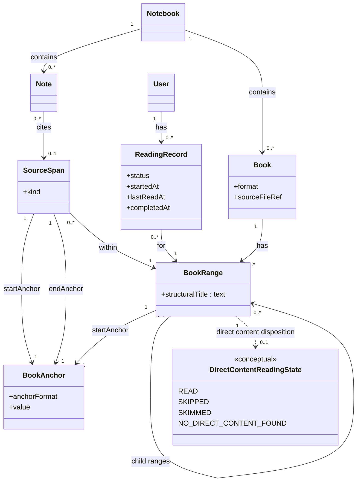

# Book reading in Doughnut — architecture roadmap

This document is **not** a delivery plan. It does not define phased user-visible work (for that, see `.cursor/rules/planning.mdc` and a future `ongoing/<short-name>.md` plan when one exists). It **is** the guideline for **architecture direction**: how we want concepts and boundaries to line up so implementation can stay coherent as features land.

**Companion:** market and product research stays in `ongoing/book-reading-research-report.md`. That report is now cross-walked to the vocabulary below.

**Living document:** When a book-reading plan is written and executed, **update this roadmap** so it stays the single place for “what we believe the shape of the system should be.” Do not duplicate long architecture prose inside the plan; link here instead. **Delivery plan for “Read a range of a book”:** [`ongoing/book-reading-read-a-range-plan.md`](book-reading-read-a-range-plan.md).

---

## Intent

Separate concerns so one object does not have to mean everything at once:

| Concern | Question it answers |
|--------|---------------------|
| **Where** | A single precise point in a book file |
| **Which region** | A navigable or hierarchical chunk (section, “current reading unit”) |
| **Direct content** | Material between this outline node and the next in **document reading order**, ignoring nesting depth (see below) |
| **Evidence** | The exact span a note is about |
| **Knowledge** | The user’s PKM note |
| **Progress** | Where the user is in the book, at chunk granularity |

---

## Core model (directional)

The diagram encodes **relationships we want to preserve** across PDF, EPUB, and future formats. Concrete storage types and APIs will evolve; the splits below should not collapse without an explicit decision.

### BookAnchor

The most precise locator: one place in the book. Examples over time: PDF coordinates, EPUB CFI, paragraph offsets, etc.

Keep the abstraction **open** early: `anchorFormat` + `value` (opaque until format-specific design is justified).

### BookRange

A region: **`startAnchor`** locates the section in the book file. Primary unit for **navigation**, **hierarchical decomposition**, and **progress**. Optional **`structuralTitle`** is the human-readable label for that node in the outline (e.g. `Chapter 3`, `2.4.1`). A breadcrumb-style path can be **derived** by walking parent ranges; we do not use a separate persisted “structural address” field.

Each `BookRange` also has a conceptual association to **direct content** (see next subsection).

### Direct content (conceptual)

**Direct content** is whatever lies **between** one `BookRange` and the **next** `BookRange` in reading order, or **to the end of the book** if this range is the last node in that order.

- The outline may be **nested**, but direct content is **not** defined by nesting depth. It is always “from this node’s start until the next node’s start (or EOF),” following the same **linear reading order** the product uses to walk the tree (depth-first preorder is the natural default: parent, then subtree, then sibling).
- **Parent node:** Its direct content is the material **between itself and its first child** (i.e. after this range’s start until the first child’s start). If there is no child, the next boundary is the same rule as for a leaf: the following node in the walk, or EOF.
- **Last child in a subtree:** Its direct content runs **from its start until the next range after leaving that subtree** (the next sibling of an ancestor, or EOF)—not “until parent’s end,” unless the outline order says so.

**Persistence and extraction:** For now, direct content is **only a vocabulary and UX/progress concept**. We do **not** require a stored blob, span table, or server-side extraction of that gap. When the product needs it, anchors or text extraction can be added without renaming the idea.

**Disposition (per range, conceptual):** How the user (or system) treats the direct content attached to a range can be classified for product logic:

| Disposition | Meaning (informal) |
|-------------|-------------------|
| **Direct content read** | The gap was read as intended. |
| **Direct content skipped** | The user skipped it. |
| **Direct content skimmed** | The user skimmed it (lighter than “read”). |
| **No direct content found** | There is no meaningful gap (e.g. adjacent anchors, or structure implies none). |

These dispositions are **not** persisted in the current architecture; they document the **intended states** when we model reading behavior. The diagram shows them as **`DirectContentReadingState`** linked conceptually to `BookRange`.

### SourceSpan

Optional evidence on a **Note**: also start/end anchors, but purpose is **citation**, not navigation tree. May sit **within** a `BookRange` so a small quote still relates to the larger reading chunk.

### Note

Belongs to a `Notebook`. At most **one** `SourceSpan` for the first version—enough for anchored extraction without multi-evidence complexity until needed.

### ReadingRecord

Per `User`, refers to a `BookRange`. Progress attaches to **meaningful chunks**, not citation-sized spans.

---

## Architectural rules (default)

1. Every `BookRange` has exactly one `startAnchor`.
2. Every `SourceSpan` has exactly one `startAnchor` and one `endAnchor`.
3. `ReadingRecord` points at a `BookRange`, not a `SourceSpan`.
4. `SourceSpan` is optional on `Note`.
5. Prefer `SourceSpan` to be smaller than or equal to the `BookRange` it sits within.
6. **Direct content** is defined relative to **outline reading order** and a range’s **start** boundary; it is **orthogonal** to how deep the range sits in the tree. Until we persist it, rules about extraction or anchors for gaps are **out of scope** for this roadmap’s defaults.

These are **defaults** for consistency; revisiting them is a roadmap-level change, not a silent refactor.

---

## Current directional choices

- **One span per note (initially):** Keeps PKM extraction simple; multi-span and cross-book evidence are explicit future extensions.
- **`structuralTitle` on `BookRange`:** Human-readable title for the range in the book’s structure tree; parent chain + title is enough to reconstruct display paths when needed.
- **No `StructuralBookRange` subtype yet:** Structural vs user-carved ranges may be distinguished later if the product requires it (e.g. import vs override).
- **Direct content is conceptual only:** Naming the gap between ranges (and the four dispositions) keeps UX and future progress modeling aligned; **no** DB column or API field is implied yet.

---

## Story 1 (shipped)

**Book** metadata plus **BookRange** tree on a **Notebook**: **`POST /api/notebooks/{notebook}/attach-book`** (JSON outline only) and **`GET /api/notebooks/{notebook}/book`**, at most one book per notebook. As shipped, **`sourceFileRef` is not used** and there is **no server-side PDF storage**; the PDF stayed on the client. Outline anchors use **`pdf.mineru_outline_v1`** on the wire (backend `BookReadingWireConstants`).

---

## Story 2 — Read a range (direction)

**Goal:** After CLI (or future UI) attach, the **same book the user reads in the browser** is the **file stored server-side**, with a reading UI that ties **outline navigation** to **PDF position**.

| Decision | Direction |
|----------|-----------|
| **CLI + server** | **`/attach` in the CLI** uploads the PDF to the backend **via the same `attach-book` surface** as the rest of the product (extend the route to accept outline + file in one logical operation—e.g. multipart—or an equivalent single-user-visible “attach” that does not fork a second attach API). |
| **Blob storage** | **Production:** PDF bytes live in a **GCP bucket** (object key or URL recorded so `sourceFileRef` or equivalent can resolve the object). **Dev / automated tests:** a **local or test-local object store** (filesystem, emulator, or test-only bucket) so the **same E2E scenarios** run without requiring real GCP. |
| **Frontend PDF** | Render the book with **pdf.js** in the **main content** area of the book reading page. |
| **Chrome layout** | **Book layout** (outline / ranges tree) lives in a **drawer sidebar** on the book reading page; the **PDF viewer occupies the main pane**. |
| **Sync** | **Two-way:** (1) **Selecting / activating a range** in the layout drives **pdf.js** to the corresponding anchors (page / region). (2) **Scrolling (and relevant zoom / page changes) in the PDF** updates which range is **highlighted** as current in the layout. |

**Deletion:** Removing a book from the notebook (frontend flow) must **delete the persisted book record** and **remove the object** from the configured storage backend (GCS in prod, local/test store in dev).

**Plan:** Phased delivery is spelled out in [`ongoing/book-reading-read-a-range-plan.md`](book-reading-read-a-range-plan.md).

**Implemented so far (Story 2):** Phases **1–6** and **11–13** of that plan are shipped: multipart attach, **`GET …/book/file`**, **pdf.js** full scrollable viewer (`PdfBookViewer` using the **legacy** pdf.js stack — see **PDF.js build** below), the **outline** from **`GET …/book`** in a **left** responsive drawer/panel (PDF in **`main`**; **768px** breakpoint: open by default on large, overlay + backdrop on small; **Outline** control in **GlobalBar**), **layout → PDF** navigation from **`pdf.mineru_outline_v1`** anchors (page index, optional bbox, chrome/safe-area offset, bad-anchor no-op), **PDF → outline** sync (viewport drives **viewport-current** row highlight, debounced, with accessible live region for title changes), responsive default PDF scale (full-width on narrow viewports, comfortable max-width cap on wide viewports based on first-page intrinsic geometry, with manual zoom preserved across resize), **GlobalBar** **`PdfControl`** zoom buttons + page indicator, and **PDF-only gesture zoom** (ctrl/meta + wheel and two-finger pinch on the viewer scroll container, shared **`pdfViewer.currentScale`**, `preventDefault` to avoid browser zoom). The book-reading E2E uses **OCR on rendered canvases** (Tesseract.js, committed language data under `e2e_test/tesseract/`) for page markers — **not** a product DOM text layer on top of the canvas.

**PDF.js build (current):** The app uses **pdf.js legacy** end-to-end (`pdfjs-dist/legacy/build/pdf.mjs`, `legacy/web/pdf_viewer.mjs` + CSS, `legacy/build/pdf.worker.mjs` wired from `frontend/src/lib/pdfjsWorker.ts`). The standard worker assumes **`Uint8Array.prototype.toHex`** (PDF fingerprints); **Cypress’s bundled Electron** is on an older Chromium without that API, which breaks PDF load (e.g. `hashOriginal.toHex is not a function`). Legacy bundles a polyfill; **main thread and worker must stay on the same build line** (mixing legacy worker + modern `getDocument` is unsupported).

**PDF.js build (future):** Switch back to the **non-legacy** pdf.js entrypoints once **Cypress upgrades its embedded Electron** to a Chromium that implements `Uint8Array.prototype.toHex` (or upstream pdf.js no longer requires it for our path). CI already runs E2E in Chrome; this matters most for **default `cypress run` (Electron)** and local parity.

**E2E fixture / MinerU mock migration (`refactoring.pdf`, committed JSON, real MinerU refresh):** Sub-phased delivery in [`ongoing/book-reading-e2e-refactoring-fixture-visible-ocr-plan.md`](book-reading-e2e-refactoring-fixture-visible-ocr-plan.md) — Phases **1–7** **shipped** (viewport OCR, same-page scenarios). **Coordinate contract:** MinerU pipeline **`content_list`** bboxes are **0–1000 normalized per page**, not PDF points; the reader converts with page `getViewport({ scale: 1 })` width/height, applies a small PDF-space **top padding** on outline scroll, and compares **viewport midpoint** to anchor **`y0`** in the same 0–1000 system for **viewport-current**. **Temporary debug:** semi-transparent bbox overlay in `PdfBookViewer` (no border). Details, pdf.js scroll quirks, and E2E **`deltaPx`** tuning: **Important learnings** section in that plan.

---

## Open architecture questions

Revisit when implementation or product constraints clarify:

- Whether `BookAnchor.value` stays opaque text or becomes structured payload (e.g. JSON) per `anchorFormat`.
- Whether `ReadingRecord` needs finer-grained progress inside a range (percentage, character offset, etc.).
- Whether `BookRange` should distinguish imported outline ranges from user-created ranges.
- Whether `SourceSpan.kind` should classify text, image, figure, table, or mixed content for rendering and export.
- Whether **direct content** should be materialized as anchors, text, or both; where **disposition** should live (`BookRange`, `ReadingRecord`, or a future artifact) once persisted.

---

## Anti-patterns (what this roadmap pushes against)

- **Single “range” type** for TOC node, reading cursor, highlight, and AI chunk—leads to muddy APIs and broken exports.
- **Progress on arbitrary citations**—makes re-entry and queue semantics harder than progress on `BookRange`.
- **Anchors that only mean “page number”**—insufficient for structure-first reading and EPUB; `BookAnchor` is the extension point.
