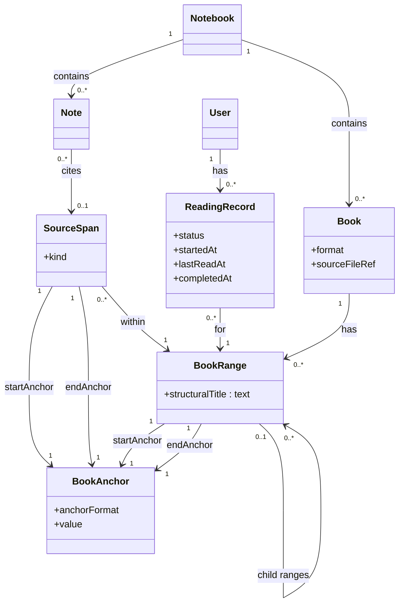

# Book reading in Doughnut — architecture roadmap

This document is **not** a delivery plan. It does not define phased user-visible work (for that, see `.cursor/rules/planning.mdc` and a future `ongoing/<short-name>.md` plan when one exists). It **is** the guideline for **architecture direction**: how we want concepts and boundaries to line up so implementation can stay coherent as features land.

**Companion:** market and product research stays in `ongoing/book-reading-research-report.md`. That report is now cross-walked to the vocabulary below.

**Living document:** When a book-reading plan is written and executed, **update this roadmap** so it stays the single place for “what we believe the shape of the system should be.” Do not duplicate long architecture prose inside the plan; link here instead.

---

## Intent

Separate concerns so one object does not have to mean everything at once:

| Concern | Question it answers |
|--------|---------------------|
| **Where** | A single precise point in a book file |
| **Which region** | A navigable or hierarchical chunk (section, “current reading unit”) |
| **Evidence** | The exact span a note is about |
| **Knowledge** | The user’s PKM note |
| **Progress** | Where the user is in the book, at chunk granularity |

---

## Core model (directional)

The diagram encodes **relationships we want to preserve** across PDF, EPUB, and future formats. Concrete storage types and APIs will evolve; the splits below should not collapse without an explicit decision.

### BookAnchor

The most precise locator: one place in the book. Examples over time: PDF coordinates, EPUB CFI, paragraph offsets, etc.

Keep the abstraction **open** early: `anchorFormat` + `value` (opaque until format-specific design is justified).

### BookRange

A region: `startAnchor` + `endAnchor`. Primary unit for **navigation**, **hierarchical decomposition**, and **progress**. Optional **`structuralTitle`** is the human-readable label for that node in the outline (e.g. `Chapter 3`, `2.4.1`). A breadcrumb-style path can be **derived** by walking parent ranges; we do not use a separate persisted “structural address” field.

### SourceSpan

Optional evidence on a **Note**: also start/end anchors, but purpose is **citation**, not navigation tree. May sit **within** a `BookRange` so a small quote still relates to the larger reading chunk.

### Note

Belongs to a `Notebook`. At most **one** `SourceSpan` for the first version—enough for anchored extraction without multi-evidence complexity until needed.

### ReadingRecord

Per `User`, refers to a `BookRange`. Progress attaches to **meaningful chunks**, not citation-sized spans.

---

## Architectural rules (default)

1. Every `BookRange` has exactly one `startAnchor` and one `endAnchor`.
2. Every `SourceSpan` has exactly one `startAnchor` and one `endAnchor`.
3. `ReadingRecord` points at a `BookRange`, not a `SourceSpan`.
4. `SourceSpan` is optional on `Note`.
5. Prefer `SourceSpan` to be smaller than or equal to the `BookRange` it sits within.

These are **defaults** for consistency; revisiting them is a roadmap-level change, not a silent refactor.

---

## Current directional choices

- **One span per note (initially):** Keeps PKM extraction simple; multi-span and cross-book evidence are explicit future extensions.
- **`structuralTitle` on `BookRange`:** Human-readable title for the range in the book’s structure tree; parent chain + title is enough to reconstruct display paths when needed.
- **No `StructuralBookRange` subtype yet:** Structural vs user-carved ranges may be distinguished later if the product requires it (e.g. import vs override).

---

## Open architecture questions

Revisit when implementation or product constraints clarify:

- Whether `BookAnchor.value` stays opaque text or becomes structured payload (e.g. JSON) per `anchorFormat`.
- Whether `ReadingRecord` needs finer-grained progress inside a range (percentage, character offset, etc.).
- Whether `BookRange` should distinguish imported outline ranges from user-created ranges.
- Whether `SourceSpan.kind` should classify text, image, figure, table, or mixed content for rendering and export.

---

## Anti-patterns (what this roadmap pushes against)

- **Single “range” type** for TOC node, reading cursor, highlight, and AI chunk—leads to muddy APIs and broken exports.
- **Progress on arbitrary citations**—makes re-entry and queue semantics harder than progress on `BookRange`.
- **Anchors that only mean “page number”**—insufficient for structure-first reading and EPUB; `BookAnchor` is the extension point.
