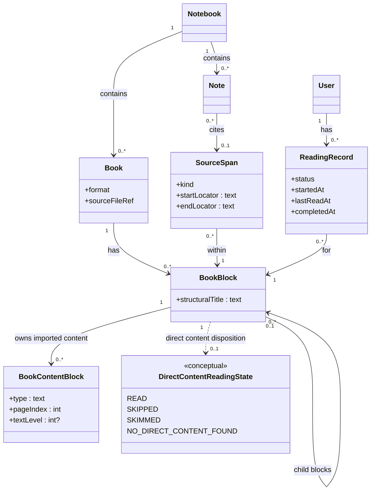

# Book reading in Doughnut — architecture roadmap

This document is **not** a delivery plan. It does not define phased user-visible work (for that, see `.cursor/rules/planning.mdc` and a future `ongoing/<short-name>.md` plan when one exists). It **is** the guideline for **architecture direction**: how we want concepts and boundaries to line up so implementation can stay coherent as features land.

**Companion:** market and product research stays in `ongoing/book-reading-research-report.md`. That report is now cross-walked to the vocabulary below. **UX/UI behavior** (drawer, PDF chrome, **Reading Control Panel**) — [`ongoing/book-reading-ux-ui-roadmap.md`](book-reading-ux-ui-roadmap.md).

**Living document:** When a book-reading plan is written and executed, **update this roadmap** so it stays the single place for “what we believe the shape of the system should be.” Do not duplicate long architecture prose inside the plan; link here instead. **Delivery plan for “Read a block of a book”:** [`ongoing/book-reading-read-a-block-plan.md`](book-reading-read-a-block-plan.md).

---

## Intent

Separate concerns so one object does not have to mean everything at once:

| Concern | Question it answers |
|--------|---------------------|
| **Where** | A single precise point in a book file |
| **Which region** | A navigable or hierarchical chunk (section, “current reading unit”) |
| **Imported content** | Which raw MinerU block belongs to which **book block** |
| **Direct content** | Material between this **book block** and the next in **document reading order**, ignoring nesting depth (see below) |
| **Evidence** | The exact span a note is about |
| **Knowledge** | The user’s PKM note |
| **Progress** | Where the user is in the book, at chunk granularity |

**BookSubtree:** A **book block** together with all its descendant blocks in the layout tree. This is a **derived** view for aggregates or UI when needed, not a persisted peer of **BookBlock**.

---

## Core model (directional)

The diagram encodes **relationships we want to preserve** across PDF, EPUB, and future formats. Concrete storage types and APIs will evolve; the splits below should not collapse without an explicit decision.

### BookBlock

A region: **navigation geometry** comes from **`allBboxes`** on **`GET …/book`**—an ordered list of **`PageBbox`** (page index + optional MinerU bbox in normalized page space). **`allBboxes[0]`** is the block start (derived from the structural heading’s imported raw data); further entries cover qualifying direct-content regions. Primary unit for **navigation**, **hierarchical decomposition**, and **progress**. **`structuralTitle`** is the human-readable label for that **book block** in the **book layout** (e.g. `Chapter 3`, `2.4.1`). A breadcrumb-style path can be **derived** by walking parent blocks; we do not use a separate persisted “structural address” field.

Each `BookBlock` also has a conceptual association to **direct content** (see next subsection).

When imported MinerU content appears before the first heading-like block (`text_level`), we create a synthetic root-level `BookBlock` titled **`*beginning*`**. Its first bbox uses the first orphan content block’s page and a synthetic bbox placed **one line height above** that content block (`height = y1 - y0`, `syntheticY0 = max(0, y0 - height)`, `syntheticY1 = y0`). This keeps the ownership rule below total: every imported content block belongs to exactly one `BookBlock`.

### BookContentBlock

Persisted import artifact for **MinerU `content_list` items**. A `BookContentBlock` is **not** a second navigation tree and **not** a progress record. Its job is to keep the raw imported reading stream attached to the structural `BookBlock` that owns it.

- Every imported MinerU item belongs to exactly one `BookBlock`.
- The heading item that introduces a `BookBlock` is represented on **`BookBlock`** (title + **`allBboxes[0]`** from its raw data); it is **not** duplicated as a `BookContentBlock` and is **not** counted as direct body content by default.
- Persist **queryable columns** needed by product logic (`type`, page index, bbox, optional `textLevel`, stable order within the owning block) plus the **raw payload** so unknown MinerU block types survive round-trip without schema churn.
- Unknown future MinerU block types are persisted intact but do **not** become direct content automatically; product logic opts them in later.

### Direct content (conceptual)

**Direct content** is whatever lies **between** one `BookBlock` and the **next** `BookBlock` in reading order, or **to the end of the book** if this block is the last **book block** in that order.

- The **book layout** may be **nested**, but direct content is **not** defined by nesting depth. It is always “from this **book block**’s start until the next **book block**’s start (or EOF),” following the same **linear reading order** the product uses to walk the tree (depth-first preorder is the natural default: parent, then subtree, then sibling).
- **Parent book block:** Its direct content is the material **between itself and its first child** (i.e. after this block’s start until the first child’s start). If there is no child, the next boundary is the same rule as for a leaf: the following **book block** in the walk, or EOF.
- **Last child in a subtree:** Its direct content runs **from its start until the next block after leaving that subtree** (the next sibling of an ancestor, or EOF)—not “until parent’s end,” unless the **book layout** order says so.

**Reading-record heuristics (e.g. “no meaningful gap”):** Any predicate over “the gap from **A**’s start to **B**’s start” applies to **every** consecutive pair (**A**, **B**) in that same walk—**siblings**, **parent → first child**, **last node in a subtree → next block after the subtree**, etc. It is **not** limited to same-depth blocks.

**Persistence and extraction:** For MinerU-backed PDF imports, we persist raw **`BookContentBlock`** rows grouped under each `BookBlock`. This gives reading-record **direct-content** heuristics (Phase 3, shipped) a stable source of truth for “does this block have direct content?” without introducing a second derived span table. We still do **not** require a stored extracted-text blob for the gap between blocks.

**No-direct-content default:** A `BookBlock` is treated as having **no direct content** when it owns **no non-structural** imported content block whose `type` is **`text`**, **`table`**, or **`image`**. The structural heading lives on **`BookBlock`** only (title + first bbox); legacy rows that look like a heading (`text` with `text_level` 1–3) are ignored by the predicate. **`header`**, **`footer`**, any type whose name starts with **`page_`** (page numbers, page footnotes, and future `page_*` kinds), and other unknown types are preserved but ignored by this predicate until product logic promotes them.

**Disposition (per block, conceptual):** How the user (or system) treats the direct content attached to a block can be classified for product logic:

| Disposition | Meaning (informal) |
|-------------|-------------------|
| **Direct content read** | The gap was read as intended. |
| **Direct content skipped** | The user skipped it. |
| **Direct content skimmed** | The user skimmed it (lighter than “read”). |
| **No direct content found** | There is no meaningful gap (e.g. adjacent anchors, or structure implies none). |

These dispositions are **not** persisted until the reading-record work lands; they document the **intended states** when we model reading behavior. The diagram shows them as **`DirectContentReadingState`** linked conceptually to `BookBlock`.

**UI surface (direction):** The user affirms direct-content disposition from a **Reading Control Panel** anchored **near the bottom of the PDF main pane**, expandable to full actions or **minimized** to one or two controls — see [`ongoing/book-reading-ux-ui-roadmap.md`](book-reading-ux-ui-roadmap.md). This keeps progress actions **book-local** and avoids competing with the **book layout** drawer or global chrome for primary attention.

### SourceSpan

Optional evidence on a **Note**: **citation** endpoints (not the navigation tree). **`startLocator`** / **`endLocator`** are placeholders in the diagram—concrete encoding (e.g. page + normalized bbox, EPUB CFI) is **TBD** when `SourceSpan` is implemented. May sit **within** a `BookBlock` so a small quote still relates to the larger reading chunk.

### Note

Belongs to a `Notebook`. At most **one** `SourceSpan` for the first version—enough for anchored extraction without multi-evidence complexity until needed.

### ReadingRecord

Per `User`, refers to a `BookBlock`. Progress attaches to **meaningful chunks**, not citation-sized spans.

**HTTP (as implemented for Phase 2 read disposition):** Rows are written with **`PUT /api/notebooks/{notebook}/book/blocks/{bookBlock}/reading-record`** (response body: full **reading-records** list for the current user and book, same JSON shape as **`GET`**) and listed with **`GET /api/notebooks/{notebook}/book/reading-records`**. **`GET …/book`** does **not** embed reading state on each `BookBlock`; the client merges layout + reading-records list when it needs borders or panel logic from the server.

**Last read view (Phase 10):** **`GET`/`PATCH /api/notebooks/{notebook}/book/reading-position`** stores PDF page index, normalized vertical position, and optional **`selectedBookBlockId`**. A **`PATCH`** body omits or sends **`selectedBookBlockId: null`** to leave the stored FK unchanged; a non-null id must belong to the notebook’s book.

---

## Architectural rules (default)

1. Every `BookBlock` has **`allBboxes`** with a well-defined first entry for block start (MinerU-normalized page + bbox where applicable); further entries optional for direct content.
2. When implemented, every `SourceSpan` has a **start** and **end** citation locator (shape **TBD**; not the same concern as block navigation).
3. `ReadingRecord` points at a `BookBlock`, not a `SourceSpan`.
4. `SourceSpan` is optional on `Note`.
5. Prefer `SourceSpan` to be smaller than or equal to the `BookBlock` it sits within.
6. **Direct content** is defined relative to **book layout reading order** and a block’s **start** boundary; it is **orthogonal** to how deep the block sits in the tree. **Disposition** is persisted via **`ReadingRecord`**; **materializing** the gap as extracted text/spans (if ever) is **out of scope** for this roadmap’s defaults until product asks for it.

These are **defaults** for consistency; revisiting them is a roadmap-level change, not a silent refactor.

---

## Current directional choices

- **One span per note (initially):** Keeps PKM extraction simple; multi-span and cross-book evidence are explicit future extensions.
- **`structuralTitle` on `BookBlock`:** Human-readable title for the block in the book’s structure tree; parent chain + title is enough to reconstruct display paths when needed.
- **No `StructuralBookBlock` subtype yet:** Structural vs user-carved blocks may be distinguished later if the product requires it (e.g. import vs override).
- **`GET …/book` layout wire:** Each block includes persisted **`depth`** (≥ 0); OpenAPI documents **`blocks`** as depth-first preorder matching ascending **`layout_sequence`**. The **browser reader** and **CLI `/attach` preview** derive tree shape from **array order** and **`depth`** only — no derived **`parentBlockId`** / **`siblingOrder`** on the wire ([`ongoing/book-reading-book-block-flat-outline-plan.md`](book-reading-book-block-flat-outline-plan.md) Phase 5).
- **`BookContentBlock` for MinerU imports:** Persist imported `content_list` **body** items separately from `BookBlock`, grouped by owning block (structural heading MinerU item is represented on `BookBlock` only, not duplicated as a `BookContentBlock`). This keeps `BookBlock` structural while giving direct-content heuristics a durable imported-content stream.
- **Direct content** remains a **product concept**, not a materialized “gap blob.” **Disposition** persistence is **`ReadingRecord`** rows + **`PUT`/`GET` reading-record APIs** per [`ongoing/book-reading-reading-record-plan.md`](book-reading-reading-record-plan.md); persisted `BookContentBlock` rows supply the import evidence for **`hasDirectContent`**. On the wire, each block on **`GET …/book`** exposes **`allBboxes`**: an ordered list of **`PageBbox`** (OpenAPI **`PageBbox_Full`** — page index + MinerU bbox in normalized page space). The **first** entry is the block start; further entries come from qualifying direct-content imported blocks. The reader uses the **last** entry as the bottom of direct content when **`allBboxes.length > 1`**. When the predecessor has no direct content, the reader **auto-marks** it read on successor entry (Phase 3, shipped); otherwise the **Reading Control Panel** is the primary explicit control — it appears when the bottom of the selected block’s last direct-content bbox is visible above the panel’s obstruction zone (geometry-gated), and remains available until the successor block becomes the viewport-derived current block; see [`ongoing/book-reading-ux-ui-roadmap.md`](book-reading-ux-ui-roadmap.md).

---

## Story 1 (shipped)

**Book** metadata plus **BookBlock** tree on a **Notebook**: **`POST /api/notebooks/{notebook}/attach-book`** (JSON **book layout** / `BookBlock` tree only) and **`GET /api/notebooks/{notebook}/book`**, at most one book per notebook. As shipped, **`sourceFileRef` is not used** and there is **no server-side PDF storage**; the PDF stayed on the client. Layout import supplies structural nodes with **`contentBlocks`**; the server derives **`allBboxes`** (MinerU page index + normalized bbox) for each **`BookBlock`**.

---

## Story 2 — Read a block (direction)

**Goal:** After CLI (or future UI) attach, the **same book the user reads in the browser** is the **file stored server-side**, with a reading UI that ties **book layout** navigation to **PDF position**.

| Decision | Direction |
|----------|-----------|
| **CLI + server** | **`/attach` in the CLI** uploads the PDF to the backend **via the same `attach-book` surface** as the rest of the product (extend the route to accept **book layout** JSON + file in one logical operation—e.g. multipart—or an equivalent single-user-visible “attach” that does not fork a second attach API). |
| **Blob storage** | **Production:** PDF bytes live in a **GCP bucket** (object key or URL recorded so `sourceFileRef` or equivalent can resolve the object). **Dev / automated tests:** a **local or test-local object store** (filesystem, emulator, or test-only bucket) so the **same E2E scenarios** run without requiring real GCP. |
| **Frontend PDF** | Render the book with **pdf.js** in the **main content** area of the book reading page. |
| **Chrome layout** | **Book layout** (`BookBlock` tree) lives in a **drawer sidebar** on the book reading page; the **PDF viewer occupies the main pane**. |
| **Sync** | **Two-way:** (1) **Selecting / activating a book block** in the layout drives **pdf.js** to the corresponding anchors (page / region). (2) **Scrolling (and relevant zoom / page changes) in the PDF** updates which block is **highlighted** as current in the layout. |

**Deletion:** Removing a book from the notebook (frontend flow) must **delete the persisted book record** and **remove the object** from the configured storage backend (GCS in prod, local/test store in dev).

**Plan:** Phased delivery is spelled out in [`ongoing/book-reading-read-a-block-plan.md`](book-reading-read-a-block-plan.md).

**Implemented so far (Story 2):** Phases **1–6** and **11–13** of that plan are shipped: multipart attach, **`GET …/book/file`**, **pdf.js** full scrollable viewer (`PdfBookViewer` using the **legacy** pdf.js stack — see **PDF.js build** below), the **book layout** from **`GET …/book`** in a **left** responsive drawer/panel (PDF in **`main`**; **768px** breakpoint: open by default on large, overlay + backdrop on small; **Book layout** control in **GlobalBar**), **layout → PDF** navigation from each block’s **`allBboxes`** (structured **`PageBbox`**: page index, optional bbox, chrome/safe-area offset, bad-target no-op), **PDF ↔ book layout** sync (viewport drives **current block** highlight on a **book block**, debounced, with accessible live region for title changes), responsive default PDF scale (full-width on narrow viewports, comfortable max-width cap on wide viewports based on first-page intrinsic geometry, with manual zoom preserved across resize), **GlobalBar** **`PdfControl`** zoom buttons + page indicator, and **PDF-only gesture zoom** (ctrl/meta + wheel and two-finger pinch on the viewer scroll container, shared **`pdfViewer.currentScale`**, `preventDefault` to avoid browser zoom). The book-reading E2E uses **OCR on rendered canvases** (Tesseract.js, committed language data under `e2e_test/tesseract/`) for page markers — **not** a product DOM text layer on top of the canvas.

**PDF.js build (current):** The app uses **pdf.js legacy** end-to-end (`pdfjs-dist/legacy/build/pdf.mjs`, `legacy/web/pdf_viewer.mjs` + CSS, `legacy/build/pdf.worker.mjs` wired from `frontend/src/lib/pdfjsWorker.ts`). The standard worker assumes **`Uint8Array.prototype.toHex`** (PDF fingerprints); **Cypress’s bundled Electron** is on an older Chromium without that API, which breaks PDF load (e.g. `hashOriginal.toHex is not a function`). Legacy bundles a polyfill; **main thread and worker must stay on the same build line** (mixing legacy worker + modern `getDocument` is unsupported).

**PDF.js build (future):** Switch back to the **non-legacy** pdf.js entrypoints once **Cypress upgrades its embedded Electron** to a Chromium that implements `Uint8Array.prototype.toHex` (or upstream pdf.js no longer requires it for our path). CI already runs E2E in Chrome; this matters most for **default `cypress run` (Electron)** and local parity.

**E2E fixture / MinerU mock migration (`refactoring.pdf`, committed JSON, real MinerU refresh):** Sub-phased delivery in [`ongoing/book-reading-e2e-refactoring-fixture-visible-ocr-plan.md`](book-reading-e2e-refactoring-fixture-visible-ocr-plan.md) — Phases **1–7** **shipped** (viewport OCR, same-page scenarios). **Coordinate contract:** MinerU pipeline **`content_list`** bboxes are **0–1000 normalized per page**, not PDF points; the reader converts with page `getViewport({ scale: 1 })` width/height, applies a small PDF-space **top padding** when scrolling to a **book block**, and compares **viewport midpoint** to anchor **`y0`** in the same 0–1000 system for the **current block**. **Temporary debug:** semi-transparent bbox overlay in `PdfBookViewer` (no border). Details, pdf.js scroll quirks, and E2E **`deltaPx`** tuning: **Important learnings** section in that plan.

---

## Open architecture questions

Revisit when implementation or product constraints clarify:

- How **`SourceSpan`** start/end locators should be typed when citations ship (parallel to **`PageBbox`** for PDF vs format-specific shapes).
- Whether `ReadingRecord` needs finer-grained progress inside a block (percentage, character offset, etc.).
- Whether `BookBlock` should distinguish blocks from the **imported book layout** from user-created blocks.
- Whether `SourceSpan.kind` should classify text, image, figure, table, or mixed content for rendering and export.
- Whether non-PDF formats (EPUB and later) should reuse the same persisted **`BookContentBlock`** shape or derive direct-content evidence another way.
- Whether some currently ignored MinerU block types should count as direct content beyond **`text`**, **`table`**, and **`image`**.

---

## Anti-patterns (what this roadmap pushes against)

- **Single overloaded type** for **book block**, reading cursor, highlight, and AI chunk—leads to muddy APIs and broken exports.
- **Progress on arbitrary citations**—makes re-entry and queue semantics harder than progress on `BookBlock`.
- **Locators that only mean “page number”**—insufficient for structure-first reading and EPUB; use **page + region** (e.g. **`PageBbox`**) or format-specific coordinates as the extension point.
