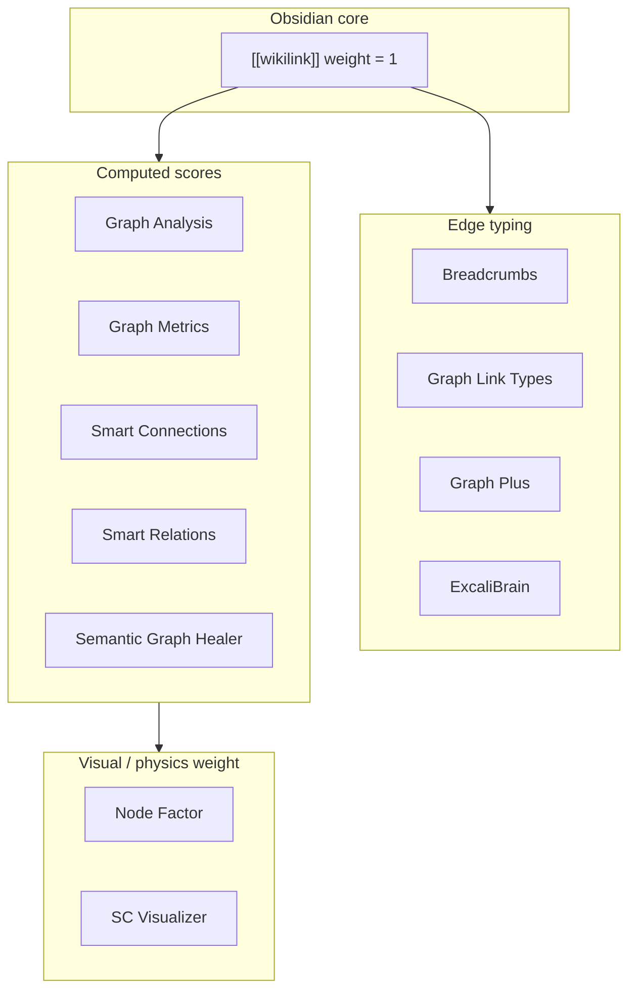

# Wiki link weight management in knowledge management systems

Research summary on how LLM Wiki–style systems and related PKM / knowledge-graph tools assign, compute, and use **weights** on wiki links — for visualization, retrieval, traversal, and LLM context assembly.

## Executive summary

“Wiki link weight” is not one concept. Systems use it in at least four distinct ways:

| Use | Question answered | Typical signals |
| --- | --- | --- |
| **Edge strength** | How strongly are two notes related? | Explicit author intent, typed predicates, co-citation, shared sources |
| **Traversal priority** | Which neighbors should an agent visit first? | Outgoing vs inbound, depth decay, spreading activation, edge type |
| **Node authority** | Which notes are central in the corpus? | In-degree, PageRank, betweenness, community bridges |
| **Retrieval fusion** | How much should graph proximity contribute vs keyword/vector match? | RRF weights, per-channel multipliers (BM25 / vector / graph) |

Karpathy’s original [LLM Wiki pattern](https://gist.github.com/karpathy/442a6bf555914893e9891c11519de94f) treats `[[wikilinks]]` as **binary, undirected hints** — no numeric weights. The most concrete production implementation of weighted wiki links today is [nashsu/llm_wiki](https://github.com/nashsu/llm_wiki), which layers a **4-signal relevance model** on top of wikilinks for graph visualization and query-time expansion. **Obsidian** (the de facto PKM host for LLM Wiki vaults) has **no native per-link weights**; the community fills the gap with plugins that compute **node authority**, **typed edges**, **semantic similarity scores**, and **configurable fusion weights** — see §2 for a plugin-by-plugin map. Broader PKM and graph-science literature adds **typed edges**, **confidence / lifecycle metadata**, and **spreading activation** as complementary mechanisms.

**Doughnut today** resolves and caches wiki links (`NoteWikiTitleCache`) but does not store per-link numeric weights. `FocusContextRetrievalService` uses **implicit** priorities: shallower BFS depth wins; at equal depth, outgoing links beat inbound references beat folder siblings; sampling caps decay by depth (`6 → 2 → 0`).

---

## 1. The LLM Wiki lineage

### 1.1 Karpathy’s original pattern (no explicit weights)

The foundational pattern is three layers — raw sources, LLM-maintained wiki, schema — and three operations — ingest, query, lint. Cross-references use `[[wikilink]]` syntax and `index.md` as a human/LLM catalog.

Links are **qualitative**: the LLM decides what to link during ingest; query reads `index.md` then drills into pages. There is no prescribed formula for edge strength, graph traversal, or rank fusion. At moderate scale (~100 sources, hundreds of pages), lexical navigation via `index.md` is sufficient.

### 1.2 LLM Wiki desktop app — 4-signal relevance model

The [nashsu/llm_wiki](https://github.com/nashsu/llm_wiki) implementation extends Karpathy’s pattern with an explicit **edge relevance score** used for graph UI and query retrieval.

**Per-edge signals (multiplicative weights on each signal type):**

| Signal | Multiplier | Meaning |
| --- | --- | --- |
| Direct `[[wikilink]]` | ×3.0 | Author/LLM explicitly linked two pages |
| Source overlap | ×4.0 | Both pages cite the same raw source (`sources[]` in YAML frontmatter) |
| Adamic–Adar | ×1.5 | Pages share neighbors; rare neighbors count more |
| Type affinity | ×1.0 | Same page type (entity↔entity, concept↔concept) |

**How weights are used:**

- **Visualization** — edge thickness/color maps to combined relevance (strong = green, weak = gray).
- **Query pipeline** — multi-phase retrieval:
  1. Tokenized search (title match bonus +10).
  2. Optional vector search (LanceDB) merged into search hits.
  3. **Graph expansion** — top search hits as seeds; 2-hop traversal with decay; neighbors ranked by combined search + graph relevance.
  4. Budget-controlled context assembly (configurable token window; default split 60% wiki / 20% chat / 5% index / 15% system).

**Structural analysis (not per-edge weights, but related):**

- Louvain community detection with cohesion scores.
- “Surprising connections” — cross-community / cross-type edges with composite surprise score.
- Knowledge gaps — low-degree isolates, sparse communities, bridge nodes.

**Design takeaway:** treat wikilinks as one signal among several; **provenance overlap** (shared sources) is weighted *higher* than direct links, reflecting that co-derived pages are strongly related even without an explicit wikilink.

### 1.3 LLM Wiki v2 extensions — lifecycle and typed graph

[Ben Miller’s LLM Wiki v2 gist](https://gist.github.com/benmillerat/537cd1251225cb58ef9b242212528633) and related commentary ([schema architecture reading](https://cozypet.github.io/llm-wiki-schema/)) argue that flat, eternal wikilinks are insufficient at scale.

**Confidence as claim weight (not edge weight per se):**

- Facts carry confidence from source count, recency, contradiction status.
- Confidence decays over time; reinforcement resets decay (Ebbinghaus-style).
- Supersession links (`supersedes`) preserve history while deprioritizing stale claims.

**Typed relationships as semantic edge weights:**

Predicates like `depends_on`, `contradicts`, `caused`, `supersedes` carry different traversal semantics — e.g. impact analysis walks `depends_on` / `uses`; lint walks `contradicts`. A generic `relates_to` is treated as lowest-information.

**Hybrid search at scale:**

- BM25 + vector + graph traversal, fused with **reciprocal rank fusion (RRF)**.
- `index.md` remains human-readable but is not the primary LLM retrieval mechanism past ~100–200 pages.

---

## 2. Obsidian and popular extensions

Obsidian is the reference PKM for `[[wikilink]]` vaults (LLM Wiki explicitly targets Obsidian compatibility). Core Obsidian treats every internal link as **weight 1**; extensions add numeric scores, typed semantics, or physics multipliers on top.

### 2.1 Obsidian core — what is (and is not) weighted

| Mechanism | Weight behavior | Notes |
| --- | --- | --- |
| **Graph view** | Node size ∝ in-degree + out-degree (both count) | [Official docs](https://obsidian.md/help/plugins/graph): “The more notes that link to a given note, the larger its circle.” Link thickness is a global display slider, not per-edge. |
| **Local graph** | Hop depth only (1, 2, 3…) | No relevance ranking within a hop; all neighbors at depth *n* are equal. |
| **Backlinks panel** | Unordered list | Separates **linked mentions** (`[[Note]]`) from **unlinked mentions** (title text without link). No strength score. |
| **Block references** | `[[Note#^block-id]]` | Same binary weight as file links; enables block-granular edges. |
| **Embeds** | `![[Note]]` | Treated as a connection type in some plugins (Graph Metrics); core graph does not distinguish embed vs link by default. |
| **Force simulation** | Global physics | Center / repel / link force / link distance — affects layout, not semantic retrieval. |

**Community tension** ([forum thread](https://forum.obsidian.md/t/graph-nodes-size-should-also-depend-on-word-count-in-addition-to-no-of-links/4093)): users want node size driven by **in-degree only** (authority), **word count**, or **tags** — but core Obsidian counts both directions equally and offers no per-link weight field.

**Implication:** Obsidian’s native model is “link exists or not.” Any numeric weight is **plugin-computed** or **metadata-derived**.

### 2.2 Plugin map — how extensions manage link weight

Extensions cluster into five roles. Most popular vaults combine 2–3 of these.



#### A. Node prominence (authority, not edge weight)

These rank **notes**, not individual links — useful for MOCs, hub detection, and “start here” navigation.

| Plugin | Metrics | How weight is used |
| --- | --- | --- |
| [Graph Metrics](https://github.com/Kaliser/graph-metrics-plugin) | PageRank, in/out-degree, eigenvector centrality, bridging coefficient, betweenness | Hub detection panel; path finding across connection types (wiki link, backlink, tag, embed). |
| [Graph Analysis](https://github.com/SkepticMystic/graph-analysis) | Jaccard similarity on neighbor sets | Ranks note pairs by shared-neighborhood overlap (content ignored). |
| [Semantic Graph Healer](https://github.com/lostpeanut09/semantic-graph-healer) | PageRank (fallback: degree centrality), Louvain, betweenness | Authority notes (top 5%), bridge detection, MOC suggestions for clusters ≥5. |

#### B. Pairwise edge / relatedness scores

These assign a **numeric score to note pairs** — closest to LLM Wiki’s relevance model.

| Plugin | Score signals | Default / notable weights |
| --- | --- | --- |
| [Graph Analysis](https://github.com/SkepticMystic/graph-analysis) | **Co-citations** (same note cites A and B; bonus if same sentence), **link prediction** (Adamic–Adar, common neighbours) | Co-citation count is the weight; proximity in text adds implicit boost. |
| [Semantic Graph Healer](https://github.com/lostpeanut09/semantic-graph-healer) | 3-way link-prediction blend: Adamic–Adar (0.30), Resource Allocation (0.30), Common Neighbours (0.10) + co-citation | Weighted blend for “missing ring” suggestions. |
| [Smart Connections](https://github.com/brianpetro/obsidian-smart-connections) | Cosine similarity of embeddings (note or block level) | Score is a **ranking signal**, not stored on the link. Pro: feedback-weighted scoring, exclude existing inlinks/outlinks. |
| [Smart Connections Visualizer](https://www.obsidianstats.com/plugins/smart-connections-visualizer) | Same similarity scores | **Distance and link thickness ∝ relevance**; min relevance threshold filter; hover shows score on edge label. |
| [Smart Relations](https://github.com/DMDerelyn/Obsidian-smart-relations) | BM25 + Jaccard tags + term overlap + graph BFS proximity | Default fusion: **0.40 / 0.20 / 0.20 / 0.20**; graph proximity decays by hop (1-hop highest). Writes `related:` frontmatter. |
| [LinkPilot](https://github.com/hqy2020/linkpilot-obsidian) | BM25 + pgvector + heuristics (tags, folder, backlink strength) | Vault-wide metrics (hub concentration, reciprocal ratio); AI link suggestions. |

**Smart Relations** is the closest Obsidian analogue to LLM Wiki’s multi-signal edge relevance — explicit configurable channel weights summing to 1.0.

#### C. Typed / hierarchical edges (categorical weight)

These add **edge type** so traversal can treat `parent` differently from `friend` or `contradicts`. Types are usually **not numeric** unless the user maps them manually.

| Plugin | How types are authored | Weight model |
| --- | --- | --- |
| [Breadcrumbs](https://github.com/SkepticMystic/breadcrumbs) | YAML / Dataview fields: `up`, `down`, `parent`, `child`, custom edge fields | Graph edges have `field`, `explicit` vs `implied`, `source`. **No numeric weight.** Sort by field name, path, explicitness. Implied edges reverse explicit ones (if A `parent→` B, then B implied `child→` A). |
| [ExcaliBrain](https://github.com/zsviczian/excalibrain) | Dataview fields + inferred wikilinks | Five roles: parent, child, friend, sibling, other-friend. Forward link → child; backlink → parent; mutual → friend. **Visual** weight via stroke style (inferred = dashed), not numeric. |
| [Graph Link Types](https://github.com/natefrisch01/Graph-Link-Types) | Dataview frontmatter / inline: `related:: [[Target]]` | Renders **type label** on graph edge (PIXI.js). No physics or retrieval weight. |
| [Graph Plus](https://github.com/NicolasOng/graph-plus) | Frontmatter wikilinks + inline fields | Color per type; **Link Forces** — directional force and **distance multiplier per link type** (physics weight). |
| [Juggl](https://juggl.io/juggl.html?mark=plugin) | Integrates Breadcrumbs hierarchies | Stylable link types; labeled edges; API for other plugins. |
| [obsidian-typed-links](https://github.com/Querulantenkind/obsidian-typed-links-plugin) | `[[extends::Target]]` prefix syntax | Predicate in link text; still one link per edge in graph index. |
| [obsidian-wikilink-types](https://github.com/penfieldlabs/obsidian-wikilink-types) | `@type` in alias → synced YAML | Multiple types per link; Dataview/Breadcrumbs-compatible frontmatter. |

**Breadcrumbs + ExcaliBrain + Graph Plus** form the most common “typed graph” stack: Breadcrumbs defines ontology, ExcaliBrain renders spatial hierarchy, Graph Plus applies per-type physics.

#### D. Configurable visual / layout multipliers

These let users tune how links affect **appearance**, which indirectly signals importance.

| Plugin | Controls | Default |
| --- | --- | --- |
| [Node Factor](https://github.com/CalfMoon/node-factor) | Forward link multiplier, backward link multiplier, character count per weight, descendant tree rollup, **manual per-file override** | Forward = 1, backward = 1; manual override wins all. |
| [Graph Plus](https://github.com/NicolasOng/graph-plus) | Per link-type: charge, link strength, collision, distance multiplier | User-defined per type in Link Forces sidebar. |
| [Supercharged Links](https://github.com/mdelobelle/obsidian_supercharged_links) | Style links by **target note** metadata (`priority`, `status`, tags) | Not graph edge weight — adds `data-link-priority` etc. to rendered `<a>` for CSS. Users can style `[data-link-priority="high"]` bolder. |

#### E. Connection surfacing (no scoring)

| Plugin | Behavior |
| --- | --- |
| [Strange New Worlds](https://github.com/TfTHacker/obsidian42-strange-new-worlds) | Badge count of backlink references on links/embeds/block refs; popover list. Count = implicit equal weight per referrer. `snw-index-exclude` frontmatter excludes note from counts. |

### 2.3 Obsidian patterns vs LLM Wiki 4-signal model

| Signal | LLM Wiki (nashsu) | Obsidian ecosystem equivalent |
| --- | --- | --- |
| Direct `[[wikilink]]` | ×3.0 | Core link = 1; Breadcrumbs/ExcaliBrain add type but not magnitude |
| Shared source | ×4.0 | No standard plugin; could approximate with shared `sources:` frontmatter + Dataview |
| Adamic–Adar | ×1.5 | Graph Analysis, Semantic Graph Healer (link prediction panels) |
| Type affinity | ×1.0 | Breadcrumbs field match, Graph Plus per-type forces, ExcaliBrain role |
| Semantic similarity | (via LanceDB in query) | Smart Connections, Smart Relations, LinkPilot |
| Co-citation | — | Graph Analysis (with sentence proximity bonus) |
| Graph BFS decay | 2-hop with decay in query | Smart Relations graph channel (0.20 default) |

**Gap in Obsidian:** no single first-party or dominant community plugin combines all four LLM Wiki signals into one persisted edge score. Users typically **stack** Smart Connections (semantic) + Graph Analysis (topology) + Breadcrumbs (typing) + Node Factor (visual).

### 2.4 Practical Obsidian stacks (by goal)

| Goal | Typical plugin combo |
| --- | --- |
| See hub notes | Graph Metrics (PageRank) or Semantic Graph Healer |
| Suggest missing links | Graph Analysis (Adamic–Adar / co-citation) or Semantic Graph Healer |
| Rank related notes while writing | Smart Connections (embeddings) or Smart Relations (4-channel fusion) |
| Typed ontology + hierarchy | Breadcrumbs + ExcaliBrain (+ Graph Link Types for labels) |
| Per-type graph physics | Graph Plus Link Forces |
| Custom node size formula | Node Factor |
| Style links by target priority | Supercharged Links + `priority` frontmatter |

### 2.5 Other PKM tools (non-Obsidian)

[semantic-graph-healer](https://github.com/lostpeanut09/semantic-graph-healer) is Obsidian-specific but listed above; external tools:

| Tool | Weight approach |
| --- | --- |
| [InfraNodus](https://infranodus.com/use-case/visualize-knowledge-graphs-pkm) | Imports Obsidian vaults; explicit backlinks + AI semantic edges; betweenness centrality for hub sizing. |
| [Tessellum](https://github.com/TianpeiLuke/Tessellum) | BM25 + vector + PageRank + best-first BFS over typed wikilinks. |
| [openclaw-penfield](https://github.com/penfieldlabs/openclaw-penfield) | Query API: `bm25_weight` 0.4, `vector_weight` 0.4, `graph_weight` 0.2; typed `penfield_connect` relationships. |

---

## 3. Graph-science mechanisms for link weight

### 3.1 When links have no native weight

Wikipedia’s hyperlink graph (and most PKM wikilinks) starts as **unweighted directed edges**. Research on [spreading activation over Wikipedia](https://aclanthology.org/W10-3506/) proposes deriving `w_ij` from topology:

| Scheme | Formula (intuition) | Effect |
| --- | --- | --- |
| Energy distribution (ED) | `w_ij = 1 / |N(v_i)|` | Hub pages dilute activation |
| Inverse link frequency (ILF) | log-smoothed IDF on in-degree | Boost paths through rare, specific pages |
| Normalized ILF | ILF scaled to [0,1] | Tunable boost without saturation |

Combined with **distance decay** `d^L` per hop and activation **threshold** `T`, spreading activation yields inter-concept similarity competitive with Wikipedia Link-based Measure (WLM) and Explicit Semantic Analysis (ESA).

**Parameters matter:** optimized setups used max path length 3, decay `d ≈ 0.4–0.5`, threshold `T ≈ 0.1` (ILF weighting).

### 3.2 Link prediction indices (pairwise edge weights)

For *potential* links between notes A and B that are not yet connected:

| Index | Idea | Best when |
| --- | --- | --- |
| **Adamic–Adar** | `Σ 1/log(deg(u))` over shared neighbors `u` | Sparse graphs; rare shared neighbors are strong evidence |
| **Resource allocation** | `Σ 1/deg(u)` over shared neighbors | Similar, slightly different degree normalization |
| **Common neighbors** | `|Γ(A) ∩ Γ(B)|` | Baseline; over-favors hubs |
| **Jaccard** | `|∩| / |∪|` on neighbor sets | Normalized overlap |
| **Preferential attachment** | `deg(A) × deg(B)` | Scale-free growth models |

LLM Wiki uses Adamic–Adar at ×1.5 in its 4-signal blend. semantic-graph-healer blends three indices for “missing ring” detection.

### 3.3 Node authority (not edge weight, but affects ranking)

| Metric | What it measures | PKM use |
| --- | --- | --- |
| **PageRank / ArticleRank** | Transitive importance via links | Find hub notes, MOC candidates |
| **Betweenness centrality** | Notes on many shortest paths | Bridge concepts between topics |
| **Degree centrality** | Raw link count | Obsidian default node sizing |
| **Louvain + cohesion** | Cluster tightness | Detect under-linked topic areas |

ArticleRank (Neo4j GDS) supports `relationshipWeightProperty` for **weighted** PageRank — each edge can carry an authored or computed weight.

### 3.4 Spreading activation for RAG (2025)

Recent work ([arXiv 2512.15922](https://arxiv.org/html/2512.15922), [sa-rag implementation](https://github.com/jomibg/sa-rag)) uses spreading activation on LLM-built knowledge graphs:

1. Seed from semantic search top-k documents.
2. Propagate activation: `a_j = min(a_j + Σ a_i · w_ij)` over k-hop subgraph.
3. **Rescale edge weights** with `w' = (w - c)/(1 - c)` (e.g. `c = 0.4`) to prevent context explosion.
4. Prune nodes below activation threshold `τ`.

Configurable knobs: `K_HOP`, `ACTIVATION_THRESHOLD`, `NORMALIZATION_PARAMETER`, `PRUNING_THRESHOLD`.

**Contrast with LLM Wiki:** LLM Wiki uses fixed signal multipliers and 2-hop decay for query expansion; SA-RAG uses iterative activation with thresholds for multi-hop QA.

---

## 4. Retrieval fusion: combining graph with text

When graph proximity must compete with keyword and embedding similarity, **score incompatibility** is the main problem (BM25 scores ≠ cosine distance ≠ graph distance).

**Reciprocal Rank Fusion (RRF)** is the dominant fusion method:

```
score(d) = Σ  weight_i / (k + rank_i(d))
```

- `k` ≈ 60 (smoothing constant; lower k favors top-rank consensus).
- Per-channel weights scale each retriever’s contribution.
- Typical starting weights: vector 0.4, keyword 0.3–0.5, graph 0.2–0.3 (domain-dependent).

LLM Wiki merges search + graph relevance **before** budget allocation (not pure RRF, but same intent). Penfield exposes weights explicitly. Elasticsearch, Qdrant, LangChain `EnsembleRetriever`, and LangChain4j `ReciprocalRankFuser` all implement RRF.

**Recommended pipeline pattern (from hybrid RAG literature):**

1. Parallel candidate generation (BM25 top-50, vector top-50, graph expansion top-N).
2. RRF fusion → top-50 unified.
3. Optional cross-encoder rerank → top-10 for LLM context.

---

## 5. Design patterns: how to “manage” wiki link weights

### 5.1 Authoring-time (human or LLM)

| Mechanism | Pros | Cons |
| --- | --- | --- |
| Plain `[[wikilink]]` | Zero friction; Obsidian-compatible | All edges equal; no negation or dependency semantics |
| Typed predicates | Rich traversal; lint for contradictions | Syntax/tooling burden; parser complexity |
| Frontmatter `sources[]` | Provenance-based weight without extra links | Requires ingest discipline |
| Explicit `weight: 0.8` on edge | Full control | Brittle; hard for LLM to maintain consistently |
| Confidence on claims | Lifecycle-aware truth | Not the same as link weight; needs supersession model |

**Practical consensus (LLM Wiki v2, named-edges guides):** prefer **typed relationships + provenance** over arbitrary floats on every link.

### 5.2 Compute-time (system-derived)

| Mechanism | When to use |
| --- | --- |
| Multi-signal edge score (LLM Wiki 4-signal) | Visualization + query expansion in wiki apps |
| Adamic–Adar / link prediction | Suggest missing links; surprising-connection detection |
| Spreading activation + hop decay | Multi-hop QA; focus-context expansion |
| PageRank / betweenness | Hub detection; “start here” recommendations |
| Co-citation (notes cited together) | Latent edges invisible to wikilink parser |
| Semantic similarity edges | Bridge gaps where authors never linked |

### 5.3 Consumption-time (retrieval / LLM context)

| Mechanism | When to use |
| --- | --- |
| BFS with depth-priority | Bounded token budgets (Doughnut focus context) |
| Best-first search by edge score | When edge weights exist and budget is tight |
| RRF across text + graph channels | Search boxes, agent tools, large wikis |
| Edge-type filters | Impact analysis (`depends_on` only), contradiction lint |
| Sampling caps by depth | Prevent hub pages from flooding context |

---

## 6. Doughnut current state and gaps

**What exists:**

- `WikiLinkResolver` — resolves `[[inner]]` tokens to `Note` targets (notebook-qualified or focus-notebook default).
- `NoteWikiTitleCache` — materialized outgoing links + inbound referrers for fast graph queries.
- `FocusContextRetrievalService` — BFS wiki expansion with:
  - Outgoing links > inbound references > folder siblings (tie-break).
  - Shallower depth always wins for the same note.
  - `sampleCapAtGraphDepth(d) = floor(6 / 3^(d-1))` for inbound/sibling sampling.
  - Token budget: 75% wiki / 25% folder peers (when peers enabled).
- Planned semantic search (`ongoing/semantic_search_implementation.md`) — vector similarity on note text; no graph channel yet.

**What is missing (relative to LLM Wiki / graph PKM frontier):**

- No persisted per-edge numeric weight.
- No typed link predicates in wiki syntax.
- No source-overlap or Adamic–Adar signals.
- No RRF between literal/vector search and graph expansion.
- No confidence / supersession lifecycle on claims.
- Graph expansion does not re-rank by inbound degree or PageRank — only edge-type and depth.

---

## 7. Recommendations for Doughnut (if pursuing weighted wiki links)

Ordered from lowest to highest implementation cost:

### Tier A — Implicit weights (no schema change)

1. **In-degree as inbound sampling priority** — when capping inbound references, prefer notes with stronger backlink overlap to the focus neighborhood (common-neighbor count) before random/seed sampling.
2. **Occurrence count** — multiple `[[same target]]` in one note could boost that edge (author emphasis).
3. **RRF fusion** — when semantic search ships, fuse vector ranks with graph BFS reachability ranks for MCP `get-note-graph` / search APIs.

### Tier B — Derived edge scores (computed, not authored)

1. **Multi-signal relevance** (LLM Wiki style) — direct link (base 1.0) + shared ancestor path + shared notebook + optional shared attachment/source metadata.
2. **2-hop expansion with decay** — `score *= decay^depth` (LLM Wiki uses 2-hop with decay in query pipeline).
3. **Link prediction suggestions** — Adamic–Adar on `NoteWikiTitleCache` for “notes you might link” UI.

### Tier C — Authored structure (schema + ingest)

1. **Typed properties** — Doughnut already has note properties; relationship-typed values could encode `depends_on` / `contradicts` without new wiki syntax.
2. **Provenance fields** — if notes gain source URIs or parent ingest IDs, source overlap becomes a strong edge signal (×4.0 in LLM Wiki).
3. **Confidence + supersession** — property or frontmatter on claims for spaced-repetition and AI context prioritization.

### Tier D — Full knowledge graph

1. Persist weighted edges in a graph table (`source_note_id`, `target_note_id`, `edge_type`, `weight`, `signals_json`).
2. Rebuild on `NoteWikiTitleCache` refresh; expose PageRank / community detection for notebook dashboards.
3. Spreading-activation retrieval for multi-hop agent queries.

---

## 8. Key references

| Resource | Topic |
| --- | --- |
| [Karpathy LLM Wiki gist](https://gist.github.com/karpathy/442a6bf555914893e9891c11519de94f) | Original pattern; binary wikilinks |
| [nashsu/llm_wiki](https://github.com/nashsu/llm_wiki) | 4-signal relevance, query pipeline, Louvain |
| [LLM Wiki v2 gist](https://gist.github.com/benmillerat/537cd1251225cb58ef9b242212528633) | Confidence, typed graph, RRF hybrid search |
| [Adamic–Adar index](https://en.wikipedia.org/wiki/Adamic%E2%80%93Adar_index) | Shared-neighbor link weighting |
| [Spreading activation (Wikipedia)](https://en.wikipedia.org/wiki/Spreading_activation) | Traversal with decay and edge weights |
| [Gouws et al. 2010 (ACL)](https://aclanthology.org/W10-3506/) | Wikipedia link weight schemes (ED, ILF, NILF) |
| [SA-RAG paper](https://arxiv.org/html/2512.15922) | Spreading activation for KG-RAG |
| [Neo4j ArticleRank](https://neo4j.com/docs/graph-data-science/current/algorithms/article-rank/) | Weighted PageRank variant |
| [Elasticsearch RRF](https://www.elastic.co/docs/reference/elasticsearch/rest-apis/reciprocal-rank-fusion) | Rank fusion without score normalization |
| [Obsidian Graph view help](https://obsidian.md/help/plugins/graph) | Core: degree-based sizing, hop depth, no edge scores |
| [Breadcrumbs docs](https://publish.obsidian.md/breadcrumbs-docs/Edge+Fields) | Typed edge fields; explicit vs implied |
| [Graph Metrics](https://github.com/Kaliser/graph-metrics-plugin) | PageRank, hub detection, path finding |
| [Graph Analysis](https://github.com/SkepticMystic/graph-analysis) | Co-citations, Adamic–Adar, Jaccard |
| [Smart Connections](https://github.com/brianpetro/obsidian-smart-connections) | Embedding similarity scores |
| [Smart Relations](https://github.com/DMDerelyn/Obsidian-smart-relations) | BM25 + tags + terms + graph fusion weights |
| [Graph Plus](https://github.com/NicolasOng/graph-plus) | Typed links + per-type link forces |
| [Node Factor](https://github.com/CalfMoon/node-factor) | Forward/backward link multipliers for node size |
| [ExcaliBrain](https://github.com/zsviczian/excalibrain) | Inferred + explicit hierarchical roles |
| [Named Edges agent guide](https://gist.github.com/ChristopherA/151aefa6a6bde1ce4fa6b1182656cebe) | Typed predicates in markdown |
| Doughnut `FocusContextRetrievalService` | Current BFS + edge-type priority |
| Doughnut `ongoing/semantic_search_implementation.md` | Planned vector retrieval (no graph channel yet) |

---

## 9. Open questions

1. **Should Doughnut weights be persisted or always derived?** Persisted weights enable incremental updates and authored overrides; derived weights stay simpler and avoid stale scores.
2. **Edge weight vs claim confidence?** LLM Wiki v2 separates “how related are these pages?” from “how true is this statement?” — conflating them confuses retrieval and lint.
3. **Symmetric or directed weights?** Wikilinks are directed (A→B); backlink count is asymmetric signal. LLM Wiki’s 4-signal model is symmetric on page pairs for visualization.
4. **Human-visible weights?** LLM Wiki shows edge scores on hover; Obsidian core hides semantics (Smart Connections Visualizer and Graph Analysis are exceptions). Exposing scores helps curation but adds noise.
5. **Obsidian-compatible metadata?** LLM Wiki vaults use YAML frontmatter; Doughnut could align typed-edge conventions with Breadcrumbs/Dataview (`parent::`, `sources:`) for import/export interoperability.
6. **Integration with spaced repetition?** Link weight to recall priority (SuperMemo spreading activation) is unexplored in Doughnut but aligned with the product’s memory loop.

---

*Research compiled 2026-06-06; Obsidian extension survey added same day. Scope: LLM Wiki ecosystem, Obsidian core + popular plugins, graph-retrieval literature; mapped to Doughnut’s wiki-link and focus-context infrastructure.*
